# 数据结构与算法之美

## 开篇词|从今天起，跨过“数据结构与算法”这道坎

你好，我是王争，毕业于西安交通大学计算机专业。现在回想起来，本科毕业的时候，我的编程水平其实是很差的。直到读研究生的时候，一个师兄给了我一本《算法导论》，说你可以看看，对你的编程会很有帮助。

没想到，从此我对算法的“迷恋”便一发不可收拾。之后，我如饥似渴地把图书馆里几乎所有数据结构和算法书籍都读了一遍。

我常常边读边练。没多久，我就发现，写代码的时候，我会不由自主考虑很多性能方面的问题。我写出时间复杂度高、空间复杂度高的垃圾代码越来越少了，算法能力提升了很多，编程能力也有了质的飞跃。得益于此，研究生毕业后，我直接进入 Google，从事 Google 翻译相关的开发工作。

这是我自己学习数据结构与算法的经历，现在，你可以想想你的情况。

- 是不是从学校开始，你就觉得数据结构难学，然后一直没认真学？
- 工作中，一遇到数据结构这个坑，你又发自本能地迅速避让，因为你觉得自己不懂，所以也不想深究，反正看起来无关大局？
- 当你想换工作面试，或者研究某个开源项目源码，亦或者和团队讨论某个非框架层面的高可用难题的时候，你又发现，自己的基础跟不上别人的节奏？

如果你是这种情况，其实你并不孤独，这不是你一个人遇到的问题。工作十年间，我见过许多程序员。他们有着各种各样的背景，有很多既有潜力又非常努力，但始终无法在自己现有水平上更进一步。

在技术圈里，我们经常喜欢谈论高大上的架构，比如高可用、微服务、服务治理等等。鲜有人关注代码层面的编程能力，而愿意沉下心来，花几个月时间啃一啃计算机基础知识、认认真真夯实基础的人，简直就是凤毛麟角。

我认识一位原来腾讯 T4 的技术大牛。在区块链大潮之前，他在腾讯工作了 10 多年，长期负责手机 QQ 后台整体建设。他经历了手机 QQ 从诞生到亿级用户在线的整个过程。后来他去了微众银行，有一天老板让他去做区块链。他用了不到半年时间，就把区块链的整个技术脉络摸清楚了。现在，他是微众银行的区块链负责人，微众科技创新产品部的老总。你说厉害不？你可以花半年时间就能精通一个新的领域吗？为什么他就可以做到？

我觉得这其中最重要的就是基础足够扎实。他曾经跟我说，像区块链、人工智能这些看似很新的技术，其实一点儿都不“新”。最初学编程的时候，他就把那些基础的知识都学透了。当面临行业变动、新技术更迭的时候，他不断发现，那些所谓的新技术，核心和本质的东西其实就是当初学的那些知识。掌握了这个“规律”之后，他学任何东西都很快，任何新技术都能快速迎头赶上。这就是他快速学习并且获得成功的秘诀。

所以说，**基础知识就像是一座大楼的地基，它决定了我们的技术高度。而要想快速做出点事情，前提条件一定是基础能力过硬，“内功”要到位**。

那技术人究竟都需要修炼哪些“内功”呢？我觉得，无外乎就是大学里的那些基础课程，操作系统、计算机网络、编译原理等等，当然还有数据结构和算法。

可是，我们都知道，像《算法导论》这些经典书籍，虽然很全面，但是过于理论，学起来非常枯燥；而市面很多课程大多缺失真实的开发场景，费劲学完感觉好像还是用不上，过不了几天就忘了。

所以，我尝试做**一个让你能真正受用的数据结构与算法课程，希望给你指明一个简洁、高效的学习路径，教你一个学习基础知识的通用方法** 。那么，关于专栏内容，我是怎样设计的呢？

1. 我根据自己研读数十本算法书籍和多年项目开发的经验，在众多的数据结构和算法中，精选了最实用的内容进行讲解。

2. 我不只会教你怎么用，还会告诉你，我们为什么需要这种数据结构和算法，一点点帮你捋清它们背后的设计思想，培养你举一反三的能力。

3. 对于每种数据结构和算法，我都会结合真实的软件开发案例来讲解，让你知道，数据结构和算法，究竟应该如何应用到实际的编码中。

为了**由浅入深**地带你学习，我把专栏分成四个**递进**的模块。

### 1. 入门篇

时间、空间复杂度分析是数据结构和算法中非常重要的知识点，贯穿整个专栏的学习过程。但同时也是比较难掌握的，所以我用了 2 节课来讲这部分内容，而且还举了大量的实例，让你一边学一边练，真正能掌握复杂度分析，为后面的学习铺路。

我希望通过这一模块，你能掌握时间、空间复杂度的概念，大 O 表示法的由来，各种复杂度分析技巧，以及最好、最坏、平均、均摊复杂度分析方法。之后，面对任何代码的复杂度分析，你都能游刃有余、毫不畏惧！

### 2. 基础篇

这部分是专栏中篇幅最大的内容，也是我们学习的重点，共有 26 节内容，涵盖了最基础、最常用的数据结构和算法。针对每种数据结构和算法，我都会结合具体的软件开发实例，由浅入深进行讲解，并适时总结一些实用“宝典”，保证你印象深刻、学有所用。

比如递归这一节，我会讲到，为什么递归代码比较难写？如何避免堆栈溢出？如何避免递归冗余计算？如何将递归代码转化为非递归代码？

### 3. 高级篇

这部分我会讲一些不是那么常用的数据结构和算法。虽然不常用，但是这些内容你也需要知道。设置这一部分的目的，是为了让你开拓视野，强化训练算法思维、逻辑思维。如果说学完基础部分可以考 80 分，那掌握这一部分就能让你成为尖子生！

### 4. 实战篇

我们整个专栏都是围绕数据结构和算法在具体软件实践中的应用来讲的，所以最后我会通过实战部分串讲一下前面讲到的数据结构和算法。我会拿一些开源项目、框架或者系统设计问题，剖析它们背后的数据结构和算法，让你有一个更加直观的感受。

人生路上，我们会遇到很多的坎。跨过去，你就可以成长，跨不过去就是困难和停滞。而在后面很长的一段时间里，你都需要为这个困难买单。对于我们技术人来说，更是这样。**既然数据结构和算法这个坎，我们总归是要跨过去，为什么不是现在呢？**

我很感激师兄当年给我的那本《算法导论》，这是我人生中为数不多的转折点之一。没有那本书，也可能就没有今天的我。我希望这个专栏也能成为你的一个人生转折点。

我希望，通过这个专栏，不仅能帮你跨过数据结构与算法这个坎，还能帮你掌握一种学习知识和技能的方法，帮你度过职场甚至人生的重要时刻！一起加油吧！

## 01 | 为什么要学习数据结构和算法？

你是不是觉得数据结构和算法，跟操作系统、计算机网络一样，是脱离实际工作的知识？可能除了面试，这辈子也用不着？

尽管计算机相关专业的同学在大学都学过这门课程，甚至很多培训机构也会培训这方面的知识，但是据我了解，很多程序员对数据结构和算法依旧一窍不通。还有一些人也只听说过数组、链表、快排这些最最基本的数据结构和算法，稍微复杂一点的就完全没概念。

当然，也有很多人说，自己实际工作中根本用不到数据结构和算法。所以，就算不懂这块知识，只要 Java API、开发框架用得熟练，照样可以把代码写得“飞”起来。事实真的是这样吗？

今天我们就来详细聊一聊，为什么要学习数据结构和算法。

### 想要通关大厂面试，千万别让数据结构和算法拖了后腿

很多大公司，比如 BAT、Google、Facebook，面试的时候都喜欢考算法、让人现场写代码。有些人虽然技术不错，但每次去面试都会“跪”在算法上，很是可惜。那你有没有想过，为什么这些大公司都喜欢考算法呢？

校招的时候，参加面试的学生通常没有实际项目经验，公司只能考察他们的基础知识是否牢固。社招就更不用说了，越是厉害的公司，越是注重考察数据结构与算法这类基础知识。相比短期能力，他们更看中你的长期潜力。

你可能要说了，我不懂数据结构与算法，照样找到了好工作啊。那我是不是就不用学数据结构和算法呢？当然不是，你别忘了，**我们学任何知识都是为了“用”的，是为了解决实际工作问题的**，学习数据结构和算法自然也不例外。

### 业务开发工程师，你真的愿意做一辈子 CRUD boy 吗？

如果你是一名业务开发工程师，你可能要说，我整天就是做数据库 CRUD（增删改查），哪里用得到数据结构和算法啊？

是的，对于大部分业务开发来说，我们平时可能更多的是利用已经封装好的现成的接口、类库来堆砌、翻译业务逻辑，很少需要自己实现数据结构和算法。但是，**不需要自己实现，并不代表什么都不需要了解。**

如果不知道这些类库背后的原理，不懂得时间、空间复杂度分析，你如何能用好、用对它们？存储某个业务数据的时候，你如何知道应该用 ArrayList，还是 Linked List 呢？调用了某个函数之后，你又该如何评估代码的性能和资源的消耗呢？

作为业务开发，我们会用到各种框架、中间件和底层系统，比如 Spring、RPC 框架、消息中间件、Redis 等等。**在这些基础框架中，一般都揉和了很多基础数据结构和算法的设计思想。**

比如，我们常用的 Key-Value 数据库 Redis 中，里面的有序集合是用什么数据结构来实现的呢？为什么要用跳表来实现呢？为什么不用二叉树呢？

如果你能弄明白这些底层原理，你就能更好地使用它们。即便出现问题，也很容易就能定位。因此，掌握数据结构和算法，不管对于阅读框架源码，还是理解其背后的设计思想，都是非常有用的。

在平时的工作中，数据结构和算法的应用到处可见。我来举一个你非常熟悉的例子：如何实时地统计业务接口的 99% 响应时间？

你可能最先想到，每次查询时，从小到大排序所有的响应时间，如果总共有 1200 个数据，那第 1188 个数据就是 99% 的响应时间。很显然，每次用这个方法查询的话都要排序，效率是非常低的。但是，如果你知道“堆”这个数据结构，用两个堆可以非常高效地解决这个问题。

### 基础架构研发工程师，写出达到开源水平的框架才是你的目标！

现在互联网上的技术文章、架构分享、开源项目满天飞，照猫画虎做一套基础框架并不难。我就拿 RPC 框架举例。

不同的公司、不同的人做出的 RPC 框架，架构设计思路都差不多，最后实现的功能也都差不多。但是有的人做出来的框架，Bug 很多、性能一般、扩展性也不好，只能在自己公司仅有的几个项目里面用一下。而有的人做的框架可以开源到 GitHub 上给很多人用，甚至被 Apache 收录。为什么会有这么大的差距呢？

我觉得，高手之间的竞争其实就在细节。这些细节包括：你用的算法是不是够优化，数据存取的效率是不是够高，内存是不是够节省等等。这些累积起来，决定了一个框架是不是优秀。所以，如果你还不懂数据结构和算法，没听说过大 O 复杂度分析，不知道怎么分析代码的时间复杂度和空间复杂度，那肯定说不过去了，赶紧来补一补吧！

### 对编程还有追求？不想被行业淘汰？那就不要只会写凑合能用的代码！

何为编程能力强？是代码的可读性好、健壮？还是扩展性好？我觉得没法列，也列不全。但是，在我看来，**性能好坏起码是其中一个非常重要的评判标准**。但是，如果你连代码的时间复杂度、空间复杂度都不知道怎么分析，怎么写出高性能的代码呢？

你可能会说，我在小公司工作，用户量很少，需要处理的数据量也很少，开发中不需要考虑那么多性能的问题，完成功能就可以，用什么数据结构和算法，差别根本不大。但是你真的想“十年如一日”地做一样的工作吗？

经常有人说，程序员 35 岁之后很容易陷入瓶颈，被行业淘汰，我觉得原因其实就在此。有的人写代码的时候，从来都不考虑非功能性的需求，只是完成功能，凑合能用就好；做事情的时候，也从来没有长远规划，只把眼前事情做好就满足了。

我曾经面试过很多大龄候选人，简历能写十几页，经历的项目有几十个，但是细看下来，每个项目都是重复地堆砌业务逻辑而已，完全没有难度递进，看不出有能力提升。久而久之，十年的积累可能跟一年的积累没有任何区别。这样的人，怎么不会被行业淘汰呢？

如果你在一家成熟的公司，或者 BAT 这样的大公司，面对的是千万级甚至亿级的用户，开发的是 TB、PB 级别数据的处理系统。性能几乎是开发过程中时刻都要考虑的问题。一个简单的 ArrayList、Linked List 的选择问题，就可能会产生成千上万倍的性能差别。这个时候，数据结构和算法的意义就完全凸显出来了。

其实，我觉得，数据结构和算法这个东西，如果你不去学，可能真的这辈子都用不到，也感受不到它的好。但是一旦掌握，你就会常常被它的强大威力所折服。之前你可能需要费很大劲儿来优化的代码，需要花很多心思来设计的架构，用了数据结构和算法之后，很容易就可以解决了。

### 内容小结

我们学习数据结构和算法，并不是为了死记硬背几个知识点。我们的目的是建立时间复杂度、空间复杂度意识，写出高质量的代码，能够设计基础架构，提升编程技能，训练逻辑思维，积攒人生经验，以此获得工作回报，实现你的价值，完善你的人生。

所以，不管你是业务开发工程师，还是基础架构工程师；不管你是初入职场的初级工程师，还是工作多年的资深架构师，又或者是想转人工智能、区块链这些热门领域的程序员，数据结构与算法作为计算机的基础知识、核心知识，都是必须要掌握的。

**掌握了数据结构与算法，你看待问题的深度，解决问题的角度就会完全不一样**。因为这样的你，就像是站在巨人的肩膀上，拿着生存利器行走世界。数据结构与算法，会为你的编程之路，甚至人生之路打开一扇通往新世界的大门。

## **02 |** 如何抓住重点，系统高效地学习数据结构与算法？

你是否曾跟我一样，因为看不懂数据结构和算法，而一度怀疑是自己太笨？实际上，很多人在第一次接触这门课时，都会有这种感觉，觉得数据结构和算法很抽象，晦涩难懂，宛如天书。正是这个原因，让很多初学者对这门课望而却步。

我个人觉得，其实真正的原因是你**没有找到好的学习方法，没有抓住学习的重点**。实际上，数据结构和算法的东西并不多，常用的、基础的知识点更是屈指可数。只要掌握了正确的学习方法，学起来并没有看上去那么难，更不需要什么高智商、厚底子。

还记得大学里每次考前老师都要划重点吗？今天，我就给你划划我们这门课的重点，再告诉你一些我总结的学习小窍门。相信有了这些之后，你学起来就会有的放矢、事半功倍了。

### 什么是数据结构？什么是算法？

大部分数据结构和算法教材，在开篇都会给这两个概念下一个明确的定义。但是，这些定义都很抽象，对理解这两个概念并没有实质性的帮助，反倒会让你陷入死抠定义的误区。毕竟，我们现在学习，并不是为了考试，所以，概念背得再牢，不会用也就没什么用。

**虽然我们说没必要深挖严格的定义，但是这并不等于不需要理解概念**。 下面我就从广义和狭义两个层面，来帮你理解数据结构与算法这两个概念。

从广义上讲，数据结构就是指一组数据的存储结构。算法就是操作数据的一组方法。

图书馆储藏书籍你肯定见过吧？为了方便查找，图书管理员一般会将书籍分门别类进行“存储”。按照一定规律编号，就是书籍这种“数据”的存储结构。

那我们如何来查找一本书呢？有很多种办法，你当然可以一本一本地找，也可以先根据书籍类别的编号，是人文，还是科学、计算机，来定位书架，然后再依次查找。笼统地说，这些查找方法都是算法。

从狭义上讲，也就是我们专栏要讲的，是指某些著名的数据结构和算法，比如队列、栈、堆、二分查找、动态规划等。这些都是前人智慧的结晶，我们可以直接拿来用。我们要讲的这些经典数据结构和算法，都是前人从很多实际操作场景中抽象出来的，经过非常多的求证和检验，可以高效地帮助我们解决很多实际的开发问题。

那数据结构和算法有什么关系呢？为什么大部分书都把这两个东西放到一块儿来讲呢？

这是因为，数据结构和算法是相辅相成的。**数据结构是为算法服务的，算法要作用在特定的数据结构之上**。 因此，我们无法孤立数据结构来讲算法，也无法孤立算法来讲数据结构。

比如，因为数组具有随机访问的特点，常用的二分查找算法需要用数组来存储数据。但如果我们选择链表这种数据结构，二分查找算法就无法工作了，因为链表并不支持随机访问。

数据结构是静态的，它只是组织数据的一种方式。如果不在它的基础上操作、构建算法，孤立存在的数据结构就是没用的。

现在你对数据结构与算法是不是有了比较清晰的理解了呢？有了这些储备，下面我们来看看，究竟该怎么学数据结构与算法。

### 学习这个专栏需要什么基础？

看到数据结构和算法里的“算法”两个字，很多人就会联想到“数学”，觉得算法会涉及到很多深奥的数学知识。那我数学基础不是很好，学起来会不会很吃力啊？

数据结构和算法课程确实会涉及一些数学方面的推理、证明，尤其是在分析某个算法的时间、空间复杂度的时候，但是这个你完全不需要担心。

这个专栏不会像《算法导论》那样，里面有非常复杂的数学证明和推理。我会由浅入深，从概念到应用，一点一点给你解释清楚。你只要有高中数学水平，就完全可以学习。

当然，我希望你最好有些编程基础，如果有项目经验就更好了。这样我给你讲数据结构和算法如何提高效率、如何节省存储空间，你就会有很直观的感受。因为，对于每个概念和实现过程，我都会从实际场景出发，不仅教你“**是什么**”，还会教你“**为什么**”，并且告诉你遇到同类型问题应该“**怎么做**”。

### 学习的重点在什么地方？

提到数据结构和算法，很多人就很头疼，因为这里面的内容实在是太多了。这里，我就帮你梳理一下，应该先学什么，后学什么。你可以对照看看，你属于哪个阶段，然后有针对地进行学习。

想要学习数据结构与算法，**首先要掌握一个数据结构与算法中最重要的概念——复杂度分析**。

这个概念究竟有多重要呢？可以这么说，它几乎占了数据结构和算法这门课的半壁江山，是数据结构和算法学习的精髓。

数据结构和算法解决的是如何更省、更快地存储和处理数据的问题，因此，我们就需要一个考量效率和资源消耗的方法，这就是复杂度分析方法。所以，如果你只掌握了数据结构和算法的特点、用法，但是没有学会复杂度分析，那就相当于只知道操作口诀，而没掌握心法。只有把心法了然于胸，才能做到无招胜有招！

所以，复杂度分析这个内容，我会用很大篇幅给你讲透。你也一定要花大力气来啃，必须要拿下，并且要搞得非常熟练。否则，后面的数据结构和算法也很难学好。

搞定复杂度分析，下面就要进入**数据结构与算法的正文内容**了。

为了让你对数据结构和算法能有个全面的认识，我画了一张图，里面几乎涵盖了所有数据结构和算法书籍中都会讲到的知识点。

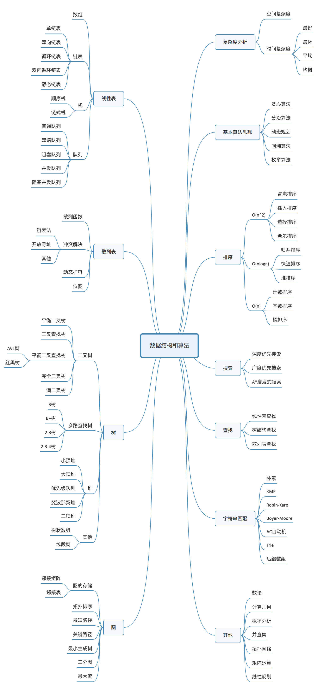

但是，作为初学者，或者一个非算法工程师来说，你并不需要掌握图里面的所有知识点。很多高级的数据结构与算法，比如二分图、最大流等，这些在我们平常的开发中很少会用到。所以，你暂时可以不用看。我还是那句话，咱们学习要学会找重点。如果不分重点地学习，眉毛胡子一把抓，学起来肯定会比较吃力。

所以，结合我自己的学习心得，还有这些年的面试、开发经验，我总结了**20 个最常用的、最基础**数据结构与算法，**不管是应付面试还是工作需要，只要集中精力逐一攻克这 20 个知识点就足够了**。

这里面有：

- 10 个数据结构：**数组、链表、栈、队列、散列表、二叉树、堆、跳表、图、Trie树**；
- 10 个算法：**递归、排序、二分查找、搜索、哈希算法、贪心算法、分治算法、回溯算法、动态规划、字符串匹配算法**。

掌握了这些基础的数据结构和算法，再学更加复杂的数据结构和算法，就会非常容易、非常快。

在学习数据结构和算法的过程中，你也要注意，不要只是死记硬背，不要为了学习而学习，而是**要学习它的“来历”、“自身的特点”、“适合解决的问题”以及“实际的应用场景”**。对于每一种数据结构或算法，我都会从这几个方面进行详细讲解。只要你掌握了我每节课里讲的内容，就能在开发中灵活应用。

学习数据结构和算法的过程，是非常好的思维训练的过程，所以，千万不要被动地记忆，要多辩证地思考，多问为什么。如果你一直这么坚持做，你会发现，等你学完之后，写代码的时候就会不由自主地考虑到很多性能方面的事情，时间复杂度、空间复杂度非常高的垃圾代码出现的次数就会越来越少。你的编程内功就真正得到了修炼。

### 一些可以让你事半功倍的学习技巧

前面我给你划了学习的重点，也讲了学习这门课需要具备的基础。作为一个过来人，现在我就给你分享一下，专栏学习的一些技巧。掌握了这些技巧，可以让你化被动为主动，学起来更加轻松，更加有动力！

#### 1. 边学边练，适度刷题

“边学边练”这一招非常有用。建议你每周花 1～2 个小时的时间，集中把这周的三节内容涉及的数据结构和算法，全都自己写出来，用代码实现一遍。这样一定会比单纯地看或者听的效果要好很多！

有面试需求的同学，可能会问了，那我还要不要去刷题呢？

我个人的观点是**可以“适度”刷题，但一定不要浪费太多时间在刷题上。我们学习的目的还是掌握，然后应用**。除非你要面试 Google、Facebook 这样的公司，它们的算法题目非常非常难，必须大量刷题，才能在短期内提升应试正确率。如果是应对国内公司的技术面试，即便是 BAT 这样的公司，你只要彻底掌握这个专栏的内容，就足以应对。

#### 2. 多问、多思考、多互动

**学习最好的方法是，找到几个人一起学习，一块儿讨论切磋，有问题及时寻求老师答疑**。但是，离开大学之后，既没有同学也没有老师，这个条件就比较难具备了。

不过，这也就是咱们专栏学习的优势。专栏里有很多跟你一样的学习者。你可以多在留言区写下自己的疑问、思考和总结，也可以经常看看别人的留言，和他们进行互动。

除此之外，如果你有疑问，你可以随时在留言区给我留言，我只要有空就会及时回复你。你不要担心问的问题太小白。因为我初学的时候，也常常会被一些小白问题困扰。不懂一点都不丢人，只要你勇敢提出来，我们一起解决了就可以了。

我也会力争每节课都最大限度地给你讲透，帮你扫除知识盲点，而你要做的就是，避免一知半解，要想尽一切办法去搞懂我讲的所有内容。

#### 3. 打怪升级学习法

**学习的过程中，我们碰到最大的问题就是，坚持不下来**。 是的，很多基础课程学起来都非常枯燥。为此，我自己总结了一套“打怪升级学习法”。

游戏你肯定玩过吧？为什么很多看起来非常简单又没有乐趣的游戏，你会玩得不亦乐乎呢？这是因为，当你努力打到一定级别之后，每天看着自己的经验值、战斗力在慢慢提高，那种每天都在一点一点成长的成就感就不由自主地产生了。

所以，**我们在枯燥的学习过程中，也可以给自己设立一个切实可行的目标**，就像打怪升级一样。

比如，针对这个专栏，你就可以设立这样一个目标：每节课后的思考题都认真思考，并且回复到留言区。当你看到很多人给你点赞之后，你就会为了每次都能发一个漂亮的留言，而更加认真地学习。

当然，还有很多其他的目标，比如，每节课后都写一篇学习笔记或者学习心得；或者你还可以每节课都找一下我讲得不对、不合理的地方……诸如此类，你可以总结一个适合你的“打怪升级攻略”。

如果你能这样学习一段时间，不仅能收获到知识，你还会有意想不到的成就感。因为，这其实帮你改掉了一点学习的坏习惯。这个习惯一旦改掉了，你的人生也会变得不一样。

#### 4. 知识需要沉淀，不要想试图一下子掌握所有

在学习的过程中，一定会碰到“拦路虎”。如果哪个知识点没有怎么学懂，不要着急，这是正常的。因为，想听一遍、看一遍就把所有知识掌握，这肯定是不可能的。**学习知识的过程是反复迭代、不断沉淀的过程**。

如果碰到“拦路虎”，你可以尽情地在留言区问我，也可以先沉淀一下，过几天再重新学一遍。所谓，书读百遍其义自见，我觉得是很有道理的！

我讲的这些学习方法，不仅仅针对咱们这一个课程的学习，其实完全适用任何知识的学习过程。你可以通过这个专栏的学习，实践一下这些方法。如果效果不错，再推广到之后的学习过程中。

### 内容小结

今天，我带你划了划数据结构和算法的学习重点，复杂度分析，以及 10 个数据结构和 10个算法。

这些内容是我根据平时的学习和工作、面试经验积累，精心筛选出来的。只要掌握这些内容，应付日常的面试、工作，基本不会有问题。

除此之外，我还给你分享了我总结的一些学习技巧，比如边学边练、多问、多思考，还有两个比较通用的学习方法，打怪升级法和沉淀法。掌握了这些学习技巧，可以让你学习过程中事半功倍。所以，你一定要好好实践哦！

## 03 | 复杂度分析（上）：如何分析、统计算法的执行效率和资源消耗？

我们都知道，数据结构和算法本身解决的是“快”和“省”的问题，即如何让代码运行得更快，如何让代码更省存储空间。所以，执行效率是算法一个非常重要的考量指标。那如何来衡量你编写的算法代码的执行效率呢？这里就要用到我们今天要讲的内容：时间、空间复杂度分析。

其实，只要讲到数据结构与算法，就一定离不开时间、空间复杂度分析。而且，我个人认为，**复杂度分析是整个算法学习的精髓，只要掌握了它，数据结构和算法的内容基本上就掌握了一半**。

复杂度分析实在太重要了，因此我准备用两节内容来讲。希望你学完这个内容之后，无论在任何场景下，面对任何代码的复杂度分析，你都能做到“庖丁解牛”般游刃有余。

### 为什么需要复杂度分析？

你可能会有些疑惑，我把代码跑一遍，通过统计、监控，就能得到算法执行的时间和占用的内存大小。为什么还要做时间、空间复杂度分析呢？这种分析方法能比我实实在在跑一遍得到的数据更准确吗？

首先，我可以肯定地说，你这种评估算法执行效率的方法是正确的。很多数据结构和算法书籍还给这种方法起了一个名字，叫**事后统计法**。但是，这种统计方法有非常大的局限性。

#### 事后统计法

通过统计、监控，利用计算机计时器对不同算法的运行时间进行比较，从而确定算法效率的高低，但有非常大的局限性。

#### 1. 测试结果非常依赖测试环境

测试环境中硬件的不同会对测试结果有很大的影响。比如，我们拿同样一段代码，分别用 Intel Core i9 处理器和 Intel Core i3 处理器来运行，不用说，i9 处理器要比 i3 处理器执行的速度快很多。还有，比如原本在这台机器上 a 代码执行的速度比 b 代码要快，等我们换到另一台机器上时，可能会有截然相反的结果。

#### 2. 测试结果受数据规模的影响很大

后面我们会讲排序算法，我们先拿它举个例子。对同一个排序算法，待排序数据的有序度不一样，排序的执行时间就会有很大的差别。极端情况下，如果数据已经是有序的，那排序算法不需要做任何操作，执行时间就会非常短。除此之外，如果测试数据规模太小，测试结果可能无法真实地反映算法的性能。比如，对于小规模的数据排序，插入排序可能反倒会比快速排序要快！

所以，**我们需要一个不用具体的测试数据来测试，就可以粗略地估计算法的执行效率的方法**。这就是我们今天要讲的时间、空间复杂度分析方法。

#### 事前分析估算

在计算机程序编制前，依据统计方法对算法进行估算。

### 大 O 复杂度表示法

算法的执行效率，粗略地讲，就是算法代码执行的时间。但是，如何在不运行代码的情况下，用“肉眼”得到一段代码的执行时间呢？

这里有段非常简单的代码，求 1,2,3...n 的累加和。现在，我就带你一块来估算一下这段代码的执行时间。

```c
 int cal(int n) {
   int sum = 0;
   int i = 1;
   for (; i <= n; ++i) {
     sum = sum + i;
   }
   return sum;
 }
```

从 CPU 的角度来看，这段代码的每一行都执行着类似的操作：**读数据 - 运算 - 写数据**。尽管每行代码对应的 CPU 执行的个数、执行的时间都不一样，但是，我们这里只是粗略估计，所以可以假设每行代码执行的时间都一样，为 $unitTime$。在这个假设的基础之上，这段代码的总执行时间是多少呢？

第 2、3 行代码分别需要 1 个 unit_time 的执行时间，第 4、5 行都运行了 n 遍，所以需要 $2n*unitTime$​ 的执行时间，所以这段代码总的执行时间就是 $(2n+2)*unitTime$​​。可以看出来，**所有代码的执行时间 $T(n)$ 与每行代码的执行次数成正比**。

按照这个分析思路，我们再来看这段代码。

```c
 int cal(int n) {
   int sum = 0;
   int i = 1;
   int j = 1;
   for (; i <= n; ++i) {
     j = 1;
     for (; j <= n; ++j) {
       sum = sum +  i * j;
     }
   }
 }
```

我们依旧假设每个语句的执行时间是 $unitTime$​。那这段代码的总执行时间 $T(n)$​ 是多少呢？

第 2、3、4 行代码，每行都需要 1 个 $unitTime$​ 的执行时间，第 5、6 行代码循环执行了 n 遍，需要 $2n*unitTime$​ 的执行时间，第 7、8 行代码循环执行了 $n^2$​ 遍，所以需要 $2n^2*unitTime$​ 的执行时间。所以，整段代码总的执行时间 $T(n)=(2n^2+2n+3)*unitTime$​​​​​​​​​​。

尽管我们不知道 $unitTime$ 的具体值，但是通过这两段代码执行时间的推导过程，我们可以得到一个非常重要的规律，那就是，**所有代码的执行时间 $T(n) $与每行代码的执行次数 $f(n) $​成正比**。

我们可以把这个规律总结成一个公式。注意，大 O 就要登场了！$T(n) = O(f(n))$

我来具体解释一下这个公式。其中，$T(n)$ 我们已经讲过了，它表示代码执行的时间；n 表示数据规模的大小；$f(n) $表示每行代码执行的次数总和。因为这是一个公式，所以用 f(n) 来表示。公式中的 O，表示代码的执行时间 $T(n)$ 与 $f(n)$​表达式成正比。

所以，第一个例子中的 $T(n)=O(2n+2)$​，第二个例子中的 $T(n)=O(2n^2+2n+3)$​。这就是**大 O 时间复杂度表示法**。大 O 时间复杂度实际上并不具体表示代码真正的执行时间，而是表示**代码执行时间随数据规模增长的变化趋势**，所以，也叫作**渐进时间复杂度**（asymptotic time complexity），简称**时间复杂度**。

当 n 很大时，你可以把它想象成 10000、100000。而公式中的低阶、常量、系数三部分并不左右增长趋势，所以都可以忽略。我们只需要记录一个最大量级就可以了，如果用大 O 表示法表示刚讲的那两段代码的时间复杂度，就可以记为：$T(n)=O(n)$​​；$T(n)=O(n^2)$​​。

### 时间复杂度分析

前面介绍了大 O 时间复杂度的由来和表示方法。现在我们来看下，如何分析一段代码的时间复杂度？我这儿有三个比较实用的方法可以分享给你。

#### 1. 只关注循环执行次数最多的一段代码

我刚才说了，大 O 这种复杂度表示方法只是表示一种变化趋势。我们通常会忽略掉公式中的常量、低阶、系数，只需要记录一个最大阶的量级就可以了。所以，我们在分析一个算法、一段代码的时间复杂度的时候，也只关注循环执行次数最多的那一段代码就可以了。这段核心代码执行次数的 n 的量级，就是整段要分析代码的时间复杂度。

为了便于你理解，我还是拿前面的例子来说明。

```c
 int cal(int n) {
   int sum = 0;
   int i = 1;
   for (; i <= n; ++i) {
     sum = sum + i;
   }
   return sum;
 }
```

其中第 2、3 行代码都是常量级的执行时间，与 n 的大小无关，所以对于复杂度并没有影响。循环执行次数最多的是第 4、5 行代码，所以这块代码要重点分析。前面我们也讲过，这两行代码被执行了 n 次，所以总的时间复杂度就是$O(n)$。

#### 2. 加法法则：总复杂度等于量级最大的那段代码的复杂度

我这里还有一段代码。你可以先试着分析一下，然后再往下看跟我的分析思路是否一样。

```c
int cal(int n) {
   int sum_1 = 0;
   int p = 1;
   for (; p < 100; ++p) {
     sum_1 = sum_1 + p;
   }

   int sum_2 = 0;
   int q = 1;
   for (; q < n; ++q) {
     sum_2 = sum_2 + q;
   }
 
   int sum_3 = 0;
   int i = 1;
   int j = 1;
   for (; i <= n; ++i) {
     j = 1; 
     for (; j <= n; ++j) {
       sum_3 = sum_3 +  i * j;
     }
   }
 
   return sum_1 + sum_2 + sum_3;
 }
```

这个代码分为三部分，分别是求 sum_1、sum_2、sum_3。我们可以分别分析每一部分的时间复杂度，然后把它们放到一块儿，再取一个量级最大的作为整段代码的复杂度。

第一段的时间复杂度是多少呢？这段代码循环执行了 100 次，所以是一个常量的执行时间，跟 n 的规模无关。

这里我要再强调一下，即便这段代码循环 10000 次、100000 次，只要是一个已知的数，跟 n 无关，照样也是常量级的执行时间。当 n 无限大的时候，就可以忽略。尽管对代码的执行时间会有很大影响，但是回到时间复杂度的概念来说，它表示的是一个算法执行效率与数据规模增长的变化趋势，所以不管常量的执行时间多大，我们都可以忽略掉。因为它本身对增长趋势并没有影响。

那第二段代码和第三段代码的时间复杂度是多少呢？答案是 O(n) 和 $O(n^2)$，你应该能容易就分析出来，我就不啰嗦了。

综合这三段代码的时间复杂度，我们取其中最大的量级。所以，整段代码的时间复杂度就为$O(n^2)$。也就是说：总的时间复杂度就等于量级最大的那段代码的时间复杂度。那我们将这个规律抽象成公式就是：

如果 $T_1(n)=O(f(n))$​​​，$T_2(n)=O(g(n))$​​​，那么$T(n) = T_1(n)+T_2(n) = max(O(f(n)),O(g(n))) = O(max(f(n),g(n)))$​​​

#### 3. 乘法法则：嵌套代码的复杂度等于嵌套内外代码复杂度的乘积

我刚讲了一个复杂度分析中的加法法则，这儿还有一个乘法法则。类比一下，你应该能“猜到”公式是什么样子的吧？

如果 $T_1(n)=O(f(n))$​​​,$T_2(n)=O(g(n))$​​​，那么$T(n)= T_1(n)*T_2(n) = O(f(n))*O(g(n)) = O(f(n)*g(n))$​​​​

也就是说，假设$T_1(n)=O(n)$​​​​，$T_2(n)=O(n^2)$​​​​，则 $T_1(n)*T_2(n)=O(n^3)$​​​​。落实到具体的代码上，我们可以把乘法法则看成是**嵌套循环**，我举个例子给你解释一下。

```c
int cal(int n) {
   int ret = 0; 
   int i = 1;
   for (; i < n; ++i) {
     ret = ret + f(i);
   } 
 } 
 
 int f(int n) {
  int sum = 0;
  int i = 1;
  for (; i < n; ++i) {
    sum = sum + i;
  } 
  return sum;
 }
```

我们单独看 cal() 函数。假设 f() 只是一个普通的操作，那第 4～6 行的时间复杂度就是，$T_1(n)=O(n)$​​​​。但 f() 函数本身不是一个简单的操作，它的时间复杂度是 $T_2(n)=O(n)$​​​​，所以，整个 cal() 函数的时间复杂度就是，$T(n)=T_1(n)*T_2(n)=O(n*n)=O(n^2)$​​​​​。

我刚刚讲了三种复杂度的分析技巧。不过，你并不用刻意去记忆。实际上，复杂度分析这个东西关键在于“熟练”。你只要多看案例，多分析，就能做到“无招胜有招”。

### 几种常见时间复杂度实例分析

虽然代码千差万别，但是常见的复杂度量级并不多。我稍微总结了一下，这些复杂度量级几乎涵盖了你今后可以接触的所有代码的复杂度量级。

> 复杂度量级（按数量级递增）:
>
> 1. 常量阶 $O(1)$
> 2. 对数阶 $O(logn)$
> 3. 线性阶 $O(n)$
> 4. 线性对数阶 $O(nlogn)$
> 5. 平方阶 $O(n^2)$、立方阶 $O(n^3)$​ ...... k次方阶 $O(n^k)$
> 6. 指数阶 $O(2^n)$
> 7. 阶乘阶 $O(n!)$

对于刚罗列的复杂度量级，我们可以粗略地分为两类，**多项式量级**和**非多项式量级**。其中，非多项式量级只有两个：$O(2n)$ 和 $O(n!)$。

我们把时间复杂度为非多项式量级的算法问题叫作 **NP**（Non-Deterministic Polynomial，非确定多项式）**问题**。

当数据规模 n 越来越大时，非多项式量级算法的执行时间会急剧增加，求解问题的执行时间会无限增长。所以，非多项式时间复杂度的算法其实是非常低效的算法。因此，关于 NP 时间复杂度我就不展开讲了。我们主要来看几种常见的**多项式时间复杂度**。

#### 1. $O(1)$

首先你必须明确一个概念，$O(1)$​只是常量级时间复杂度的一种表示方法，并不是指只执行了一行代码。比如这段代码，即便有 3 行，它的时间复杂度也是 $O(1)$​，而不是 $O(3)$​。

```c
 int i = 8;
 int j = 6;
 int sum = i + j;
```

我稍微总结一下，只要代码的执行时间不随 n 的增大而增长，这样代码的时间复杂度我们都记作 $O(1)$。或者说，**一般情况下，只要算法中不存在循环语句、递归语句，即使有成千上万行的代码，其时间复杂度也是$Ο(1)$**。

#### 2. $O(logn)$、$O(nlogn)$

对数阶时间复杂度非常常见，同时也是最难分析的一种时间复杂度。我通过一个例子来说明一下。

```c
 i=1;
 while (i <= n)  {
   i = i * 2;
 }
```

根据我们前面讲的复杂度分析方法，第三行代码是循环执行次数最多的。所以，我们只要能计算出这行代码被执行了多少次，就能知道整段代码的时间复杂度。

从代码中可以看出，变量 i 的值从 1 开始取，每循环一次就乘以 2。当大于 n 时，循环结束。还记得我们高中学过的等比数列吗？实际上，变量 i 的取值就是一个等比数列。如果我把它一个一个列出来，就应该是这个样子的：
$$
2^0 2^1 2^2 ...2^k ...2^x = n
$$
所以，我们只要知道 x 值是多少，就知道这行代码执行的次数了。通过 $2x=n$求解 x 这个问题我们想高中应该就学过了，我就不多说了。$x=log_2n$，所以，这段代码的时间复杂度就是 $ O(log_2n) $​​​。

现在，我把代码稍微改下，你再看看，这段代码的时间复杂度是多少？

```c
 i=1;
 while (i <= n)  {
   i = i * 3;
 }
```

根据我刚刚讲的思路，很简单就能看出来，这段代码的时间复杂度为 $O(log_3n)$。

实际上，不管是以 2 为底、以 3 为底，还是以 10 为底，我们可以把所有对数阶的时间复杂度都记为 $O(logn)$。为什么呢？

我们知道，对数之间是可以互相转换的，$log_3n$​​ 就等于 $log_32 * log_2n$​​，所以 $O(log_3n) = O(C*log_2n)$​，其中 $C=log_{3}{2}$​​是一个常量。基于我们前面的一个理论：**在采用大 O 标记复杂度的时候，可以忽略系数，即 $O(Cf(n)) = O(f(n))$**​。所以，$O(log_2n)$​就等于 $O(log_3n)$​。因此，在对数阶时间复杂度的表示方法里，我们忽略对数的“底”，统一表示为 $O(logn)$​。

如果你理解了我前面讲的 $O(logn)$，那 $O(nlogn)$ 就很容易理解了。还记得我们刚讲的乘法法则吗？如果一段代码的时间复杂度是 $O(logn)$，我们循环执行 n 遍，时间复杂度就是 $O(nlogn)$ 了。而且，$O(nlogn)$ 也是一种非常常见的算法时间复杂度。比如，归并排序、快速排序的时间复杂度都是 $O(nlogn)$。

#### 3. $O(m+n)$​、$O(m*n)$

我们再来讲一种跟前面都不一样的时间复杂度，代码的复杂度**由两个数据的规模**来决定。老规矩，先看代码！

```c
int cal(int m, int n) {
  int sum_1 = 0;
  int i = 1;
  for (; i < m; ++i) {
    sum_1 = sum_1 + i;
  }

  int sum_2 = 0;
  int j = 1;
  for (; j < n; ++j) {
    sum_2 = sum_2 + j;
  }

  return sum_1 + sum_2;
}
```

从代码中可以看出，m 和 n 是表示两个数据规模。我们无法事先评估 m 和 n 谁的量级大，所以我们在表示复杂度的时候，就不能简单地利用加法法则，省略掉其中一个。所以，上面代码的时间复杂度就是 $O(m+n)$。

针对这种情况，原来的加法法则就不正确了，我们需要将加法规则改为：$T_1(m) + T_2(n) = O(f(m) + g(n))$​。但是乘法法则继续有效：$T_1(m)*T_2(n) = O(f(m) * f(n))$​。

### 空间复杂度分析

前面，咱们花了很长时间讲大 O 表示法和时间复杂度分析，理解了前面讲的内容，空间复杂度分析方法学起来就非常简单了。

前面我讲过，时间复杂度的全称是**渐进时间复杂度**，表示**算法的执行时间与数据规模之间的增长关系**。类比一下，空间复杂度全称就是**渐进空间复杂度**（asymptotic space complexity），表示**算法的存储空间与数据规模之间的增长关系**。

我还是拿具体的例子来给你说明。（这段代码有点“傻”，一般没人会这么写，我这么写只是为了方便给你解释。）

```c
void print(int n) {
  int i = 0;
  int[] a = new int[n];
  for (i; i <n; ++i) {
    a[i] = i * i;
  }

  for (i = n-1; i >= 0; --i) {
    print out a[i]
  }
}
```

跟时间复杂度分析一样，我们可以看到，第 2 行代码中，我们申请了一个空间存储变量 i，但是它是常量阶的，跟数据规模 n 没有关系，所以我们可以忽略。第 3 行申请了一个大小为 n 的 int 类型数组，除此之外，剩下的代码都没有占用更多的空间，所以整段代码的空间复杂度就是 $O(n)$。

我们常见的空间复杂度就是 $O(1)$​、$O(n)$​、$O(n^2)$​，像 $O(logn)$​、$O(nlogn)$​ 这样的对数阶复杂度平时都用不到。而且，空间复杂度分析比时间复杂度分析要简单很多。所以，对于空间复杂度，掌握刚我说的这些内容已经足够了。

### 内容小结

基础复杂度分析的知识到此就讲完了，我们来总结一下。

复杂度也叫渐进复杂度，包括时间复杂度和空间复杂度，用来分析算法执行效率与数据规模之间的增长关系，可以粗略地表示，越高阶复杂度的算法，执行效率越低。常见的复杂度并不多，从低阶到高阶有：$O(1)$、$O(logn)$、$O(n)$、$O(nlogn)$、$O(n^2)$。等你学完整个专栏之后，你就会发现几乎所有的数据结构和算法的复杂度都跑不出这几个。


**复杂度分析并不难，关键在于多练**。 之后讲后面的内容时，我还会带你详细地分析每一种数据结构和算法的时间、空间复杂度。只要跟着我的思路学习、练习，你很快就能和我一样，每次看到代码的时候，简单的一眼就能看出其复杂度，难的稍微分析一下就能得出答案。

## 04 | 复杂度分析（下）：浅析最好、最坏、平均、均摊时间复杂度

上一节，我们讲了复杂度的大 O 表示法和几个分析技巧，还举了一些常见复杂度分析的例子，比如 $O(1)$、$O(logn)$、$O(n)$、$O(nlogn)$ 复杂度分析。掌握了这些内容，对于复杂度分析这个知识点，你已经可以到及格线了。但是，我想你肯定不会满足于此。

今天我会继续给你讲四个复杂度分析方面的知识点，

1. **最好情况时间复杂度**（best case time complexity）、
2. **最坏情况时间复杂度**（worst case time complexity）、
3. **平均情况时间复杂度**（average case time complexity）、
4. **均摊时间复杂度**（amortized time complexity）。

如果这几个概念你都能掌握，那对你来说，复杂度分析这部分内容就没什么大问题了。

### 最好、最坏情况时间复杂度

上一节我举的分析复杂度的例子都很简单，今天我们来看一个稍微复杂的。你可以用我上节教你的分析技巧，自己先试着分析一下这段代码的时间复杂度。

```c
// n表示数组array的长度
int find(int[] array, int n, int x) {
  int i = 0;
  int pos = -1;
  for (; i < n; ++i) {
    if (array[i] == x) pos = i;
  }
  return pos;
}
```

你应该可以看出来，这段代码要实现的功能是，在一个无序的数组（array）中，查找变量 x 出现的位置。如果没有找到，就返回 -1。按照上节课讲的分析方法，这段代码的复杂度是 $O(n)$，其中，n 代表数组的长度。

我们在数组中查找一个数据，并不需要每次都把整个数组都遍历一遍，因为有可能中途找到就可以提前结束循环了。但是，这段代码写得不够高效。我们可以这样优化一下这段查找代码。

```c
// n表示数组array的长度
int find(int[] array, int n, int x) {
  int i = 0;
  int pos = -1;
  for (; i < n; ++i) {
    if (array[i] == x) {
       pos = i;
       break;
    }
  }
  return pos;
}
```

这个时候，问题就来了。我们优化完之后，这段代码的时间复杂度还是 O(n) 吗？很显然，咱们上一节讲的分析方法，解决不了这个问题。

因为，要查找的变量 x 可能出现在数组的任意位置。如果数组中第一个元素正好是要查找的变量 x，那就不需要继续遍历剩下的 $n-1$ 个数据了，那时间复杂度就是 $O(1)$。但如果数组中不存在变量 x，那我们就需要把整个数组都遍历一遍，时间复杂度就成了 $O(n)$。所以，不同的情况下，这段代码的时间复杂度是不一样的。

为了表示代码在不同情况下的不同时间复杂度，我们需要引入三个概念：最好情况时间复杂度、最坏情况时间复杂度和平均情况时间复杂度。

顾名思义，**最好情况时间复杂度就是，在最理想的情况下，执行这段代码的时间复杂度**。就像我们刚刚讲到的，在最理想的情况下，要查找的变量 x 正好是数组的第一个元素，这个时候对应的时间复杂度就是最好情况时间复杂度。

同理，**最坏情况时间复杂度就是，在最糟糕的情况下，执行这段代码的时间复杂度**。就像刚举的那个例子，如果数组中没有要查找的变量 x，我们需要把整个数组都遍历一遍才行，所以这种最糟糕情况下对应的时间复杂度就是最坏情况时间复杂度。

### 平均情况时间复杂度

我们都知道，最好情况时间复杂度和最坏情况时间复杂度对应的都是极端情况下的代码复杂度，发生的概率其实并不大。为了更好地表示平均情况下的复杂度，我们需要引入另一个概念：平均情况时间复杂度，后面我简称为平均时间复杂度。

平均时间复杂度又该怎么分析呢？我还是借助刚才查找变量 x 的例子来给你解释。

要查找的变量 x 在数组中的位置，有 $n+1$​​ 种情况：在数组的 $0～n-1$​​ 位置中和不在数组中。我们把每种情况下，查找需要遍历的元素个数累加起来，然后再除以 $n+1$​​，就可以得到需要遍历的元素个数的平均值，即：
$$
\frac{1+2+3+...+n+n}{n+1}=\frac{n(n+3)}{2(n+1)}
$$
我们知道，时间复杂度的大 O 标记法中，可以省略掉系数、低阶、常量，所以，咱们把刚刚这个公式简化之后，得到的平均时间复杂度就是 O(n)。

这个结论虽然是正确的，但是计算过程稍微有点儿问题。究竟是什么问题呢？我们刚讲的这 n+1 种情况，出现的概率并不是一样的。我带你具体分析一下。（这里要稍微用到一点儿概率论的知识，不过非常简单，你不用担心。）

我们知道，要查找的变量 x，要么在数组里，要么就不在数组里。这两种情况对应的概率统计起来很麻烦，为了方便你理解，我们假设在数组中与不在数组中的概率都为 1/2。另外，要查找的数据出现在 0～n-1 这 n 个位置的概率也是一样的，为 1/n。所以，根据概率乘法法则，要查找的数据出现在 0～n-1 中任意位置的概率就是 1/(2n)。

因此，前面的推导过程中存在的最大问题就是，没有将各种情况发生的概率考虑进去。如果我们把每种情况发生的概率也考虑进去，那平均时间复杂度的计算过程就变成了这样：
$$
1*\frac{1}{2n}+2*\frac{1}{2n}+3*\frac{1}{2n}+...+n*\frac{1}{2n}+n*\frac{1}{2}=\frac{3n+1}{4}
$$
这个值就是概率论中的**加权平均值**，也叫作**期望值**，所以平均时间复杂度的全称应该叫**加权平均时间复杂度**或者**期望时间复杂度**。

引入概率之后，前面那段代码的加权平均值为 $\frac{(3n+1)}{4}$​。用大 O 表示法来表示，去掉系数和常量，这段代码的加权平均时间复杂度仍然是 $O(n)$。

你可能会说，平均时间复杂度分析好复杂啊，还要涉及概率论的知识。实际上，在大多数情况下，我们并不需要区分最好、最坏、平均情况时间复杂度三种情况。像我们上一节课举的那些例子那样，很多时候，我们使用一个复杂度就可以满足需求了。只有同一块代码在不同的情况下，时间复杂度有量级的差距，我们才会使用这三种复杂度表示法来区分。

### 均摊时间复杂度

到此为止，你应该已经掌握了算法复杂度分析的大部分内容了。下面我要给你讲一个更加高级的概念，均摊时间复杂度，以及它对应的分析方法，摊还分析（或者叫平摊分析）。

均摊时间复杂度，听起来跟平均时间复杂度有点儿像。对于初学者来说，这两个概念确实非常容易弄混。我前面说了，大部分情况下，我们并不需要区分最好、最坏、平均三种复杂度。平均复杂度只在某些特殊情况下才会用到，而均摊时间复杂度应用的场景比它更加特殊、更加有限。

老规矩，我还是借助一个具体的例子来帮助你理解。（当然，这个例子只是我为了方便讲解想出来的，实际上没人会这么写。）

```c
 // array表示一个长度为n的数组
 // 代码中的array.length就等于n
 int[] array = new int[n];
 int count = 0;
 
 void insert(int val) {
    if (count == array.length) {
       int sum = 0;
       for (int i = 0; i < array.length; ++i) {
          sum = sum + array[i];
       }
       array[0] = sum;
       count = 1;
    }

    array[count] = val;
    ++count;
 }
```

我先来解释一下这段代码。这段代码实现了一个往数组中插入数据的功能。当数组满了之后，也就是代码中的 `count == array.length` 时，我们用 for 循环遍历数组求和，并清空数组，将求和之后的 sum 值放到数组的第一个位置，然后再将新的数据插入。但如果数组一开始就有空闲空间，则直接将数据插入数组。

那这段代码的时间复杂度是多少呢？你可以先用我们刚讲到的三种时间复杂度的分析方法来分析一下。

最理想的情况下，数组中有空闲空间，我们只需要将数据插入到数组下标为 count 的位置就可以了，所以最好情况时间复杂度为 $O(1)$。最坏的情况下，数组中没有空闲空间了，我们需要先做一次数组的遍历求和，然后再将数据插入，所以最坏情况时间复杂度为 $O(n)$。

那平均时间复杂度是多少呢？答案是 $O(1)$。我们还是可以通过前面讲的概率论的方法来分析。

假设数组的长度是 n，根据数据插入的位置的不同，我们可以分为 n 种情况，每种情况的时间复杂度是 O(1)。除此之外，还有一种“额外”的情况，就是在数组没有空闲空间时插入一个数据，这个时候的时间复杂度是 O(n)。而且，这 n+1 种情况发生的概率一样，都是 1/(n+1)。所以，根据加权平均的计算方法，我们求得的平均时间复杂度就是：
$$
1*\frac{1}{n+1}+1*\frac{1}{n+1}+...+1*\frac{1}{n+1}+n*\frac{1}{n+1}=O(1)
$$
至此为止，前面的最好、最坏、平均时间复杂度的计算，理解起来应该都没有问题。但是这个例子里的平均复杂度分析其实并不需要这么复杂，不需要引入概率论的知识。这是为什么呢？我们先来对比一下这个 insert() 的例子和前面那个 find() 的例子，你就会发现这两者有很大差别。

首先，find() 函数在极端情况下，复杂度才为 $O(1)$。但 insert() 在大部分情况下，时间复杂度都为 $O(1)$。只有个别情况下，复杂度才比较高，为 $O(n)$​。这是 insert()**第一个**区别于 find() 的地方。

我们再来看**第二个**不同的地方。对于 insert() 函数来说，$O(1)$ 时间复杂度的插入和 $O(n)$ 时间复杂度的插入，出现的频率是非常有规律的，而且有一定的前后时序关系，一般都是一个 $O(n)$ 插入之后，紧跟着 $n-1$ 个 $O(1)$ 的插入操作，循环往复。

所以，针对这样一种特殊场景的复杂度分析，我们并不需要像之前讲平均复杂度分析方法那样，找出所有的输入情况及相应的发生概率，然后再计算加权平均值。

针对这种特殊的场景，我们引入了一种更加简单的分析方法：**摊还分析法**，通过摊还分析得到的时间复杂度我们起了一个名字，叫**均摊时间复杂度**。

那究竟如何使用摊还分析法来分析算法的均摊时间复杂度呢？

我们还是继续看在数组中插入数据的这个例子。每一次 $O(n)$ 的插入操作，都会跟着$n-1$ 次 $O(1)$ 的插入操作，所以把耗时多的那次操作均摊到接下来的 $n-1$ 次耗时少的操作上，均摊下来，这一组连续的操作的均摊时间复杂度就是 $O(1)$。这就是均摊分析的大致思路。你都理解了吗？

均摊时间复杂度和摊还分析应用场景比较特殊，所以我们并不会经常用到。为了方便你理解、记忆，我这里简单总结一下它们的应用场景。如果你遇到了，知道是怎么回事儿就行了。

对一个数据结构进行一组连续操作中，大部分情况下时间复杂度都很低，只有个别情况下时间复杂度比较高，而且这些操作之间存在前后连贯的时序关系，这个时候，我们就可以将这一组操作放在一块儿分析，看是否能将较高时间复杂度那次操作的耗时，平摊到其他那些时间复杂度比较低的操作上。而且，在能够应用均摊时间复杂度分析的场合，一般均摊时间复杂度就等于最好情况时间复杂度。

尽管很多数据结构和算法书籍都花了很大力气来区分平均时间复杂度和均摊时间复杂度，但其实我个人认为，**均摊时间复杂度就是一种特殊的平均时间复杂度**，我们没必要花太多精力去区分它们。你最应该掌握的是它的分析方法，摊还分析。至于分析出来的结果是叫平均还是叫均摊，这只是个说法，并不重要。

### 内容小结

今天我们学习了几个复杂度分析相关的概念，分别有：最好情况时间复杂度、最坏情况时间复杂度、平均情况时间复杂度、均摊时间复杂度。之所以引入这几个复杂度概念，是因为，同一段代码，在不同输入的情况下，复杂度量级有可能是不一样的。

在引入这几个概念之后，我们可以更加全面地表示一段代码的执行效率。而且，这几个概念理解起来都不难。最好、最坏情况下的时间复杂度分析起来比较简单，但平均、均摊两个复杂度分析相对比较复杂。如果你觉得理解得还不是很深入，不用担心，在后续具体的数据结构和算法学习中，我们可以继续慢慢实践！

## 05 | 数组：为什么很多编程语言中数组都从0开始编号？

提到数组，我想你肯定不陌生，甚至还会自信地说，它很简单啊。

是的，在每一种编程语言中，基本都会有数组这种数据类型。不过，它不仅仅是一种编程语言中的数据类型，还是一种最基础的数据结构。尽管数组看起来非常基础、简单，但是我估计很多人都并没有理解这个基础数据结构的精髓。

在大部分编程语言中，数组都是从 0 开始编号的，但你是否下意识地想过，**为什么数组要从 0 开始编号，而不是从 1 开始呢**？ 从 1 开始不是更符合人类的思维习惯吗？

你可以带着这个问题来学习接下来的内容。

### 如何实现随机访问？

什么是数组？我估计你心中已经有了答案。不过，我还是想用专业的话来给你做下解释。**数组（Array）是一种线性表数据结构。它用一组连续的内存空间，来存储一组具有相同类型的数据**。

这个定义里有几个关键词，理解了这几个关键词，我想你就能彻底掌握数组的概念了。下面就从我的角度分别给你“点拨”一下。

第一是**线性表**（Linear List）。顾名思义，线性表就是数据排成像一条线一样的结构。每个线性表上的数据最多只有前和后两个方向。其实除了数组，链表、队列、栈等也是线性表结构。


而与它相对立的概念是**非线性表**，比如二叉树、堆、图等。之所以叫非线性，是因为，在非线性表中，数据之间并不是简单的前后关系。


第二个是**连续的内存空间和相同类型的数据**。正是因为这两个限制，它才有了一个堪称“杀手锏”的特性：“随机访问”。但有利就有弊，这两个限制也让数组的很多操作变得非常低效，比如要想在数组中删除、插入一个数据，为了保证连续性，就需要做大量的数据搬移工作。

说到数据的访问，那你知道数组是如何实现根据下标随机访问数组元素的吗？

我们拿一个长度为 10 的 int 类型的数组 int[] a = new int[10]来举例。在我画的这个图中，计算机给数组 a[10]，分配了一块连续内存空间 1000～1039，其中，内存块的首地址为 base_address = 1000。

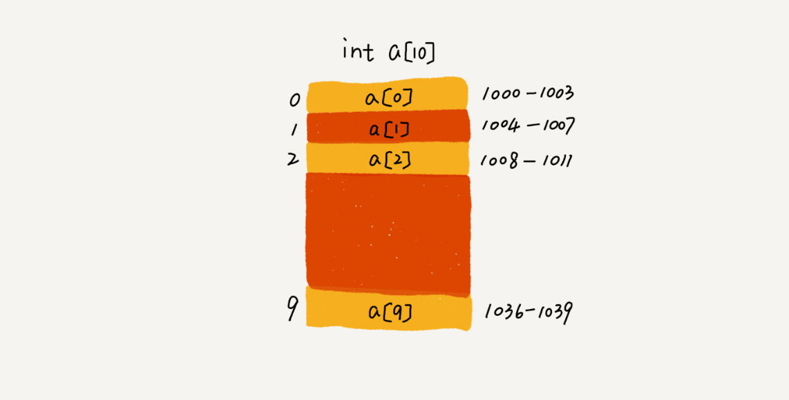

我们知道，计算机会给每个内存单元分配一个地址，计算机通过地址来访问内存中的数据。当计算机需要随机访问数组中的某个元素时，它会首先通过下面的寻址公式，计算出该元素存储的内存地址：

```c
a[i]_address = base_address + i * data_type_size
```

其中 data_type_size 表示数组中每个元素的大小。我们举的这个例子里，数组中存储的是 int 类型数据，所以 data_type_size 就为 4 个字节。这个公式非常简单，我就不多做解释了。

这里我要特别纠正一个“错误”。我在面试的时候，常常会问数组和链表的区别，很多人都回答说，“链表适合插入、删除，时间复杂度 O(1)；数组适合查找，查找时间复杂度为 O(1)”。

实际上，这种表述是不准确的。数组是适合查找操作，但是查找的时间复杂度并不为 O(1)。即便是排好序的数组，你用二分查找，时间复杂度也是 O(logn)。所以，正确的表述应该是，数组支持随机访问，根据下标随机访问的时间复杂度为 O(1)。

### 低效的“插入”和“删除”

前面概念部分我们提到，数组为了保持内存数据的连续性，会导致插入、删除这两个操作比较低效。现在我们就来详细说一下，究竟为什么会导致低效？又有哪些改进方法呢？

#### 插入操作

我们先来看**插入操作**。

假设数组的长度为 n，现在，如果我们需要将一个数据插入到数组中的第 k 个位置。为了把第 k 个位置腾出来，给新来的数据，我们需要将第 $k～n$ 这部分的元素都顺序地往后挪一位。那插入操作的时间复杂度是多少呢？你可以自己先试着分析一下。

如果在数组的末尾插入元素，那就不需要移动数据了，这时的时间复杂度为 O(1)。但如果在数组的开头插入元素，那所有的数据都需要依次往后移动一位，所以最坏时间复杂度是 O(n)。 因为我们在每个位置插入元素的概率是一样的，所以平均情况时间复杂度为 $(1+2+...n)/n=O(n)$。

如果数组中的数据是有序的，我们在某个位置插入一个新的元素时，就必须按照刚才的方法搬移 k 之后的数据。但是，如果数组中存储的数据并没有任何规律，数组只是被当作一个存储数据的集合。在这种情况下，如果要将某个数据插入到第 k 个位置，为了避免大规模的数据搬移，我们还有一个简单的办法就是，直接将第 k 位的数据搬移到数组元素的最后，把新的元素直接放入第 k 个位置。

为了更好地理解，我们举一个例子。假设数组 a[10]中存储了如下 5 个元素：`a，b，c，d，e`。

我们现在需要将元素 x 插入到第 3 个位置。我们只需要将 c 放入到 a[5]，将 a[2]赋值为 x 即可。最后，数组中的元素如下： `a，b，x，d，e，c`。

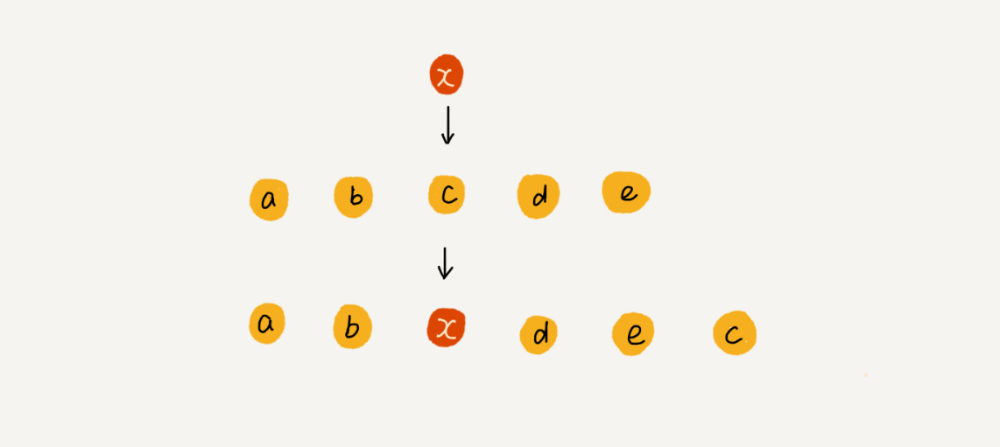

利用这种处理技巧，在特定场景下，在第 k 个位置插入一个元素的时间复杂度就会降为 O(1)。这个处理思想在快排中也会用到，我会在排序那一节具体来讲，这里就说到这儿。

#### 删除操作

我们再来看**删除操作**。

跟插入数据类似，如果我们要删除第 k 个位置的数据，为了内存的连续性，也需要搬移数据，不然中间就会出现空洞，内存就不连续了。

和插入类似，如果删除数组末尾的数据，则最好情况时间复杂度为 O(1)；如果删除开头的数据，则最坏情况时间复杂度为 O(n)；平均情况时间复杂度也为 O(n)。

实际上，在某些特殊场景下，我们并不一定非得追求数组中数据的连续性。如果我们将多次删除操作集中在一起执行，删除的效率是不是会提高很多呢？

我们继续来看例子。数组 a[10]中存储了 8 个元素：`a，b，c，d，e，f，g，h`。现在，我们要依次删除`a，b，c` 三个元素。


为了避免 `d，e，f，g，h` 这几个数据会被搬移三次，我们可以先记录下已经删除的数据。每次的删除操作并不是真正地搬移数据，只是记录数据已经被删除。当数组没有更多空间存储数据时，我们再触发执行一次真正的删除操作，这样就大大减少了删除操作导致的数据搬移。

如果你了解 JVM，你会发现，这不就是 JVM 标记清除垃圾回收算法的核心思想吗？没错，数据结构和算法的魅力就在于此，**很多时候我们并不是要去死记硬背某个数据结构或者算法，而是要学习它背后的思想和处理技巧，这些东西才是最有价值的**。如果你细心留意，不管是在软件开发还是架构设计中，总能找到某些算法和数据结构的影子。

### 警惕数组的访问越界问题

了解了数组的几个基本操作后，我们来聊聊数组访问越界的问题。

首先，我请你来分析一下这段 C 语言代码的运行结果：

```c
int main(int argc, char* argv[]){
    int i = 0;
    int arr[3] = {0};
    for(; i<=3; i++){
        arr[i] = 0;
        printf("hello world\n");
    }
    return 0;
}
```

你发现问题了吗？这段代码的运行结果并非是打印三行“hello word”，而是会无限打印“hello world”，这是为什么呢？

因为，数组大小为 3，a[0]，a[1]，a[2]，而我们的代码因为书写错误，导致 for 循环的结束条件错写为了 i<=3 而非 i<3，所以当 i=3 时，数组 a[3]访问越界。

我们知道，在 C 语言中，只要不是访问受限的内存，所有的内存空间都是可以自由访问的。根据我们前面讲的数组寻址公式，a[3]也会被定位到某块不属于数组的内存地址上，而这个地址正好是存储变量 i 的内存地址，那么 a[3]=0 就相当于 i=0，所以就会导致代码无限循环。

数组越界在 C 语言中是一种未决行为，并没有规定数组访问越界时编译器应该如何处理。因为，访问数组的本质就是访问一段连续内存，只要数组通过偏移计算得到的内存地址是可用的，那么程序就可能不会报任何错误。

这种情况下，一般都会出现莫名其妙的逻辑错误，就像我们刚刚举的那个例子，debug 的难度非常的大。而且，很多计算机病毒也正是利用到了代码中的数组越界可以访问非法地址的漏洞，来攻击系统，所以写代码的时候一定要警惕数组越界。

但并非所有的语言都像 C 一样，把数组越界检查的工作丢给程序员来做，像 Java 本身就会做越界检查，比如下面这几行 Java 代码，就会抛出 `java.lang.ArrayIndexOutOfBoundsException`。

```java
int[] a = new int[3];
a[3] = 10;
```

### 容器能否完全替代数组？

针对数组类型，很多语言都提供了容器类，比如 Java 中的 ArrayList、C++ STL 中的 vector。在项目开发中，什么时候适合用数组，什么时候适合用容器呢？

这里我拿 Java 语言来举例。如果你是 Java 工程师，几乎天天都在用 ArrayList，对它应该非常熟悉。那它与数组相比，到底有哪些优势呢？

我个人觉得，ArrayList 最大的优势就是可以将很多数组操作的细节封装起来。比如前面提到的数组插入、删除数据时需要搬移其他数据等。另外，它还有一个优势，就是支持动态扩容。

数组本身在定义的时候需要预先指定大小，因为需要分配连续的内存空间。如果我们申请了大小为 10 的数组，当第 11 个数据需要存储到数组中时，我们就需要重新分配一块更大的空间，将原来的数据复制过去，然后再将新的数据插入。

如果使用 ArrayList，我们就完全不需要关心底层的扩容逻辑，ArrayList 已经帮我们实现好了。每次存储空间不够的时候，它都会将空间自动扩容为 1.5 倍大小。

不过，这里需要注意一点，因为扩容操作涉及内存申请和数据搬移，是比较耗时的。所以，如果事先能确定需要存储的数据大小，最好**在创建 ArrayList 的时候事先指定数据大小**。

比如我们要从数据库中取出 10000 条数据放入 ArrayList。我们看下面这几行代码，你会发现，相比之下，事先指定数据大小可以省掉很多次内存申请和数据搬移操作。

```java
ArrayList<User> users = new ArrayList(10000);
for (int i = 0; i < 10000; ++i) {
  users.add(xxx);
}
```

作为高级语言编程者，是不是数组就无用武之地了呢？当然不是，有些时候，用数组会更合适些，我总结了几点自己的经验。

1. Java ArrayList 无法存储基本类型，比如 int、long，需要封装为 Integer、Long 类，而 Autoboxing、Unboxing 则有一定的性能消耗，所以如果特别关注性能，或者希望使用基本类型，就可以选用数组。

2. 如果数据大小事先已知，并且对数据的操作非常简单，用不到 ArrayList 提供的大部分方法，也可以直接使用数组。

3. 还有一个是我个人的喜好，当要表示多维数组时，用数组往往会更加直观。比如 `Object[][] array`；而用容器的话则需要这样定义：`ArrayList<ArrayList<object>> array`。

我总结一下，对于业务开发，直接使用容器就足够了，省时省力。毕竟损耗一丢丢性能，完全不会影响到系统整体的性能。但如果你是做一些非常底层的开发，比如开发网络框架，性能的优化需要做到极致，这个时候数组就会优于容器，成为首选。

### 解答开篇

现在我们来思考开篇的问题：为什么大多数编程语言中，数组要从 0 开始编号，而不是从 1 开始呢？

从数组存储的内存模型上来看，“下标”最确切的定义应该是“偏移（offset）”。前面也讲到，如果用 a 来表示数组的首地址，a[0]就是偏移为 0 的位置，也就是首地址，a[k]就表示偏移 k 个 type_size 的位置，所以计算 a[k]的内存地址只需要用这个公式：

```c
a[k]_address = base_address + k * type_size
```

但是，如果数组从 1 开始计数，那我们计算数组元素 a[k]的内存地址就会变为：

```c
a[k]_address = base_address + (k-1)*type_size
```

对比两个公式，我们不难发现，从 1 开始编号，每次随机访问数组元素都多了一次减法运算，对于 CPU 来说，就是多了一次减法指令。

数组作为非常基础的数据结构，通过下标随机访问数组元素又是其非常基础的编程操作，效率的优化就要尽可能做到极致。所以为了减少一次减法操作，数组选择了从 0 开始编号，而不是从 1 开始。

不过我认为，上面解释得再多其实都算不上压倒性的证明，说数组起始编号非 0 开始不可。所以我觉得最主要的原因可能是历史原因。

C 语言设计者用 0 开始计数数组下标，之后的 Java、JavaScript 等高级语言都效仿了 C 语言，或者说，为了在一定程度上减少 C 语言程序员学习 Java 的学习成本，因此继续沿用了从 0 开始计数的习惯。实际上，很多语言中数组也并不是从 0 开始计数的，比如 Matlab。甚至还有一些语言支持负数下标，比如 Python。

### 内容小结

我们今天学习了数组。它可以说是最基础、最简单的数据结构了。数组用一块连续的内存空间，来存储相同类型的一组数据，最大的特点就是支持随机访问，但插入、删除操作也因此变得比较低效，平均情况时间复杂度为 O(n)。在平时的业务开发中，我们可以直接使用编程语言提供的容器类，但是，如果是特别底层的开发，直接使用数组可能会更合适。

## 06 | 链表（上）：如何实现LRU缓存淘汰算法?

今天我们来聊聊“链表（Linked list）”这个数据结构。学习链表有什么用呢？为了回答这个问题，我们先来讨论一个经典的链表应用场景，那就是 LRU 缓存淘汰算法。

缓存是一种提高数据读取性能的技术，在硬件设计、软件开发中都有着非常广泛的应用，比如常见的 CPU 缓存、数据库缓存、浏览器缓存等等。

缓存的大小有限，当缓存被用满时，哪些数据应该被清理出去，哪些数据应该被保留？这就需要缓存淘汰策略来决定。常见的策略有三种：先进先出策略 FIFO（First In，First Out）、最少使用策略 LFU（Least Frequently Used）、最近最少使用策略 LRU（Least Recently Used）。

这些策略你不用死记，我打个比方你很容易就明白了。假如说，你买了很多本技术书，但有一天你发现，这些书太多了，太占书房空间了，你要做个大扫除，扔掉一些书籍。那这个时候，你会选择扔掉哪些书呢？对应一下，你的选择标准是不是和上面的三种策略神似呢？

好了，回到正题，我们今天的开篇问题就是：**如何用链表来实现 LRU 缓存淘汰策略呢？** 带着这个问题，我们开始今天的内容吧！

### 五花八门的链表结构

相比数组，链表是一种稍微复杂一点的数据结构。对于初学者来说，掌握起来也要比数组稍难一些。这两个非常基础、非常常用的数据结构，我们常常会放到一块儿来比较。所以我们先来看，这两者有什么区别。

我们先从底层的存储结构上来看一看。

为了直观地对比，我画了一张图。从图中我们看到，数组需要一块**连续的内存空间**来存储，对内存的要求比较高。如果我们申请一个 100 MB 大小的数组，当内存中没有连续的、足够大的存储空间时，即便内存的剩余总可用空间大于 100 MB，仍然会申请失败。

而链表恰恰相反，它并不需要一块连续的内存空间，它通过“指针”将一组**零散的内存块**串联起来使用，所以如果我们申请的是 100 MB 大小的链表，根本不会有问题。


链表结构五花八门，今天我重点给你介绍三种最常见的链表结构，它们分别是：单链表、双向链表和循环链表。

#### 单链表

我们首先来看最简单、最常用的**单链表**。

我们刚刚讲到，链表通过指针将一组零散的内存块串联在一起。其中，我们把内存块称为链表的“**结点**”。为了将所有的结点串起来，每个链表的结点除了存储数据之外，还需要记录链上的下一个结点的地址。如图所示，我们把这个记录下个结点地址的指针叫作**后继指针 next**。


从我画的单链表图中，你应该可以发现，其中有两个结点是比较特殊的，它们分别是第一个结点和最后一个结点。我们习惯性地把第一个结点叫作**头结点**，把最后一个结点叫作**尾结点**。其中，头结点用来记录链表的基地址。有了它，我们就可以遍历得到整条链表。而尾结点特殊的地方是：指针不是指向下一个结点，而是指向一个**空地址 NULL**，表示这是链表上最后一个结点。

与数组一样，链表也支持数据的查找、插入和删除操作。

我们知道，在进行数组的插入、删除操作时，为了保持内存数据的连续性，需要做大量的数据搬移，所以时间复杂度是 $O(n)$。而在链表中插入或者删除一个数据，我们并不需要为了保持内存的连续性而搬移结点，因为链表的存储空间本身就不是连续的。所以，在链表中插入和删除一个数据是非常快速的。

为了方便你理解，我画了一张图，从图中我们可以看出，针对链表的插入和删除操作，我们只需要考虑相邻结点的指针改变，所以对应的时间复杂度是 $O(1)$。

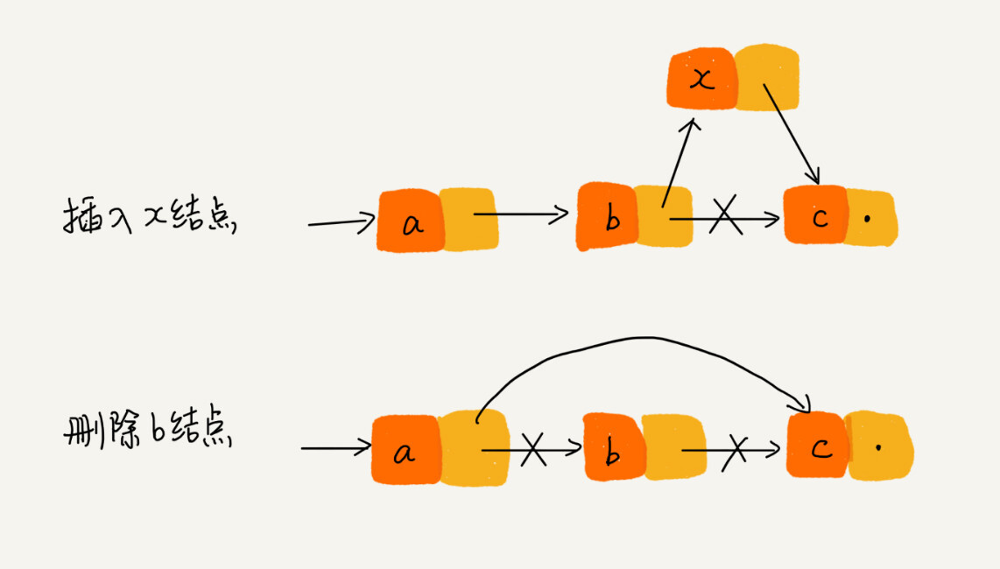

但是，有利就有弊。链表要想随机访问第 k 个元素，就没有数组那么高效了。因为链表中的数据并非连续存储的，所以无法像数组那样，根据首地址和下标，通过寻址公式就能直接计算出对应的内存地址，而是需要根据指针一个结点一个结点地依次遍历，直到找到相应的结点。

你可以把链表想象成一个队伍，队伍中的每个人都只知道自己后面的人是谁，所以当我们希望知道排在第 k 位的人是谁的时候，我们就需要从第一个人开始，一个一个地往下数。所以，链表随机访问的性能没有数组好，需要 $O(n)$ 的时间复杂度。

#### 循环链表

好了，单链表我们就简单介绍完了，接着来看另外两个复杂的升级版，**循环链表**和**双向链表**。

**循环链表**是一种**特殊的单链表**。实际上，循环链表也很简单。它跟单链表唯一的区别就在尾结点。我们知道，单链表的尾结点指针指向空地址，表示这就是最后的结点了。而循环链表的尾结点指针是指向链表的头结点。从我画的循环链表图中，你应该可以看出来，它像一个环一样首尾相连，所以叫作“循环”链表。

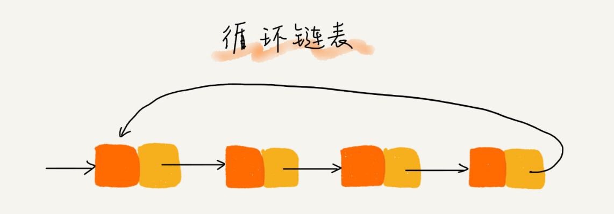

和单链表相比，**循环链表**的优点是从链尾到链头比较方便。当要处理的数据具有环型结构特点时，就特别适合采用循环链表。比如著名的**约瑟夫问题**。尽管用单链表也可以实现，但是用循环链表实现的话，代码就会简洁很多。

#### 双向链表

单链表和循环链表是不是都不难？接下来我们再来看一个稍微复杂的，在实际的软件开发中，也更加常用的链表结构：**双向链表**。

单向链表只有一个方向，结点只有一个后继指针 next 指向后面的结点。而双向链表，顾名思义，它支持两个方向，每个结点不止有一个后继指针 next 指向后面的结点，还有一个前驱指针 prev 指向前面的结点。

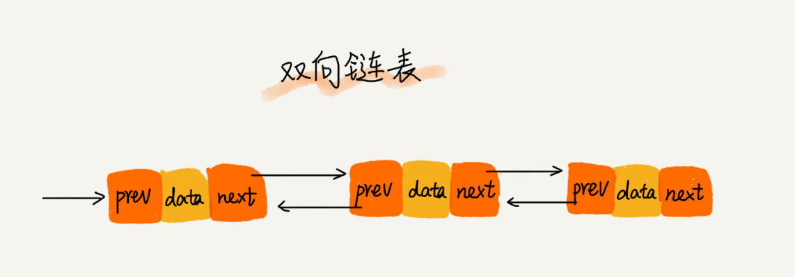

从我画的图中可以看出来，双向链表需要额外的两个空间来存储后继结点和前驱结点的地址。所以，如果存储同样多的数据，双向链表要比单链表占用更多的内存空间。虽然两个指针比较浪费存储空间，但可以支持双向遍历，这样也带来了双向链表操作的灵活性。那相比单链表，双向链表适合解决哪种问题呢？

从结构上来看，双向链表可以支持 $O(1)$ 时间复杂度的情况下找到前驱结点，正是这样的特点，也使双向链表在某些情况下的插入、删除等操作都要比单链表简单、高效。

你可能会说，我刚讲到单链表的插入、删除操作的时间复杂度已经是 $O(1)$了，双向链表还能再怎么高效呢？别着急，刚刚的分析比较偏理论，很多数据结构和算法书籍中都会这么讲，但是这种说法实际上是不准确的，或者说是有先决条件的。我再来带你分析一下链表的两个操作。

### 删除操作

我们先来看**删除操作**。

在实际的软件开发中，从链表中删除一个数据无外乎这两种情况：

- 删除结点中“值等于某个给定值”的结点；
- 删除给定指针指向的结点。

对于第一种情况，不管是单链表还是双向链表，为了查找到值等于给定值的结点，都需要从头结点开始一个一个依次遍历对比，直到找到值等于给定值的结点，然后再通过我前面讲的指针操作将其删除。

尽管单纯的删除操作时间复杂度是 $O(1)$，但遍历查找的时间是主要的耗时点，对应的时间复杂度为 $O(n)$。根据时间复杂度分析中的加法法则，删除值等于给定值的结点对应的链表操作的总时间复杂度为 $O(n)$。

对于第二种情况，我们已经找到了要删除的结点，但是删除某个结点 q 需要知道其前驱结点，而单链表并不支持直接获取前驱结点，所以，为了找到前驱结点，我们还是要从头结点开始遍历链表，直到 `p->next=q`，说明 p 是 q 的前驱结点。

但是对于双向链表来说，这种情况就比较有优势了。因为双向链表中的结点已经保存了前驱结点的指针，不需要像单链表那样遍历。所以，针对第二种情况，单链表删除操作需要 O(n) 的时间复杂度，而双向链表只需要在 $O(1)$ 的时间复杂度内就搞定了！

同理，如果我们希望在链表的某个指定结点前面插入一个结点，双向链表比单链表有很大的优势。双向链表可以在 $O(1)$ 时间复杂度搞定，而单向链表需要 $O(n)$ 的时间复杂度。你可以参照我刚刚讲过的删除操作自己分析一下。

除了插入、删除操作有优势之外，对于一个有序链表，双向链表的按值查询的效率也要比单链表高一些。因为，我们可以记录上次查找的位置 p，每次查询时，根据要查找的值与 p 的大小关系，决定是往前还是往后查找，所以平均只需要查找一半的数据。

现在，你有没有觉得双向链表要比单链表更加高效呢？这就是为什么在实际的软件开发中，双向链表尽管比较费内存，但还是比单链表的应用更加广泛的原因。如果你熟悉 Java 语言，你肯定用过 LinkedHashMap 这个容器。如果你深入研究 LinkedHashMap 的实现原理，就会发现其中就用到了双向链表这种数据结构。

实际上，这里有一个更加重要的知识点需要你掌握，那就是用空间换时间的设计思想。当内存空间充足的时候，如果我们更加追求代码的执行速度，我们就可以选择空间复杂度相对较高、但时间复杂度相对很低的算法或者数据结构。相反，如果内存比较紧缺，比如代码跑在手机或者单片机上，这个时候，就要反过来用时间换空间的设计思路。

还是开篇缓存的例子。缓存实际上就是利用了空间换时间的设计思想。如果我们把数据存储在硬盘上，会比较节省内存，但每次查找数据都要询问一次硬盘，会比较慢。但如果我们通过缓存技术，事先将数据加载在内存中，虽然会比较耗费内存空间，但是每次数据查询的速度就大大提高了。

所以我总结一下，对于执行较慢的程序，可以通过消耗更多的内存（空间换时间）来进行优化；而消耗过多内存的程序，可以通过消耗更多的时间（时间换空间）来降低内存的消耗。你还能想到其他时间换空间或者空间换时间的例子吗？

了解了循环链表和双向链表，如果把这两种链表整合在一起就是一个新的版本：**双向循环链表**。我想不用我多讲，你应该知道双向循环链表长什么样子了吧？你可以自己试着在纸上画一画。

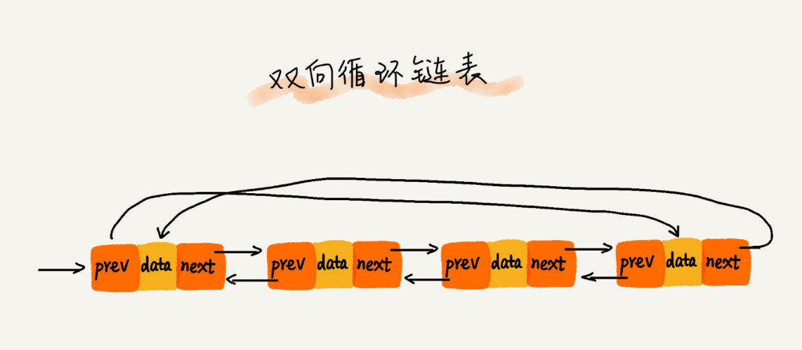

### 链表 VS 数组性能大比拼

通过前面内容的学习，你应该已经知道，数组和链表是两种截然不同的内存组织方式。正是因为内存存储的区别，它们插入、删除、随机访问操作的时间复杂度正好相反。


不过，数组和链表的对比，并不能局限于时间复杂度。而且，在实际的软件开发中，不能仅仅利用复杂度分析就决定使用哪个数据结构来存储数据。

数组简单易用，在实现上使用的是连续的内存空间，可以借助 CPU 的缓存机制，预读数组中的数据，所以访问效率更高。而链表在内存中并不是连续存储，所以对 CPU 缓存不友好，没办法有效预读。

数组的缺点是大小固定，一经声明就要占用整块连续内存空间。如果声明的数组过大，系统可能没有足够的连续内存空间分配给它，导致“内存不足（out of memory）”。如果声明的数组过小，则可能出现不够用的情况。这时只能再申请一个更大的内存空间，把原数组拷贝进去，非常费时。链表本身没有大小的限制，天然地支持动态扩容，我觉得这也是它与数组最大的区别。

你可能会说，我们 Java 中的 ArrayList 容器，也可以支持动态扩容啊？我们上一节课讲过，当我们往支持动态扩容的数组中插入一个数据时，如果数组中没有空闲空间了，就会申请一个更大的空间，将数据拷贝过去，而数据拷贝的操作是非常耗时的。

我举一个稍微极端的例子。如果我们用 ArrayList 存储了了 1 GB 大小的数据，这个时候已经没有空闲空间了，当我们再插入数据的时候，ArrayList 会申请一个 1.5 GB 大小的存储空间，并且把原来那 1 GB 的数据拷贝到新申请的空间上。听起来是不是就很耗时？

除此之外，如果你的代码对内存的使用非常苛刻，那数组就更适合你。因为链表中的每个结点都需要消耗额外的存储空间去存储一份指向下一个结点的指针，所以内存消耗会翻倍。而且，对链表进行频繁的插入、删除操作，还会导致频繁的内存申请和释放，容易造成内存碎片，如果是 Java 语言，就有可能会导致频繁的 GC（Garbage Collection，垃圾回收）。

所以，在我们实际的开发中，针对不同类型的项目，要根据具体情况，权衡究竟是选择数组还是链表。

### 解答开篇

好了，关于链表的知识我们就讲完了。我们现在回过头来看下开篇留给你的思考题。如何基于链表实现 LRU 缓存淘汰算法？

我的思路是这样的：我们维护一个有序单链表，越靠近链表尾部的结点是越早之前访问的。当有一个新的数据被访问时，我们从链表头开始顺序遍历链表。

1. 如果此数据之前已经被缓存在链表中了，我们遍历得到这个数据对应的结点，并将其从原来的位置删除，然后再插入到链表的头部。

2. 如果此数据没有在缓存链表中，又可以分为两种情况：
   - 如果此时缓存未满，则将此结点直接插入到链表的头部；
   - 如果此时缓存已满，则链表尾结点删除，将新的数据结点插入链表的头部。

这样我们就用链表实现了一个 LRU 缓存，是不是很简单？

现在我们来看下缓存访问的时间复杂度是多少。因为不管缓存有没有满，我们都需要遍历一遍链表，所以这种基于链表的实现思路，缓存访问的时间复杂度为 $O(n)$。

实际上，我们可以继续优化这个实现思路，比如引入**散列表**（Hash table）来记录每个数据的位置，将缓存访问的时间复杂度降到 $O(1)$。因为要涉及我们还没有讲到的数据结构，所以这个优化方案，我现在就不详细说了，等讲到散列表的时候，我会再拿出来讲。

除了基于链表的实现思路，实际上还可以用数组来实现 LRU 缓存淘汰策略。如何利用数组实现 LRU 缓存淘汰策略呢？我把这个问题留给你思考。

### 内容小结

今天我们讲了一种跟数组“相反”的数据结构，链表。它跟数组一样，也是非常基础、非常常用的数据结构。不过链表要比数组稍微复杂，从普通的单链表衍生出来好几种链表结构，比如双向链表、循环链表、双向循环链表。

和数组相比，链表更适合插入、删除操作频繁的场景，查询的时间复杂度较高。不过，在具体软件开发中，要对数组和链表的各种性能进行对比，综合来选择使用两者中的哪一个。

## 07 | 链表（下）：如何轻松写出正确的链表代码？

上一节我讲了链表相关的基础知识。学完之后，我看到有人留言说，基础知识我都掌握了，但是写链表代码还是很费劲。哈哈，的确是这样的！

想要写好链表代码并不是容易的事儿，尤其是那些复杂的链表操作，比如链表反转、有序链表合并等，写的时候非常容易出错。从我上百场面试的经验来看，能把“链表反转”这几行代码写对的人不足 10%。

为什么链表代码这么难写？究竟怎样才能比较轻松地写出正确的链表代码呢？

只要愿意投入时间，我觉得大多数人都是可以学会的。比如说，如果你真的能花上一个周末或者一整天的时间，就去写链表反转这一个代码，多写几遍，一直练到能毫不费力地写出 Bug free 的代码。这个坎还会很难跨吗？

当然，自己有决心并且付出精力是成功的先决条件，除此之外，我们还需要一些方法和技巧。我根据自己的学习经历和工作经验，总结了几个**写链表代码技巧**。如果你能熟练掌握这几个技巧，加上你的主动和坚持，轻松拿下链表代码完全没有问题。

### 技巧一：理解指针或引用的含义

事实上，看懂链表的结构并不是很难，但是一旦把它和指针混在一起，就很容易让人摸不着头脑。所以，要想写对链表代码，首先就要理解好指针。

我们知道，有些语言有“指针”的概念，比如 C 语言；有些语言没有指针，取而代之的是“引用”，比如 Java、Python。不管是“指针”还是“引用”，实际上，它们的意思都是一样的，都是存储所指对象的内存地址。

接下来，我会拿 C 语言中的“指针”来讲解，如果你用的是 Java 或者其他没有指针的语言也没关系，你把它理解成“引用”就可以了。

实际上，对于指针的理解，你只需要记住下面这句话就可以了：

**将某个变量赋值给指针，实际上就是将这个变量的地址赋值给指针，或者反过来说，指针中存储了这个变量的内存地址，指向了这个变量，通过指针就能找到这个变量。**

这句话听起来还挺拗口的，你可以先记住。我们回到链表代码的编写过程中，我来慢慢给你解释。

在编写链表代码的时候，我们经常会有这样的代码：`p->next=q`。这行代码是说，p 结点中的 next 指针存储了 q 结点的内存地址。

还有一个更复杂的，也是我们写链表代码经常会用到的：`p->next=p->next->next`。这行代码表示，p 结点的 next 指针存储了 p 结点的下下一个结点的内存地址。

掌握了指针或引用的概念，你应该可以很轻松地看懂链表代码。恭喜你，已经离写出链表代码近了一步！

### 技巧二：警惕指针丢失和内存泄漏

不知道你有没有这样的感觉，写链表代码的时候，指针指来指去，一会儿就不知道指到哪里了。所以，我们在写的时候，一定注意不要弄丢了指针。

指针往往都是怎么弄丢的呢？我拿单链表的插入操作为例来给你分析一下。

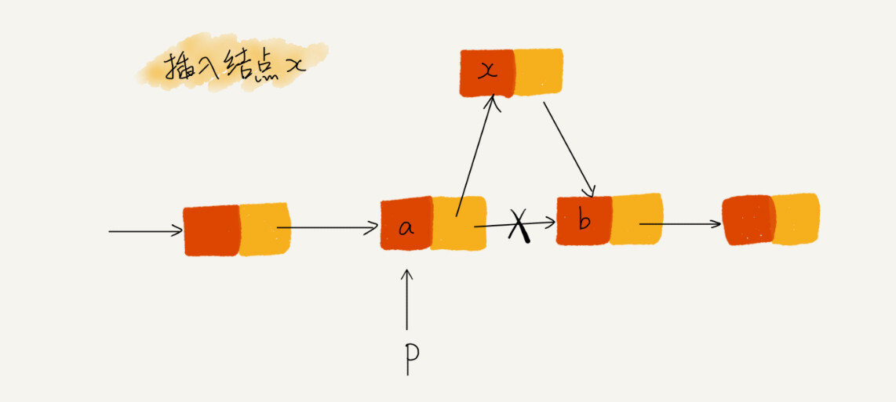

如图所示，我们希望在结点 a 和相邻的结点 b 之间插入结点 x，假设当前指针 p 指向结点 a。如果我们将代码实现变成下面这个样子，就会发生指针丢失和内存泄露。

```c
p->next = x;  // 将p的next指针指向x结点；
x->next = p->next;  // 将x的结点的next指针指向b结点；
```

初学者经常会在这儿犯错。`p->next` 指针在完成第一步操作之后，已经不再指向结点 b 了，而是指向结点 x。第 2 行代码相当于将 x 赋值给 `x->next`，自己指向自己。因此，整个链表也就断成了两半，从结点 b 往后的所有结点都无法访问到了。

对于有些语言来说，比如 C 语言，内存管理是由程序员负责的，如果没有手动释放结点对应的内存空间，就会产生内存泄露。所以，我们插入结点时，一定要注意操作的顺序，要先将结点 x 的 next 指针指向结点 b，再把结点 a 的 next 指针指向结点 x，这样才不会丢失指针，导致内存泄漏。所以，对于刚刚的插入代码，我们只需要把第 1 行和第 2 行代码的顺序颠倒一下就可以了。

同理，删除链表结点时，也一定要记得手动释放内存空间，否则，也会出现内存泄漏的问题。当然，对于像 Java 这种虚拟机自动管理内存的编程语言来说，就不需要考虑这么多了。

### 技巧三：利用哨兵简化实现难度

首先，我们先来回顾一下单链表的插入和删除操作。如果我们在结点 p 后面插入一个新的结点，只需要下面两行代码就可以搞定。

```c
new_node->next = p->next;
p->next = new_node;
```

但是，当我们要向一个空链表中插入第一个结点，刚刚的逻辑就不能用了。我们需要进行下面这样的特殊处理，其中 head 表示链表的头结点。所以，从这段代码，我们可以发现，对于单链表的插入操作，第一个结点和其他结点的插入逻辑是不一样的。

```c
if (head == null) {
  head = new_node;
}
```

我们再来看单链表结点删除操作。如果要删除结点 p 的后继结点，我们只需要一行代码就可以搞定。

```c
p->next = p->next->next;
```

但是，如果我们要删除链表中的最后一个结点，前面的删除代码就不 work 了。跟插入类似，我们也需要对于这种情况特殊处理。写成代码是这样子的：

```c
if (head->next == null) {
   head = null;
}
```

从前面的一步一步分析，我们可以看出，针对链表的插入、删除操作，需要对插入第一个结点和删除最后一个结点的情况进行特殊处理。这样代码实现起来就会很繁琐，不简洁，而且也容易因为考虑不全而出错。如何来解决这个问题呢？

技巧三中提到的哨兵就要登场了。哨兵，解决的是国家之间的边界问题。同理，这里说的哨兵也是解决“边界问题”的，不直接参与业务逻辑。

还记得如何表示一个空链表吗？`head=null` 表示链表中没有结点了。其中 head 表示头结点指针，指向链表中的第一个结点。

如果我们引入哨兵结点，在任何时候，不管链表是不是空，head 指针都会一直指向这个哨兵结点。我们也把这种有哨兵结点的链表叫**带头链表**。相反，没有哨兵结点的链表就叫作**不带头链表**。

我画了一个带头链表，你可以发现，哨兵结点是不存储数据的。因为哨兵结点一直存在，所以插入第一个结点和插入其他结点，删除最后一个结点和删除其他结点，都可以统一为相同的代码实现逻辑了。


实际上，这种利用哨兵简化编程难度的技巧，在很多代码实现中都有用到，比如插入排序、归并排序、动态规划等。这些内容我们后面才会讲，现在为了让你感受更深，我再举一个非常简单的例子。代码我是用 C 语言实现的，不涉及语言方面的高级语法，很容易看懂，你可以类比到你熟悉的语言。

代码一：

```c
// 在数组a中，查找key，返回key所在的位置
// 其中，n表示数组a的长度
int find(char* a, int n, char key) {
  // 边界条件处理，如果a为空，或者n<=0，说明数组中没有数据，就不用while循环比较了
  if(a == null || n <= 0) {
    return -1;
  }
  
  int i = 0;
  // 这里有两个比较操作：i<n和a[i]==key.
  while (i < n) {
    if (a[i] == key) {
      return i;
    }
    ++i;
  }
  
  return -1;
}
```

代码二：

```c
// 在数组a中，查找key，返回key所在的位置
// 其中，n表示数组a的长度
// 我举2个例子，你可以拿例子走一下代码
// a = {4, 2, 3, 5, 9, 6}  n=6 key = 7
// a = {4, 2, 3, 5, 9, 6}  n=6 key = 6
int find(char* a, int n, char key) {
  if(a == null || n <= 0) {
    return -1;
  }
  
  // 这里因为要将a[n-1]的值替换成key，所以要特殊处理这个值
  if (a[n-1] == key) {
    return n-1;
  }
  
  // 把a[n-1]的值临时保存在变量tmp中，以便之后恢复。tmp=6。
  // 之所以这样做的目的是：希望find()代码不要改变a数组中的内容
  char tmp = a[n-1];
  // 把key的值放到a[n-1]中，此时a = {4, 2, 3, 5, 9, 7}
  a[n-1] = key;
  
  int i = 0;
  // while 循环比起代码一，少了i<n这个比较操作
  while (a[i] != key) {
    ++i;
  }
  
  // 恢复a[n-1]原来的值,此时a= {4, 2, 3, 5, 9, 6}
  a[n-1] = tmp;
  
  if (i == n-1) {
    // 如果i == n-1说明，在0...n-2之间都没有key，所以返回-1
    return -1;
  } else {
    // 否则，返回i，就是等于key值的元素的下标
    return i;
  }
}
```

对比两段代码，在字符串 a 很长的时候，比如几万、几十万，你觉得哪段代码运行得更快点呢？答案是代码二，因为两段代码中执行次数最多就是 while 循环那一部分。第二段代码中，我们通过一个哨兵 `a[n-1] = key`，成功省掉了一个比较语句 i

当然，这只是为了举例说明哨兵的作用，你写代码的时候千万不要写第二段那样的代码，因为可读性太差了。大部分情况下，我们并不需要如此追求极致的性能。

### 技巧四：重点留意边界条件处理

软件开发中，代码在一些边界或者异常情况下，最容易产生 Bug。链表代码也不例外。要实现没有 Bug 的链表代码，一定要在编写的过程中以及编写完成之后，检查边界条件是否考虑全面，以及代码在边界条件下是否能正确运行。

我经常用来检查链表代码是否正确的边界条件有这样几个：

- 如果链表为空时，代码是否能正常工作？
- 如果链表只包含一个结点时，代码是否能正常工作？
- 如果链表只包含两个结点时，代码是否能正常工作？
- 代码逻辑在处理头结点和尾结点的时候，是否能正常工作？

当你写完链表代码之后，除了看下你写的代码在正常的情况下能否工作，还要看下在上面我列举的几个边界条件下，代码仍然能否正确工作。如果这些边界条件下都没有问题，那基本上可以认为没有问题了。

当然，边界条件不止我列举的那些。针对不同的场景，可能还有特定的边界条件，这个需要你自己去思考，不过套路都是一样的。

实际上，不光光是写链表代码，你在写任何代码时，也千万不要只是实现业务正常情况下的功能就好了，一定要多想想，你的代码在运行的时候，可能会遇到哪些边界情况或者异常情况。遇到了应该如何应对，这样写出来的代码才够健壮！

### 技巧五：举例画图，辅助思考

对于稍微复杂的链表操作，比如前面我们提到的单链表反转，指针一会儿指这，一会儿指那，一会儿就被绕晕了。总感觉脑容量不够，想不清楚。所以这个时候就要使用大招了，**举例法和画图法**。

你可以找一个具体的例子，把它画在纸上，释放一些脑容量，留更多的给逻辑思考，这样就会感觉到思路清晰很多。比如往单链表中插入一个数据这样一个操作，我一般都是把各种情况都举一个例子，画出插入前和插入后的链表变化，如图所示：

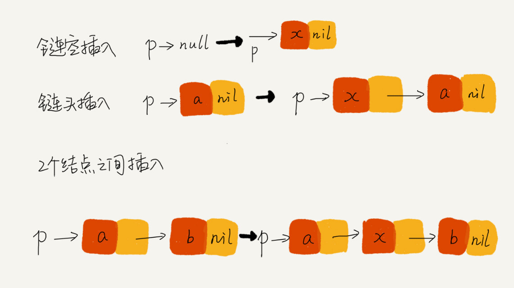

看图写代码，是不是就简单多啦？而且，当我们写完代码之后，也可以举几个例子，画在纸上，照着代码走一遍，很容易就能发现代码中的 Bug。

### 技巧六：多写多练，没有捷径

如果你已经理解并掌握了我前面所讲的方法，但是手写链表代码还是会出现各种各样的错误，也不要着急。因为我最开始学的时候，这种状况也持续了一段时间。

现在我写这些代码，简直就和“玩儿”一样，其实也没有什么技巧，就是把常见的链表操作都自己多写几遍，出问题就一点一点调试，熟能生巧！

所以，我精选了 5 个常见的链表操作。你只要把这几个操作都能写熟练，不熟就多写几遍，我保证你之后再也不会害怕写链表代码。

- 单链表反转
- 链表中环的检测
- 两个有序的链表合并
- 删除链表倒数第 n 个结点
- 求链表的中间结点

### 内容小结

这节我主要和你讲了写出正确链表代码的六个技巧。分别是理解指针或引用的含义、警惕指针丢失和内存泄漏、利用哨兵简化实现难度、重点留意边界条件处理，以及举例画图、辅助思考，还有多写多练。

我觉得，**写链表代码是最考验逻辑思维能力的**。因为，链表代码到处都是指针的操作、边界条件的处理，稍有不慎就容易产生 Bug。链表代码写得好坏，可以看出一个人写代码是否够细心，考虑问题是否全面，思维是否缜密。所以，这也是很多面试官喜欢让人手写链表代码的原因。所以，这一节讲到的东西，你一定要自己写代码实现一下，才有效果。

### 08 | 栈：如何实现浏览器的前进和后退功能？

浏览器的前进、后退功能，我想你肯定很熟悉吧？

当你依次访问完一串页面 `a-b-c` 之后，点击浏览器的后退按钮，就可以查看之前浏览过的页面 b 和 a。当你后退到页面 a，点击前进按钮，就可以重新查看页面 b 和 c。但是，如果你后退到页面 b 后，点击了新的页面 d，那就无法再通过前进、后退功能查看页面 c 了。

**假设你是 Chrome 浏览器的开发工程师，你会如何实现这个功能呢？**

这就要用到我们今天要讲的“栈”这种数据结构。带着这个问题，我们来学习今天的内容。

### 如何理解“栈”？

关于“栈”，我有一个非常贴切的例子，就是一摞叠在一起的盘子。我们平时放盘子的时候，都是从下往上一个一个放；取的时候，我们也是从上往下一个一个地依次取，不能从中间任意抽出。**后进者先出，先进者后出，这就是典型的“栈”结构**。


从栈的操作特性上来看，**栈是一种“操作受限”的线性表**，只允许在一端插入和删除数据。

我第一次接触这种数据结构的时候，就对它存在的意义产生了很大的疑惑。因为我觉得，相比数组和链表，栈带给我的只有限制，并没有任何优势。那我直接使用数组或者链表不就好了吗？为什么还要用这个“操作受限”的“栈”呢？

事实上，从功能上来说，数组或链表确实可以替代栈，但你要知道，特定的数据结构是对特定场景的抽象，而且，数组或链表暴露了太多的操作接口，操作上的确灵活自由，但使用时就比较不可控，自然也就更容易出错。

当某个数据集合只涉及在一端插入和删除数据，并且满足后进先出、先进后出的特性，这时我们就应该首选“栈”这种数据结构。

### 如何实现一个“栈”？

从刚才栈的定义里，我们可以看出，栈主要包含两个操作，入栈和出栈，也就是在栈顶插入一个数据和从栈顶删除一个数据。理解了栈的定义之后，我们来看一看如何用代码实现一个栈。

实际上，栈既可以用数组来实现，也可以用链表来实现。用数组实现的栈，我们叫作顺序栈，用链表实现的栈，我们叫作链式栈。

我这里实现一个基于数组的顺序栈。基于链表实现的链式栈的代码，你可以自己试着写一下。我会将我写好的代码放到 `GitHub` 上，你可以去看一下自己写的是否正确。

我这段代码是用 Java 来实现的，但是不涉及任何高级语法，并且我还用中文做了详细的注释，所以你应该是可以看懂的。

```java
// 基于数组实现的顺序栈
public class ArrayStack {
  private String[] items;  // 数组
  private int count;       // 栈中元素个数
  private int n;           //栈的大小

  // 初始化数组，申请一个大小为n的数组空间
  public ArrayStack(int n) {
    this.items = new String[n];
    this.n = n;
    this.count = 0;
  }

  // 入栈操作
  public boolean push(String item) {
    // 数组空间不够了，直接返回false，入栈失败。
    if (count == n) return false;
    // 将item放到下标为count的位置，并且count加一
    items[count] = item;
    ++count;
    return true;
  }
  
  // 出栈操作
  public String pop() {
    // 栈为空，则直接返回null
    if (count == 0) return null;
    // 返回下标为count-1的数组元素，并且栈中元素个数count减一
    String tmp = items[count-1];
    --count;
    return tmp;
  }
}
```

了解了定义和基本操作，那它的操作的时间、空间复杂度是多少呢？

不管是顺序栈还是链式栈，我们存储数据只需要一个大小为 n 的数组就够了。在入栈和出栈过程中，只需要一两个临时变量存储空间，所以空间复杂度是 O(1)。

注意，这里存储数据需要一个大小为 n 的数组，并不是说空间复杂度就是 O(n)。因为，这 n 个空间是必须的，无法省掉。所以我们说空间复杂度的时候，是指除了原本的数据存储空间外，算法运行还需要额外的存储空间。

空间复杂度分析是不是很简单？时间复杂度也不难。不管是顺序栈还是链式栈，入栈、出栈只涉及栈顶个别数据的操作，所以时间复杂度都是 O(1)。

### 支持动态扩容的顺序栈

刚才那个基于数组实现的栈，是一个固定大小的栈，也就是说，在初始化栈时需要事先指定栈的大小。当栈满之后，就无法再往栈里添加数据了。尽管链式栈的大小不受限，但要存储 next 指针，内存消耗相对较多。那我们如何基于数组实现一个可以支持动态扩容的栈呢？

你还记得，我们在数组那一节，是如何来实现一个支持动态扩容的数组的吗？当数组空间不够时，我们就重新申请一块更大的内存，将原来数组中数据统统拷贝过去。这样就实现了一个支持动态扩容的数组。

所以，如果要实现一个支持动态扩容的栈，我们只需要底层依赖一个支持动态扩容的数组就可以了。当栈满了之后，我们就申请一个更大的数组，将原来的数据搬移到新数组中。我画了一张图，你可以对照着理解一下。

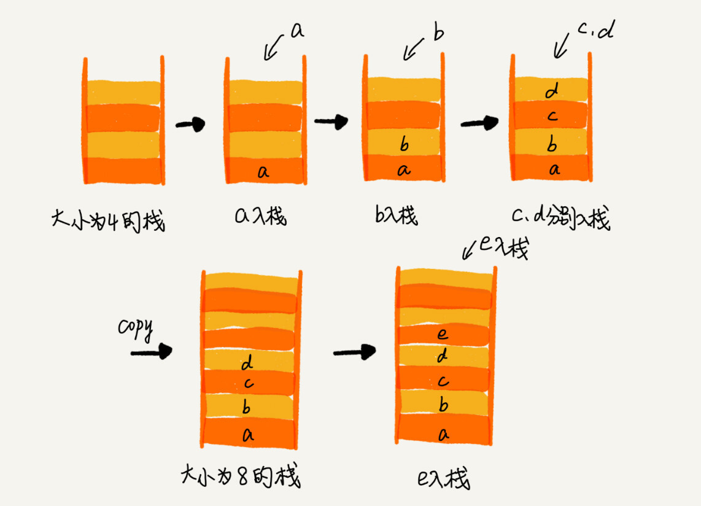

实际上，支持动态扩容的顺序栈，我们平时开发中并不常用到。我讲这一块的目的，主要还是希望带你练习一下前面讲的复杂度分析方法。所以这一小节的重点还是复杂度分析。

你不用死记硬背入栈、出栈的时间复杂度，你需要掌握的是分析方法。能够自己分析才算是真正掌握了。现在我就带你分析一下支持动态扩容的顺序栈的入栈、出栈操作的时间复杂度。

对于出栈操作来说，我们不会涉及内存的重新申请和数据的搬移，所以出栈的时间复杂度仍然是 O(1)。但是，对于入栈操作来说，情况就不一样了。当栈中有空闲空间时，入栈操作的时间复杂度为 O(1)。但当空间不够时，就需要重新申请内存和数据搬移，所以时间复杂度就变成了 O(n)。

也就是说，对于入栈操作来说，最好情况时间复杂度是 O(1)，最坏情况时间复杂度是 O(n)。那平均情况下的时间复杂度又是多少呢？还记得我们在复杂度分析那一节中讲的摊还分析法吗？这个入栈操作的平均情况下的时间复杂度可以用摊还分析法来分析。我们也正好借此来实战一下摊还分析法。

为了分析的方便，我们需要事先做一些假设和定义：

- 栈空间不够时，我们重新申请一个是原来大小两倍的数组；
- 为了简化分析，假设只有入栈操作没有出栈操作；
- 定义不涉及内存搬移的入栈操作为 simple-push 操作，时间复杂度为 O(1)。

如果当前栈大小为 K，并且已满，当再有新的数据要入栈时，就需要重新申请 2 倍大小的内存，并且做 K 个数据的搬移操作，然后再入栈。但是，接下来的 `K-1` 次入栈操作，我们都不需要再重新申请内存和搬移数据，所以这 `K-1` 次入栈操作都只需要一个 simple-push 操作就可以完成。为了让你更加直观地理解这个过程，我画了一张图。

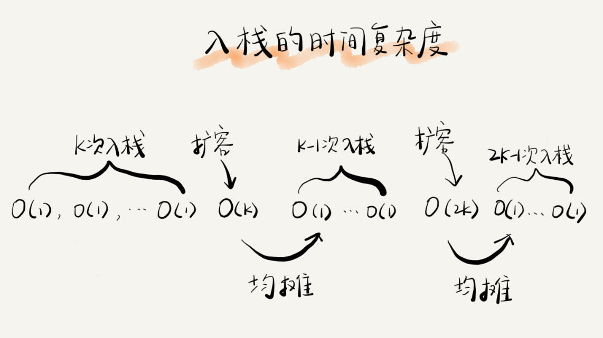

你应该可以看出来，这 K 次入栈操作，总共涉及了 K 个数据的搬移，以及 K 次 simple-push 操作。将 K 个数据搬移均摊到 K 次入栈操作，那每个入栈操作只需要一个数据搬移和一个 simple-push 操作。以此类推，入栈操作的均摊时间复杂度就为 O(1)。

通过这个例子的实战分析，也印证了前面讲到的，均摊时间复杂度一般都等于最好情况时间复杂度。因为在大部分情况下，入栈操作的时间复杂度 O 都是 O(1)，只有在个别时刻才会退化为 O(n)，所以把耗时多的入栈操作的时间均摊到其他入栈操作上，平均情况下的耗时就接近 O(1)。

### 栈在函数调用中的应用

前面我讲的都比较偏理论，我们现在来看下，栈在软件工程中的实际应用。栈作为一个比较基础的数据结构，应用场景还是蛮多的。其中，比较经典的一个应用场景就是函数调用栈。

我们知道，操作系统给每个线程分配了一块独立的内存空间，这块内存被组织成“栈”这种结构, 用来存储函数调用时的临时变量。每进入一个函数，就会将临时变量作为一个栈帧入栈，当被调用函数执行完成，返回之后，将这个函数对应的栈帧出栈。为了让你更好地理解，我们一块来看下这段代码的执行过程。

```c
int main() {
   int a = 1; 
   int ret = 0;
   int res = 0;
   ret = add(3, 5);
   res = a + ret;
   printf("%d", res);
   reuturn 0;
}

int add(int x, int y) {
   int sum = 0;
   sum = x + y;
   return sum;
}
```

从代码中我们可以看出，main() 函数调用了 add() 函数，获取计算结果，并且与临时变量 a 相加，最后打印 res 的值。为了让你清晰地看到这个过程对应的函数栈里出栈、入栈的操作，我画了一张图。图中显示的是，在执行到 add() 函数时，函数调用栈的情况。

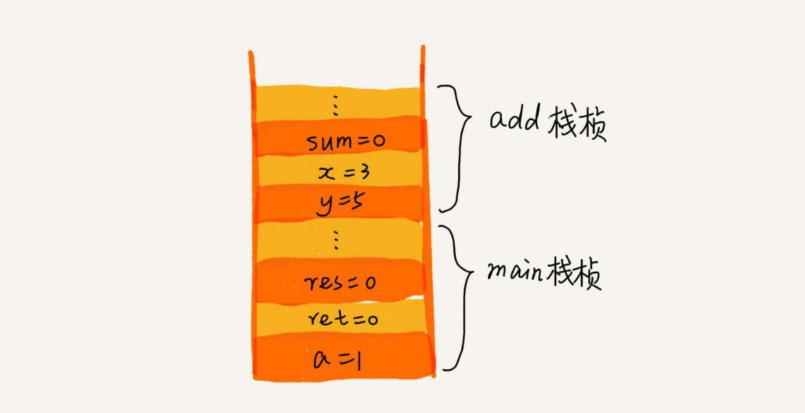

### 栈在表达式求值中的应用

我们再来看栈的另一个常见的应用场景，编译器如何利用栈来实现**表达式求值**。

为了方便解释，我将算术表达式简化为只包含加减乘除四则运算，比如：34+13*9+44-12/3。对于这个四则运算，我们人脑可以很快求解出答案，但是对于计算机来说，理解这个表达式本身就是个挺难的事儿。如果换作你，让你来实现这样一个表达式求值的功能，你会怎么做呢？

实际上，编译器就是通过两个栈来实现的。其中一个保存操作数的栈，另一个是保存运算符的栈。我们从左向右遍历表达式，当遇到数字，我们就直接压入操作数栈；当遇到运算符，就与运算符栈的栈顶元素进行比较。

如果比运算符栈顶元素的优先级高，就将当前运算符压入栈；如果比运算符栈顶元素的优先级低或者相同，从运算符栈中取栈顶运算符，从操作数栈的栈顶取 2 个操作数，然后进行计算，再把计算完的结果压入操作数栈，继续比较。

我将 3+5*8-6 这个表达式的计算过程画成了一张图，你可以结合图来理解我刚讲的计算过程。

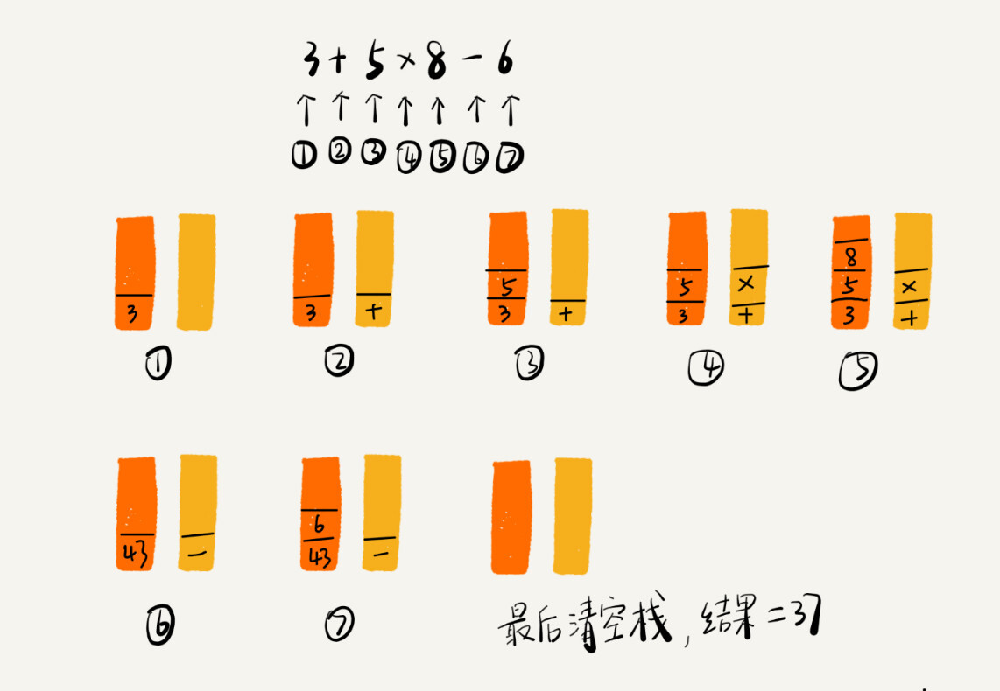

这样用两个栈来解决的思路是不是非常巧妙？你有没有想到呢？

### 栈在括号匹配中的应用

除了用栈来实现表达式求值，我们还可以借助栈来检查表达式中的括号是否匹配。

我们同样简化一下背景。我们假设表达式中只包含三种括号，圆括号 ()、方括号[]和花括号{}，并且它们可以任意嵌套。比如，{[] ()[{}]}或[{()}([])]等都为合法格式，而{[}()]或[({)]为不合法的格式。那我现在给你一个包含三种括号的表达式字符串，如何检查它是否合法呢？

这里也可以用栈来解决。我们用栈来保存未匹配的左括号，从左到右依次扫描字符串。当扫描到左括号时，则将其压入栈中；当扫描到右括号时，从栈顶取出一个左括号。如果能够匹配，比如“(”跟“)”匹配，“[”跟“]”匹配，“{”跟“}”匹配，则继续扫描剩下的字符串。如果扫描的过程中，遇到不能配对的右括号，或者栈中没有数据，则说明为非法格式。

当所有的括号都扫描完成之后，如果栈为空，则说明字符串为合法格式；否则，说明有未匹配的左括号，为非法格式。

### 解答开篇

好了，我想现在你已经完全理解了栈的概念。我们再回来看看开篇的思考题，如何实现浏览器的前进、后退功能？其实，用两个栈就可以非常完美地解决这个问题。

我们使用**两个栈**，X 和 Y，我们把首次浏览的页面依次压入栈 X，当点击后退按钮时，再依次从栈 X 中出栈，并将出栈的数据依次放入栈 Y。当我们点击前进按钮时，我们依次从栈 Y 中取出数据，放入栈 X 中。当栈 X 中没有数据时，那就说明没有页面可以继续后退浏览了。当栈 Y 中没有数据，那就说明没有页面可以点击前进按钮浏览了。

比如你顺序查看了 a，b，c 三个页面，我们就依次把 a，b，c 压入栈，这个时候，两个栈的数据就是这个样子：


当你通过浏览器的后退按钮，从页面 c 后退到页面 a 之后，我们就依次把 c 和 b 从**栈 X** 中弹出，并且依次放入到**栈 Y**。这个时候，两个栈的数据就是这个样子：


这个时候你又想看页面 b，于是你又点击前进按钮回到 b 页面，我们就把 b 再从栈 Y 中出栈，放入栈 X 中。此时两个栈的数据是这个样子：


这个时候，你通过页面 b 又跳转到新的页面 d 了，页面 c 就无法再通过前进、后退按钮重复查看了，所以需要清空栈 Y。此时两个栈的数据这个样子：


### 内容小结

我们来回顾一下今天讲的内容。栈是一种操作受限的数据结构，只支持入栈和出栈操作。后进先出是它最大的特点。栈既可以通过数组实现，也可以通过链表来实现。不管基于数组还是链表，入栈、出栈的时间复杂度都为 O(1)。除此之外，我们还讲了一种支持动态扩容的顺序栈，你需要重点掌握它的均摊时间复杂度分析方法。

## 09 | 队列：队列在线程池等有限资源池中的应用

我们知道，CPU 资源是有限的，任务的处理速度与线程个数并不是线性正相关。相反，过多的线程反而会导致 CPU 频繁切换，处理性能下降。所以，线程池的大小一般都是综合考虑要处理任务的特点和硬件环境，来事先设置的。

**当我们向固定大小的线程池中请求一个线程时，如果线程池中没有空闲资源了，这个时候线程池如何处理这个请求？是拒绝请求还是排队请求？各种处理策略又是怎么实现的呢？**

实际上，这些问题并不复杂，其底层的数据结构就是我们今天要学的内容，队列（queue）。

### 如何理解“队列”？

队列这个概念非常好理解。你可以把它想象成排队买票，先来的先买，后来的人只能站末尾，不允许插队。**先进者先出，这就是典型的“队列”**。

我们知道，栈只支持两个基本操作：**入栈 push()和出栈 pop()**。队列跟栈非常相似，支持的操作也很有限，最基本的操作也是两个：**入队 enqueue()**，放一个数据到队列尾部；**出队 dequeue()**，从队列头部取一个元素。

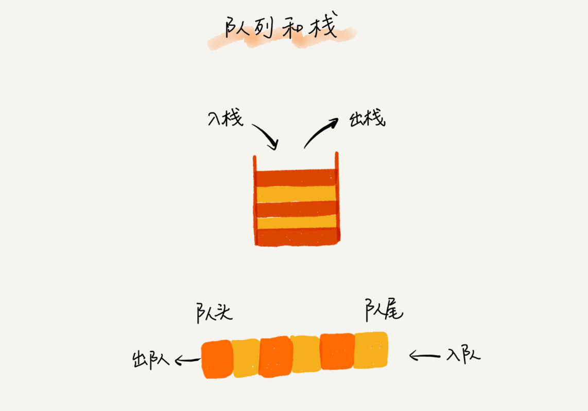

所以，队列跟栈一样，也是一种**操作受限的线性表数据结构**。

队列的概念很好理解，基本操作也很容易掌握。作为一种非常基础的数据结构，队列的应用也非常广泛，特别是一些具有某些额外特性的队列，比如循环队列、阻塞队列、并发队列。它们在很多偏底层系统、框架、中间件的开发中，起着关键性的作用。比如高性能队列 Disruptor、Linux 环形缓存，都用到了循环并发队列；Java concurrent 并发包利用 `ArrayBlockingQueue` 来实现公平锁等。

### 顺序队列和链式队列

我们知道了，队列跟栈一样，也是一种抽象的数据结构。它具有先进先出的特性，支持在队尾插入元素，在队头删除元素，那究竟该如何实现一个队列呢？

跟栈一样，队列可以用数组来实现，也可以用链表来实现。用数组实现的栈叫作顺序栈，用链表实现的栈叫作链式栈。同样，用数组实现的队列叫作**顺序队列**，用链表实现的队列叫作**链式队列**。

我们先来看下基于数组的实现方法。我用 Java 语言实现了一下，不过并不包含 Java 语言的高级语法，而且我做了比较详细的注释，你应该可以看懂。

```java
// 用数组实现的队列
public class ArrayQueue {
  // 数组：items，数组大小：n
  private String[] items;
  private int n = 0;
  // head表示队头下标，tail表示队尾下标
  private int head = 0;
  private int tail = 0;

  // 申请一个大小为capacity的数组
  public ArrayQueue(int capacity) {
    items = new String[capacity];
    n = capacity;
  }

  // 入队
  public boolean enqueue(String item) {
    // 如果tail == n 表示队列已经满了
    if (tail == n) return false;
    items[tail] = item;
    ++tail;
    return true;
  }

  // 出队
  public String dequeue() {
    // 如果head == tail 表示队列为空
    if (head == tail) return null;
    // 为了让其他语言的同学看的更加明确，把--操作放到单独一行来写了
    String ret = items[head];
    ++head;
    return ret;
  }
}
```

比起栈的数组实现，队列的数组实现稍微有点儿复杂，但是没关系。我稍微解释一下实现思路，你很容易就能明白了。

对于栈来说，我们只需要一个**栈顶指针**就可以了。但是队列需要两个指针：一个是 head 指针，指向队头；一个是 tail 指针，指向队尾。

你可以结合下面这张图来理解。当 a、b、c、d 依次入队之后，队列中的 head 指针指向下标为 0 的位置，tail 指针指向下标为 4 的位置。

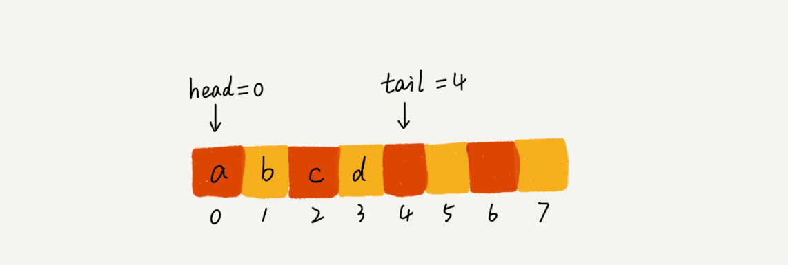

当我们调用两次出队操作之后，队列中 head 指针指向下标为 2 的位置，tail 指针仍然指向下标为 4 的位置。

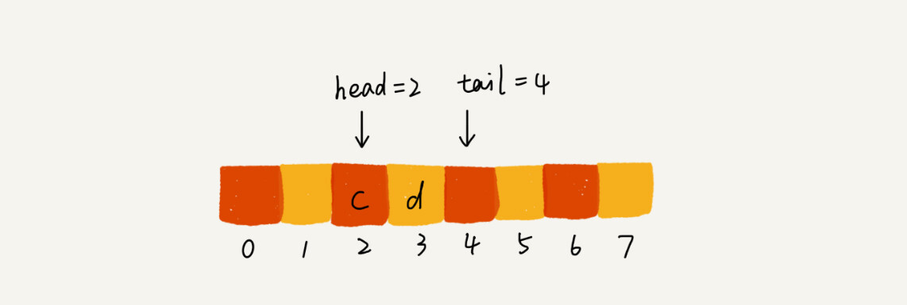

你肯定已经发现了，随着不停地进行入队、出队操作，head 和 tail 都会持续往后移动。当 tail 移动到最右边，即使数组中还有空闲空间，也无法继续往队列中添加数据了。这个问题该如何解决呢？

你是否还记得，在数组那一节，我们也遇到过类似的问题，就是数组的删除操作会导致数组中的数据不连续。你还记得我们当时是怎么解决的吗？对，用**数据搬移**！但是，每次进行出队操作都相当于删除数组下标为 0 的数据，要搬移整个队列中的数据，这样出队操作的时间复杂度就会从原来的 O(1) 变为 O(n)。能不能优化一下呢？

实际上，我们在出队时可以不用搬移数据。如果没有空闲空间了，我们只需要在入队时，再集中触发一次数据的搬移操作。借助这个思想，出队函数 dequeue() 保持不变，我们稍加改造一下入队函数 enqueue() 的实现，就可以轻松解决刚才的问题了。下面是具体的代码：

```java
// 入队操作，将item放入队尾
public boolean enqueue(String item) {
  // tail == n表示队列末尾没有空间了
  if (tail == n) {
    // tail ==n && head==0，表示整个队列都占满了
    if (head == 0) return false;
    // 数据搬移
    for (int i = head; i < tail; ++i) {
      items[i-head] = items[i];
    }
    // 搬移完之后重新更新head和tail
    tail -= head;
    head = 0;
  }
  
  items[tail] = item;
  ++tail;
  return true;
}
```

从代码中我们看到，当队列的 tail 指针移动到数组的最右边后，如果有新的数据入队，我们可以将 head 到 tail 之间的数据，整体搬移到数组中 0 到 tail-head 的位置。

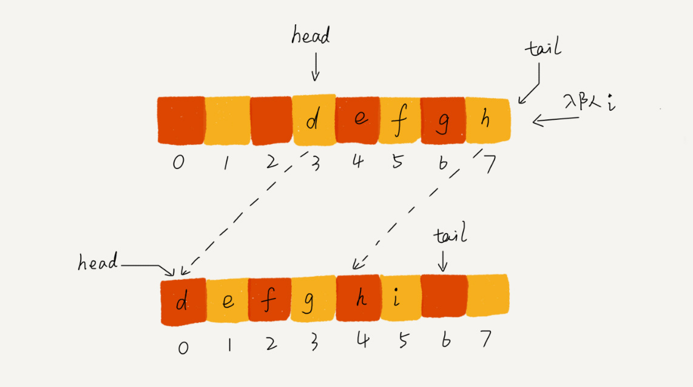

这种实现思路中，出队操作的时间复杂度仍然是 O(1)，但入队操作的时间复杂度还是 O(1) 吗？你可以用我们第 3 节、第 4 节讲的算法复杂度分析方法，自己试着分析一下。

接下来，我们再来看下**基于链表的队列实现方法**。

基于链表的实现，我们同样需要两个指针：head 指针和 tail 指针。它们分别指向链表的第一个结点和最后一个结点。如图所示，入队时，`tail->next= new_node, tail = tail->next;`，出队时，`head = head->next`。我将具体的代码放到 `GitHub` 上，你可以自己试着实现一下，然后再去 `GitHub` 上跟我实现的代码对比下，看写得对不对。

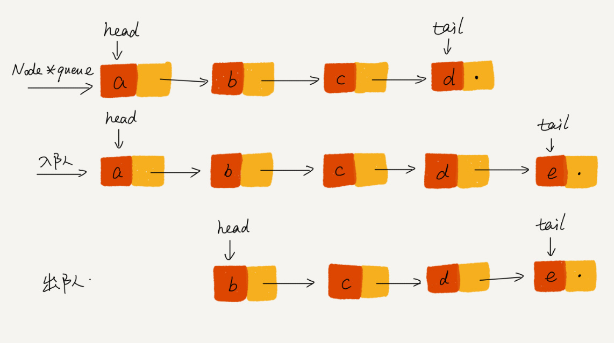

### 循环队列

我们刚才用数组来实现队列的时候，在 tail==n 时，会有数据搬移操作，这样入队操作性能就会受到影响。那有没有办法能够避免数据搬移呢？我们来看看循环队列的解决思路。

循环队列，顾名思义，它长得像一个环。原本数组是有头有尾的，是一条直线。现在我们把首尾相连，扳成了一个环。我画了一张图，你可以直观地感受一下。

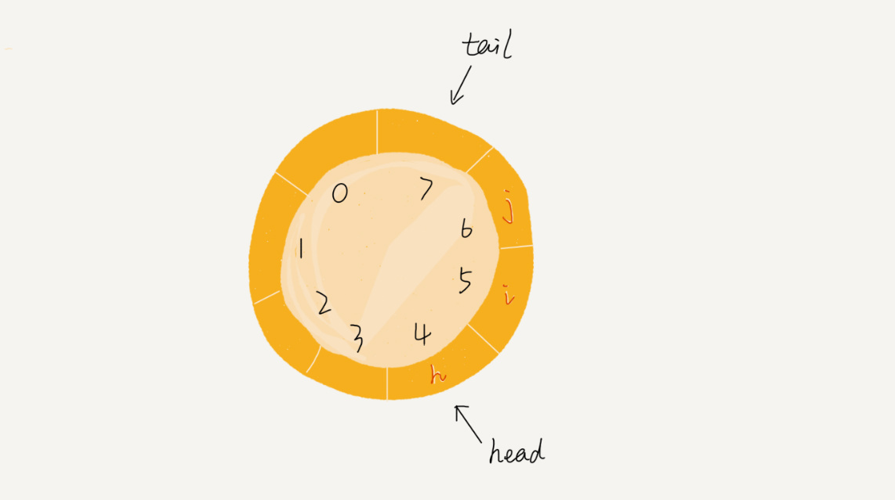

我们可以发现，图中这个队列的大小为 8，当前 head=4，tail=7。当有一个新的元素 a 入队时，我们放入下标为 7 的位置。但这个时候，我们并不把 tail 更新为 8，而是将其在环中后移一位，到下标为 0 的位置。当再有一个元素 b 入队时，我们将 b 放入下标为 0 的位置，然后 tail 加 1 更新为 1。所以，在 a，b 依次入队之后，循环队列中的元素就变成了下面的样子：

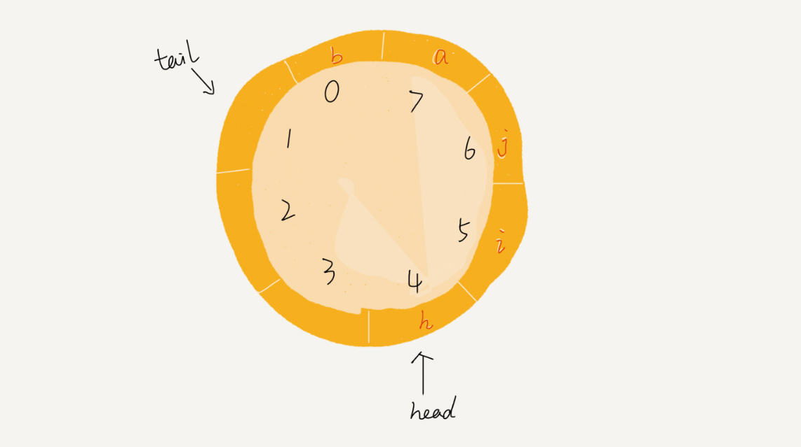

通过这样的方法，我们成功避免了数据搬移操作。看起来不难理解，但是循环队列的代码实现难度要比前面讲的非循环队列难多了。要想写出没有 bug 的循环队列的实现代码，我个人觉得，最关键的是，**确定好队空和队满的判定条件**。

在用数组实现的非循环队列中，队满的判断条件是 tail == n，队空的判断条件是 head == tail。那针对循环队列，如何判断队空和队满呢？

队列为空的判断条件仍然是 head == tail。但队列满的判断条件就稍微有点复杂了。我画了一张队列满的图，你可以看一下，试着总结一下规律。

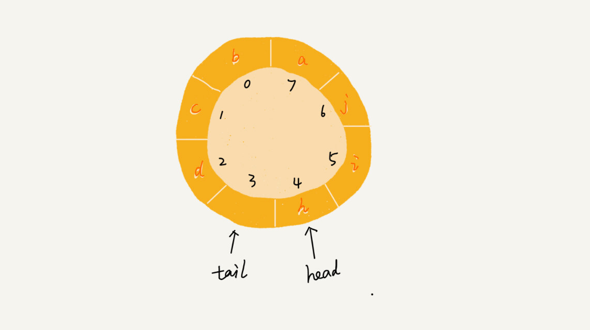

就像我图中画的队满的情况，tail=3，head=4，n=8，所以总结一下规律就是：`(3+1)%8=4`。多画几张队满的图，你就会发现，当队满时，**(tail+1)%n=head**​。

你有没有发现，当队列满时，图中的 tail 指向的位置实际上是没有存储数据的。所以，循环队列会浪费一个数组的存储空间。

Talk is cheap，如果还是没怎么理解，那就 show you code 吧。

```java
public class CircularQueue {
  // 数组：items，数组大小：n
  private String[] items;
  private int n = 0;
  // head表示队头下标，tail表示队尾下标
  private int head = 0;
  private int tail = 0;

  // 申请一个大小为capacity的数组
  public CircularQueue(int capacity) {
    items = new String[capacity];
    n = capacity;
  }

  // 入队
  public boolean enqueue(String item) {
    // 队列满了
    if ((tail + 1) % n == head) return false;
    items[tail] = item;
    tail = (tail + 1) % n;
    return true;
  }

  // 出队
  public String dequeue() {
    // 如果head == tail 表示队列为空
    if (head == tail) return null;
    String ret = items[head];
    head = (head + 1) % n;
    return ret;
  }
}
```

### 阻塞队列和并发队列

前面讲的内容理论比较多，看起来很难跟实际的项目开发扯上关系。确实，队列这种数据结构很基础，平时的业务开发不大可能从零实现一个队列，甚至都不会直接用到。而一些具有特殊特性的队列应用却比较广泛，比如阻塞队列和并发队列。

**阻塞队列**其实就是在队列基础上增加了阻塞操作。简单来说，就是在队列为空的时候，从队头取数据会被阻塞。因为此时还没有数据可取，直到队列中有了数据才能返回；如果队列已经满了，那么插入数据的操作就会被阻塞，直到队列中有空闲位置后再插入数据，然后再返回。

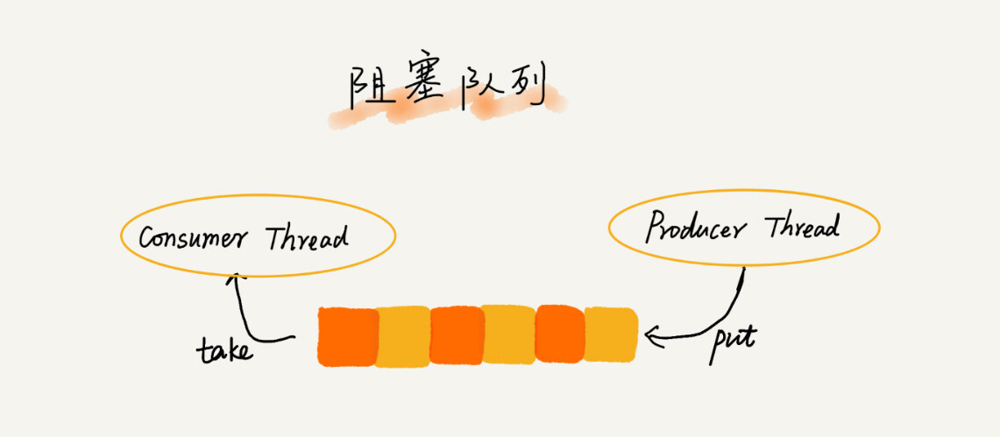

你应该已经发现了，上述的定义就是一个“生产者 - 消费者模型”！是的，我们可以使用阻塞队列，轻松实现一个“生产者 - 消费者模型”！

这种基于阻塞队列实现的“生产者 - 消费者模型”，可以有效地协调生产和消费的速度。当“生产者”生产数据的速度过快，“消费者”来不及消费时，存储数据的队列很快就会满了。这个时候，生产者就阻塞等待，直到“消费者”消费了数据，“生产者”才会被唤醒继续“生产”。

而且不仅如此，基于阻塞队列，我们还可以通过协调“生产者”和“消费者”的个数，来提高数据的处理效率。比如前面的例子，我们可以多配置几个“消费者”，来应对一个“生产者”。

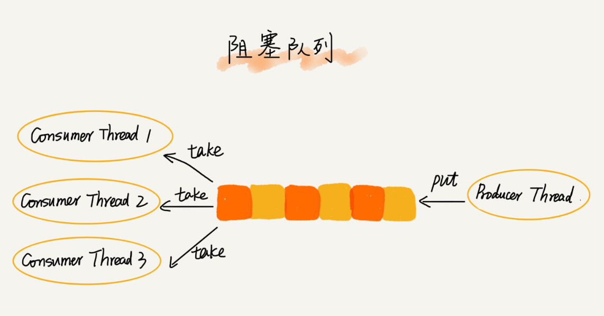

前面我们讲了阻塞队列，在多线程情况下，会有多个线程同时操作队列，这个时候就会存在线程安全问题，那如何实现一个线程安全的队列呢？

线程安全的队列我们叫作并发队列。最简单直接的实现方式是直接在 enqueue()、dequeue() 方法上加锁，但是锁粒度大并发度会比较低，同一时刻仅允许一个存或者取操作。实际上，基于数组的循环队列，利用 CAS 原子操作，可以实现非常高效的并发队列。这也是循环队列比链式队列应用更加广泛的原因。在实战篇讲 Disruptor 的时候，我会再详细讲并发队列的应用。

### 解答开篇

队列的知识就讲完了，我们现在回过来看下开篇的问题。线程池没有空闲线程时，新的任务请求线程资源时，线程池该如何处理？各种处理策略又是如何实现的呢？

我们一般有两种处理策略。第一种是非阻塞的处理方式，直接拒绝任务请求；另一种是阻塞的处理方式，将请求排队，等到有空闲线程时，取出排队的请求继续处理。那如何存储排队的请求呢？

我们希望公平地处理每个排队的请求，先进者先服务，所以队列这种数据结构很适合来存储排队请求。我们前面说过，队列有基于链表和基于数组这两种实现方式。这两种实现方式对于排队请求又有什么区别呢？

基于链表的实现方式，可以实现一个支持无限排队的无界队列（unbounded queue），但是可能会导致过多的请求排队等待，请求处理的响应时间过长。所以，针对响应时间比较敏感的系统，基于链表实现的无限排队的线程池是不合适的。

而基于数组实现的有界队列（bounded queue），队列的大小有限，所以线程池中排队的请求超过队列大小时，接下来的请求就会被拒绝，这种方式对响应时间敏感的系统来说，就相对更加合理。不过，设置一个合理的队列大小，也是非常有讲究的。队列太大导致等待的请求太多，队列太小会导致无法充分利用系统资源、发挥最大性能。

除了前面讲到队列应用在线程池请求排队的场景之外，队列可以应用在任何有限资源池中，用于排队请求，比如数据库连接池等。**实际上，对于大部分资源有限的场景，当没有空闲资源时，基本上都可以通过“队列”这种数据结构来实现请求排队**。

### 内容小结

今天我们讲了一种跟栈很相似的数据结构，队列。关于队列，你能掌握下面的内容，这节就没问题了。

队列最大的特点就是先进先出，主要的两个操作是入队和出队。跟栈一样，它既可以用数组来实现，也可以用链表来实现。用数组实现的叫顺序队列，用链表实现的叫链式队列。特别是长得像一个环的循环队列。在数组实现队列的时候，会有数据搬移操作，要想解决数据搬移的问题，我们就需要像环一样的循环队列。

循环队列是我们这节的重点。要想写出没有 bug 的循环队列实现代码，关键要确定好队空和队满的判定条件，具体的代码你要能写出来。

除此之外，我们还讲了几种高级的队列结构，阻塞队列、并发队列，底层都还是队列这种数据结构，只不过在之上附加了很多其他功能。阻塞队列就是入队、出队操作可以阻塞，并发队列就是队列的操作多线程安全。

## 10 | 递归：如何用三行代码找到“最终推荐人”？

推荐注册返佣金的这个功能我想你应该不陌生吧？现在很多 `App` 都有这个功能。这个功能中，用户 A 推荐用户 B 来注册，用户 B 又推荐了用户 C 来注册。我们可以说，用户 C 的“最终推荐人”为用户 A，用户 B 的“最终推荐人”也为用户 A，而用户 A 没有“最终推荐人”。

一般来说，我们会通过数据库来记录这种推荐关系。在数据库表中，我们可以记录两行数据，其中 actor_id 表示用户 id，referrer_id 表示推荐人 id。

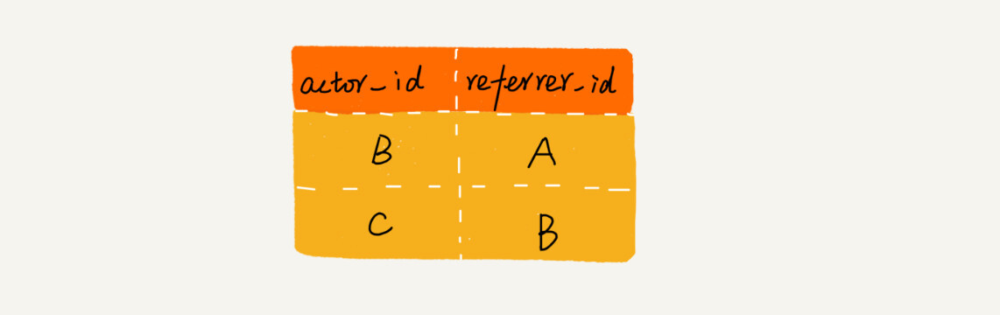

基于这个背景，我的问题是，给定一个用户 ID，如何查找这个用户的“最终推荐人”？ 带着这个问题，我们来学习今天的内容，递归（Recursion）！

### 如何理解“递归”？

从我自己学习数据结构和算法的经历来看，我个人觉得，有两个最难理解的知识点，一个是**动态规划**，另一个就是**递归**。

递归是一种应用非常广泛的算法（或者编程技巧）。之后我们要讲的很多数据结构和算法的编码实现都要用到递归，比如 `DFS` 深度优先搜索、前中后序二叉树遍历等等。所以，搞懂递归非常重要，否则，后面复杂一些的数据结构和算法学起来就会比较吃力。

不过，别看我说了这么多，递归本身可是一点儿都不“高冷”，咱们生活中就有很多用到递归的例子。

周末你带着女朋友去电影院看电影，女朋友问你，咱们现在坐在第几排啊？电影院里面太黑了，看不清，没法数，现在你怎么办？

别忘了你是程序员，这个可难不倒你，递归就开始排上用场了。于是你就问前面一排的人他是第几排，你想只要在他的数字上加一，就知道自己在哪一排了。但是，前面的人也看不清啊，所以他也问他前面的人。就这样一排一排往前问，直到问到第一排的人，说我在第一排，然后再这样一排一排再把数字传回来。直到你前面的人告诉你他在哪一排，于是你就知道答案了。

这就是一个非常标准的递归求解问题的分解过程，去的过程叫“递”，回来的过程叫“归”。基本上，所有的递归问题都可以用递推公式来表示。刚刚这个生活中的例子，我们用递推公式将它表示出来就是这样的：
$$
f(n)=f(n-1)+1，其中：f(1)=1
$$
$f(n)$ 表示你想知道自己在哪一排，$f(n-1)$ 表示前面一排所在的排数，$f(1)=1$ 表示第一排的人知道自己在第一排。有了这个递推公式，我们就可以很轻松地将它改为递归代码，如下：

```c
int f(int n) {
  if (n == 1) return 1;
  return f(n-1) + 1;
}
```

### 递归需要满足的三个条件

刚刚这个例子是非常典型的递归，那究竟什么样的问题可以用递归来解决呢？我总结了三个条件，只要同时满足以下三个条件，就可以用递归来解决。

#### 1. 一个问题的解可以分解为几个子问题的解

何为子问题？子问题就是数据规模更小的问题。比如，前面讲的电影院的例子，你要知道，“自己在哪一排”的问题，可以分解为“前一排的人在哪一排”这样一个子问题。

#### 2. 这个问题与分解之后的子问题，除了数据规模不同，求解思路完全一样

比如电影院那个例子，你求解“自己在哪一排”的思路，和前面一排人求解“自己在哪一排”的思路，是一模一样的。

#### 3. 存在递归终止条件

把问题分解为子问题，把子问题再分解为子子问题，一层一层分解下去，不能存在无限循环，这就需要有终止条件。

还是电影院的例子，第一排的人不需要再继续询问任何人，就知道自己在哪一排，也就是 $f(1)=1$，这就是递归的终止条件。

### 如何编写递归代码？

刚刚铺垫了这么多，现在我们来看，如何来写递归代码？我个人觉得，写递归代码最关键的是**写出递推公式，找到终止条件**，剩下将递推公式转化为代码就很简单了。

你先记住这个理论。我举一个例子，带你一步一步实现一个递归代码，帮你理解。

假如这里有 n 个台阶，每次你可以跨 1 个台阶或者 2 个台阶，请问走这 n 个台阶有多少种走法？如果有 7 个台阶，你可以 2，2，2，1 这样子上去，也可以 1，2，1，1，2 这样子上去，总之走法有很多，那如何用编程求得总共有多少种走法呢？

我们仔细想下，实际上，可以根据第一步的走法把所有走法分为两类，第一类是第一步走了 1 个台阶，另一类是第一步走了 2 个台阶。所以 n 个台阶的走法就等于先走 1 阶后，n-1 个台阶的走法 加上先走 2 阶后，n-2 个台阶的走法。用公式表示就是：$f(n) = f(n-1)+f(n-2)$

有了递推公式，递归代码基本上就完成了一半。我们再来看下终止条件。当有一个台阶时，我们不需要再继续递归，就只有一种走法。所以$f(1)=1$。这个递归终止条件足够吗？我们可以用 n=2，n=3 这样比较小的数试验一下。

n=2 时，$f(2)=f(1)+f(0)$。如果递归终止条件只有一个 $f(1)=1$，那 f(2) 就无法求解了。所以除了 $f(1)=1$ 这一个递归终止条件外，还要有 $f(0)=1$，表示走 0 个台阶有一种走法，不过这样子看起来就不符合正常的逻辑思维了。所以，我们可以把 $f(2)=2$ 作为一种终止条件，表示走 2 个台阶，有两种走法，一步走完或者分两步来走。

所以，递归终止条件就是 $f(1)=1$，$f(2)=2$。这个时候，你可以再拿 n=3，n=4 来验证一下，这个终止条件是否足够并且正确。

我们把递归终止条件和刚刚得到的递推公式放到一起就是这样的：

$$
\begin{align}
& f(1) = 1; \\
& f(2) = 2;	\\
& f(n) = f(n-1)+f(n-2)
\end{align}
$$


有了这个公式，我们转化成递归代码就简单多了。最终的递归代码是这样的：

```c
int f(int n) {
  if (n == 1) return 1;
  if (n == 2) return 2;
  return f(n-1) + f(n-2);
}
```

我总结一下，**写递归代码的关键就是找到如何将大问题分解为小问题的规律，并且基于此写出递推公式，然后再推敲终止条件，最后将递推公式和终止条件翻译成代码**。

虽然我讲了这么多方法，但是作为初学者的你，现在是不是还是有种想不太清楚的感觉呢？实际上，我刚学递归的时候，也有这种感觉，这也是文章开头我说递归代码比较难理解的地方。

刚讲的电影院的例子，我们的递归调用只有一个分支，也就是说“一个问题只需要分解为一个子问题”，我们很容易能够想清楚“递”和“归”的每一个步骤，所以写起来、理解起来都不难。

但是，当我们面对的是一个问题要分解为多个子问题的情况，递归代码就没那么好理解了。

像我刚刚讲的第二个例子，人脑几乎没办法把整个“递”和“归”的过程一步一步都想清楚。

计算机擅长做重复的事情，所以递归正合它的胃口。而我们人脑更喜欢平铺直叙的思维方式。当我们看到递归时，我们总想把递归平铺展开，脑子里就会循环，一层一层往下调，然后再一层一层返回，试图想搞清楚计算机每一步都是怎么执行的，这样就很容易被绕进去。

对于递归代码，这种试图想清楚整个递和归过程的做法，实际上是进入了一个思维误区。很多时候，我们理解起来比较吃力，主要原因就是自己给自己制造了这种理解障碍。那正确的思维方式应该是怎样的呢？

如果一个问题 A 可以分解为若干子问题 B、C、D，你可以假设子问题 B、C、D 已经解决，在此基础上思考如何解决问题 A。而且，你只需要思考问题 A 与子问题 B、C、D 两层之间的关系即可，不需要一层一层往下思考子问题与子子问题，子子问题与子子子问题之间的关系。屏蔽掉递归细节，这样子理解起来就简单多了。

因此，**编写递归代码的关键是，只要遇到递归，我们就把它抽象成一个递推公式，不用想一层层的调用关系，不要试图用人脑去分解递归的每个步骤**。

### 递归代码要警惕堆栈溢出

在实际的软件开发中，编写递归代码时，我们会遇到很多问题，比如堆栈溢出。而堆栈溢出会造成系统性崩溃，后果会非常严重。为什么递归代码容易造成堆栈溢出呢？我们又该如何预防堆栈溢出呢？

我在“栈”那一节讲过，函数调用会使用栈来保存临时变量。每调用一个函数，都会将临时变量封装为栈帧压入内存栈，等函数执行完成返回时，才出栈。系统栈或者虚拟机栈空间一般都不大。如果递归求解的数据规模很大，调用层次很深，一直压入栈，就会有堆栈溢出的风险。

比如前面的讲到的电影院的例子，如果我们将系统栈或者 `JVM` 堆栈大小设置为 1 KB，在求解 $f(19999)$​​时便会出现如下堆栈报错：`Exception in thread "main" java.lang.StackOverflowError`

那么，如何避免出现堆栈溢出呢？

我们可以通过在代码中限制递归调用的最大深度的方式来解决这个问题。递归调用超过一定深度（比如 1000）之后，我们就不继续往下再递归了，直接返回报错。还是电影院那个例子，我们可以改造成下面这样子，就可以避免堆栈溢出了。不过，我写的代码是伪代码，为了代码简洁，有些边界条件没有考虑，比如 x<=0。

```c
// 全局变量，表示递归的深度。
int depth = 0;

int f(int n) {
  ++depth；
  if (depth > 1000) throw exception;
  
  if (n == 1) return 1;
  return f(n-1) + 1;
}
```

但这种做法并不能完全解决问题，因为最大允许的递归深度跟当前线程剩余的栈空间大小有关，事先无法计算。如果实时计算，代码过于复杂，就会影响代码的可读性。所以，如果最大深度比较小，比如 10、50，就可以用这种方法，否则这种方法并不是很实用。

### 递归代码要警惕重复计算

除此之外，使用递归时还会出现重复计算的问题。刚才我讲的第二个递归代码的例子，如果我们把整个递归过程分解一下的话，那就是这样的：


从图中，我们可以直观地看到，想要计算 f(5)，需要先计算 f(4) 和 f(3)，而计算 f(4) 还需要计算 f(3)，因此，f(3) 就被计算了很多次，这就是重复计算问题。

为了避免重复计算，我们可以通过一个数据结构（比如散列表）来保存已经求解过的 f(k)。当递归调用到 f(k) 时，先看下是否已经求解过了。如果是，则直接从散列表中取值返回，不需要重复计算，这样就能避免刚讲的问题了。

按照上面的思路，我们来改造一下刚才的代码：

```java
public int f(int n) {
  if (n == 1) return 1;
  if (n == 2) return 2;
  
  // hasSolvedList可以理解成一个Map，key是n，value是f(n)
  if (hasSolvedList.containsKey(n)) {
    return hasSolvedList.get(n);
  }
  
  int ret = f(n-1) + f(n-2);
  hasSolvedList.put(n, ret);
  return ret;
}
```

除了堆栈溢出、重复计算这两个常见的问题。递归代码还有很多别的问题。

在时间效率上，递归代码里多了很多函数调用，当这些函数调用的数量较大时，就会积聚成一个可观的时间成本。在空间复杂度上，因为递归调用一次就会在内存栈中保存一次现场数据，所以在分析递归代码空间复杂度时，需要额外考虑这部分的开销，比如我们前面讲到的电影院递归代码，空间复杂度并不是 O(1)，而是 O(n)。

### 怎么将递归代码改写为非递归代码？

我们刚说了，递归有利有弊，利是递归代码的表达力很强，写起来非常简洁；而弊就是空间复杂度高、有堆栈溢出的风险、存在重复计算、过多的函数调用会耗时较多等问题。所以，在开发过程中，我们要根据实际情况来选择是否需要用递归的方式来实现。

那我们是否可以把递归代码改写为非递归代码呢？比如刚才那个电影院的例子，我们抛开场景，只看 $f(x) =f(x-1)+1$ 这个递推公式。我们这样改写看看：

```c
int f(int n) {
  int ret = 1;
  for (int i = 2; i <= n; ++i) {
    ret = ret + 1;
  }
  return ret;
}
```

同样，第二个例子也可以改为非递归的实现方式。

```c
int f(int n) {
  if (n == 1) return 1;
  if (n == 2) return 2;
  
  int ret = 0;
  int pre = 2;
  int prepre = 1;
  for (int i = 3; i <= n; ++i) {
    ret = pre + prepre;
    prepre = pre;
    pre = ret;
  }
  return ret;
}
```

那是不是所有的递归代码都可以改为这种迭代循环的非递归写法呢？

笼统地讲，是的。因为递归本身就是借助栈来实现的，只不过我们使用的栈是系统或者虚拟机本身提供的，我们没有感知罢了。如果我们自己在内存堆上实现栈，手动模拟入栈、出栈过程，这样任何递归代码都可以改写成看上去不是递归代码的样子。

但是这种思路实际上是将递归改为了“手动”递归，本质并没有变，而且也并没有解决前面讲到的某些问题，徒增了实现的复杂度。

### 解答开篇

到此为止，递归相关的基础知识已经讲完了，咱们来看一下开篇的问题：如何找到“最终推荐人”？我的解决方案是这样的：

```c
long findRootReferrerId(long actorId) {
  Long referrerId = select referrer_id from [table] where actor_id = actorId;
  if (referrerId == null) return actorId;
  return findRootReferrerId(referrerId);
}
```

是不是非常简洁？用三行代码就能搞定了，不过在实际项目中，上面的代码并不能工作，为什么呢？这里面有两个问题。

- 第一，如果递归很深，可能会有堆栈溢出的问题。
- 第二，如果数据库里存在脏数据，我们还需要处理由此产生的无限递归问题。比如 demo 环境下数据库中，测试工程师为了方便测试，会人为地插入一些数据，就会出现脏数据。如果 A 的推荐人是 B，B 的推荐人是 C，C 的推荐人是 A，这样就会发生死循环。

第一个问题，我前面已经解答过了，可以用限制递归深度来解决。第二个问题，也可以用限制递归深度来解决。不过，还有一个更高级的处理方法，就是自动检测 A-B-C-A 这种“环”的存在。如何来检测环的存在呢？这个我暂时不细说，你可以自己思考下，后面的章节我们还会讲。

### 内容小结

关于递归的知识，到这里就算全部讲完了。我来总结一下。

递归是一种非常高效、简洁的编码技巧。只要是满足“三个条件”的问题就可以通过递归代码来解决。

不过递归代码也比较难写、难理解。编写递归代码的关键就是不要把自己绕进去，正确姿势是写出递推公式，找出终止条件，然后再翻译成递归代码。

递归代码虽然简洁高效，但是，递归代码也有很多弊端。比如，堆栈溢出、重复计算、函数调用耗时多、空间复杂度高等，所以，在编写递归代码的时候，一定要控制好这些副作用。

## 11 | 排序（上）：为什么插入排序比冒泡排序更受欢迎？

排序对于任何一个程序员来说，可能都不会陌生。你学的第一个算法，可能就是排序。大部分编程语言中，也都提供了排序函数。在平常的项目中，我们也经常会用到排序。排序非常重要，所以我会花多一点时间来详细讲一讲经典的排序算法。

排序算法太多了，有很多可能你连名字都没听说过，比如猴子排序、睡眠排序、面条排序等。我只讲众多排序算法中的一小撮，也是最经典的、最常用的：冒泡排序、插入排序、选择排序、归并排序、快速排序、计数排序、基数排序、桶排序。我按照时间复杂度把它们分成了三类，分三节课来讲解。

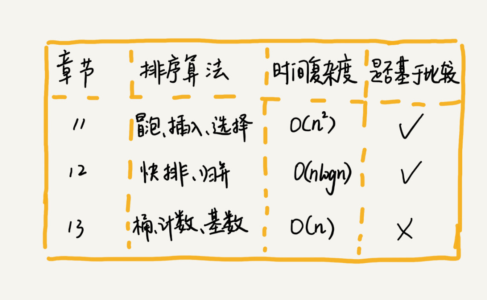

带着问题去学习，是最有效的学习方法。所以按照惯例，我还是先给你出一个思考题：插入排序和冒泡排序的时间复杂度相同，都是 $O(n^2)$，在实际的软件开发里，为什么我们更倾向于使用插入排序算法而不是冒泡排序算法呢？

你可以先思考一两分钟，带着这个问题，我们开始今天的内容！

### 如何分析一个“排序算法”？

学习排序算法，我们除了学习它的算法原理、代码实现之外，更重要的是要学会如何评价、分析一个排序算法。那分析一个排序算法，要从哪几个方面入手呢？排序算法的执行效率

#### 排序算法的执行效率

对于排序算法执行效率的分析，我们一般会从这几个方面来衡量：

##### 1. 最好情况、最坏情况、平均情况时间复杂度

我们在分析排序算法的时间复杂度时，要分别给出最好情况、最坏情况、平均情况下的时间复杂度。除此之外，你还要说出最好、最坏时间复杂度对应的要排序的原始数据是什么样的。

为什么要区分这三种时间复杂度呢？第一，有些排序算法会区分，为了好对比，所以我们最好都做一下区分。第二，对于要排序的数据，有的接近有序，有的完全无序。有序度不同的数据，对于排序的执行时间肯定是有影响的，我们要知道排序算法在不同数据下的性能表现。

##### 2. 时间复杂度的系数、常数 、低阶

我们知道，时间复杂度反映的是数据规模 n 很大的时候的一个增长趋势，所以它表示的时候会忽略系数、常数、低阶。但是实际的软件开发中，我们排序的可能是 10 个、100 个、1000 个这样规模很小的数据，所以，在对同一阶时间复杂度的排序算法性能对比的时候，我们就要把系数、常数、低阶也考虑进来。

##### 3. 比较次数和交换（或移动）次数

这一节和下一节讲的都是基于比较的排序算法。基于比较的排序算法的执行过程，会涉及两种操作，一种是元素比较大小，另一种是元素交换或移动。所以，如果我们在分析排序算法的执行效率的时候，应该把比较次数和交换（或移动）次数也考虑进去。

#### 排序算法的内存消耗

我们前面讲过，算法的内存消耗可以通过空间复杂度来衡量，排序算法也不例外。不过，针对排序算法的空间复杂度，我们还引入了一个新的概念，**原地排序**（Sorted in place）。原地排序算法，就是特指空间复杂度是 O(1) 的排序算法。我们今天讲的三种排序算法，都是原地排序算法。

#### 排序算法的稳定性

仅仅用执行效率和内存消耗来衡量排序算法的好坏是不够的。针对排序算法，我们还有一个重要的度量指标，**稳定性**。这个概念是说，如果待排序的序列中存在值相等的元素，经过排序之后，相等元素之间原有的先后顺序不变。

我通过一个例子来解释一下。比如我们有一组数据 2，9，3，4，8，3，按照大小排序之后就是 2，3，3，4，8，9。

这组数据里有两个 3。经过某种排序算法排序之后，如果两个 3 的前后顺序没有改变，那我们就把这种排序算法叫作**稳定的排序算法**；如果前后顺序发生变化，那对应的排序算法就叫作**不稳定的排序算法**。

你可能要问了，两个 3 哪个在前，哪个在后有什么关系啊，稳不稳定又有什么关系呢？为什么要考察排序算法的稳定性呢？

很多数据结构和算法课程，在讲排序的时候，都是用整数来举例，但在真正软件开发中，我们要排序的往往不是单纯的整数，而是一组对象，我们需要按照对象的某个 key 来排序。

比如说，我们现在要给电商交易系统中的“订单”排序。订单有两个属性，一个是下单时间，另一个是订单金额。如果我们现在有 10 万条订单数据，我们希望按照金额从小到大对订单数据排序。对于金额相同的订单，我们希望按照下单时间从早到晚有序。对于这样一个排序需求，我们怎么来做呢？

最先想到的方法是：我们先按照金额对订单数据进行排序，然后，再遍历排序之后的订单数据，对于每个金额相同的小区间再按照下单时间排序。这种排序思路理解起来不难，但是实现起来会很复杂。

借助稳定排序算法，这个问题可以非常简洁地解决。解决思路是这样的：我们先按照下单时间给订单排序，注意是按照下单时间，不是金额。排序完成之后，我们用稳定排序算法，按照订单金额重新排序。两遍排序之后，我们得到的订单数据就是按照金额从小到大排序，金额相同的订单按照下单时间从早到晚排序的。为什么呢？

**稳定排序算法可以保持金额相同的两个对象，在排序之后的前后顺序不变**。第一次排序之后，所有的订单按照下单时间从早到晚有序了。在第二次排序中，我们用的是稳定的排序算法，所以经过第二次排序之后，相同金额的订单仍然保持下单时间从早到晚有序。


### 冒泡排序（Bubble Sort）

我们从冒泡排序开始，学习今天的三种排序算法。

冒泡排序只会操作相邻的两个数据。每次冒泡操作都会对相邻的两个元素进行比较，看是否满足大小关系要求。如果不满足就让它俩互换。一次冒泡会让至少一个元素移动到它应该在的位置，重复 n 次，就完成了 n 个数据的排序工作。

我用一个例子，带你看下冒泡排序的整个过程。我们要对一组数据 4，5，6，3，2，1，从小到大进行排序。第一次冒泡操作的详细过程就是这样：

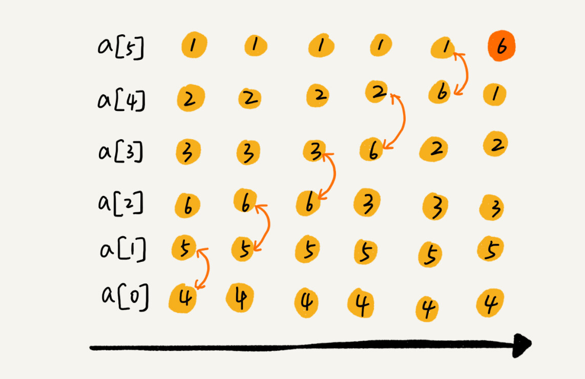

可以看出，经过一次冒泡操作之后，6 这个元素已经存储在正确的位置上。要想完成所有数据的排序，我们只要进行 6 次这样的冒泡操作就行了。

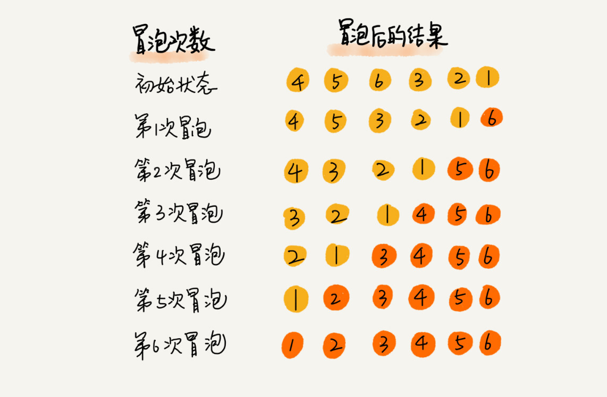

实际上，刚讲的冒泡过程还可以优化。当某次冒泡操作已经没有数据交换时，说明已经达到完全有序，不用再继续执行后续的冒泡操作。我这里还有另外一个例子，这里面给 6 个元素排序，只需要 4 次冒泡操作就可以了。

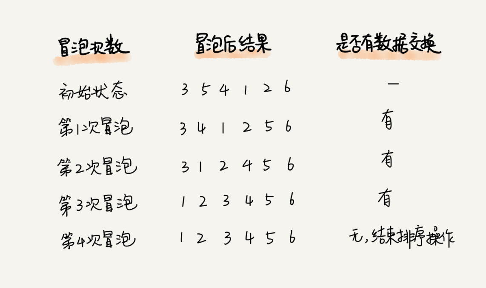

冒泡排序算法的原理比较容易理解，具体的代码我贴到下面，你可以结合着代码来看我前面讲的原理。

```java
// 冒泡排序，a表示数组，n表示数组大小
public void bubbleSort(int[] a, int n) {
  if (n <= 1) return;
 
 for (int i = 0; i < n; ++i) {
    // 提前退出冒泡循环的标志位
    boolean flag = false;
    for (int j = 0; j < n - i - 1; ++j) {
      if (a[j] > a[j+1]) { // 交换
        int tmp = a[j];
        a[j] = a[j+1];
        a[j+1] = tmp;
        flag = true;  // 表示有数据交换      
      }
    }
    if (!flag) break;  // 没有数据交换，提前退出
  }
}
```

现在，结合刚才我分析排序算法的三个方面，我有三个问题要问你。

#### 第一，冒泡排序是原地排序算法吗？

冒泡的过程只涉及相邻数据的交换操作，只需要常量级的临时空间，所以它的空间复杂度为 O(1)，是一个原地排序算法。

#### 第二，冒泡排序是稳定的排序算法吗？

在冒泡排序中，只有交换才可以改变两个元素的前后顺序。为了保证冒泡排序算法的稳定性，当有相邻的两个元素大小相等的时候，我们不做交换，相同大小的数据在排序前后不会改变顺序，所以冒泡排序是稳定的排序算法。

#### 第三，冒泡排序的时间复杂度是多少？

最好情况下，要排序的数据已经是有序的了，我们只需要进行一次冒泡操作，就可以结束了，所以最好情况时间复杂度是 O(n)。而最坏的情况是，要排序的数据刚好是倒序排列的，我们需要进行 n 次冒泡操作，所以最坏情况时间复杂度为 $O(n^2)$。

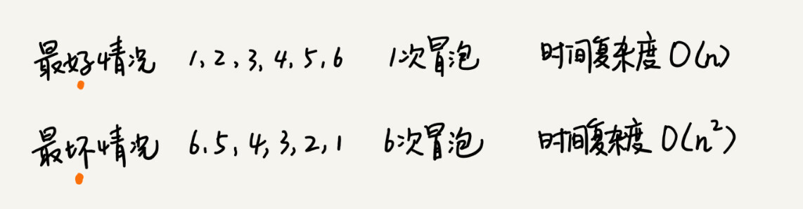

最好、最坏情况下的时间复杂度很容易分析，那平均情况下的时间复杂是多少呢？我们前面讲过，平均时间复杂度就是加权平均期望时间复杂度，分析的时候要结合概率论的知识。

对于包含 n 个数据的数组，这 n 个数据就有 n! 种排列方式。不同的排列方式，冒泡排序执行的时间肯定是不同的。比如我们前面举的那两个例子，其中一个要进行 6 次冒泡，而另一个只需要 4 次。如果用概率论方法定量分析平均时间复杂度，涉及的数学推理和计算就会很复杂。我这里还有一种思路，通过“**有序度**”和“**逆序度**”这两个概念来进行分析。

**有序度**是数组中具有有序关系的元素对的个数。有序元素对用数学表达式表示就是这样：$有序元素对：a[i] <= a[j], 如果i < j。$

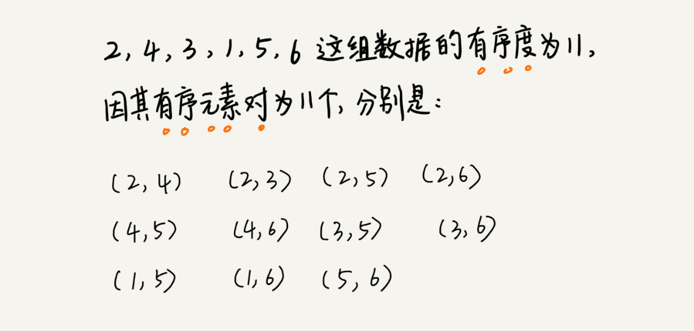

同理，对于一个倒序排列的数组，比如 6，5，4，3，2，1，有序度是 0；对于一个完全有序的数组，比如 1，2，3，4，5，6，有序度就是 $n*(n-1)/2$，也就是 15。我们把这种完全有序的数组的有序度叫作**满有序度**。

逆序度的定义正好跟有序度相反（默认从小到大为有序），我想你应该已经想到了。关于逆序度，我就不举例子讲了。你可以对照我讲的有序度的例子自己看下。

$逆序元素对：a[i] > a[j], 如果i < j。$

关于这三个概念，我们还可以得到一个公式：**逆序度 = 满有序度 - 有序度**。我们排序的过程就是一种增加有序度，减少逆序度的过程，最后达到满有序度，就说明排序完成了。

我还是拿前面举的那个冒泡排序的例子来说明。要排序的数组的初始状态是 4，5，6，3，2，1 ，其中，有序元素对有 (4，5) (4，6)(5，6)，所以有序度是 3。n=6，所以排序完成之后终态的满有序度为 $n*(n-1)/2=15$。

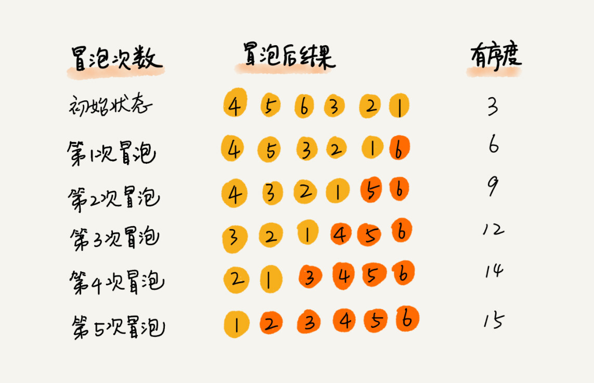

冒泡排序包含两个操作原子，**比较**和**交换**。每交换一次，有序度就加 1。不管算法怎么改进，交换次数总是确定的，即为**逆序度**，也就是$n*(n-1)/2–初始有序度$​​。此例中就是 15–3=12，要进行 12 次交换操作。

对于包含 n 个数据的数组进行冒泡排序，平均交换次数是多少呢？最坏情况下，初始状态的有序度是 0，所以要进行 $n*(n-1)/2$​ 次交换。最好情况下，初始状态的有序度是 $n*(n-1)/2$，就不需要进行交换。我们可以取个中间值 $n*(n-1)/4$，来表示初始有序度既不是很高也不是很低的平均情况。

换句话说，平均情况下，需要 $n*(n-1)/4$次交换操作，比较操作肯定要比交换操作多，而复杂度的上限是 $O(n^2)$，所以平均情况下的时间复杂度就是 $O(n^2)$。

这个平均时间复杂度推导过程其实并不严格，但是很多时候很实用，毕竟概率论的定量分析太复杂，不太好用。等我们讲到快排的时候，我还会再次用这种“不严格”的方法来分析平均时间复杂度。

### 插入排序（Insertion Sort）

**《算法导论》中的扑克牌例子更容易理解。**

我们先来看一个问题。一个有序的数组，我们往里面添加一个新的数据后，如何继续保持数据有序呢？很简单，我们只要遍历数组，找到数据应该插入的位置将其插入即可。

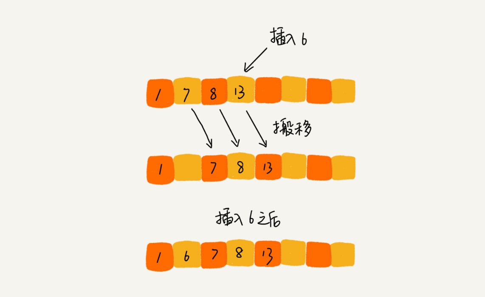

这是一个动态排序的过程，即动态地往有序集合中添加数据，我们可以通过这种方法保持集合中的数据一直有序。而对于一组静态数据，我们也可以借鉴上面讲的插入方法，来进行排序，于是就有了插入排序算法。

那插入排序具体是如何借助上面的思想来实现排序的呢？

首先，我们将数组中的数据分为两个区间，**已排序区间**和**未排序区间**。初始已排序区间只有一个元素，就是数组的第一个元素。插入算法的核心思想是取未排序区间中的元素，在已排序区间中找到合适的插入位置将其插入，并保证已排序区间数据一直有序。重复这个过程，直到未排序区间中元素为空，算法结束。

如图所示，要排序的数据是 4，5，6，1，3，2，其中左侧为已排序区间，右侧是未排序区间。


插入排序也包含两种操作，一种是元素的比较，一种是元素的移动。当我们需要将一个数据 a 插入到已排序区间时，需要拿 a 与已排序区间的元素依次比较大小，找到合适的插入位置。找到插入点之后，我们还需要将插入点之后的元素顺序往后移动一位，这样才能腾出位置给元素 a 插入。

对于不同的查找插入点方法（从头到尾、从尾到头），元素的比较次数是有区别的。但对于一个给定的初始序列，移动操作的次数总是固定的，就等于逆序度。

为什么说移动次数就等于逆序度呢？我拿刚才的例子画了一个图表，你一看就明白了。满有序度是 $n*(n-1)/2=15$，初始序列的有序度是 5，所以逆序度是 10。插入排序中，数据移动的个数总和也等于 $10=3+3+4$。

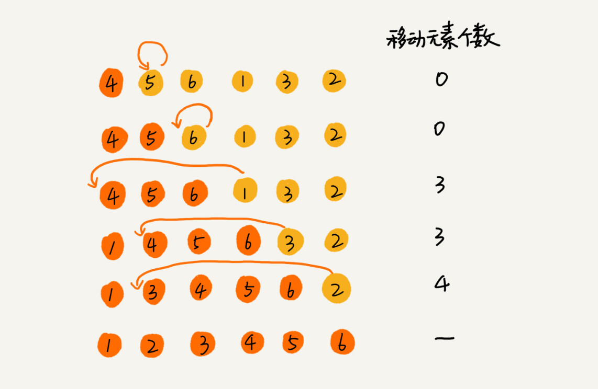

插入排序的原理也很简单吧？我也将代码实现贴在这里，你可以结合着代码再看下。

```java
// 插入排序，a表示数组，n表示数组大小
public void insertionSort(int[] a, int n) {
  if (n <= 1) return;

  for (int i = 1; i < n; ++i) {
    int value = a[i];
    int j = i - 1;
    // 查找插入的位置
    for (; j >= 0; --j) {
      if (a[j] > value) {
        a[j+1] = a[j];  // 数据移动
      } else {
        break;
      }
    }
    a[j+1] = value; // 插入数据
  }
}
```

现在，我们来看点稍微复杂的东西。我这里还是有三个问题要问你。

#### 第一，插入排序是原地排序算法吗？

从实现过程可以很明显地看出，插入排序算法的运行并不需要额外的存储空间，所以空间复杂度是 $O(1)$，也就是说，这是一个原地排序算法。

#### 第二，插入排序是稳定的排序算法吗？

在插入排序中，对于值相同的元素，我们可以选择将后面出现的元素，插入到前面出现元素的后面，这样就可以保持原有的前后顺序不变，所以插入排序是稳定的排序算法。

#### 第三，插入排序的时间复杂度是多少？

如果要排序的数据已经是有序的，我们并不需要搬移任何数据。如果我们从尾到头在有序数据组里面查找插入位置，每次只需要比较一个数据就能确定插入的位置。所以这种情况下，最好是时间复杂度为 O(n)。注意，这里是**从尾到头遍历已经有序的数据**。

如果数组是倒序的，每次插入都相当于在数组的第一个位置插入新的数据，所以需要移动大量的数据，所以最坏情况时间复杂度为 $O(n^2)$。

还记得我们在数组中插入一个数据的平均时间复杂度是多少吗？没错，是 O(n)。所以，对于插入排序来说，每次插入操作都相当于在数组中插入一个数据，循环执行 n 次插入操作，所以平均时间复杂度为 $O(n^2)$。

### 选择排序（Selection Sort）

选择排序算法的实现思路有点类似插入排序，也分已排序区间和未排序区间。但是选择排序每次会从未排序区间中找到最小的元素，将其放到已排序区间的末尾。


照例，也有三个问题需要你思考，不过前面两种排序算法我已经分析得很详细了，这里就直接公布答案了。

#### 第一，选择排序是原地排序算法吗？

是一种原地排序算法。

#### 第二，选择排序是稳定的排序算法吗？

这个问题我着重来说一下。

答案是否定的，选择排序是一种不稳定的排序算法。从我前面画的那张图中，你可以看出来，选择排序每次都要找剩余未排序元素中的最小值，并和前面的元素交换位置，这样破坏了稳定性。

比如 5，8，5，2，9 这样一组数据，使用选择排序算法来排序的话，第一次找到最小元素 2，与第一个 5 交换位置，那第一个 5 和中间的 5 顺序就变了，所以就不稳定了。正是因此，相对于冒泡排序和插入排序，选择排序就稍微逊色了。

#### 第三，选择排序的时间复杂度是多少？

选择排序空间复杂度为 O(1)。选择排序的最好情况时间复杂度、最坏情况和平均情况时间复杂度都为 $O(n^2)$。

### 解答开篇

基本的知识都讲完了，我们来看开篇的问题：冒泡排序和插入排序的时间复杂度都是 $O(n^2)$，都是原地排序算法，为什么插入排序要比冒泡排序更受欢迎呢？

我们前面分析冒泡排序和插入排序的时候讲到，冒泡排序不管怎么优化，元素交换的次数是一个固定值，是原始数据的逆序度。插入排序是同样的，不管怎么优化，元素移动的次数也等于原始数据的逆序度。

但是，从代码实现上来看，冒泡排序的数据交换要比插入排序的数据移动要复杂，冒泡排序需要 3 个赋值操作，而插入排序只需要 1 个。我们来看这段操作：

```c
// 冒泡排序中数据的交换操作：
if (a[j] > a[j+1]) { // 交换
   int tmp = a[j];
   a[j] = a[j+1];
   a[j+1] = tmp;
   flag = true;
}

// 插入排序中数据的移动操作：
if (a[j] > value) {
  a[j+1] = a[j];  // 数据移动
} else {
  break;
}
```

我们把执行一个赋值语句的时间粗略地计为单位时间（unit_time），然后分别用冒泡排序和插入排序对同一个逆序度是 K 的数组进行排序。用冒泡排序，需要 K 次交换操作，每次需要 3 个赋值语句，所以交换操作总耗时就是 $3*K$ 单位时间。而插入排序中数据移动操作只需要 K 个单位时间。

这个只是我们非常理论的分析，为了实验，针对上面的冒泡排序和插入排序的 Java 代码，我写了一个性能对比测试程序，随机生成 10000 个数组，每个数组中包含 200 个数据，然后在我的机器上分别用冒泡和插入排序算法来排序，冒泡排序算法大约 700 ms 才能执行完成，而插入排序只需要 100 ms 左右就能搞定！

所以，虽然冒泡排序和插入排序在时间复杂度上是一样的，都是 $O(n^2)$，但是如果我们希望把性能优化做到极致，那肯定首选插入排序。插入排序的算法思路也有很大的优化空间，我们只是讲了最基础的一种。如果你对插入排序的优化感兴趣，可以自行学习一下希尔排序。

### 内容小结

要想分析、评价一个排序算法，需要从执行效率、内存消耗和稳定性三个方面来看。因此，这一节，我带你分析了三种时间复杂度是 $O(n^2)$ 的排序算法，冒泡排序、插入排序、选择排序。你需要重点掌握的是它们的分析方法。

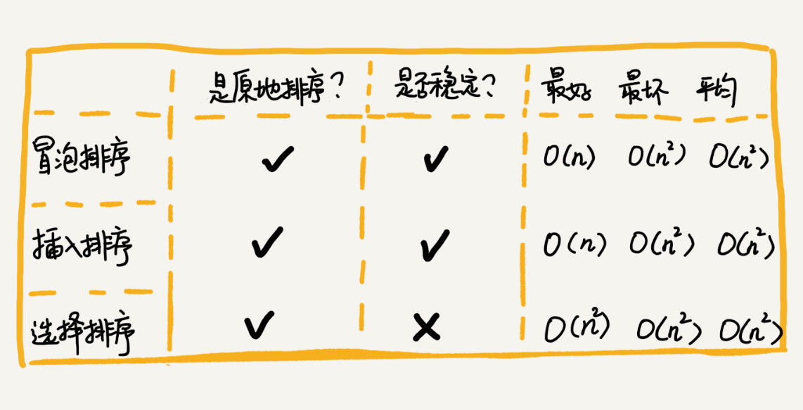

这三种时间复杂度为 $O(n^2)$ 的排序算法中，冒泡排序、选择排序，可能就纯粹停留在理论的层面了，学习的目的也只是为了开拓思维，实际开发中应用并不多，但是插入排序还是挺有用的。后面讲排序优化的时候，我会讲到，有些编程语言中的排序函数的实现原理会用到插入排序算法。

今天讲的这三种排序算法，实现代码都非常简单，对于小规模数据的排序，用起来非常高效。但是在大规模数据排序的时候，这个时间复杂度还是稍微有点高，所以我们更倾向于用下一节要讲的时间复杂度为 $O(nlogn)$ 的排序算法。

## 12 | 排序（下）：如何用快排思想在O(n)内查找第K大元素？

上一节我讲了冒泡排序、插入排序、选择排序这三种排序算法，它们的时间复杂度都是 $O(n^2)$​，比较高，适合小规模数据的排序。今天，我讲两种时间复杂度为 $O(nlogn)$ 的排序算法，归并排序和快速排序。这两种排序算法适合大规模的数据排序，比上一节讲的那三种排序算法要更常用。

归并排序和快速排序都用到了分治思想，非常巧妙。我们可以借鉴这个思想，来解决非排序的问题，比如：如何在 O(n) 的时间复杂度内查找一个无序数组中的第 K 大元素？ 这就要用到我们今天要讲的内容。

### 归并排序的原理

我们先来看归并排序（Merge Sort）。

归并排序的核心思想还是蛮简单的。如果要排序一个数组，我们先把数组从中间分成前后两部分，然后对前后两部分分别排序，再将排好序的两部分合并在一起，这样整个数组就都有序了。

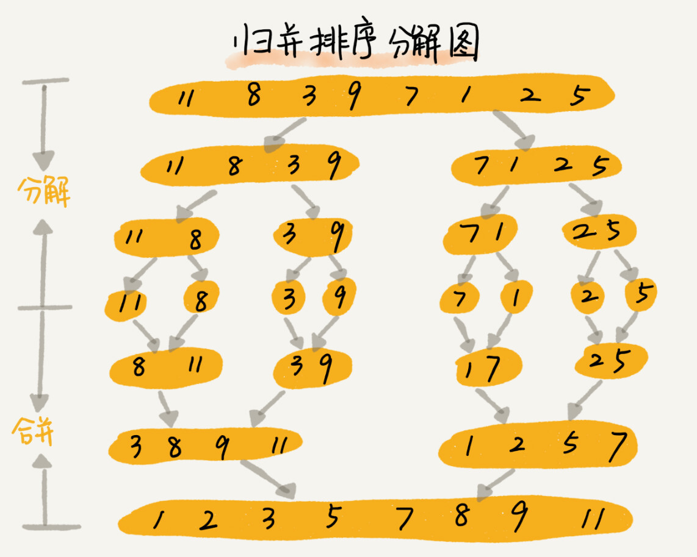

归并排序使用的就是**分治思想**。分治，顾名思义，就是分而治之，将一个大问题分解成小的子问题来解决。小的子问题解决了，大问题也就解决了。

从我刚才的描述，你有没有感觉到，分治思想跟我们前面讲的递归思想很像。是的，分治算法一般都是用递归来实现的。**分治是一种解决问题的处理思想，递归是一种编程技巧**，这两者并不冲突。分治算法的思想我后面会有专门的一节来讲，现在不展开讨论，我们今天的重点还是排序算法。

前面我通过举例让你对归并有了一个感性的认识，又告诉你，归并排序用的是分治思想，可以用递归来实现。我们现在就来看看**如何用递归代码来实现归并排序**。

我在第 10 节讲的递归代码的编写技巧你还记得吗？写递归代码的技巧就是，分析得出递推公式，然后找到终止条件，最后将递推公式翻译成递归代码。所以，要想写出归并排序的代码，我们先写出归并排序的递推公式。

```c
// 递推公式：
merge_sort(p…r) = merge(merge_sort(p…q), merge_sort(q+1…r))
//终止条件：
p >= r // 不用再继续分解
```

我来解释一下这个递推公式。

`merge_sort(p…r)` 表示，给下标从 p 到 r 之间的数组排序。我们将这个排序问题转化为了两个子问题，`merge_sort(p…q)` 和 `merge_sort(q+1…r)`，其中下标 q 等于 p 和 r 的中间位置，也就是 $(p+r)/2$。当下标从 p 到 q 和从 $q+1$ 到 r 这两个子数组都排好序之后，我们再将两个有序的子数组合并在一起，这样下标从 p 到 r 之间的数据就也排好序了。

有了递推公式，转化成代码就简单多了。为了阅读方便，我这里只给出伪代码，你可以翻译成你熟悉的编程语言。

```c
// 归并排序算法, A是数组，n表示数组大小
merge_sort(A, n) {
  merge_sort_c(A, 0, n-1)
}

// 递归调用函数
merge_sort_c(A, p, r) {
  // 递归终止条件
  if p >= r  then return

  // 取p到r之间的中间位置q
  q = (p+r) / 2
  // 分治递归
  merge_sort_c(A, p, q)
  merge_sort_c(A, q+1, r)
  // 将A[p...q]和A[q+1...r]合并为A[p...r]
  merge(A[p...r], A[p...q], A[q+1...r])
}
```

你可能已经发现了，`merge(A[p...r], A[p...q], A[q+1...r])` 这个函数的作用就是，将已经有序的 `A[p...q]`和 `A[q+1....r]`合并成一个有序的数组，并且放入 `A[p....r]`。那这个过程具体该如何做呢？

如图所示，我们申请一个临时数组 tmp，大小与 `A[p...r]`相同。我们用两个游标 i 和 j，分别指向 `A[p...q]`和 `A[q+1...r]`的第一个元素。比较这两个元素 A[i]和 A[j]，如果 `A[i]<=A[j]`，我们就把 A[i]放入到临时数组 tmp，并且 i 后移一位，否则将 A[j]放入到数组 tmp，j 后移一位。

继续上述比较过程，直到其中一个子数组中的所有数据都放入临时数组中，再把另一个数组中的数据依次加入到临时数组的末尾，这个时候，临时数组中存储的就是两个子数组合并之后的结果了。最后再把临时数组 tmp 中的数据拷贝到原数组 `A[p...r]`中。

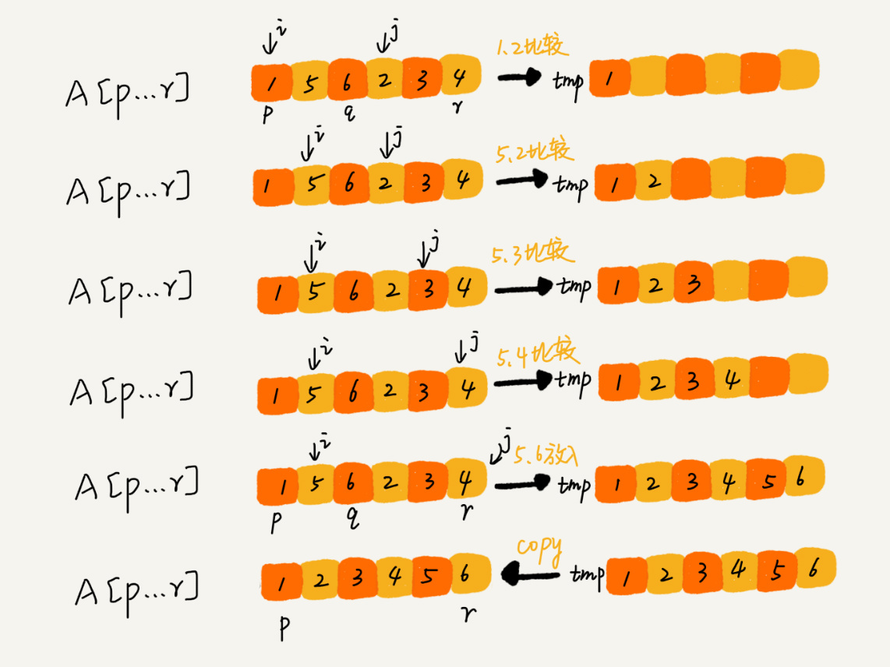

我们把 merge() 函数写成伪代码，就是下面这样：

```c
merge(A[p...r], A[p...q], A[q+1...r]) {
  var i := p，j := q+1，k := 0 // 初始化变量i, j, k
  var tmp := new array[0...r-p] // 申请一个大小跟A[p...r]一样的临时数组
  while i<=q AND j<=r do {
    if A[i] <= A[j] {
      tmp[k++] = A[i++] // i++等于i:=i+1
    } else {
      tmp[k++] = A[j++]
    }
  }
  
  // 判断哪个子数组中有剩余的数据
  var start := i，end := q
  if j<=r then start := j, end:=r
  
  // 将剩余的数据拷贝到临时数组tmp
  while start <= end do {
    tmp[k++] = A[start++]
  }
  
  // 将tmp中的数组拷贝回A[p...r]
  for i:=0 to r-p do {
    A[p+i] = tmp[i]
  }
}
```

你还记得第 7 讲讲过的利用哨兵简化编程的处理技巧吗？merge() 合并函数如果借助哨兵，代码就会简洁很多，这个问题留给你思考。

### 归并排序的性能分析

这样跟着我一步一步分析，归并排序是不是没那么难啦？还记得上节课我们分析排序算法的三个问题吗？接下来，我们来看归并排序的三个问题。

#### 第一，归并排序是稳定的排序算法吗？

结合我前面画的那张图和归并排序的伪代码，你应该能发现，归并排序稳不稳定关键要看 merge() 函数，也就是两个有序子数组合并成一个有序数组的那部分代码。

在合并的过程中，如果 A[p...q]和 A[q+1...r]之间有值相同的元素，那我们可以像伪代码中那样，先把 A[p...q]中的元素放入 tmp 数组。这样就保证了值相同的元素，在合并前后的先后顺序不变。所以，归并排序是一个稳定的排序算法。

#### 第二，归并排序的时间复杂度是多少？

归并排序涉及递归，时间复杂度的分析稍微有点复杂。我们正好借此机会来学习一下，如何分析递归代码的时间复杂度。

在递归那一节我们讲过，递归的适用场景是，一个问题 a 可以分解为多个子问题 b、c，那求解问题 a 就可以分解为求解问题 b、c。问题 b、c 解决之后，我们再把 b、c 的结果合并成 a 的结果。

如果我们定义求解问题 a 的时间是 T(a)，求解问题 b、c 的时间分别是 T(b) 和 T( c)，那我们就可以得到这样的递推关系式：$T(a) = T(b) + T(c) + K$

其中 K 等于将两个子问题 b、c 的结果合并成问题 a 的结果所消耗的时间。

从刚刚的分析，我们可以得到一个重要的结论：**不仅递归求解的问题可以写成递推公式，递归代码的时间复杂度也可以写成递推公式**。

套用这个公式，我们来分析一下归并排序的时间复杂度。

我们假设对 n 个元素进行归并排序需要的时间是 T(n)，那分解成两个子数组排序的时间都是 $T(n/2)$。我们知道，merge() 函数合并两个有序子数组的时间复杂度是 O(n)。所以，套用前面的公式，归并排序的时间复杂度的计算公式就是：
$$
\begin{align}
& T(1) = C; \quad n=1时，只需要常量级的执行时间，所以表示为C。\\
& T(n) = 2*T(n/2) + n; \quad n>1
\end{align}
$$
通过这个公式，如何来求解 T(n) 呢？还不够直观？那我们再进一步分解一下计算过程。
$$
\begin{align}
T(n) &  = 2*T(n/2) + n \\
& = 2*(2*T(n/4) + n/2) + n = 4*T(n/4) + 2*n \\
& = 4*(2*T(n/8) + n/4) + 2*n = 8*T(n/8) + 3*n \\
& = 8*(2*T(n/16) + n/8) + 3*n = 16*T(n/16) + 4*n \\
& ...... \\
& = 2^k * T(n/2^k) + k * n \\
& ......
\end{align}
$$
通过这样一步一步分解推导，我们可以得到 $T(n) = 2^kT(n/2^k)+kn$​​。当 $T(n/2^k)=T(1)$​时，也就是 $n/2^k=1$​，我们得到 $k=log_2n$ 。我们将 k 值代入上面的公式，得到 $T(n)=Cn+nlog_2n$​ 。如果我们用大 O 标记法来表示的话，T(n) 就等于 $O(nlogn)$。所以归并排序的时间复杂度是 $O(nlogn)$。

从我们的原理分析和伪代码可以看出，归并排序的执行效率与要排序的原始数组的有序程度无关，所以其时间复杂度是非常稳定的，不管是最好情况、最坏情况，还是平均情况，时间复杂度都是 $O(nlogn)$。

#### 第三，归并排序的空间复杂度是多少？

归并排序的时间复杂度任何情况下都是 $O(nlogn)$，看起来非常优秀。（待会儿你会发现，即便是快速排序，最坏情况下，时间复杂度也是 $O(n^2)$​​​。）但是，归并排序并没有像快排那样，应用广泛，这是为什么呢？因为它有一个**致命的“弱点”**，那就是归并排序**不是原地排序算法**。

这是因为归并排序的合并函数，在合并两个有序数组为一个有序数组时，需要借助额外的存储空间。这一点你应该很容易理解。那我现在问你，归并排序的空间复杂度到底是多少呢？是 $O(n)$，还是 $O(nlogn)$，应该如何分析呢？

如果我们继续按照分析递归时间复杂度的方法，通过递推公式来求解，那整个归并过程需要的空间复杂度就是 $O(nlogn)$。不过，类似分析时间复杂度那样来分析空间复杂度，这个思路对吗？

实际上，递归代码的空间复杂度并不能像时间复杂度那样累加。刚刚我们忘记了最重要的一点，那就是，尽管每次合并操作都需要申请额外的内存空间，但在合并完成之后，临时开辟的内存空间就被释放掉了。在任意时刻，CPU 只会有一个函数在执行，也就只会有一个临时的内存空间在使用。临时内存空间最大也不会超过 n 个数据的大小，所以空间复杂度是 O(n)。

### 快速排序的原理

我们再来看快速排序算法（Quick Sort），我们习惯性把它简称为“快排”。快排利用的也是分治思想。乍看起来，它有点像归并排序，但是思路其实完全不一样。我们待会会讲两者的区别。现在，我们先来看下快排的核心思想。

快排的思想是这样的：如果要排序数组中下标从 p 到 r 之间的一组数据，我们选择 p 到 r 之间的任意一个数据作为 pivot（分区点）。

我们遍历 p 到 r 之间的数据，将小于 pivot 的放到左边，将大于 pivot 的放到右边，将 pivot 放到中间。经过这一步骤之后，数组 p 到 r 之间的数据就被分成了三个部分，前面 p 到 q-1 之间都是小于 pivot 的，中间是 pivot，后面的 q+1 到 r 之间是大于 pivot 的。


根据分治、递归的处理思想，我们可以用递归排序下标从 p 到 q-1 之间的数据和下标从 q+1 到 r 之间的数据，直到区间缩小为 1，就说明所有的数据都有序了。

如果我们用递推公式来将上面的过程写出来的话，就是这样：

```c
// 递推公式：
quick_sort(p…r) = quick_sort(p…q-1) + quick_sort(q+1… r)
// 终止条件：
p >= r
```

我将递推公式转化成递归代码。跟归并排序一样，我还是用伪代码来实现，你可以翻译成你熟悉的任何语言。

```c
// 快速排序，A是数组，n表示数组的大小
quick_sort(A, n) {
  quick_sort_c(A, 0, n-1)
}
// 快速排序递归函数，p,r为下标
quick_sort_c(A, p, r) {
  if p >= r then return
  
  q = partition(A, p, r) // 获取分区点
  quick_sort_c(A, p, q-1)
  quick_sort_c(A, q+1, r)
}
```

归并排序中有一个 merge() 合并函数，我们这里有一个 partition() 分区函数。partition() 分区函数实际上我们前面已经讲过了，就是随机选择一个元素作为 pivot（一般情况下，可以选择 p 到 r 区间的最后一个元素），然后对 A[p...r]分区，函数返回 pivot 的下标。

如果我们不考虑空间消耗的话，partition() 分区函数可以写得非常简单。我们申请两个临时数组 X 和 Y，遍历 A[p...r]，将小于 pivot 的元素都拷贝到临时数组 X，将大于 pivot 的元素都拷贝到临时数组 Y，最后再将数组 X 和数组 Y 中数据顺序拷贝到 A[p....r]。

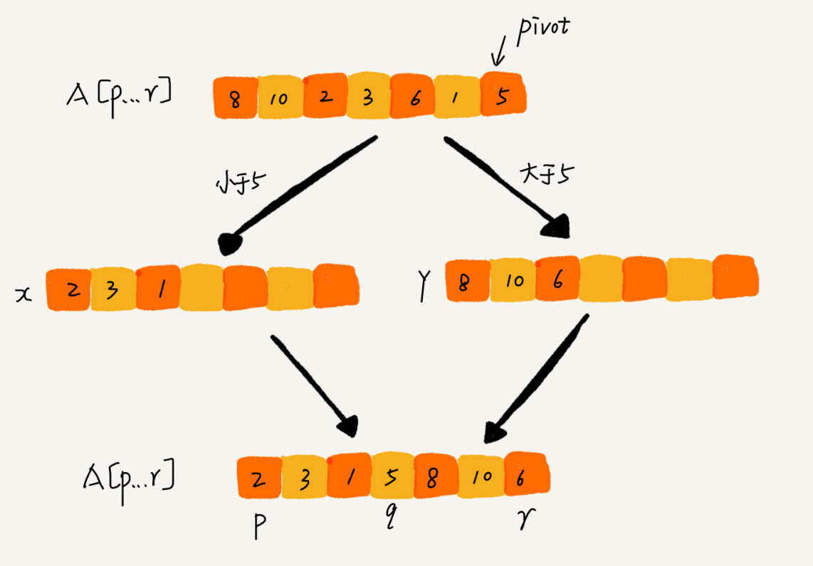

但是，如果按照这种思路实现的话，partition() 函数就需要很多额外的内存空间，所以快排就不是原地排序算法了。如果我们希望快排是原地排序算法，那它的空间复杂度得是 O(1)，那 partition() 分区函数就不能占用太多额外的内存空间，我们就需要在 A[p...r]的原地完成分区操作。

原地分区函数的实现思路非常巧妙，我写成了伪代码，我们一起来看一下。

```python
partition(A, p, r) {
  pivot := A[r]
  i := p
  for j := p to r-1 do {
    if A[j] < pivot {
      swap A[i] with A[j]
      i := i+1
    }
  }
  swap A[i] with A[r]
  return i
```

这里的处理有点类似选择排序。我们通过游标 i 把 A[p...r-1]分成两部分。A[p...i-1]的元素都是小于 pivot 的，我们暂且叫它“已处理区间”，A[i...r-1]是“未处理区间”。我们每次都从未处理的区间 A[i...r-1]中取一个元素 A[j]，与 pivot 对比，如果小于 pivot，则将其加入到已处理区间的尾部，也就是 A[i]的位置。

数组的插入操作还记得吗？在数组某个位置插入元素，需要搬移数据，非常耗时。当时我们也讲了一种处理技巧，就是交换，在 O(1) 的时间复杂度内完成插入操作。这里我们也借助这个思想，只需要将 A[i]与 A[j]交换，就可以在 O(1) 时间复杂度内将 A[j]放到下标为 i 的位置。

文字不如图直观，所以我画了一张图来展示分区的整个过程。

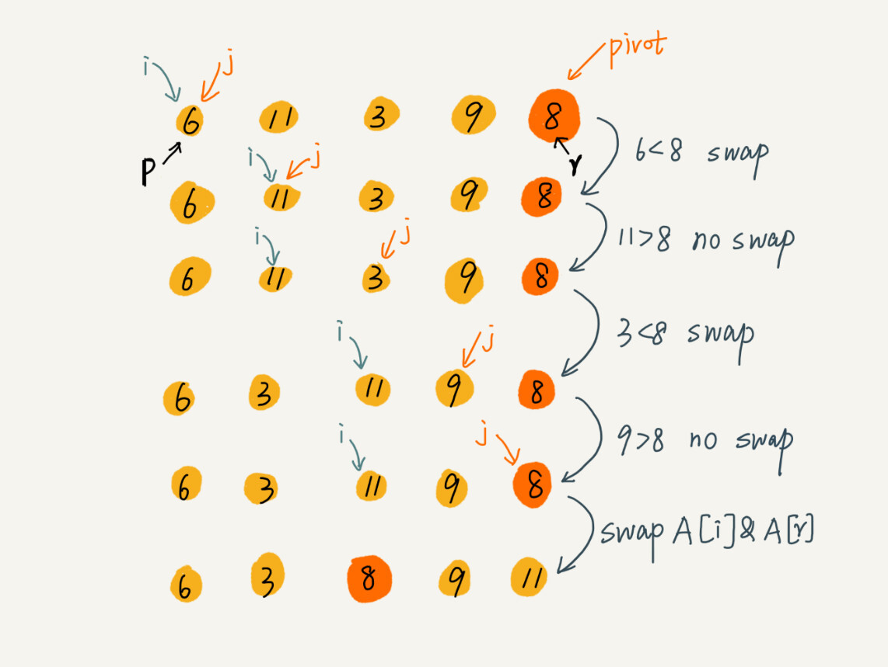

因为分区的过程涉及交换操作，如果数组中有两个相同的元素，比如序列 6，8，7，6，3，5，9，4，在经过第一次分区操作之后，两个 6 的相对先后顺序就会改变。所以，快速排序并不是一个稳定的排序算法。

到此，快速排序的原理你应该也掌握了。现在，我再来看另外一个问题：快排和归并用的都是分治思想，递推公式和递归代码也非常相似，那它们的区别在哪里呢？

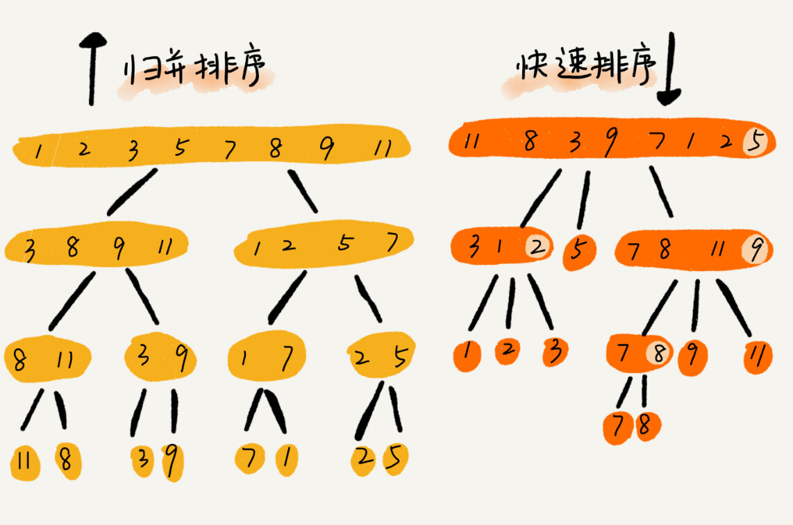

可以发现，归并排序的处理过程是由下到上的，先处理子问题，然后再合并。而快排正好相反，它的处理过程是由上到下的，先分区，然后再处理子问题。归并排序虽然是稳定的、时间复杂度为 $O(nlogn)$ 的排序算法，但是它是非原地排序算法。我们前面讲过，归并之所以是非原地排序算法，主要原因是合并函数无法在原地执行。快速排序通过设计巧妙的原地分区函数，可以实现原地排序，解决了归并排序占用太多内存的问题。

### 快速排序的性能分析

现在，我们来分析一下快速排序的性能。我在讲解快排的实现原理的时候，已经分析了稳定性和空间复杂度。快排是一种原地、不稳定的排序算法。现在，我们集中精力来看快排的时间复杂度。

快排也是用递归来实现的。对于递归代码的时间复杂度，我前面总结的公式，这里也还是适用的。如果每次分区操作，都能正好把数组分成大小接近相等的两个小区间，那快排的时间复杂度递推求解公式跟归并是相同的。所以，快排的时间复杂度也是 $O(nlogn)$。
$$
\begin{align}
& T(1) = C;  \quad n=1时，只需要常量级的执行时间，所以表示为C。\\
& T(n) = 2*T(n/2) + n; \quad n>1 
\end{align}
$$
但是，公式成立的前提是每次分区操作，我们选择的 pivot 都很合适，正好能将大区间对等地一分为二。但实际上这种情况是很难实现的。

我举一个比较极端的例子。如果数组中的数据原来已经是有序的了，比如 1，3，5，6，8。如果我们每次选择最后一个元素作为 pivot，那每次分区得到的两个区间都是不均等的。我们需要进行大约 n 次分区操作，才能完成快排的整个过程。每次分区我们平均要扫描大约 n/2 个元素，这种情况下，快排的时间复杂度就从 $O(nlogn)$ 退化成了 $O(n^2)$。

我们刚刚讲了两个极端情况下的时间复杂度，一个是分区极其均衡，一个是分区极其不均衡。它们分别对应快排的最好情况时间复杂度和最坏情况时间复杂度。那快排的平均情况时间复杂度是多少呢？

我们假设每次分区操作都将区间分成大小为 9:1 的两个小区间。我们继续套用递归时间复杂度的递推公式，就会变成这样：
$$
\begin{align}
& T(1) = C; \quad n=1时，只需要常量级的执行时间，所以表示为C。 \\
& T(n) = T(n/10) + T(9*\frac{n}{10}) + n; \quad n>1
\end{align}
$$
这个公式的递推求解的过程非常复杂，虽然可以求解，但我不推荐用这种方法。实际上，递归的时间复杂度的求解方法除了递推公式之外，还有递归树，在树那一节我再讲，这里暂时不说。我这里直接给你结论：$T(n)$ 在大部分情况下的时间复杂度都可以做到 $O(nlogn)$，只有在极端情况下，才会退化到 $O(n^2)$​。而且，我们也有很多方法将这个概率降到很低，如何来做？我们后面章节再讲。

### 解答开篇

快排核心思想就是**分治**和**分区**，我们可以利用分区的思想，来解答开篇的问题：$O(n)$时间复杂度内求无序数组中的第 K 大元素。比如，4， 2， 5， 12， 3 这样一组数据，第 3 大元素就是 4。

我们选择数组区间 A[0...n-1]的最后一个元素 A[n-1]作为 pivot，对数组 A[0...n-1]原地分区，这样数组就分成了三部分，A[0...p-1]、A[p]、A[p+1...n-1]。

如果 $p+1=K$，那 A[p]就是要求解的元素；如果 $K>p+1$, 说明第 K 大元素出现在 A[p+1...n-1]区间，我们再按照上面的思路递归地在 A[p+1...n-1]这个区间内查找。同理，如果 $K<p+1$，那我们就在 A[0...p-1]区间查找。

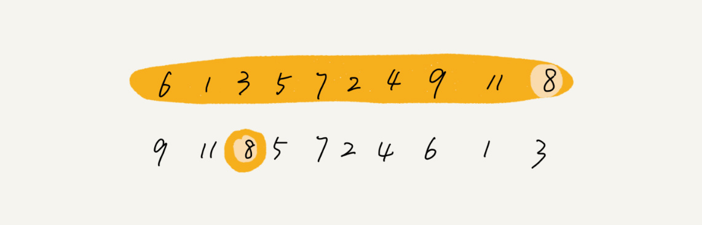

我们再来看，为什么上述解决思路的时间复杂度是 O(n)？

第一次分区查找，我们需要对大小为 n 的数组执行分区操作，需要遍历 n 个元素。第二次分区查找，我们只需要对大小为 n/2 的数组执行分区操作，需要遍历 n/2 个元素。依次类推，分区遍历元素的个数分别为、n/2、n/4、n/8、n/16.……直到区间缩小为 1。

如果我们把每次分区遍历的元素个数加起来，就是：$n+n/2+n/4+n/8+...+1$。这是一个等比数列求和，最后的和等于 $2n-1$。所以，上述解决思路的时间复杂度就为 O(n)。

你可能会说，我有个很笨的办法，每次取数组中的最小值，将其移动到数组的最前面，然后在剩下的数组中继续找最小值，以此类推，执行 K 次，找到的数据不就是第 K 大元素了吗？

不过，时间复杂度就并不是 O(n) 了，而是 $O(K * n)$​。你可能会说，时间复杂度前面的系数不是可以忽略吗？$O(K*n) $​​不就等于 O(n) 吗？

这个可不能这么简单地划等号。当 K 是比较小的常量时，比如 1、2，那最好时间复杂度确实是 O(n)；但当 K 等于 n/2 或者 n 时，这种最坏情况下的时间复杂度就是 $O(n^2)$ 了。

### 内容小结

归并排序和快速排序是两种稍微复杂的排序算法，它们用的都是分治的思想，代码都通过递归来实现，过程非常相似。理解归并排序的重点是理解递推公式和 merge() 合并函数。同理，理解快排的重点也是理解递推公式，还有 partition() 分区函数。

归并排序算法是一种在任何情况下时间复杂度都比较稳定的排序算法，这也使它存在致命的缺点，即归并排序不是原地排序算法，空间复杂度比较高，是 O(n)。正因为此，它也没有快排应用广泛。

快速排序算法虽然最坏情况下的时间复杂度是 $O(n^2)$，但是平均情况下时间复杂度都是 $O(nlogn)$。不仅如此，快速排序算法时间复杂度退化到 $O(n^2)$ 的概率非常小，我们可以通过合理地选择 pivot 来避免这种情况。

## 13 | 线性排序：如何根据年龄给100万用户数据排序？

上两节中，我带你着重分析了几种常用排序算法的原理、时间复杂度、空间复杂度、稳定性等。今天，我会讲三种时间复杂度是 O(n) 的排序算法：桶排序、计数排序、基数排序。因为这些排序算法的时间复杂度是线性的，所以我们把这类排序算法叫作**线性排序**（Linear sort）。之所以能做到线性的时间复杂度，主要原因是，这三个算法是非基于比较的排序算法，都不涉及元素之间的比较操作。

按照惯例，我先给你出一道思考题：**如何根据年龄给 100 万用户排序**？ 你可能会说，我用上一节课讲的归并、快排就可以搞定啊！是的，它们也可以完成功能，但是时间复杂度最低也是 $O(nlogn)$。有没有更快的排序方法呢？让我们一起进入今天的内容！

### 桶排序（Bucket sort）

首先，我们来看桶排序。桶排序，顾名思义，会用到“桶”，核心思想是将要排序的数据分到几个有序的桶里，每个桶里的数据再单独进行排序。桶内排完序之后，再把每个桶里的数据按照顺序依次取出，组成的序列就是有序的了。

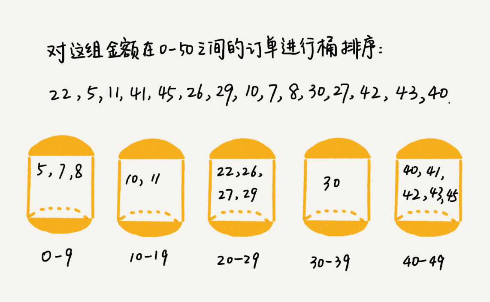

桶排序的时间复杂度为什么是 $O(n)$ 呢？我们一块儿来分析一下。

如果要排序的数据有 n 个，我们把它们均匀地划分到 m 个桶内，每个桶里就有 $k=n/m$​​ 个元素。每个桶内部使用快速排序，时间复杂度为 $O(k * logk)$​​。m 个桶排序的时间复杂度就是 $O(m * k * logk)$​​，因为 $k=\frac{n}{m}$​​，所以整个桶排序的时间复杂度就是 $O(n*log(\frac{n}{m}))$​​。当桶的个数 m 接近数据个数 n 时，$log(\frac{n}{m})$​​ 就是一个非常小的常量，这个时候桶排序的时间复杂度接近 $O(n)$​​​。

**桶排序看起来很优秀，那它是不是可以替代我们之前讲的排序算法呢？**

答案当然是否定的。为了让你轻松理解桶排序的核心思想，我刚才做了很多假设。实际上，桶排序对要排序数据的要求是非常苛刻的。

首先，要排序的数据需要很容易就能划分成 m 个桶，并且，桶与桶之间有着天然的大小顺序。这样每个桶内的数据都排序完之后，桶与桶之间的数据不需要再进行排序。

其次，数据在各个桶之间的分布是比较均匀的。如果数据经过桶的划分之后，有些桶里的数据非常多，有些非常少，很不平均，那桶内数据排序的时间复杂度就不是常量级了。在极端情况下，如果数据都被划分到一个桶里，那就退化为 $O(nlogn)$ 的排序算法了。

**桶排序比较适合用在外部排序中**。所谓的外部排序就是数据存储在外部磁盘中，数据量比较大，内存有限，无法将数据全部加载到内存中。

比如说我们有 10 GB 的订单数据，我们希望按订单金额（假设金额都是正整数）进行排序，但是我们的内存有限，只有几百 MB，没办法一次性把 10 GB 的数据都加载到内存中。这个时候该怎么办呢？

现在我来讲一下，如何借助桶排序的处理思想来解决这个问题。

我们可以先扫描一遍文件，看订单金额所处的数据范围。假设经过扫描之后我们得到，订单金额最小是 1 元，最大是 10 万元。我们将所有订单根据金额划分到 100 个桶里，第一个桶我们存储金额在 1 元到 1000 元之内的订单，第二桶存储金额在 1001 元到 2000 元之内的订单，以此类推。每一个桶对应一个文件，并且按照金额范围的大小顺序编号命名（00，01，02 ... 99）。

理想的情况下，如果订单金额在 1 到 10 万之间均匀分布，那订单会被均匀划分到 100 个文件中，每个小文件中存储大约 100 MB 的订单数据，我们就可以将这 100 个小文件依次放到内存中，用快排来排序。等所有文件都排好序之后，我们只需要按照文件编号，从小到大依次读取每个小文件中的订单数据，并将其写入到一个文件中，那这个文件中存储的就是按照金额从小到大排序的订单数据了。

不过，你可能也发现了，订单按照金额在 1 元到 10 万元之间并不一定是均匀分布的 ，所以 10 GB 订单数据是无法均匀地被划分到 100 个文件中的。有可能某个金额区间的数据特别多，划分之后对应的文件就会很大，没法一次性读入内存。这又该怎么办呢？

针对这些划分之后还是比较大的文件，我们可以继续划分，比如，订单金额在 1 元到 1000 元之间的比较多，我们就将这个区间继续划分为 10 个小区间，1 元到 100 元，101 元到 200 元，201 元到 300 元 .... 901 元到 1000 元。如果划分之后，101 元到 200 元之间的订单还是太多，无法一次性读入内存，那就继续再划分，直到所有的文件都能读入内存为止。

### 计数排序（Counting sort）

我个人觉得，**计数排序其实是桶排序的一种特殊情况**。当要排序的 n 个数据，所处的范围并不大的时候，比如最大值是 k，我们就可以把数据划分成 k 个桶。每个桶内的数据值都是相同的，省掉了桶内排序的时间。

我们都经历过高考，高考查分数系统你还记得吗？我们查分数的时候，系统会显示我们的成绩以及所在省的排名。如果你所在的省有 50 万考生，如何通过成绩快速排序得出名次呢？

考生的满分是 900 分，最小是 0 分，这个数据的范围很小，所以我们可以分成 901 个桶，对应分数从 0 分到 900 分。根据考生的成绩，我们将这 50 万考生划分到这 901 个桶里。桶内的数据都是分数相同的考生，所以并不需要再进行排序。我们只需要依次扫描每个桶，将桶内的考生依次输出到一个数组中，就实现了 50 万考生的排序。因为只涉及扫描遍历操作，所以时间复杂度是 O(n)。

计数排序的算法思想就是这么简单，跟桶排序非常类似，只是桶的大小粒度不一样。**不过，为什么这个排序算法叫“计数”排序呢？“计数”的含义来自哪里呢**？

想弄明白这个问题，我们就要来看计数排序算法的实现方法。我还拿考生那个例子来解释。为了方便说明，我对数据规模做了简化。假设只有 8 个考生，分数在 0 到 5 分之间。这 8 个考生的成绩我们放在一个数组 A[8]中，它们分别是：2，5，3，0，2，3，0，3。

考生的成绩从 0 到 5 分，我们使用大小为 6 的数组 C[6]表示桶，其中下标对应分数。不过，C[6]内存储的并不是考生，而是对应的考生个数。像我刚刚举的那个例子，我们只需要遍历一遍考生分数，就可以得到 C[6]的值。

从图中可以看出，分数为 3 分的考生有 3 个，小于 3 分的考生有 4 个，所以，成绩为 3 分的考生在排序之后的有序数组 R[8]中，会保存下标 4，5，6 的位置。

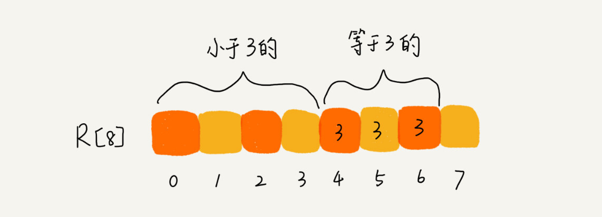

那我们如何快速计算出，每个分数的考生在有序数组中对应的存储位置呢？这个处理方法非常巧妙，很不容易想到。

思路是这样的：我们对 C[6]数组顺序求和，C[6]存储的数据就变成了下面这样子。C[k]里存储小于等于分数 k 的考生个数。


有了前面的数据准备之后，现在我就要讲计数排序中最复杂、最难理解的一部分了，请集中精力跟着我的思路！

我们从后到前依次扫描数组 A。比如，当扫描到 3 时，我们可以从数组 C 中取出下标为 3 的值 7，也就是说，到目前为止，包括自己在内，分数小于等于 3 的考生有 7 个，也就是说 3 是数组 R 中的第 7 个元素（也就是数组 R 中下标为 6 的位置）。当 3 放入到数组 R 中后，小于等于 3 的元素就只剩下了 6 个了，所以相应的 C[3]要减 1，变成 6。

以此类推，当我们扫描到第 2 个分数为 3 的考生的时候，就会把它放入数组 R 中的第 6 个元素的位置（也就是下标为 5 的位置）。当我们扫描完整个数组 A 后，数组 R 内的数据就是按照分数从小到大有序排列的了。


上面的过程有点复杂，我写成了代码，你可以对照着看下。

```java
// 计数排序，a是数组，n是数组大小。假设数组中存储的都是非负整数。
public void countingSort(int[] a, int n) {
  if (n <= 1) return;

  // 查找数组中数据的范围
  int max = a[0];
  for (int i = 1; i < n; ++i) {
    if (max < a[i]) {
      max = a[i];
    }
  }

  int[] c = new int[max + 1]; // 申请一个计数数组c，下标大小[0,max]
  for (int i = 0; i <= max; ++i) {
    c[i] = 0;
  }

  // 计算每个元素的个数，放入c中
  for (int i = 0; i < n; ++i) {
    c[a[i]]++;
  }

  // 依次累加
  for (int i = 1; i <= max; ++i) {
    c[i] = c[i-1] + c[i];
  }

  // 临时数组r，存储排序之后的结果
  int[] r = new int[n];
  // 计算排序的关键步骤，有点难理解
  for (int i = n - 1; i >= 0; --i) {
    int index = c[a[i]]-1;
    r[index] = a[i];
    c[a[i]]--;
  }

  // 将结果拷贝给a数组
  for (int i = 0; i < n; ++i) {
    a[i] = r[i];
  }
}
```

这种利用另外一个数组来计数的实现方式是不是很巧妙呢？这也是为什么这种排序算法叫计数排序的原因。不过，你千万不要死记硬背上面的排序过程，重要的是理解和会用。

我总结一下，计数排序只能用在**数据范围不大**的场景中，如果**数据范围 k** 比**要排序的数据 n** 大很多，就不适合用计数排序了。而且，计数排序只能给**非负整数**排序，如果要排序的数据是其他类型的，要将其在不改变相对大小的情况下，转化为非负整数。

比如，还是拿考生这个例子。如果考生成绩精确到小数后一位，我们就需要将所有的分数都先乘以 10，转化成整数，然后再放到 9010 个桶内。再比如，如果要排序的数据中有负数，数据的范围是[-1000, 1000]，那我们就需要先对每个数据都加 1000，转化成非负整数。

### 基数排序（Radix sort）

我们再来看这样一个排序问题。假设我们有 10 万个手机号码，希望将这 10 万个手机号码从小到大排序，你有什么比较快速的排序方法呢？

我们之前讲的快排，时间复杂度可以做到 $O(nlogn)$，还有更高效的排序算法吗？桶排序、计数排序能派上用场吗？手机号码有 11 位，范围太大，显然不适合用这两种排序算法。针对这个排序问题，有没有时间复杂度是 O(n) 的算法呢？现在我就来介绍一种新的排序算法，基数排序。

刚刚这个问题里有这样的规律：假设要比较两个手机号码 a，b 的大小，如果在前面几位中，a 手机号码已经比 b 手机号码大了，那后面的几位就不用看了。

借助稳定排序算法，这里有一个巧妙的实现思路。还记得我们第 11 节中，在阐述排序算法的稳定性的时候举的订单的例子吗？我们这里也可以借助相同的处理思路，先按照最后一位来排序手机号码，然后，再按照倒数第二位重新排序，以此类推，最后按照第一位重新排序。经过 11 次排序之后，手机号码就都有序了。

手机号码稍微有点长，画图比较不容易看清楚，我用字符串排序的例子，画了一张基数排序的过程分解图，你可以看下。

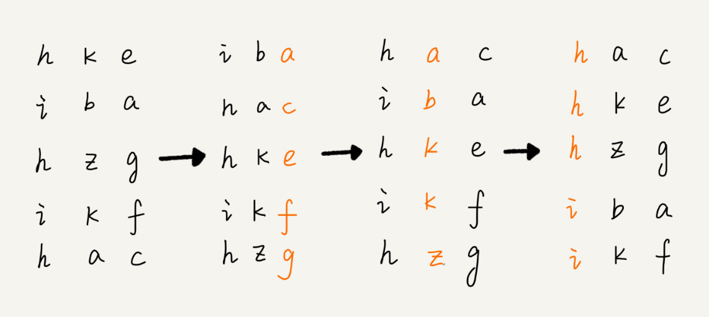

注意，这里按照每位来排序的排序算法要是稳定的，否则这个实现思路就是不正确的。因为如果是非稳定排序算法，那最后一次排序只会考虑最高位的大小顺序，完全不管其他位的大小关系，那么低位的排序就完全没有意义了。

根据每一位来排序，我们可以用刚讲过的桶排序或者计数排序，它们的时间复杂度可以做到 O(n)。如果要排序的数据有 k 位，那我们就需要 k 次桶排序或者计数排序，总的时间复杂度是 $O(k*n)$。当 k 不大的时候，比如手机号码排序的例子，k 最大就是 11，所以基数排序的时间复杂度就近似于 O(n)。

实际上，有时候要排序的数据并不都是等长的，比如我们排序牛津字典中的 20 万个英文单词，最短的只有 1 个字母，最长的我特意去查了下，有 45 个字母，中文翻译是尘肺病。对于这种不等长的数据，基数排序还适用吗？

实际上，我们可以**把所有的单词补齐到相同长度，位数不够的可以在后面补“0”**，因为根据ASCII 值，所有字母都大于“0”，所以补“0”不会影响到原有的大小顺序。这样就可以继续用基数排序了。

我来总结一下，基数排序对**要排序的数据**是有要求的，需要**可以分割出独立的“位”**来比较，而且**位之间**有**递进关系**，如果 a 数据的高位比 b 数据大，那剩下的低位就不用比较了。除此之外，每一位的**数据范围不能太大**，要可以用**线性排序算法**来排序，否则，基数排序的时间复杂度就无法做到 O(n) 了。

### 解答开篇

今天的内容学完了。我们再回过头来看看开篇的思考题：如何根据年龄给 100 万用户排序？现在思考题是不是变得非常简单了呢？我来说一下我的解决思路。

实际上，根据年龄给 100 万用户排序，就类似按照成绩给 50 万考生排序。我们假设年龄的范围最小 1 岁，最大不超过 120 岁。我们可以遍历这 100 万用户，根据年龄将其划分到这 120 个桶里，然后依次顺序遍历这 120 个桶中的元素。这样就得到了按照年龄排序的 100 万用户数据。

### 内容小结

今天，我们学习了 3 种线性时间复杂度的排序算法，有桶排序、计数排序、基数排序。它们对要排序的数据都有比较苛刻的要求，应用不是非常广泛。但是如果数据特征比较符合这些排序算法的要求，应用这些算法，会非常高效，线性时间复杂度可以达到 O(n)。

桶排序和计数排序的排序思想是非常相似的，都是针对范围不大的数据，将数据划分成不同的桶来实现排序。基数排序要求数据可以划分成高低位，位之间有递进关系。比较两个数，我们只需要比较高位，高位相同的再比较低位。而且每一位的数据范围不能太大，因为基数排序算法需要借助桶排序或者计数排序来完成每一个位的排序工作。

## 14 | 排序优化：如何实现一个通用的、高性能的排序函数？

几乎所有的编程语言都会提供排序函数，比如 C 语言中 `qsort()`，C++ STL 中的 sort()、stable_sort()，还有 Java 语言中的 `Collections.sort()`。在平时的开发中，我们也都是直接使用这些现成的函数来实现业务逻辑中的排序功能。那你知道这些排序函数是如何实现的吗？底层都利用了哪种排序算法呢？

基于这些问题，今天我们就来看排序这部分的最后一块内容：**如何实现一个通用的、高性能的排序函数**？

### 如何选择合适的排序算法？

如果要实现一个通用的、高效率的排序函数，我们应该选择哪种排序算法？我们先回顾一下前面讲过的几种排序算法。

|          | 时间复杂度            | 稳定排序 | 原地排序 |
| -------- | --------------------- | -------- | -------- |
| 冒泡排序 | $O(n^2)$              | 是       | 是       |
| 插入排序 | $O(n^2)$              | 是       | 是       |
| 选择排序 | $O(n^2)$              | 不是     | 是       |
| 快速排序 | $O(nlogn)$            | 不是     | 是       |
| 归并排序 | $O(nlogn)$            | 是       | 不是     |
| 计数排序 | $O(n+k)$，k是数据范围 | 是       | 不是     |
| 桶排序   | $O(n)$                | 是       | 不是     |
| 基数排序 | $O(d*n)$ d是维度      | 是       | 不是     |

我们前面讲过，线性排序算法的时间复杂度比较低，适用场景比较特殊。所以如果要写一个通用的排序函数，不能选择线性排序算法。

如果对小规模数据进行排序，可以选择时间复杂度是 $O(n^2)$ 的算法；如果对大规模数据进行排序，时间复杂度是 $O(nlogn)$ 的算法更加高效。所以，为了兼顾任意规模数据的排序，一般都会首选时间复杂度是 $O(nlogn)$的排序算法来实现排序函数。

时间复杂度是 $O(nlogn)$ 的排序算法不止一个，我们已经讲过的有归并排序、快速排序，后面讲堆的时候我们还会讲到堆排序。堆排序和快速排序都有比较多的应用，比如 Java 语言采用堆排序实现排序函数，C 语言使用快速排序实现排序函数。

不知道你有没有发现，使用归并排序的情况其实并不多。我们知道，快排在最坏情况下的时间复杂度是 $O(n^2)$，而归并排序可以做到平均情况、最坏情况下的时间复杂度都是 $O(nlogn)$，从这点上看起来很诱人，那为什么它还是没能得到“宠信”呢？

还记得我们上一节讲的归并排序的空间复杂度吗？归并排序并不是原地排序算法，空间复杂度是 O(n)。所以，粗略点、夸张点讲，如果要排序 100 MB 的数据，除了数据本身占用的内存之外，排序算法还要额外再占用 100 MB 的内存空间，空间耗费就翻倍了。

前面我们讲到，快速排序比较适合来实现排序函数，但是，我们也知道，快速排序在最坏情况下的时间复杂度是 $O(n^2)$，如何来解决这个“复杂度恶化”的问题呢？

### 如何优化快速排序？

我们先来看下，为什么最坏情况下快速排序的时间复杂度是 $O(n^2)$​ 呢？我们前面讲过，如果数据原来就是有序的或者接近有序的，每次分区点都选择最后一个数据，那快速排序算法就会变得非常糟糕，时间复杂度就会退化为 $O(n^2)$​。实际上，**这种 $O(n^2)$​ 时间复杂度出现的主要原因还是因为我们分区点选得不够合理**。

那什么样的分区点是好的分区点呢？或者说如何来选择分区点呢？

最理想的分区点是：被分区点分开的两个分区中，数据的数量差不多。

如果很粗暴地直接选择第一个或者最后一个数据作为分区点，不考虑数据的特点，肯定会出现之前讲的那样，在某些情况下，排序的最坏情况时间复杂度是 $O(n^2)$。为了提高排序算法的性能，我们也要尽可能地让每次分区都比较平均。

我这里介绍两个比较常用、比较简单的分区算法，你可以直观地感受一下。

#### 1. 三数取中法

我们从区间的首、尾、中间，分别取出一个数，然后对比大小，取这 3 个数的中间值作为分区点。这样每间隔某个固定的长度，取数据出来比较，将中间值作为分区点的分区算法，肯定要比单纯取某一个数据更好。但是，如果要排序的数组比较大，那“三数取中”可能就不够了，可能要“五数取中”或者“十数取中”。

#### 2. 随机法

随机法就是每次从要排序的区间中，随机选择一个元素作为分区点。这种方法并不能保证每次分区点都选的比较好，但是从概率的角度来看，也不大可能会出现每次分区点都选得很差的情况，所以平均情况下，这样选的分区点是比较好的。时间复杂度退化为最糟糕的 $O(n^2)$的情况，出现的可能性不大。

好了，我这里也只是抛砖引玉，如果想了解更多寻找分区点的方法，你可以自己课下深入去学习一下。

我们知道，快速排序是用递归来实现的。我们在递归那一节讲过，递归要警惕堆栈溢出。为了避免快速排序里，递归过深而堆栈过小，导致堆栈溢出，我们有两种解决办法：

- 第一种是限制递归深度。一旦递归过深，超过了我们事先设定的阈值，就停止递归。
- 第二种是通过在堆上模拟实现一个函数调用栈，手动模拟递归压栈、出栈的过程，这样就没有了系统栈大小的限制。

### 举例分析排序函数

为了让你对如何实现一个排序函数有一个更直观的感受，我拿 Glibc 中的 qsort() 函数举例说明一下。虽说 qsort() 从名字上看，很像是基于快速排序算法实现的，实际上它并不仅仅用了快排这一种算法。

如果你去看源码，你就会发现，**qsort() 会优先使用归并排序来排序输入数据**，因为归并排序的空间复杂度是 O(n)，所以对于小数据量的排序，比如 1 KB、2 KB 等，归并排序额外需要 1 KB、2 KB 的内存空间，这个问题不大。现在计算机的内存都挺大的，我们很多时候追求的是速度。还记得我们前面讲过的用空间换时间的技巧吗？这就是一个典型的应用。

但如果数据量太大，就跟我们前面提到的，排序 100 MB 的数据，这个时候我们再用归并排序就不合适了。所以，要排序的数据量比较大的时候，qsort() 会改为用快速排序算法来排序。

那 qsort() 是如何选择快速排序算法的分区点的呢？如果去看源码，你就会发现，qsort() 选择分区点的方法就是“三数取中法”。是不是也并不复杂？

还有我们前面提到的递归太深会导致堆栈溢出的问题，qsort() 是通过自己实现一个堆上的栈，手动模拟递归来解决的。我们之前在讲递归那一节也讲过，不知道你还有没有印象？

实际上，qsort() 并不仅仅用到了归并排序和快速排序，它还用到了插入排序。在快速排序的过程中，当要排序的区间中，元素的个数小于等于 4 时，qsort() 就退化为插入排序，不再继续用递归来做快速排序，因为我们前面也讲过，在小规模数据面前，$O(n^2)$ 时间复杂度的算法并不一定比 $O(nlogn)$ 的算法执行时间长。我们现在就来分析下这个说法。

我们在讲复杂度分析的时候讲过，算法的性能可以通过时间复杂度来分析，但是，这种复杂度分析是比较偏理论的，如果我们深究的话，实际上时间复杂度并不等于代码实际的运行时间。

时间复杂度代表的是一个增长趋势，如果画成增长曲线图，你会发现 $O(n^2)$​​ 比 $O(nlogn)$​​ 要陡峭，也就是说增长趋势要更猛一些。但是，我们前面讲过，在大 O 复杂度表示法中，我们会省略低阶、系数和常数，也就是说，$O(nlogn)$​​ 在没有省略低阶、系数、常数之前可能是 $O(knlogn+c)$​，而且 k 和 c 有可能还是一个比较大的数。

假设 k=1000，c=200，当我们对小规模数据（比如 n=100）排序时，$n^2$的值实际上比 $knlogn+c$ 还要小。
$$
\begin{align}
& knlogn+c=1000*100*log100+200 \quad 远大于 10000 \\
& n^2=100*100=10000
\end{align}
$$
所以，对于小规模数据的排序，$O(n^2)$ 的排序算法并不一定比 $O(nlogn)$排序算法执行的时间长。对于小数据量的排序，我们选择比较简单、不需要递归的插入排序算法。

还记得我们之前讲到的哨兵来简化代码，提高执行效率吗？在 qsort() 插入排序的算法实现中，也利用了这种编程技巧。虽然哨兵可能只是少做一次判断，但是毕竟排序函数是非常常用、非常基础的函数，性能的优化要做到极致。

好了，C 语言的 qsort() 我已经分析完了，你有没有觉得其实也不是很难？基本上都是用了我们前面讲到的知识点，有了前面的知识积累，看一些底层的类库的时候是不是也更容易了呢？

### 内容小结

今天我带你分析了一下如何来实现一个工业级的通用的、高效的排序函数，内容比较偏实战，而且贯穿了一些前面几节的内容，你要多看几遍。我们大部分排序函数都是采用 $O(nlogn)$排序算法来实现，但是为了尽可能地提高性能，会做很多优化。

我还着重讲了快速排序的一些优化策略，比如合理选择分区点、避免递归太深等等。最后，我还带你分析了一个 C 语言中 qsort() 的底层实现原理，希望你对此能有一个更加直观的感受。

## 15 | 二分查找（上）：如何用最省内存的方式实现快速查找功能？

今天我们讲一种针对有序数据集合的查找算法：二分查找（Binary Search）算法，也叫折半查找算法。二分查找的思想非常简单，很多非计算机专业的同学很容易就能理解，但是看似越简单的东西往往越难掌握好，想要灵活应用就更加困难。

老规矩，我们还是来看一道思考题。

假设我们有 1000 万个整数数据，每个数据占 8 个字节，**如何设计数据结构和算法，快速判断某个整数是否出现在这 1000 万数据中**？ 我们希望这个功能不要占用太多的内存空间，最多不要超过 100 MB，你会怎么做呢？带着这个问题，让我们进入今天的内容吧！

### 无处不在的二分思想

二分查找是一种非常简单易懂的快速查找算法，生活中到处可见。比如说，我们现在来做一个猜字游戏。我随机写一个 0 到 99 之间的数字，然后你来猜我写的是什么。猜的过程中，你每猜一次，我就会告诉你猜的大了还是小了，直到猜中为止。你来想想，如何快速猜中我写的数字呢？

假设我写的数字是 23，你可以按照下面的步骤来试一试。（如果猜测范围的数字有偶数个，中间数有两个，就选择较小的那个。）

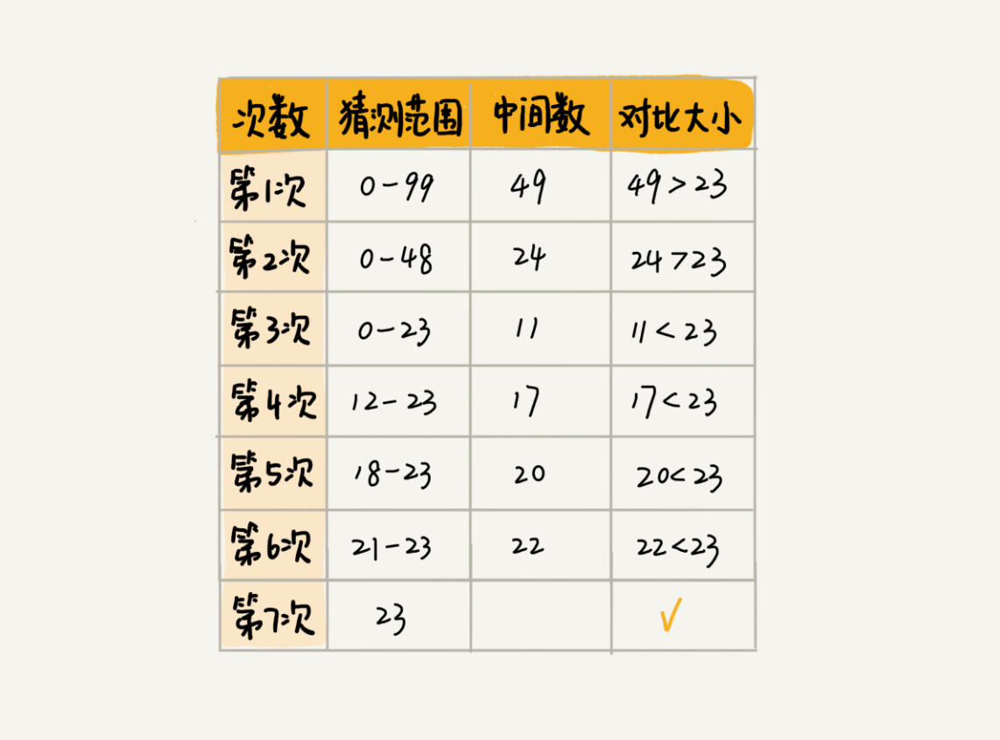

7 次就猜出来了，是不是很快？这个例子用的就是二分思想，按照这个思想，即便我让你猜的是 0 到 999 的数字，最多也只要 10 次就能猜中。不信的话，你可以试一试。

这是一个生活中的例子，我们现在回到实际的开发场景中。假设有 1000 条订单数据，已经按照订单金额从小到大排序，每个订单金额都不同，并且最小单位是元。我们现在想知道是否存在金额等于 19 元的订单。如果存在，则返回订单数据，如果不存在则返回 null。

最简单的办法当然是从第一个订单开始，一个一个遍历这 1000 个订单，直到找到金额等于 19 元的订单为止。但这样查找会比较慢，最坏情况下，可能要遍历完这 1000 条记录才能找到。那用二分查找能不能更快速地解决呢？

为了方便讲解，我们假设只有 10 个订单，订单金额分别是：8，11，19，23，27，33，45，55，67，98。

还是利用二分思想，每次都与区间的中间数据比对大小，缩小查找区间的范围。为了更加直观，我画了一张查找过程的图。其中，low 和 high 表示待查找区间的下标，mid 表示待查找区间的中间元素下标。

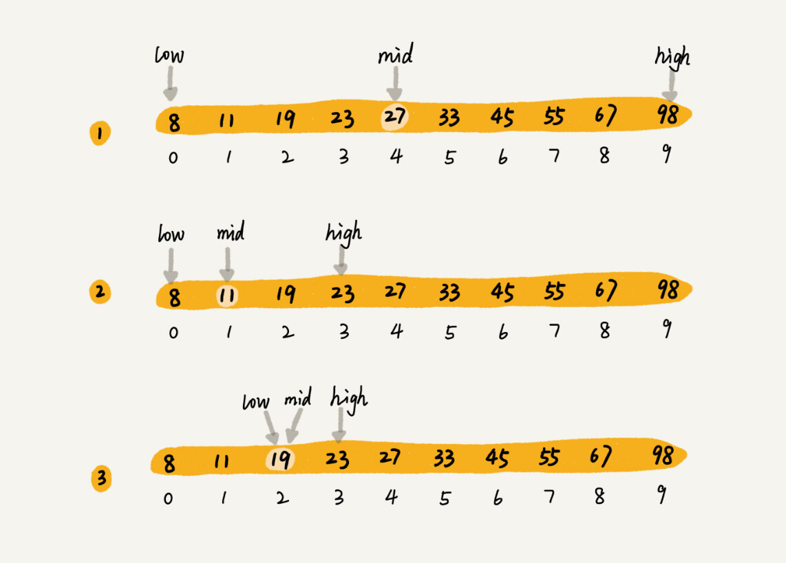

看懂这两个例子，你现在对二分的思想应该掌握得妥妥的了。我这里稍微总结升华一下，**二分查找针对的是一个有序的数据集合，查找思想有点类似分治思想。每次都通过跟区间的中间元素对比，将待查找的区间缩小为之前的一半，直到找到要查找的元素，或者区间被缩小为 0**。

### $O(logn)$ 惊人的查找速度

二分查找是一种非常高效的查找算法，高效到什么程度呢？我们来分析一下它的时间复杂度。

我们假设数据大小是 n，每次查找后数据都会缩小为原来的一半，也就是会除以 2。最坏情况下，直到查找区间被缩小为空，才停止。
$$
被查找区间的大小变化： \\
n,\frac{n}{2},\frac{n}{4},\frac{n}{8},...,,\frac{n}{2^k},...
$$
可以看出来，这是一个等比数列。其中 $\frac{n}{2^k}=1$​​ 时，k 的值就是总共缩小的次数。而每一次缩小操作只涉及两个数据的大小比较，所以，经过了 k 次区间缩小操作，时间复杂度就是 O(k)。通过 $\frac{n}{2^k}=1$​​，我们可以求得 $k=log_2n$​​，所以时间复杂度就是 $O(logn)$​​。

二分查找是我们目前为止遇到的第一个时间复杂度为 $O(logn)$​ 的算法。后面章节我们还会讲堆、二叉树的操作等等，它们的时间复杂度也是 $O(logn)$​。我这里就再深入地讲讲 $O(logn)$​这种**对数时间复杂度**。这是一种极其高效的时间复杂度，有的时候甚至比时间复杂度是常量级 O(1) 的算法还要高效。为什么这么说呢？

因为 $logn$ 是一个非常“恐怖”的数量级，即便 n 非常非常大，对应的 $logn$ 也很小。比如 n 等于 2 的 32 次方，这个数很大了吧？大约是 42 亿。也就是说，如果我们在 42 亿个数据中用二分查找一个数据，最多需要比较 32 次。

我们前面讲过，用大 O 标记法表示时间复杂度的时候，会省略掉常数、系数和低阶。对于常量级时间复杂度的算法来说，$O(1)$ 有可能表示的是一个非常大的常量值，比如 $O(1000)$、$O(10000)$。所以，常量级时间复杂度的算法有时候可能还没有 $O(logn)$​ 的算法执行效率高。

反过来，对数对应的就是指数。有一个非常著名的“阿基米德与国王下棋的故事”，你可以自行搜索一下，感受一下指数的“恐怖”。这也是为什么我们说，指数时间复杂度的算法在大规模数据面前是无效的。

### 二分查找的递归与非递归实现

实际上，简单的二分查找并不难写，注意我这里的“简单”二字。下一节，我们会讲到二分查找的变体问题，那才是真正烧脑的。今天，我们来看如何来写最简单的二分查找。

**最简单的情况**就是**有序数组中不存在重复元素**，我们在其中用二分查找值等于给定值的数据。我用 Java 代码实现了一个最简单的二分查找算法。

```java
public int bsearch(int[] a, int n, int value) {
  int low = 0;
  int high = n - 1;

  while (low <= high) {
    int mid = (low + high) / 2;
    if (a[mid] == value) {
      return mid;
    } else if (a[mid] < value) {
      low = mid + 1;
    } else {
      high = mid - 1;
    }
  }

  return -1;
}
```

这个代码我稍微解释一下，low、high、mid 都是指数组下标，其中 low 和 high 表示当前查找的区间范围，初始 low=0， high=n-1。mid 表示[low, high]的中间位置。我们通过对比 a[mid]与 value 的大小，来更新接下来要查找的区间范围，直到找到或者区间缩小为 0，就退出。如果你有一些编程基础，看懂这些应该不成问题。现在，我就着重强调一下**容易出错的 3 个地方**。

#### 1. 循环退出条件

注意是 $low<=high$，而不是 $low<high$

#### 2. mid 的取值

实际上，$mid=(low+high)/2$​ 这种写法是有问题的。因为如果 low 和 high 比较大的话，两者之和就有可能会溢出。改进的方法是将 mid 的计算方式写成 $low+(high-low)/2$​。更进一步，如果要将性能优化到极致的话，我们可以将这里的除以 2 操作转化成位运算 $low+((high-low)>>1)$​。因为相比除法运算来说，计算机处理位运算要快得多。

这里的 $low+(high-low)/2$的含义是：从low到high的距离的一半，比如从西向东走，起点是a=0，已经走到了b=80，终点c=100，请问，b和c的中点距离起点多少公里？

解：b到c之间还有100-80=20公里，20的一半是10公里，所以b和c的中点到a的距离为80+10=90公里，也等于(100+80)/2=90。

#### 3. low 和 high 的更新

low=mid+1，high=mid-1。注意这里的 +1 和 -1，如果直接写成 low=mid 或者 high=mid，就可能会发生死循环。比如，当 high=3，low=3 时，如果 a[3]不等于 value，就会导致一直循环不退出。

如果你留意我刚讲的这三点，我想一个简单的二分查找你已经可以实现了。**实际上，二分查找除了用循环来实现，还可以用递归来实现**，过程也非常简单。

我用 Java 语言实现了一下这个过程，正好你可以借此机会回顾一下写递归代码的技巧。

```java
// 二分查找的递归实现
public int bsearch(int[] a, int n, int val) {
  return bsearchInternally(a, 0, n - 1, val);
}

private int bsearchInternally(int[] a, int low, int high, int value) {
  if (low > high) return -1;

  int mid =  low + ((high - low) >> 1);
  if (a[mid] == value) {
    return mid;
  } else if (a[mid] < value) {
    return bsearchInternally(a, mid+1, high, value);
  } else {
    return bsearchInternally(a, low, mid-1, value);
  }
}
```

### 二分查找应用场景的局限性

前面我们分析过，二分查找的时间复杂度是 $O(logn)$，查找数据的效率非常高。不过，并不是什么情况下都可以用二分查找，它的应用场景是有很大局限性的。那什么情况下适合用二分查找，什么情况下不适合呢？

#### 首先，二分查找依赖的是顺序表结构，简单点说就是数组。

那二分查找能否依赖其他数据结构呢？比如链表。答案是不可以的，主要原因是二分查找算法需要按照下标随机访问元素。我们在数组和链表那两节讲过，数组按照下标随机访问数据的时间复杂度是 O(1)，而链表随机访问的时间复杂度是 O(n)。所以，如果数据使用链表存储，二分查找的时间复杂就会变得很高。

二分查找只能用在数据是通过顺序表来存储的数据结构上。如果你的数据是通过其他数据结构存储的，则无法应用二分查找。

#### 其次，二分查找针对的是有序数据。

二分查找对这一点的要求比较苛刻，数据必须是有序的。如果数据没有序，我们需要先排序。前面章节里我们讲到，排序的时间复杂度最低是 $O(nlogn)$。所以，如果我们针对的是一组静态的数据，没有频繁地插入、删除，我们可以进行一次排序，多次二分查找。这样排序的成本可被均摊，二分查找的边际成本就会比较低。

但是，如果我们的数据集合有频繁的插入和删除操作，要想用二分查找，要么每次插入、删除操作之后保证数据仍然有序，要么在每次二分查找之前都先进行排序。针对这种动态数据集合，无论哪种方法，维护有序的成本都是很高的。

所以，二分查找只能用在插入、删除操作不频繁，一次排序多次查找的场景中。针对动态变化的数据集合，二分查找将不再适用。那针对动态数据集合，如何在其中快速查找某个数据呢？别急，等到二叉树那一节我会详细讲。

#### 再次，数据量太小不适合二分查找。

如果要处理的数据量很小，完全没有必要用二分查找，顺序遍历就足够了。比如我们在一个大小为 10 的数组中查找一个元素，不管用二分查找还是顺序遍历，查找速度都差不多。只有数据量比较大的时候，二分查找的优势才会比较明显。

不过，这里有一个例外。如果数据之间的比较操作非常耗时，不管数据量大小，我都推荐使用二分查找。比如，数组中存储的都是长度超过 300 的字符串，如此长的两个字符串之间比对大小，就会非常耗时。我们需要尽可能地减少比较次数，而比较次数的减少会大大提高性能，这个时候二分查找就比顺序遍历更有优势。

#### 最后，数据量太大也不适合二分查找。

二分查找的底层需要依赖数组这种数据结构，而数组为了支持随机访问的特性，要求内存空间连续，对内存的要求比较苛刻。比如，我们有 1 GB 大小的数据，如果希望用数组来存储，那就需要 1 GB 的连续内存空间。

注意这里的“连续”二字，也就是说，即便有 2 GB 的内存空间剩余，但是如果这剩余的 2 GB 内存空间都是零散的，没有连续的 1 GB 大小的内存空间，那照样无法申请一个 1 GB 大小的数组。而我们的二分查找是作用在数组这种数据结构之上的，所以太大的数据用数组存储就比较吃力了，也就不能用二分查找了。

### 解答开篇

二分查找的理论知识你应该已经掌握了。我们来看下开篇的思考题：如何在 1000 万个整数中快速查找某个整数？

这个问题并不难。我们的内存限制是 100 MB，每个数据大小是 8 字节，最简单的办法就是将数据存储在数组中，内存占用差不多是 80 MB，符合内存的限制。借助今天讲的内容，我们可以先对这 1000 万数据从小到大排序，然后再利用二分查找算法，就可以快速地查找想要的数据了。

看起来这个问题并不难，很轻松就能解决。实际上，它暗藏了“玄机”。如果你对数据结构和算法有一定了解，知道散列表、二叉树这些支持快速查找的动态数据结构。你可能会觉得，用散列表和二叉树也可以解决这个问题。实际上是不行的。

虽然大部分情况下，用二分查找可以解决的问题，用散列表、二叉树都可以解决。但是，我们后面会讲，不管是散列表还是二叉树，都会需要比较多的额外的内存空间。如果用散列表或者二叉树来存储这 1000 万的数据，用 100 MB 的内存肯定是存不下的。而二分查找底层依赖的是数组，除了数据本身之外，不需要额外存储其他信息，是最省内存空间的存储方式，所以刚好能在限定的内存大小下解决这个问题。

### 内容小结

今天我们学习了一种针对有序数据的高效查找算法，二分查找，它的时间复杂度是 $O(logn)$。

二分查找的核心思想理解起来非常简单，有点类似分治思想。即每次都通过跟区间中的中间元素对比，将待查找的区间缩小为一半，直到找到要查找的元素，或者区间被缩小为 0。但是二分查找的代码实现比较容易写错。你需要着重掌握它的三个容易出错的地方：循环退出条件、mid 的取值，low 和 high 的更新。

二分查找虽然性能比较优秀，但应用场景也比较有限。底层必须依赖数组，并且还要求数据是有序的。对于较小规模的数据查找，我们直接使用顺序遍历就可以了，二分查找的优势并不明显。二分查找更适合处理静态数据，也就是没有频繁的数据插入、删除操作。

## 16 | 二分查找（下）：如何快速定位IP对应的省份地址？

通过 IP 地址来查找 IP 归属地的功能，不知道你有没有用过？没用过也没关系，你现在可以打开百度，在搜索框里随便输一个 IP 地址，就会看到它的归属地。

这个功能并不复杂，它是通过维护一个很大的 IP 地址库来实现的。地址库中包括 IP 地址范围和归属地的对应关系。

当我们想要查询 202.102.133.13 这个 IP 地址的归属地时，我们就在地址库中搜索，发现这个 IP 地址落在[202.102.133.0, 202.102.133.255]这个地址范围内，那我们就可以将这个 IP 地址范围对应的归属地“山东东营市”显示给用户了。

```c
[202.102.133.0, 202.102.133.255]	山东东营市 
[202.102.135.0, 202.102.136.255]	山东烟台 
[202.102.156.34, 202.102.157.255]	山东青岛 
[202.102.48.0, 202.102.48.255]	江苏宿迁 
[202.102.49.15, 202.102.51.251]	江苏泰州 
[202.102.56.0, 202.102.56.255]	江苏连云港
```

现在我的问题是，在庞大的地址库中逐一比对 IP 地址所在的区间，是非常耗时的。**假设我们有 12 万条这样的 IP 区间与归属地的对应关系，如何快速定位出一个 IP 地址的归属地呢**？

是不是觉得比较难？不要紧，等学完今天的内容，你就会发现这个问题其实很简单。

上一节我讲了二分查找的原理，并且介绍了最简单的一种二分查找的代码实现。今天我们来讲几种二分查找的变形问题。

不知道你有没有听过这样一个说法：“十个二分九个错”。二分查找虽然原理极其简单，但是想要写出没有 Bug 的二分查找并不容易。

唐纳德·克努特（Donald E.Knuth）在《计算机程序设计艺术》的第 3 卷《排序和查找》中说到：“尽管第一个二分查找算法于 1946 年出现，然而第一个完全正确的二分查找算法实现直到 1962 年才出现。”

你可能会说，我们上一节学的二分查找的代码实现并不难写啊。那是因为上一节讲的只是二分查找中最简单的一种情况，在不存在重复元素的有序数组中，查找值等于给定值的元素。最简单的二分查找写起来确实不难，但是，二分查找的变形问题就没那么好写了。

二分查找的变形问题很多，我只选择几个典型的来讲解，其他的你可以借助我今天讲的思路自己来分析。

>  4种常见的二分查找变形问题：
>
> 1. 查找第一个值 = 给定值的元素
> 2. 查找最后一个值 = 给定值的元素
> 3. 查找第一个 >= 给定值的元素
> 4. 查找最后一个值 <= 给定值的元素

需要特别说明一点，为了简化讲解，今天的内容，我都以数据是从小到大排列为前提，如果你要处理的数据是从大到小排列的，解决思路也是一样的。同时，我希望你最好先自己动手试着写一下这 4 个变形问题，然后再看我的讲述，这样你就会对我说的“二分查找比较难写”有更加深的体会了。

### 变体一：查找第一个值等于给定值的元素

上一节中的二分查找是最简单的一种，即有序数据集合中不存在重复的数据，我们在其中查找值等于某个给定值的数据。如果我们将这个问题稍微修改下，有序数据集合中存在重复的数据，我们希望找到第一个值等于给定值的数据，这样之前的二分查找代码还能继续工作吗？

比如下面这样一个有序数组，其中，a[5]，a[6]，a[7]的值都等于 8，是重复的数据。我们希望查找第一个等于 8 的数据，也就是下标是 5 的元素。

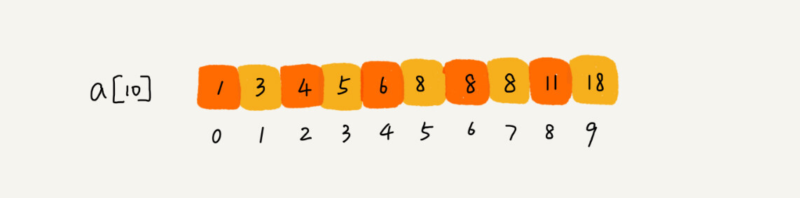

如果我们用上一节课讲的二分查找的代码实现，首先拿 8 与区间的中间值 a[4]比较，8 比 6 大，于是在下标 5 到 9 之间继续查找。下标 5 和 9 的中间位置是下标 7，a[7]正好等于 8，所以代码就返回了。

尽管 a[7]也等于 8，但它并不是我们想要找的第一个等于 8 的元素，因为第一个值等于 8 的元素是数组下标为 5 的元素。我们上一节讲的二分查找代码就无法处理这种情况了。所以，针对这个变形问题，我们可以稍微改造一下上一节的代码。

100 个人写二分查找就会有 100 种写法。网上有很多关于变形二分查找的实现方法，有很多写得非常简洁，比如下面这个写法。但是，尽管简洁，理解起来却非常烧脑，也很容易写错。

```java
public int bsearch(int[] a, int n, int value) {
  int low = 0;
  int high = n - 1;
  while (low <= high) {
    int mid = low + ((high - low) >> 1);
    if (a[mid] >= value) {
      high = mid - 1;
    } else {
      low = mid + 1;
    }
  }

  if (low < n && a[low]==value) return low;
  else return -1;
}
```

看完这个实现之后，你是不是觉得很不好理解？如果你只是死记硬背这个写法，我敢保证，过不了几天，你就会全都忘光，再让你写，90% 的可能会写错。所以，我换了一种实现方法，你看看是不是更容易理解呢？

```java
public int bsearch(int[] a, int n, int value) {
  int low = 0;
  int high = n - 1;
  while (low <= high) {
    int mid =  low + ((high - low) >> 1);
    if (a[mid] > value) {
      high = mid - 1;
    } else if (a[mid] < value) {
      low = mid + 1;
    } else {
      if ((mid == 0) || (a[mid - 1] != value)) return mid;
      else high = mid - 1;
    }
  }
  return -1;
}
```

我来稍微解释一下这段代码。a[mid]跟要查找的 value 的大小关系有三种情况：大于、小于、等于。

- 对于 `a[mid]>value` 的情况，我们需要更新 `high= mid-1`；
- 对于 `a[mid]<value `的情况，我们需要更新 `low=mid+1`。

这两点都很好理解。那当 a[mid]=value 的时候应该如何处理呢？

如果我们查找的是任意一个值等于给定值的元素，当 a[mid]等于要查找的值时，a[mid]就是我们要找的元素。但是，如果我们求解的是第一个值等于给定值的元素，当 a[mid]等于要查找的值时，我们就需要确认一下这个 a[mid]是不是第一个值等于给定值的元素。

我们重点看第 11 行代码。如果 mid 等于 0，那这个元素已经是数组的第一个元素，那它肯定是我们要找的；如果 mid 不等于 0，但 a[mid]的前一个元素 a[mid-1]不等于 value，那也说明 a[mid]就是我们要找的第一个值等于给定值的元素。

如果经过检查之后发现 a[mid]前面的一个元素 a[mid-1]也等于 value，那说明此时的 a[mid]肯定不是我们要查找的第一个值等于给定值的元素。那我们就更新 high=mid-1，因为要找的元素肯定出现在[low, mid-1]之间。

对比上面的两段代码，是不是下面那种更好理解？实际上，**很多人都觉得变形的二分查找很难写，主要原因是太追求第一种那样完美、简洁的写法**。而对于我们做工程开发的人来说，代码易读懂、没 Bug，其实更重要，所以我觉得第二种写法更好。

### 变体二：查找最后一个值等于给定值的元素

前面的问题是查找第一个值等于给定值的元素，我现在把问题稍微改一下，查找最后一个值等于给定值的元素，又该如何做呢？

如果你掌握了前面的写法，那这个问题你应该很轻松就能解决。你可以先试着实现一下，然后跟我写的对比一下。

```java
public int bsearch(int[] a, int n, int value) {
  int low = 0;
  int high = n - 1;
  while (low <= high) {
    int mid =  low + ((high - low) >> 1);
    if (a[mid] > value) {
      high = mid - 1;
    } else if (a[mid] < value) {
      low = mid + 1;
    } else {
      if ((mid == n - 1) || (a[mid + 1] != value)) return mid;
      else low = mid + 1;
    }
  }
  return -1;
}
```

我们还是重点看第 11 行代码。如果 a[mid]这个元素已经是数组中的最后一个元素了，那它肯定是我们要找的；如果 a[mid]的后一个元素 a[mid+1]不等于 value，那也说明 a[mid]就是我们要找的最后一个值等于给定值的元素。

如果我们经过检查之后，发现 a[mid]后面的一个元素 a[mid+1]也等于 value，那说明当前的这个 a[mid]并不是最后一个值等于给定值的元素。我们就更新 low=mid+1，因为要找的元素肯定出现在[mid+1, high]之间。

### 变体三：查找第一个大于等于给定值的元素

现在我们再来看另外一类变形问题。在有序数组中，查找第一个大于等于给定值的元素。比如，数组中存储的这样一个序列：3，4，6，7，10。如果查找第一个大于等于 5 的元素，那就是 6。

实际上，实现的思路跟前面的那两种变形问题的实现思路类似，代码写起来甚至更简洁。

```java
public int bsearch(int[] a, int n, int value) {
  int low = 0;
  int high = n - 1;
  while (low <= high) {
    int mid =  low + ((high - low) >> 1);
    if (a[mid] >= value) {
      if ((mid == 0) || (a[mid - 1] < value)) return mid;
      else high = mid - 1;
    } else {
      low = mid + 1;
    }
  }
  return -1;
}
```

如果 a[mid]小于要查找的值 value，那要查找的值肯定在[mid+1, high]之间，所以，我们更新 low=mid+1。

对于 a[mid]大于等于给定值 value 的情况，我们要先看下这个 a[mid]是不是我们要找的第一个值大于等于给定值的元素。如果 a[mid]前面已经没有元素，或者前面一个元素小于要查找的值 value，那 a[mid]就是我们要找的元素。这段逻辑对应的代码是第 7 行。

如果 a[mid-1]也大于等于要查找的值 value，那说明要查找的元素在[low, mid-1]之间，所以，我们将 high 更新为 mid-1。

### 变体四：查找最后一个小于等于给定值的元素

现在，我们来看最后一种二分查找的变形问题，查找最后一个小于等于给定值的元素。比如，数组中存储了这样一组数据：3，5，6，8，9，10。最后一个小于等于 7 的元素就是 6。是不是有点类似上面那一种？实际上，实现思路也是一样的。

有了前面的基础，你完全可以自己写出来了，所以我就不详细分析了。我把代码贴出来，你可以写完之后对比一下。

```java
public int bsearch7(int[] a, int n, int value) {
  int low = 0;
  int high = n - 1;
  while (low <= high) {
    int mid =  low + ((high - low) >> 1);
    if (a[mid] > value) {
      high = mid - 1;
    } else {
      if ((mid == n - 1) || (a[mid + 1] > value)) return mid;
      else low = mid + 1;
    }
  }
  return -1;
}
```

### 解答开篇

好了，现在我们回头来看开篇的问题：如何快速定位出一个 IP 地址的归属地？

现在这个问题应该很简单了。如果 IP 区间与归属地的对应关系不经常更新，我们可以先预处理这 12 万条数据，让其按照起始 IP 从小到大排序。如何来排序呢？我们知道，IP 地址可以转化为 32 位的整型数。所以，我们可以将起始地址，按照对应的整型值的大小关系，从小到大进行排序。

然后，这个问题就可以转化为我刚讲的第四种变形问题“在有序数组中，查找最后一个小于等于某个给定值的元素”了。

当我们要查询某个 IP 归属地时，我们可以先通过二分查找，找到最后一个起始 IP 小于等于这个 IP 的 IP 区间，然后，检查这个 IP 是否在这个 IP 区间内，如果在，我们就取出对应的归属地显示；如果不在，就返回未查找到。

### 内容小结

上一节我说过，凡是用二分查找能解决的，绝大部分我们更倾向于用散列表或者二叉查找树。即便是二分查找在内存使用上更节省，但是毕竟内存如此紧缺的情况并不多。那二分查找真的没什么用处了吗？

实际上，上一节讲的求“值等于给定值”的二分查找确实不怎么会被用到，二分查找更适合用在“近似”查找问题，在这类问题上，二分查找的优势更加明显。比如今天讲的这几种变体问题，用其他数据结构，比如散列表、二叉树，就比较难实现了。

变体的二分查找算法写起来非常烧脑，很容易因为细节处理不好而产生 Bug，这些容易出错的细节有：**终止条件、区间上下界更新方法、返回值选择**。所以今天的内容你最好能用自己实现一遍，对锻炼编码能力、逻辑思维、写出 Bug free 代码，会很有帮助。

## 17 | 跳表：为什么Redis一定要用跳表来实现有序集合？

上两节我们讲了二分查找算法。当时我讲到，因为二分查找底层依赖的是数组随机访问的特性，所以只能用数组来实现。如果数据存储在链表中，就真的没法用二分查找算法了吗？

实际上，我们只需要对链表稍加改造，就可以支持类似“二分”的查找算法。我们把改造之后的数据结构叫做**跳表**（Skip list），也就是今天要讲的内容。

跳表这种数据结构对你来说，可能会比较陌生，因为一般的数据结构和算法书籍里都不怎么会讲。但是它确实是一种各方面性能都比较优秀的**动态数据结构**，可以支持快速地插入、删除、查找操作，写起来也不复杂，甚至可以替代**红黑树**（Red-black tree）。

Redis 中的有序集合（Sorted Set）就是用跳表来实现的。如果你有一定基础，应该知道红黑树也可以实现快速地插入、删除和查找操作。那 **Redis 为什么会选择用跳表来实现有序集合呢**？ 为什么不用红黑树呢？学完今天的内容，你就知道答案了。

### 如何理解“跳表”？

对于一个单链表来讲，即便链表中存储的数据是有序的，如果我们要想在其中查找某个数据，也只能从头到尾遍历链表。这样查找效率就会很低，时间复杂度会很高，是 O(n)。

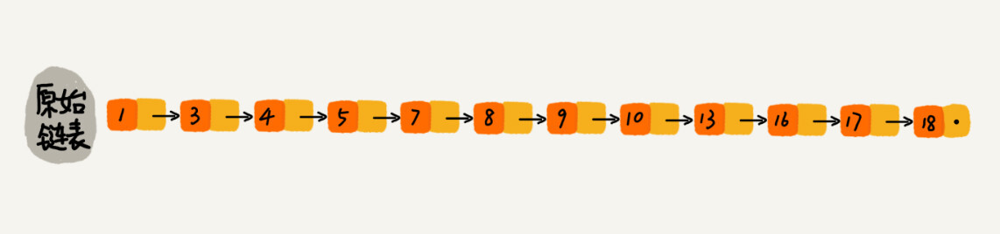

那怎么来提高查找效率呢？如果像图中那样，对链表建立一级“索引”，查找起来是不是就会更快一些呢？每两个结点提取一个结点到上一级，我们把抽出来的那一级叫做**索引**或**索引层**。你可以看我画的图。图中的 down 表示 down 指针，指向下一级结点。

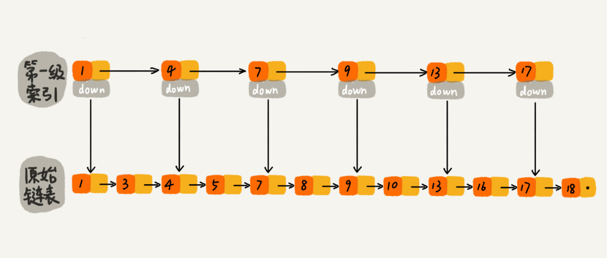

如果我们现在要查找某个结点，比如 16。我们可以先在索引层遍历，当遍历到索引层中值为 13 的结点时，我们发现下一个结点是 17，那要查找的结点 16 肯定就在这两个结点之间。然后我们通过索引层结点的 down 指针，下降到原始链表这一层，继续遍历。这个时候，我们只需要再遍历 2 个结点，就可以找到值等于 16 的这个结点了。这样，原来如果要查找 16，需要遍历 10 个结点，现在只需要遍历 7 个结点。

从这个例子里，我们看出，**加来一层索引之后，查找一个结点需要遍历的结点个数减少了，也就是说查找效率提高了**。那如果我们再加一级索引呢？效率会不会提升更多呢？

跟前面建立第一级索引的方式相似，我们在第一级索引的基础之上，每两个结点就抽出一个结点到第二级索引。现在我们再来查找 16，只需要遍历 6 个结点了，需要遍历的结点数量又减少了。


我举的例子数据量不大，所以即便加了两级索引，查找效率的提升也并不明显。为了让你能真切地感受索引提升查询效率。我画了一个包含 64 个结点的链表，按照前面讲的这种思路，建立了五级索引。


从图中我们可以看出，原来没有索引的时候，查找 62 需要遍历 62 个结点，现在只需要遍历 11 个结点，速度是不是提高了很多？所以，当链表的长度 n 比较大时，比如 1000、10000 的时候，在构建索引之后，查找效率的提升就会非常明显。

前面讲的**这种链表加多级索引的结构，就是跳表**。我通过例子给你展示了跳表是如何减少查询次数的，现在你应该比较清晰地知道，跳表确实是可以提高查询效率的。接下来，我会定量地分析一下，用跳表查询到底有多快。

### 用跳表查询到底有多快？

前面我讲过，算法的执行效率可以通过时间复杂度来度量，这里依旧可以用。我们知道，在一个单链表中查询某个数据的时间复杂度是 O(n)。那在一个具有多级索引的跳表中，查询某个数据的时间复杂度是多少呢？

这个时间复杂度的分析方法比较难想到。我把问题分解一下，先来看这样一个问题，如果链表里有 n 个结点，会有多少级索引呢？

按照我们刚才讲的，每两个结点会抽出一个结点作为上一级索引的结点，那第一级索引的结点个数大约就是 n/2，第二级索引的结点个数大约就是 n/4，第三级索引的结点个数大约就是 n/8，依次类推，也就是说，**第 k 级索引的结点个数是第 k-1 级索引的结点个数的 1/2，那第 k级索引结点的个数就是 $n/(2^k$)**。

假设索引有 h 级，最高级的索引有 2 个结点。通过上面的公式，我们可以得到 $\frac{n}{(2^h)}=2$，从而求得$h=log_2n-1$。如果包含原始链表这一层，整个跳表的高度就是 $log_2n$。我们在跳表中查询某个数据的时候，如果每一层都要遍历 m 个结点，那在跳表中查询一个数据的时间复杂度就是 $O(m*logn)$。

那这个 m 的值是多少呢？按照前面这种索引结构，我们每一级索引都最多只需要遍历 3 个结点，也就是说 m=3，为什么是 3 呢？我来解释一下。

假设我们要查找的数据是 x，在第 k 级索引中，我们遍历到 y 结点之后，发现 x 大于 y，小于后面的结点 z，所以我们通过 y 的 down 指针，从第 k 级索引下降到第 k-1 级索引。在第 k-1 级索引中，y 和 z 之间只有 3 个结点（包含 y 和 z），所以，我们在 K-1 级索引中最多只需要遍历 3 个结点，依次类推，每一级索引都最多只需要遍历 3 个结点。

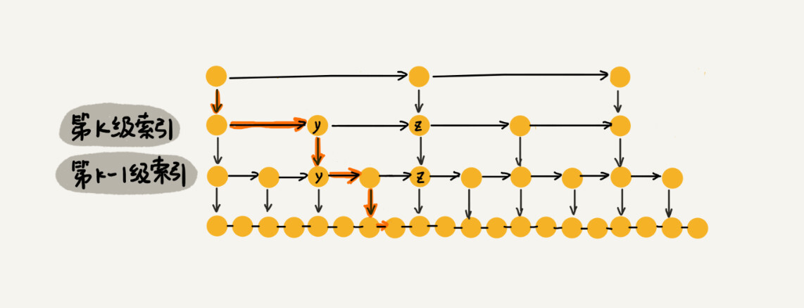

通过上面的分析，我们得到 m=3，所以在跳表中查询任意数据的时间复杂度就是 $O(logn)$。这个查找的时间复杂度跟二分查找是一样的。换句话说，我们其实是基于单链表实现了二分查找，是不是很神奇？不过，天下没有免费的午餐，这种查询效率的提升，前提是建立了很多级索引，也就是我们在第 6 节讲过的空间换时间的设计思路。

### 跳表是不是很浪费内存？

比起单纯的单链表，跳表需要存储多级索引，肯定要消耗更多的存储空间。那到底需要消耗多少额外的存储空间呢？我们来分析一下跳表的空间复杂度。

跳表的空间复杂度分析并不难，我在前面说了，假设原始链表大小为 n，那第一级索引大约有 n/2 个结点，第二级索引大约有 n/4 个结点，以此类推，每上升一级就减少一半，直到剩下 2 个结点。如果我们把每层索引的结点数写出来，就是一个等比数列。


这几级索引的结点总和就是 $n/2+n/4+n/8…+8+4+2=n-2$。所以，跳表的空间复杂度是 $O(n)$。也就是说，如果将包含 n 个结点的单链表构造成跳表，我们需要额外再用接近 n 个结点的存储空间。那我们有没有办法降低索引占用的内存空间呢？

我们前面都是每两个结点抽一个结点到上级索引，如果我们每三个结点或五个结点，抽一个结点到上级索引，是不是就不用那么多索引结点了呢？我画了一个每三个结点抽一个的示意图，你可以看下。

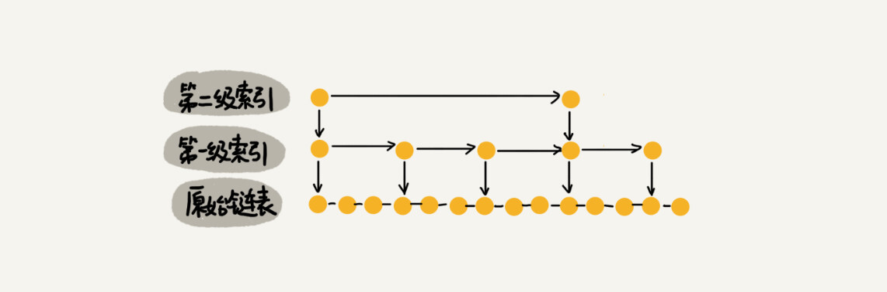

从图中可以看出，第一级索引需要大约 n/3 个结点，第二级索引需要大约 n/9 个结点。每往上一级，索引结点个数都除以 3。为了方便计算，我们假设最高一级的索引结点个数是 1。我们把每级索引的结点个数都写下来，也是一个等比数列。

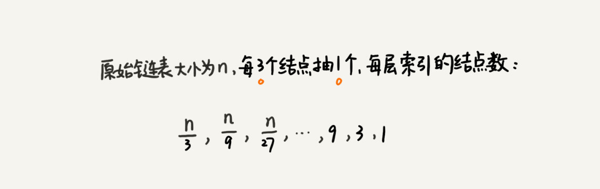

通过等比数列求和公式，总的索引结点大约就是 $n/3+n/9+n/27+...+9+3+1=n/2$。尽管空间复杂度还是 O(n)，但比上面的每两个结点抽一个结点的索引构建方法，要减少了一半的索引结点存储空间。

实际上，在软件开发中，我们不必太在意索引占用的额外空间。在讲数据结构和算法时，我们习惯性地把要处理的数据看成整数，但是在实际的软件开发中，原始链表中存储的有可能是很大的对象，而索引结点只需要存储关键值和几个指针，并不需要存储对象，所以当对象比索引结点大很多时，那索引占用的额外空间就可以忽略了。

### 高效的动态插入和删除

跳表长什么样子我想你应该已经很清楚了，它的查找操作我们刚才也讲过了。实际上，跳表这个动态数据结构，不仅支持查找操作，还支持动态的插入、删除操作，而且插入、删除操作的时间复杂度也是 $O(logn)$​。

#### 动态插入

我们现在来看下， 如何在跳表中插入一个数据，以及它是如何做到 $O(logn)$的时间复杂度的？

我们知道，在单链表中，一旦定位好要插入的位置，插入结点的时间复杂度是很低的，就是 O(1)。但是，这里为了保证原始链表中数据的有序性，我们需要先找到要插入的位置，这个查找操作就会比较耗时。

对于纯粹的单链表，需要遍历每个结点，来找到插入的位置。但是，对于跳表来说，我们讲过查找某个结点的时间复杂度是 $O(logn)$​，所以这里查找某个数据应该插入的位置，方法也是类似的，时间复杂度也是 $O(logn)$。我画了一张图，你可以很清晰地看到插入的过程。

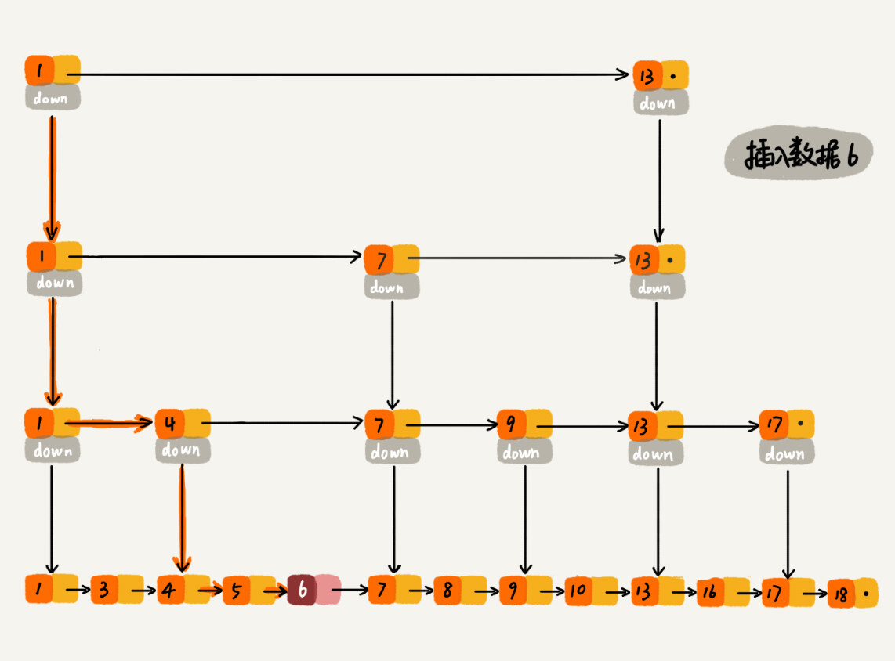

#### 动态删除

好了，我们再来看删除操作。

如果这个结点在索引中也有出现，我们除了要删除原始链表中的结点，还要删除索引中的。因为单链表中的删除操作需要拿到要删除结点的前驱结点，然后通过指针操作完成删除。所以在查找要删除的结点的时候，一定要获取前驱结点。当然，如果我们用的是双向链表，就不需要考虑这个问题了。

### 跳表索引动态更新

当我们不停地往跳表中插入数据时，如果我们不更新索引，就有可能出现某 2 个索引结点之间数据非常多的情况。极端情况下，跳表还会退化成单链表。


作为一种动态数据结构，我们需要某种手段来维护索引与原始链表大小之间的平衡，也就是说，如果链表中结点多了，索引结点就相应地增加一些，避免复杂度退化，以及查找、插入、删除操作性能下降。

如果你了解红黑树、AVL 树这样平衡二叉树，你就知道它们是通过左右旋的方式保持左右子树的大小平衡（如果不了解也没关系，我们后面会讲），而跳表是通过随机函数来维护前面提到的“平衡性”。

当我们往跳表中插入数据的时候，我们可以选择同时将这个数据插入到部分索引层中。如何选择加入哪些索引层呢？

我们通过一个随机函数，来决定将这个结点插入到哪几级索引中，比如随机函数生成了值 K，那我们就将这个结点添加到第一级到第 K 级这 K 级索引中。

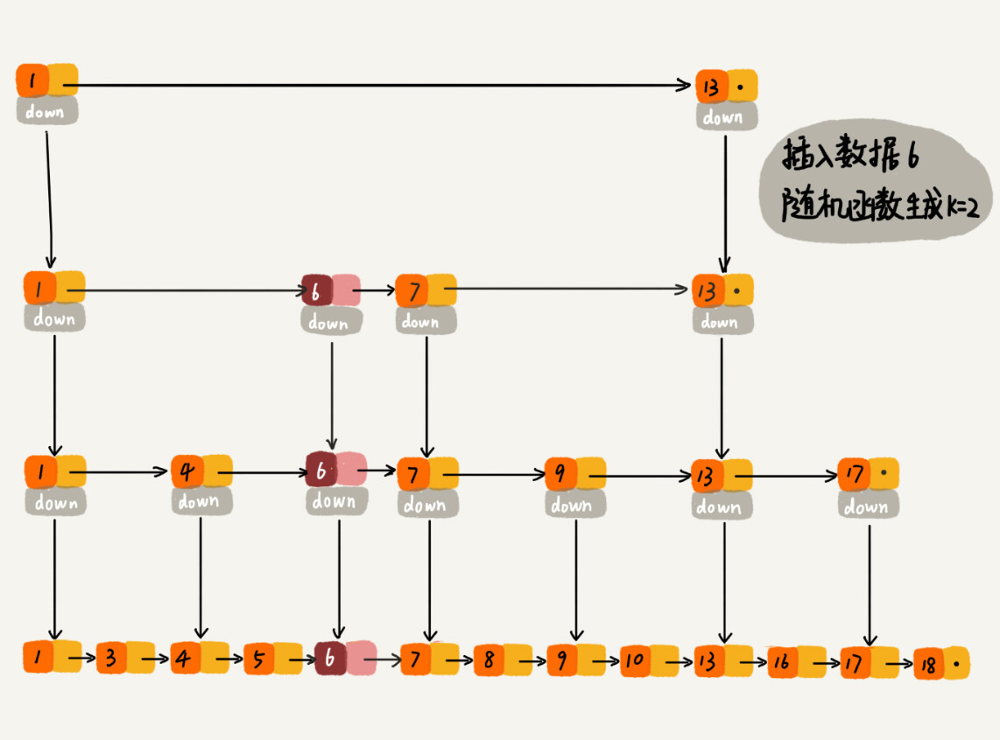

随机函数的选择很有讲究，从概率上来讲，能够保证跳表的索引大小和数据大小平衡性，不至于性能过度退化。至于随机函数的选择，我就不展开讲解了。如果你感兴趣的话，可以看看我在 GitHub 上的代码或者 Redis 中关于有序集合的跳表实现。

跳表的实现还是稍微有点复杂的，我将 Java 实现的代码放到了 GitHub 中，你可以根据我刚刚的讲解，对照着代码仔细思考一下。你不用死记硬背代码，跳表的实现并不是我们这节的重点。

### 解答开篇

今天的内容到此就讲完了。现在，我来讲解一下开篇的思考题：为什么 Redis 要用跳表来实现有序集合，而不是红黑树？

Redis 中的有序集合是通过跳表来实现的，严格点讲，其实还用到了散列表。不过散列表我们后面才会讲到，所以我们现在暂且忽略这部分。如果你去查看 Redis 的开发手册，就会发现，Redis 中的有序集合支持的核心操作主要有下面这几个：

- 插入一个数据；
- 删除一个数据；
- 查找一个数据；
- 按照区间查找数据（比如查找值在[100, 356]之间的数据）；
- 迭代输出有序序列。

其中，插入、删除、查找以及迭代输出有序序列这几个操作，红黑树也可以完成，时间复杂度跟跳表是一样的。但是，按照区间来查找数据这个操作，红黑树的效率没有跳表高。

对于按照区间查找数据这个操作，跳表可以做到 O(logn) 的时间复杂度定位区间的起点，然后在原始链表中顺序往后遍历就可以了。这样做非常高效。

当然，Redis 之所以用跳表来实现有序集合，还有其他原因，比如，跳表更容易代码实现。虽然跳表的实现也不简单，但比起红黑树来说还是好懂、好写多了，而简单就意味着可读性好，不容易出错。还有，跳表更加灵活，它可以通过改变索引构建策略，有效平衡执行效率和内存消耗。

不过，跳表也不能完全替代红黑树。因为红黑树比跳表的出现要早一些，很多编程语言中的 Map 类型都是通过红黑树来实现的。我们做业务开发的时候，直接拿来用就可以了，不用费劲自己去实现一个红黑树，但是跳表并没有一个现成的实现，所以在开发中，如果你想使用跳表，必须要自己实现。

### 内容小结

今天我们讲了跳表这种数据结构。跳表使用空间换时间的设计思路，通过构建多级索引来提高查询的效率，实现了基于链表的“二分查找”。跳表是一种动态数据结构，支持快速地插入、删除、查找操作，时间复杂度都是 $O(logn)$。

跳表的空间复杂度是 O(n)。不过，跳表的实现非常灵活，可以通过改变索引构建策略，有效平衡执行效率和内存消耗。虽然跳表的代码实现并不简单，但是作为一种动态数据结构，比起红黑树来说，实现要简单多了。所以很多时候，我们为了代码的简单、易读，比起红黑树，我们更倾向用跳表。

### 课后思考

在今天的内容中，对于跳表的时间复杂度分析，我分析了每两个结点提取一个结点作为索引的时间复杂度。如果每三个或者五个结点提取一个结点作为上级索引，对应的在跳表中查询数据的时间复杂度是多少呢？

## 18 | 散列表（上）：Word文档中的单词拼写检查功能是如何实现的？

Word 这种文本编辑器你平时应该经常用吧，那你有没有留意过它的拼写检查功能呢？一旦我们在 Word 里输入一个错误的英文单词，它就会用标红的方式提示“拼写错误”。**Word 的这个单词拼写检查功能，虽然很小但却非常实用**。你有没有想过，**这个功能是如何实现的呢？**

其实啊，一点儿都不难。只要你学完今天的内容，**散列表**（Hash Table）。你就能像微软 Office 的工程师一样，轻松实现这个功能。

### 散列思想

散列表的英文叫“Hash Table”，我们平时也叫它“哈希表”或者“Hash 表”，你一定也经常听过它，我在前面的文章里，也不止一次提到过，但是你是不是真的理解这种数据结构呢？

**散列表用的是数组支持按照下标随机访问数据的特性，所以散列表其实就是数组的一种扩展，由数组演化而来。可以说，如果没有数组，就没有散列表。**

我用一个例子来解释一下。假如我们有 89 名选手参加学校运动会。为了方便记录成绩，每个选手胸前都会贴上自己的参赛号码。这 89 名选手的编号依次是 1 到 89。现在我们希望编程实现这样一个功能，通过编号快速找到对应的选手信息。你会怎么做呢？

我们可以把这 89 名选手的信息放在数组里。编号为 1 的选手，我们放到数组中下标为 1 的位置；编号为 2 的选手，我们放到数组中下标为 2 的位置。以此类推，编号为 k 的选手放到数组中下标为 k 的位置。

因为参赛编号跟数组下标一一对应，当我们需要查询参赛编号为 x 的选手的时候，我们只需要将下标为 x 的数组元素取出来就可以了，时间复杂度就是 O(1)。这样按照编号查找选手信息，效率是不是很高？

实际上，这个例子已经用到了散列的思想。在这个例子里，参赛编号是自然数，并且与数组的下标形成一一映射，所以利用数组支持根据下标随机访问的时候，时间复杂度是 O(1) 这一特性，就可以实现快速查找编号对应的选手信息。

你可能要说了，这个例子中蕴含的散列思想还不够明显，那我来改造一下这个例子。

假设校长说，参赛编号不能设置得这么简单，要加上年级、班级这些更详细的信息，所以我们把编号的规则稍微修改了一下，用 6 位数字来表示。比如 051167，其中，前两位 05 表示年级，中间两位 11 表示班级，最后两位还是原来的编号 1 到 89。这个时候我们该如何存储选手信息，才能够支持通过编号来快速查找选手信息呢？

思路还是跟前面类似。尽管我们不能直接把编号作为数组下标，但我们可以截取参赛编号的后两位作为数组下标，来存取选手信息数据。当通过参赛编号查询选手信息的时候，我们用同样的方法，取参赛编号的后两位，作为数组下标，来读取数组中的数据。

这就是典型的散列思想。其中，参赛选手的编号我们叫做**键**（key）或者**关键字**。我们用它来标识一个选手。我们把参赛编号转化为数组下标的映射方法就叫作**散列函数**（或“Hash 函数”“哈希函数”），而散列函数计算得到的值就叫作**散列值**（或“Hash 值”“哈希值”）。

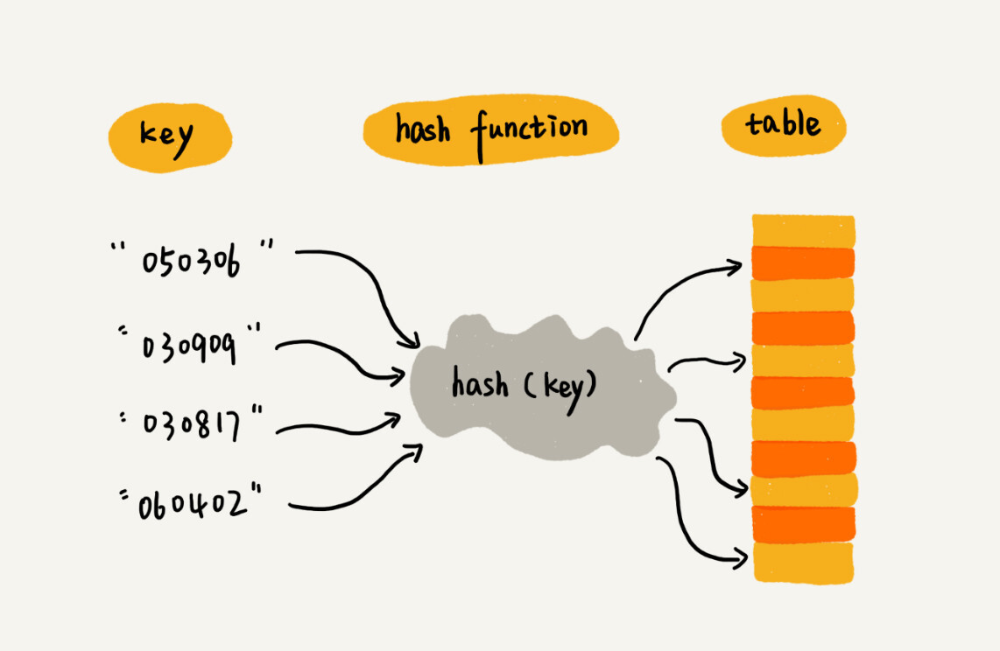

通过这个例子，我们可以总结出这样的规律：散列表用的就是数组支持按照下标随机访问的时候，时间复杂度是 O(1) 的特性。我们通过散列函数把元素的键值映射为下标，然后将数据存储在数组中对应下标的位置。当我们按照键值查询元素时，我们用同样的散列函数，将键值转化数组下标，从对应的数组下标的位置取数据。

### 散列函数

从上面的例子我们可以看到，散列函数在散列表中起着非常关键的作用。现在我们就来学习下散列函数。

散列函数，顾名思义，它是一个函数。我们可以把它定义成 **hash(key)**，其中 key 表示元素的键值，hash(key) 的值表示经过散列函数计算得到的散列值。

那第一个例子中，编号就是数组下标，所以 hash(key) 就等于 key。改造后的例子，写成散列函数稍微有点复杂。我用伪代码将它写成函数就是下面这样：

```c
int hash(String key) {
  // 获取后两位字符
  string lastTwoChars = key.substr(length-2, length);
  // 将后两位字符转换为整数
  int hashValue = convert lastTwoChas to int-type;
  return hashValue;
}
```

刚刚举的学校运动会的例子，散列函数比较简单，也比较容易想到。但是，如果参赛选手的编号是随机生成的 6 位数字，又或者用的是 a 到 z 之间的字符串，**该如何构造散列函数呢？我总结了三点散列函数设计的基本要求**：

1. 散列函数计算得到的散列值是一个非负整数；
2. 如果 key1 = key2，那 hash(key1) == hash(key2)；
3. 如果 key1 ≠ key2，那 hash(key1) ≠ hash(key2)。

我来解释一下这三点。其中，第一点理解起来应该没有任何问题。因为数组下标是从 0 开始的，所以散列函数生成的散列值也要是非负整数。第二点也很好理解。相同的 key，经过散列函数得到的散列值也应该是相同的。

第三点理解起来可能会有问题，我着重说一下。这个要求看起来合情合理，但是在真实的情况下，要想找到一个不同的 key 对应的散列值都不一样的散列函数，几乎是不可能的。即便像业界著名的**MD5、SHA、CRC**等哈希算法，也无法完全避免这种**散列冲突**。而且，因为数组的存储空间有限，也会加大散列冲突的概率。

所以我们几乎无法找到一个完美的无冲突的散列函数，即便能找到，付出的时间成本、计算成本也是很大的，所以针对散列冲突问题，我们需要通过其他途径来解决。

### 散列冲突

再好的散列函数也无法避免散列冲突。那究竟该如何解决散列冲突问题呢？我们常用的散列冲突解决方法有两类，开放寻址法（open addressing）和链表法（chaining）。

#### 1. 开放寻址法

开放寻址法的核心思想是，如果出现了散列冲突，我们就重新探测一个空闲位置，将其插入。那如何重新探测新的位置呢？我先讲一个比较简单的探测方法，线性探测（Linear Probing）。

当我们往散列表中插入数据时，如果某个数据经过散列函数散列之后，存储位置已经被占用了，我们就从当前位置开始，依次往后查找，看是否有空闲位置，直到找到为止。

我说的可能比较抽象，我举一个例子具体给你说明一下。这里面黄色的色块表示空闲位置，橙色的色块表示已经存储了数据。


从图中可以看出，散列表的大小为 10，在元素 x 插入散列表之前，已经 6 个元素插入到散列表中。x 经过 Hash 算法之后，被散列到位置下标为 7 的位置，但是这个位置已经有数据了，所以就产生了冲突。于是我们就顺序地往后一个一个找，看有没有空闲的位置，遍历到尾部都没有找到空闲的位置，于是我们再从表头开始找，直到找到空闲位置 2，于是将其插入到这个位置。

在散列表中查找元素的过程有点儿类似插入过程。我们通过散列函数求出要查找元素的键值对应的散列值，然后比较数组中下标为散列值的元素和要查找的元素。如果相等，则说明就是我们要找的元素；否则就顺序往后依次查找。如果遍历到数组中的空闲位置，还没有找到，就说明要查找的元素并没有在散列表中。

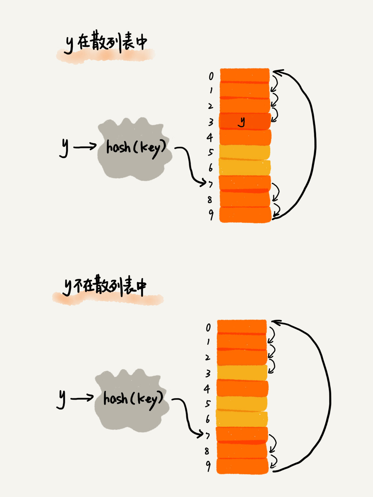

散列表跟数组一样，不仅支持插入、查找操作，还支持删除操作。对于使用线性探测法解决冲突的散列表，删除操作稍微有些特别。我们不能单纯地把要删除的元素设置为空。这是为什么呢？

还记得我们刚讲的查找操作吗？在查找的时候，一旦我们通过线性探测方法，找到一个空闲位置，我们就可以认定散列表中不存在这个数据。但是，如果这个空闲位置是我们后来删除的，就会导致原来的查找算法失效。本来存在的数据，会被认定为不存在。这个问题如何解决呢？

我们可以将删除的元素，特殊标记为 deleted。当线性探测查找的时候，遇到标记为 deleted 的空间，并不是停下来，而是继续往下探测。


你可能已经发现了，线性探测法其实存在很大问题。当散列表中插入的数据越来越多时，散列冲突发生的可能性就会越来越大，空闲位置会越来越少，线性探测的时间就会越来越久。极端情况下，我们可能需要探测整个散列表，所以最坏情况下的时间复杂度为 O(n)。同理，在删除和查找时，也有可能会线性探测整张散列表，才能找到要查找或者删除的数据。

对于开放寻址冲突解决方法，除了线性探测方法之外，还有另外两种比较经典的探测方法，**二次探测**（Quadratic probing）和**双重散列**（Double hashing）。

所谓二次探测，跟线性探测很像，线性探测每次探测的步长是 1，那它探测的下标序列就是 hash(key)+0，hash(key)+1，hash(key)+2……而二次探测探测的步长就变成了原来的“二次方”，也就是说，它探测的下标序列就是$hash(key)+0$​，$hash(key)+1^2$​，$hash(key)+2^2$​……

所谓双重散列，意思就是不仅要使用一个散列函数。我们使用一组散列函数 hash1(key)，hash2(key)，hash3(key)……我们先用第一个散列函数，如果计算得到的存储位置已经被占用，再用第二个散列函数，依次类推，直到找到空闲的存储位置。

不管采用哪种探测方法，当散列表中空闲位置不多的时候，散列冲突的概率就会大大提高。为了尽可能保证散列表的操作效率，一般情况下，我们会尽可能保证散列表中有一定比例的空闲槽位。我们用**装载因子**（load factor）来表示空位的多少。

装载因子的计算公式是：`散列表的装载因子 = 填入表中的元素个数 / 散列表的长度`

装载因子越大，说明空闲位置越少，冲突越多，散列表的性能会下降。

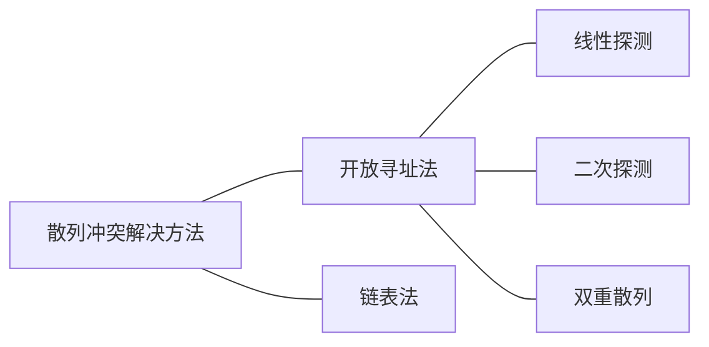
```mermaid
graph LR;
    散列冲突解决方法---开放寻址法;
    散列冲突解决方法---链表法;
    开放寻址法---线性探测;
    开放寻址法---二次探测;
    开放寻址法---双重散列;
```

#### 2. 链表法

链表法是一种更加常用的散列冲突解决办法，相比开放寻址法，它要简单很多。我们来看这个图，在散列表中，每个“桶（bucket）”或者“槽（slot）”会对应一条链表，所有散列值相同的元素我们都放到相同槽位对应的链表中。


当插入的时候，我们只需要通过散列函数计算出对应的散列槽位，将其插入到对应链表中即可，所以插入的时间复杂度是 O(1)。当查找、删除一个元素时，我们同样通过散列函数计算出对应的槽，然后遍历链表查找或者删除。那查找或删除操作的时间复杂度是多少呢？

实际上，这两个操作的时间复杂度跟链表的长度 k 成正比，也就是 O(k)。对于散列比较均匀的散列函数来说，理论上讲，k=n/m，其中 n 表示散列中数据的个数，m 表示散列表中“槽”的个数。

### 解答开篇

有了前面这些基本知识储备，我们来看一下开篇的思考题：Word 文档中单词拼写检查功能是如何实现的？

常用的英文单词有 20 万个左右，假设单词的平均长度是 10 个字母，平均一个单词占用 10 个字节的内存空间，那 20 万英文单词大约占 2 MB 的存储空间，就算放大 10 倍也就是 20 MB。对于现在的计算机来说，这个大小完全可以放在内存里面。所以我们可以用散列表来存储整个英文单词词典。

当用户输入某个英文单词时，我们拿用户输入的单词去散列表中查找。如果查到，则说明拼写正确；如果没有查到，则说明拼写可能有误，给予提示。借助散列表这种数据结构，我们就可以轻松实现快速判断是否存在拼写错误。

### 内容小结

今天我讲了一些比较基础、比较偏理论的散列表知识，包括散列表的由来、散列函数、散列冲突的解决方法。

散列表来源于数组，它借助散列函数对数组这种数据结构进行扩展，利用的是数组支持按照下标随机访问元素的特性。散列表两个核心问题是散列函数设计和散列冲突解决。散列冲突有两种常用的解决方法，开放寻址法和链表法。散列函数设计的好坏决定了散列冲突的概率，也就决定散列表的性能。

针对散列函数和散列冲突，今天我只讲了一些基础的概念、方法，下一节我会更贴近实战、更加深入探讨这两个问题。

### 课后思考

1. 假设我们有 10 万条 URL 访问日志，如何按照访问次数给 URL 排序？
2. 有两个字符串数组，每个数组大约有 10 万条字符串，如何快速找出两个数组中相同的字符串？

## 19 | 散列表（中）：如何打造一个工业级水平的散列表？

通过上一节的学习，我们知道，散列表的查询效率并不能笼统地说成是 O(1)。它跟散列函数、装载因子、散列冲突等都有关系。如果散列函数设计得不好，或者装载因子过高，都可能导致散列冲突发生的概率升高，查询效率下降。

在极端情况下，有些恶意的攻击者，还有可能通过精心构造的数据，使得所有的数据经过散列函数之后，都散列到同一个槽里。如果我们使用的是基于链表的冲突解决方法，那这个时候，散列表就会退化为链表，查询的时间复杂度就从 O(1) 急剧退化为 O(n)。

如果散列表中有 10 万个数据，退化后的散列表查询的效率就下降了 10 万倍。更直接点说，如果之前运行 100 次查询只需要 0.1 秒，那现在就需要 1 万秒。这样就有可能因为查询操作消耗大量 CPU 或者线程资源，导致系统无法响应其他请求，从而达到拒绝服务攻击（DoS）的目的。这也就是散列表碰撞攻击的基本原理。

今天，我们就来学习一下，**如何设计一个可以应对各种异常情况的工业级散列表，来避免在散列冲突的情况下，散列表性能的急剧下降，并且能抵抗散列碰撞攻击**？

### 如何设计散列函数？

散列函数设计的好坏，决定了散列表冲突的概率大小，也直接决定了散列表的性能。那什么才是好的散列函数呢？

首先，**散列函数的设计不能太复杂**。过于复杂的散列函数，势必会消耗很多计算时间，也就间接地影响到散列表的性能。其次，**散列函数生成的值要尽可能随机并且均匀分布**，这样才能避免或者最小化散列冲突，而且即便出现冲突，散列到每个槽里的数据也会比较平均，不会出现某个槽内数据特别多的情况。

实际工作中，我们还需要综合考虑各种因素。这些因素有关键字的长度、特点、分布、还有散列表的大小等。散列函数各式各样，我举几个常用的、简单的散列函数的设计方法，让你有个直观的感受。

第一个例子就是我们上一节的学生运动会的例子，我们通过分析参赛编号的特征，把编号中的后两位作为散列值。我们还可以用类似的散列函数处理手机号码，因为手机号码前几位重复的可能性很大，但是后面几位就比较随机，我们可以取手机号的后四位作为散列值。这种散列函数的设计方法，我们一般叫做“数据分析法”。

第二个例子就是上一节的开篇思考题，如何实现 Word 拼写检查功能。这里面的散列函数，我们就可以这样设计：将单词中每个字母的ASCll 码值“进位”相加，然后再跟散列表的大小求余、取模，作为散列值。比如，英文单词 nice，我们转化出来的散列值就是下面这样：

```c
hash("nice")=(("n" - "a") * 26*26*26 + ("i" - "a")*26*26 + ("c" - "a")*26+ ("e"-"a")) / 78978
```

实际上，散列函数的设计方法还有很多，比如直接寻址法、平方取中法、折叠法、随机数法等，这些你只要了解就行了，不需要全都掌握。

### 装载因子过大了怎么办？

我们上一节讲到散列表的装载因子的时候说过，装载因子越大，说明散列表中的元素越多，空闲位置越少，散列冲突的概率就越大。不仅插入数据的过程要多次寻址或者拉很长的链，查找的过程也会因此变得很慢。

对于没有频繁插入和删除的静态数据集合来说，我们很容易根据数据的特点、分布等，设计出完美的、极少冲突的散列函数，因为毕竟之前数据都是已知的。

对于动态散列表来说，数据集合是频繁变动的，我们事先无法预估将要加入的数据个数，所以我们也无法事先申请一个足够大的散列表。随着数据慢慢加入，装载因子就会慢慢变大。当装载因子大到一定程度之后，散列冲突就会变得不可接受。这个时候，我们该如何处理呢？

还记得我们前面多次讲的“动态扩容”吗？你可以回想一下，我们是如何做数组、栈、队列的动态扩容的。

针对散列表，当装载因子过大时，我们也可以进行动态扩容，重新申请一个更大的散列表，将数据搬移到这个新散列表中。假设每次扩容我们都申请一个原来散列表大小两倍的空间。如果原来散列表的装载因子是 0.8，那经过扩容之后，新散列表的装载因子就下降为原来的一半，变成了 0.4。

针对数组的扩容，数据搬移操作比较简单。但是，针对散列表的扩容，数据搬移操作要复杂很多。因为散列表的大小变了，数据的存储位置也变了，所以我们需要通过散列函数重新计算每个数据的存储位置。

你可以看我图里这个例子。在原来的散列表中，21 这个元素原来存储在下标为 0 的位置，搬移到新的散列表中，存储在下标为 7 的位置。

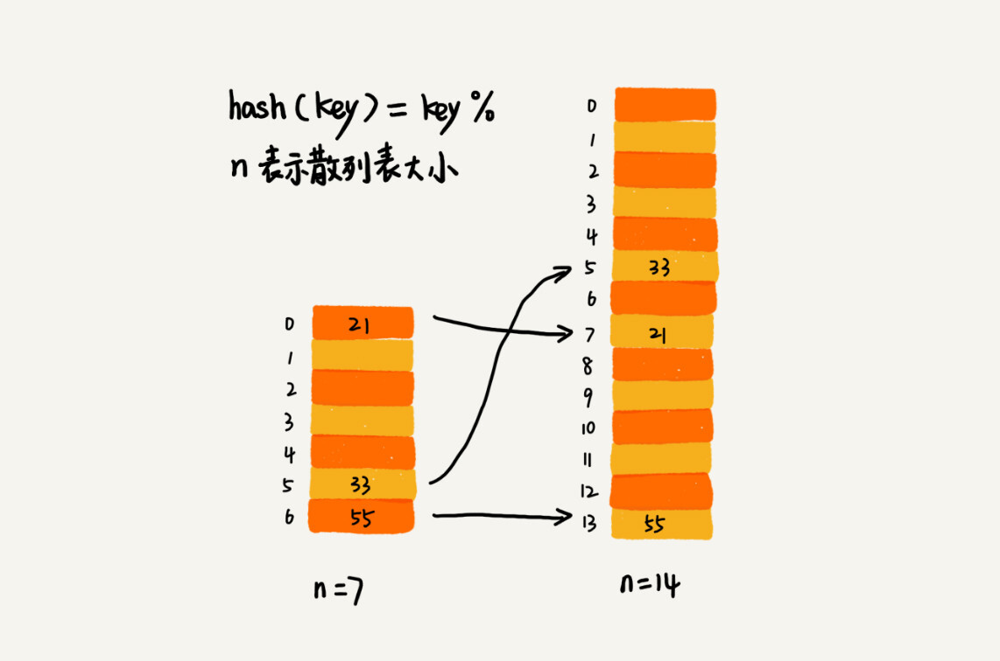

对于支持动态扩容的散列表，插入操作的时间复杂度是多少呢？前面章节我已经多次分析过支持动态扩容的数组、栈等数据结构的时间复杂度了。所以，这里我就不啰嗦了，你要是还不清楚的话，可以回去复习一下。

插入一个数据，最好情况下，不需要扩容，最好时间复杂度是 O(1)。最坏情况下，散列表装载因子过高，启动扩容，我们需要重新申请内存空间，重新计算哈希位置，并且搬移数据，所以时间复杂度是 O(n)。用摊还分析法，均摊情况下，时间复杂度接近最好情况，就是 O(1)。

实际上，对于动态散列表，随着数据的删除，散列表中的数据会越来越少，空闲空间会越来越多。如果我们对空间消耗非常敏感，我们可以在装载因子小于某个值之后，启动动态缩容。当然，如果我们更加在意执行效率，能够容忍多消耗一点内存空间，那就可以不用费劲来缩容了。

我们前面讲到，当散列表的装载因子超过某个阈值时，就需要进行扩容。装载因子阈值需要选择得当。如果太大，会导致冲突过多；如果太小，会导致内存浪费严重。

装载因子阈值的设置要权衡时间、空间复杂度。如果内存空间不紧张，对执行效率要求很高，可以降低负载因子的阈值；相反，如果内存空间紧张，对执行效率要求又不高，可以增加负载因子的值，甚至可以大于 1。

### 如何避免低效的扩容？

我们刚刚分析得到，大部分情况下，动态扩容的散列表插入一个数据都很快，但是在特殊情况下，当装载因子已经到达阈值，需要先进行扩容，再插入数据。这个时候，插入数据就会变得很慢，甚至会无法接受。

我举一个极端的例子，如果散列表当前大小为 1GB，要想扩容为原来的两倍大小，那就需要对 1GB 的数据重新计算哈希值，并且从原来的散列表搬移到新的散列表，听起来就很耗时，是不是？

如果我们的业务代码直接服务于用户，尽管大部分情况下，插入一个数据的操作都很快，但是，极个别非常慢的插入操作，也会让用户崩溃。这个时候，“一次性”扩容的机制就不合适了。

为了解决一次性扩容耗时过多的情况，我们可以将扩容操作穿插在插入操作的过程中，分批完成。当装载因子触达阈值之后，我们只申请新空间，但并不将老的数据搬移到新散列表中。

当有新数据要插入时，我们将新数据插入新散列表中，并且从老的散列表中拿出一个数据放入到新散列表。每次插入一个数据到散列表，我们都重复上面的过程。经过多次插入操作之后，老的散列表中的数据就一点一点全部搬移到新散列表中了。这样没有了集中的一次性数据搬移，插入操作就都变得很快了。

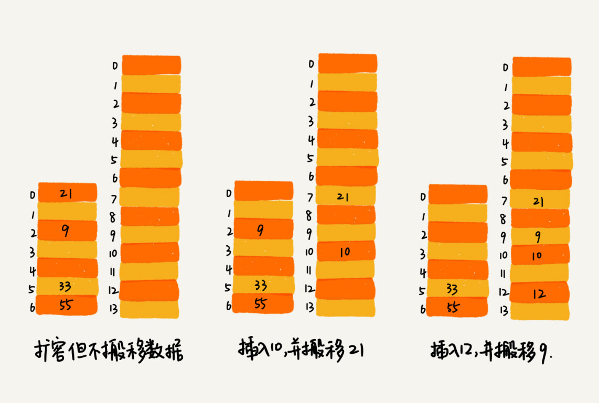

这期间的查询操作怎么来做呢？对于查询操作，为了兼容了新、老散列表中的数据，我们先从新散列表中查找，如果没有找到，再去老的散列表中查找。

通过这样均摊的方法，将一次性扩容的代价，均摊到多次插入操作中，就避免了一次性扩容耗时过多的情况。这种实现方式，任何情况下，插入一个数据的时间复杂度都是 O(1)。

### 如何选择冲突解决方法？

上一节我们讲了两种主要的散列冲突的解决办法，开放寻址法和链表法。这两种冲突解决办法在实际的软件开发中都非常常用。比如，Java 中 LinkedHashMap 就采用了链表法解决冲突，ThreadLocalMap 是通过线性探测的开放寻址法来解决冲突。那你知道，这两种冲突解决方法各有什么优势和劣势，又各自适用哪些场景吗？

#### 1. 开放寻址法

我们先来看看，开放寻址法的优点有哪些。

开放寻址法不像链表法，需要拉很多链表。散列表中的数据都存储在数组中，可以有效地利用 CPU 缓存加快查询速度。而且，这种方法实现的散列表，序列化起来比较简单。链表法包含指针，序列化起来就没那么容易。你可不要小看序列化，很多场合都会用到的。我们后面就有一节会讲什么是数据结构序列化、如何序列化，以及为什么要序列化。

我们再来看下，开放寻址法有哪些缺点。

上一节我们讲到，用开放寻址法解决冲突的散列表，删除数据的时候比较麻烦，需要特殊标记已经删除掉的数据。而且，在开放寻址法中，所有的数据都存储在一个数组中，比起链表法来说，冲突的代价更高。所以，使用开放寻址法解决冲突的散列表，装载因子的上限不能太大。这也导致这种方法比链表法更浪费内存空间。

所以，**我总结一下，当数据量比较小、装载因子小的时候，适合采用开放寻址法。这也是 Java 中的 ThreadLocalMap 使用开放寻址法解决散列冲突的原因**。

#### 2. 链表法

首先，链表法对内存的利用率比开放寻址法要高。因为链表结点可以在需要的时候再创建，并不需要像开放寻址法那样事先申请好。实际上，这一点也是我们前面讲过的链表优于数组的地方。

链表法比起开放寻址法，对大装载因子的容忍度更高。开放寻址法只能适用装载因子小于 1 的情况。接近 1 时，就可能会有大量的散列冲突，导致大量的探测、再散列等，性能会下降很多。但是对于链表法来说，只要散列函数的值随机均匀，即便装载因子变成 10，也就是链表的长度变长了而已，虽然查找效率有所下降，但是比起顺序查找还是快很多。

还记得我们之前在链表那一节讲的吗？链表因为要存储指针，所以对于比较小的对象的存储，是比较消耗内存的，还有可能会让内存的消耗翻倍。而且，因为链表中的结点是零散分布在内存中的，不是连续的，所以对 CPU 缓存是不友好的，这方面对于执行效率也有一定的影响。

当然，如果我们存储的是大对象，也就是说要存储的对象的大小远远大于一个指针的大小（4 个字节或者 8 个字节），那链表中指针的内存消耗在大对象面前就可以忽略了。

实际上，我们对链表法稍加改造，可以实现一个更加高效的散列表。那就是，我们将链表法中的链表改造为其他高效的动态数据结构，比如跳表、红黑树。这样，即便出现散列冲突，极端情况下，所有的数据都散列到同一个桶内，那最终退化成的散列表的查找时间也只不过是 O(logn)。这样也就有效避免了前面讲到的散列碰撞攻击。

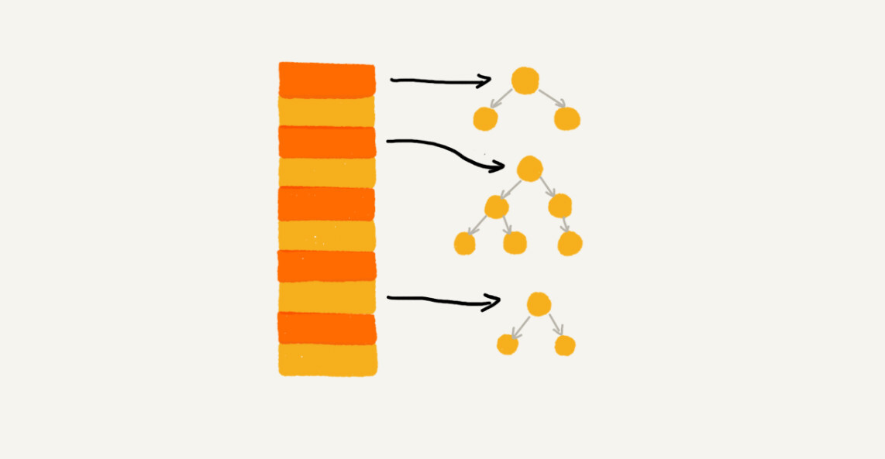

所以，**我总结一下，基于链表的散列冲突处理方法比较适合存储大对象、大数据量的散列表，而且，比起开放寻址法，它更加灵活，支持更多的优化策略，比如用红黑树代替链表**。

### 工业级散列表举例分析

刚刚我讲了实现一个工业级散列表需要涉及的一些关键技术，现在，我就拿一个具体的例子，Java 中的 HashMap 这样一个工业级的散列表，来具体看下，这些技术是怎么应用的。

#### 1. 初始大小

HashMap 默认的初始大小是 16，当然这个默认值是可以设置的，如果事先知道大概的数据量有多大，可以通过修改默认初始大小，减少动态扩容的次数，这样会大大提高 HashMap 的性能。

#### 2. 装载因子和动态扩容

最大装载因子默认是 0.75，当 HashMap 中元素个数超过 0.75*capacity（capacity 表示散列表的容量）的时候，就会启动扩容，每次扩容都会扩容为原来的两倍大小。

#### 3. 散列冲突解决方法

HashMap 底层采用链表法来解决冲突。即使负载因子和散列函数设计得再合理，也免不了会出现拉链过长的情况，一旦出现拉链过长，则会严重影响 HashMap 的性能。

于是，在 JDK1.8 版本中，为了对 HashMap 做进一步优化，我们引入了红黑树。而当链表长度太长（默认超过 8）时，链表就转换为红黑树。我们可以利用红黑树快速增删改查的特点，提高 HashMap 的性能。当红黑树结点个数少于 8 个的时候，又会将红黑树转化为链表。因为在数据量较小的情况下，红黑树要维护平衡，比起链表来，性能上的优势并不明显。

#### 4. 散列函数

散列函数的设计并不复杂，追求的是简单高效、分布均匀。我把它摘抄出来，你可以看看。

```java
private int hash(Object key) {
    int h = key.hashCode()；
    return (h ^ (h >>> 16)) & (capicity -1); //capicity表示散列表的大小
}
```

其中，hashCode() 返回的是 Java 对象的 hash code。比如 String 类型的对象的 hashCode() 就是下面这样：

```java
public int hashCode() {
  int var1 = this.hash;
  if(var1 == 0 && this.value.length > 0) {
    char[] var2 = this.value;
    for(int var3 = 0; var3 < this.value.length; ++var3) {
      var1 = 31 * var1 + var2[var3];
    }
    this.hash = var1;
  }
  return var1;
}
```

### 解答开篇

今天的内容就讲完了，我现在来分析一下开篇的问题：如何设计一个工业级的散列函数？如果这是一道面试题或者是摆在你面前的实际开发问题，你会从哪几个方面思考呢？

首先，我会思考，**何为一个工业级的散列表？工业级的散列表应该具有哪些特性**？

结合已经学习过的散列知识，我觉得应该有这样几点要求：

- 支持快速地查询、插入、删除操作；
- 内存占用合理，不能浪费过多的内存空间；
- 性能稳定，极端情况下，散列表的性能也不会退化到无法接受的情况。

**如何实现这样一个散列表呢**？根据前面讲到的知识，我会从这三个方面来考虑设计思路：

- 设计一个合适的散列函数；
- 定义装载因子阈值，并且设计动态扩容策略；
- 选择合适的散列冲突解决方法。

关于散列函数、装载因子、动态扩容策略，还有散列冲突的解决办法，我们前面都讲过了，具体如何选择，还要结合具体的业务场景、具体的业务数据来具体分析。不过只要我们朝这三个方向努力，就离设计出工业级的散列表不远了。

### 内容小结

上一节的内容比较偏理论，今天的内容侧重实战。我主要讲了如何设计一个工业级的散列表，以及如何应对各种异常情况，防止在极端情况下，散列表的性能退化过于严重。我分了三部分来讲解这些内容，分别是：如何设计散列函数，如何根据装载因子动态扩容，以及如何选择散列冲突解决方法。

关于散列函数的设计，我们要尽可能让散列后的值随机且均匀分布，这样会尽可能地减少散列冲突，即便冲突之后，分配到每个槽内的数据也比较均匀。除此之外，散列函数的设计也不能太复杂，太复杂就会太耗时间，也会影响散列表的性能。

关于散列冲突解决方法的选择，我对比了开放寻址法和链表法两种方法的优劣和适应的场景。大部分情况下，链表法更加普适。而且，我们还可以通过将链表法中的链表改造成其他动态查找数据结构，比如红黑树，来避免散列表时间复杂度退化成 O(n)，抵御散列碰撞攻击。但是，对于小规模数据、装载因子不高的散列表，比较适合用开放寻址法。

对于动态散列表来说，不管我们如何设计散列函数，选择什么样的散列冲突解决方法。随着数据的不断增加，散列表总会出现装载因子过高的情况。这个时候，我们就需要启动动态扩容。

### 课后思考

1. 假设我们有 10 万条 URL 访问日志，如何按照访问次数给 URL 排序？
2. 有两个字符串数组，每个数组大约有 10 万条字符串，如何快速找出两个数组中相同的字符串？

### 精选留言

1. 遍历 10 万条数据，以 URL 为 key，访问次数为 value，存入散列表，同时记录下访问次数的最大值 K，时间复杂度 O(N)。

   如果 K 不是很大，可以使用桶排序，时间复杂度 O(N)。如果 K 非常大（比如大于 10 万），就使用快速排序，复杂度 O(NlogN)。

2. 以第一个字符串数组构建散列表，key 为字符串，value 为出现次数。再遍历第二个字符串数组，以字符串为 key 在散列表中查找，如果 value 大于零，说明存在相同字符串。时间复杂度 O(N)。

## 20 | 散列表（下）：为什么散列表和链表经常会一起使用？

我们已经学习了 20 节内容，你有没有发现，有两种数据结构，散列表和链表，经常会被放在一起使用。你还记得，前面的章节中都有哪些地方讲到散列表和链表的组合使用吗？我带你一起回忆一下。

在链表那一节，我讲到如何用链表来实现 LRU 缓存淘汰算法，但是链表实现的 LRU 缓存淘汰算法的时间复杂度是 O(n)，当时我也提到了，通过散列表可以将这个时间复杂度降低到 O(1)。

在跳表那一节，我提到 Redis 的有序集合是使用跳表来实现的，跳表可以看作一种改进版的链表。当时我们也提到，Redis 有序集合不仅使用了跳表，还用到了散列表。

除此之外，如果你熟悉 Java 编程语言，你会发现 LinkedHashMap 这样一个常用的容器，也用到了散列表和链表两种数据结构。

今天，我们就来看看，在这几个问题中，散列表和链表都是如何组合起来使用的，以及为什么散列表和链表会经常放到一块使用。

### LRU 缓存淘汰算法

在链表那一节中，我提到，借助散列表，我们可以把 LRU 缓存淘汰算法的时间复杂度降低为 O(1)。现在，我们就来看看它是如何做到的。

首先，我们来回顾一下当时我们是如何通过链表实现 LRU 缓存淘汰算法的。

我们需要维护一个按照访问时间从大到小有序排列的链表结构。因为缓存大小有限，当缓存空间不够，需要淘汰一个数据的时候，我们就直接将链表头部的结点删除。

当要缓存某个数据的时候，先在链表中查找这个数据。如果没有找到，则直接将数据放到链表的尾部；如果找到了，我们就把它移动到链表的尾部。因为查找数据需要遍历链表，所以单纯用链表实现的 LRU 缓存淘汰算法的时间复杂很高，是 O(n)。

实际上，我总结一下，一个缓存（cache）系统主要包含下面这几个操作：

- 往缓存中添加一个数据；
- 从缓存中删除一个数据；
- 在缓存中查找一个数据。

这三个操作都要涉及“查找”操作，如果单纯地采用链表的话，时间复杂度只能是 O(n)。如果我们将散列表和链表两种数据结构组合使用，可以将这三个操作的时间复杂度都降低到 O(1)。具体的结构就是下面这个样子：

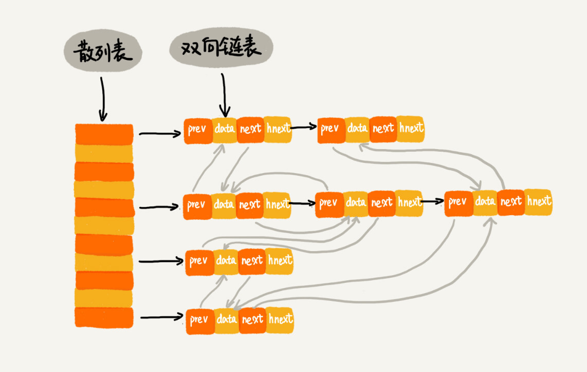

我们使用双向链表存储数据，链表中的每个结点处理存储数据（data）、前驱指针（prev）、后继指针（next）之外，还新增了一个特殊的字段 hnext。这个 hnext 有什么作用呢？

因为我们的散列表是通过链表法解决散列冲突的，所以每个结点会在两条链中。一个链是刚刚我们提到的**双向链表**，另一个链是散列表中的**拉链**。前驱和后继指针是为了将结点串在双向链表中，**hnext 指针是为了将结点串在散列表的拉链中**。

了解了这个散列表和双向链表的组合存储结构之后，我们再来看，前面讲到的缓存的三个操作，是如何做到时间复杂度是 O(1) 的？

首先，我们来看**如何查找一个数据**。我们前面讲过，散列表中查找数据的时间复杂度接近 O(1)，所以通过散列表，我们可以很快地在缓存中找到一个数据。当找到数据之后，我们还需要将它移动到双向链表的尾部。

其次，我们来看**如何删除一个数据**。我们需要找到数据所在的结点，然后将结点删除。借助散列表，我们可以在 O(1) 时间复杂度里找到要删除的结点。因为我们的链表是双向链表，双向链表可以通过前驱指针 O(1) 时间复杂度获取前驱结点，所以在双向链表中，删除结点只需要 O(1) 的时间复杂度。

最后，我们来看**如何添加一个数据**。添加数据到缓存稍微有点麻烦，我们需要先看这个数据是否已经在缓存中。如果已经在其中，需要将其移动到双向链表的尾部；如果不在其中，还要看缓存有没有满。如果满了，则将双向链表头部的结点删除，然后再将数据放到链表的尾部；如果没有满，就直接将数据放到链表的尾部。

这整个过程涉及的查找操作都可以通过散列表来完成。其他的操作，比如删除头结点、链表尾部插入数据等，都可以在 O(1) 的时间复杂度内完成。所以，这三个操作的时间复杂度都是 O(1)。至此，我们就通过散列表和双向链表的组合使用，实现了一个高效的、支持 LRU 缓存淘汰算法的缓存系统原型。

### Redis 有序集合

在跳表那一节，讲到有序集合的操作时，我稍微做了些简化。实际上，在有序集合中，每个成员对象有两个重要的属性，**key**（键值）和 **score**（分值）。我们不仅会通过 score 来查找数据，还会通过 key 来查找数据。

举个例子，比如用户积分排行榜有这样一个功能：我们可以通过用户的 ID 来查找积分信息，也可以通过积分区间来查找用户 ID 或者姓名信息。这里包含 ID、姓名和积分的用户信息，就是成员对象，用户 ID 就是 key，积分就是 score。

所以，如果我们细化一下 Redis 有序集合的操作，那就是下面这样：

- 添加一个成员对象；
- 按照键值来删除一个成员对象；
- 按照键值来查找一个成员对象；
- 按照分值区间查找数据，比如查找积分在[100, 356]之间的成员对象；
- 按照分值从小到大排序成员变量；

如果我们仅仅按照分值将成员对象组织成跳表的结构，那按照键值来删除、查询成员对象就会很慢，解决方法与 LRU 缓存淘汰算法的解决方法类似。我们可以再按照键值构建一个散列表，这样按照 key 来删除、查找一个成员对象的时间复杂度就变成了 O(1)。同时，借助跳表结构，其他操作也非常高效。

实际上，Redis 有序集合的操作还有另外一类，也就是查找成员对象的排名（Rank）或者根据排名区间查找成员对象。这个功能单纯用刚刚讲的这种组合结构就无法高效实现了。这块内容我后面的章节再讲。

### Java LinkedHashMap

前面我们讲了两个散列表和链表结合的例子，现在我们再来看另外一个，Java 中的 LinkedHashMap 这种容器。

如果你熟悉 Java，那你几乎天天会用到这个容器。我们之前讲过，HashMap 底层是通过散列表这种数据结构实现的。而 LinkedHashMap 前面比 HashMap 多了一个“Linked”，这里的“Linked”是不是说，LinkedHashMap 是一个通过链表法解决散列冲突的散列表呢？

实际上，LinkedHashMap 并没有这么简单，其中的“Linked”也并不仅仅代表它是通过链表法解决散列冲突的。关于这一点，在我是初学者的时候，也误解了很久。

我们先来看一段代码。你觉得这段代码会以什么样的顺序打印 3，1，5，2 这几个 key 呢？原因又是什么呢？

```java
HashMap<Integer, Integer> m = new LinkedHashMap<>();
m.put(3, 11);
m.put(1, 12);
m.put(5, 23);
m.put(2, 22);

for (Map.Entry e : m.entrySet()) {
  System.out.println(e.getKey());
}
```

我先告诉你答案，上面的代码会按照数据插入的顺序依次来打印，也就是说，打印的顺序就是 3，1，5，2。你有没有觉得奇怪？散列表中数据是经过散列函数打乱之后无规律存储的，这里是如何实现按照数据的插入顺序来遍历打印的呢？

你可能已经猜到了，LinkedHashMap 也是通过散列表和链表组合在一起实现的。实际上，它不仅支持按照插入顺序遍历数据，还支持按照访问顺序来遍历数据。你可以看下面这段代码：

```java
// 10是初始大小，0.75是装载因子，true是表示按照访问时间排序
HashMap<Integer, Integer> m = new LinkedHashMap<>(10, 0.75f, true);
m.put(3, 11);
m.put(1, 12);
m.put(5, 23);
m.put(2, 22);

m.put(3, 26);
m.get(5);

for (Map.Entry e : m.entrySet()) {
  System.out.println(e.getKey());
}
```

这段代码打印的结果是 1，2，3，5。我来具体分析一下，为什么这段代码会按照这样顺序来打印。

每次调用 put() 函数，往 LinkedHashMap 中添加数据的时候，都会将数据添加到链表的尾部，所以，在前四个操作完成之后，链表中的数据是下面这样：

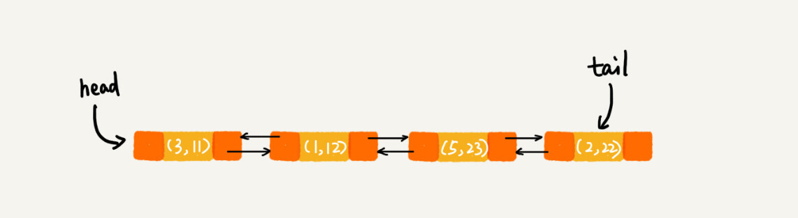

在第 8 行代码中，再次将键值为 3 的数据放入到 LinkedHashMap 的时候，会先查找这个键值是否已经有了，然后，再将已经存在的 (3,11) 删除，并且将新的 (3,26) 放到链表的尾部。所以，这个时候链表中的数据就是下面这样：

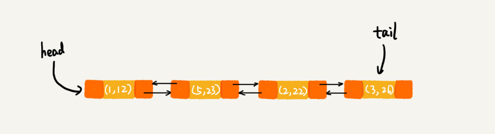

当第 9 行代码访问到 key 为 5 的数据的时候，我们将被访问到的数据移动到链表的尾部。所以，第 9 行代码之后，链表中的数据是下面这样：

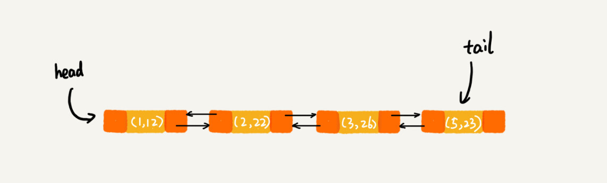

所以，最后打印出来的数据是 1，2，3，5。从上面的分析，你有没有发现，按照访问时间排序的 LinkedHashMap 本身就是一个支持 LRU 缓存淘汰策略的缓存系统？实际上，它们两个的实现原理也是一模一样的。我也就不再啰嗦了。

我现在来总结一下，实际上，**LinkedHashMap 是通过双向链表和散列表这两种数据结构组合实现的。LinkedHashMap 中的“Linked”实际上是指的是双向链表，并非指用链表法解决散列冲突**。

### 解答开篇 & 内容小结

弄懂刚刚我讲的这三个例子，开篇的问题也就不言而喻了。我这里总结一下，为什么散列表和链表经常一块使用？

散列表这种数据结构虽然支持非常高效的数据插入、删除、查找操作，但是散列表中的数据都是通过散列函数打乱之后无规律存储的。也就说，它无法支持按照某种顺序快速地遍历数据。如果希望按照顺序遍历散列表中的数据，那我们需要将散列表中的数据拷贝到数组中，然后排序，再遍历。

因为散列表是动态数据结构，不停地有数据的插入、删除，所以每当我们希望按顺序遍历散列表中的数据的时候，都需要先排序，那效率势必会很低。为了解决这个问题，我们将散列表和链表（或者跳表）结合在一起使用。

### 课后思考

1. 今天讲的几个散列表和链表结合使用的例子里，我们用的都是双向链表。如果把双向链表改成单链表，还能否正常工作呢？为什么呢？

2. 假设猎聘网有 10 万名猎头，每个猎头都可以通过做任务（比如发布职位）来积累积分，然后通过积分来下载简历。假设你是猎聘网的一名工程师，如何在内存中存储这 10 万个猎头 ID 和积分信息，让它能够支持这样几个操作：
   - 根据猎头的 ID 快速查找、删除、更新这个猎头的积分信息；
   - 查找积分在某个区间的猎头 ID 列表；
   - 查找按照积分从小到大排名在第 x 位到第 y 位之间的猎头 ID 列表。

### 精选留言

通过这 20 节课学习下来，个人感觉其实就两种数据结构，链表和数组。

- 数组占据随机访问的优势，却有需要连续内存的缺点。
- 链表具有可不连续存储的优势，但访问查找是线性的。

散列表和链表、跳表的混合使用，是为了结合数组和链表的优势，规避它们的不足。我们可以得出数据结构和算法的重要性排行榜：连续空间 > 时间 > 碎片空间。

1. 在删除一个元素时，虽然能 O(1) 的找到目标结点，但是要删除该结点需要拿到前一个结点的指针，遍历到前一个结点复杂度会变为 O(N），所以用双链表实现比较合适。（但其实硬要操作的话，单链表也是可以实现 O(1) 时间复杂度删除结点的）。iOS 的同学可能知道，YYMemoryCache 就是结合散列表和双向链表来实现的。

2. 以积分排序构建一个跳表，再以猎头 ID 构建一个散列表。
   1. ID 在散列表中所以可以 O(1) 查找到这个猎头；
   2. 积分以跳表存储，跳表支持区间查询；
   3. 这点根据目前学习的知识暂时无法实现，老师文中也提到了。

## 21 | 哈希算法（上）：如何防止数据库中的用户信息被脱库？

还记得 2011 年 CSDN 的“脱库”事件吗？当时，CSDN 网站被黑客攻击，超过 600 万用户的注册邮箱和密码明文被泄露，很多网友对 CSDN 明文保存用户密码行为产生了不满。如果你是 CSDN 的一名工程师，**你会如何存储用户密码这么重要的数据吗？仅仅 MD5 加密一下存储就够了吗**？ 要想搞清楚这个问题，就要先弄明白哈希算法。

哈希算法历史悠久，业界著名的哈希算法也有很多，比如 MD5、SHA 等。在我们平时的开发中，基本上都是拿现成的直接用。所以，我今天不会重点剖析哈希算法的原理，也不会教你如何设计一个哈希算法，而是从实战的角度告诉你，**在实际的开发中，我们该如何用哈希算法解决问题**。

### 什么是哈希算法？

我们前面几节讲到“散列表”“散列函数”，这里又讲到“哈希算法”，你是不是有点一头雾水？实际上，不管是“散列”还是“哈希”，这都是中文翻译的差别，英文其实就是“**Hash**”。所以，我们常听到有人把“散列表”叫作“哈希表”“Hash 表”，把“哈希算法”叫作“Hash 算法”或者“散列算法”。那到底什么是哈希算法呢？

哈希算法的定义和原理非常简单，基本上一句话就可以概括了。将任意长度的二进制值串映射为固定长度的二进制值串，这个映射的规则就是**哈希算法**，而通过原始数据映射之后得到的二进制值串就是**哈希值**。但是，要想设计一个优秀的哈希算法并不容易，根据我的经验，我总结了需要满足的几点要求：

- 从哈希值不能反向推导出原始数据（所以哈希算法也叫单向哈希算法）；
- 对输入数据非常敏感，哪怕原始数据只修改了一个 Bit，最后得到的哈希值也大不相同；
- 散列冲突的概率要很小，对于不同的原始数据，哈希值相同的概率非常小；
- 哈希算法的执行效率要尽量高效，针对较长的文本，也能快速地计算出哈希值。

这些定义和要求都比较理论，可能还是不好理解，我拿 MD5 这种哈希算法来具体说明一下。

我们分别对“今天我来讲哈希算法”和“jiajia”这两个文本，计算 MD5 哈希值，得到两串看起来毫无规律的字符串（MD5 的哈希值是 128 位的 Bit 长度，为了方便表示，我把它们转化成了 16 进制编码）。可以看出来，无论要哈希的文本有多长、多短，通过 MD5 哈希之后，得到的哈希值的长度都是相同的，而且得到的哈希值看起来像一堆随机数，完全没有规律。

```sh
MD5("今天我来讲哈希算法") = bb4767201ad42c74e650c1b6c03d78fa
MD5("jiajia") = cd611a31ea969b908932d44d126d195b
```

我们再来看两个非常相似的文本，“我今天讲哈希算法！”和“我今天讲哈希算法”。这两个文本只有一个感叹号的区别。如果用 MD5 哈希算法分别计算它们的哈希值，你会发现，尽管只有一字之差，得到的哈希值也是完全不同的。

```sh
MD5("我今天讲哈希算法！") = 425f0d5a917188d2c3c3dc85b5e4f2cb
MD5("我今天讲哈希算法") = a1fb91ac128e6aa37fe42c663971ac3d
```

我在前面也说了，通过哈希算法得到的哈希值，很难反向推导出原始数据。比如上面的例子中，我们就很难通过哈希值“a1fb91ac128e6aa37fe42c663971ac3d”反推出对应的文本“我今天讲哈希算法”。

哈希算法要处理的文本可能是各种各样的。比如，对于非常长的文本，如果哈希算法的计算时间很长，那就只能停留在理论研究的层面，很难应用到实际的软件开发中。比如，我们把今天这篇包含 4000 多个汉字的文章，用 MD5 计算哈希值，用不了 1ms 的时间。

哈希算法的应用非常非常多，我选了最常见的七个，分别是安全加密、唯一标识、数据校验、散列函数、负载均衡、数据分片、分布式存储。这节我们先来看前四个应用。

### 应用一：安全加密

说到哈希算法的应用，最先想到的应该就是安全加密。最常用于加密的哈希算法是 **MD5**（MD5 Message-Digest Algorithm，MD5 消息摘要算法）和 **SHA**（Secure Hash Algorithm，安全散列算法）。

除了这两个之外，当然还有很多其他加密算法，比如 **DES**（Data Encryption Standard，数据加密标准）、**AES**（Advanced Encryption Standard，高级加密标准）。

前面我讲到的哈希算法四点要求，对用于加密的哈希算法来说，有两点格外重要。

- 第一点是很难根据哈希值反向推导出原始数据；
- 第二点是散列冲突的概率要很小。

第一点很好理解，加密的目的就是防止原始数据泄露，所以很难通过哈希值反向推导原始数据，这是一个最基本的要求。所以我着重讲一下第二点。实际上，不管是什么哈希算法，我们只能尽量减少碰撞冲突的概率，理论上是没办法做到完全不冲突的。为什么这么说呢？

这里就基于组合数学中一个非常基础的理论，鸽巢原理（也叫抽屉原理）。这个原理本身很简单，它是说，如果有 10 个鸽巢，有 11 只鸽子，那肯定有 1 个鸽巢中的鸽子数量多于 1 个，换句话说就是，肯定有 2 只鸽子在 1 个鸽巢内。

有了鸽巢原理的铺垫之后，我们再来看，**为什么哈希算法无法做到零冲突**？

我们知道，哈希算法产生的哈希值的长度是固定且有限的。比如前面举的 MD5 的例子，哈希值是固定的 128 位二进制串，能表示的数据是有限的，最多能表示 2^128 个数据，而我们要哈希的数据是无穷的。基于鸽巢原理，如果我们对 2^128+1 个数据求哈希值，就必然会存在哈希值相同的情况。这里你应该能想到，一般情况下，哈希值越长的哈希算法，散列冲突的概率越低。
$$
2^{128}=340282366920938463463374607431768211456
$$
为了让你能有个更加直观的感受，我找了两段字符串放在这里。这两段字符串经过 MD5 哈希算法加密之后，产生的哈希值是相同的。

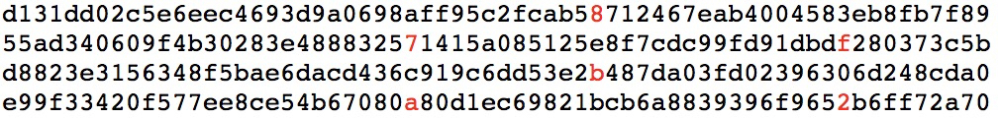

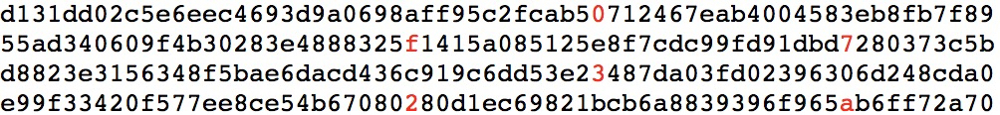

不过，即便哈希算法存在散列冲突的情况，但是因为哈希值的范围很大，冲突的概率极低，所以相对来说还是很难破解的。像 MD5，有 $2^{128}$ 个不同的哈希值，这个数据已经是一个天文数字了，所以散列冲突的概率要小于 $1/2^{128}$。

如果我们拿到一个 MD5 哈希值，希望通过毫无规律的穷举的方法，找到跟这个 MD5 值相同的另一个数据，那耗费的时间应该是个天文数字。所以，即便哈希算法存在冲突，但是在有限的时间和资源下，哈希算法还是很难被破解的。

除此之外，没有绝对安全的加密。越复杂、越难破解的加密算法，需要的计算时间也越长。比如 SHA-256 比 SHA-1 要更复杂、更安全，相应的计算时间就会比较长。密码学界也一直致力于找到一种快速并且很难被破解的哈希算法。我们在实际的开发过程中，也需要权衡破解难度和计算时间，来决定究竟使用哪种加密算法。

### 应用二：唯一标识

我先来举一个例子。如果要在海量的图库中，搜索一张图是否存在，我们不能单纯地用图片的元信息（比如图片名称）来比对，因为有可能存在名称相同但图片内容不同，或者名称不同图片内容相同的情况。那我们该如何搜索呢？

我们知道，任何文件在计算中都可以表示成二进制码串，所以，比较笨的办法就是，拿要查找的图片的二进制码串与图库中所有图片的二进制码串一一比对。如果相同，则说明图片在图库中存在。但是，每个图片小则几十 KB、大则几 MB，转化成二进制是一个非常长的串，比对起来非常耗时。有没有比较快的方法呢？

我们可以给每一个图片取一个唯一标识，或者说信息摘要。比如，我们可以从图片的二进制码串开头取 100 个字节，从中间取 100 个字节，从最后再取 100 个字节，然后将这 300 个字节放到一块，通过哈希算法（比如 MD5），得到一个哈希字符串，用它作为图片的唯一标识。通过这个唯一标识来判定图片是否在图库中，这样就可以减少很多工作量。

如果还想继续提高效率，我们可以把每个图片的唯一标识，和相应的图片文件在图库中的路径信息，都存储在散列表中。当要查看某个图片是不是在图库中的时候，我们先通过哈希算法对这个图片取唯一标识，然后在散列表中查找是否存在这个唯一标识。

如果不存在，那就说明这个图片不在图库中；如果存在，我们再通过散列表中存储的文件路径，获取到这个已经存在的图片，跟现在要插入的图片做全量的比对，看是否完全一样。如果一样，就说明已经存在；如果不一样，说明两张图片尽管唯一标识相同，但是并不是相同的图片。

### 应用三：数据校验

电驴这样的 BT 下载软件你肯定用过吧？我们知道，BT 下载的原理是基于 P2P 协议的。我们从多个机器上并行下载一个 2GB 的电影，这个电影文件可能会被分割成很多文件块（比如可以分成 100 块，每块大约 20MB）。等所有的文件块都下载完成之后，再组装成一个完整的电影文件就行了。

我们知道，网络传输是不安全的，下载的文件块有可能是被宿主机器恶意修改过的，又或者下载过程中出现了错误，所以下载的文件块可能不是完整的。如果我们没有能力检测这种恶意修改或者文件下载出错，就会导致最终合并后的电影无法观看，甚至导致电脑中毒。现在的问题是，如何来校验文件块的安全、正确、完整呢？

具体的 BT 协议很复杂，校验方法也有很多，我来说其中的一种思路。

我们通过哈希算法，对 100 个文件块分别取哈希值，并且保存在种子文件中。我们在前面讲过，哈希算法有一个特点，对数据很敏感。只要文件块的内容有一丁点儿的改变，最后计算出的哈希值就会完全不同。所以，当文件块下载完成之后，我们可以通过相同的哈希算法，对下载好的文件块逐一求哈希值，然后跟种子文件中保存的哈希值比对。如果不同，说明这个文件块不完整或者被篡改了，需要再重新从其他宿主机器上下载这个文件块。

### 应用四：散列函数

前面讲了很多哈希算法的应用，实际上，散列函数也是哈希算法的一种应用。

我们前两节讲到，散列函数是设计一个散列表的关键。它直接决定了散列冲突的概率和散列表的性能。不过，相对哈希算法的其他应用，散列函数对于散列算法冲突的要求要低很多。即便出现个别散列冲突，只要不是过于严重，我们都可以通过开放寻址法或者链表法解决。

不仅如此，散列函数对于散列算法计算得到的值，是否能反向解密也并不关心。散列函数中用到的散列算法，更加关注散列后的值是否能平均分布，也就是，一组数据是否能均匀地散列在各个槽中。除此之外，散列函数执行的快慢，也会影响散列表的性能，所以，散列函数用的散列算法一般都比较简单，比较追求效率。

### 解答开篇

好了，有了前面的基础，现在你有没有发现开篇的问题其实很好解决？

我们可以通过哈希算法，对用户密码进行加密之后再存储，不过最好选择相对安全的加密算法，比如 SHA 等（因为 MD5 已经号称被破解了）。不过仅仅这样加密之后存储就万事大吉了吗？

字典攻击你听说过吗？如果用户信息被“脱库”，黑客虽然拿到是加密之后的密文，但可以通过“猜”的方式来破解密码，这是因为，有些用户的密码太简单。比如很多人习惯用 00000、123456 这样的简单数字组合做密码，很容易就被猜中。

那我们就需要维护一个常用密码的字典表，把字典中的每个密码用哈希算法计算哈希值，然后拿哈希值跟脱库后的密文比对。如果相同，基本上就可以认为，这个加密之后的密码对应的明文就是字典中的这个密码。（注意，这里说是的是“基本上可以认为”，因为根据我们前面的学习，哈希算法存在散列冲突，也有可能出现，尽管密文一样，但是明文并不一样的情况。）

针对字典攻击，我们可以引入一个盐（salt），跟用户的密码组合在一起，增加密码的复杂度。我们拿组合之后的字符串来做哈希算法加密，将它存储到数据库中，进一步增加破解的难度。不过我这里想多说一句，我认为安全和攻击是一种博弈关系，不存在绝对的安全。所有的安全措施，只是增加攻击的成本而已。

### 内容小结

今天的内容比较偏实战，我讲到了哈希算法的四个应用场景。我带你来回顾一下。

1. 第一个应用是唯一标识，哈希算法可以对大数据做信息摘要，通过一个较短的二进制编码来表示很大的数据。

2. 第二个应用是用于校验数据的完整性和正确性。

3. 第三个应用是安全加密，我们讲到任何哈希算法都会出现散列冲突，但是这个冲突概率非常小。越是复杂哈希算法越难破解，但同样计算时间也就越长。所以，选择哈希算法的时候，要权衡安全性和计算时间来决定用哪种哈希算法。

4. 第四个应用是散列函数，这个我们前面讲散列表的时候已经详细地讲过，它对哈希算法的要求非常特别，更加看重的是散列的平均性和哈希算法的执行效率。

## 22 | 哈希算法（下）：哈希算法在分布式系统中有哪些应用？

上一节，我讲了哈希算法的四个应用，它们分别是：安全加密、数据校验、唯一标识、散列函数。今天，我们再来看剩余三种应用：**负载均衡、数据分片、分布式存储**。

你可能已经发现，这三个应用都跟分布式系统有关。没错，今天我就带你看下，**哈希算法是如何解决这些分布式问题的**。

### 应用五：负载均衡

我们知道，负载均衡算法有很多，比如轮询、随机、加权轮询等。那如何才能实现一个会话粘滞（session sticky）的负载均衡算法呢？也就是说，我们需要在同一个客户端上，在一次会话中的所有请求都路由到同一个服务器上。

最直接的方法就是，维护一张映射关系表，这张表的内容是客户端 IP 地址或者会话 ID 与服务器编号的映射关系。客户端发出的每次请求，都要先在映射表中查找应该路由到的服务器编号，然后再请求编号对应的服务器。这种方法简单直观，但也有几个弊端：

- 如果客户端很多，映射表可能会很大，比较浪费内存空间；
- 客户端下线、上线，服务器扩容、缩容都会导致映射失效，这样维护映射表的成本就会很大；

如果借助哈希算法，这些问题都可以非常完美地解决。我们可以通过哈希算法，对客户端 IP 地址或者会话 ID 计算哈希值，将取得的哈希值与服务器列表的大小进行取模运算，最终得到的值就是应该被路由到的服务器编号。 这样，我们就可以把同一个 IP 过来的所有请求，都路由到同一个后端服务器上。

### 应用六：数据分片

哈希算法还可以用于数据的分片。我这里有两个例子。

#### 1. 如何统计“搜索关键词”出现的次数？

假如我们有 1T 的日志文件，这里面记录了用户的搜索关键词，我们想要快速统计出每个关键词被搜索的次数，该怎么做呢？

我们来分析一下。这个问题有两个难点，第一个是搜索日志很大，没办法放到一台机器的内存中。第二个难点是，如果只用一台机器来处理这么巨大的数据，处理时间会很长。

针对这两个难点，我们可以**先对数据进行分片，然后采用多台机器处理的方法，来提高处理速度**。具体的思路是这样的：为了提高处理的速度，我们用 n 台机器并行处理。我们从搜索记录的日志文件中，依次读出每个搜索关键词，并且通过哈希函数计算哈希值，然后再跟 n 取模，最终得到的值，就是应该被分配到的机器编号。

这样，哈希值相同的搜索关键词就被分配到了同一个机器上。也就是说，同一个搜索关键词会被分配到同一个机器上。每个机器会分别计算关键词出现的次数，最后合并起来就是最终的结果。

实际上，这里的处理过程也是 MapReduce 的基本设计思想。

#### 2. 如何快速判断图片是否在图库中？

如何快速判断图片是否在图库中？上一节我们讲过这个例子，不知道你还记得吗？当时我介绍了一种方法，即给每个图片取唯一标识（或者信息摘要），然后构建散列表。

假设现在我们的图库中有 1 亿张图片，很显然，在单台机器上构建散列表是行不通的。因为单台机器的内存有限，而 1 亿张图片构建散列表显然远远超过了单台机器的内存上限。

我们同样可以对数据进行分片，然后采用多机处理。我们准备 n 台机器，让每台机器只维护某一部分图片对应的散列表。我们每次从图库中读取一个图片，计算唯一标识，然后与机器个数 n 求余取模，得到的值就对应要分配的机器编号，然后将这个图片的唯一标识和图片路径发往对应的机器构建散列表。

当我们要判断一个图片是否在图库中的时候，我们通过同样的哈希算法，计算这个图片的唯一标识，然后与机器个数 n 求余取模。假设得到的值是 k，那就去编号 k 的机器构建的散列表中查找。

现在，我们来估算一下，给这 1 亿张图片构建散列表大约需要多少台机器。

散列表中每个数据单元包含两个信息，哈希值和图片文件的路径。假设我们通过 MD5 来计算哈希值，那长度就是 128 比特，也就是 16 字节。文件路径长度的上限是 256 字节，我们可以假设平均长度是 128 字节。如果我们用链表法来解决冲突，那还需要存储指针，指针只占用 8 字节。所以，散列表中每个数据单元就占用 152 字节（这里只是估算，并不准确）。

假设一台机器的内存大小为 2GB，散列表的装载因子为 0.75，那一台机器可以给大约 1000 万（2GB*0.75/152）张图片构建散列表。所以，如果要对 1 亿张图片构建索引，需要大约十几台机器。在工程中，这种估算还是很重要的，能让我们事先对需要投入的资源、资金有个大概的了解，能更好地评估解决方案的可行性。

实际上，针对这种海量数据的处理问题，我们都可以采用多机分布式处理。借助这种分片的思路，可以突破单机内存、CPU 等资源的限制。

### 应用七：分布式存储

现在互联网面对的都是海量的数据、海量的用户。我们为了提高数据的读取、写入能力，一般都采用分布式的方式来存储数据，比如分布式缓存。我们有海量的数据需要缓存，所以一个缓存机器肯定是不够的。于是，我们就需要将数据分布在多台机器上。

该如何决定将哪个数据放到哪个机器上呢？我们可以借用前面数据分片的思想，即通过哈希算法对数据取哈希值，然后对机器个数取模，这个最终值就是应该存储的缓存机器编号。

但是，如果数据增多，原来的 10 个机器已经无法承受了，我们就需要扩容了，比如扩到 11 个机器，这时候麻烦就来了。因为，这里并不是简单地加个机器就可以了。

原来的数据是通过与 10 来取模的。比如 13 这个数据，存储在编号为 3 这台机器上。但是新加了一台机器中，我们对数据按照 11 取模，原来 13 这个数据就被分配到 2 号这台机器上了。

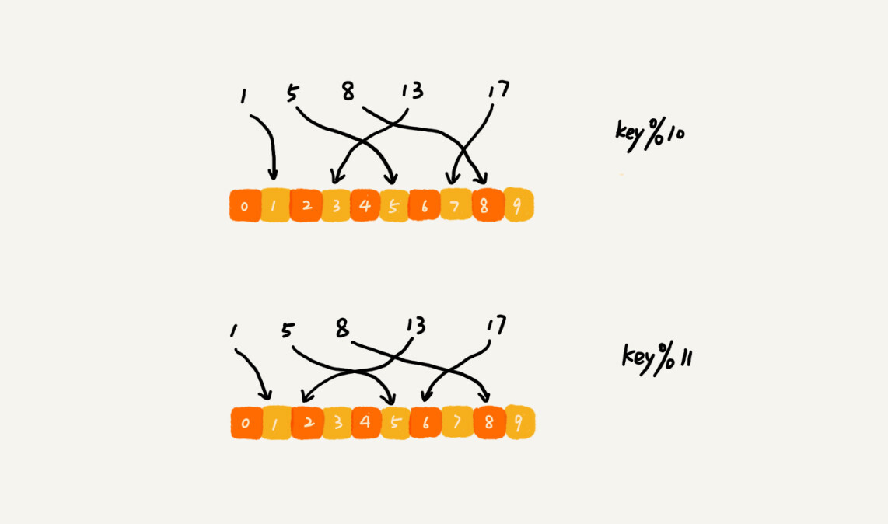

因此，所有的数据都要重新计算哈希值，然后重新搬移到正确的机器上。这样就相当于，缓存中的数据一下子就都失效了。所有的数据请求都会穿透缓存，直接去请求数据库。这样就可能发生**雪崩效应**，压垮数据库。

所以，我们需要一种方法，使得在新加入一个机器后，并不需要做大量的数据搬移。这时候，一致性哈希算法就要登场了。

假设我们有 k 个机器，数据的哈希值的范围是[0, MAX]。我们将整个范围划分成 m 个小区间（m 远大于 k），每个机器负责 m/k 个小区间。当有新机器加入的时候，我们就将某几个小区间的数据，从原来的机器中搬移到新的机器中。这样，既不用全部重新哈希、搬移数据，也保持了各个机器上数据数量的均衡。

一致性哈希算法的基本思想就是这么简单。除此之外，它还会借助一个虚拟的环和虚拟结点，更加优美地实现出来。这里我就不展开讲了，如果感兴趣，你可以看下这个介绍。

除了我们上面讲到的分布式缓存，实际上，一致性哈希算法的应用非常广泛，在很多分布式存储系统中，都可以见到一致性哈希算法的影子。

### 解答开篇 & 内容小结

这两节的内容理论不多，比较贴近具体的开发。今天我讲了三种哈希算法在分布式系统中的应用，它们分别是：负载均衡、数据分片、分布式存储。

在负载均衡应用中，利用哈希算法替代映射表，可以实现一个会话粘滞的负载均衡策略。在数据分片应用中，通过哈希算法对处理的海量数据进行分片，多机分布式处理，可以突破单机资源的限制。在分布式存储应用中，利用一致性哈希算法，可以解决缓存等分布式系统的扩容、缩容导致数据大量搬移的难题。

### 课后思考

这两节我总共讲了七个哈希算法的应用。实际上，我讲的也只是冰山一角，哈希算法还有很多其他的应用，比如网络协议中的 CRC 校验、Git commit id 等等。除了这些，你还能想到其他用到哈希算法的地方吗？

## 23 | 二叉树基础（上）：什么样的二叉树适合用数组来存储？

前面我们讲的都是线性表结构，栈、队列等等。今天我们讲一种非线性表结构，树。树这种数据结构比线性表的数据结构要复杂得多，内容也比较多，所以我会分四节来讲解。

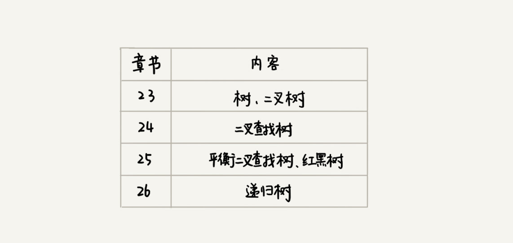

我反复强调过，带着问题学习，是最有效的学习方式之一，所以在正式的内容开始之前，我还是给你出一道思考题：**二叉树有哪几种存储方式？什么样的二叉树适合用数组来存储**？

带着这些问题，我们就来学习今天的内容，树！

### 树（Tree）

我们首先来看，什么是“树”？再完备的定义，都没有图直观。所以我在图中画了几棵“树”。你来看看，这些“树”都有什么特征？

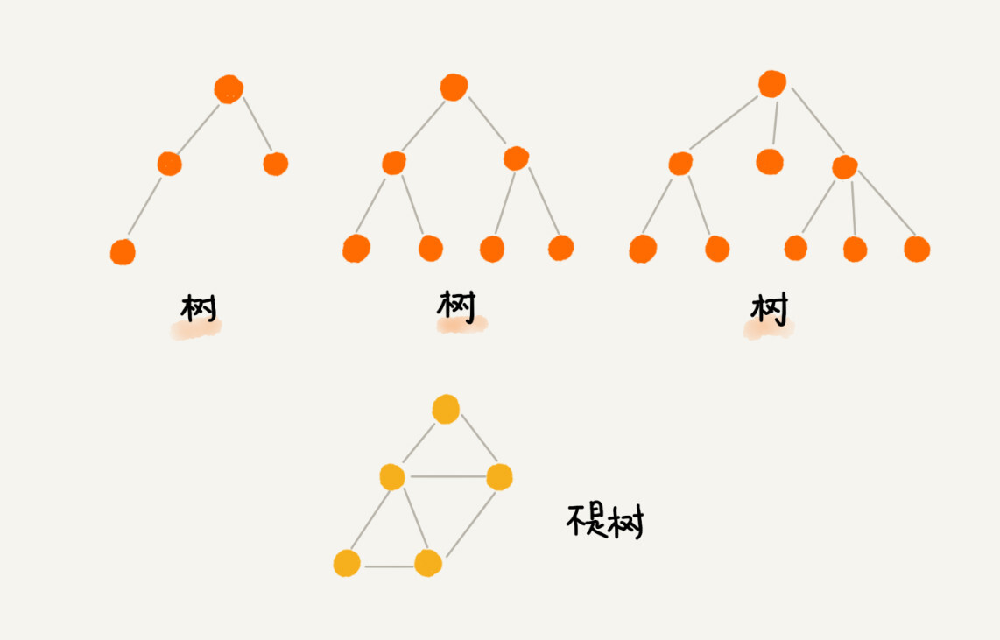

你有没有发现，“树”这种数据结构真的很像我们现实生活中的“树”，这里面每个元素我们叫做“节点”；用来连接相邻节点之间的关系，我们叫做“父子关系”。

比如下面这幅图，A 节点就是 B 节点的**父节点**，B 节点是 A 节点的**子节点**。B、C、D 这三个节点的父节点是同一个节点，所以它们之间互称为**兄弟节点**。我们把没有父节点的节点叫做**根节点**，也就是图中的节点 E。我们把没有子节点的节点叫做**叶子节点**或者**叶节点**，比如图中的 G、H、I、J、K、L 都是叶子节点。

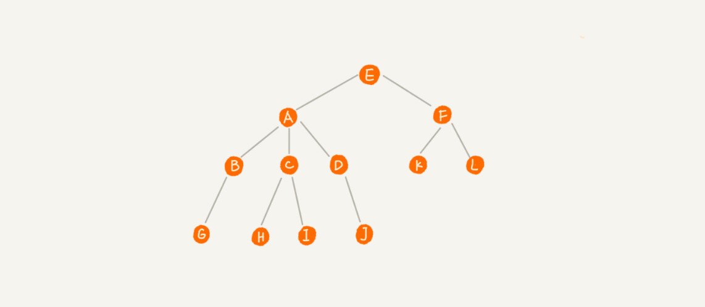

除此之外，关于“树”，还有三个比较相似的概念：高度（Height）、深度（Depth）、层（Level）。它们的定义是这样的：

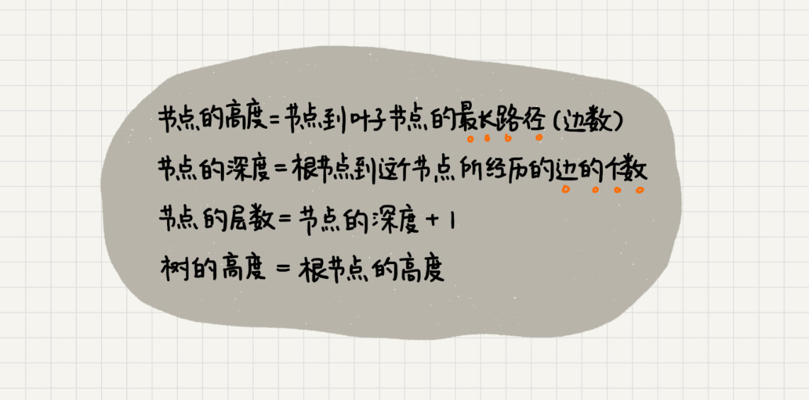

这三个概念的定义比较容易混淆，描述起来也比较空洞。我举个例子说明一下，你一看应该就能明白。

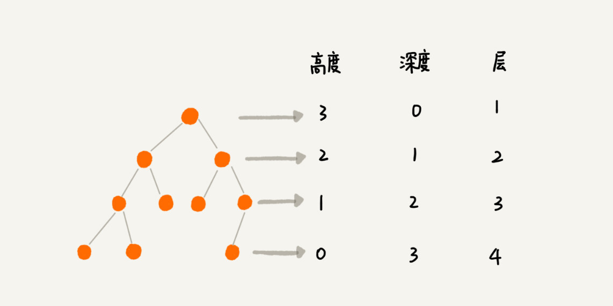

记这几个概念，我还有一个小窍门，就是类比“高度”“深度”“层”这几个名词在生活中的含义。

在我们的生活中，“高度”这个概念，其实就是**从下往上**度量，比如我们要度量第 10 层楼的高度、第 13 层楼的高度，起点都是地面。所以，树这种数据结构的高度也是一样，从最底层开始计数，并且计数的起点是 0。

“深度”这个概念在生活中是**从上往下**度量的，比如水中鱼的深度，是从水平面开始度量的。所以，树这种数据结构的深度也是类似的，从根结点开始度量，并且计数起点也是 0。

“层数”跟深度的计算类似，不过，计数起点是 1，也就是说根节点位于第 1 层。

### 二叉树（Binary Tree）

树结构多种多样，不过我们最常用还是二叉树。

二叉树，顾名思义，每个节点最多有两个“叉”，也就是两个子节点，分别是**左子节点**和**右子节点**。不过，二叉树并不要求每个节点都有两个子节点，有的节点只有左子节点，有的节点只有右子节点。我画的这几个都是二叉树。以此类推，你可以想象一下四叉树、八叉树长什么样子。

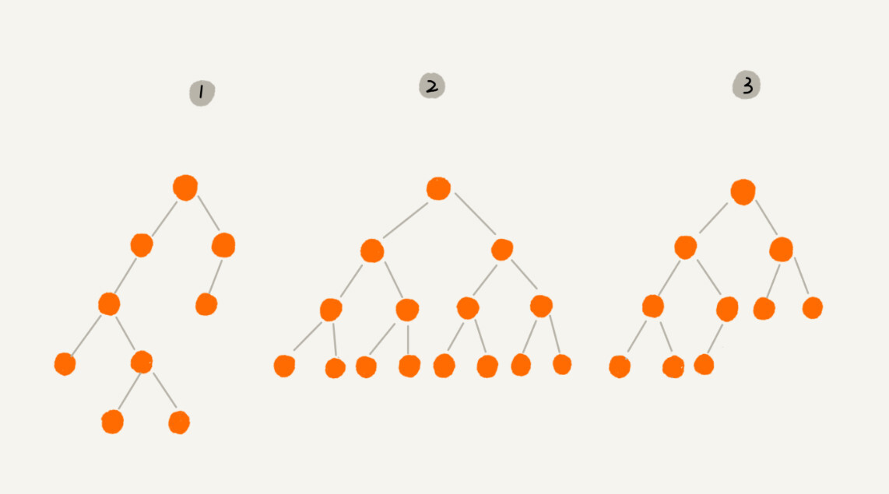

这个图里面，有两个比较特殊的二叉树，分别是编号 2 和编号 3 这两个。

其中，编号 2 的二叉树中，叶子节点全都在最底层，除了叶子节点之外，每个节点都有左右两个子节点，这种二叉树就叫做**满二叉树**。

编号 3 的二叉树中，叶子节点都在最底下两层，最后一层的叶子节点都靠左排列，并且除了最后一层，其他层的节点个数都要达到最大，这种二叉树叫做**完全二叉树**。

满二叉树很好理解，也很好识别，但是完全二叉树，有的人可能就分不清了。我画了几个完全二叉树和非完全二叉树的例子，你可以对比着看看。

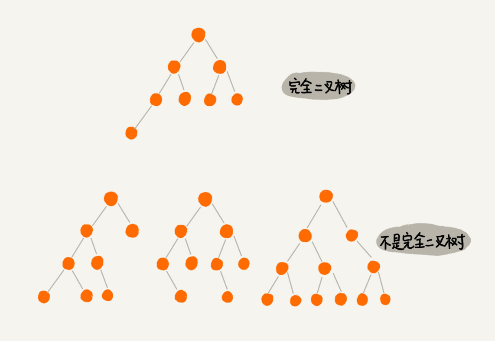

你可能会说，满二叉树的特征非常明显，我们把它单独拎出来讲，这个可以理解。但是完全二叉树的特征不怎么明显啊，单从长相上来看，完全二叉树并没有特别特殊的地方啊，更像是“芸芸众树”中的一种。

那我们为什么还要特意把它拎出来讲呢？为什么偏偏把最后一层的叶子节点靠左排列的叫完全二叉树？如果靠右排列就不能叫完全二叉树了吗？这个定义的由来或者说目的在哪里？

要理解完全二叉树定义的由来，我们需要先了解，**如何表示（或者存储）一棵二叉树**？

想要存储一棵二叉树，我们有两种方法：

- 一种是基于指针或者引用的二叉链式存储法；
- 一种是基于数组的顺序存储法。

我们先来看比较简单、直观的链式存储法。从图中你应该可以很清楚地看到，每个节点有三个字段，其中一个存储数据，另外两个是指向左右子节点的指针。我们只要拎住根节点，就可以通过左右子节点的指针，把整棵树都串起来。这种存储方式我们比较常用。大部分二叉树代码都是通过这种结构来实现的。

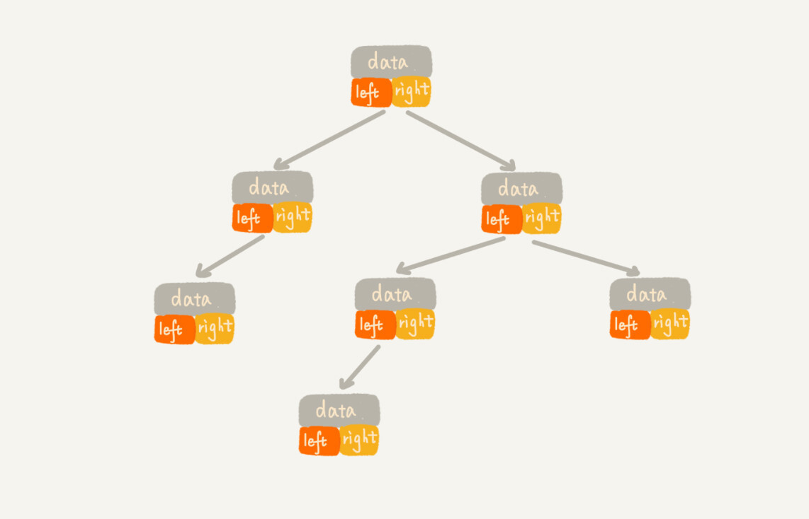

我们再来看，基于数组的**顺序存储法**。我们把根节点存储在下标 i = 1 的位置，那左子节点存储在下标 2 * i = 2 的位置，右子节点存储在 2 * i + 1 = 3 的位置。以此类推，B 节点的左子节点存储在 2 * i = 2 * 2 = 4 的位置，右子节点存储在 2 * i + 1 = 2 * 2 + 1 = 5 的位置。

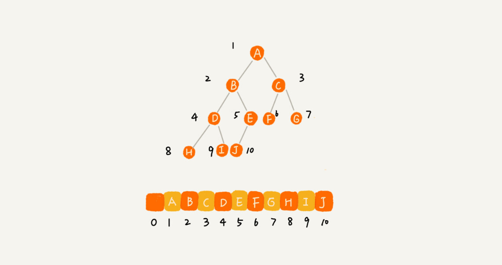

我来总结一下，如果节点 X 存储在数组中下标为 i 的位置，下标为 2 * i 的位置存储的就是左子节点，下标为 2 * i + 1 的位置存储的就是右子节点。反过来，下标为 i/2 的位置存储就是它的父节点。通过这种方式，我们只要知道根节点存储的位置（一般情况下，为了方便计算子节点，根节点会存储在下标为 1 的位置），这样就可以通过下标计算，把整棵树都串起来。

不过，我刚刚举的例子是一棵完全二叉树，所以仅仅“浪费”了一个下标为 0 的存储位置。如果是非完全二叉树，其实会浪费比较多的数组存储空间。你可以看我举的下面这个例子。

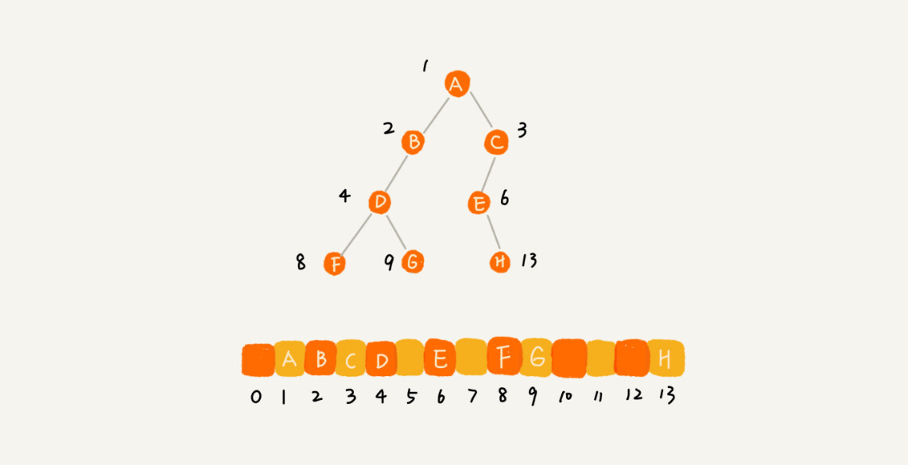

所以，如果某棵二叉树是一棵完全二叉树，那用数组存储无疑是最节省内存的一种方式。因为数组的存储方式并不需要像链式存储法那样，要存储额外的左右子节点的指针。这也是为什么完全二叉树会单独拎出来的原因，也是为什么完全二叉树要求最后一层的子节点都靠左的原因。

当我们讲到堆和堆排序的时候，你会发现，堆其实就是一种完全二叉树，最常用的存储方式就是数组。

### 二叉树的遍历

前面我讲了二叉树的基本定义和存储方法，现在我们来看二叉树中非常重要的操作，二叉树的遍历。这也是非常常见的面试题。

如何将所有节点都遍历打印出来呢？经典的方法有三种，**前序遍历（先根遍历）**、**中序遍历（中根遍历）**和**后序遍历（后根遍历）**。其中，前、中、后序，表示的是节点与它的左右子树节点遍历打印的先后顺序。

- 前序遍历是指，对于树中的任意节点来说，先打印这个节点，然后再打印它的左子树，最后打印它的右子树。
- 中序遍历是指，对于树中的任意节点来说，先打印它的左子树，然后再打印它本身，最后打印它的右子树。
- 后序遍历是指，对于树中的任意节点来说，先打印它的左子树，然后再打印它的右子树，最后打印这个节点本身。

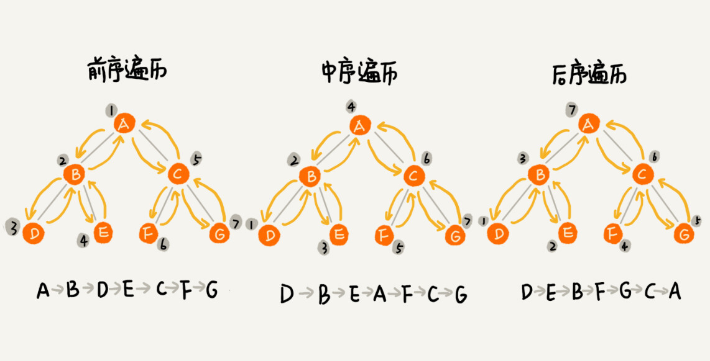

实际上，二叉树的前、中、后序遍历就是一个递归的过程。比如，前序遍历，其实就是先打印根节点，然后再递归地打印左子树，最后递归地打印右子树。

写递归代码的关键，就是看能不能写出递推公式，而写递推公式的关键就是，如果要解决问题 A，就假设子问题 B、C 已经解决，然后再来看如何利用 B、C 来解决 A。所以，我们可以把前、中、后序遍历的递推公式都写出来。

```c
// 前序遍历的递推公式：
preOrder(r) = print r->preOrder(r->left)->preOrder(r->right)
// 中序遍历的递推公式：
inOrder(r) = inOrder(r->left)->print r->inOrder(r->right)
// 后序遍历的递推公式：
postOrder(r) = postOrder(r->left)->postOrder(r->right)->print r
```

有了递推公式，代码写起来就简单多了。这三种遍历方式的代码，我都写出来了，你可以看看。

```c
void preOrder(Node* root) {
  if (root == null) return;
  print root // 此处为伪代码，表示打印root节点
  preOrder(root->left);
  preOrder(root->right);
}

void inOrder(Node* root) {
  if (root == null) return;
  inOrder(root->left);
  print root // 此处为伪代码，表示打印root节点
  inOrder(root->right);
}

void postOrder(Node* root) {
  if (root == null) return;
  postOrder(root->left);
  postOrder(root->right);
  print root // 此处为伪代码，表示打印root节点
}
```

二叉树的前、中、后序遍历的递归实现是不是很简单？你知道**二叉树遍历的时间复杂度是多少**吗？我们一起来看看。

从我前面画的前、中、后序遍历的顺序图，可以看出来，每个节点最多会被访问两次，所以遍历操作的时间复杂度，跟节点的个数 n 成正比，也就是说二叉树遍历的时间复杂度是 O(n)。

### 解答开篇 & 内容小结

今天，我讲了一种非线性表数据结构，树。关于树，有几个比较常用的概念你需要掌握，那就是：根节点、叶子节点、父节点、子节点、兄弟节点，还有节点的高度、深度、层数，以及树的高度。

我们平时最常用的树就是二叉树。二叉树的每个节点最多有两个子节点，分别是左子节点和右子节点。二叉树中，有两种比较特殊的树，分别是满二叉树和完全二叉树。满二叉树又是完全二叉树的一种特殊情况。

二叉树既可以用链式存储，也可以用数组顺序存储。数组顺序存储的方式比较适合完全二叉树，其他类型的二叉树用数组存储会比较浪费存储空间。除此之外，二叉树里非常重要的操作就是前、中、后序遍历操作，遍历的时间复杂度是 O(n)，你需要理解并能用递归代码来实现。

## 24 | 二叉树基础（下）：有了如此高效的散列表，为什么还需要二叉树？

上一节我们学习了树、二叉树以及二叉树的遍历，今天我们再来学习一种特殊的二叉树，二叉查找树。二叉查找树最大的特点就是，支持动态数据集合的快速插入、删除、查找操作。

我们之前说过，散列表也是支持这些操作的，并且散列表的这些操作比二叉查找树更高效，时间复杂度是 O(1)。**既然有了这么高效的散列表，使用二叉树的地方是不是都可以替换成散列表呢？有没有哪些地方是散列表做不了，必须要用二叉树来做的呢**？

带着这些问题，我们就来学习今天的内容，二叉查找树！

### 二叉查找树（Binary Search Tree）

二叉查找树是二叉树中最常用的一种类型，也叫二叉搜索树。顾名思义，二叉查找树是为了实现快速查找而生的。不过，它不仅仅支持快速查找一个数据，还支持快速插入、删除一个数据。它是怎么做到这些的呢？

这些都依赖于二叉查找树的特殊结构。**二叉查找树要求，在树中的任意一个节点，其左子树中的每个节点的值，都要小于这个节点的值，而右子树节点的值都大于这个节点的值**。 我画了几个二叉查找树的例子，你一看应该就清楚了。

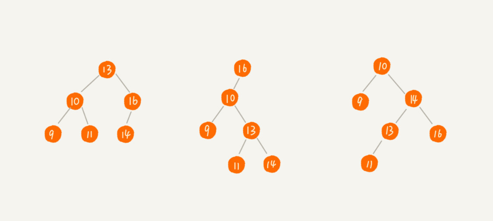

前面我们讲到，二叉查找树支持快速查找、插入、删除操作，现在我们就依次来看下，这三个操作是如何实现的。

#### 1. 二叉查找树的查找操作

首先，我们看如何在二叉查找树中查找一个节点。我们先取根节点，如果它等于我们要查找的数据，那就返回。如果要查找的数据比根节点的值小，那就在左子树中递归查找；如果要查找的数据比根节点的值大，那就在右子树中递归查找。

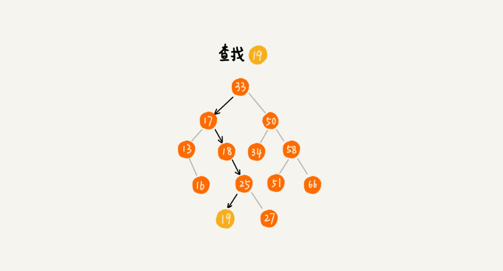

这里我把查找的代码实现了一下，贴在下面了，结合代码，理解起来会更加容易。

```java
public class BinarySearchTree {
  private Node tree;

  public Node find(int data) {
    Node p = tree;
    while (p != null) {
      if (data < p.data) p = p.left;
      else if (data > p.data) p = p.right;
      else return p;
    }
    return null;
  }

  public static class Node {
    private int data;
    private Node left;
    private Node right;

    public Node(int data) {
      this.data = data;
    }
  }
}
```

#### 2. 二叉查找树的插入操作

二叉查找树的插入过程有点类似查找操作。新插入的数据一般都是在叶子节点上，所以我们只需要从根节点开始，依次比较要插入的数据和节点的大小关系。

如果要插入的数据比节点的数据大，并且节点的右子树为空，就将新数据直接插到右子节点的位置；如果不为空，就再递归遍历右子树，查找插入位置。同理，如果要插入的数据比节点数值小，并且节点的左子树为空，就将新数据插入到左子节点的位置；如果不为空，就再递归遍历左子树，查找插入位置。

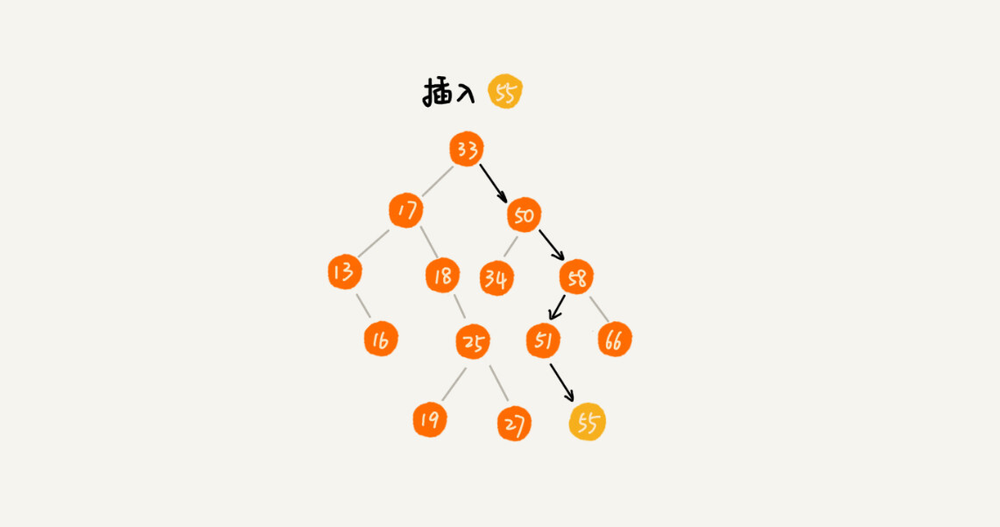

同样，插入的代码我也实现了一下，贴在下面，你可以看看。

```java
public void insert(int data) {
  if (tree == null) {
    tree = new Node(data);
    return;
  }

  Node p = tree;
  while (p != null) {
    if (data > p.data) {
      if (p.right == null) {
        p.right = new Node(data);
        return;
      }
      p = p.right;
    } else { // data < p.data
      if (p.left == null) {
        p.left = new Node(data);
        return;
      }
      p = p.left;
    }
  }
}
```

#### 3. 二叉查找树的删除操作

二叉查找树的查找、插入操作都比较简单易懂，但是它的删除操作就比较复杂了 。针对要删除节点的子节点个数的不同，我们需要分三种情况来处理。

第一种情况是，如果要删除的节点没有子节点，我们只需要直接将父节点中，指向要删除节点的指针置为 null。比如图中的删除节点 55。

第二种情况是，如果要删除的节点只有一个子节点（只有左子节点或者右子节点），我们只需要更新父节点中，指向要删除节点的指针，让它指向要删除节点的子节点就可以了。比如图中的删除节点 13。

第三种情况是，如果要删除的节点有两个子节点，这就比较复杂了。我们需要找到这个节点的右子树中的最小节点，把它替换到要删除的节点上。然后再删除掉这个最小节点，因为最小节点肯定没有左子节点（如果有左子结点，那就不是最小节点了），所以，我们可以应用上面两条规则来删除这个最小节点。比如图中的删除节点 18。

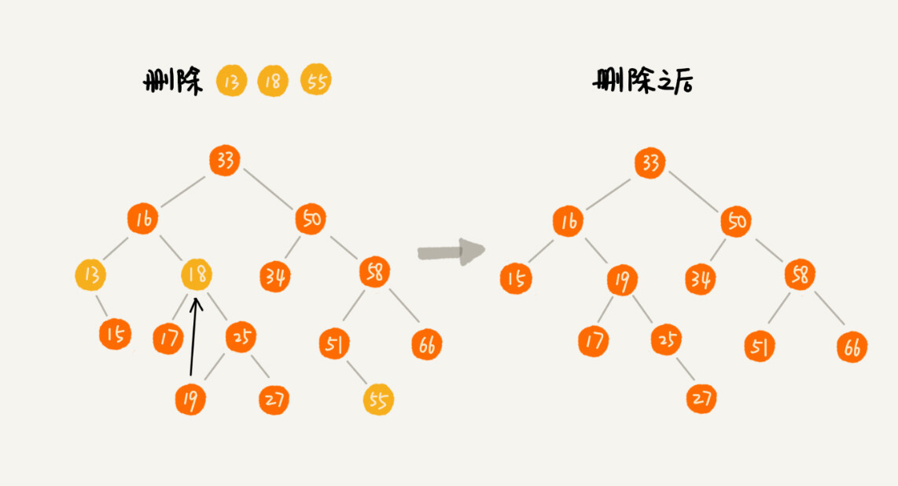

老规矩，我还是把删除的代码贴在这里。

```java
public void delete(int data) {
  Node p = tree; // p指向要删除的节点，初始化指向根节点
  Node pp = null; // pp记录的是p的父节点
  while (p != null && p.data != data) {
    pp = p;
    if (data > p.data) p = p.right;
    else p = p.left;
  }
  if (p == null) return; // 没有找到

  // 要删除的节点有两个子节点
  if (p.left != null && p.right != null) { // 查找右子树中最小节点
    Node minP = p.right;
    Node minPP = p; // minPP表示minP的父节点
    while (minP.left != null) {
      minPP = minP;
      minP = minP.left;
    }
    p.data = minP.data; // 将minP的数据替换到p中
    p = minP; // 下面就变成了删除minP了
    pp = minPP;
  }

  // 删除节点是叶子节点或者仅有一个子节点
  Node child; // p的子节点
  if (p.left != null) child = p.left;
  else if (p.right != null) child = p.right;
  else child = null;

  if (pp == null) tree = child; // 删除的是根节点
  else if (pp.left == p) pp.left = child;
  else pp.right = child;
}
```

实际上，关于二叉查找树的删除操作，还有个非常简单、取巧的方法，就是单纯将要删除的节点标记为“已删除”，但是并不真正从树中将这个节点去掉。这样原本删除的节点还需要存储在内存中，比较浪费内存空间，但是删除操作就变得简单了很多。而且，这种处理方法也并没有增加插入、查找操作代码实现的难度。

#### 4. 二叉查找树的其他操作

除了插入、删除、查找操作之外，二叉查找树中还可以支持**快速地查找最大节点和最小节点、前驱节点和后继节点**。这些操作我就不一一展示了。我会将相应的代码放到 GitHub 上，你可以自己先实现一下，然后再去上面看。

二叉查找树除了支持上面几个操作之外，还有一个重要的特性，就是**中序遍历二叉查找树，可以输出有序的数据序列，时间复杂度是 O(n)，非常高效**。因此，二叉查找树也叫作二叉排序树。

### 支持重复数据的二叉查找树

前面讲二叉查找树的时候，我们默认树中节点存储的都是数字。很多时候，在实际的软件开发中，我们在二叉查找树中存储的，是一个包含很多字段的对象。我们利用对象的某个字段作为键值（key）来构建二叉查找树。我们把对象中的其他字段叫作卫星数据。

前面我们讲的二叉查找树的操作，针对的都是不存在键值相同的情况。那如果存储的两个对象键值相同，这种情况该怎么处理呢？我这里有两种解决方法。

第一种方法比较容易。二叉查找树中每一个节点不仅会存储一个数据，因此我们通过链表和支持动态扩容的数组等数据结构，把值相同的数据都存储在同一个节点上。

第二种方法比较不好理解，不过更加优雅。

每个节点仍然只存储一个数据。在查找插入位置的过程中，如果碰到一个节点的值，与要插入数据的值相同，我们就将这个要插入的数据放到这个节点的右子树，也就是说，把这个新插入的数据当作大于这个节点的值来处理。


当要查找数据的时候，遇到值相同的节点，我们并不停止查找操作，而是继续在右子树中查找，直到遇到叶子节点，才停止。这样就可以把键值等于要查找值的所有节点都找出来。

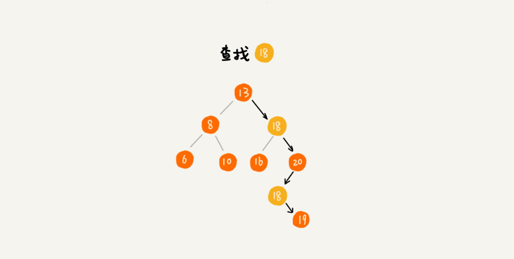

对于删除操作，我们也需要先查找到每个要删除的节点，然后再按前面讲的删除操作的方法，依次删除。

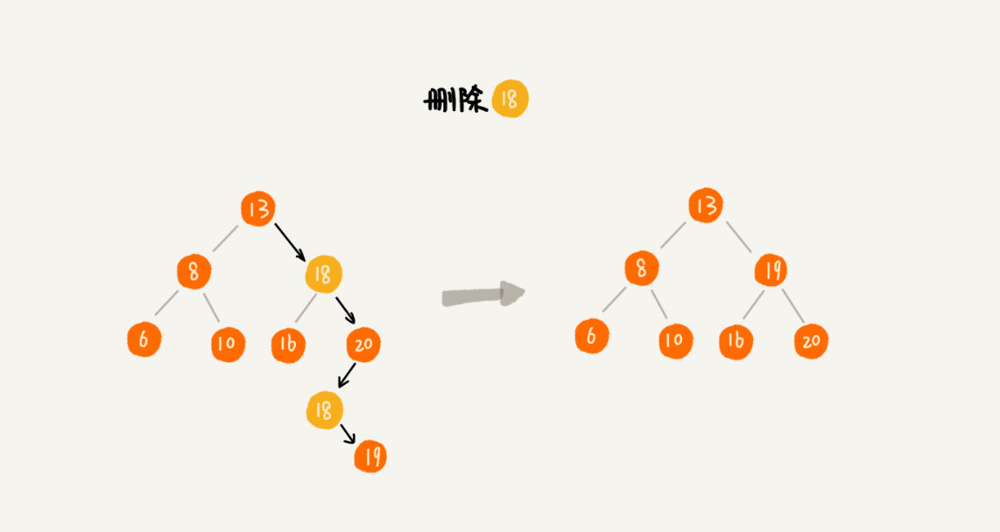

### 二叉查找树的时间复杂度分析

好了，对于二叉查找树常用操作的实现方式，你应该掌握得差不多了。现在，我们来分析一下，二叉查找树的插入、删除、查找操作的时间复杂度。

实际上，二叉查找树的形态各式各样。比如这个图中，对于同一组数据，我们构造了三种二叉查找树。它们的查找、插入、删除操作的执行效率都是不一样的。图中第一种二叉查找树，根节点的左右子树极度不平衡，已经退化成了链表，所以查找的时间复杂度就变成了 O(n)。

我刚刚其实分析了一种最糟糕的情况，我们现在来分析一个最理想的情况，二叉查找树是一棵完全二叉树（或满二叉树）。这个时候，插入、删除、查找的时间复杂度是多少呢？

从我前面的例子、图，以及还有代码来看，不管操作是插入、删除还是查找，**时间复杂度其实都跟树的高度成正比，也就是 O(height)**。既然这样，现在问题就转变成另外一个了，也就是，如何求一棵包含 n 个节点的完全二叉树的高度？

树的高度就等于最大层数减一，为了方便计算，我们转换成层来表示。从图中可以看出，包含 n 个节点的完全二叉树中，第一层包含 1 个节点，第二层包含 2 个节点，第三层包含 4 个节点，依次类推，下面一层节点个数是上一层的 2 倍，第 K 层包含的节点个数就是 $2^{(K-1)}$​。

不过，对于完全二叉树来说，最后一层的节点个数有点儿不遵守上面的规律了。它包含的节点个数在 1 个到 $2^{(L-1)}$ 个之间（我们假设最大层数是 L）。如果我们把每一层的节点个数加起来就是总的节点个数 n。也就是说，如果节点的个数是 n，那么 n 满足这样一个关系：
$$
\begin{align}
& n >= 1+2+4+8+...+2^{(L-2)}+1 \\
& n <= 1+2+4+8+...+2^{(L-2)}+2^{(L-1)}
\end{align}
$$
借助等比数列的求和公式，我们可以计算出，L 的范围是[$log_2(n+1)$​, $log_2n+1$​]。完全二叉树的层数小于等于 $log_2n+1$​，也就是说，完全二叉树的高度小于等于 $log_2n$​。

显然，极度不平衡的二叉查找树，它的查找性能肯定不能满足我们的需求。我们需要构建一种不管怎么删除、插入数据，在任何时候，都能保持任意节点左右子树都比较平衡的二叉查找树，这就是我们下一节课要详细讲的，一种特殊的二叉查找树，平衡二叉查找树。平衡二叉查找树的高度接近 logn，所以插入、删除、查找操作的时间复杂度也比较稳定，是 O(logn)。

### 解答开篇

我们在散列表那节中讲过，散列表的插入、删除、查找操作的时间复杂度可以做到常量级的 O(1)，非常高效。而二叉查找树在比较平衡的情况下，插入、删除、查找操作时间复杂度才是 O(logn)，相对散列表，好像并没有什么优势，那我们为什么还要用二叉查找树呢？

我认为有下面几个原因：

1. 第一，散列表中的数据是无序存储的，如果要输出有序的数据，需要先进行排序。而对于二叉查找树来说，我们只需要中序遍历，就可以在 O(n) 的时间复杂度内，输出有序的数据序列。
2. 第二，散列表扩容耗时很多，而且当遇到散列冲突时，性能不稳定，尽管二叉查找树的性能不稳定，但是在工程中，我们最常用的平衡二叉查找树的性能非常稳定，时间复杂度稳定在 O(logn)。
3. 第三，笼统地来说，尽管散列表的查找等操作的时间复杂度是常量级的，但因为哈希冲突的存在，这个常量不一定比 logn 小，所以实际的查找速度可能不一定比 O(logn) 快。加上哈希函数的耗时，也不一定就比平衡二叉查找树的效率高。
4. 第四，散列表的构造比二叉查找树要复杂，需要考虑的东西很多。比如散列函数的设计、冲突解决办法、扩容、缩容等。平衡二叉查找树只需要考虑平衡性这一个问题，而且这个问题的解决方案比较成熟、固定。
5. 最后，为了避免过多的散列冲突，散列表装载因子不能太大，特别是基于开放寻址法解决冲突的散列表，不然会浪费一定的存储空间。

综合这几点，平衡二叉查找树在某些方面还是优于散列表的，所以，这两者的存在并不冲突。我们在实际的开发过程中，需要结合具体的需求来选择使用哪一个。

### 内容小结

今天我们学习了一种特殊的二叉树，二叉查找树。它支持快速地查找、插入、删除操作。

二叉查找树中，每个节点的值都大于左子树节点的值，小于右子树节点的值。不过，这只是针对没有重复数据的情况。对于存在重复数据的二叉查找树，我介绍了两种构建方法：

- 一种是让每个节点存储多个值相同的数据；
- 另一种是，每个节点中存储一个数据。针对这种情况，我们只需要稍加改造原来的插入、删除、查找操作即可。

在二叉查找树中，查找、插入、删除等很多操作的时间复杂度都跟树的高度成正比。两个极端情况的时间复杂度分别是 O(n) 和 O(logn)，分别对应二叉树退化成链表的情况和完全二叉树。

为了避免时间复杂度的退化，针对二叉查找树，我们又设计了一种更加复杂的树，平衡二叉查找树，时间复杂度可以做到稳定的 O(logn)，下一节我们具体来讲。

## 25 | 红黑树（上）：为什么工程中都用红黑树这种二叉树？

上两节，我们依次讲了树、二叉树、二叉查找树。二叉查找树是最常用的一种二叉树，它支持快速插入、删除、查找操作，各个操作的时间复杂度跟树的高度成正比，理想情况下，时间复杂度是 O(logn)。

不过，二叉查找树在频繁的动态更新过程中，可能会出现树的高度远大于 log2n 的情况，从而导致各个操作的效率下降。极端情况下，二叉树会退化为链表，时间复杂度会退化到 O(n)。我上一节说了，要解决这个复杂度退化的问题，我们需要设计一种平衡二叉查找树，也就是今天要讲的这种数据结构。

很多书籍里，但凡讲到平衡二叉查找树，就会拿红黑树作为例子。不仅如此，如果你有一定的开发经验，你会发现，在工程中，很多用到平衡二叉查找树的地方都会用红黑树。你有没有想过，为什么工程中都喜欢用红黑树，而不是其他平衡二叉查找树呢？

带着这个问题，让我们一起来学习今天的内容吧！

### 什么是“平衡二叉查找树”？

平衡二叉树的严格定义是这样的：二叉树中任意一个节点的左右子树的高度相差不能大于 1。从这个定义来看，上一节我们讲的完全二叉树、满二叉树其实都是平衡二叉树，但是非完全二叉树也有可能是平衡二叉树。

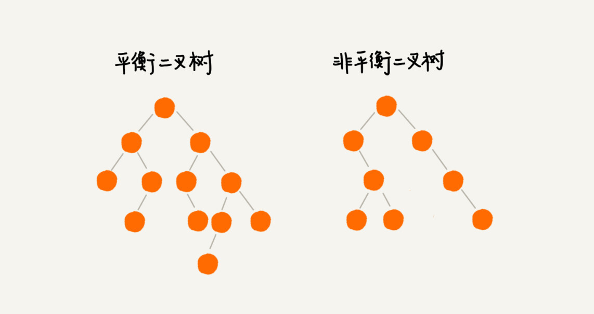

平衡二叉查找树不仅满足上面平衡二叉树的定义，还满足二叉查找树的特点。最先被发明的平衡二叉查找树是AVL 树，它严格符合我刚讲到的平衡二叉查找树的定义，即任何节点的左右子树高度相差不超过 1，是一种高度平衡的二叉查找树。

但是很多平衡二叉查找树其实并没有严格符合上面的定义（树中任意一个节点的左右子树的高度相差不能大于 1），比如我们下面要讲的红黑树，它从根节点到各个叶子节点的最长路径，有可能会比最短路径大一倍。

我们学习数据结构和算法是为了应用到实际的开发中的，所以，我觉得没必去死抠定义。对于平衡二叉查找树这个概念，我觉得我们要从这个数据结构的由来，去理解“平衡”的意思。

发明平衡二叉查找树这类数据结构的初衷是，解决普通二叉查找树在频繁的插入、删除等动态更新的情况下，出现时间复杂度退化的问题。

所以，**平衡二叉查找树中“平衡”的意思，其实就是让整棵树左右看起来比较“对称”、比较“平衡”，不要出现左子树很高、右子树很矮的情况。这样就能让整棵树的高度相对来说低一些，相应的插入、删除、查找等操作的效率高一些**。

所以，如果我们现在设计一个新的平衡二叉查找树，只要树的高度不比 log2n 大很多（比如树的高度仍然是对数量级的），尽管它不符合我们前面讲的严格的平衡二叉查找树的定义，但我们仍然可以说，这是一个合格的平衡二叉查找树。

### 如何定义一棵“红黑树”？

平衡二叉查找树其实有很多，比如，Splay Tree（伸展树）、Treap（树堆）等，但是我们提到平衡二叉查找树，听到的基本都是红黑树。它的出镜率甚至要高于“平衡二叉查找树”这几个字，有时候，我们甚至默认平衡二叉查找树就是红黑树，那我们现在就来看看这个“明星树”。

红黑树的英文是“Red-Black Tree”，简称 R-B Tree。它是一种不严格的平衡二叉查找树，我前面说了，它的定义是不严格符合平衡二叉查找树的定义的。那红黑树究竟是怎么定义的呢？

顾名思义，红黑树中的节点，一类被标记为黑色，一类被标记为红色。除此之外，一棵红黑树还需要满足这样几个要求：

- 根节点是黑色的；
- 每个叶子节点都是黑色的空节点（NIL），也就是说，叶子节点不存储数据；
- 任何相邻的节点都不能同时为红色，也就是说，红色节点是被黑色节点隔开的；
- 每个节点，从该节点到达其可达叶子节点的所有路径，都包含相同数目的黑色节点；

这里的第二点要求“叶子节点都是黑色的空节点”，稍微有些奇怪，它主要是为了简化红黑树的代码实现而设置的，下一节我们讲红黑树的实现的时候会讲到。**这节我们暂时不考虑这一点，所以，在画图和讲解的时候，我将黑色的、空的叶子节点都省略掉了**。

为了让你更好地理解上面的定义，我画了两个红黑树的图例，你可以对照着看下。

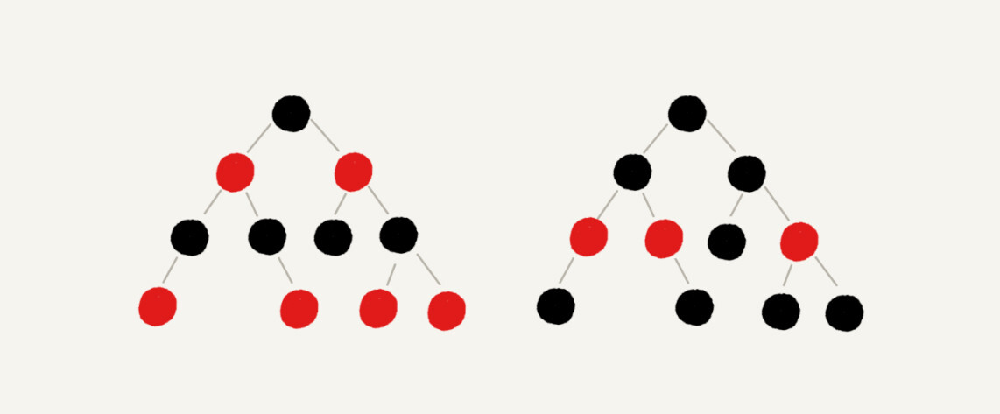

### 为什么说红黑树是“近似平衡”的？

我们前面也讲到，平衡二叉查找树的初衷，是为了解决二叉查找树因为动态更新导致的性能退化问题。所以，**“平衡”的意思可以等价为性能不退化。“近似平衡”就等价为性能不会退化得太严重**。

我们在上一节讲过，二叉查找树很多操作的性能都跟树的高度成正比。一棵极其平衡的二叉树（满二叉树或完全二叉树）的高度大约是 $log_2n$​，所以如果要证明红黑树是近似平衡的，我们只需要分析，红黑树的高度是否比较稳定地趋近 $log_2n$ 就好了。

红黑树的高度不是很好分析，我带你一步一步来推导。

**首先，我们来看，如果我们将红色节点从红黑树中去掉，那单纯包含黑色节点的红黑树的高度是多少呢？**

红色节点删除之后，有些节点就没有父节点了，它们会直接拿这些节点的祖父节点（父节点的父节点）作为父节点。所以，之前的二叉树就变成了四叉树。

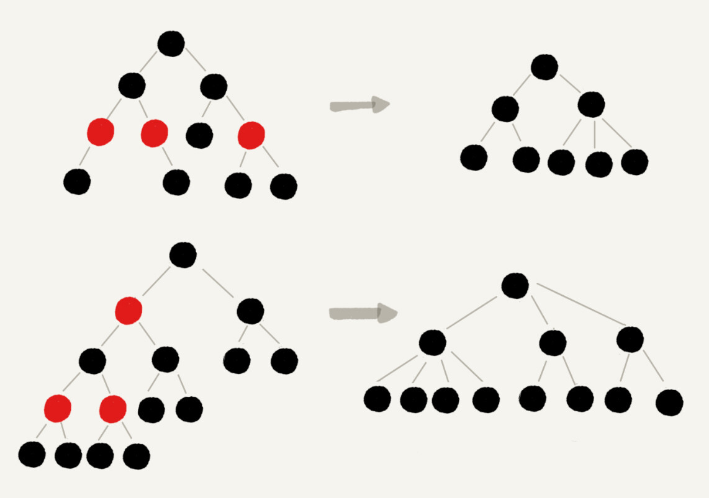

前面红黑树的定义里有这么一条：从任意节点到可达的叶子节点的每个路径包含相同数目的黑色节点。我们从四叉树中取出某些节点，放到叶节点位置，四叉树就变成了完全二叉树。所以，仅包含黑色节点的四叉树的高度，比包含相同节点个数的完全二叉树的高度还要小。

上一节我们说，完全二叉树的高度近似 $log_2n$，这里的四叉“黑树”的高度要低于完全二叉树，所以去掉红色节点的“黑树”的高度也不会超过 $log_2n$。

**我们现在知道只包含黑色节点的“黑树”的高度，那我们现在把红色节点加回去，高度会变成多少呢？**

从上面我画的红黑树的例子和定义看，在红黑树中，红色节点不能相邻，也就是说，有一个红色节点就要至少有一个黑色节点，将它跟其他红色节点隔开。红黑树中包含最多黑色节点的路径不会超过 $log_2n$，所以加入红色节点之后，最长路径不会超过 $2log_2n$，也就是说，红黑树的高度近似 $2log_2n$。

所以，红黑树的高度只比高度平衡的 AVL 树的高度（$log_2n$）仅仅大了一倍，在性能上，下降得并不多。这样推导出来的结果不够精确，实际上红黑树的性能更好。

### 解答开篇

我们刚刚提到了很多平衡二叉查找树，现在我们就来看下，为什么在工程中大家都喜欢用红黑树这种平衡二叉查找树？

我们前面提到 Treap、Splay Tree，绝大部分情况下，它们操作的效率都很高，但是也无法避免极端情况下时间复杂度的退化。尽管这种情况出现的概率不大，但是对于单次操作时间非常敏感的场景来说，它们并不适用。

AVL 树是一种高度平衡的二叉树，所以查找的效率非常高，但是，有利就有弊，AVL 树为了维持这种高度的平衡，就要付出更多的代价。每次插入、删除都要做调整，就比较复杂、耗时。所以，对于有频繁的插入、删除操作的数据集合，使用 AVL 树的代价就有点高了。

红黑树只是做到了近似平衡，并不是严格的平衡，所以在维护平衡的成本上，要比 AVL 树要低。

所以，红黑树的插入、删除、查找各种操作性能都比较稳定。对于工程应用来说，要面对各种异常情况，为了支撑这种工业级的应用，我们更倾向于这种性能稳定的平衡二叉查找树。

### 内容小结

很多同学都觉得红黑树很难，的确，它算是最难掌握的一种数据结构。其实红黑树最难的地方是它的实现，我们今天还没有涉及，下一节我会专门来讲。

不过呢，我认为，我们其实不应该把学习的侧重点，放到它的实现上。那你可能要问了，关于红黑树，我们究竟需要掌握哪些东西呢？

还记得我多次说过的观点吗？**我们学习数据结构和算法，要学习它的由来、特性、适用的场景以及它能解决的问题。对于红黑树，也不例外。你如果能搞懂这几个问题，其实就已经足够了**。

红黑树是一种平衡二叉查找树。它是为了解决普通二叉查找树在数据更新的过程中，复杂度退化的问题而产生的。红黑树的高度近似 $log_2n$​，所以它是近似平衡，插入、删除、查找操作的时间复杂度都是 $O(logn)$。

因为红黑树是一种性能非常稳定的二叉查找树，所以，在工程中，但凡是用到动态插入、删除、查找数据的场景，都可以用到它。不过，它实现起来比较复杂，如果自己写代码实现，难度会有些高，这个时候，我们其实更倾向用跳表来替代它。

