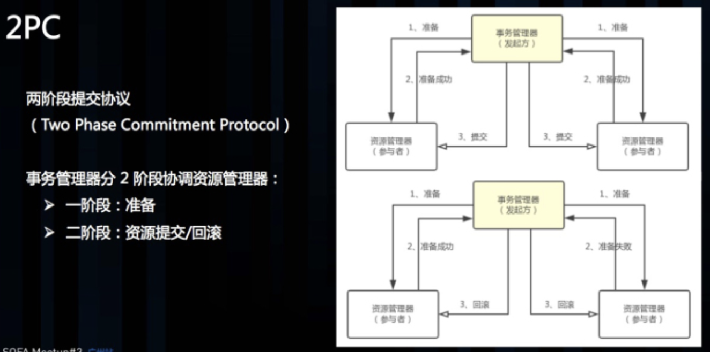

# 引论

根据分布式领域**CAP理论**可知，任何一个分布式系统都无法同时满足Consistency(一致性),Availability(可用性), Partition tolerance(分区容错性) 这三个基本需求。最多只能满足其中两项。

但是，一个分布式系统无论在CAP三者之间如何权衡，都无法彻底放弃一致性（Consistency）。如果真的放弃一致性，那么就说明这个系统中的数据**正确性**无法保证，那这个数据系统根本不可信，数据没有意义，这个系统也没有任何价值。所以，无论如何，分布式系统的一致性问题都需要重点关注。

# 数据一致性

## 概念

通常情况下，我们所说的分布式一致性问题通常指的是**数据**一致性问题。数据一致性是个**逻辑概念**，来源于关系数据库理论，可以简单的理解为**一致性=正确性+完整性**，即对数据操作前后的值**和我们的认知逻辑一致**。比如：

- 单机数据库。对数据进行写操作之后，新值必须符合目标值。比如做了一个操作（年龄10加上8），正确性：新值必须是18，不能还是10，或者其他值。这在逻辑上是和我们的认知是一致的。

- 数据副本模型。逻辑上需要既然是副本，那么每个副本的数据应该是相同的（比如MySQL主从模型）。

- 跨库操作。转账案例，完整性：不能A扣钱了，B没收到，那不合符转账操作的逻辑；正确性：A扣钱B收到了，但是还要求A扣的金额=B收到的金额，一个转多少，另一个就应该收多少，否则也不符合转账的逻辑含义。

## 分类

不同的观察角度，对一致性概念有着不同的细致分类。AWS CTO Werner Vogels 从**客户端和服务端角度**来叙述数据一致性的概念。

- 客户端：并发访问时更新过的数据如何获取。
- 服务端：更新如何复制分布到整个系统，以保证数据最终一致。

### 客户端角度

从客户端角度观察，数据系统的一致性可分为3种：

- Strong强一致性：数据更新完成后，任何后续访问将会返回最新的数据。
- Weak弱一致性：系统不保证数据更新后的访问会得到最新的数据。客户端获取最新的数据之前需要满足一些特殊条件。此时，从更新到保证任何观察者都能获取到最新。
- Eventually 最终一致性：写入数据后，无法立即读出最新数据，但经过一段时间之后保证最终能读出来。

### 服务端角度

从服务端角度，如何尽快将更新后的数据分布到整个系统，降低达到最终一致性的时间窗口，是提高系统的可用度和用户体验非常重要的方面。对于分布式数据系统：

- N — 数据复制的份数
- W — 更新数据时需保证写完成的节点数
- R — 读取数据时需读取的节点数

如果W+R>N，写的节点和读的节点重叠，则是强一致性。例如对于典型的一主一备同步复制的关系型数据库，N=2,W=2,R=1，则不管读的是主库还是备库的数据，都是一致的。

如果W+R<=N，则是弱一致性。例如对于一主一备异步复制的关系型数据库，N=2,W=1,R=1，则如果读的是备库，就可能无法读取主库已经更新过的数据，所以是弱一致性。

对于分布式系统，为了保证高可用性，一般设置N>=3。不同的N,W,R组合，是在可用性和一致性之间取一个平衡，以适应不同的应用场景。

- 如果N=W,R=1，任何一个写节点失效，都会导致写失败，因此可用性会降低，但是由于数据分布的N个节点是同步写入的，因此可以保证强一致性。
- 如果N=R,W=1，只需要一个节点写入成功即可，写性能和可用性都比较高。但是读取其他节点的进程可能不能获取更新后的数据，因此是弱一致性。这种情况下，如果W<(N+1)/2，并且写入的节点不重叠的话，则会存在写冲突  

# 为什么会有一致性问题？

首先从单机数据系统说起，单机系统是数据库来帮我们解决一致性问题。但是单机系统会有一些问题。

## 单机系统的问题

- 高可用：单机数据系统因为只有一个节点，一旦出现故障，就无法对外提供服务，没有可用性，甚至数据丢失。
- 高性能：单机数据系统硬件性能有上限，比如对数据库影响很大的磁盘IOPS。

## 单点问题解决方案

为了解决单机数据系统的这些问题，我们想出的方案是，既然单机不行，那就**加机器**。但是加入机器后怎么分配这些机器的工作？ 通常，我们会通过2种手段来分配机器的工作：

- 数据分区（每个机器负担一部分数据）：把原来存放在一台机器上（单体应用中的一个库）的数据，拆分开来放到不同的机器上（不同的库）。比如：对于不同的表可以按业务拆分到不同的库（其实就是分布式微服务），对于同一张表，可以水平分片（其实就是分库分表，比如：uid%16，商品ID按地区，一致性哈希等）。
  - 优点：每台机器只处理自己那一份数据相关的请求，高性能；少数节点出故障只会影响部分数据，半高可用。
  - 缺点：无法解决数据丢失问题，某些节点一旦出现严重故障导致数据丢失，导致部分数据不可用。**数据服务的高可用只能**通过下面的方法——**数据冗余存储**。
- 数据镜像（每个机器负担同样的数据）：把原来单机存储的数据复制多份，提供一样的功能，请求根据负载均衡策略分散到不同的副本（比如：MySQL的主从模式，或双主模式）。
  - 优点：负载均衡分摊请求，高性能；单个节点故障，其他节点还能提供相同的服务，高可用。
  - 缺点：如果出现短时间内（时间差 < 副本数据同步周期）多次对同一数据的请求，由于负载均衡，可能修改不同的副本，副本间数据不一致，副本同步时会出现冲突，就像版本控制系统中的冲突一样，解决起来非常麻烦。

## 单点问题解决方案的负面

任何事情都有两面性，加机器带来的负面影响是让数据服务变得复杂，尤其是跨节点的数据一致性，因为这种情况数据库已经帮不了我们了，为了解决这个问题，需要引入分布式事务。

用经典案例分析：“A向B转账”。这个事务需要6个操作：

1. 从A账户读余额。
2. 对A账户做减法操作。
3. 把结果写回A账户。
4. 从B账户读余额。
5. 对B账户做加法操作。
6. 把结果写回B账户。

为了数据的一致性，这6件事，要么都成功做完，要么都不成功。而且这个操作的过程中，对A、B帐号的其它访问必需锁死，所谓锁死就是要排除其它的**读写操作**，不然会有脏数据的问题，这就是事务。那么，我们在加入了更多的机器后，这个事情会变得复杂起来：

- **在数据分区的方案中**：如果A帐号和B帐号的数据不在同一台服务器上怎么办？我们需要一个跨机器的事务处理。也就是说，如果A的扣钱成功了，但B的加钱不成功，我们还要把A的操作给回滚回去。这在跨机器的情况下，就变得比较复杂了。

- **在数据镜像的方案中**：A帐号和B帐号间的汇款是可以在一台机器上完成的，但是别忘了我们有多台机器存在A帐号和B帐号的副本。如果对A帐号的转账有两个并发操作（要汇给B和C），这两个操作发生在不同的两台服务器上怎么办？也就是说，在数据镜像中，在不同的服务器上对同一个数据的写操作怎么保证其一致性，保证数据不冲突？

事务本身会导致**性能问题**，因为事务需要锁定多个资源，在分布式环境中的事务性能更低。

### 总结一下

- 为了解决单点问题，加机器；
- 加机器后，无论是数据分区还是数据镜像，只要涉及到跨机器操作（主要指跨库），就会产生**全局一致性**问题。（比如：原来的单体应用拆分成微服务，原来的用户、商品、订单等模块拆分成独立的应用，每个应用有自己独立的数据库，每个应用内部的**局部一致性**由数据库解决，但是**跨库操作**的**全局一致性**问题只能开发人员自己解决）。
- 为了解决跨库一致性问题，引入了分布式事务。
- 事务又会导致性功能问题，这又违反了我们最初的目标（加机器提升性能）。

这就是软件开发，按下了葫芦起了瓢。没有银弹，只有**取舍**（trade off）。

# 解决一致性问题的理论依据

## Paxos算法

简单说来，Paxos的**目的**是让整个集群的结点对**某个值的变更**达成一致。Paxos算法基本上来说是个**民主选举**的算法——**大多数的决定会成个整个集群的统一决定**。任何一个点都可以提出要修改某个数据的提案，是否通过这个提案取决于这个集群中是否有**超过半数的结点同意**（**所以Paxos算法需要集群中的结点是单数**）。

这个算法有两个阶段（假设这个有三个结点：A，B，C）：

### 第一阶段：Prepare阶段

A把申请修改的请求Prepare Request发给所有的结点A，B，C。注意，Paxos算法会有一个序列号（Sequence Number，你可以认为是一个提案号，即这是第多少次提案，这个数不断递增，而且是唯一的，也就是说A和B不可能有相同的提案号），这个提案号会和修改请求**一同发出**（即每个修改请求都附带一个提案号），任何结点在“Prepare阶段”时都会**拒绝**其值小于**当前提案号**的**请求**。所以，结点A在向所有结点申请修改请求的时候，需要带一个提案号，越新的提案，这个提案号就越是是最大的。

如果接收结点收到的提案号n大于其它结点发过来的提案号，这个结点会回应Yes（本结点上最新的被批准提案号），并保证不接收其它小于n的提案。这样一来，结点上在Prepare阶段里总是会对最新的提案做承诺。

优化：在上述 prepare 过程中，如果任何一个结点发现存在一个更高编号的提案，则需要通知提案人，提醒其**中断**这次提案。

### 第二阶段：Accept阶段

如果提案者A收到了超过半数的结点返回的Yes，然后他就会向所有的结点发布Accept Request（同样需要带上提案号n），如果没有超过半数的话，那就返回失败。

当结点们收到了Accept Request后，如果对于接收的结点来说，n是最大的了，那么，它就会修改这个值，如果发现自己有一个更大的提案号，那么，结点就会拒绝修改。

熟悉两阶段提交的，可能会发现，这似乎就是一个“两段提交”的优化。其实，**2PC/3PC都是分布式一致性算法的残次版本，Google Chubby的作者Mike Burrows说过这个世界上只有一种一致性算法，那就是Paxos，其它的算法都是残次品。**

## 2PC算法

### 介绍

中文叫两阶段提交( Two-phase-Commit )，指在计算机网络以及数据库领域内，为了使基于分布式系统架构下的所有节点在进行事务提交时保持一致性而设计的一种**算法**( Algorithm )。

在分布式系统中，每个节点虽然可以知晓自己的操作时成功或者失败，却无法知道其他节点的操作的成功或失败。当一个事务跨越多个节点时，为了保持事务的ACID特性，需要引入一个**协调者**，来统一管理所有节点(称作**参与者**)的操作结果，并最终指示这些参与者是否要把操作结果进行真正的提交(比如：将更新后的数据写入磁盘等等)。 两阶段提交的算法如下：

### 角色

- 协调者
- 参与者

### 过程

#### 第一阶段：投票

1. 协调者会问所有的参与者结点，是否可以执行提交操作。
2. 各个参与者开始事务执行的准备工作：如：为资源上锁，预留资源，写undo/redo log……
3. 参与者响应协调者，如果事务的准备工作成功，则回应“可以提交”，否则回应“拒绝提交”。

#### 第二阶段：做决定

- 如果所有的参与者都回应“可以提交”，那么，协调者向所有的参与者发送“正式提交”的命令。参与者完成正式提交，并释放所有资源，然后回应“完成”，协调者收集各结点的“完成”回应后结束这个Global Transaction。

- 如果有一个参与者回应“拒绝提交”，那么，协调者向所有的参与者发送“回滚操作”，并释放所有资源，然后回应“回滚完成”，协调者收集各结点的“**回滚**”回应后，取消这个Global Transaction。

### 缺点

- **同步阻塞问题**：执行过程中，所有参与节点都是事务阻塞型的。当参与者占有公共资源时，其他第三方节点访问公共资源不得不处于阻塞状态。这会带来性能问题。
- **单点故障阻塞其他事务**：协调者是中心单点，需要高可用。如果发生故障，参与者完全不知道怎么办，新协调者接管，也是懵逼状态，不知道此条事务的状态。尤其是在第二阶段出现故障，所有参与者收不到(commit/fallback)指令，会进入“不知所措”的状态，这个状态会锁住整个事务。
- **超时**：
  - 第一阶段：参与者**没收到**或**没响应**投票指令。协调者要么当做失败，要么重试。
  - 第二阶段：参与者**没收到**或**没响应**（确认指令：提交/回滚）。协调者要么重试，要么把这个参与者节点剔除。

## 3PC算法

### 介绍

三段提交在[Wikipedia](http://en.wikipedia.org/wiki/Three-phase_commit_protocol)上的描述如下，把二段提交的第一个段拆分成了两段：询问，然后再锁资源。最后真正提交。

三段提交的核心理念是：**在询问的时候并不锁定资源，除非所有人都同意了，才开始锁资源**。

理论上来说，如果第一阶段所有的结点返回成功，那么有理由相信成功提交的概率很大。这样一来，可以降低参与者Cohorts的状态未知的概率。也就是说，一旦参与者收到了PreCommit，意味他知道大家其实都同意修改了。**如果结点处在P状态（PreCommit）的时候发生了Failure/Timeout的问题，三段提交比两段提交的好处是，三段提交可以继续直接把状态变成C状态（Commit），而两段提交则不知所措**。

### 过程

- 事务询问阶段（ can commit 阶段)：协调者向参与者发送 commit 请求，然后等待参与者反应。这个和 2PC 阶段不同的是，此时参与者没有锁定资源，没有写 redo，undo，执行回滚日志。**回滚代价低**。
- 事务准备阶段 （pre commit）：如果参与者都返回ok，那么就发送Prepare消息，参与者本地执行redo和undo日志。否者就向参与者提交终止（abort）事务的请求。如果再发送Prepare消息的时候，等待超时，也会向参与者提交终止事务的请求。
- 执行事务阶段（do commit）：如果所有发送Prepare都返回成功，那么此时变为执行事务阶段，向参与者发送commit事务的消息。否者回滚事务。在此阶段参与者如果在一定时间内没有收到docommit消息，触发超时机制，会自己提交事务。

### 缺点

- 不能解决网络分区的导致的数据不一致的问题：例如 1到5 五个参与者节点，1，2，3 个节点在A机房，4，5 节点在 B 机房。在`pre commit`阶段，1到5 节点都收到 Prepare 消息，但是节点1执行失败。协调者向1到5节点发送回滚事务的消息。但是此时A，B机房的网络分区。1到3 号节点会回滚。但是 4到5 节点由于没收到回滚事务的消息，而提交了事务。待网络分区恢复后，会出现数据不一致的情况。
- 不能解决故障恢复（fail-recover）问题：一旦参与者在超时时间内没有收到协调者的消息，就会自己提交。这样也能避免参与者一直占用共享资源。但是其在网络分区的情况下，不能保证数据的一致性。