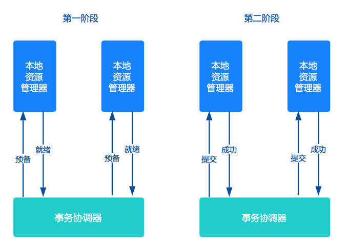

# 目的
当我们的系统开始使用微服务架构时，由于微服务架构要求每个服务都有自己的数据库（Databases per Services pattern），导致我们不能用以前的ACID事务来对2个微服务的不同数据库进行事务管理，无法保障分布式存储中数据一致性（完整性和正确性）。

# 理论基础
在一致性那篇介绍过，解决一致性问题，有相关的算法/协议作为理论依据。由于3PC非常难实现，目前市面主流的分布式事务解决方案都是2PC协议。这就是下面提及几个常见模式都有一个**共同点“两阶段”**的内在原因。

# 几种模式

## XA
X/Open DTP(X/Open Distributed Transaction Processing Reference Model) 是X/Open 这个组织定义的一套**分布式事务的标准**，也就是了定义了规范和API接口，由这个厂商进行具体的实现。

交易中间件与数据库通过 XA 接口规范，使用两阶段提交来完成一个全局事务， XA 规范的基础是**两阶段提交协议**。

### 原理

X/Open DTP 定义了三个组件： AP，TM，RM
- AP(Application Program)：也就是应用程序，可以理解为使用DTP的程序
- RM(Resource Manager)：资源管理器，这里可以理解为一个DBMS系统，或者消息服务器管理系统，应用程序通过资源管理器对资源进行控制。资源必须实现XA定义的接口
- TM(Transaction Manager)：事务管理器，负责协调和管理事务，提供给AP应用程序编程接口以及管理资源管理器

其中，AP 可以和TM 以及 RM 通信，TM 和 RM 互相之间可以通信，DTP模型里面定义了XA接口，TM 和 RM 通过XA接口进行双向通信，例如:TM通知RM提交事务或者回滚事务，RM把提交结果通知给TM。AP和RM之间则通过RM提供的Native API 进行资源控制，这个没有进行约API和规范，各个厂商自己实现自己的资源控制，比如Oracle自己的数据库驱动程序。

下图说明了三者的关系：

DTP定了以下几个概念：
- 事务：一个事务是一个完整的工作单元，由多个独立的计算任务组成，这多个任务在逻辑上是原子的。
- 全局事务：对于一次性操作多个资源管理器的事务，就是全局事务
- 分支事务：在全局事务中，某一个资源管理器有自己独立的任务，这些任务的集合作为这个资源管理器的分支任务
- 控制线程：用来表示一个工作线程，主要是关联AP,TM,RM三者的一个线程，也就是事务上下文环境。简单的说，就是需要标识一个全局事务以及分支事务的关系。
- 第一阶段：事务管理器通知资源管理器准备分支事务，资源管理器告之事务管理器准备结果。
- 第二阶段：事务管理器通知资源管理器commit/rollback分支事务，资源管理器告之事务管理器结果。

### 缺点
- 事务粒度大。
- 强一致性，从prepare到commit/rollback整个过程锁定资源，锁定时间长，对性能影响很大。
- 数据库支持完善度（MySQL 5.7之前都有缺陷）。
- 协调者依赖独立的J2EE中间件（早期重量级Weblogic、Jboss，后期轻量级Atomikos、Narayana和Bitronix）。
- 运维复杂，DBA缺少这方面经验。
- 并不是所有资源都支持XA协议。

## TCC
关于TCC（Try-Confirm-Cancel）的概念，最早是由Pat Helland于2007年发表的一篇名为《Life beyond Distributed Transactions:an Apostate’s Opinion》的论文提出。 TCC相比于上面介绍的XA，解决了其几个缺点: 
- 解决了协调者单点，由主业务方发起并完成这个业务活动。业务活动管理器也变成多点，引入集群。
- 同步阻塞：引入超时，超时后进行补偿，并且不会锁定整个资源，将资源转换为业务逻辑形式，粒度变小。 
- 数据一致性，有了补偿机制之后，由业务活动管理器控制一致性。

### 原理
TCC（Try-Confirm-Cancel） 在电商、金融领域落地较多，实际上是**服务化**的2PC，是两阶段提交的一种改进。

其将整个业务逻辑的每个分支显式的分成了Try、Confirm、Cancel三个操作。Try部分完成业务的准备工作，confirm部分完成业务的提交，cancel部分完成事务的回滚。

事务开始时，业务应用会向事务协调器注册启动事务。之后业务应用会调用所有服务的try接口，完成一阶段准备。之后事务协调器会根据try接口返回情况，决定调用confirm接口或者cancel接口。如果接口调用失败，会进行重试。

### 优缺点
#### 优点
TCC方案让应用自己定义数据库操作的粒度，使得降低锁冲突、提高吞吐量成为可能。

#### 缺点
- 应用侵入性较强，改造成本高：
  - 每个分支都需要业务开发人员实现try、confirm、cancel三个操作。
  - 为了满足一致性的要求，confirm和cancel接口必须实现幂等。
- 实现难度较大：需要按照网络状态、系统故障等不同的失败原因实现不同的回滚策略。

### 适用场景
上述原因导致TCC方案大多被研发实力较强、有迫切需求的大公司所采用。微服务倡导服务的轻量化、易部署，而TCC方案中很多事务的处理逻辑需要应用自己编码实现，复杂且开发量大。

## Saga
Saga 理论出自 Hector & Kenneth 1987发表的论文 Sagas，是长事务解决方案。

### 原理
Saga 是一种**补偿协议**，一个Saga事务是一个长事务，由多个**本地事务**所组成。 每个参与者有相应的**正向执行模块**和**逆向补偿模块**。

如果某个步骤失败，则根据相反的顺序依次调用**前面已经成功的参与者**的补偿方法恢复。

### 缺点
- **不提供隔离性的保证**：因为saga事务没有准备阶段，事务没有隔离，如果两个saga事务同时操作同一资源就会遇到我们操作多线程临界资源的的情况。因此会产生**更新丢失**，**脏数据读取**等问题。（为了解决隔离性问题，Apache ServiceComb 参考TCC的解决方案，从业务层面入手加入一Session以及锁的机制来保证能够串行化操作资源。也可以在业务层面通过预先冻结资金的方式隔离这部分资源， 最后在业务操作的过程中可以通过及时读取当前状态的方式获取到最新的更新。目前业界提供了两类Saga的实现方式： 一个是**集中式协调器**的实现方式，一个**分布式**的实现方式。集中式的Saga实现一般是通过一个Saga对象来追踪所有的Saga子任务的调用情况， 根据调用情况来决定是否需要调用对应的补偿方面，协调器和调用方是在一个进程中的。集中式的Saga实现方式比较直观并且容易控制，缺点是业务耦合程度会比较高。）
- 对应用侵入性大：
  - 正向服务和反向补偿接口都需要业务开发实现；
  - 为了防止超时重试，需要接口考虑幂等问题，来避免多次请求所带来的问题。

## 基于消息的最终一致性模式
eBay 的架构师Dan Pritchett，曾在一篇解释BASE 原理的论文《[Base：An Acid Alternative](https://queue.acm.org/detail.cfm?id=1394128)》中提到一个eBay 分布式系统一致性问题的解决方案。

基本思路是将**本地操作**和**发送消息**放在一个事务中，保证本地操作和消息发送要么两者都成功或者都失败。下游应用向消息系统订阅该消息，收到消息后执行相应操作。

从本质上讲是将全局事务转换为多个本地事务，然后依靠下游业务的重试机制达到最终一致性。

### 原理

主要有2种实现方式：

- 基于事务消息
- 基于本地消息

#### 基于事务消息

普通消息是无法解决**本地事务执行**和**消息发送**的一致性问题的。因为消息发送涉及到网络通信，可能成功、失败、超时。其中超时最麻烦，发送方无法确定成功还是失败，此时消息发送方无论是提交事务还是回滚事务，都有可能不一致性出现。

为了解决这个问题，需要引入事务消息，事务消息和普通消息的区别在于事务消息发送成功后，处于 prepared 状态，不能被订阅者消费，等到事务消息commit之后，事务消息的状态才更改为可消费，下游订阅者才可以消费。

##### 过程

正常流程：

- 开始事务后的**第一步**是：发送一个事务消息。
- MQ 收到事务消息后，将消息持久化，消息的状态是“待发送”，并给发送者返回 ACK。
- 事务发起者
  - 如果没有收到ACK，则中断此次事务。
  - 如果收到了ACK，则执行本地事务，执行成功后再给MQ发送commit指令提交事务。
- MQ收到commit提交事务指令后，根据本地事务的执行情况更改事务消息的状态：
  - 如果本地事务成功，则将消息更改为“可消费”，并推送给订阅者。
  - 如果本地事务失败，则删除该事务消息。
- 下游参与者收到订阅的消息后，执行本地事务：
  - 如果成功，则给MQ返回ACK。
  - 如果失败，则不返回ACK，MQ会不断重试推送，直到进入死信队列。

异常流程：

- 本地事务执行完毕后，发给 MQ 的通知消息有可能丢失了。所以支持事务消息的 MQ 系统有一个定时扫描逻辑，扫描出状态仍然是“待发送”状态的消息，并向消息的发送方发起询问，询问这条事务消息的最终状态如何并根据结果更新事务消息的状态。因此事务的发起方需要给 MQ 系统提供一个事务消息状态查询接口。根据查询出的上游本地事务状态，来修改消息状态。

#### 基于本地消息

如果所依赖的 MQ 系统不支持事务消息，那么可以采用本地消息的分布式模式。

##### 过程

上游服务：

- 事务的发起方维护一个**本地消息表**，业务执行和本地消息表的执行处在**同一个本地事务**中。业务执行成功，则同时记录一条“**待发送**”状态的消息到本地消息表中。
- 系统中启动一个**定时任务**定时扫描本地消息表中状态为“待发送”的记录，并将其发送到 MQ 系统中，如果发送失败或者超时，则一直发送，直到发送成功后，从本地消息表中删除该记录（或修改状态为“已发送”）。
- 消息会重试发送，可能会重复，所以每条消息需要一个唯一ID。

下游服务：

- 为了避免消息重复消费，下游**消费端**服务需要做**幂等**。可以用业务状态，比如订单状态改为已支付，如果已经是已支付了就不用改了；如果业务逻辑无法保证幂等，可以维护一个**本地去重表**（或类似实现）记录已经处理消费过的消息，每次处理消息前通过该表检查消息是否消费过。

### 优缺点

#### 优点

- 基于消息的分布式事务可以将分布式系统之间**更有效的解耦**，各个事务参与方之间的调用**不再是同步调用**。

#### 缺点

- 对MQ系统要求较高。
- 对应用有一定的**侵入性**：
  - 要么提供事务消息状态查询接口，要么需要维护本地消息表。
  - 需要考虑接口的幂等问题。
- 原则上只接受下游分支事务的成功，不接受事务的回滚，如果失败就要一直重试。

### 适用场景

由于只能成功不能失败，只适用于**对最终一致性敏感度较低**的业务场景，例如跨企业的系统间的调用，适用的场景有限。

# 事务框架
ByteTCC、TCC-transaction、EasyTransaction、Apache ServiceComb、Seata等

# 参考
- 保证分布式系统数据一致性的6种方案：https://cloud.tencent.com/developer/article/1041507
- 分布式系统事务一致性解决方案：https://www.infoq.cn/article/solution-of-distributed-system-transaction-consistency/
- 由Seata看分布式事务取舍：https://www.jianshu.com/p/917cb4bdaa03
- seata官网：http://seata.io/zh-cn/docs/overview/what-is-seata.html，http://seata.io/zh-cn/blog/seata-at-tcc-saga.html