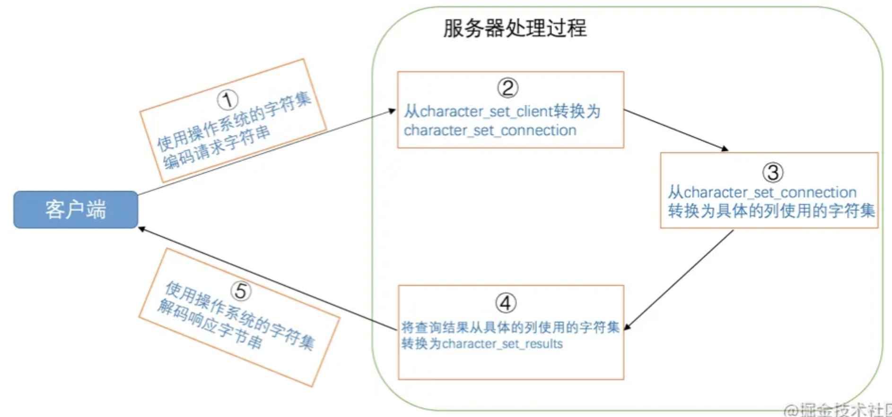

# 字符集

## 通用

### 定义

- 编码：字符------>二进制纯数字。
- 解码：二进制纯数字------>字符。

### 比较规则

有时候也称为`排序规则`。

二进制比较：直接比较二进制数值。

不区分大小写：把大小写全部转换为大写或小写之后，再比较二进制数值。

### 字符集

- ASCII：128个。
- ISO 8859-1：256个。
- GB2312：汉字6763个，其他文字符号682个。
- GBK：扩充GB2312。
- Unicode：这种字符集，有几种实现方案，或者叫编码方案。
  - utf8
  - utf16
  - utf32

## MySQL字符集

### 服务端

- mysql 不区分字符集和编码方案。
- mysql自己定义了2个概念：
  - Utf8mb3：阉割版，只保留了常用的字符，只使用1～3个字节表示字符。
  - Utf8mb4：完整版，使用1～4个字节表示字符。
- 在MySQL中 utf8 是 utf8mb3 的别名。

#### 查看

```sql
# 查看mysql支持的字符集。
SHOW CHARSET;
```

#### 比较规则

```sql
SHOW COLLATION [LIKE 匹配的模式];
# 查看utf8字符集的比较规则。
SHOW COLLATION LIKE 'utf8\_%';
```

比较规则的命名规则：

- 前缀：与其关联的字符集的名称。
- 中间：主要作用于哪种语言。
- 后缀：是否区分语言中的重音、大小写等。
  - _ai：accent insensitive，不区分重音。
  - _as：accent sensitive，区分重音。
  - _ci：case insensitive，不区分大小写。
  - _cs：case sensitive，区分大小写。
  - _bin：binary，以二进制方式比较。

#### 级别

MySQL有4个级别的字符集和比较规则，分别是：

- 服务器级别
- 数据库级别
- 表级别
- 列级别

##### 查看

```sql
# 服务器级别
SHOW VARIABLES LIKE 'character_set_server';
SHOW VARIABLES LIKE 'collation_server';

# 数据库级别
## 先用use语句选择数据库。
USE charset_demo_db;
SHOW VARIABLES LIKE 'character_set_database';
SHOW VARIABLES LIKE 'collation_database';
```

##### 修改

- 只修改字符集，则比较规则将变为修改后的字符集默认的比较规则。
- 只修改比较规则，则字符集将变为修改后的比较规则对应的字符集。

```wiki
[server]
character_set_server=gbk
collation_server=gbk_chinese_ci
```

```sql
# 数据库级别
CREATE DATABASE 数据库名
    [[DEFAULT] CHARACTER SET 字符集名称]
    [[DEFAULT] COLLATE 比较规则名称];

ALTER DATABASE 数据库名
    [[DEFAULT] CHARACTER SET 字符集名称]
    [[DEFAULT] COLLATE 比较规则名称];

CREATE DATABASE charset_demo_db
    -> CHARACTER SET gb2312
    -> COLLATE gb2312_chinese_ci;

# 表级别
CREATE TABLE 表名 (列的信息)
    [[DEFAULT] CHARACTER SET 字符集名称]
    [COLLATE 比较规则名称]]

ALTER TABLE 表名
    [[DEFAULT] CHARACTER SET 字符集名称]
    [COLLATE 比较规则名称]
    
CREATE TABLE t(
    ->     col VARCHAR(10)
    -> ) CHARACTER SET utf8 COLLATE utf8_general_ci;

# 列级别
CREATE TABLE 表名(
    列名 字符串类型 [CHARACTER SET 字符集名称] [COLLATE 比较规则名称],
    其他列...
);

ALTER TABLE 表名 MODIFY 列名 字符串类型 [CHARACTER SET 字符集名称] [COLLATE 比较规则名称];

ALTER TABLE t MODIFY col VARCHAR(10) CHARACTER SET gbk COLLATE gbk_chinese_ci;
```

##### 4个级别的联系

继承原则 + 覆盖原则。

- 如果创建或修改【列】时没有显式的指定字符集和比较规则，则该列默认继承【表】的字符集和比较规则。
- 如果创建【表】时没有显式的指定字符集和比较规则，则该表默认继承【数据库】的字符集和比较规则。
- 如果创建【数据库】时没有显式的指定字符集和比较规则，则该数据库默认继承【服务器】的字符集和比较规则。

### 客户端

说到底，`字符串`在计算机上的体现就是一个`字节串`，如果你使用不同字符集去`解码`这个字节串，最后得到的结果可能让你挠头。

- 询问：客户端把问题（字符串）编码成字节，通过TCP/IP协议发送给服务端（TCP/IP协议以字节传输）。
- 回答：服务器把自己的回答（字符串）编码成字节，通过TCP/IP协议返回给客户端。

```sql
#服务器解码【问题】时使用的字符集；
SHOW VARIABLES LIKE 'character_set_client';
#服务器处理请求时，会把请求字符串从 character_set_client 转为 character_set_connection
SHOW VARIABLES LIKE 'character_set_connection';
#服务器向客户端返回【回答】时使用的字符集
SHOW VARIABLES LIKE 'character_set_results';
```

#### 客户端发送字符集

一般情况下客户端所使用的字符集和当前操作系统一致，不同操作系统使用的字符集可能不一样，如下：

- 类`Unix`系统使用的是`utf8`；
- `Windows`使用的是`gbk`；

如果你使用的是可视化工具，比如navicat之类的，这些工具可能会使用自定义的字符集来编码发送到服务器的字符串，而不采用操作系统默认的字符集。



通常都把 ***character_set_client*** 、***character_set_connection***、***character_set_results*** 这三个系统变量设置成和客户端使用的字符集一致的情况，以减少无谓的字符集转换，提升性能。

为了方便设置，MySQL 提供了一条非常简便的语句：

```sql
SET NAMES 字符集名;
# 这一条语句产生的效果和我们执行这3条的效果是一样的：
SET character_set_client = 字符集名;
SET character_set_connection = 字符集名;
SET character_set_results = 字符集名;
# 示例
SET NAMES utf8;
```

```wiki
[client]
default-character-set=utf8
```

