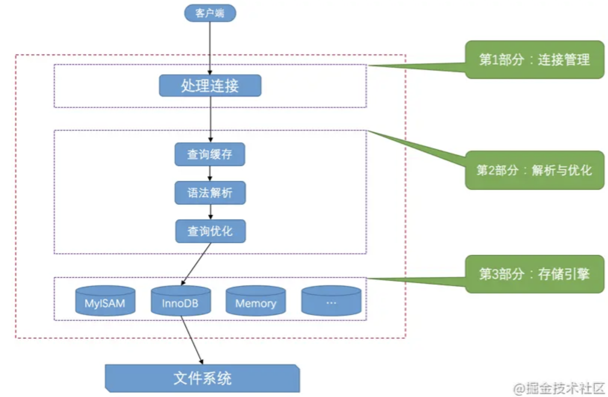

# 工作原理

## 大体工作流程

客户端进程向服务器进程发送一段文本（MySQL语句），服务器进程处理后再向客户端进程发送一段文本（处理结果）。

服务器程序处理来自客户端的查询请求大致需要经过三个部分，分别是`连接管理`、`解析与优化`、`存储引擎`。



### 连接管理

每当有1个客户端进程连接到服务器进程时，服务器进程都会创建1个线程来专门处理与这个客户端的交互。

当该客户端退出时会与服务器断开连接，服务器并不会立即把与该客户端交互的线程销毁掉，而是把它缓存起来，在另1个新的客户端再进行连接时，把这个缓存的线程分配给该新客户端。这样就起到了不频繁创建和销毁线程的效果，从而节省开销。

### 解析与优化

#### 查询缓存

缓存查询结果，同样的查询，不再到磁盘查询，直接从内存中获取结果并返回。

从MySQL 5.7.20开始，不推荐使用查询缓存，并在MySQL 8.0中删除。

#### 语法解析

涉及词法解析、语法分析、语义分析等阶段，这些问题不属于我们研究的重点，只要了解在处理请求的过程中需要这个步骤就好。

#### 查询优化

`MySQL`的优化程序会对我们的语句做一些优化，如外连接转换为内连接、表达式简化、子查询转为连接吧啦吧啦的一堆东西。

`优化的结果`就是生成一个`执行计划`，这个执行计划表明了应该使用哪些索引进行查询，表之间的连接顺序是啥样的。

可以使用`EXPLAIN`语句来查看某个语句的`执行计划`。

### 存储引擎

截止到服务器程序完成了查询优化为止，还没有真正的去访问真实的数据表，`MySQL`服务器把数据的存储和提取操作都封装到了一个叫`存储引擎`的模块里。

`表`是由一行一行的记录组成的，但这只是一个逻辑上的概念，物理上如何表示记录，怎么从表中读取数据，怎么把数据写入具体的物理存储器上，这都是`存储引擎`负责的事情。

#### 为什么叫`引擎`？

其实这个称呼并不直接。以前直接叫`表处理器`，后来可能人们觉得太土，就改成了`存储引擎`的叫法，它的功能就是接收上层传下来的指令，然后对表中的数据进行读、写操作。

#### 查看

```sql
# 查看支持的引擎。
SHOW ENGINES;
# Support列：该存储引擎是否可用。
# DEFAULT值：当前服务器程序的默认存储引擎。
# Comment列：对存储引擎的一个描述。
# Transactions列：该存储引擎是否支持事务处理。
# XA列：该存储引擎是否支持分布式事务。
# Savepoints：该存储引擎是否支持部分事务回滚。
```

