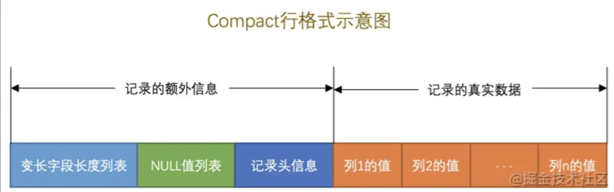
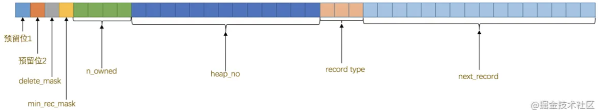
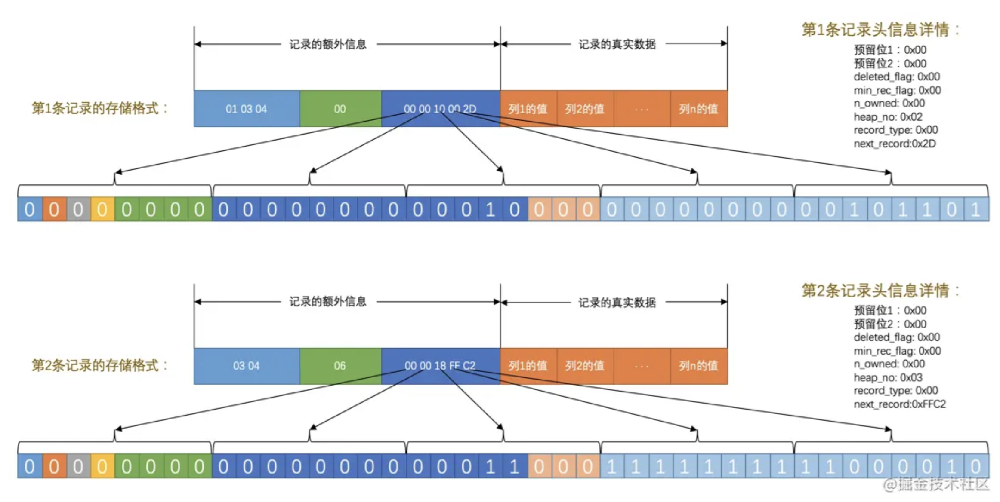

# InnoDB

## 存储

### 逻辑模型

页、行

### 行

#### 行的格式

- Compact：紧凑。
- Redundant：冗余。
- Dynamic：动态。
- Compressed：压缩。

##### Compact

- 描述信息：
  - `变长字段长度列表`：
    - VARCHAR(M)、VARBINARY(M)、各种TEXT类型，各种BLOB类型，统称变长字段。
    - 这些长度值按照列的逆序存放。
    - 并不是所有行都有这个部分，如果表中所有列都不是变长的数据类型的话，这个部分就不需要有。
  - `NULL值列表`：
    - 如果表中没有允许存储 ***NULL*** 的列，则 *NULL值列表* 也不存在。
    - 将每个允许存储 NULL 的列对应1个二进制位，二进制位按照列的顺序逆序排列。
      - 二进制位的值为 1 时，代表该列的值为 NULL。
      - 二进制位的值为 0 时，代表该列的值不为 NULL。
    - 必须是整数个字节的位，不足则高位补0，例如：必须为1byte=8bit、2byte=16bit。
  - `头信息`：
    - 固定的 5byte=40bit 组成。
    - 
- 业务数据：

示例

