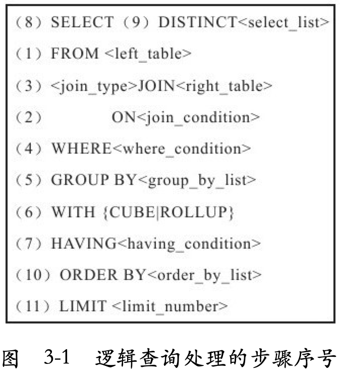

# SQL执行顺序

1. FROM left_table
2. ON join_condition
3. join_type JOIN right_table
4. WHERE where_condition
5. GROUP BY group_by_list
6. WITH cube|rollup
7. HAVING having_condition
8. SELECT
9. DISTINCT select_list
10. ORDER_BY order_by_list
11. LIMIT limit_number

