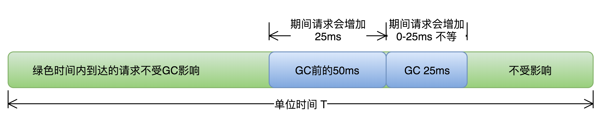

# 要达到的目标

- 高可用：可用性达到几个9。
- 低延迟：请求必须多少毫秒内完成响应。
- 高吞吐：每秒完成多少次事务。

注意：

上述性能指标间可能冲突。比如通常情况下，缩小延迟的代价是降低吞吐量或者消耗更多的内存或者两者同时发生。

# 影响因素

对于JVM来说，影响上述目标的主要就是GC，没有GC的世界是如此的美好。

3种GC算法都有2个阶段，这2个阶段都会影响上述目标。标记阶段就算是并发的，也会占用一部分线程资源，清理阶段也是如此。至于非并发的STW就更不用说了。

所以我们的主要优化点就在GC上，一个是GC次数，一个是单次GC时间。

## 高可用低延迟

对于高可用、低延迟这个目标来说。可以通过量化`GC时间`和`频率`对于`响应时间`和`可用性`的影响，来计算出当前GC情况对服务的影响，也能评估出GC优化后对响应时间的收益，这两点对于低延迟服务很重要。

举例：假设单位时间T内发生一次持续25ms的GC，接口平均响应时间为50ms，且请求均匀到达，根据下图所示：

那么有==(50ms+25ms)/T==比例的请求会受GC影响，其中GC前的50ms内到达的请求都会增加25ms，GC期间的25ms内到达的请求，会增加0-25ms不等，如果时间T内发生N次GC，**受GC影响请求占比=(接口响应时间+GC时间)×N/T** 。可见无论**==降低单次GC时间==**还是**==降低GC次数N==**都可以有效减少GC对响应时间的影响。

## 高吞吐

TODO

# 不同回收器调优

## ParNew + CMS

### 新生代GC

#### 问题

Minor GC频繁。

#### 分析原因和特征

由于新生代空间较小，Eden区很快被填满，就会导致**频繁Minor GC**。

单次Minor GC时间主要受哪些因素影响？是否和新生代大小存在线性关系？

首先，单次Minor GC时间由以下两部分组成：T1（扫描新生代）和 T2（复制存活对象到Survivor区）。（注：这里为了简化问题，我们认为T1只扫描新生代判断对象是否存活的时间，其实该阶段还需要扫描部分老年代，后面案例中有详细描述。）

- 扩容前：新生代容量为R ，假设对象A的存活时间为750ms，Minor GC间隔500ms，那么本次Minor GC时间= T1（扫描新生代R）+T2（复制对象A到S）。
- 扩容后：新生代容量为2R ，对象A的生命周期为750ms，那么Minor GC间隔增加为1000ms，**此时Minor GC对象A已不再存活，不需要把它复制到Survivor区**，那么本次GC时间 = 2 × T1（扫描新生代R），没有T2复制时间。

可见，扩容后，Minor GC时增加了T1（扫描时间），但省去T2（复制对象）的时间，更重要的是对于虚拟机来说，复制对象的成本要远高于扫描成本，所以，单次**Minor GC时间更多取决于GC后存活对象的数量，而非Eden区的大小**。

因此如果堆中短期对象很多，那么扩容新生代，单次Minor GC时间**不会显著增加**。

#### 方案

通过增大新生代空间来降低Minor GC的频率。例如在相同的内存分配率的前提下，**新生代中的Eden区增加一倍，Minor GC的次数就会减少一半**。

#### 解决方案

1. 首先需要确认下服务中对象的生命周期分布情况

   

通过上图GC日志中两处红色框标记内容可知： 

1. new threshold = 2（动态年龄判断，对象的晋升年龄阈值为2），对象仅经历2次Minor GC后就晋升到老年代，这样老年代会迅速被填满，直接导致了频繁的Major GC。 
2. Major GC后老年代使用空间为300M+，意味着此时绝大多数(86% = 2G/2.3G)的对象已经不再存活，也就是说生命周期长的对象占比很小，很多短期对象因为动态年龄判断提前到了老年代。

由此可见，服务中存在大量短期临时对象，扩容新生代空间后，Minor GC频率降低，对象在新生代得到充分回收，只有**生命周期长的对象**才进入老年代。这样老年代增速变慢，Major GC频率自然也会降低。

#### 结果

通过扩容新生代为为原来的3倍，单次Minor GC时间增加小于5ms，频率下降了60%，服务响应时间TP90，TP99都下降了10ms+，服务可用性得到提升。

#### 总结

如何选择各分区大小，应该依赖应用程序中**对象生命周期的分布情况：如果应用存在大量的短期对象，应该选择较大的年轻代；如果存在相对较多的持久对象，老年代应该适当增大。**

### 老年代GC

#### 问题

GC日志显示，高峰期CMS在重标记（Remark）阶段耗时1.39s。

#### 原因和特征

CMS的四个阶段，只有初始标记、重新标记阶段需要STW。

初始标记阶段标记数量很少，很快，重新标记阶段因为要解决跨代引用，需要扫描整个堆。

为了避免扫描时新生代有很多对象，增加了可中断的预清理阶段用来等待Minor GC的发生。只是该阶段有时间限制，如果超时等不到Minor GC，Remark时新生代仍然有很多对象，会导致速度很慢。

#### 解决方案

使用参数保证重新标记之前强制执行一次Minor GC。

### FullGC

#### FullGC原因

1. Perm空间不足。
   - 定位方法：日志中可以看出FullGC后，Perm区变大； 
   - 解决方法：
     - 把-XX:PermSize参数和-XX:MaxPermSize设置成一样，强制虚拟机在启动的时候就把永久代的容量固定下来，避免运行时自动扩容。
     - CMS默认情况下不会回收Perm区，通过参数CMSPermGenSweepingEnabled、CMSClassUnloadingEnabled ，可以让CMS在Perm区容量不足时对其回收。
   - 结果：调整参数后，服务不再有Perm区扩容导致的STW GC发生。
2. CMS GC时出现promotion failed和concurrent mode failure（concurrent mode failure发生的原因一般是CMS正在进行，但是由于老年代空间不足，需要尽快回收老年代里面的不再被使用的对象，这时停止所有的线程，同时终止CMS，直接进行Serial Old GC）。
   - 定位方法：在日志有特殊标识。
3. 统计得到的Young GC晋升到老年代的平均大小大于老年代的剩余空间；
   - 定位方法：日志会显示当时老年代使用量。 
4. 主动触发Full GC（执行jmap -histo:live [pid]）来避免碎片问题。
   - 定位方法：自己执行的命令自己知道。

## G1

- 初始标记
- 并发标记（需要STW）
- 最终标记
- 筛选回收

