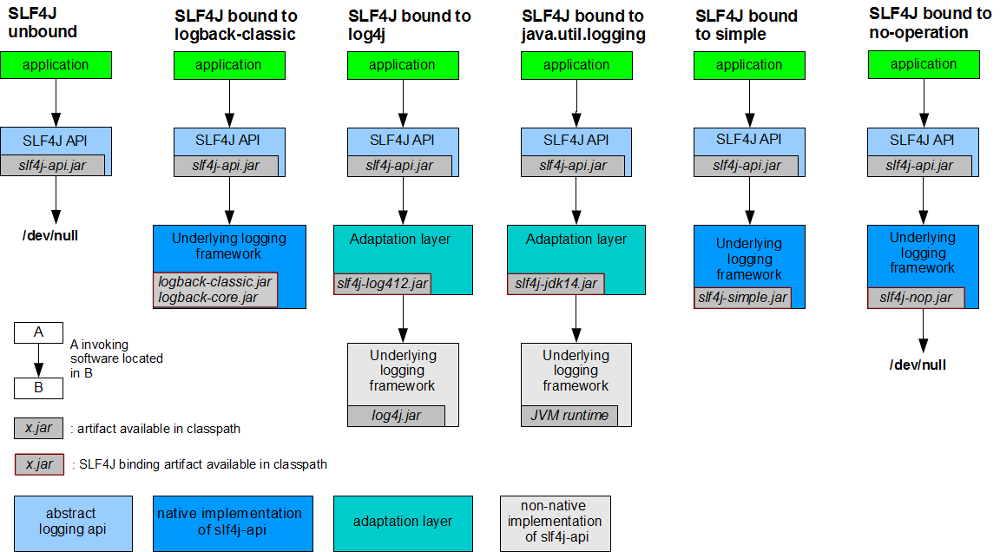

# 原理

## 问题

### 问题1：绑定实现

```wiki
slf4j + logback 没有其他任何的配置，程序就能运行，并输出日志，slf4j的接口和logback的实现是怎么绑定的？
答：
slf4j会在classpath中找所有org/slf4j/impl/StaticLoggerBinder.class的资源路径，一般而言只有一个，在logback的jar中。具体见下方源码。
```

### 问题2：读取配置

```wiki
仅仅在src/main/resources下配置logback.xml，就能运行，logback.xml是什么时候读取的呢？
答：
在类加载的时候就已经完成了对配置文件的读取。
```

## 示例

```java
public class LogTest{
    // 整个简单的示例项目中，涉及到Logger的只有这几行代码，
    // 那么这里的工厂模式创建 Logger 对象的代码就是唯一的入手点。
    // 猜想：
    // 面向对象代码，创建对象之前肯定需要读取配置，然后根据配置来创建。
    private static Logger LOGGER = LoggerFactory.getLogger(LogTest.class);
    // 使用
    public static void main(String[] args){
        LOGGER.info("......info");
        LOGGER.debug("......debug");
        LOGGER.warn("......warn");
        LOGGER.error("......error");
        LOGGER.trace("......trace");
    }
}
```

## 问题1绑定实现源码

`org.slf4j.LoggerFactory # getLogger(java.lang.Class<?>)`

```java
// 查看 LoggerFactory 类的 getLogger 方法，
public static Logger getLogger(Class<?> clazz) {
    // 获取Logger
    Logger logger = getLogger(clazz.getName());
    // 后续操作
    if (DETECT_LOGGER_NAME_MISMATCH) {
        Class<?> autoComputedCallingClass = Util.getCallingClass();
        if (autoComputedCallingClass != null && nonMatchingClasses(clazz, autoComputedCallingClass)) {
            Util.report(String.format("Detected logger name mismatch. Given name: \"%s\"; computed name: \"%s\".", logger.getName(),
                                      autoComputedCallingClass.getName()));
            Util.report("See " + LOGGER_NAME_MISMATCH_URL + " for an explanation");
        }
    }
    return logger;
}

```

`org.slf4j.LoggerFactory#getLogger(java.lang.String)`

```java
// 获取日志对象
public static Logger getLogger(String name) {
    // 创建：工厂
    ILoggerFactory iLoggerFactory = getILoggerFactory();
    // 创建：Logger对象（工厂模式）
    return iLoggerFactory.getLogger(name);
}
```

`org.slf4j.LoggerFactory # getILoggerFactory`

```java
// 猜测：工厂在创建 Logger 对象的时候，肯定需要根据配置创建，所以加载在创建日志工厂的时候，肯定已经加载了配置
public static ILoggerFactory getILoggerFactory() {
    if (INITIALIZATION_STATE == UNINITIALIZED) {
        synchronized (LoggerFactory.class) {
            if (INITIALIZATION_STATE == UNINITIALIZED) {
                INITIALIZATION_STATE = ONGOING_INITIALIZATION;
                // 执行初始化
                performInitialization();
            }
        }
    }
    switch (INITIALIZATION_STATE) {
        // 若初始化成功，则返回工厂
        case SUCCESSFUL_INITIALIZATION:
            return StaticLoggerBinder.getSingleton().getLoggerFactory();
        case NOP_FALLBACK_INITIALIZATION:
            return NOP_FALLBACK_FACTORY;
        case FAILED_INITIALIZATION:
            throw new IllegalStateException(UNSUCCESSFUL_INIT_MSG);
        case ONGOING_INITIALIZATION:
            // support re-entrant behavior.
            // See also http://jira.qos.ch/browse/SLF4J-97
            return SUBST_FACTORY;
    }
    throw new IllegalStateException("Unreachable code");
}
```

`org.slf4j.LoggerFactory # performInitialization`

```java
// 通常来说，初始化代码，用来做一些读取配置等操作，那么这里是否也是如此呢？
private final static void performInitialization() {
    // 下面是初始化成功后的校验，那么初始化肯定在这里了。
    bind();
    // 这里是初始化成功后的校验
    if (INITIALIZATION_STATE == SUCCESSFUL_INITIALIZATION) {
       versionSanityCheck();
    }
}
```

`org.slf4j.LoggerFactory # bind`

```java
private final static void bind() {
  try {
    // 从classpath获取可能的日志绑定者，就是找出所有slf4j的实现，并将它们的资源路径存放到staticLoggerBinderPathSet
    Set<URL> staticLoggerBinderPathSet = null;
    // skip check under android, see also
    // http://jira.qos.ch/browse/SLF4J-328
    if (!isAndroid()) {
       staticLoggerBinderPathSet = findPossibleStaticLoggerBinderPathSet();
        // 若有多个(多余1个)绑定者（从classpath中找到了多个slf4j的实现），这里只是打印警告，没有抛异常。
    reportMultipleBindingAmbiguity(staticLoggerBinderPathSet);
     }
    // the next line does the binding 
    // 读取配置，并真正的绑定，将具体的实现绑定到slf4j
    StaticLoggerBinder.getSingleton();
    // 修改初始化状态为初始化成功
    INITIALIZATION_STATE = SUCCESSFUL_INITIALIZATION;
    // 报告真实的绑定信息
    reportActualBinding(staticLoggerBinderPathSet);
    fixSubstituteLoggers();
    replayEvents();
    // release all resources in SUBST_FACTORY
    SUBST_FACTORY.clear();
    // 若有多个绑定者，则会抛此异常，
    // Java虚拟机在编译时能找到合适的类，而在运行时不能找到合适的类导致的错误，jvm不知道用哪个StaticLoggerBinder
    } catch (NoClassDefFoundError ncde) {
String msg = ncde.getMessage();
    if (messageContainsOrgSlf4jImplStaticLoggerBinder(msg)) {
            INITIALIZATION_STATE = NOP_FALLBACK_INITIALIZATION;
            Util.report("Failed to load class \"org.slf4j.impl.StaticLoggerBinder\".");
            Util.report("Defaulting to no-operation (NOP) logger implementation");
            Util.report("See " + NO_STATICLOGGERBINDER_URL + " for further details.");
        } else {
            failedBinding(ncde);
            throw ncde;
        }
    } catch (java.lang.NoSuchMethodError nsme) {
        String msg = nsme.getMessage();
        if (msg != null && msg.contains("org.slf4j.impl.StaticLoggerBinder.getSingleton()")) {
            INITIALIZATION_STATE = FAILED_INITIALIZATION;
            Util.report("slf4j-api 1.6.x (or later) is incompatible with this binding.");
            Util.report("Your binding is version 1.5.5 or earlier.");
            Util.report("Upgrade your binding to version 1.6.x.");
        }
        throw nsme;
    } catch (Exception e) {
        failedBinding(e);
        throw new IllegalStateException("Unexpected initialization failure", e);
    }
}
```

`org.slf4j.LoggerFactory # findPossibleStaticLoggerBinderPathSet`

```java
// We need to use the name of the StaticLoggerBinder class, but we can't
// reference
// the class itself.
private static String STATIC_LOGGER_BINDER_PATH = "org/slf4j/impl/StaticLoggerBinder.class";

// 从 classpath 找出所有 slf4j 的实现，并记录下它们的资源路径
static Set<URL> findPossibleStaticLoggerBinderPathSet() {
    // use Set instead of list in order to deal with bug #138
    // LinkedHashSet appropriate here because it preserves insertion order
    // during iteration
    Set<URL> staticLoggerBinderPathSet = new LinkedHashSet<URL>();
    try {
        ClassLoader loggerFactoryClassLoader = LoggerFactory.class.getClassLoader();
        Enumeration<URL> paths;
        if (loggerFactoryClassLoader == null) {
            paths = ClassLoader.getSystemResources(STATIC_LOGGER_BINDER_PATH);
        } else {
            paths = loggerFactoryClassLoader.getResources(STATIC_LOGGER_BINDER_PATH);
        }
        while (paths.hasMoreElements()) {
            // path的值
            URL path = paths.nextElement();
            staticLoggerBinderPathSet.add(path);
        }
    } catch (IOException ioe) {
        Util.report("Error getting resources from path", ioe);
    }
    return staticLoggerBinderPathSet;
}
```

## 问题2读取配置源码

```java
// 在 org.slf4j.LoggerFactory # bind 方法中有这么一行:
// StaticLoggerBinder.getSingleton();
// 注意这是个静态方法，返回的对象也是静态成员变量。
// 静态变量一般在类加载时即已经初始化完成。
public static StaticLoggerBinder getSingleton() {
　　return SINGLETON;
}

// 常见的做法是：静态变量的初始化一般是在静态代码块中完成，我们找找。
private static StaticLoggerBinder SINGLETON = new StaticLoggerBinder();

// 静态代码块
static {
    SINGLETON.init();
}
```

`org.slf4j.impl.StaticLoggerBinder#init`

```java
/**
  * Package access for testing purposes.
  * 为了测试，这里使用默认 proteced 访问权限。
  */
void init() {
    try {
        try {
            // 上下文初始化器
            new ContextInitializer(defaultLoggerContext).autoConfig();
        } catch (JoranException je) {
            Util.report("Failed to auto configure default logger context", je);
        }
        // logback-292
        if (!StatusUtil.contextHasStatusListener(defaultLoggerContext)) {
            StatusPrinter.printInCaseOfErrorsOrWarnings(defaultLoggerContext);
        }
        contextSelectorBinder.init(defaultLoggerContext, KEY);
        initialized = true;
    } catch (Exception t) { // see LOGBACK-1159
        Util.report("Failed to instantiate [" + LoggerContext.class.getName() + "]", t);
    }
}
```

`ch.qos.logback.classic.util.ContextInitializer#autoConfig`

```java
public void autoConfig() throws JoranException {
    StatusListenerConfigHelper.installIfAsked(loggerContext);
    // 寻找默认配置文件
    URL url = findURLOfDefaultConfigurationFile(true);
    if (url != null) {
        configureByResource(url);
    } else {
        Configurator c = EnvUtil.loadFromServiceLoader(Configurator.class);
        if (c != null) {
            try {
                c.setContext(loggerContext);
                c.configure(loggerContext);
            } catch (Exception e) {
                throw new LogbackException(String.format("Failed to initialize Configurator: %s using ServiceLoader", c != null ? c.getClass()
                                                         .getCanonicalName() : "null"), e);
            }
        } else {
            // 没有找到配置文件，则使用默认的配置器，
            // 那么日志只会输出到控制台。
            BasicConfigurator basicConfigurator = new BasicConfigurator();
            basicConfigurator.setContext(loggerContext);
            basicConfigurator.configure(loggerContext);
        }
    }
}
```

`ch.qos.logback.classic.util.ContextInitializer#findURLOfDefaultConfigurationFile`

```java
public URL findURLOfDefaultConfigurationFile(boolean updateStatus) {
    // 获取当前实例的类加载器，目的是在classpath下寻找配置文件
    ClassLoader myClassLoader = Loader.getClassLoaderOfObject(this);
    // 先找logback.configurationFile文件
    URL url = findConfigFileURLFromSystemProperties(myClassLoader, updateStatus);
    if (url != null) {
        return url;
    }
	// logback.configurationFile文件没找到，再找logback.groovy
    url = getResource(GROOVY_AUTOCONFIG_FILE, myClassLoader, updateStatus);
    if (url != null) {
        return url;
    }
	// logback.groovy没找到，再找logback-test.xml
    url = getResource(TEST_AUTOCONFIG_FILE, myClassLoader, updateStatus);
    if (url != null) {
        return url;
    }
	// logback-test.xml没找到，最后找logback.xml
    return getResource(AUTOCONFIG_FILE, myClassLoader, updateStatus);
}
```

## 桥接库



