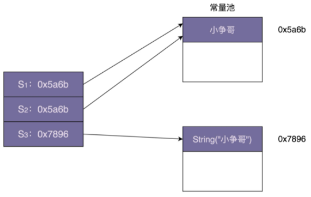

# 享元模式

如何利用享元模式优化文本编辑器的内存占用？

## 原理

所谓“享元”，顾名思义就是**==被共享的单元==**。享元模式的**==意图==**是**==复用对象==**，节省内存，**==前提==**是享元对象是**==不可变对象==**。

定义中的“不可变对象”指的是：一旦通过构造函数初始化完成之后，它的状态（对象的成员变量或者属性）就不会再被修改了。所以，不可变对象不能暴露任何 set() 等修改内部状态的方法。

之所以要求享元是不可变对象，那是因为它会被多处代码共享使用，避免一处代码对享元进行了修改，影响到其他使用它的代码。

具体来讲，当一个系统中存在大量重复对象的时候，我们就可以利用享元模式，将对象设计成享元，在内存中只保留一份实例，供多处代码引用，这样可以减少内存中对象的数量，以起到节省内存的目的。

实际上，不仅仅相同对象可以设计成享元，对于**==相似对象==**，我们也可以将这些对象中**==相同的部分（字段）提取出来==**，设计成享元，让这些大量相似对象引用这些享元。

## 实现

主要是通过工厂模式，在工厂类中，通过一个 Map 来**==缓存==**已经创建过的享元对象，来达到复用的目的。

## 案例

### 棋牌游戏示例

假设我们在开发一个棋牌游戏（比如象棋）。一个游戏厅中有成千上万个“房间”，每个房间对应一个棋局。棋局要保存每个棋子的数据，比如：棋子类型（将、相、士、炮等）、棋子颜色（红方、黑方）、棋子在棋局中的位置。利用这些数据，我们就能显示一个完整的棋盘给玩家。

```java
public class ChessPiece {//表示棋子
  private int id;
  private String text;
  private Color color;
  private int positionX;
  private int positionY;
  public ChessPiece(int id, String text, Color color, int positionX, int positionY) {
    this.id = id;
    this.text = text;
    this.color = color;
    this.positionX = positionX;
    this.positionY = positionX;
  }
  public static enum Color {
    RED, BLACK
  }
  // ...省略其他属性和getter/setter方法...
}
//表示一个棋局，里面保存了象棋中 30 个棋子的信息。
public class ChessBoard {
  private Map<Integer, ChessPiece> chessPieces = new HashMap<>();
  public ChessBoard() {
    init();
  }
  private void init() {
    chessPieces.put(1, new ChessPiece(1, "車", ChessPiece.Color.BLACK, 0, 0));
    chessPieces.put(2, new ChessPiece(2,"馬", ChessPiece.Color.BLACK, 0, 1));
    //...省略摆放其他棋子的代码...
  }
  public void move(int chessPieceId, int toPositionX, int toPositionY) {
    //...省略...
  }
}
```

为了记录每个房间当前的棋局情况，我们需要给每个房间都创建一个 ChessBoard 棋局对象。因为游戏大厅中有成千上万的房间（实际上，百万人同时在线的游戏大厅也有很多），那保存这么多棋局对象就会消耗大量的内存。有没有什么办法来节省内存呢？

这些相似对象的 id、text、color 都是相同的，唯独 positionX、positionY 不同。实际上，我们可以将棋子的 id、text、color 属性拆分出来，设计成独立的类，并且作为享元供多个棋盘复用。这样，棋盘只需要记录每个棋子的位置信息就可以了。

```java
// 享元类
public class ChessPieceUnit {
  private int id;
  private String text;
  private Color color;
  public ChessPieceUnit(int id, String text, Color color) {
    this.id = id;
    this.text = text;
    this.color = color;
  }
  public static enum Color {
    RED, BLACK
  }
  // ...省略其他属性和getter方法...
}

public class ChessPieceUnitFactory {
  private static final Map<Integer, ChessPieceUnit> pieces = new HashMap<>();
  static {
    pieces.put(1, new ChessPieceUnit(1, "車", ChessPieceUnit.Color.BLACK));
    pieces.put(2, new ChessPieceUnit(2,"馬", ChessPieceUnit.Color.BLACK));
    //...省略摆放其他棋子的代码...
  }
  public static ChessPieceUnit getChessPiece(int chessPieceId) {
    return pieces.get(chessPieceId);
  }
}

public class ChessPiece {
  private ChessPieceUnit chessPieceUnit;
  private int positionX;
  private int positionY;
  public ChessPiece(ChessPieceUnit unit, int positionX, int positionY) {
    this.chessPieceUnit = unit;
    this.positionX = positionX;
    this.positionY = positionY;
  }
  // 省略getter、setter方法
}

public class ChessBoard {
  private Map<Integer, ChessPiece> chessPieces = new HashMap<>();
  public ChessBoard() {
    init();
  }
  private void init() {
    chessPieces.put(1, new ChessPiece(
            ChessPieceUnitFactory.getChessPiece(1), 0,0));
    chessPieces.put(1, new ChessPiece(
            ChessPieceUnitFactory.getChessPiece(2), 1,0));
    //...省略摆放其他棋子的代码...
  }
  public void move(int chessPieceId, int toPositionX, int toPositionY) {
    //...省略...
  }
}
```

在上面的代码实现中，我们利用工厂类来缓存 ChessPieceUnit 信息（也就是 id、text、color）。通过工厂类获取到的 ChessPieceUnit 就是享元。所有的 ChessBoard 对象共享这 30 个 ChessPieceUnit 对象（因为象棋中只有 30 个棋子）。在使用享元模式之前，记录 1 万个棋局，我们要创建 30 万（30*1 万）个棋子的 ChessPieceUnit 对象。利用享元模式，我们只需要创建 30 个享元对象供所有棋局共享使用即可，大大节省了内存。

### 在文本编辑器中的应用

可以把这里提到的文本编辑器想象成 Office 的 Word。不过，为了简化需求背景，我们假设这个文本编辑器只实现了文字编辑功能，不包含图片、表格等复杂的编辑功能。

对于简化之后的文本编辑器，我们要在内存中表示一个文本文件，只需要记录**文字和格式**两部分信息就可以了，其中，格式又包括文字的字体、大小、颜色等信息。

尽管在实际的文档编写中，我们一般都是按照文本类型（标题、正文……）来设置文字的格式，标题是一种格式，正文是另一种格式等等。但是，从理论上讲，我们可以给文本文件中的每个文字都设置不同的格式。为了实现如此灵活的格式设置，并且代码实现又不过于太复杂，我们把每个文字都当作一个独立的对象来看待，并且在其中包含它的格式信息。

```java
public class Character {//文字
  private char c;
  private Font font;
  private int size;
  private int colorRGB;
  public Character(char c, Font font, int size, int colorRGB) {
    this.c = c;
    this.font = font;
    this.size = size;
    this.colorRGB = colorRGB;
  }
}

public class Editor {
  private List<Character> chars = new ArrayList<>();
  public void appendCharacter(char c, Font font, int size, int colorRGB) {
    Character character = new Character(c, font, size, colorRGB);
    chars.add(character);
  }
}
```

在文本编辑器中，我们每敲一个文字，都会调用 Editor 类中的 appendCharacter() 方法，创建一个新的 Character 对象，保存到 chars 数组中。如果一个文本文件中，有上万、十几万、几十万的文字，那我们就要在内存中存储这么多 Character 对象。那有没有办法可以节省一点内存呢？

实际上，在一个文本文件中，用到的字体格式不会太多，毕竟不大可能有人把每个文字都设置成不同的格式。所以，对于字体格式，我们可以将它设计成享元，让不同的文字共享使用。

```java
// 重构后的版本
public class CharacterStyle {
  private Font font;
  private int size;
  private int colorRGB;
  public CharacterStyle(Font font, int size, int colorRGB) {
    this.font = font;
    this.size = size;
    this.colorRGB = colorRGB;
  }
  @Override
  public boolean equals(Object o) {
    CharacterStyle otherStyle = (CharacterStyle) o;
    return font.equals(otherStyle.font)
            && size == otherStyle.size
            && colorRGB == otherStyle.colorRGB;
  }
}

public class CharacterStyleFactory {
  private static final List<CharacterStyle> styles = new ArrayList<>();
  public static CharacterStyle getStyle(Font font, int size, int colorRGB) {
    CharacterStyle newStyle = new CharacterStyle(font, size, colorRGB);
    for (CharacterStyle style : styles) {
      if (style.equals(newStyle)) {
        return style;
      }
    }
    styles.add(newStyle);
    return newStyle;
  }
}

public class Character {
  private char c;
  private CharacterStyle style;
  public Character(char c, CharacterStyle style) {
    this.c = c;
    this.style = style;
  }
}

public class Editor {
  private List<Character> chars = new ArrayList<>();
  public void appendCharacter(char c, Font font, int size, int colorRGB) {
    Character character = new Character(c, CharacterStyleFactory.getStyle(font, size, colorRGB));
    chars.add(character);
  }
}
```

### 在 Java Integer中的应用

 IntegerCache 只缓存 -128 到 127 之间的整型值，也就是一个字节的大小。

JDK 也提供了方法来让我们可以自定义缓存的最大值。不过，这里注意一下，JDK 并没有提供设置最小值的方法。

```shell
//方法一：
-Djava.lang.Integer.IntegerCache.high=255
//方法二：
-XX:AutoBoxCacheMax=255
```

在我们平时的开发中，对于下面这样三种创建整型对象的方式，我们优先使用后两种。因为第一种创建方式并不会使用到 IntegerCache，而后面两种创建方法可以利用 IntegerCache 缓存，返回共享的对象，以达到节省内存的目的。

```java
Integer a = new Integer(123);
Integer a = 123;
Integer a = Integer.valueOf(123);
```

实际上，除了 Integer 类型之外，其他包装器类型，比如 Long、Short、Byte 等，也都利用了享元模式来缓存 -128 到 127 之间的数据。

### 在 Java String 中的应用

跟 Integer 类的设计思路相似，String 类利用享元模式来复用相同的字符串常量（也就是代码中的“小争哥”）。JVM 会专门开辟一块存储区来存储字符串常量，这块存储区叫作“字符串常量池”。



不过，String 类的享元模式的设计，跟 Integer 类稍微有些不同。Integer 类中要共享的对象，是在类加载的时候，就集中一次性创建好的。

但是，对于字符串来说，我们没法事先知道要共享哪些字符串常量，所以没办法事先创建好，只能在某个字符串常量第一次被用到的时候，存储到常量池中，当之后再用到的时候，直接引用常量池中已经存在的即可，就不需要再重新创建了。

## 享元模式 vs 单例、缓存、对象池

### 跟单例的区别

个数不同：

- 在单例模式中，一个类只能创建一个对象。
- 在享元模式中，一个类可以创建多个对象，每个对象被多处代码引用共享。

实际上，享元模式有点类似于之前讲到的单例的变体：多例。

意图不同：

- 应用享元模式是为了**==对象复用，节省内存==**。
- 应用多例模式是为了**==限制对象的个数==**。

### 跟缓存的区别

在享元模式的实现中，我们通过工厂类来“缓存”已经创建好的对象。**==这里的“缓存”实际上是“存储”的意思==**，跟我们平时所说的“数据库缓存”“CPU 缓存”“MemCache 缓存”是两回事。

我们平时所讲的**==缓存==**，主要是为了**==提高访问效率==**，而**==非复用==**。

### 跟对象池的区别

虽然对象池、连接池、线程池、享元模式都是为了复用，但是，如果我们再细致地抠一抠“复用”这个字眼的话，对象池、连接池、线程池等池化技术中的“复用”和享元模式中的“复用”实际上是不同的概念。

- 池化技术中的“复用”可以理解为“**==重复使用==**”，**==主要目的==**是**==节省时间==**（比如从数据库池中取一个连接，不需要重新创建）。在任意时刻，每一个对象、连接、线程，并不会被多处使用，而是**==被一个使用者独占==**，当使用完成之后，放回到池中，再由其他使用者重复利用。
- 享元模式中的“复用”可以理解为“**==共享使用==**”，在整个生命周期中，都是**==被所有使用者共享==**的，**==主要目的==**是**==节省空间==**。

### 概括一下

- 应用单例模式是为了保证对象全局唯一。
- 应用享元模式是为了实现对象复用，节省内存。
- 缓存是为了提高访问效率，而非复用。
- 池化技术中的“复用”理解为“重复使用”，主要是为了节省时间。

## 补充强调

实际上，享元模式对 JVM 的垃圾回收并不友好。

因为享元==**工厂类**==一直保存了对享元对象的引用，这就导致享元对象在没有任何代码使用的情况下，也并不会被 JVM 垃圾回收机制自动回收掉。因此，在某些情况下，如果对象的生命周期很短，也不会被密集使用，利用享元模式反倒可能会浪费更多的内存。

所以，**==除非经过线上验证==**，利用享元模式真的可以大大节省内存，**==否则，就不要过度使用这个模式==**，为了一点点内存的节省而引入一个复杂的设计模式，得不偿失啊。