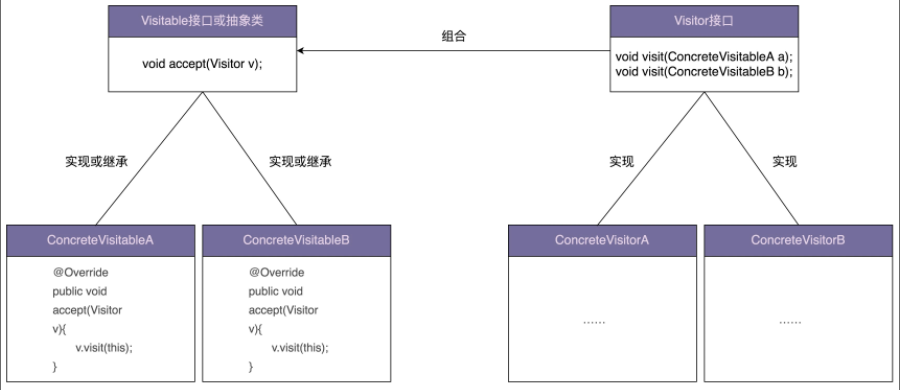

# 访问者模式

访问者模式可以算是 23 种经典设计模式中**==最难理解==**的几个**==之一==**。因为它难理解、难实现，应用它会导致代码的**==可读性、可维护性==**变差，所以，访问者模式在实际的软件开发中**==很少被用到==**，在**==没有特别必要==**的情况下，建议你**==不要使用==**访问者模式。

尽管如此，为了以后读到应用了访问者模式的代码的时候，能一眼就能看出代码的设计意图，还是有必要学一学这个模式。

为了最大化学习效果，不只是单纯地学原理和实现，更重要的是，还原访问者模式诞生的思维过程，切身感受到创造一种新的设计模式出来并不是件难事。

## 诞生过程

### 问题

假设我们从网站上爬取了很多资源文件，它们的格式有三种：PDF、PPT、Word。我们现在要开发一个工具来处理这批资源文件。这个工具的其中一个功能是，把这些资源文件中的文本内容抽取出来放到 txt 文件中。如果让你来实现，你会怎么来做呢？

### 初次尝试

其中一种实现方式如下。

```java
public abstract class ResourceFile {
  protected String filePath;
  public ResourceFile(String filePath) {
    this.filePath = filePath;
  }
  public abstract void extract2txt();
}

public class PPTFile extends ResourceFile {
  public PPTFile(String filePath) {
    super(filePath);
  }
  @Override
  public void extract2txt() {
    //...省略一大坨从PPT中抽取文本的代码...
    //...将抽取出来的文本保存在跟filePath同名的.txt文件中...
    System.out.println("Extract PPT.");
  }
}

public class PdfFile extends ResourceFile {
  public PdfFile(String filePath) {
    super(filePath);
  }
  @Override
  public void extract2txt() {
    //...
    System.out.println("Extract PDF.");
  }
}

public class WordFile extends ResourceFile {
  public WordFile(String filePath) {
    super(filePath);
  }
  @Override
  public void extract2txt() {
    //...
    System.out.println("Extract WORD.");
  }
}

// 运行结果是：
// Extract PDF.
// Extract WORD.
// Extract PPT.
public class ToolApplication {
  public static void main(String[] args) {
    List<ResourceFile> resourceFiles = listAllResourceFiles(args[0]);
    for (ResourceFile resourceFile : resourceFiles) {
      resourceFile.extract2txt();
    }
  }
  private static List<ResourceFile> 
      listAllResourceFiles(String resourceDirectory) {
    List<ResourceFile> resourceFiles = new ArrayList<>();
    //...根据后缀(pdf/ppt/word)，
    // 由工厂方法创建不同的类对象(PdfFile/PPTFile/WordFile)
    resourceFiles.add(new PdfFile("a.pdf"));
    resourceFiles.add(new WordFile("b.word"));
    resourceFiles.add(new PPTFile("c.ppt"));
    return resourceFiles;
  }
}
```

### 初次尝试存在的问题

如果工具的功能不停地扩展，不仅要能抽取文本内容，还要支持压缩、提取文件元信息（文件名、大小、更新时间等等）构建索引等一系列的功能，如果继续按照上面的实现思路，就会存在这样几个问题：

- 违背开闭原则，添加一个新的功能，所有类的代码都要修改；
- 虽然功能增多，每个类的代码都不断膨胀，可读性和可维护性都变差了；
- 把**==所有比较上层的业务逻辑==**都耦合到 PdfFile、PPTFile、WordFile 类中，导致这些类的**==职责不够单一==**，变成了大杂烩。

### 二次尝试

针对上面的问题，常用的解决方法就是**==拆分解耦==**，把**==业务操作==**跟**==具体的数据结构==**解耦，设计成独立的类。这里我们按照访问者模式的演进思路来对上面的代码进行重构。

```java
public abstract class ResourceFile {
  protected String filePath;
  public ResourceFile(String filePath) {
    this.filePath = filePath;
  }
}
public class PdfFile extends ResourceFile {
  public PdfFile(String filePath) {
    super(filePath);
  }
  //...
}
//...PPTFile、WordFile代码省略...
public class Extractor {
  public void extract2txt(PPTFile pptFile) {
    //...
    System.out.println("Extract PPT.");
  }
  public void extract2txt(PdfFile pdfFile) {
    //...
    System.out.println("Extract PDF.");
  }
  public void extract2txt(WordFile wordFile) {
    //...
    System.out.println("Extract WORD.");
  }
}
public class ToolApplication {
  public static void main(String[] args) {
    Extractor extractor = new Extractor();
    List<ResourceFile> resourceFiles = listAllResourceFiles(args[0]);
    for (ResourceFile resourceFile : resourceFiles) {
      // 这里无法通过编译，需要修改
      extractor.extract2txt(resourceFile);
    }
  }
  private static List<ResourceFile> 
      listAllResourceFiles(String resourceDirectory) {
    List<ResourceFile> resourceFiles = new ArrayList<>();
    //...根据后缀(pdf/ppt/word)，
    // 由工厂方法创建不同的类对象(PdfFile/PPTFile/WordFile)
    resourceFiles.add(new PdfFile("a.pdf"));
    resourceFiles.add(new WordFile("b.word"));
    resourceFiles.add(new PPTFile("c.ppt"));
    return resourceFiles;
  }
}
```

这其中**==最关键==**的一点设计是，我们把**==抽取文本内容==**的**==操作==**，设计成了三个重载函数。

上面的代码是编译通过不了的，main函数的for循环体会报错。根本原因在于：

**==多态==**是一种**==动态绑定==**，可以在运行时获取对象的实际类型，来运行实际类型对应的方法。而**==函数重载==**是一种**==静态绑定==**，在编译时并不能获取对象的实际类型，而是根据**==声明类型==**执行声明类型对应的方法。

解决方法如下：

```java
public abstract class ResourceFile {
  protected String filePath;
  public ResourceFile(String filePath) {
    this.filePath = filePath;
  }
  // 注意这里
  abstract public void accept(Extractor extractor);
}

public class PdfFile extends ResourceFile {
  public PdfFile(String filePath) {
    super(filePath);
  }
  @Override
  public void accept(Extractor extractor) {
    extractor.extract2txt(this);
  }
  //...
}
//...PPTFile、WordFile跟PdfFile类似，这里就省略了...
//...Extractor代码不变...
public class ToolApplication {
  public static void main(String[] args) {
    Extractor extractor = new Extractor();
    List<ResourceFile> resourceFiles = listAllResourceFiles(args[0]);
    for (ResourceFile resourceFile : resourceFiles) {
      // 注意这里
      resourceFile.accept(extractor);
    }
  }
  private static List<ResourceFile> 
      listAllResourceFiles(String resourceDirectory) {
    List<ResourceFile> resourceFiles = new ArrayList<>();
    //...根据后缀(pdf/ppt/word)，
    // 由工厂方法创建不同的类对象(PdfFile/PPTFile/WordFile)
    resourceFiles.add(new PdfFile("a.pdf"));
    resourceFiles.add(new WordFile("b.word"));
    resourceFiles.add(new PPTFile("c.ppt"));
    return resourceFiles;
  }
}
```

在执行main函数的for循环体的时候，根据多态特性，程序会调用实际类型的 accept 函数。比如 PdfFile 的 accept 函数。而PdfFile的accept函数中的 this 类型是 PdfFile 的，在**==编译时==**就已确定，所以会调用 extractor 的 extract2txt(PdfFile pdfFile) 这个重载函数。这个实现思路是不是很有技巧？这是理解访问者模式的**==关键==**所在，也是之前所说的访问者模式不好理解的原因。

现在，如果要继续添加新的功能，比如前面提到的压缩功能，根据不同的文件类型，使用不同的压缩算法来压缩资源文件，那我们该如何实现呢？我们需要实现一个类似 Extractor 类的新类 Compressor 类，在其中定义三个重载函数，实现对不同类型资源文件的压缩。除此之外，我们还要在每个资源文件类中定义新的 accept 重载函数。

```java
public abstract class ResourceFile {
  protected String filePath;
  public ResourceFile(String filePath) {
    this.filePath = filePath;
  }
  abstract public void accept(Extractor extractor);
  abstract public void accept(Compressor compressor);
}
public class PdfFile extends ResourceFile {
  public PdfFile(String filePath) {
    super(filePath);
  }
  // 接收一个外部传入的抽取器，然后调用抽取器的方法来执行抽取逻辑
  @Override
  public void accept(Extractor extractor) {
    extractor.extract2txt(this);
  }
  @Override
  public void accept(Compressor compressor) {
    compressor.compress(this);
  }
  //...
}
//...PPTFile、WordFile跟PdfFile类似，这里就省略了...
//...Extractor代码不变
public class ToolApplication {
  public static void main(String[] args) {
    // 抽取器
    Extractor extractor = new Extractor();
    List<ResourceFile> resourceFiles = listAllResourceFiles(args[0]);
    for (ResourceFile resourceFile : resourceFiles) {
      resourceFile.accept(extractor);
    }
    // 压缩器
    Compressor compressor = new Compressor();
    for(ResourceFile resourceFile : resourceFiles) {
      resourceFile.accept(compressor);
    }
  }
  private static List<ResourceFile> 
      listAllResourceFiles(String resourceDirectory) {
    List<ResourceFile> resourceFiles = new ArrayList<>();
    //...根据后缀(pdf/ppt/word)，
    // 由工厂方法创建不同的类对象(PdfFile/PPTFile/WordFile)
    resourceFiles.add(new PdfFile("a.pdf"));
    resourceFiles.add(new WordFile("b.word"));
    resourceFiles.add(new PPTFile("c.ppt"));
    return resourceFiles;
  }
}
```

### 二次尝试存在的问题

上面代码还存在一些问题，添加一个新的业务，还是需要修改每个资源文件类，违反了开闭原则。

### 最后尝试

针对这个问题，我们**==抽象出来一个 Visitor 接口==**，包含是三个命名非常通用的 visit() 重载函数，分别处理三种不同类型的资源文件。具体做什么业务处理，由实现这个 Visitor 接口的具体的类来决定，比如 Extractor 负责抽取文本内容，Compressor 负责压缩。当我们新添加一个业务功能的时候，资源文件类不需要做任何修改，只需要修改 ToolApplication 的代码就可以了。

```java

public abstract class ResourceFile {
  protected String filePath;
  public ResourceFile(String filePath) {
    this.filePath = filePath;
  }
  // 面向接口编程，抽象出一个处理器接口：visitor
  abstract public void accept(Visitor vistor);
}

public class PdfFile extends ResourceFile {
  public PdfFile(String filePath) {
    super(filePath);
  }
  // 传进来什么处理器，就调用什么处理器
  @Override
  public void accept(Visitor visitor) {
    visitor.visit(this);
  }
  //...
}
//...PPTFile、WordFile跟PdfFile类似，这里就省略了...
public interface Visitor {
  void visit(PdfFile pdfFile);
  void visit(PPTFile pdfFile);
  void visit(WordFile pdfFile);
}
// 抽取处理器
public class Extractor implements Visitor {
  @Override
  public void visit(PPTFile pptFile) {
    //...
    System.out.println("Extract PPT.");
  }
  @Override
  public void visit(PdfFile pdfFile) {
    //...
    System.out.println("Extract PDF.");
  }
  @Override
  public void visit(WordFile wordFile) {
    //...
    System.out.println("Extract WORD.");
  }
}
// 压缩处理器
public class Compressor implements Visitor {
  @Override
  public void visit(PPTFile pptFile) {
    //...
    System.out.println("Compress PPT.");
  }
  @Override
  public void visit(PdfFile pdfFile) {
    //...
    System.out.println("Compress PDF.");
  }
  @Override
  public void visit(WordFile wordFile) {
    //...
    System.out.println("Compress WORD.");
  }
}
public class ToolApplication {
  public static void main(String[] args) {
    Extractor extractor = new Extractor();
    List<ResourceFile> resourceFiles = listAllResourceFiles(args[0]);
    for (ResourceFile resourceFile : resourceFiles) {
      // 传抽取器
      resourceFile.accept(extractor);
    }
    Compressor compressor = new Compressor();
    for(ResourceFile resourceFile : resourceFiles) {
      // 传压缩器
      resourceFile.accept(compressor);
    }
  }
  private static List<ResourceFile> 
      listAllResourceFiles(String resourceDirectory) {
    List<ResourceFile> resourceFiles = new ArrayList<>();
    //...根据后缀(pdf/ppt/word)，
    // 由工厂方法创建不同的类对象(PdfFile/PPTFile/WordFile)
    resourceFiles.add(new PdfFile("a.pdf"));
    resourceFiles.add(new WordFile("b.word"));
    resourceFiles.add(new PPTFile("c.ppt"));
    return resourceFiles;
  }
}
```

## 原理

访问者者模式的英文翻译是 Visitor Design Pattern。在 GoF 的《设计模式》一书中，它是这么定义的：

> Allows for one or more operation to be applied to a set of objects at runtime, decoupling the operations from the object structure.

翻译成中文就是：允许一个或者多个操作应用到一组对象上，解耦操作和对象本身。



其实处理器就是一个**==工具类==**，因为处理器没有属性，属性是被处理对象的，但是工具类需要我们主动调，这里通过被处理对象的方法间接调用。

如果把工具类设为对象的一个属性，并在构造器的参数中传入，那么就成为组合模式了，但是工具类显然不是对象的属性，所以这里用普通方法参数传入并调用。

**==本质==**上就是把一些**==与对象不相关的方法==**从对象中拆分出去，成为一个工具类，然后在对象中用一个通用的方法接收工具类，调用工具类的工具方法来处理。

## 应用场景

一般来说，访问者模式针对的是一组类型不同的对象（PdfFile、PPTFile、WordFile）。不过，尽管这组对象的类型是不同的，但是，它们继承相同的父类（ResourceFile）或者实现相同的接口。

在不同的应用场景下，我们需要对这组对象进行一系列**==不相关的业务操作==**（抽取文本、压缩等），但为了避免不断添加功能导致类（PdfFile、PPTFile、WordFile）不断膨胀，职责越来越不单一，以及避免频繁地添加功能导致的频繁代码修改，我们使用访问者模式，将**==对象==**与**==操作==**解耦，将这些**==业务操作==**抽离出来，定义在独立细分的访问者类（Extractor、Compressor）中。

## 和工厂模式对比

对于上面的例子，还有其他的实现方法，比如，我们还可以利用工厂模式来实现，定义一个包含 extract2txt() 接口函数的 Extractor 接口。这个实现思路其实更加简单。

```java
// 资源文件
public abstract class ResourceFile {
  protected String filePath;
  public ResourceFile(String filePath) {
    this.filePath = filePath;
  }
  // 资源文件类型
  public abstract ResourceFileType getType();
}
public class PdfFile extends ResourceFile {
  public PdfFile(String filePath) {
    super(filePath);
  }
  @Override
  public ResourceFileType getType() {
    return ResourceFileType.PDF;
  }
  //...
}
//...PPTFile/WordFile跟PdfFile代码结构类似，此处省略...
// 抽取器
public interface Extractor {
  void extract2txt(ResourceFile resourceFile);
}
public class PdfExtractor implements Extractor {
  @Override
  public void extract2txt(ResourceFile resourceFile) {
    //...
  }
}
//...PPTExtractor/WordExtractor跟PdfExtractor代码结构类似，此处省略...
// 抽取器工厂
public class ExtractorFactory {
  private static final Map<ResourceFileType, Extractor> extractors = new HashMap<>();
  static {
    extractors.put(ResourceFileType.PDF, new PdfExtractor());
    extractors.put(ResourceFileType.PPT, new PPTExtractor());
    extractors.put(ResourceFileType.WORD, new WordExtractor());
  }
  public static Extractor getExtractor(ResourceFileType type) {
    return extractors.get(type);
  }
}
public class ToolApplication {
  public static void main(String[] args) {
    List<ResourceFile> resourceFiles = listAllResourceFiles(args[0]);
    for (ResourceFile resourceFile : resourceFiles) {
      // 根据类型来获取指定的抽取处理器工具类
      Extractor extractor = ExtractorFactory.getExtractor(resourceFile.getType());
      // 工具类处理对象
      extractor.extract2txt(resourceFile);
    }
  }
  private static List<ResourceFile> 
      listAllResourceFiles(String resourceDirectory) {
    List<ResourceFile> resourceFiles = new ArrayList<>();
    //...根据后缀(pdf/ppt/word)，
    // 由工厂方法创建不同的类对象(PdfFile/PPTFile/WordFile)
    resourceFiles.add(new PdfFile("a.pdf"));
    resourceFiles.add(new WordFile("b.word"));
    resourceFiles.add(new PPTFile("c.ppt"));
    return resourceFiles;
  }
}
```

当需要添加新的功能的时候，比如压缩资源文件，类似抽取文本内容功能的代码实现，我们只需要添加一个 Compressor 接口，PdfCompressor、PPTCompressor、WordCompressor 三个实现类，以及创建它们的 CompressorFactory 工厂类即可。唯一需要修改的只有最上层的 ToolApplication 类。基本上符合“对扩展开放、对修改关闭”的设计原则。

对于资源文件处理工具这个例子，

- 如果工具**==提供的功能并不是非常多==**，只有几个而已，那我更**==推荐==**使用**==工厂模式==**的实现方式，毕竟代码更加清晰、易懂。
- 相反，如果工具**==提供非常多的功能==**，比如有十几个，那我更**==推荐==**使用**==访问者模式==**，因为访问者模式需要定义的类要比工厂模式的实现方式少很多，类太多也会影响到代码的可维护性。
