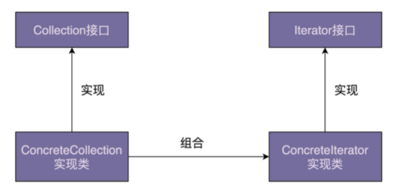
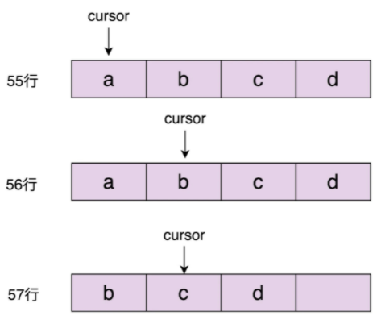
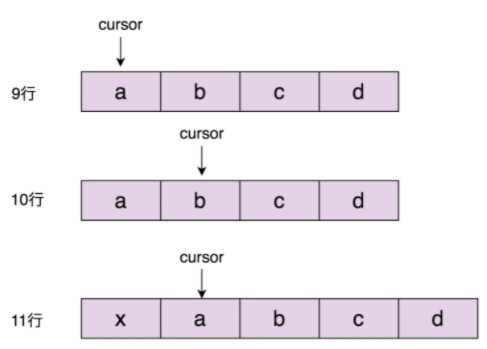

# 迭代器模式

它用来遍历集合对象。不过，很多编程语言都将迭代器作为一个基础的类库，直接提供出来了。在平时开发中，特别是业务开发，我们直接使用即可，很少会自己去实现一个迭代器。不过，知其然知其所以然，弄懂原理能帮助我们更好的使用这些工具类，所以，我们还是有必要学习一下这个模式。

## 原理

迭代器模式（Iterator Design Pattern），也叫作**==游标模式==**（Cursor Design Pattern）。

用来：遍历集合对象。

这里说的“集合对象”也可以叫“容器”“聚合对象”，实际上就是包含一组对象的对象，比如数组、链表、树、图、跳表。

应用设计模式的主要目的是解耦。迭代器模式主要作用是解耦容器代码和遍历代码。将集合对象的**==遍历操作==**从集合类中**==拆分出来==**，放到迭代器类中，让两者的职责更加单一。

迭代器是用来遍历容器的，所以，一个完整的迭代器模式一般会涉及**==容器==**和**==容器迭代器==**两部分内容。

为了达到**==基于接口而非实现==**编程的目的：

- 容器又包含：容器接口、容器实现类，
- 迭代器又包含：迭代器接口、迭代器实现类。



## 实现

Iterator 接口有两种定义方式。

```java
// 接口定义方式一
public interface Iterator<E> {
  boolean hasNext();
  void next();
  E currentItem();
}
// 接口定义方式二
public interface Iterator<E> {
  boolean hasNext();
  E next();
}
```

第一种定义方式更加灵活一些，比如我们可以多次调用 currentItem() 查询当前元素，而不移动游标。所以，在接下来的实现中，我们选择第一种接口定义方式。

```java
public class ArrayIterator<E> implements Iterator<E> {
  private int cursor;
  private ArrayList<E> arrayList;

  public ArrayIterator(ArrayList<E> arrayList) {
    this.cursor = 0;
    this.arrayList = arrayList;
  }

  @Override
  public boolean hasNext() {
    return cursor != arrayList.size(); //注意这里，cursor在指向最后一个元素的时候，hasNext()仍旧返回true。
  }

  @Override
  public void next() {
    cursor++;
  }

  @Override
  public E currentItem() {
    if (cursor >= arrayList.size()) {
      throw new NoSuchElementException();
    }
    return arrayList.get(cursor);
  }
}

public class Demo {
  public static void main(String[] args) {
    ArrayList<String> names = new ArrayList<>();
    names.add("xzg");
    names.add("wang");
    names.add("zheng");
    
    Iterator<String> iterator = new ArrayIterator(names);
    while (iterator.hasNext()) {
      System.out.println(iterator.currentItem());
      iterator.next();
    }
  }
}
```

在上面的代码实现中，我们需要将待遍历的容器对象，通过构造函数传递给迭代器类。

实际上，

- 为了封装迭代器的创建细节，我们可以在容器中定义一个 iterator() 方法，来创建对应的迭代器。
- 为了能实现基于接口而非实现编程，我们还需要将这个方法定义在 List 接口中。

```java
public interface List<E> {
  Iterator iterator();
  //...省略其他接口函数...
}

public class ArrayList<E> implements List<E> {
  //...
  public Iterator iterator() {
    return new ArrayIterator(this);
  }
  //...省略其他代码
}

public class Demo {
  public static void main(String[] args) {
    List<String> names = new ArrayList<>();
    names.add("xzg");
    names.add("wang");
    names.add("zheng");
    
    Iterator<String> iterator = names.iterator();
    while (iterator.hasNext()) {
      System.out.println(iterator.currentItem());
      iterator.next();
    }
  }
}
```

结合刚刚的例子，我们来总结一下迭代器的设计思路。总结下来就三句话：

- 迭代器中需要定义 hasNext()、currentItem()、next() 三个最基本的方法。
- 待遍历的容器对象通过依赖注入传递到迭代器类中。
- 容器通过 iterator() 方法来创建迭代器。

## 迭代器模式的优势

一般来讲，遍历集合数据有三种方法：for 循环、foreach 循环、iterator 迭代器。

```java
List<String> names = new ArrayList<>();
names.add("xzg");
names.add("wang");
names.add("zheng");

// 第一种遍历方式：for循环
for (int i = 0; i < names.size(); i++) {
  System.out.print(names.get(i) + ",");
}

// 第二种遍历方式：foreach循环
for (String name : names) {
  System.out.print(name + ",")
}

// 第三种遍历方式：迭代器遍历
Iterator<String> iterator = names.iterator();
while (iterator.hasNext()) {
  System.out.print(iterator.next() + ",");//Java中的迭代器接口是第二种定义方式，next()既移动游标又返回数据
}
```

实际上，foreach 循环只是一个语法糖而已，底层是基于迭代器来实现的。也就是说，上面代码中的第二种遍历方式（foreach 循环代码）的底层实现，就是第三种遍历方式（迭代器遍历代码）。这两种遍历方式可以看作同一种遍历方式，也就是迭代器遍历方式。

从上面的代码来看，for 循环遍历方式比起迭代器遍历方式，代码看起来更加简洁。那我们为什么还要用迭代器来遍历容器呢？为什么还要给容器设计对应的迭代器呢？原因有以下三个：

1. 首先，对于类似数组和链表这样的数据结构，遍历方式比较简单，直接使用 for 循环来遍历就足够了。但是，对于复杂的数据结构（比如树、图）来说，有各种复杂的遍历方式。比如，树有前中后序、按层遍历，图有深度优先、广度优先遍历等等。如果由客户端代码来实现这些遍历算法，势必增加开发成本，而且容易写错。如果将这部分遍历的逻辑写到容器类中，也会导致容器类代码的复杂性。

   应对复杂性的方法就是拆分。我们可以将遍历操作拆分到迭代器类中。比如，针对图的遍历，我们就可以定义 DFSIterator、BFSIterator 两个迭代器类，让它们分别来实现深度优先遍历和广度优先遍历。

2. 其次，将游标指向的当前位置等信息，存储在迭代器类中，每个迭代器独享游标信息。这样，我们就可以创建多个不同的迭代器，同时对同一个容器进行遍历而互不影响。

3. 最后，容器和迭代器都提供了抽象的接口，方便我们在开发的时候，基于接口而非具体的实现编程。当需要切换新的遍历算法的时候，比如，从前往后遍历链表切换成从后往前遍历链表，客户端代码只需要将迭代器类从 LinkedIterator 切换为 ReversedLinkedIterator 即可，其他代码都不需要修改。除此之外，添加新的遍历算法，我们只需要扩展新的迭代器类，也更符合开闭原则。

## 总结

遍历集合一般有三种方式：for 循环、foreach 循环、迭代器遍历。后两种本质上属于一种，都可以看作迭代器遍历。相对于 for 循环遍历，利用迭代器来遍历有下面三个优势：

- 迭代器模式封装集合内部的复杂数据结构，开发者不需要了解如何遍历，直接使用容器提供的迭代器即可；
- 迭代器模式将集合对象的遍历操作从集合类中拆分出来，放到迭代器类中，让两者的职责更加单一；
- 迭代器模式让添加新的遍历算法更加容易，更符合开闭原则。除此之外，因为迭代器都实现自相同的接口，在开发中，基于接口而非实现编程，替换迭代器也变得更加容易。

## 问题

### 遍历集合的同时，为什么不能增删集合元素？

#### 在遍历的同时增删集合元素会发生什么？

在通过迭代器来遍历集合元素的同时，增加或者删除集合中的元素，有可能会导致某个元素被重复遍历或遍历不到。不过，并不是所有情况下都会遍历出错，有的时候也可以正常遍历，所以，这种行为称为**==结果不可预期行为==**或者**==未决行为==**，也就是说，运行结果到底是对还是错，要视情况而定。

##### 删除元素

- 如果删除游标前面的或游标所在位置的元素，会导致某个元素遍历不到。
- 如果删除游标后面的元素，这样就不会存在任何问题了。



```java
public class Demo {  
    public static void main(String[] args) {    
        List<String> names = new ArrayList<>();
        names.add("a");    
        names.add("b");    
        names.add("c");    
        names.add("d");    
        
        Iterator<String> iterator = names.iterator();
        // 移动游标
        iterator.next();    
        // 删除元素
        names.remove("a");  
        // 输出当前游标位置的元素
        System.out.print(iterator.currentItem())
    }
}
```

##### 添加元素

- 如果在游标前或游标所在位置添加元素，存在被重复遍历的情况。
- 如果在游标后面添加元素，则不会存在任何问题。

所以，在遍历的同时添加集合元素也是一种不可预期行为。



```java
public class Demo {
  public static void main(String[] args) {
    List<String> names = new ArrayList<>();
    names.add("a");
    names.add("b");
    names.add("c");
    names.add("d");

    Iterator<String> iterator = names.iterator();
    iterator.next();
    names.add(0, "x");
    // 输出当前游标位置的元素
    System.out.print(iterator.currentItem())
  }
}
```

#### 如何应对遍历时改变集合导致的未决行为？

“不可预期”比直接出错更加可怕，有的时候运行正确，有的时候运行错误，一些隐藏很深、很难 debug 的 bug 就是这么产生的。

有两种比较干脆利索的解决方案：

- 一种是遍历的时候不允许增删元素，
- 另一种是增删元素之后让遍历报错。

实际上，第一种解决方案比较难实现，我们要确定遍历开始和结束的时间点。遍历开始的时间节点我们很容易获得。我们可以把创建迭代器的时间点作为遍历开始的时间点。但是，遍历结束的时间点该如何来确定呢？在实际的软件开发中，每次使用迭代器来遍历元素，并不一定非要把所有元素都遍历一遍，可能会使用break提前结束遍历。

第二种解决方法更加合理。Java 语言就是采用的这种解决方案。

在 ArrayList 中定义一个成员变量 modCount，记录集合被修改的次数，集合每调用一次增加或删除元素的函数，就会给 modCount 加 1。

当通过调用集合上的 iterator() 函数来创建迭代器的时候，我们把 modCount 值传递给迭代器的 expectedModCount 成员变量，之后每次调用迭代器上的 hasNext()、next()、currentItem() 函数，我们都会检查集合上的 modCount 是否等于 expectedModCount，也就是看，在创建完迭代器之后，modCount 是否改变过。

如果两个值不相同，那就说明集合存储的元素已经改变了，要么增加了元素，要么删除了元素，之前创建的迭代器已经不能正确运行了，再继续使用就会产生不可预期的结果，所以我们选择 **==fail-fast 解决方式==**，抛出运行时异常，结束掉程序，让程序员尽快修复这个因为不正确使用迭代器而产生的 bug。

#### 如何在遍历的同时安全地删除集合元素？

像 Java 语言，迭代器类中除了前面提到的几个最基本的方法之外，还定义了一个 remove() 方法，能够在遍历集合的同时，安全地删除集合中的元素。不过，需要说明的是，它并没有提供添加元素的方法。毕竟**==迭代器的主要作用是遍历，添加元素放到迭代器里本身就不合适==**。

Java 迭代器中提供的 remove() 方法还是**==比较鸡肋==**的，**==作用有限==**。它<u>**==只能删除==**游标指向的**==前一个元素==**，而且一个 next() 函数之后，只能跟着最多一个 remove() 操作，多次调用 remove() 操作会报错</u>。

在Java实现中，迭代器类新增了一个 lastRet 成员变量，用来记录游标指向的前一个元素。**==通过迭代器==**去删除这个元素的时候，我们可以更新迭代器中的游标和 lastRet 值，来保证不会因为删除元素而导致某个元素遍历不到。

如果**==通过容器==**来删除元素，并且希望更新迭代器中的游标值来保证遍历不出错，我们就要维护这个容器都创建了哪些迭代器，每个迭代器是否还在使用等信息，代码实现就变得比较复杂了。