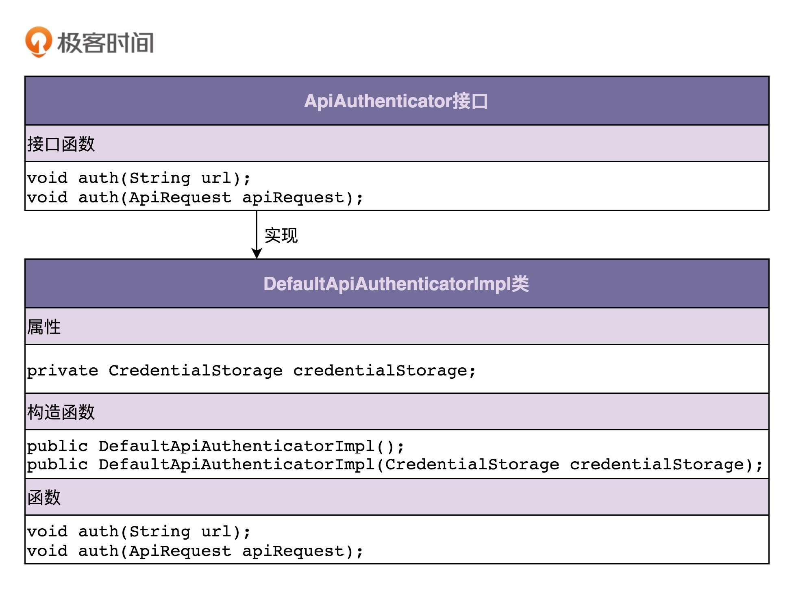

# 设计模式之美

王争

 

 

 

 

 

 

 

 

 

 

 

 

 

 

 

 

 

 

 

 

 

 

 

 

 

 

 

 

 

 

 

 

 

 

 

 

 

 

 

# 开篇词（1讲）

## 一对一的设计与编码集训，让你告别没有成长的烂代码！

你好，我是王争，是“数据结构与算法之美”专栏的作者。“数据结构与算法之美”专栏在今年 2 月底全部更新完毕。时隔 8 个月，我又给你带来了一个新的专栏“设计模式之美”。**如果说“数据结构与算法之美”是教你写出高效的代码，那这个设计模式专栏就是教你写出高质量的代码**。

### 程序员的看家本领你得练好

研究生毕业后我就加入了 Google，至今我还清晰地记得，我第一次提交代码的时候，短短的 100 多行代码，被同事 review 出了 n 多问题，来来回回改了不下十几个版本才提交上去。我当时有很大的逆反心理，觉得有必要浪费这么多时间在如此细节的编码上吗？只要代码能用、能解决问题不就够了吗？

工作一段时间之后，我才发现自己当时的想法有多幼稚。

写代码可以说是程序员天天要干的事情，要是代码都写不好，最基本的看家本领都练不好，成天堆砌烂代码，写代码还有啥意思呢？那还干啥程序员啊！写出“能用”代码的人比比皆是，但是，并不是每个人都能写出“好用”的代码。只会写能用的代码，我们永远成长不成大牛，成长不成最优秀的那批人。

后来我熟练掌握了各种编写高质量代码的技巧、方法和理论，我发现，实际上，写烂代码和好代码花费的时间是差不多的。当你把写高质量代码培养成一种开发习惯之后，在你在编写代码的时候，自然就有一种代码质量意识，自然而然就可以写出不错的代码。即便在我离开 Google 加入其他公司之后，项目的代码质量因为各种原因有所妥协，但我起码知道什么样的代码是高质量代码，丝毫不影响我具备写出高质量代码的能力。

我相信，很多工程师都很重视代码质量，毕竟谁也不想写被人吐槽的烂代码。但是，就我的了解来看，毫不夸张地讲，很多工程师，甚至一些 BAT 的员工，代码都写得惨不忍睹。一方面，在目前这种快糙猛的开发环境下，很多工程师并没有太多时间去思考如何写高质量代码；另一方面，在烂代码的熏陶下，在没有人指导的环境里，很多工程师也搞不大清楚高质量代码到底长什么样。

这就导致很多工程师写了多年代码，代码功力一点都没长进，编写的代码仍然只是能用即可，能运行就好。平日的工作就是修修补补、抄抄改改，一直在做重复劳动，能力也一直停留在“会干活”的层面，就像高速路上的收银员，只能算是一个“熟练工”。

### 一个人闷头看书效果并不好

当然，也有一些比较上进的工程师，会去找设计模式、编码规范、重构等类型的书籍去看，学习如何编写高质量的代码。实际上，我也买了很多这类的书籍来看，从这些经典的书籍中，我也学到了很多编程技巧和提高代码质量的方法。

不过，这些书籍都有一个特点，那就是比较偏重理论讲解，喜欢拿猫、狗之类生活中的例子来举例。当然，这样的例子也有优点，那就是能在简短的时间和篇幅内，很好地帮你理解原理。但同时也存在一个严重的问题，那就是过于脱离真实的软件开发。而且例子本身没有难度，你一看就觉得懂了，但是看完之后，可能还是不清楚如何将理论落地到实际的项目编码中。

比如，我们都知道著名的 KISS 原则（Keep It Simple and Stupid）。这个原则理解起来很简单，一看貌似就懂了，那我问你，怎样的代码才算是足够简单呢？怎样才算不够简单需要优化呢？估计很多人都回答不上来，因为大部分书籍都没有讲清楚。

除此之外，一个人自己闷头看书，在很多时候效果并不好。一方面，每个人的理解能力是不一样的。对于同一本书，不同理解能力的人看完之后收获也是不一样的。跟着有经验的老师学比闷头自己看书要更高效、收获更多、成长更快。另一方面，编码本身就是一门实践课，光闷头看书本理论肯定是不够的，更重要的是在实践中学习如何应用这些理论。

### 一对一手把手指导才最有效

从我的经验来看，我觉得最有效、最快速提高编码能力的方法就是，找一个比你资深的工程师，一对一、手把手地指导你写代码。你提交代码，他来指出你的问题，你再优化，这样一来一往，要不了多久，你就会发现，自己的代码能力突飞猛进。

但是，理想很丰满，现实很骨感。且不说能不能找到这样有资格指导你的人，即便能找到，他愿不愿意、有没有时间来手把手指导你，还是另外一回事。而我比较幸运，在毕业之后就加入了 Google，得到了顶尖工程师的指导，一对一地给我 review 代码，手把手地指导我如何优化代码。正因如此，在 Google 的那段时间也成为了我编码能力提高最快的一段时间。

所以，在设计专栏的初期，我就在想，如果我能模拟这样一个一对一、手把手、就真实项目代码讲解的场景，是不是就能让专栏有别于千篇一律的书籍，从而能真正提高你的代码能力呢？基于这样一个想法，我们接下来就来看，我是如何设计整个专栏内容的。

### 我是如何设计这个专栏的？

#### 100 多篇文章、50 万字、2 万多行代码

整个专栏的文章总共有 100 多篇，每篇平均下来在 5000 字左右，所以你总共需要学习 50 万字。为什么篇幅会这么多？这是因为，**我想一次性把跟编写高质量代码相关的所有知识，都系统、全面地讲清楚，一次性给你讲透彻。你看完我这一个专栏，就能搞清楚所有跟写高质量代码相关的知识点**。

除此之外，为了避免脱离代码，空洞地讲理论，专栏每篇文章平均大约有 200 多行代码，整个专栏累计有 2 万多行代码。而且，这些代码都来自我这十几年积累的真实项目，而非编造出来的阿猫阿狗、停车场、餐厅之类的没有太多实际意义的代码。

我个人写 Java 代码比较多，所以，专栏中的代码我是用 Java 语言实现的。不过，在设计专栏的时候，我已经考虑到其他不熟悉 Java 语言的小伙伴了。我力争做到，实际上我觉得也已经做到，一方面，专栏内容的讲解并不与具体的编程语言挂勾；另一方面，我只用最基本、最简单的 Java 语法，只要你有一些编程基础，不管你熟悉的是哪种编程语言，都可以看懂我写的代码，理解代码背后的设计思想。

所以，如果你熟悉的不是 Java，而是 C++、C#、PHP、Python、Go、Ruby、JavaScript 等其他编程语言，不要担心，这完全不会影响你学习这个专栏。

#### 200 多个真实的项目实战代码案例剖析

实际上，大部分设计原则、设计思想、设计模式理解起来都不难，难的是如何将这些理论灵活恰当地应用到实际的开发中，而不是教条主义和盲目滥用。而要想正确、得当地应用理论知识，光看书是不够的，我们要在实战中去亲身感受、体会这些理论该如何应用。但是，我们平时的开发更多的是基于已有的框架，照着别人的流程，扩展新的功能模块。所以，在工作中就可能没有那么多足够复杂、足够有难度的开发场景，让我们有机会去实践这些理论。

基于这种考虑，我结合自己过去工作中积累的项目经验，为整个专栏精心设计了 200 多个真实的项目实战代码案例。几乎每节课、每个知识点都会结合一个完整的开发案例来讲解。我们知道，刷算法最出名的就属 LeetCode 了。类比一下的话，我这 200 多个开发案例足以称得上是一个锻炼编写高质量代码的“LeetCode”了。跟着我一起把这 200 多个开发案例练下来，不愁代码能力提高不了！

#### 8 个月、240 天一对一手把手编程指导

前面我有提到，提高自己编码能力，最有效的手段就是让有经验的前辈一对一、手把手地指导。我经历过 Google 最严格的 Code Review，也被最顶尖的工程师指导过，也见识过最优秀的代码长什么样子，而且自己平时也比较重视代码质量，所以，我觉得我还是有挺多写代码方面的心得体会可以分享给你的。

而且，看过“数据结构与算法之美”专栏的小伙伴都知道，我这个人最大的特点就是逻辑清晰，能抓住要点把问题讲透彻。所以，对于专栏中的理论解读，我并不会照搬那些经典的大部头书籍，而是更多地融入我自己的思考和理解。或许我的解读会跟大师的不完全一样，但我都可以自成一体，并且告诉你如何落地指导具体的开发、编码，而不是很鸡汤地浮在表面来讲，让你听的时候感觉好像都懂了，感觉思想好像得到了升华，而合上书就又忘得一干二净，更别提应用到项目中了。

当然，除了理论解读之外，对于每一种设计原则、思想或者模式，我还会讲一些更深入、更本质、更有用的东西，比如，“为什么要有这种设计原则、思想或者模式？它能解决什么编程问题？有哪些应用场景？又该如何权衡、恰当地在项目中应用？”等等。

在讲解每个实战案例的时候，我会从最原始的问题代码讲起，然后告诉你缺陷在哪里，如何通过设计原则、思想、模式来优化，让你知其然知其所以然，了解背后设计的来龙去脉。我觉得，这比单纯只告诉最终的设计结果要重要得多。我也希望，你不光是被动地听我讲，而是能跟着我的节奏主动地去思考，这对你的逻辑思维训练也会很有帮助。毕竟，对于成天跟程序逻辑打交道的程序员来说，逻辑思维能力是一项非常重要的能力。我们平时要多多加强这方面的锻炼。

除此之外，专栏内容的讲解，我也刻意模拟这种一对一指导的感觉。虽然我没法真正坐在你的面前，跟你一块讨论原理、分析如何优化代码，但我力争让你在看或者听专栏的时候，就好像我在你的面前，跟你一块讨论问题一样。 整个专栏有 100 多篇文章，一周更新 3 篇，需要持续更新 8 个多月、240 多天。这就相当于我手把手指导你 8 个月写代码。我希望通过这 8 个月的指导，能把我十几年的积累统统传授给你。

#### 100 多个有深度的课堂讨论、头脑风暴

我们知道，设计问题本来就没有标准答案。 所以，不要轻信一家之言，更不要迷信我的专栏，也不要盲目追从任何一位专家、大师的说法。主动思考，积极讨论，比单纯地被动接受，学习效果要好十倍、百倍。

所以，在每节课的最后，我都设计了 1～2 道课堂讨论题，这些题目有些是代码设计相关的开放性问题，有些是具体的代码优化问题。看过我“数据结构与算法之美”专栏的小伙伴们都知道，专栏的思考题和同学们的留言，有的时候比专栏文章本身还要精彩。所以，对于这个专栏，我也希望你能积极参与，发表自己的观点。

如果你在学习完每节课程之后，都能花 5 分钟、10 分钟的时间去思考一下课堂讨论问题。这不仅对课程知识的学习很有帮助，还能锻炼你的思考能力。你要知道，独立思考能力对一个人来说是多么重要啊！

### 让我们一起见证成长

我个人觉得，“数据结构与算法之美”和“设计模式之美”是两门跟我们每天的编程开发，直接关系非常大的课程，是两门奠定一个工程师最基本的代码能力的课程。它们一个教你如何写高效代码，一个教你如何写高质量代码。弄懂了这两门课的内容，在今后的开发中，你就不需要担心写出被人吐槽的烂代码了，甚至还能让你的代码成为职场发展的一个加分项和闪光点。

前面讲到，专栏要持续更新 8 个月的时间，你可能会觉得时间好长。实际上，只要跟着专栏更新的节奏，每周认真学好 3 节课，稳扎稳打，8 个月一眨眼就过去了。而经过这 8 个月的刻意编码训练，我相信，你会发现自己因为这样的坚持学习成长了很多，不仅代码能力会提高几个档次，或许还能养成一种好的学习习惯。

最后，今天是开篇，你可以做个自我介绍，立个学习 flag。当然，你也可以留下你对专栏的期待和建议。

说起来连续 8 个月坚持学习，不是件容易事，而和志同道合的小伙伴一起，更容易找到学习的乐趣。为此，我在“极客时间小程序”发起了“8 个月，攻克设计模式”的学习打卡活动。我可以向你保证，这 8 个月只要你跟着我的节奏，踏踏实实走下来，你的代码能力一定能有一个质的飞跃。

欢迎加入，让我们一起见证成长！

# 设计模式学习导读（3讲）

## 01 | 为什么说每个程序员都要尽早地学习并掌握设计模式相关知识？

我相信，很多程序员都已经意识到基础知识的重要性，觉得要夯实基础，才能走得更远，但同时对于如何将基础知识转化成开发“生产力”仍然有些疑惑。所以，你可能看了很多基础的书籍，比如操作系统、组成原理、编译原理等，但还是觉得很迷茫，觉得在开发中用不上，起码在平时的 CRUD 业务开发中用不上。实际上，这些基础的知识确实很难直接转化成开发“生产力”。但是，它能潜移默化地、间接地提高你对技术的理解。

不过，我觉得，设计模式和操作系统、组成原理、编译原理等这些基础学科是不一样的。它虽然也算是一门基础知识，但是它和数据结构、算法更像是一道儿的，相比那些更加基础的学科，设计模式能更直接地提高你的开发能力。我在开篇词里也说了，如果说数据结构和算法是教你如何写出高效代码，那设计模式讲的是如何写出可扩展、可读、可维护的高质量代码，所以，它们跟平时的编码会有直接的关系，也会直接影响到你的开发能力。

不过，你可能还是会觉得设计模式是把屠龙刀，看起来很厉害，但平时的开发根本用不上。基于这种观点，接下来，我们就具体地聊一聊，我们为什么要学习设计模式？

### 1. 应对面试中的设计模式相关问题

学习设计模式和算法一样，最功利、最直接的目的，可能就是应对面试了。

不管你是前端工程师、后端工程师，还是全栈工程师，在求职面试中，设计模式问题是被问得频率比较高的一类问题。特别是一些像 BAT、TMD 这样的大公司，比较重视候选人的基本功，经常会拿算法、设计模式之类的问题来考察候选人。

所以，我在求职面试的时候，都会提前准备、温习一遍设计模式。尽管并不是每次面试都会被问到，但一旦被问到，如果回答得不好，就是一个败笔，这场面试基本上也就凉凉了。所以，为了保证万无一失，摆脱一旦被问到答不出来的窘境，对于设计模式这种大概率被问到的问题，我都会未雨绸缪，提前准备一下。

当然，我并不是临时抱佛脚。我平时就比较重视设计模式相关知识的积累，所以底子比较好，只需要在每次面试前花很短的时间，重新温习一下，便可以自信满满地去面试，而不是心里老是担心被问到，影响正常的面试发挥。

所以，如果你也不想让设计模式相关问题成为你面试中的短板，那跟着我把专栏中的知识点都搞清楚，以后面试再遇到设计模式相关的问题，就不会惧怕了，甚至还会成为你面试中的亮点。

### 2. 告别写被人吐槽的烂代码

我们经常说，“Talk is cheap，show me the code。”实际上，代码能力是一个程序员最基础的能力，是基本功，是展示一个程序员基础素养的最直接的衡量标准。你写的代码，实际上就是你名片。

尽管我已经工作近十年，但我一直没有脱离编码一线，现在每天也都在坚持写代码、review 指导同事写代码、重构遗留系统的烂代码。这些年的工作经历中，我见过太多的烂代码，比如命名不规范、类设计不合理、分层不清晰、没有模块化概念、代码结构混乱、高度耦合等等。这样的代码维护起来非常费劲，添加或者修改一个功能，常常会牵一发而动全身，让你无从下手，恨不得将全部的代码删掉重写！

当然，在这些年的工作经历中，我也看到过很多让我眼前一亮的代码。每当我看到这样的好代码，都会立刻对作者产生无比的好感和认可。且不管这个人处在公司的何种级别，从代码就能看出，他是一个基础扎实的高潜员工，值得培养，前途无量！因此，代码写得好，能让你在团队中脱颖而出。

所以，我的专栏，不仅仅只是讲解设计模式，更加重要的是，我会通过实战例子，手把手教你如何避免刚刚提到的代码问题，告别被人诟病的烂代码，写出令人称道的好代码，成为团队中的代码标杆！而且，写出一份漂亮的代码，你自己也会很有成就感。

### 3. 提高复杂代码的设计和开发能力

大部分工程师比较熟悉的都是编程语言、工具、框架这些东西，因为每天的工作就是在框架里根据业务需求，填充代码。实际上，我刚工作的时候，也是做这类事情。相对来说，这样的工作并不需要你具备很强的代码设计能力，只要单纯地能理解业务，翻译成代码就可以了。

但是，有一天，我的 leader 让我开发一个跟业务无关的比较通用的功能模块，面对这样稍微复杂的代码设计和开发，我就发现我有点力不从心，不知从何下手了。因为我知道只是完成功能、代码能用，可能并不复杂，但是要想写出易扩展、易用、易维护的代码，并不容易。

如何分层、分模块？应该怎么划分类？每个类应该具有哪些属性、方法？怎么设计类之间的交互？该用继承还是组合？该使用接口还是抽象类？怎样做到解耦、高内聚低耦合？该用单例模式还是静态方法？用工厂模式创建对象还是直接 new 出来？如何避免引入设计模式提高扩展性的同时带来的降低可读性问题？……各种问题，一下子挤到了我面前。

而我当时并没有对设计模式相关的知识（包括设计模式、设计原则、面向对象设计思想等）有太多的了解和积累，所以一时间搞得我手足无措。好在因此我意识到了这方面知识的重要性，所以在之后很多年的开发中，我都一直刻意锻炼、积累这方面的能力。面对复杂代码、功能、系统的设计和开发，我也越来越得心应手，游刃有余。写出高质量代码已经成为了我的习惯，不经意间写出来的代码，都能作为同事学习、临摹的范例，这也成为了我职场中最引以为豪的亮点之一。

### 4. 让读源码、学框架事半功倍

对于一个有追求的程序员来说，对技术的积累，既要有广度，也要有深度。很多技术人早早就意识到了这一点，所以在学习框架、中间件的时候，都会抽空去研究研究原理，读一读源码，希望能在深度上有所积累，而不只是略知皮毛，会用而已。

从我的经验和同事的反馈来看，有些人看源码的时候，经常会遇到看不懂、看不下去的问题。不知道你有没有遇到过这种情况？实际上，这个问题的原因很简单，那就是你积累的基本功还不够，你的能力还不足以看懂这些代码。为什么我会这么说呢？

优秀的开源项目、框架、中间件，代码量、类的个数都会比较多，类结构、类之间的关系极其复杂，常常调用来调用去。所以，为了保证代码的扩展性、灵活性、可维护性等，代码中会使用到很多设计模式、设计原则或者设计思想。如果你不懂这些设计模式、原则、思想，在看代码的时候，你可能就会琢磨不透作者的设计思路，对于一些很明显的设计思路，你可能要花费很多时间才能参悟。相反，如果你对设计模式、原则、思想非常了解，一眼就能参透作者的设计思路、设计初衷，很快就可以把脑容量释放出来，重点思考其他问题，代码读起来就会变得轻松了。

实际上，除了看不懂、看不下去的问题，还有一个隐藏的问题，你可能自己都发现不了，那就是你自己觉得看懂了，实际上，里面的精髓你并没有 get 到多少！因为优秀的开源项目、框架、中间件，就像一个集各种高精尖技术在一起的战斗机。如果你想剖析它的原理、学习它的技术，而你没有积累深厚的基本功，就算把这台战斗机摆在你面前，你也不能完全参透它的精髓，只是了解个皮毛，看个热闹而已。

因此，学好设计模式相关的知识，不仅能让你更轻松地读懂开源项目，还能更深入地参透里面的技术精髓，做到事半功倍。

### 5. 为你的职场发展做铺垫

普通的、低级别的开发工程师，只需要把框架、开发工具、编程语言用熟练，再做几个项目练练手，基本上就能应付平时的开发工作了。但是，如果你不想一辈子做一个低级的码农，想成长为技术专家、大牛、技术 leader，希望在职场有更高的成就、更好的发展，那就要重视基本功的训练、基础知识的积累。

你去看大牛写的代码，或者优秀的开源项目，代码写得都非常的优美，质量都很高。如果你只是框架用得很溜，架构聊得头头是道，但写出来的代码很烂，让人一眼就能看出很多不合理的、可以改进的地方，那你永远都成不了别人心目中的“技术大牛”。

再者，在技术这条职场道路上，当成长到一定阶段之后，你势必要承担一些指导培养初级员工、新人，以及 code review 的工作。这个时候，如果你自己都对“什么是好的代码？如何写出好的代码？”不了解，那又该如何指导别人，如何让人家信服呢？

还有，如果你是一个技术 leader，负责一个项目整体的开发工作，你就需要为开发进度、开发效率和项目质量负责。你也不希望团队堆砌垃圾代码，让整个项目无法维护，添加、修改一个功能都要费老大劲，最终拉低整个团队的开发效率吧？

除此之外，代码质量低还会导致线上 bug 频发，排查困难。整个团队都陷在成天修改无意义的低级 bug、在烂代码中添补丁的事情中。而一个设计良好、易维护的系统，可以解放我们的时间，让我们做些更加有意义、更能提高自己和团队能力的事情。

最后，当你成为 leader、或者团队中的资深工程师、技术专家之后，你势必要负责一部分团队的招聘工作。这个时候，如果你要考察候选人的设计能力、代码能力，那设计模式相关的问题便是一个很好的考察点。

不过，我也了解到，很多面试官实际上对设计模式也并不是很了解，只能拿一些简单的单例模式、工厂模式来考察候选人，而且所出的题目往往都脱离实践，比如，如何设计一个餐厅系统、停车场系统、售票系统等。这些题目都是网上万年不变的老题目，几乎考察不出候选人的能力。在我的专栏中，有 200 多个真实项目开发中的设计模式相关问题，你跟着看下来，足以让你成为设计模式方面的大牛，再来面试候选人的时候，就不用因为题目老套、脱离实践而尴尬了！

### 重点回顾

今天，我们讲了为什么要学习设计模式相关的知识，总结一下的话，主要有这样五点：应对面试中的设计模式相关问题；告别写被人吐槽的烂代码；提高复杂代码的设计和开发能力；让读源码、学框架事半功倍；为你的职场发展做铺垫。

投资要趁早，这样我们才能尽早享受复利。同样，有些能力，要早点锻炼；有些东西，要早点知道；有些书，要早点读。这样在你后面的生活、工作、学习中，才能一直都发挥作用。不要等到好多年后，看到了，才恍然大悟，后悔没有早点去学、去看。

设计模式作为一门与编码、开发有着直接关系的基础知识，是你现在就要开始学习的。早点去学习，以后的项目就都可以拿来锻炼，每写一行代码都是对内功的利用和加深，是可以受益一整个职业生涯的事情。

## 02 | 从哪些维度评判代码质量的好坏？如何具备写出高质量代码的能力？

在我的工作经历中，每当同事评论起项目代码质量的时候，听到的最多的评语就是：“代码写得很烂”或者“代码写得很好”。用“好”“烂”这样的字眼来描述，非常地笼统。当我具体问到底如何烂、如何好的时候，尽管大部分同事都能简单地罗列上几个点，但往往都不够全面、非常零碎，也切不中要害。

当然，也有一些工程师对如何评价代码质量有所认识，比如，好代码是易扩展、易读、简单、易维护的等等，但他们对于这些评价的理解往往只停留在表面概念上，对于诸多更深入的问题，比如，“怎么才算可读性好？什么样的代码才算易扩展、易维护？可读、可扩展与可维护之间有什么关系？可维护中‘维护’两字该如何理解？”等等，并没有太清晰的认识。

对于程序员来说，辨别代码写得“好”还是“烂”，是一个非常重要的能力。这也是我们写出好代码的前提。毕竟，如果我们连什么是好代码、什么是烂代码，都分辨不清，又谈何写出好代码呢？

所以，今天我们就聊一聊关于代码质量评判的相关问题，希望你在学完今天的内容之后，对代码质量的评判有个更加清晰、更加透彻的认识和理解。

### 如何评价代码质量的高低？

实际上，咱们平时嘴中常说的“好”和“烂”，是对代码质量的一种描述。“好”笼统地表示代码质量高，“烂”笼统地表示代码质量低。对于代码质量的描述，除了“好”“烂”这样比较简单粗暴的描述方式之外，我们也经常会听到很多其他的描述方式。这些描述方法语义更丰富、更专业、更细化。我搜集整理了一下，罗列在了下面。这些几乎涵盖我们所能听到的描述代码质量的所有常用词汇，你可以看一看。

> 灵活性（flexibility）、可扩展性（extensibility）、可维护性（maintainability）、可读性（readability）、可理解性（understandability）、易修改性（changeability）、可复用（reusability）、可测试性（testability）、模块化（modularity）、高内聚低耦合（high cohesion loose coupling）、高效（high effciency）、高性能（high performance）、安全性（security）、兼容性（compatibility）、易用性（usability）、整洁（clean）、清晰（clarity）、简单（simple）、直接（straightforward）、少即是多（less code is more）、文档详尽（well-documented）、分层清晰（well-layered）、正确性（correctness、bug free）、健壮性（robustness）、鲁棒性（robustness）、可用性（reliability）、可伸缩性（scalability）、稳定性（stability）、优雅（elegant）、好（good）、坏（bad）……

看到如此多的描述词，你可能要问了，我们到底该用哪些词来描述一段代码的质量呢？

实际上，我们很难通过其中的某个或者某几个词汇来全面地评价代码质量。因为这些词汇都是从不同维度来说的。这就好比，对于一个人的评价，我们需要综合各个方面来给出，比如性格、相貌、能力、财富等等。代码质量高低也是一个综合各种因素得到的结论。我们并不能通过单一的维度去评价一段代码写的好坏。比如，即使一段代码的可扩展性很好，但可读性很差，那我们也不能说这段代码质量高。

除此之外，不同的评价维度也并不是完全独立的，有些是具有包含关系、重叠关系或者可以互相影响的。比如，代码的可读性好、可扩展性好，就意味着代码的可维护性好。而且，各种评价维度也不是非黑即白的。比如，我们不能简单地将代码分为可读与不可读。如果用数字来量化代码的可读性的话，它应该是一个连续的区间值，而非 0、1 这样的离散值。

不过，我们真的可以客观地量化一段代码质量的高低吗？答案是否定的。对一段代码的质量评价，常常有很强的主观性。比如，怎么样的代码才算可读性好，每个人的评判标准都不大一样。这就好比我们去评价一本小说写得是否精彩，本身就是一个很难量化的、非常主观的事情。

正是因为代码质量评价的主观性，使得这种主观评价的准确度，跟工程师自身经验有极大的关系。越是有经验的工程师，给出的评价也就越准确。相反，资历比较浅的工程师就常常会觉得，没有一个可执行的客观的评价标准作为参考，很难准确地判断一段代码写得好与坏。有的时候，自己觉得代码写得已经够好了，但实际上并不是。所以，这也导致如果没有人指导的话，自己一个人闷头写代码，即便写再多的代码，代码能力也可能一直没有太大提高。

### 最常用的评价标准有哪几个？

仔细看前面罗列的所有代码质量评价标准，你会发现，有些词语过于笼统、抽象，比较偏向对于整体的描述，比如优雅、好、坏、整洁、清晰等；有些过于细节、偏重方法论，比如模块化、高内聚低耦合、文档详尽、分层清晰等；有些可能并不仅仅局限于编码，跟架构设计等也有关系，比如可伸缩性、可用性、稳定性等。

为了做到有的放矢、有重点地学习，我挑选了其中几个最常用的、最重要的评价标准，来详细讲解，其中就包括：可维护性、可读性、可扩展性、灵活性、简洁性（简单、复杂）、可复用性、可测试性。接下来，我们逐一讲解一下。

#### 1. 可维护性（maintainability）

我们首先来看，什么是代码的“可维护性”？所谓的“维护代码”到底包含哪些具体工作？

落实到编码开发，所谓的“维护”无外乎就是修改 bug、修改老的代码、添加新的代码之类的工作。所谓“代码易维护”就是指，在不破坏原有代码设计、不引入新的 bug 的情况下，能够快速地修改或者添加代码。所谓“代码不易维护”就是指，修改或者添加代码需要冒着极大的引入新 bug 的风险，并且需要花费很长的时间才能完成。

我们知道，对于一个项目来说，维护代码的时间远远大于编写代码的时间。工程师大部分的时间可能都是花在修修 bug、改改老的功能逻辑、添加一些新的功能逻辑之类的工作上。所以，代码的可维护性就显得格外重要。

维护、易维护、不易维护这三个概念不难理解。不过，对于实际的软件开发来说，更重要的是搞清楚，如何来判断代码可维护性的好坏。

实际上，可维护性也是一个很难量化、偏向对代码整体的评价标准，它有点类似之前提到的“好”“坏”“优雅”之类的笼统评价。代码的可维护性是由很多因素协同作用的结果。代码的可读性好、简洁、可扩展性好，就会使得代码易维护；相反，就会使得代码不易维护。更细化地讲，如果代码分层清晰、模块化好、高内聚低耦合、遵从基于接口而非实现编程的设计原则等等，那就可能意味着代码易维护。除此之外，代码的易维护性还跟项目代码量的多少、业务的复杂程度、利用到的技术的复杂程度、文档是否全面、团队成员的开发水平等诸多因素有关。

所以，从正面去分析一个代码是否易维护稍微有点难度。不过，我们可以从侧面上给出一个比较主观但又比较准确的感受。如果 bug 容易修复，修改、添加功能能够轻松完成，那我们就可以主观地认为代码对我们来说易维护。相反，如果修改一个 bug，修改、添加一个功能，需要花费很长的时间，那我们就可以主观地认为代码对我们来说不易维护。

你可能会说，这样的评价方式也太主观了吧？没错，是否易维护本来就是针对维护的人来说的。不同水平的人对于同一份代码的维护能力并不是相同的。对于同样一个系统，熟悉它的资深工程师会觉得代码的可维护性还不错，而一些新人因为不熟悉代码，修改 bug、修改添加代码要花费很长的时间，就有可能会觉得代码的可维护性不那么好。这实际上也印证了我们之前的观点：代码质量的评价有很强的主观性。

#### 2. 可读性（readability）

软件设计大师 Martin Fowler 曾经说过：“Any fool can write code that a computer can understand. Good programmers write code that humans can understand.”翻译成中文就是：“任何傻瓜都会编写计算机能理解的代码。好的程序员能够编写人能够理解的代码。”Google 内部甚至专门有个认证就叫作 Readability。只有拿到这个认证的工程师，才有资格在 code review 的时候，批准别人提交代码。可见代码的可读性有多重要，毕竟，代码被阅读的次数远远超过被编写和执行的次数。

我个人认为，代码的可读性应该是评价代码质量最重要的指标之一。我们在编写代码的时候，时刻要考虑到代码是否易读、易理解。除此之外，代码的可读性在非常大程度上会影响代码的可维护性。毕竟，不管是修改 bug，还是修改添加功能代码，我们首先要做的事情就是读懂代码。代码读不大懂，就很有可能因为考虑不周全，而引入新的 bug。

既然可读性如此重要，那我们又该如何评价一段代码的可读性呢？

我们需要看代码是否符合编码规范、命名是否达意、注释是否详尽、函数是否长短合适、模块划分是否清晰、是否符合高内聚低耦合等等。你应该也能感觉到，从正面上，我们很难给出一个覆盖所有评价指标的列表。这也是我们无法量化可读性的原因。

实际上，code review 是一个很好的测验代码可读性的手段。如果你的同事可以轻松地读懂你写的代码，那说明你的代码可读性很好；如果同事在读你的代码时，有很多疑问，那就说明你的代码可读性有待提高了。

#### 3. 可扩展性（extensibility）

可扩展性也是一个评价代码质量非常重要的标准。它表示我们的代码应对未来需求变化的能力。跟可读性一样，代码是否易扩展也很大程度上决定代码是否易维护。那到底什么是代码的可扩展性呢？

代码的可扩展性表示，我们在不修改或少量修改原有代码的情况下，通过扩展的方式添加新的功能代码。说直白点就是，代码预留了一些功能扩展点，你可以把新功能代码，直接插到扩展点上，而不需要因为要添加一个功能而大动干戈，改动大量的原始代码。

关于代码的扩展性，在后面讲到“对修改关闭，对扩展开放”这条设计原则的时候，我会来详细讲解，今天我们只需要知道，代码的可扩展性是评价代码质量非常重要的标准就可以了。

#### 4. 灵活性（flexibility）

灵活性也是描述代码质量的一个常用词汇。比如我们经常会听到这样的描述：“代码写得很灵活”。那这里的“灵活”该如何理解呢？

尽管有很多人用这个词汇来描述代码的质量。但实际上，灵活性是一个挺抽象的评价标准，要给灵活性下个定义也是挺难的。不过，我们可以想一下，什么情况下我们才会说代码写得好灵活呢？我这里罗列了几个场景，希望能引发你自己对什么是灵活性的思考。

- 当我们添加一个新的功能代码的时候，原有的代码已经预留好了扩展点，我们不需要修改原有的代码，只要在扩展点上添加新的代码即可。这个时候，我们除了可以说代码易扩展，还可以说代码写得好灵活。
- 当我们要实现一个功能的时候，发现原有代码中，已经抽象出了很多底层可以复用的模块、类等代码，我们可以拿来直接使用。这个时候，我们除了可以说代码易复用之外，还可以说代码写得好灵活。
- 当我们使用某组接口的时候，如果这组接口可以应对各种使用场景，满足各种不同的需求，我们除了可以说接口易用之外，还可以说这个接口设计得好灵活或者代码写得好灵活。

从刚刚举的场景来看，如果一段代码易扩展、易复用或者易用，我们都可以称这段代码写得比较灵活。所以，灵活这个词的含义非常宽泛，很多场景下都可以使用。

#### 5. 简洁性（simplicity）

有一条非常著名的设计原则，你一定听过，那就是 KISS 原则：“Keep It Simple，Stupid”。这个原则说的意思就是，尽量保持代码简单。代码简单、逻辑清晰，也就意味着易读、易维护。我们在编写代码的时候，往往也会把简单、清晰放到首位。

不过，很多编程经验不足的程序员会觉得，简单的代码没有技术含量，喜欢在项目中引入一些复杂的设计模式，觉得这样才能体现自己的技术水平。实际上，***\*思从深而行从简，真正的高手能云淡风轻地用最简单的方法解决最复杂的问题。这也是一个编程老手跟编程新手的本质区别之一\****。

除此之外，虽然我们都能认识到，代码要尽量写得简洁，符合 KISS 原则，但怎么样的代码才算足够简洁？不是每个人都能很准确地判断出来这一点。所以，在后面的章节中，当我们讲到 KISS 原则的时候，我会通过具体的代码实例，详细给你解释，“为什么 KISS 原则看似非常简单、好理解，但实际上用好并不容易”。今天，我们就暂且不展开详细讲解了。

#### 6. 可复用性（reusability）

代码的可复用性可以简单地理解为，尽量减少重复代码的编写，复用已有的代码。在后面的很多章节中，我们都会经常提到“可复用性”这一代码评价标准。

比如，当讲到面向对象特性的时候，我们会讲到继承、多态存在的目的之一，就是为了提高代码的可复用性；当讲到设计原则的时候，我们会讲到单一职责原则也跟代码的可复用性相关；当讲到重构技巧的时候，我们会讲到解耦、高内聚、模块化等都能提高代码的可复用性。可见，可复用性也是一个非常重要的代码评价标准，是很多设计原则、思想、模式等所要达到的最终效果。

实际上，代码可复用性跟 DRY（Don’t Repeat Yourself）这条设计原则的关系挺紧密的，所以，在后面的章节中，当我们讲到 DRY 设计原则的时候，我还会讲更多代码复用相关的知识，比如，“有哪些编程方法可以提高代码的复用性”等。

#### 7. 可测试性（testability）

相对于前面六个评价标准，代码的可测试性是一个相对较少被提及，但又非常重要的代码质量评价标准。代码可测试性的好坏，能从侧面上非常准确地反应代码质量的好坏。代码的可测试性差，比较难写单元测试，那基本上就能说明代码设计得有问题。关于代码的可测试性，我们在重构那一部分，会花两节课的时间来详细讲解。现在，你暂时只需要知道，代码的可测试性非常重要就可以了。

### 如何才能写出高质量的代码？

我相信每个工程师都想写出高质量的代码，不想一直写没有成长、被人吐槽的烂代码。那如何才能写出高质量的代码呢？针对什么是高质量的代码，我们刚刚讲到了七个最常用、最重要的评价指标。所以，问如何写出高质量的代码，也就等同于在问，如何写出易维护、易读、易扩展、灵活、简洁、可复用、可测试的代码。

要写出满足这些评价标准的高质量代码，我们需要掌握一些更加细化、更加能落地的编程方法论，包括面向对象设计思想、设计原则、设计模式、编码规范、重构技巧等。而所有这些编程方法论的最终目的都是为了编写出高质量的代码。

比如，面向对象中的继承、多态能让我们写出可复用的代码；编码规范能让我们写出可读性好的代码；设计原则中的单一职责、DRY、基于接口而非实现、里式替换原则等，可以让我们写出可复用、灵活、可读性好、易扩展、易维护的代码；设计模式可以让我们写出易扩展的代码；持续重构可以时刻保持代码的可维护性等等。具体这些编程方法论是如何提高代码的可维护性、可读性、可扩展性等等的呢？我们在后面的课程中慢慢来学习。

### 重点回顾

今天的内容到此就讲完了。我们来一起回顾一下，你需要重点掌握的几个知识点。

#### 1. 如何评价代码质量的高低？

代码质量的评价有很强的主观性，描述代码质量的词汇也有很多，比如可读性、可维护性、灵活、优雅、简洁等，这些词汇是从不同的维度去评价代码质量的。它们之间有互相作用，并不是独立的，比如，代码的可读性好、可扩展性好就意味着代码的可维护性好。代码质量高低是一个综合各种因素得到的结论。我们并不能通过单一的维度去评价一段代码的好坏。

#### 2. 最常用的评价标准有哪几个？

最常用到几个评判代码质量的标准是：可维护性、可读性、可扩展性、灵活性、简洁性、可复用性、可测试性。其中，可维护性、可读性、可扩展性又是提到最多的、最重要的三个评价标准。

#### 3. 如何才能写出高质量的代码？

要写出高质量代码，我们就需要掌握一些更加细化、更加能落地的编程方法论，这就包含面向对象设计思想、设计原则、设计模式、编码规范、重构技巧等等，这也是我们后面课程学习的重点。

## 03 | 面向对象、设计原则、设计模式、编程规范、重构，这五者有何关系？

在上一节课中，我们讲到，要具备编写高质量代码的能力，你需要学习一些编程方法论，其中就包含面向对象（我们可以把它看成一种设计思想）、设计原则、设计模式、编程规范、重构技巧等。而我们整个专栏的内容也是围绕着这几块展开讲解的。所以，今天我就先来简单介绍一下这几个概念，并且说一说它们之间的联系。

今天的内容相当于专栏的一个教学大纲，或者说学习框架。它能让你对整个专栏所涉及的知识点，有一个全局性的了解，能帮你将后面零散的知识更系统地组织在大脑里。

话不多说，我们就一块来看一下，接下来的这 8 个月我们到底要学习哪些内容吧！面向对象

### 面向对象

现在，主流的编程范式或者是编程风格有三种，它们分别是面向过程、面向对象和函数式编程。面向对象这种编程风格又是这其中最主流的。现在比较流行的编程语言大部分都是面向对象编程语言。大部分项目也都是基于面向对象编程风格开发的。面向对象编程因为其具有丰富的特性（封装、抽象、继承、多态），可以实现很多复杂的设计思路，是很多设计原则、设计模式编码实现的基础。

所以，在专栏的最开始，我们会详细地讲解面向对象编程的相关的知识，为学习后面的内容做铺垫。对于这部分内容，你需要掌握下面这 7 个大的知识点。

- 面向对象的四大特性：封装、抽象、继承、多态
- 面向对象编程与面向过程编程的区别和联系
- 面向对象分析、面向对象设计、面向对象编程
- 接口和抽象类的区别以及各自的应用场景
- 基于接口而非实现编程的设计思想
- 多用组合少用继承的设计思想
- 面向过程的贫血模型和面向对象的充血模型

### 设计原则

设计原则是指导我们代码设计的一些经验总结。设计原则这块儿的知识有一个非常大的特点，那就是这些原则听起来都比较抽象，定义描述都比较模糊，不同的人会有不同的解读。所以，如果单纯地去记忆定义，对于编程、设计能力的提高，意义并不大。对于每一种设计原则，我们需要掌握它的设计初衷，能解决哪些编程问题，有哪些应用场景。只有这样，我们才能在项目中灵活恰当地应用这些原则。

对于这一部分内容，你需要透彻理解并且掌握，如何应用下面这样几个常用的设计原则。

- SOLID 原则 -SRP 单一职责原则
- SOLID 原则 -OCP 开闭原则
- SOLID 原则 -LSP 里式替换原则
- SOLID 原则 -ISP 接口隔离原则
- SOLID 原则 -DIP 依赖倒置原则
- DRY 原则、KISS 原则、YAGNI 原则、LOD 法则

### 设计模式

设计模式是针对软件开发中经常遇到的一些设计问题，总结出来的一套解决方案或者设计思路。大部分设计模式要解决的都是代码的可扩展性问题。设计模式相对于设计原则来说，没有那么抽象，而且大部分都不难理解，代码实现也并不复杂。这一块的学习难点是了解它们都能解决哪些问题，掌握典型的应用场景，并且懂得不过度应用。

经典的设计模式有 23 种。随着编程语言的演进，一些设计模式（比如 Singleton）也随之过时，甚至成了反模式，一些则被内置在编程语言中（比如 Iterator），另外还有一些新的模式诞生（比如 Monostate）。

在专栏中，我们会重点讲解 23 种经典的设计模式。它们又可以分为三大类：创建型、结构型、行为型。对于这 23 种设计模式的学习，我们要有侧重点，因为有些模式是比较常用的，有些模式是很少被用到的。对于常用的设计模式，我们要花多点时间理解掌握。对于不常用的设计模式，我们只需要稍微了解即可。

我按照类型和是否常用，对专栏中讲到的这些设计模式，进行了简单的分类，具体如下所示。

#### 1. 创建型

常用的有：单例模式、工厂模式（工厂方法和抽象工厂）、建造者模式。

不常用的有：原型模式。

#### 2. 结构型

常用的有：代理模式、桥接模式、装饰者模式、适配器模式。

不常用的有：门面模式、组合模式、享元模式。

#### 3. 行为型

常用的有：观察者模式、模板模式、策略模式、职责链模式、迭代器模式、状态模式。

不常用的有：访问者模式、备忘录模式、命令模式、解释器模式、中介模式。

### 编程规范

编程规范主要解决的是代码的可读性问题。编码规范相对于设计原则、设计模式，更加具体、更加偏重代码细节。即便你可能对设计原则不熟悉、对设计模式不了解，但你最起码要掌握基本的编码规范，比如，如何给变量、类、函数命名，如何写代码注释，函数不宜过长、参数不能过多等等。

对于编码规范，考虑到很多书籍已经讲得很好了（比如《重构》《代码大全》《代码整洁之道》等）。而且，每条编码规范都非常简单、非常明确，比较偏向于记忆，你只要照着来做可以。它不像设计原则，需要融入很多个人的理解和思考。所以，在这个专栏中，我并没有花太多的篇幅来讲解所有的编码规范，而是总结了我认为的最能改善代码质量的 20 条规范。如果你暂时没有时间去看那些经典的书籍，看我这些就够了。

除此之外，专栏并没有将编码规范单独作为一个模块来讲解，而是跟重构放到了一起。之所以这样做，那是因为我把重构分为大重构和小重构两种类型，而小重构利用的知识基本上就是编码规范。

除了编码规范，我们还会介绍一些代码的坏味道，让你知道什么样的代码是不符合规范的，应该如何优化。参照编码规范，你可以写出可读性好的代码；参照代码的坏味道，你可以找出代码存在的可读性问题。

### 代码重构

在软件开发中，只要软件在不停地迭代，就没有一劳永逸的设计。随着需求的变化，代码的不停堆砌，原有的设计必定会存在这样那样的问题。针对这些问题，我们就需要进行代码重构。重构是软件开发中非常重要的一个环节。持续重构是保持代码质量不下降的有效手段，能有效避免代码腐化到无可救药的地步。

而重构的工具就是我们前面罗列的那些面向对象设计思想、设计原则、设计模式、编码规范。实际上，设计思想、设计原则、设计模式一个最重要的应用场景就是在重构的时候。我们前面讲过，虽然使用设计模式可以提高代码的可扩展性，但过度不恰当地使用，也会增加代码的复杂度，影响代码的可读性。在开发初期，除非特别必须，我们一定不要过度设计，应用复杂的设计模式。而是当代码出现问题的时候，我们再针对问题，应用原则和模式进行重构。这样就能有效避免前期的过度设计。

对于重构这部分内容，你需要掌握以下几个知识点：

- 重构的目的（why）、对象（what）、时机（when）、方法（how）；
- 保证重构不出错的技术手段：单元测试和代码的可测试性；
- 两种不同规模的重构：大重构（大规模高层次）和小重构（小规模低层次）。

希望你学完这部分内容之后，不仅仅是掌握一些重构技巧、套路，更重要的是建立持续重构意识，把重构当作开发的一部分，融入到日常的开发中。

### 五者之间的联系

关于面向对象、设计原则、设计模式、编程规范和代码重构，这五者的关系我们前面稍微提到了一些，我这里再总结梳理一下。

- 面向对象编程因为其具有丰富的特性（封装、抽象、继承、多态），可以实现很多复杂的设计思路，是很多设计原则、设计模式等编码实现的基础。
- 设计原则是指导我们代码设计的一些经验总结，对于某些场景下，是否应该应用某种设计模式，具有指导意义。比如，“开闭原则”是很多设计模式（策略、模板等）的指导原则。
- 设计模式是针对软件开发中经常遇到的一些设计问题，总结出来的一套解决方案或者设计思路。应用设计模式的主要目的是提高代码的可扩展性。从抽象程度上来讲，设计原则比设计模式更抽象。设计模式更加具体、更加可执行。
- 编程规范主要解决的是代码的可读性问题。编码规范相对于设计原则、设计模式，更加具体、更加偏重代码细节、更加能落地。持续的小重构依赖的理论基础主要就是编程规范。
- 重构作为保持代码质量不下降的有效手段，利用的就是面向对象、设计原则、设计模式、编码规范这些理论。

实际上，面向对象、设计原则、设计模式、编程规范、代码重构，这五者都是保持或者提高代码质量的方法论，本质上都是服务于编写高质量代码这一件事的。当我们追本逐源，看清这个本质之后，很多事情怎么做就清楚了，很多选择怎么选也清楚了。比如，在某个场景下，该不该用这个设计模式，那就看能不能提高代码的可扩展性；要不要重构，那就看重代码是否存在可读、可维护问题等。

### 重点回顾

今天的内容到此就讲完了。我画了一张图，总结了专栏中所涉及的知识点。在学习后面的课程的时候，你可以经常翻出来看一下，建立全局意识，不至于迷失在零碎的知识点中。


### 课堂讨论

今天课堂讨论的话题有两个。

1. 在今天讲到的内容中，你觉得哪一部分内容对提高代码质量最有效？为什么？除了我罗列的这些内容之外，你还知道哪些可以提高代码质量的方法？
2. 我们知道，最经典的设计模式书籍是 GoF 的《设计模式》，它的中文全称是《设计模式：可复用面向对象软件的基础》，英文全称是“Design Patterns: Elements of Reusable Object-Oriented Software”。为什么它在标题中会特意提到“面向对象”呢？

# 设计原则与思想：面向对象（11讲）

## 04 | 理论一：当谈论面向对象的时候，我们到底在谈论什么？

考虑到各个水平层次的同学，并且保证专栏内容的系统性、全面性，我会循序渐进地讲解跟设计模式相关的所有内容。所以，专栏正文的第一个模块，我会讲一些设计原则、设计思想，比如，面向对象设计思想、经典设计原则以及重构相关的知识，为之后学习设计模式做铺垫。

在第一个模块中，我们又首先会讲到面向对象相关的理论知识。提到面向对象，我相信很多人都不陌生，随口都可以说出面向对象的四大特性：封装、抽象、继承、多态。实际上，面向对象这个概念包含的内容还不止这些。所以，今天我打算花一节课的时间，先大概跟你聊一下，当我们谈论面向对象的时候，经常会谈到的一些概念和知识点，为学习后面的几节更加细化的内容做一个铺垫。

特别说明一下，对于今天讲到的概念和知识点，大部分我都是点到为止，并没有展开详细讲解。如果你看了之后，对某个概念和知识点还不是很清楚，那也没有关系。在后面的几节课中，我会花更多的篇幅，对今天讲到的每个概念和知识点，结合具体的例子，一一做详细的讲解。

### 什么是面向对象编程和面向对象编程语言？

面向对象编程的英文缩写是 OOP，全称是 Object Oriented Programming。对应地，面向对象编程语言的英文缩写是 OOPL，全称是 Object Oriented Programming Language。

面向对象编程中有两个非常重要、非常基础的概念，那就是类（class）和对象（object）。这两个概念最早出现在 1960 年，在 Simula 这种编程语言中第一次使用。而面向对象编程这个概念第一次被使用是在 Smalltalk 这种编程语言中。Smalltalk 被认为是第一个真正意义上的面向对象编程语言。

1980 年左右，C++ 的出现，带动了面向对象编程的流行，也使得面向对象编程被越来越多的人认可。直到今天，如果不按照严格的定义来说，大部分编程语言都是面向对象编程语言，比如 Java、C++、Go、Python、C#、Ruby、JavaScript、Objective-C、Scala、PHP、Perl 等等。除此之外，大部分程序员在开发项目的时候，都是基于面向对象编程语言进行的面向对象编程。

以上是面向对象编程的大概发展历史。在刚刚的描述中，我着重提到了两个概念，面向对象编程和面向对象编程语言。那究竟什么是面向对象编程？什么语言才算是面向对象编程语言呢？如果非得给出一个定义的话，我觉得可以用下面两句话来概括。

- 面向对象编程是一种编程范式或编程风格。它以类或对象作为组织代码的基本单元，并将封装、抽象、继承、多态四个特性，作为代码设计和实现的基石 。
- 面向对象编程语言是支持类或对象的语法机制，并有现成的语法机制，能方便地实现面向对象编程四大特性（封装、抽象、继承、多态）的编程语言。

一般来讲， 面向对象编程都是通过使用面向对象编程语言来进行的，但是，不用面向对象编程语言，我们照样可以进行面向对象编程。反过来讲，即便我们使用面向对象编程语言，写出来的代码也不一定是面向对象编程风格的，也有可能是面向过程编程风格的。这里听起来是不是有点绕？不过没关系，我们在后面的第 7 节课中，会详细讲解这个问题。

除此之外，从定义中，我们还可以发现，理解面向对象编程及面向对象编程语言两个概念，其中最关键的一点就是理解面向对象编程的四大特性。这四大特性分别是：封装、抽象、继承、多态。不过，关于面向对象编程的特性，也有另外一种说法，那就是只包含三大特性：封装、继承、多态，不包含抽象。为什么会有这种分歧呢？抽象为什么可以排除在面向对象编程特性之外呢？关于这个问题，在下一节课详细讲解这四大特性的时候，我还会再拿出来说一下。不过，话说回来，实际上，我们没必要纠结到底是四大特性还是三大特性，关键还是理解每种特性讲的是什么内容、存在的意义以及能解决什么问题。

而且，在技术圈里，封装、抽象、继承、多态也并不是固定地被叫作“四大特性”（features），也有人称它们为面向对象编程的四大概念（concepts）、四大基石（cornerstones）、四大基础（fundamentals）、四大支柱（pillars）等等。你也发现了吧，叫法挺混乱的。不过，叫什么并不重要。我们只需要知道，这是前人进行面向对象编程过程中总结出来的、能让我们更容易地实现各种设计思路的几个编程套路，这就够了。在之后的课程讲解中，我统一把它们叫作“四大特性”。

### 如何判定某编程语言是否是面向对象编程语言？

如果你足够细心，你可能已经留意到，在我刚刚的讲解中，我提到，“如果不按照严格的定义来说，大部分编程语言都是面向对象编程语言”。为什么要加上“如果不按照严格的定义”这个前提呢？那是因为，如果按照刚刚我们给出的严格的面向对象编程语言的定义，前面提到的有些编程语言，并不是严格意义上的面向对象编程语言，比如 JavaScript，它不支持封装和继承特性，按照严格的定义，它不算是面向对象编程语言，但在某种意义上，它又可以算得上是一种面向对象编程语言。我为什么这么说呢？到底该如何判断一个编程语言是否是面向对象编程语言呢？

还记得我们前面给出的面向对象编程及面向对象编程语言的定义吗？如果忘记了，你可以先翻到上面回顾一下。不过，我必须坦诚告诉你，那个定义是我自己给出的。实际上，对于什么是面向对象编程、什么是面向对象编程语言，并没有一个官方的、统一的定义。而且，从 1960 年，也就是 60 年前面向对象编程诞生开始，这两个概念就在不停地演化，所以，也无法给出一个明确的定义，也没有必要给出一个明确定义。

实际上，面向对象编程从字面上，按照最简单、最原始的方式来理解，就是将对象或类作为代码组织的基本单元，来进行编程的一种编程范式或者编程风格，并不一定需要封装、抽象、继承、多态这四大特性的支持。但是，在进行面向对象编程的过程中，人们不停地总结发现，有了这四大特性，我们就能更容易地实现各种面向对象的代码设计思路。

比如，我们在面向对象编程的过程中，经常会遇到 is-a 这种类关系（比如狗是一种动物），而继承这个特性就能很好地支持这种 is-a 的代码设计思路，并且解决代码复用的问题，所以，继承就成了面向对象编程的四大特性之一。但是随着编程语言的不断迭代、演化，人们发现继承这种特性容易造成层次不清、代码混乱，所以，很多编程语言在设计的时候就开始摒弃继承特性，比如 Go 语言。但是，我们并不能因为它摒弃了继承特性，就一刀切地认为它不是面向对象编程语言了。

实际上，我个人觉得，只要某种编程语言支持类或对象的语法概念，并且以此作为组织代码的基本单元，那就可以被粗略地认为它就是面向对象编程语言了。至于是否有现成的语法机制，完全地支持了面向对象编程的四大特性、是否对四大特性有所取舍和优化，可以不作为判定的标准。基于此，我们才有了前面的说法，**按照严格的定义，很多语言都不能算得上面向对象编程语言，但按照不严格的定义来讲，现在流行的大部分编程语言都是面向对象编程语言。**

所以，多说一句，关于这个问题，我们一定不要过于学院派，非要给面向对象编程、面向对象编程语言下个死定义，非得对某种语言是否是面向对象编程语言争个一清二白，这样做意义不大。

### 什么是面向对象分析和面向对象设计？

前面我们讲了面向对象编程（OOP），实际上，跟面向对象编程经常放到一块儿来讲的还有另外两个概念，那就是面向对象分析（OOA）和面向对象设计（OOD）。面向对象分析英文缩写是 OOA，全称是 Object Oriented Analysis；面向对象设计的英文缩写是 OOD，全称是 Object Oriented Design。OOA、OOD、OOP 三个连在一起就是面向对象分析、设计、编程（实现），正好是面向对象软件开发要经历的三个阶段。

关于什么是面向对象编程，我们前面已经讲过了。我们现在再来讲一下，什么是面向对象分析和设计。这两个概念相对来说要简单一些。面向对象分析与设计中的“分析”和“设计”这两个词，我们完全可以从字面上去理解，不需要过度解读，简单类比软件开发中的需求分析、系统设计即可。不过，你可能会说，那为啥前面还加了个修饰词“面向对象”呢？有什么特殊的意义吗？

之所以在前面加“面向对象”这几个字，是因为我们是围绕着对象或类来做需求分析和设计的。分析和设计两个阶段最终的产出是类的设计，包括程序被拆解为哪些类，每个类有哪些属性方法，类与类之间如何交互等等。它们比其他的分析和设计更加具体、更加落地、更加贴近编码，更能够顺利地过渡到面向对象编程环节。这也是面向对象分析和设计，与其他分析和设计最大的不同点。

看到这里，你可能会问，那面向对象分析、设计、编程到底都负责做哪些工作呢？简单点讲，面向对象分析就是要搞清楚做什么，面向对象设计就是要搞清楚怎么做，面向对象编程就是将分析和设计的的结果翻译成代码的过程。今天，我们只是简单介绍一下概念，不展开详细讲解。在后面的面向对象实战环节中，我会用两节课的时间，通过一个实际例子，详细讲解如何进行面向对象分析、设计和编程。

### 什么是 UML？我们是否需要 UML？

讲到面向对象分析、设计、编程，我们就不得不提到另外一个概念，那就是 UML（Unified Model Language），统一建模语言。很多讲解面向对象或设计模式的书籍，常用它来画图表达面向对象或设计模式的设计思路。

实际上，UML 是一种非常复杂的东西。它不仅仅包含我们常提到类图，还有用例图、顺序图、活动图、状态图、组件图等。在我看来，即便仅仅使用类图，学习成本也是很高的。就单说类之间的关系，UML 就定义了很多种，比如泛化、实现、关联、聚合、组合、依赖等。

要想完全掌握，并且熟练运用这些类之间的关系，来画 UML 类图，肯定要花很多的学习精力。而且，UML 作为一种沟通工具，即便你能完全按照 UML 规范来画类图，可对于不熟悉的人来说，看懂的成本也还是很高的。

所以，从我的开发经验来说，UML 在互联网公司的项目开发中，用处可能并不大。为了文档化软件设计或者方便讨论软件设计，大部分情况下，我们随手画个不那么规范的草图，能够达意，方便沟通就够了，而完全按照 UML 规范来将草图标准化，所付出的代价是不值得的。

所以，我这里特别说明一下，专栏中的很多类图我并没有完全遵守 UML 的规范标准。为了兼顾图的表达能力和你的学习成本，我对 UML 类图规范做了简化，并配上了详细的文字解释，力图让你一眼就能看懂，而非适得其反，让图加重你的学习成本。毕竟，我们的专栏并不是一个讲方法论的教程，专栏中的所有类图，本质是让你更清晰地理解设计。

### 重点回顾

今天的内容讲完了，我们来一起总结回顾一下，你需要重点掌握的几个概念和知识点。

#### 1. 什么是面向对象编程？

面向对象编程是一种编程范式或编程风格。它以类或对象作为组织代码的基本单元，并将封装、抽象、继承、多态四个特性，作为代码设计和实现的基石 。

#### 2. 什么是面向对象编程语言？

面向对象编程语言是支持类或对象的语法机制，并有现成的语法机制，能方便地实现面向对象编程四大特性（封装、抽象、继承、多态）的编程语言。

#### 3. 如何判定一个编程语言是否是面向对象编程语言？

如果按照严格的的定义，需要有现成的语法支持类、对象、四大特性才能叫作面向对象编程语言。如果放宽要求的话，只要某种编程语言支持类、对象语法机制，那基本上就可以说这种编程语言是面向对象编程语言了，不一定非得要求具有所有的四大特性。

#### 4. 面向对象编程和面向对象编程语言之间有何关系？

面向对象编程一般使用面向对象编程语言来进行，但是，不用面向对象编程语言，我们照样可以进行面向对象编程。反过来讲，即便我们使用面向对象编程语言，写出来的代码也不一定是面向对象编程风格的，也有可能是面向过程编程风格的。

#### 5. 什么是面向对象分析和面向对象设计？

简单点讲，面向对象分析就是要搞清楚做什么，面向对象设计就是要搞清楚怎么做。两个阶段最终的产出是类的设计，包括程序被拆解为哪些类，每个类有哪些属性方法、类与类之间如何交互等等。

### 课堂讨论

今天我们要讨论的话题有两个：

1. 在文章中，我讲到 UML 的学习成本很高，沟通成本也不低，不推荐在面向对象分析、设计的过程中使用，对此你有何看法？
2. 有关面向对象的概念和知识点，除了我们今天讲到的，你还能想到其他哪些吗？

## 05 | 理论二：封装、抽象、继承、多态分别可以解决哪些编程问题？

上一节课，我简单介绍了面向对象的一些基本概念和知识点，比如，什么是面向对象编程，什么是面向对象编程语言等等。其中，我们还提到，理解面向对象编程及面向对象编程语言的关键就是理解其四大特性：封装、抽象、继承、多态。不过，对于这四大特性，光知道它们的定义是不够的，我们还要知道每个特性存在的意义和目的，以及它们能解决哪些编程问题。所以，今天我就花一节课的时间，针对每种特性，结合实际的代码，带你将这些问题搞清楚。

这里我要强调一下，对于这四大特性，尽管大部分面向对象编程语言都提供了相应的语法机制来支持，但不同的编程语言实现这四大特性的语法机制可能会有所不同。所以，今天，我们在讲解四大特性的时候，并不与具体某种编程语言的特定语法相挂钩，同时，也希望你不要局限在你自己熟悉的编程语言的语法思维框架里。

### 封装（Encapsulation）

首先，我们来看封装特性。封装也叫作信息隐藏或者数据访问保护。类通过暴露有限的访问接口，授权外部仅能通过类提供的方式（或者叫函数）来访问内部信息或者数据。这句话怎么理解呢？我们通过一个简单的例子来解释一下。

下面这段代码是金融系统中一个简化版的虚拟钱包的代码实现。在金融系统中，我们会给每个用户创建一个虚拟钱包，用来记录用户在我们的系统中的虚拟货币量。对于虚拟钱包的业务背景，这里你只需要简单了解一下即可。在面向对象的实战篇中，我们会有单独两节课，利用 OOP 的设计思想来详细介绍虚拟钱包的设计实现。

```java
public class Wallet {
  private String id;
  private long createTime;
  private BigDecimal balance;
  private long balanceLastModifiedTime;
  // ...省略其他属性...

  public Wallet() {
     this.id = IdGenerator.getInstance().generate();
     this.createTime = System.currentTimeMillis();
     this.balance = BigDecimal.ZERO;
     this.balanceLastModifiedTime = System.currentTimeMillis();
  }

  // 注意：下面对get方法做了代码折叠，是为了减少代码所占文章的篇幅
  public String getId() { return this.id; }
  public long getCreateTime() { return this.createTime; }
  public BigDecimal getBalance() { return this.balance; }
  public long getBalanceLastModifiedTime() { return this.balanceLastModifiedTime;  }

  public void increaseBalance(BigDecimal increasedAmount) {
    if (increasedAmount.compareTo(BigDecimal.ZERO) < 0) {
      throw new InvalidAmountException("...");
    }
    this.balance.add(increasedAmount);
    this.balanceLastModifiedTime = System.currentTimeMillis();
  }

  public void decreaseBalance(BigDecimal decreasedAmount) {
    if (decreasedAmount.compareTo(BigDecimal.ZERO) < 0) {
      throw new InvalidAmountException("...");
    }
    if (decreasedAmount.compareTo(this.balance) > 0) {
      throw new InsufficientAmountException("...");
    }
    this.balance.subtract(decreasedAmount);
    this.balanceLastModifiedTime = System.currentTimeMillis();
  }
}
```

从代码中，我们可以发现，Wallet 类主要有四个属性（也可以叫作成员变量），也就是我们前面定义中提到的信息或者数据。其中，id 表示钱包的唯一编号，createTime 表示钱包创建的时间，balance 表示钱包中的余额，balanceLastModifiedTime 表示上次钱包余额变更的时间。

我们参照封装特性，对钱包的这四个属性的访问方式进行了限制。调用者只允许通过下面这六个方法来访问或者修改钱包里的数据。

- String getId()
- long getCreateTime()
- BigDecimal getBalance()
- long getBalanceLastModifiedTime()
- void increaseBalance(BigDecimal increasedAmount)
- void decreaseBalance(BigDecimal decreasedAmount)

之所以这样设计，是因为从业务的角度来说，id、createTime 在创建钱包的时候就确定好了，之后不应该再被改动，所以，我们并没有在 Wallet 类中，暴露 id、createTime 这两个属性的任何修改方法，比如 set 方法。而且，这两个属性的初始化设置，对于 Wallet 类的调用者来说，也应该是透明的，所以，我们在 Wallet 类的构造函数内部将其初始化设置好，而不是通过构造函数的参数来外部赋值。

对于钱包余额 balance 这个属性，从业务的角度来说，只能增或者减，不会被重新设置。所以，我们在 Wallet 类中，只暴露了 increaseBalance() 和 decreaseBalance() 方法，并没有暴露 set 方法。对于 balanceLastModifiedTime 这个属性，它完全是跟 balance 这个属性的修改操作绑定在一起的。只有在 balance 修改的时候，这个属性才会被修改。所以，我们把 balanceLastModifiedTime 这个属性的修改操作完全封装在了 increaseBalance() 和 decreaseBalance() 两个方法中，不对外暴露任何修改这个属性的方法和业务细节。这样也可以保证 balance 和 balanceLastModifiedTime 两个数据的一致性。

对于封装这个特性，我们需要编程语言本身提供一定的语法机制来支持。这个语法机制就是**访问权限控制**。例子中的 private、public 等关键字就是 Java 语言中的访问权限控制语法。private 关键字修饰的属性只能类本身访问，可以保护其不被类之外的代码直接访问。如果 Java 语言没有提供访问权限控制语法，所有的属性默认都是 public 的，那任意外部代码都可以通过类似 wallet.id=123; 这样的方式直接访问、修改属性，也就没办法达到隐藏信息和保护数据的目的了，也就无法支持封装特性了。

**封装特性的定义讲完了，我们再来看一下，封装的意义是什么？它能解决什么编程问题？**

如果我们对类中属性的访问不做限制，那任何代码都可以访问、修改类中的属性，虽然这样看起来更加灵活，但从另一方面来说，过度灵活也意味着不可控，属性可以随意被以各种奇葩的方式修改，而且修改逻辑可能散落在代码中的各个角落，势必影响代码的可读性、可维护性。比如某个同事在不了解业务逻辑的情况下，在某段代码中“偷偷地”重设了 wallet 中的 balanceLastModifiedTime 属性，这就会导致 balance 和 balanceLastModifiedTime 两个数据不一致。

除此之外，类仅仅通过有限的方法暴露必要的操作，也能提高类的易用性。如果我们把类属性都暴露给类的调用者，调用者想要正确地操作这些属性，就势必要对业务细节有足够的了解。而这对于调用者来说也是一种负担。相反，如果我们将属性封装起来，暴露少许的几个必要的方法给调用者使用，调用者就不需要了解太多背后的业务细节，用错的概率就减少很多。这就好比，如果一个冰箱有很多按钮，你就要研究很长时间，还不一定能操作正确。相反，如果只有几个必要的按钮，比如开、停、调节温度，你一眼就能知道该如何来操作，而且操作出错的概率也会降低很多。

### 抽象（Abstraction）

讲完了封装特性，我们再来看抽象特性。 封装主要讲的是如何隐藏信息、保护数据，而抽象讲的是如何隐藏方法的具体实现，让调用者只需要关心方法提供了哪些功能，并不需要知道这些功能是如何实现的。

在面向对象编程中，我们常借助编程语言提供的接口类（比如 Java 中的 interface 关键字语法）或者抽象类（比如 Java 中的 abstract 关键字语法）这两种语法机制，来实现抽象这一特性。

这里我稍微说明一下，在专栏中，我们把编程语言提供的接口语法叫作“接口类”而不是“接口”。之所以这么做，是因为“接口”这个词太泛化，可以指好多概念，比如 API 接口等，所以，我们用“接口类”特指编程语言提供的接口语法。

对于抽象这个特性，我举一个例子来进一步解释一下。

```java
public interface IPictureStorage {
  void savePicture(Picture picture);
  Image getPicture(String pictureId);
  void deletePicture(String pictureId);
  void modifyMetaInfo(String pictureId, PictureMetaInfo metaInfo);
}

public class PictureStorage implements IPictureStorage {
  // ...省略其他属性...
  @Override
  public void savePicture(Picture picture) { ... }
  @Override
  public Image getPicture(String pictureId) { ... }
  @Override
  public void deletePicture(String pictureId) { ... }
  @Override
  public void modifyMetaInfo(String pictureId, PictureMetaInfo metaInfo) { ... }
}
```

在上面的这段代码中，我们利用 Java 中的 interface 接口语法来实现抽象特性。调用者在使用图片存储功能的时候，只需要了解 IPictureStorage 这个接口类暴露了哪些方法就可以了，不需要去查看 PictureStorage 类里的具体实现逻辑。

实际上，抽象这个特性是非常容易实现的，并不需要非得依靠接口类或者抽象类这些特殊语法机制来支持。换句话说，并不是说一定要为实现类（PictureStorage）抽象出接口类（IPictureStorage），才叫作抽象。即便不编写 IPictureStorage 接口类，单纯的 PictureStorage 类本身就满足抽象特性。

之所以这么说，那是因为，类的方法是通过编程语言中的“函数”这一语法机制来实现的。通过函数包裹具体的实现逻辑，这本身就是一种抽象。调用者在使用函数的时候，并不需要去研究函数内部的实现逻辑，只需要通过函数的命名、注释或者文档，了解其提供了什么功能，就可以直接使用了。比如，我们在使用 C 语言的 malloc() 函数的时候，并不需要了解它的底层代码是怎么实现的。

除此之外，在上一节课中，我们还提到，抽象有时候会被排除在面向对象的四大特性之外，当时我卖了一个关子，现在我就来解释一下为什么。

抽象这个概念是一个非常通用的设计思想，并不单单用在面向对象编程中，也可以用来指导架构设计等。而且这个特性也并不需要编程语言提供特殊的语法机制来支持，只需要提供“函数”这一非常基础的语法机制，就可以实现抽象特性、所以，它没有很强的“特异性”，有时候并不被看作面向对象编程的特性之一。

**抽象特性的定义讲完了，我们再来看一下，抽象的意义是什么？它能解决什么编程问题？**

实际上，如果上升一个思考层面的话，抽象及其前面讲到的封装都是人类处理复杂性的有效手段。在面对复杂系统的时候，人脑能承受的信息复杂程度是有限的，所以我们必须忽略掉一些非关键性的实现细节。而抽象作为一种只关注功能点不关注实现的设计思路，正好帮我们的大脑过滤掉许多非必要的信息。

除此之外，抽象作为一个非常宽泛的设计思想，在代码设计中，起到非常重要的指导作用。很多设计原则都体现了抽象这种设计思想，比如基于接口而非实现编程、开闭原则（对扩展开放、对修改关闭）、代码解耦（降低代码的耦合性）等。我们在讲到后面的内容的时候，会具体来解释。

换一个角度来考虑，我们在定义（或者叫命名）类的方法的时候，也要有抽象思维，不要在方法定义中，暴露太多的实现细节，以保证在某个时间点需要改变方法的实现逻辑的时候，不用去修改其定义。举个简单例子，比如 getAliyunPictureUrl() 就不是一个具有抽象思维的命名，因为某一天如果我们不再把图片存储在阿里云上，而是存储在私有云上，那这个命名也要随之被修改。相反，如果我们定义一个比较抽象的函数，比如叫作 getPictureUrl()，那即便内部存储方式修改了，我们也不需要修改命名。

### 继承（Inheritance）

学习完了封装和抽象两个特性，我们再来看继承特性。如果你熟悉的是类似 Java、C++ 这样的面向对象的编程语言，那你对继承这一特性，应该不陌生了。继承是用来表示类之间的 is-a 关系，比如猫是一种哺乳动物。从继承关系上来讲，继承可以分为两种模式，单继承和多继承。单继承表示一个子类只继承一个父类，多继承表示一个子类可以继承多个父类，比如猫既是哺乳动物，又是爬行动物。

为了实现继承这个特性，编程语言需要提供特殊的语法机制来支持，比如 Java 使用 extends 关键字来实现继承，C++ 使用冒号（class B : public A），Python 使用 parentheses ()，Ruby 使用 <。不过，有些编程语言只支持单继承，不支持多重继承，比如 Java、PHP、C#、Ruby 等，而有些编程语言既支持单重继承，也支持多重继承，比如 C++、Python、Perl 等。

为什么有些语言支持多重继承，有些语言不支持呢？这个问题留给你自己去研究，你可以针对你熟悉的编程语言，在留言区写一写具体的原因。

**继承特性的定义讲完了，我们再来看，继承存在的意义是什么？它能解决什么编程问题？**

继承最大的一个好处就是代码复用。假如两个类有一些相同的属性和方法，我们就可以将这些相同的部分，抽取到父类中，让两个子类继承父类。这样，两个子类就可以重用父类中的代码，避免代码重复写多遍。不过，这一点也并不是继承所独有的，我们也可以通过其他方式来解决这个代码复用的问题，比如利用组合关系而不是继承关系。

如果我们再上升一个思维层面，去思考继承这一特性，可以这么理解：我们代码中有一个猫类，有一个哺乳动物类。猫属于哺乳动物，从人类认知的角度上来说，是一种 is-a 关系。我们通过继承来关联两个类，反应真实世界中的这种关系，非常符合人类的认知，而且，从设计的角度来说，也有一种结构美感。

继承的概念很好理解，也很容易使用。不过，过度使用继承，继承层次过深过复杂，就会导致代码可读性、可维护性变差。为了了解一个类的功能，我们不仅需要查看这个类的代码，还需要按照继承关系一层一层地往上查看“父类、父类的父类……”的代码。还有，子类和父类高度耦合，修改父类的代码，会直接影响到子类。

所以，继承这个特性也是一个非常有争议的特性。很多人觉得继承是一种反模式。我们应该尽量少用，甚至不用。关于这个问题，在后面讲到“多用组合少用继承”这种设计思想的时候，我会非常详细地再讲解，这里暂时就不展开讲解了。

### 多态（Polymorphism）

学习完了封装、抽象、继承之后，我们再来看面向对象编程的最后一个特性，多态。多态是指，子类可以替换父类，在实际的代码运行过程中，调用子类的方法实现。对于多态这种特性，纯文字解释不好理解，我们还是看一个具体的例子。

```java
public class DynamicArray {
  private static final int DEFAULT_CAPACITY = 10;
  protected int size = 0;
  protected int capacity = DEFAULT_CAPACITY;
  protected Integer[] elements = new Integer[DEFAULT_CAPACITY];
  
  public int size() { return this.size; }
  public Integer get(int index) { return elements[index];}
  //...省略n多方法...
  
  public void add(Integer e) {
    ensureCapacity();
    elements[size++] = e;
  }
  
  protected void ensureCapacity() {
    //...如果数组满了就扩容...代码省略...
  }
}

public class SortedDynamicArray extends DynamicArray {
  @Override
  public void add(Integer e) {
    ensureCapacity();
    int i;
    for (i = size-1; i>=0; --i) { //保证数组中的数据有序
      if (elements[i] > e) {
        elements[i+1] = elements[i];
      } else {
        break;
      }
    }
    elements[i+1] = e;
    ++size;
  }
}

public class Example {
  public static void test(DynamicArray dynamicArray) {
    dynamicArray.add(5);
    dynamicArray.add(1);
    dynamicArray.add(3);
    for (int i = 0; i < dynamicArray.size(); ++i) {
      System.out.println(dynamicArray.get(i));
    }
  }
  
  public static void main(String args[]) {
    DynamicArray dynamicArray = new SortedDynamicArray();
    test(dynamicArray); // 打印结果：1、3、5
  }
}
```

多态这种特性也需要编程语言提供特殊的语法机制来实现。在上面的例子中，我们用到了三个语法机制来实现多态。

- 第一个语法机制是编程语言要支持父类对象可以引用子类对象，也就是可以将 SortedDynamicArray 传递给 DynamicArray。
- 第二个语法机制是编程语言要支持继承，也就是 SortedDynamicArray 继承了 DynamicArray，才能将 SortedDyamicArray 传递给 DynamicArray。
- 第三个语法机制是编程语言要支持子类可以重写（override）父类中的方法，也就是 SortedDyamicArray 重写了 DynamicArray 中的 add() 方法。

通过这三种语法机制配合在一起，我们就实现了在 test() 方法中，子类 SortedDyamicArray 替换父类 DynamicArray，执行子类 SortedDyamicArray 的 add() 方法，也就是实现了多态特性。

对于多态特性的实现方式，除了利用“继承加方法重写”这种实现方式之外，我们还有其他两种比较常见的的实现方式，一个是利用接口类语法，另一个是利用 duck-typing 语法。不过，并不是每种编程语言都支持接口类或者 duck-typing 这两种语法机制，比如 C++ 就不支持接口类语法，而 duck-typing 只有一些动态语言才支持，比如 Python、JavaScript 等。

**接下来，我们先来看如何利用接口类来实现多态特性**。我们还是先来看一段代码。

```java
public interface Iterator {
  boolean hasNext();
  String next();
  String remove();
}

public class Array implements Iterator {
  private String[] data;
  
  public boolean hasNext() { ... }
  public String next() { ... }
  public String remove() { ... }
  //...省略其他方法...
}

public class LinkedList implements Iterator {
  private LinkedListNode head;
  
  public boolean hasNext() { ... }
  public String next() { ... }
  public String remove() { ... }
  //...省略其他方法... 
}

public class Demo {
  private static void print(Iterator iterator) {
    while (iterator.hasNext()) {
      System.out.println(iterator.next());
    }
  }
  
  public static void main(String[] args) {
    Iterator arrayIterator = new Array();
    print(arrayIterator);
    
    Iterator linkedListIterator = new LinkedList();
    print(linkedListIterator);
  }
}
```

在这段代码中，Iterator 是一个接口类，定义了一个可以遍历集合数据的迭代器。Array 和 LinkedList 都实现了接口类 Iterator。我们通过传递不同类型的实现类（Array、LinkedList）到 print(Iterator iterator) 函数中，支持动态的调用不同的 next()、hasNext() 实现。

具体点讲就是，当我们往 print(Iterator iterator) 函数传递 Array 类型的对象的时候，print(Iterator iterator) 函数就会调用 Array 的 next()、hasNext() 的实现逻辑；当我们往 print(Iterator iterator) 函数传递 LinkedList 类型的对象的时候，print(Iterator iterator) 函数就会调用 LinkedList 的 next()、hasNext() 的实现逻辑。

**刚刚讲的是用接口类来实现多态特性。现在，我们再来看下，如何用 duck-typing 来实现多态特性**。我们还是先来看一段代码。这是一段 Python 代码。

```java
class Logger:
    def record(self):
        print(“I write a log into file.”)
        
class DB:
    def record(self):
        print(“I insert data into db. ”)
        
def test(recorder):
    recorder.record()

def demo():
    logger = Logger()
    db = DB()
    test(logger)
    test(db)
```

从这段代码中，我们发现，duck-typing 实现多态的方式非常灵活。Logger 和 DB 两个类没有任何关系，既不是继承关系，也不是接口和实现的关系，但是只要它们都有定义了 record() 方法，就可以被传递到 test() 方法中，在实际运行的时候，执行对应的 record() 方法。

也就是说，只要两个类具有相同的方法，就可以实现多态，并不要求两个类之间有任何关系，这就是所谓的 duck-typing，是一些动态语言所特有的语法机制。而像 Java 这样的静态语言，通过继承实现多态特性，必须要求两个类之间有继承关系，通过接口实现多态特性，类必须实现对应的接口。

**多态特性讲完了，我们再来看，多态特性存在的意义是什么？它能解决什么编程问题？**

多态特性能提高代码的可扩展性和复用性。为什么这么说呢？我们回过头去看讲解多态特性的时候，举的第二个代码实例（Iterator 的例子）。

在那个例子中，我们利用多态的特性，仅用一个 print() 函数就可以实现遍历打印不同类型（Array、LinkedList）集合的数据。当再增加一种要遍历打印的类型的时候，比如 HashMap，我们只需让 HashMap 实现 Iterator 接口，重新实现自己的 hasNext()、next() 等方法就可以了，完全不需要改动 print() 函数的代码。所以说，多态提高了代码的可扩展性。

如果我们不使用多态特性，我们就无法将不同的集合类型（Array、LinkedList）传递给相同的函数（print(Iterator iterator) 函数）。我们需要针对每种要遍历打印的集合，分别实现不同的 print() 函数，比如针对 Array，我们要实现 print(Array array) 函数，针对 LinkedList，我们要实现 print(LinkedList linkedList) 函数。而利用多态特性，我们只需要实现一个 print() 函数的打印逻辑，就能应对各种集合数据的打印操作，这显然提高了代码的复用性。

除此之外，多态也是很多设计模式、设计原则、编程技巧的代码实现基础，比如策略模式、基于接口而非实现编程、依赖倒置原则、里式替换原则、利用多态去掉冗长的 if-else 语句等等。关于这点，在学习后面的章节中，你慢慢会有更深的体会。

### 重点回顾

今天的内容就讲完了，我们来一起总结回顾一下，你需要重点掌握的几个知识点。

#### 1. 关于封装特性

封装也叫作信息隐藏或者数据访问保护。类通过暴露有限的访问接口，授权外部仅能通过类提供的方式来访问内部信息或者数据。它需要编程语言提供权限访问控制语法来支持，例如 Java 中的 private、protected、public 关键字。封装特性存在的意义，一方面是保护数据不被随意修改，提高代码的可维护性；另一方面是仅暴露有限的必要接口，提高类的易用性。

#### 2. 关于抽象特性

封装主要讲如何隐藏信息、保护数据，那抽象就是讲如何隐藏方法的具体实现，让使用者只需要关心方法提供了哪些功能，不需要知道这些功能是如何实现的。抽象可以通过接口类或者抽象类来实现，但也并不需要特殊的语法机制来支持。抽象存在的意义，一方面是提高代码的可扩展性、维护性，修改实现不需要改变定义，减少代码的改动范围；另一方面，它也是处理复杂系统的有效手段，能有效地过滤掉不必要关注的信息。

#### 3. 关于继承特性

继承是用来表示类之间的 is-a 关系，分为两种模式：单继承和多继承。单继承表示一个子类只继承一个父类，多继承表示一个子类可以继承多个父类。为了实现继承这个特性，编程语言需要提供特殊的语法机制来支持。继承主要是用来解决代码复用的问题。

#### 4. 关于多态特性

多态是指子类可以替换父类，在实际的代码运行过程中，调用子类的方法实现。多态这种特性也需要编程语言提供特殊的语法机制来实现，比如继承、接口类、duck-typing。多态可以提高代码的扩展性和复用性，是很多设计模式、设计原则、编程技巧的代码实现基础。

### 课堂讨论

今天我们要讨论的话题有如下两个。

1. 你熟悉的编程语言是否支持多重继承？如果不支持，请说一下为什么不支持。如果支持，请说一下它是如何避免多重继承的副作用的。
2. 你熟悉的编程语言对于四大特性是否都有现成的语法支持？对于支持的特性，是通过什么语法机制实现的？对于不支持的特性，又是基于什么原因做的取舍？

## 06 | 理论三：面向对象相比面向过程有哪些优势？面向过程真的过时了吗？

在上两节课中，我们讲了面向对象这种现在非常流行的编程范式，或者说编程风格。实际上，除了面向对象之外，被大家熟知的编程范式还有另外两种，面向过程编程和函数式编程。面向过程这种编程范式随着面向对象的出现，已经慢慢退出了舞台，而函数式编程目前还没有被广泛接受。

在专栏中，我不会对函数式编程做讲解，但我会花两节课的时间，讲一下面向过程这种编程范式。你可能会问，既然面向对象已经成为主流的编程范式，而面向过程已经不那么推荐使用，那为什么又要浪费时间讲它呢？

那是因为在过往的工作中，我发现很多人搞不清楚面向对象和面向过程的区别，总以为使用面向对象编程语言来做开发，就是在进行面向对象编程了。而实际上，他们只是在用面向对象编程语言，编写面向过程风格的代码而已，并没有发挥面向对象编程的优势。这就相当于手握一把屠龙刀，却只是把它当作一把普通的刀剑来用，相当可惜。

所以，我打算详细对比一下面向过程和面向对象这两种编程范式，带你一块搞清楚下面这几个问题（前三个问题我今天讲解，后三个问题我放到下一节课中讲解）：

1. 什么是面向过程编程与面向过程编程语言？
2. 面向对象编程相比面向过程编程有哪些优势？
3. 为什么说面向对象编程语言比面向过程编程语言更高级？
4. 有哪些看似是面向对象实际是面向过程风格的代码？
5. 在面向对象编程中，为什么容易写出面向过程风格的代码？
6. 面向过程编程和面向过程编程语言就真的无用武之地了吗？

话不多说，带着这几个问题，我们就正式开始今天的学习吧！

### 什么是面向过程编程与面向过程编程语言？

如果你是一名比较资深的程序员，最开始学习编程的时候，接触的是 Basic、Pascal、C 等面向过程的编程语言，那你对这两个概念肯定不陌生。但如果你是新生代的程序员，一开始学编程的时候，接触的就是面向对象编程语言，那你对这两个概念可能会比较不熟悉。所以，在对比面向对象与面向过程优劣之前，我们先把面向过程编程和面向过程编程语言这两个概念搞清楚。

实际上，我们可以对比着面向对象编程和面向对象编程语言这两个概念，来理解面向过程编程和面向过程编程语言。还记得我们之前是如何定义面向对象编程和面向对象编程语言的吗？让我们一块再来回顾一下。

- 面向对象编程是一种编程范式或编程风格。它以类或对象作为组织代码的基本单元，并将封装、抽象、继承、多态四个特性，作为代码设计和实现的基石 。
- 面向对象编程语言是支持类或对象的语法机制，并有现成的语法机制，能方便地实现面向对象编程四大特性（封装、抽象、继承、多态）的编程语言。

类比面向对象编程与面向对象编程语言的定义，对于面向过程编程和面向过程编程语言这两个概念，我给出下面这样的定义。

- 面向过程编程也是一种编程范式或编程风格。它以过程（可以理解为方法、函数、操作）作为组织代码的基本单元，以数据（可以理解为成员变量、属性）与方法相分离为最主要的特点。面向过程风格是一种流程化的编程风格，通过拼接一组顺序执行的方法来操作数据完成一项功能。
- 面向过程编程语言首先是一种编程语言。它最大的特点是不支持类和对象两个语法概念，不支持丰富的面向对象编程特性（比如继承、多态、封装），仅支持面向过程编程。

不过，这里我必须声明一下，就像我们在之前讲到的，面向对象编程和面向对象编程语言并没有官方的定义一样，这里我给出的面向过程编程和面向过程编程语言的定义，也并不是严格的官方定义。之所以要给出这样的定义，只是为了跟面向对象编程及面向对象编程语言做个对比，以方便你理解它们的区别。

定义不是很严格，也比较抽象，所以，我再用一个例子进一步解释一下。假设我们有一个记录了用户信息的文本文件 users.txt，每行文本的格式是 name&age&gender（比如，小王 &28& 男）。我们希望写一个程序，从 users.txt 文件中逐行读取用户信息，然后格式化成 name\tage\tgender（其中，\t 是分隔符）这种文本格式，并且按照 age 从小到大排序之后，重新写入到另一个文本文件 formatted_users.txt 中。针对这样一个小程序的开发，我们一块来看看，用面向过程和面向对象两种编程风格，编写出来的代码有什么不同。

首先，我们先来看，用面向过程这种编程风格写出来的代码是什么样子的。注意，下面的代码是用 C 语言这种面向过程的编程语言来编写的。

```c
struct User {
  char name[64];
  int age;
  char gender[16];
};

struct User parse_to_user(char* text) {
  // 将text(“小王&28&男”)解析成结构体struct User
}

char* format_to_text(struct User user) {
  // 将结构体struct User格式化成文本（"小王\t28\t男"）
}

void sort_users_by_age(struct User users[]) {
  // 按照年龄从小到大排序users
}

void format_user_file(char* origin_file_path, char* new_file_path) {
  // open files...
  struct User users[1024]; // 假设最大1024个用户
  int count = 0;
  while(1) { // read until the file is empty
    struct User user = parse_to_user(line);
    users[count++] = user;
  }
  
  sort_users_by_age(users);
  
  for (int i = 0; i < count; ++i) {
    char* formatted_user_text = format_to_text(users[i]);
    // write to new file...
  }
  // close files...
}

int main(char** args, int argv) {
  format_user_file("/home/zheng/user.txt", "/home/zheng/formatted_users.txt");
}
```

然后，我们再来看，用面向对象这种编程风格写出来的代码是什么样子的。注意，下面的代码是用 Java 这种面向对象的编程语言来编写的。

```java
public class User {
  private String name;
  private int age;
  private String gender;
  
  public User(String name, int age, String gender) {
    this.name = name;
    this.age = age;
    this.gender = gender;
  }
  
  public static User praseFrom(String userInfoText) {
    // 将text(“小王&28&男”)解析成类User
  }
  
  public String formatToText() {
    // 将类User格式化成文本（"小王\t28\t男"）
  }
}

public class UserFileFormatter {
  public void format(String userFile, String formattedUserFile) {
    // Open files...
    List users = new ArrayList<>();
    while (1) { // read until file is empty 
      // read from file into userText...
      User user = User.parseFrom(userText);
      users.add(user);
    }
    // sort users by age...
    for (int i = 0; i < users.size(); ++i) {
      String formattedUserText = user.formatToText();
      // write to new file...
    }
    // close files...
  }
}

public class MainApplication {
  public static void main(String[] args) {
    UserFileFormatter userFileFormatter = new UserFileFormatter();
    userFileFormatter.format("/home/zheng/users.txt", "/home/zheng/formatted_users.txt");
  }
}
```

从上面的代码中，我们可以看出，面向过程和面向对象最基本的区别就是，代码的组织方式不同。面向过程风格的代码被组织成了一组方法集合及其数据结构（struct User），方法和数据结构的定义是分开的。面向对象风格的代码被组织成一组类，方法和数据结构被绑定一起，定义在类中。

看完这个例子之后，你可能会说，面向对象编程和面向过程编程，两种风格的区别就这么一点吗？当然不是，对于这两种编程风格的更多区别，我们继续往下看。

### 面向对象编程相比面向过程编程有哪些优势？

刚刚我们介绍了面向过程编程及面向过程编程语言的定义，并跟面向对象编程及面向对象编程语言做了一个简单对比。接下来，我们再来看一下，为什么面向对象编程晚于面向过程编程出现，却能取而代之，成为现在主流的编程范式？面向对象编程跟面向过程编程比起来，到底有哪些优势？

#### 1. OOP 更加能够应对大规模复杂程序的开发

看了刚刚举的那个格式化文本文件的例子，你可能会有这样的疑问，两种编程风格实现的代码貌似差不多啊，顶多就是代码的组织方式有点区别，没有感觉到面向对象编程有什么明显的优势呀！你的感觉没错。之所以有这种感觉，主要原因是这个例子程序比较简单、不够复杂。

对于简单程序的开发来说，不管是用面向过程编程风格，还是用面向对象编程风格，差别确实不会很大，甚至有的时候，面向过程的编程风格反倒更有优势。因为需求足够简单，整个程序的处理流程只有一条主线，很容易被划分成顺序执行的几个步骤，然后逐句翻译成代码，这就非常适合采用面向过程这种面条式的编程风格来实现。

但对于大规模复杂程序的开发来说，整个程序的处理流程错综复杂，并非只有一条主线。如果把整个程序的处理流程画出来的话，会是一个网状结构。如果我们再用面向过程编程这种流程化、线性的思维方式，去翻译这个网状结构，去思考如何把程序拆解为一组顺序执行的方法，就会比较吃力。这个时候，面向对象的编程风格的优势就比较明显了。

面向对象编程是以类为思考对象。在进行面向对象编程的时候，我们并不是一上来就去思考，如何将复杂的流程拆解为一个一个方法，而是采用曲线救国的策略，先去思考如何给业务建模，如何将需求翻译为类，如何给类之间建立交互关系，而完成这些工作完全不需要考虑错综复杂的处理流程。当我们有了类的设计之后，然后再像搭积木一样，按照处理流程，将类组装起来形成整个程序。这种开发模式、思考问题的方式，能让我们在应对复杂程序开发的时候，思路更加清晰。

除此之外，面向对象编程还提供了一种更加清晰的、更加模块化的代码组织方式。比如，我们开发一个电商交易系统，业务逻辑复杂，代码量很大，可能要定义数百个函数、数百个数据结构，那如何分门别类地组织这些函数和数据结构，才能不至于看起来比较凌乱呢？类就是一种非常好的组织这些函数和数据结构的方式，是一种将代码模块化的有效手段。

你可能会说，像 C 语言这种面向过程的编程语言，我们也可以按照功能的不同，把函数和数据结构放到不同的文件里，以达到给函数和数据结构分类的目的，照样可以实现代码的模块化。你说得没错。只不过面向对象编程本身提供了类的概念，强制你做这件事情，而面向过程编程并不强求。这也算是面向对象编程相对于面向过程编程的一个微创新吧。

实际上，利用面向过程的编程语言照样可以写出面向对象风格的代码，只不过可能会比用面向对象编程语言来写面向对象风格的代码，付出的代价要高一些。而且，面向过程编程和面向对象编程并非完全对立的。很多软件开发中，尽管利用的是面向过程的编程语言，也都有借鉴面向对象编程的一些优点。

#### 2. OOP 风格的代码更易复用、易扩展、易维护

在刚刚的那个例子中，因为代码比较简单，所以只用到到了类、对象这两个最基本的面向对象概念，并没有用到更加高级的四大特性，封装、抽象、继承、多态。因此，面向对象编程的优势其实并没有发挥出来。

面向过程编程是一种非常简单的编程风格，并没有像面向对象编程那样提供丰富的特性。而面向对象编程提供的封装、抽象、继承、多态这些特性，能极大地满足复杂的编程需求，能方便我们写出更易复用、易扩展、易维护的代码。为什么这么说呢？还记得我们在上一节课中讲到的封装、抽象、继承、多态存在的意义吗？我们再来简单回顾一下。

首先，我们先来看下封装特性。封装特性是面向对象编程相比于面向过程编程的一个最基本的区别，因为它基于的是面向对象编程中最基本的类的概念。面向对象编程通过类这种组织代码的方式，将数据和方法绑定在一起，通过访问权限控制，只允许外部调用者通过类暴露的有限方法访问数据，而不会像面向过程编程那样，数据可以被任意方法随意修改。因此，面向对象编程提供的封装特性更有利于提高代码的易维护性。

其次，我们再来看下抽象特性。我们知道，函数本身就是一种抽象，它隐藏了具体的实现。我们在使用函数的时候，只需要了解函数具有什么功能，而不需要了解它是怎么实现的。从这一点上，不管面向过程编程还是是面向对象编程，都支持抽象特性。不过，面向对象编程还提供了其他抽象特性的实现方式。这些实现方式是面向过程编程所不具备的，比如基于接口实现的抽象。基于接口的抽象，可以让我们在不改变原有实现的情况下，轻松替换新的实现逻辑，提高了代码的可扩展性。

再次，我们来看下继承特性。继承特性是面向对象编程相比于面向过程编程所特有的两个特性之一（另一个是多态）。如果两个类有一些相同的属性和方法，我们就可以将这些相同的代码，抽取到父类中，让两个子类继承父类。这样两个子类也就可以重用父类中的代码，避免了代码重复写多遍，提高了代码的复用性。

最后，我们来看下多态特性。基于这个特性，我们在需要修改一个功能实现的时候，可以通过实现一个新的子类的方式，在子类中重写原来的功能逻辑，用子类替换父类。在实际的代码运行过程中，调用子类新的功能逻辑，而不是在原有代码上做修改。这就遵从了“对修改关闭、对扩展开放”的设计原则，提高代码的扩展性。除此之外，利用多态特性，不同的类对象可以传递给相同的方法，执行不同的代码逻辑，提高了代码的复用性。

所以说，基于这四大特性，利用面向对象编程，我们可以更轻松地写出易复用、易扩展、易维护的代码。当然，我们不能说，利用面向过程风格就不可以写出易复用、易扩展、易维护的代码，但没有四大特性的帮助，付出的代价可能就要高一些。

#### 3. OOP 语言更加人性化、更加高级、更加智能

人类最开始跟机器打交道是通过 0、1 这样的二进制指令，然后是汇编语言，再之后才出现了高级编程语言。在高级编程语言中，面向过程编程语言又早于面向对象编程语言出现。之所以先出现面向过程编程语言，那是因为跟机器交互的方式，从二进制指令、汇编语言到面向过程编程语言，是一个非常自然的过渡，都是一种流程化的、面条式的编程风格，用一组指令顺序操作数据，来完成一项任务。

从指令到汇编再到面向过程编程语言，跟机器打交道的方式在不停地演进，从中我们很容易发现这样一条规律，那就是编程语言越来越人性化，让人跟机器打交道越来越容易。笼统点讲，就是编程语言越来越高级。实际上，在面向过程编程语言之后，面向对象编程语言的出现，也顺应了这样的发展规律，也就是说，面向对象编程语言比面向过程编程语言更加高级！

跟二进制指令、汇编语言、面向过程编程语言相比，面向对象编程语言的编程套路、思考问题的方式，是完全不一样的。前三者是一种计算机思维方式，而面向对象是一种人类的思维方式。我们在用前面三种语言编程的时候，我们是在思考，如何设计一组指令，告诉机器去执行这组指令，操作某些数据，帮我们完成某个任务。而在进行面向对象编程时候，我们是在思考，如何给业务建模，如何将真实的世界映射为类或者对象，这让我们更加能聚焦到业务本身，而不是思考如何跟机器打交道。可以这么说，越高级的编程语言离机器越“远”，离我们人类越“近”，越“智能”。

这里多聊几句，顺着刚刚这个编程语言的发展规律来想，如果一种新的突破性的编程语言出现，那它肯定是更加“智能”的。大胆想象一下，使用这种编程语言，我们可以无需对计算机知识有任何了解，无需像现在这样一行一行地敲很多代码，只需要把需求文档写清楚，就能自动生成我们想要的软件了。

### 重点回顾

今天的内容就讲完了，我们来一起总结回顾一下，你需要重点掌握的几个知识点。

#### 1. 什么是面向过程编程？什么是面向过程编程语言？

实际上，面向过程编程和面向过程编程语言并没有严格的官方定义。理解这两个概念最好的方式是跟面向对象编程和面向对象编程语言进行对比。相较于面向对象编程以类为组织代码的基本单元，面向过程编程则是以过程（或方法）作为组织代码的基本单元。它最主要的特点就是数据和方法相分离。相较于面向对象编程语言，面向过程编程语言最大的特点就是不支持丰富的面向对象编程特性，比如继承、多态、封装。

#### 2. 面向对象编程相比面向过程编程有哪些优势？

面向对象编程相比起面向过程编程的优势主要有三个。

- 对于大规模复杂程序的开发，程序的处理流程并非单一的一条主线，而是错综复杂的网状结构。面向对象编程比起面向过程编程，更能应对这种复杂类型的程序开发。
- 面向对象编程相比面向过程编程，具有更加丰富的特性（封装、抽象、继承、多态）。利用这些特性编写出来的代码，更加易扩展、易复用、易维护。
- 从编程语言跟机器打交道的方式的演进规律中，我们可以总结出：面向对象编程语言比起面向过程编程语言，更加人性化、更加高级、更加智能。

## 07 | 理论四：哪些代码设计看似是面向对象，实际是面向过程的？

上一节课，我们提到，常见的编程范式或者说编程风格有三种，面向过程编程、面向对象编程、函数式编程，而面向对象编程又是这其中最主流的编程范式。现如今，大部分编程语言都是面向对象编程语言，大部分软件都是基于面向对象编程这种编程范式来开发的。

不过，在实际的开发工作中，很多同学对面向对象编程都有误解，总以为把所有代码都塞到类里，自然就是在进行面向对象编程了。实际上，这样的认识是不正确的。有时候，从表面上看似是面向对象编程风格的代码，从本质上看却是面向过程编程风格的。

所以，今天，我结合具体的代码实例来讲一讲，有哪些看似是面向对象，实际上是面向过程编程风格的代码，并且分析一下，为什么我们很容易写出这样的代码。最后，我们再一起辩证思考一下，面向过程编程是否就真的无用武之地了呢？是否有必要杜绝在面向对象编程中写面向过程风格的代码呢？

好了，现在，让我们正式开始今天的学习吧！

### 哪些代码设计看似是面向对象，实际是面向过程的？

在用面向对象编程语言进行软件开发的时候，我们有时候会写出面向过程风格的代码。有些是有意为之，并无不妥；而有些是无意为之，会影响到代码的质量。下面我就通过三个典型的代码案例，给你展示一下，什么样的代码看似是面向对象风格，实际上是面向过程风格的。我也希望你通过对这三个典型例子的学习，能够做到举一反三，在平时的开发中，多留心一下自己编写的代码是否满足面向对象风格。

#### 1. 滥用 getter、setter 方法

在之前参与的项目开发中，我经常看到，有同事定义完类的属性之后，就顺手把这些属性的 getter、setter 方法都定义上。有些同事更加省事，直接用 IDE 或者 Lombok 插件（如果是 Java 项目的话）自动生成所有属性的 getter、setter 方法。

当我问起，为什么要给每个属性都定义 getter、setter 方法的时候，他们的理由一般是，为了以后可能会用到，现在事先定义好，类用起来就更加方便，而且即便用不到这些 getter、setter 方法，定义上它们也无伤大雅。

实际上，这样的做法我是非常不推荐的。它违反了面向对象编程的封装特性，相当于将面向对象编程风格退化成了面向过程编程风格。我通过下面这个例子来给你解释一下这句话。

```java
public class ShoppingCart {
  private int itemsCount;
  private double totalPrice;
  private List<ShoppingCartItem> items = new ArrayList<>();
  
  public int getItemsCount() {
    return this.itemsCount;
  }
  
  public void setItemsCount(int itemsCount) {
    this.itemsCount = itemsCount;
  }
  
  public double getTotalPrice() {
    return this.totalPrice;
  }
  
  public void setTotalPrice(double totalPrice) {
    this.totalPrice = totalPrice;
  }

  public List<ShoppingCartItem> getItems() {
    return this.items;
  }
  
  public void addItem(ShoppingCartItem item) {
    items.add(item);
    itemsCount++;
    totalPrice += item.getPrice();
  }
  // ...省略其他方法...
}
```

在这段代码中，ShoppingCart 是一个简化后的购物车类，有三个私有（private）属性：itemsCount、totalPrice、items。对于 itemsCount、totalPrice 两个属性，我们定义了它们的 getter、setter 方法。对于 items 属性，我们定义了它的 getter 方法和 addItem() 方法。代码很简单，理解起来不难。那你有没有发现，这段代码有什么问题呢？

我们先来看前两个属性，itemsCount 和 totalPrice。虽然我们将它们定义成 private 私有属性，但是提供了 public 的 getter、setter 方法，这就跟将这两个属性定义为 public 公有属性，没有什么两样了。外部可以通过 setter 方法随意地修改这两个属性的值。除此之外，任何代码都可以随意调用 setter 方法，来重新设置 itemsCount、totalPrice 属性的值，这也会导致其跟 items 属性的值不一致。

而面向对象封装的定义是：通过访问权限控制，隐藏内部数据，外部仅能通过类提供的有限的接口访问、修改内部数据。所以，暴露不应该暴露的 setter 方法，明显违反了面向对象的封装特性。数据没有访问权限控制，任何代码都可以随意修改它，代码就退化成了面向过程编程风格的了。

看完了前两个属性，我们再来看 items 这个属性。对于 items 这个属性，我们定义了它的 getter 方法和 addItem() 方法，并没有定义它的 setter 方法。这样的设计貌似看起来没有什么问题，但实际上并不是。

对于 itemsCount 和 totalPrice 这两个属性来说，定义一个 public 的 getter 方法，确实无伤大雅，毕竟 getter 方法不会修改数据。但是，对于 items 属性就不一样了，这是因为 items 属性的 getter 方法，返回的是一个 List集合容器。外部调用者在拿到这个容器之后，是可以操作容器内部数据的，也就是说，外部代码还是能修改 items 中的数据。比如像下面这样：

```java
ShoppingCart cart = new ShoppCart();
...
cart.getItems().clear(); // 清空购物车
```

你可能会说，清空购物车这样的功能需求看起来合情合理啊，上面的代码没有什么不妥啊。你说得没错，需求是合理的，但是这样的代码写法，会导致 itemsCount、totalPrice、items 三者数据不一致。我们不应该将清空购物车的业务逻辑暴露给上层代码。正确的做法应该是，在 ShoppingCart 类中定义一个 clear() 方法，将清空购物车的业务逻辑封装在里面，透明地给调用者使用。ShoppingCart 类的 clear() 方法的具体代码实现如下：

```java
public class ShoppingCart {
  // ...省略其他代码...
  public void clear() {
    items.clear();
    itemsCount = 0;
    totalPrice = 0.0;
  }
}
```

你可能还会说，我有一个需求，需要查看购物车中都买了啥，那这个时候，ShoppingCart 类不得不提供 items 属性的 getter 方法了，那又该怎么办才好呢？

如果你熟悉 Java 语言，那解决这个问题的方法还是挺简单的。我们可以通过 Java 提供的 Collections.unmodifiableList() 方法，让 getter 方法返回一个不可被修改的 UnmodifiableList 集合容器，而这个容器类重写了 List 容器中跟修改数据相关的方法，比如 add()、clear() 等方法。一旦我们调用这些修改数据的方法，代码就会抛出 UnsupportedOperationException 异常，这样就避免了容器中的数据被修改。具体的代码实现如下所示。

```java
public class ShoppingCart {
  // ...省略其他代码...
  public List<ShoppingCartItem> getItems() {
    return Collections.unmodifiableList(this.items);
  }
}

public class UnmodifiableList<E> extends UnmodifiableCollection<E>
                          implements List<E> {
  public boolean add(E e) {
    throw new UnsupportedOperationException();
  }
  public void clear() {
    throw new UnsupportedOperationException();
  }
  // ...省略其他代码...
}

ShoppingCart cart = new ShoppingCart();
List<ShoppingCartItem> items = cart.getItems();
items.clear();//抛出UnsupportedOperationException异常
```

不过，这样的实现思路还是有点问题。因为当调用者通过 ShoppingCart 的 getItems() 获取到 items 之后，虽然我们没法修改容器中的数据，但我们仍然可以修改容器中每个对象（ShoppingCartItem）的数据。听起来有点绕，看看下面这几行代码你就明白了。

```java
ShoppingCart cart = new ShoppingCart();
cart.add(new ShoppingCartItem(...));
List<ShoppingCartItem> items = cart.getItems();
ShoppingCartItem item = items.get(0);
item.setPrice(19.0); // 这里修改了item的价格属性
```

这个问题该如何解决呢？我今天就不展开来讲了。在后面讲到设计模式的时候，我还会详细地讲到。当然，你也可以在留言区留言或者把问题分享给你的朋友，和他一起讨论解决方案。

getter、setter 问题我们就讲完了，我稍微总结一下，在设计实现类的时候，除非真的需要，否则，尽量不要给属性定义 setter 方法。除此之外，尽管 getter 方法相对 setter 方法要安全些，但是如果返回的是集合容器（比如例子中的 List 容器），也要防范集合内部数据被修改的危险。

#### 2. 滥用全局变量和全局方法

我们再来看，另外一个违反面向对象编程风格的例子，那就是滥用全局变量和全局方法。首先，我们先来看，什么是全局变量和全局方法？

如果你是用类似 C 语言这样的面向过程的编程语言来做开发，那对全局变量、全局方法肯定不陌生，甚至可以说，在代码中到处可见。但如果你是用类似 Java 这样的面向对象的编程语言来做开发，全局变量和全局方法就不是很多见了。

在面向对象编程中，常见的全局变量有单例类对象、静态成员变量、常量等，常见的全局方法有静态方法。单例类对象在全局代码中只有一份，所以，它相当于一个全局变量。静态成员变量归属于类上的数据，被所有的实例化对象所共享，也相当于一定程度上的全局变量。而常量是一种非常常见的全局变量，比如一些代码中的配置参数，一般都设置为常量，放到一个 Constants 类中。静态方法一般用来操作静态变量或者外部数据。你可以联想一下我们常用的各种 Utils 类，里面的方法一般都会定义成静态方法，可以在不用创建对象的情况下，直接拿来使用。静态方法将方法与数据分离，破坏了封装特性，是典型的面向过程风格。

在刚刚介绍的这些全局变量和全局方法中，Constants 类和 Utils 类最常用到。现在，我们就结合这两个几乎在每个软件开发中都会用到的类，来深入探讨一下全局变量和全局方法的利与弊。

**我们先来看一下，在我过去参与的项目中，一种常见的 Constants 类的定义方法。**

```java
public class Constants {
  public static final String MYSQL_ADDR_KEY = "mysql_addr";
  public static final String MYSQL_DB_NAME_KEY = "db_name";
  public static final String MYSQL_USERNAME_KEY = "mysql_username";
  public static final String MYSQL_PASSWORD_KEY = "mysql_password";
  
  public static final String REDIS_DEFAULT_ADDR = "192.168.7.2:7234";
  public static final int REDIS_DEFAULT_MAX_TOTAL = 50;
  public static final int REDIS_DEFAULT_MAX_IDLE = 50;
  public static final int REDIS_DEFAULT_MIN_IDLE = 20;
  public static final String REDIS_DEFAULT_KEY_PREFIX = "rt:";
  
  // ...省略更多的常量定义...
}
```

在这段代码中，我们把程序中所有用到的常量，都集中地放到这个 Constants 类中。不过，定义一个如此大而全的 Constants 类，并不是一种很好的设计思路。为什么这么说呢？原因主要有以下几点。

首先，这样的设计会影响代码的可维护性。

如果参与开发同一个项目的工程师有很多，在开发过程中，可能都要涉及修改这个类，比如往这个类里添加常量，那这个类就会变得越来越大，成百上千行都有可能，查找修改某个常量也会变得比较费时，而且还会增加提交代码冲突的概率。

其次，这样的设计还会增加代码的编译时间。

当 Constants 类中包含很多常量定义的时候，依赖这个类的代码就会很多。那每次修改 Constants 类，都会导致依赖它的类文件重新编译，因此会浪费很多不必要的编译时间。不要小看编译花费的时间，对于一个非常大的工程项目来说，编译一次项目花费的时间可能是几分钟，甚至几十分钟。而我们在开发过程中，每次运行单元测试，都会触发一次编译的过程，这个编译时间就有可能会影响到我们的开发效率。

最后，这样的设计还会影响代码的复用性。

如果我们要在另一个项目中，复用本项目开发的某个类，而这个类又依赖 Constants 类。即便这个类只依赖 Constants 类中的一小部分常量，我们仍然需要把整个 Constants 类也一并引入，也就引入了很多无关的常量到新的项目中。

那如何改进 Constants 类的设计呢？我这里有两种思路可以借鉴。

第一种是将 Constants 类拆解为功能更加单一的多个类，比如跟 MySQL 配置相关的常量，我们放到 MysqlConstants 类中；跟 Redis 配置相关的常量，我们放到 RedisConstants 类中。当然，还有一种我个人觉得更好的设计思路，那就是并不单独地设计 Constants 常量类，而是哪个类用到了某个常量，我们就把这个常量定义到这个类中。比如，RedisConfig 类用到了 Redis 配置相关的常量，那我们就直接将这些常量定义在 RedisConfig 中，这样也提高了类设计的内聚性和代码的复用性。

**讲完了 Constants 类，我们再来讨论一下 Utils 类**。首先，我想问你这样一个问题，我们为什么需要 Utils 类？Utils 类存在的意义是什么？希望你先思考一下，然后再来看我下面的讲解。

实际上，Utils 类的出现是基于这样一个问题背景：如果我们有两个类 A 和 B，它们要用到一块相同的功能逻辑，为了避免代码重复，我们不应该在两个类中，将这个相同的功能逻辑，重复地实现两遍。这个时候我们该怎么办呢？

我们在讲面向对象特性的时候，讲过继承可以实现代码复用。利用继承特性，我们把相同的属性和方法，抽取出来，定义到父类中。子类复用父类中的属性和方法，达到代码复用的目的。但是，有的时候，从业务含义上，A 类和 B 类并不一定具有继承关系，比如 Crawler 类和 PageAnalyzer 类，它们都用到了 URL 拼接和分割的功能，但并不具有继承关系（既不是父子关系，也不是兄弟关系）。仅仅为了代码复用，生硬地抽象出一个父类出来，会影响到代码的可读性。如果不熟悉背后设计思路的同事，发现 Crawler 类和 PageAnalyzer 类继承同一个父类，而父类中定义的却是 URL 相关的操作，会觉得这个代码写得莫名其妙，理解不了。

既然继承不能解决这个问题，我们可以定义一个新的类，实现 URL 拼接和分割的方法。而拼接和分割两个方法，不需要共享任何数据，所以新的类不需要定义任何属性，这个时候，我们就可以把它定义为只包含静态方法的 Utils 类了。

实际上，只包含静态方法不包含任何属性的 Utils 类，是彻彻底底的面向过程的编程风格。但这并不是说，我们就要杜绝使用 Utils 类了。实际上，从刚刚讲的 Utils 类存在的目的来看，它在软件开发中还是挺有用的，能解决代码复用问题。所以，这里并不是说完全不能用 Utils 类，而是说，要尽量避免滥用，不要不加思考地随意去定义 Utils 类。

在定义 Utils 类之前，你要问一下自己，你真的需要单独定义这样一个 Utils 类吗？是否可以把 Utils 类中的某些方法定义到其他类中呢？如果在回答完这些问题之后，你还是觉得确实有必要去定义这样一个 Utils 类，那就大胆地去定义它吧。因为即便在面向对象编程中，我们也并不是完全排斥面向过程风格的代码。只要它能为我们写出好的代码贡献力量，我们就可以适度地去使用。

除此之外，类比 Constants 类的设计，我们设计 Utils 类的时候，最好也能细化一下，针对不同的功能，设计不同的 Utils 类，比如 FileUtils、IOUtils、StringUtils、UrlUtils 等，不要设计一个过于大而全的 Utils 类。

#### 3. 定义数据和方法分离的类

我们再来看最后一种面向对象编程过程中，常见的面向过程风格的代码。那就是，数据定义在一个类中，方法定义在另一个类中。你可能会觉得，这么明显的面向过程风格的代码，谁会这么写呢？实际上，如果你是基于 MVC 三层结构做 Web 方面的后端开发，这样的代码你可能天天都在写。

传统的 MVC 结构分为 Model 层、Controller 层、View 层这三层。不过，在做前后端分离之后，三层结构在后端开发中，会稍微有些调整，被分为 Controller 层、Service 层、Repository 层。Controller 层负责暴露接口给前端调用，Service 层负责核心业务逻辑，Repository 层负责数据读写。而在每一层中，我们又会定义相应的 VO（View Object）、BO（Business Object）、Entity。一般情况下，VO、BO、Entity 中只会定义数据，不会定义方法，所有操作这些数据的业务逻辑都定义在对应的 Controller 类、Service 类、Repository 类中。这就是典型的面向过程的编程风格。

实际上，这种开发模式叫作基于贫血模型的开发模式，也是我们现在非常常用的一种 Web 项目的开发模式。看到这里，你内心里应该有很多疑惑吧？既然这种开发模式明显违背面向对象的编程风格，为什么大部分 Web 项目都是基于这种开发模式来开发呢？

关于这个问题，我今天不打算展开讲解。因为它跟我们平时的项目开发结合得非常紧密，所以，更加细致、全面的讲解，我把它安排在面向对象实战环节里了，希望用两节课的时间，把这个问题给你讲透彻。

### 在面向对象编程中，为什么容易写出面向过程风格的代码？

我们在进行面向对象编程的时候，很容易不由自主地就写出面向过程风格的代码，或者说感觉面向过程风格的代码更容易写。这是为什么呢？

你可以联想一下，在生活中，你去完成一个任务，你一般都会思考，应该先做什么、后做什么，如何一步一步地顺序执行一系列操作，最后完成整个任务。面向过程编程风格恰恰符合人的这种流程化思维方式。而面向对象编程风格正好相反。它是一种自底向上的思考方式。它不是先去按照执行流程来分解任务，而是将任务翻译成一个一个的小的模块（也就是类），设计类之间的交互，最后按照流程将类组装起来，完成整个任务。我们在上一节课讲到了，这样的思考路径比较适合复杂程序的开发，但并不是特别符合人类的思考习惯。

除此之外，面向对象编程要比面向过程编程难一些。在面向对象编程中，类的设计还是挺需要技巧，挺需要一定设计经验的。你要去思考如何封装合适的数据和方法到一个类里，如何设计类之间的关系，如何设计类之间的交互等等诸多设计问题。

所以，基于这两点原因，很多工程师在开发的过程，更倾向于用不太需要动脑子的方式去实现需求，也就不由自主地就将代码写成面向过程风格的了。

### 面向过程编程及面向过程编程语言就真的无用武之地了吗？

前面我们讲了面向对象编程相比面向过程编程的各种优势，又讲了哪些代码看起来像面向对象风格，而实际上是面向过程编程风格的。那是不是面向过程编程风格就过时了被淘汰了呢？是不是在面向对象编程开发中，我们就要杜绝写面向过程风格的代码呢？

前面我们有讲到，如果我们开发的是微小程序，或者是一个数据处理相关的代码，以算法为主，数据为辅，那脚本式的面向过程的编程风格就更适合一些。当然，面向过程编程的用武之地还不止这些。实际上，面向过程编程是面向对象编程的基础，面向对象编程离不开基础的面向过程编程。为什么这么说？我们仔细想想，类中每个方法的实现逻辑，不就是面向过程风格的代码吗？

除此之外，面向对象和面向过程两种编程风格，也并不是非黑即白、完全对立的。在用面向对象编程语言开发的软件中，面向过程风格的代码并不少见，甚至在一些标准的开发库（比如 JDK、Apache Commons、Google Guava）中，也有很多面向过程风格的代码。

不管使用面向过程还是面向对象哪种风格来写代码，我们最终的目的还是写出易维护、易读、易复用、易扩展的高质量代码。只要我们能避免面向过程编程风格的一些弊端，控制好它的副作用，在掌控范围内为我们所用，我们就大可不用避讳在面向对象编程中写面向过程风格的代码。

### 重点回顾

今天的内容讲完了。让我们一块回顾一下，你应该掌握的重点内容。今天你要掌握的重点内容是三种违反面向对象编程风格的典型代码设计。

#### 1. 滥用 getter、setter 方法

在设计实现类的时候，除非真的需要，否则尽量不要给属性定义 setter 方法。除此之外，尽管 getter 方法相对 setter 方法要安全些，但是如果返回的是集合容器，那也要防范集合内部数据被修改的风险。

#### 2.Constants 类、Utils 类的设计问题

对于这两种类的设计，我们尽量能做到职责单一，定义一些细化的小类，比如 RedisConstants、FileUtils，而不是定义一个大而全的 Constants 类、Utils 类。除此之外，如果能将这些类中的属性和方法，划分归并到其他业务类中，那是最好不过的了，能极大地提高类的内聚性和代码的可复用性。

#### 3. 基于贫血模型的开发模式

关于这一部分，我们只讲了为什么这种开发模式是彻彻底底的面向过程编程风格的。这是因为数据和操作是分开定义在 VO/BO/Entity 和 Controler/Service/Repository 中的。今天，你只需要掌握这一点就可以了。为什么这种开发模式如此流行？如何规避面向过程编程的弊端？有没有更好的可替代的开发模式？相关的更多问题，我们在面向对象实战篇中会一一讲解。

## 08 | 理论五：接口vs抽象类的区别？如何用普通的类模拟抽象类和接口？

在面向对象编程中，抽象类和接口是两个经常被用到的语法概念，是面向对象四大特性，以及很多设计模式、设计思想、设计原则编程实现的基础。比如，我们可以使用接口来实现面向对象的抽象特性、多态特性和基于接口而非实现的设计原则，使用抽象类来实现面向对象的继承特性和模板设计模式等等。

不过，并不是所有的面向对象编程语言都支持这两个语法概念，比如，C++ 这种编程语言只支持抽象类，不支持接口；而像 Python 这样的动态编程语言，既不支持抽象类，也不支持接口。尽管有些编程语言没有提供现成的语法来支持接口和抽象类，我们仍然可以通过一些手段来模拟实现这两个语法概念。

这两个语法概念不仅在工作中经常会被用到，在面试中也经常被提及。比如，“接口和抽象类的区别是什么？什么时候用接口？什么时候用抽象类？抽象类和接口存在的意义是什么？能解决哪些编程问题？”等等。

你可以先试着回答一下，刚刚我提出的几个问题。如果你对某些问题还有些模糊不清，那也没关系，今天，我会带你把这几个问题彻底搞清楚。下面我们就一起来看！

### 什么是抽象类和接口？区别在哪里？

不同的编程语言对接口和抽象类的定义方式可能有些差别，但差别并不会很大。Java 这种编程语言，既支持抽象类，也支持接口，所以，为了让你对这两个语法概念有比较直观的认识，我们拿 Java 这种编程语言来举例讲解。

**首先，我们来看一下，在 Java 这种编程语言中，我们是如何定义抽象类的。**

下面这段代码是一个比较典型的抽象类的使用场景（模板设计模式）。Logger 是一个记录日志的抽象类，FileLogger 和 MessageQueueLogger 继承 Logger，分别实现两种不同的日志记录方式：记录日志到文件中和记录日志到消息队列中。FileLogger 和 MessageQueueLogger 两个子类复用了父类 Logger 中的 name、enabled、minPermittedLevel 属性和 log() 方法，但因为这两个子类写日志的方式不同，它们又各自重写了父类中的 doLog() 方法。

```java
// 抽象类
public abstract class Logger {
  private String name;
  private boolean enabled;
  private Level minPermittedLevel;

  public Logger(String name, boolean enabled, Level minPermittedLevel) {
    this.name = name;
    this.enabled = enabled;
    this.minPermittedLevel = minPermittedLevel;
  }
  
  public void log(Level level, String message) {
    boolean loggable = enabled && (minPermittedLevel.intValue() <= level.intValue());
    if (!loggable) return;
    doLog(level, message);
  }
  
  protected abstract void doLog(Level level, String message);
}
// 抽象类的子类：输出日志到文件
public class FileLogger extends Logger {
  private Writer fileWriter;

  public FileLogger(String name, boolean enabled,
    Level minPermittedLevel, String filepath) {
    super(name, enabled, minPermittedLevel);
    this.fileWriter = new FileWriter(filepath); 
  }
  
  @Override
  public void doLog(Level level, String mesage) {
    // 格式化level和message,输出到日志文件
    fileWriter.write(...);
  }
}
// 抽象类的子类: 输出日志到消息中间件(比如kafka)
public class MessageQueueLogger extends Logger {
  private MessageQueueClient msgQueueClient;
  
  public MessageQueueLogger(String name, boolean enabled,
    Level minPermittedLevel, MessageQueueClient msgQueueClient) {
    super(name, enabled, minPermittedLevel);
    this.msgQueueClient = msgQueueClient;
  }
  
  @Override
  protected void doLog(Level level, String mesage) {
    // 格式化level和message,输出到消息中间件
    msgQueueClient.send(...);
  }
}
```

通过上面的这个例子，我们来看一下，抽象类具有哪些特性。我总结了下面三点。

- 抽象类不允许被实例化，只能被继承。也就是说，你不能 new 一个抽象类的对象出来（Logger logger = new Logger(...); 会报编译错误）。
- 抽象类可以包含属性和方法。方法既可以包含代码实现（比如 Logger 中的 log() 方法），也可以不包含代码实现（比如 Logger 中的 doLog() 方法）。不包含代码实现的方法叫作抽象方法。
- 子类继承抽象类，必须实现抽象类中的所有抽象方法。对应到例子代码中就是，所有继承 Logger 抽象类的子类，都必须重写 doLog() 方法。

**刚刚我们讲了如何定义抽象类，现在我们再来看一下，在 Java 这种编程语言中，我们如何定义接口。**

```java
// 接口
public interface Filter {
  void doFilter(RpcRequest req) throws RpcException;
}
// 接口实现类：鉴权过滤器
public class AuthencationFilter implements Filter {
  @Override
  public void doFilter(RpcRequest req) throws RpcException {
    //...鉴权逻辑..
  }
}
// 接口实现类：限流过滤器
public class RateLimitFilter implements Filter {
  @Override
  public void doFilter(RpcRequest req) throws RpcException {
    //...限流逻辑...
  }
}
// 过滤器使用Demo
public class Application {
  // filters.add(new AuthencationFilter());
  // filters.add(new RateLimitFilter());
  private List<Filter> filters = new ArrayList<>();
  
  public void handleRpcRequest(RpcRequest req) {
    try {
      for (Filter filter : filters) {
        filter.doFilter(req);
      }
    } catch(RpcException e) {
      // ...处理过滤结果...
    }
    // ...省略其他处理逻辑...
  }
}
```

上面这段代码是一个比较典型的接口的使用场景。我们通过 Java 中的 interface 关键字定义了一个 Filter 接口。AuthencationFilter 和 RateLimitFilter 是接口的两个实现类，分别实现了对 RPC 请求鉴权和限流的过滤功能。

代码非常简洁。结合代码，我们再来看一下，接口都有哪些特性。我也总结了三点。

- 接口不能包含属性（也就是成员变量）。
- 接口只能声明方法，方法不能包含代码实现。
- 类实现接口的时候，必须实现接口中声明的所有方法。

前面我们讲了抽象类和接口的定义，以及各自的语法特性。从语法特性上对比，这两者有比较大的区别，比如抽象类中可以定义属性、方法的实现，而接口中不能定义属性，方法也不能包含代码实现等等。除了语法特性，从设计的角度，两者也有比较大的区别。

抽象类实际上就是类，只不过是一种特殊的类，这种类不能被实例化为对象，只能被子类继承。我们知道，继承关系是一种 is-a 的关系，那抽象类既然属于类，也表示一种 is-a 的关系。相对于抽象类的 is-a 关系来说，接口表示一种 has-a 关系，表示具有某些功能。对于接口，有一个更加形象的叫法，那就是协议（contract）。

### 抽象类和接口能解决什么编程问题？

刚刚我们学习了抽象类和接口的定义和区别，现在我们再来学习一下，抽象类和接口存在的意义，让你知其然知其所以然。

**首先，我们来看一下，我们为什么需要抽象类？它能够解决什么编程问题？**

刚刚我们讲到，抽象类不能实例化，只能被继承。而前面的章节中，我们还讲到，继承能解决代码复用的问题。所以，抽象类也是为代码复用而生的。多个子类可以继承抽象类中定义的属性和方法，避免在子类中，重复编写相同的代码。

不过，既然继承本身就能达到代码复用的目的，而继承也并不要求父类一定是抽象类，那我们不使用抽象类，照样也可以实现继承和复用。从这个角度上来讲，我们貌似并不需要抽象类这种语法呀。那抽象类除了解决代码复用的问题，还有什么其他存在的意义吗？

我们还是拿之前那个打印日志的例子来讲解。我们先对上面的代码做下改造。在改造之后的代码中，Logger 不再是抽象类，只是一个普通的父类，删除了 Logger 中 log()、doLog() 方法，新增了 isLoggable() 方法。FileLogger 和 MessageQueueLogger 还是继承 Logger 父类，以达到代码复用的目的。具体的代码如下：

```java
// 父类：非抽象类，就是普通的类. 删除了log(),doLog()，新增了isLoggable().
public class Logger {
  private String name;
  private boolean enabled;
  private Level minPermittedLevel;

  public Logger(String name, boolean enabled, Level minPermittedLevel) {
    //...构造函数不变，代码省略...
  }

  protected boolean isLoggable() {
    boolean loggable = enabled && (minPermittedLevel.intValue() <= level.intValue());
    return loggable;
  }
}
// 子类：输出日志到文件
public class FileLogger extends Logger {
  private Writer fileWriter;

  public FileLogger(String name, boolean enabled,
    Level minPermittedLevel, String filepath) {
    //...构造函数不变，代码省略...
  }
  
  public void log(Level level, String mesage) {
    if (!isLoggable()) return;
    // 格式化level和message,输出到日志文件
    fileWriter.write(...);
  }
}
// 子类: 输出日志到消息中间件(比如kafka)
public class MessageQueueLogger extends Logger {
  private MessageQueueClient msgQueueClient;
  
  public MessageQueueLogger(String name, boolean enabled,
    Level minPermittedLevel, MessageQueueClient msgQueueClient) {
    //...构造函数不变，代码省略...
  }
  
  public void log(Level level, String mesage) {
    if (!isLoggable()) return;
    // 格式化level和message,输出到消息中间件
    msgQueueClient.send(...);
  }
}
```

这个设计思路虽然达到了代码复用的目的，但是无法使用多态特性了。像下面这样编写代码，就会出现编译错误，因为 Logger 中并没有定义 log() 方法。

```java
Logger logger = new FileLogger("access-log", true, Level.WARN, "/users/wangzheng/access.log");
logger.log(Level.ERROR, "This is a test log message.");
```

你可能会说，这个问题解决起来很简单啊。我们在 Logger 父类中，定义一个空的 log() 方法，让子类重写父类的 log() 方法，实现自己的记录日志的逻辑，不就可以了吗？

```java
public class Logger {
  // ...省略部分代码...
  public void log(Level level, String mesage) { // do nothing... }
}
public class FileLogger extends Logger {
  // ...省略部分代码...
  @Override
  public void log(Level level, String mesage) {
    if (!isLoggable()) return;
    // 格式化level和message,输出到日志文件
    fileWriter.write(...);
  }
}
public class MessageQueueLogger extends Logger {
  // ...省略部分代码...
  @Override
  public void log(Level level, String mesage) {
    if (!isLoggable()) return;
    // 格式化level和message,输出到消息中间件
    msgQueueClient.send(...);
  }
}
```

这个设计思路能用，但是，它显然没有之前通过抽象类的实现思路优雅。我为什么这么说呢？主要有以下几点原因。

- 在 Logger 中定义一个空的方法，会影响代码的可读性。如果我们不熟悉 Logger 背后的设计思想，代码注释又不怎么给力，我们在阅读 Logger 代码的时候，就可能对为什么定义一个空的 log() 方法而感到疑惑，需要查看 Logger、FileLogger、MessageQueueLogger 之间的继承关系，才能弄明白其设计意图。
- 当创建一个新的子类继承 Logger 父类的时候，我们有可能会忘记重新实现 log() 方法。之前基于抽象类的设计思路，编译器会强制要求子类重写 log() 方法，否则会报编译错误。你可能会说，我既然要定义一个新的 Logger 子类，怎么会忘记重新实现 log() 方法呢？我们举的例子比较简单，Logger 中的方法不多，代码行数也很少。但是，如果 Logger 有几百行，有 n 多方法，除非你对 Logger 的设计非常熟悉，否则忘记重新实现 log() 方法，也不是不可能的。
- Logger 可以被实例化，换句话说，我们可以 new 一个 Logger 出来，并且调用空的 log() 方法。这也增加了类被误用的风险。当然，这个问题可以通过设置私有的构造函数的方式来解决。不过，显然没有通过抽象类来的优雅。

**其次，我们再来看一下，我们为什么需要接口？它能够解决什么编程问题？**

抽象类更多的是为了代码复用，而接口就更侧重于解耦。接口是对行为的一种抽象，相当于一组协议或者契约，你可以联想类比一下 API 接口。调用者只需要关注抽象的接口，不需要了解具体的实现，具体的实现代码对调用者透明。接口实现了约定和实现相分离，可以降低代码间的耦合性，提高代码的可扩展性。

实际上，接口是一个比抽象类应用更加广泛、更加重要的知识点。比如，我们经常提到的“基于接口而非实现编程”，就是一条几乎天天会用到，并且能极大地提高代码的灵活性、扩展性的设计思想。关于接口这个知识点，我会单独再用一节课的时间，更加详细全面的讲解，这里就不展开了。

### 如何模拟抽象类和接口两个语法概念？

在前面举的例子中，我们使用 Java 的接口语法实现了一个 Filter 过滤器。不过，如果你熟悉的是 C++ 这种编程语言，你可能会说，C++ 只有抽象类，并没有接口，那从代码实现的角度上来说，是不是就无法实现 Filter 的设计思路了呢？

实际上，我们可以通过抽象类来模拟接口。怎么来模拟呢？这是一个不错的面试题，你可以先思考一下，然后再来看我的讲解。

我们先来回忆一下接口的定义：接口中没有成员变量，只有方法声明，没有方法实现，实现接口的类必须实现接口中的所有方法。只要满足这样几点，从设计的角度上来说，我们就可以把它叫作接口。实际上，要满足接口的这些语法特性并不难。在下面这段 C++ 代码中，我们就用抽象类模拟了一个接口（下面这段代码实际上是策略模式中的一段代码）。

```java
class Strategy { // 用抽象类模拟接口
  public:
    ~Strategy();
    virtual void algorithm()=0;
  protected:
    Strategy();
};
```

抽象类 Strategy 没有定义任何属性，并且所有的方法都声明为 virtual 类型（等同于 Java 中的 abstract 关键字），这样，所有的方法都不能有代码实现，并且所有继承这个抽象类的子类，都要实现这些方法。从语法特性上来看，这个抽象类就相当于一个接口。

不过，如果你熟悉的既不是 Java，也不是 C++，而是现在比较流行的动态编程语言，比如 Python、Ruby 等，你可能还会有疑问：在这些动态语言中，不仅没有接口的概念，也没有类似 abstract、virtual 这样的关键字来定义抽象类，那该如何实现上面的讲到的 Filter、Logger 的设计思路呢？实际上，除了用抽象类来模拟接口之外，我们还可以用普通类来模拟接口。具体的 Java 代码实现如下所示。

```java
public class MockInteface {
  protected MockInteface() {}
  public void funcA() {
    throw new MethodUnSupportedException();
  }
}
```

我们知道类中的方法必须包含实现，这个不符合接口的定义。但是，我们可以让类中的方法抛出 MethodUnSupportedException 异常，来模拟不包含实现的接口，并且能强迫子类在继承这个父类的时候，都去主动实现父类的方法，否则就会在运行时抛出异常。我们将构造函数设置成 protected 属性的，这样就能避免非同包下的类去实例化 MockInterface。不过，这样还是无法避免同包中的类去实例化 MockInterface。为了解决这个问题，我们可以学习 Google Guava 中 @VisibleForTesting 注解的做法，自定义一个注解，人为表明不可实例化。

刚刚我们讲了如何用抽象类来模拟接口，以及如何用普通类来模拟接口，那如何用普通类来模拟抽象类呢？这个问题留给你自己思考，你可以留言说说你的实现方法。

实际上，对于动态编程语言来说，还有一种对接口支持的策略，那就是 duck-typing。我们在上一节课中讲到多态的时候也有讲过，你可以再回忆一下。

### 如何决定该用抽象类还是接口？

刚刚的讲解可能有些偏理论，现在，我们就从真实项目开发的角度来看一下，在代码设计、编程开发的时候，什么时候该用抽象类？什么时候该用接口？

实际上，判断的标准很简单。如果我们要表示一种 is-a 的关系，并且是为了解决代码复用的问题，我们就用抽象类；如果我们要表示一种 has-a 关系，并且是为了解决抽象而非代码复用的问题，那我们就可以使用接口。

从类的继承层次上来看，抽象类是一种自下而上的设计思路，先有子类的代码重复，然后再抽象成上层的父类（也就是抽象类）。而接口正好相反，它是一种自上而下的设计思路。我们在编程的时候，一般都是先设计接口，再去考虑具体的实现。

### 重点回顾

好了，今天内容就讲完了，我们一块来总结回顾一下，你需要掌握的重点内容。

#### 1. 抽象类和接口的语法特性

抽象类不允许被实例化，只能被继承。它可以包含属性和方法。方法既可以包含代码实现，也可以不包含代码实现。不包含代码实现的方法叫作抽象方法。子类继承抽象类，必须实现抽象类中的所有抽象方法。接口不能包含属性，只能声明方法，方法不能包含代码实现。类实现接口的时候，必须实现接口中声明的所有方法。

#### 2. 抽象类和接口存在的意义

抽象类是对成员变量和方法的抽象，是一种 is-a 关系，是为了解决代码复用问题。接口仅仅是对方法的抽象，是一种 has-a 关系，表示具有某一组行为特性，是为了解决解耦问题，隔离接口和具体的实现，提高代码的扩展性。

#### 3. 抽象类和接口的应用场景区别

什么时候该用抽象类？什么时候该用接口？

实际上，判断的标准很简单。如果要表示一种 is-a 的关系，并且是为了解决代码复用问题，我们就用抽象类；如果要表示一种 has-a 关系，并且是为了解决抽象而非代码复用问题，那我们就用接口。

## 09 | 理论六：为什么基于接口而非实现编程？有必要为每个类都定义接口吗？

在上一节课中，我们讲了接口和抽象类，以及各种编程语言是如何支持、实现这两个语法概念的。今天，我们继续讲一个跟“接口”相关的知识点：基于接口而非实现编程。这个原则非常重要，是一种非常有效的提高代码质量的手段，在平时的开发中特别经常被用到。

为了让你理解透彻，并真正掌握这条原则如何应用，今天，我会结合一个有关图片存储的实战案例来讲解。除此之外，这条原则还很容易被过度应用，比如为每一个实现类都定义对应的接口。针对这类问题，在今天的讲解中，我也会告诉你如何来做权衡，怎样恰到好处地应用这条原则。

话不多说，让我们正式开始今天的学习吧！

### 如何解读原则中的“接口”二字？

“基于接口而非实现编程”这条原则的英文描述是：“Program to an interface, not an implementation”。我们理解这条原则的时候，千万不要一开始就与具体的编程语言挂钩，局限在编程语言的“接口”语法中（比如 Java 中的 interface 接口语法）。这条原则最早出现于 1994 年 GoF 的《设计模式》这本书，它先于很多编程语言而诞生（比如 Java 语言），是一条比较抽象、泛化的设计思想。

实际上，理解这条原则的关键，就是理解其中的“接口”两个字。还记得我们上一节课讲的“接口”的定义吗？从本质上来看，“接口”就是一组“协议”或者“约定”，是功能提供者提供给使用者的一个“功能列表”。“接口”在不同的应用场景下会有不同的解读，比如服务端与客户端之间的“接口”，类库提供的“接口”，甚至是一组通信的协议都可以叫作“接口”。刚刚对“接口”的理解，都比较偏上层、偏抽象，与实际的写代码离得有点远。如果落实到具体的编码，“基于接口而非实现编程”这条原则中的“接口”，可以理解为编程语言中的接口或者抽象类。

前面我们提到，这条原则能非常有效地提高代码质量，之所以这么说，那是因为，应用这条原则，可以将接口和实现相分离，封装不稳定的实现，暴露稳定的接口。上游系统面向接口而非实现编程，不依赖不稳定的实现细节，这样当实现发生变化的时候，上游系统的代码基本上不需要做改动，以此来降低耦合性，提高扩展性。

实际上，“基于接口而非实现编程”这条原则的另一个表述方式，是“基于抽象而非实现编程”。后者的表述方式其实更能体现这条原则的设计初衷。在软件开发中，最大的挑战之一就是需求的不断变化，这也是考验代码设计好坏的一个标准。越抽象、越顶层、越脱离具体某一实现的设计，越能提高代码的灵活性，越能应对未来的需求变化。好的代码设计，不仅能应对当下的需求，而且在将来需求发生变化的时候，仍然能够在不破坏原有代码设计的情况下灵活应对。而抽象就是提高代码扩展性、灵活性、可维护性最有效的手段之一。

### 如何将这条原则应用到实战中？

对于这条原则，我们结合一个具体的实战案例来进一步讲解一下。

假设我们的系统中有很多涉及图片处理和存储的业务逻辑。图片经过处理之后被上传到阿里云上。为了代码复用，我们封装了图片存储相关的代码逻辑，提供了一个统一的 AliyunImageStore 类，供整个系统来使用。具体的代码实现如下所示：

```java
public class AliyunImageStore {
  //...省略属性、构造函数等...
  
  public void createBucketIfNotExisting(String bucketName) {
    // ...创建bucket代码逻辑...
    // ...失败会抛出异常..
  }
  
  public String generateAccessToken() {
    // ...根据accesskey/secrectkey等生成access token
  }
  
  public String uploadToAliyun(Image image, String bucketName, String accessToken) {
    //...上传图片到阿里云...
    //...返回图片存储在阿里云上的地址(url）...
  }
  
  public Image downloadFromAliyun(String url, String accessToken) {
    //...从阿里云下载图片...
  }
}

// AliyunImageStore类的使用举例
public class ImageProcessingJob {
  private static final String BUCKET_NAME = "ai_images_bucket";
  //...省略其他无关代码...
  
  public void process() {
    Image image = ...; //处理图片，并封装为Image对象
    AliyunImageStore imageStore = new AliyunImageStore(/*省略参数*/);
    imageStore.createBucketIfNotExisting(BUCKET_NAME);
    String accessToken = imageStore.generateAccessToken();
    imagestore.uploadToAliyun(image, BUCKET_NAME, accessToken);
  }
}
```

整个上传流程包含三个步骤：创建 bucket（你可以简单理解为存储目录）、生成 access token 访问凭证、携带 access token 上传图片到指定的 bucket 中。代码实现非常简单，类中的几个方法定义得都很干净，用起来也很清晰，乍看起来没有太大问题，完全能满足我们将图片存储在阿里云的业务需求。

不过，软件开发中唯一不变的就是变化。过了一段时间后，我们自建了私有云，不再将图片存储到阿里云了，而是将图片存储到自建私有云上。为了满足这样一个需求的变化，我们该如何修改代码呢？

我们需要重新设计实现一个存储图片到私有云的 PrivateImageStore 类，并用它替换掉项目中所有的 AliyunImageStore 类对象。这样的修改听起来并不复杂，只是简单替换而已，对整个代码的改动并不大。不过，我们经常说，“细节是魔鬼”。这句话在软件开发中特别适用。实际上，刚刚的设计实现方式，就隐藏了很多容易出问题的“魔鬼细节”，我们一块来看看都有哪些。

新的 PrivateImageStore 类需要设计实现哪些方法，才能在尽量最小化代码修改的情况下，替换掉 AliyunImageStore 类呢？这就要求我们必须将 AliyunImageStore 类中所定义的所有 public 方法，在 PrivateImageStore 类中都逐一定义并重新实现一遍。而这样做就会存在一些问题，我总结了下面两点。

首先，AliyunImageStore 类中有些函数命名暴露了实现细节，比如，uploadToAliyun() 和 downloadFromAliyun()。如果开发这个功能的同事没有接口意识、抽象思维，那这种暴露实现细节的命名方式就不足为奇了，毕竟最初我们只考虑将图片存储在阿里云上。而我们把这种包含“aliyun”字眼的方法，照抄到 PrivateImageStore 类中，显然是不合适的。如果我们在新类中重新命名 uploadToAliyun()、downloadFromAliyun() 这些方法，那就意味着，我们要修改项目中所有使用到这两个方法的代码，代码修改量可能就会很大。

其次，将图片存储到阿里云的流程，跟存储到私有云的流程，可能并不是完全一致的。比如，阿里云的图片上传和下载的过程中，需要生产 access token，而私有云不需要 access token。一方面，AliyunImageStore 中定义的 generateAccessToken() 方法不能照抄到 PrivateImageStore 中；另一方面，我们在使用 AliyunImageStore 上传、下载图片的时候，代码中用到了 generateAccessToken() 方法，如果要改为私有云的上传下载流程，这些代码都需要做调整。

那这两个问题该如何解决呢？解决这个问题的根本方法就是，在编写代码的时候，要遵从“基于接口而非实现编程”的原则，具体来讲，我们需要做到下面这 3 点。

1. 函数的命名不能暴露任何实现细节。比如，前面提到的 uploadToAliyun() 就不符合要求，应该改为去掉 aliyun 这样的字眼，改为更加抽象的命名方式，比如：upload()。
2. 封装具体的实现细节。比如，跟阿里云相关的特殊上传（或下载）流程不应该暴露给调用者。我们对上传（或下载）流程进行封装，对外提供一个包裹所有上传（或下载）细节的方法，给调用者使用。
3. 为实现类定义抽象的接口。具体的实现类都依赖统一的接口定义，遵从一致的上传功能协议。使用者依赖接口，而不是具体的实现类来编程。

我们按照这个思路，把代码重构一下。重构后的代码如下所示：

```java
public interface ImageStore {
  String upload(Image image, String bucketName);
  Image download(String url);
}

public class AliyunImageStore implements ImageStore {
  //...省略属性、构造函数等...
  public String upload(Image image, String bucketName) {
    createBucketIfNotExisting(bucketName);
    String accessToken = generateAccessToken();
    //...上传图片到阿里云...
    //...返回图片在阿里云上的地址(url)...
  }

  public Image download(String url) {
    String accessToken = generateAccessToken();
    //...从阿里云下载图片...
  }

  private void createBucketIfNotExisting(String bucketName) {
    // ...创建bucket...
    // ...失败会抛出异常..
  }

  private String generateAccessToken() {
    // ...根据accesskey/secrectkey等生成access token
  }
}

// 上传下载流程改变：私有云不需要支持access token
public class PrivateImageStore implements ImageStore  {
  public String upload(Image image, String bucketName) {
    createBucketIfNotExisting(bucketName);
    //...上传图片到私有云...
    //...返回图片的url...
  }

  public Image download(String url) {
    //...从私有云下载图片...
  }

  private void createBucketIfNotExisting(String bucketName) {
    // ...创建bucket...
    // ...失败会抛出异常..
  }
}

// ImageStore的使用举例
public class ImageProcessingJob {
  private static final String BUCKET_NAME = "ai_images_bucket";
  //...省略其他无关代码...
  
  public void process() {
    Image image = ...;//处理图片，并封装为Image对象
    ImageStore imageStore = new PrivateImageStore(...);
    imagestore.upload(image, BUCKET_NAME);
  }
}
```

除此之外，很多人在定义接口的时候，希望通过实现类来反推接口的定义。先把实现类写好，然后看实现类中有哪些方法，照抄到接口定义中。如果按照这种思考方式，就有可能导致接口定义不够抽象，依赖具体的实现。这样的接口设计就没有意义了。不过，如果你觉得这种思考方式更加顺畅，那也没问题，只是将实现类的方法搬移到接口定义中的时候，要有选择性的搬移，不要将跟具体实现相关的方法搬移到接口中，比如 AliyunImageStore 中的 generateAccessToken() 方法。

总结一下，我们在做软件开发的时候，一定要有抽象意识、封装意识、接口意识。在定义接口的时候，不要暴露任何实现细节。接口的定义只表明做什么，而不是怎么做。而且，在设计接口的时候，我们要多思考一下，这样的接口设计是否足够通用，是否能够做到在替换具体的接口实现的时候，不需要任何接口定义的改动。

是否需要为每个类定义接口？

看了刚刚的讲解，你可能会有这样的疑问：为了满足这条原则，我是不是需要给每个实现类都定义对应的接口呢？在开发的时候，是不是任何代码都要只依赖接口，完全不依赖实现编程呢？

做任何事情都要讲求一个“度”，过度使用这条原则，非得给每个类都定义接口，接口满天飞，也会导致不必要的开发负担。至于什么时候，该为某个类定义接口，实现基于接口的编程，什么时候不需要定义接口，直接使用实现类编程，我们做权衡的根本依据，还是要回归到设计原则诞生的初衷上来。只要搞清楚了这条原则是为了解决什么样的问题而产生的，你就会发现，很多之前模棱两可的问题，都会变得豁然开朗。

前面我们也提到，这条原则的设计初衷是，将接口和实现相分离，封装不稳定的实现，暴露稳定的接口。上游系统面向接口而非实现编程，不依赖不稳定的实现细节，这样当实现发生变化的时候，上游系统的代码基本上不需要做改动，以此来降低代码间的耦合性，提高代码的扩展性。

从这个设计初衷上来看，如果在我们的业务场景中，某个功能只有一种实现方式，未来也不可能被其他实现方式替换，那我们就没有必要为其设计接口，也没有必要基于接口编程，直接使用实现类就可以了。

除此之外，越是不稳定的系统，我们越是要在代码的扩展性、维护性上下功夫。相反，如果某个系统特别稳定，在开发完之后，基本上不需要做维护，那我们就没有必要为其扩展性，投入不必要的开发时间。

### 重点回顾

今天的内容到此就讲完了。我们来一块总结回顾一下，你需要掌握的重点内容。

1. “基于接口而非实现编程”，这条原则的另一个表述方式，是“基于抽象而非实现编程”。后者的表述方式其实更能体现这条原则的设计初衷。我们在做软件开发的时候，一定要有抽象意识、封装意识、接口意识。越抽象、越顶层、越脱离具体某一实现的设计，越能提高代码的灵活性、扩展性、可维护性。
2. 我们在定义接口的时候，一方面，命名要足够通用，不能包含跟具体实现相关的字眼；另一方面，与特定实现有关的方法不要定义在接口中。
3. “基于接口而非实现编程”这条原则，不仅仅可以指导非常细节的编程开发，还能指导更加上层的架构设计、系统设计等。比如，服务端与客户端之间的“接口”设计、类库的“接口”设计。

## 10 | 理论七：为何说要多用组合少用继承？如何决定该用组合还是继承？

在面向对象编程中，有一条非常经典的设计原则，那就是：组合优于继承，多用组合少用继承。为什么不推荐使用继承？组合相比继承有哪些优势？如何判断该用组合还是继承？今天，我们就围绕着这三个问题，来详细讲解一下这条设计原则。

话不多说，让我们正式开始今天的学习吧！

### 为什么不推荐使用继承？

继承是面向对象的四大特性之一，用来表示类之间的 is-a 关系，可以解决代码复用的问题。虽然继承有诸多作用，但继承层次过深、过复杂，也会影响到代码的可维护性。所以，对于是否应该在项目中使用继承，网上有很多争议。很多人觉得继承是一种反模式，应该尽量少用，甚至不用。为什么会有这样的争议？我们通过一个例子来解释一下。

假设我们要设计一个关于鸟的类。我们将“鸟类”这样一个抽象的事物概念，定义为一个抽象类 AbstractBird。所有更细分的鸟，比如麻雀、鸽子、乌鸦等，都继承这个抽象类。

我们知道，大部分鸟都会飞，那我们可不可以在 AbstractBird 抽象类中，定义一个 fly() 方法呢？答案是否定的。尽管大部分鸟都会飞，但也有特例，比如鸵鸟就不会飞。鸵鸟继承具有 fly() 方法的父类，那鸵鸟就具有“飞”这样的行为，这显然不符合我们对现实世界中事物的认识。当然，你可能会说，我在鸵鸟这个子类中重写（override）fly() 方法，让它抛出 UnSupportedMethodException 异常不就可以了吗？具体的代码实现如下所示：

```java
public class AbstractBird {
  //...省略其他属性和方法...
  public void fly() { //... }
}

public class Ostrich extends AbstractBird { //鸵鸟
  //...省略其他属性和方法...
  public void fly() {
    throw new UnSupportedMethodException("I can't fly.'");
  }
}
```

这种设计思路虽然可以解决问题，但不够优美。因为除了鸵鸟之外，不会飞的鸟还有很多，比如企鹅。对于这些不会飞的鸟来说，我们都需要重写 fly() 方法，抛出异常。这样的设计，一方面，徒增了编码的工作量；另一方面，也违背了我们之后要讲的最小知识原则（Least Knowledge Principle，也叫最少知识原则或者迪米特法则），暴露不该暴露的接口给外部，增加了类使用过程中被误用的概率。

你可能又会说，那我们再通过 AbstractBird 类派生出两个更加细分的抽象类：会飞的鸟类 AbstractFlyableBird 和不会飞的鸟类 AbstractUnFlyableBird，让麻雀、乌鸦这些会飞的鸟都继承 AbstractFlyableBird，让鸵鸟、企鹅这些不会飞的鸟，都继承 AbstractUnFlyableBird 类，不就可以了吗？具体的继承关系如下图所示：


从图中我们可以看出，继承关系变成了三层。不过，整体上来讲，目前的继承关系还比较简单，层次比较浅，也算是一种可以接受的设计思路。我们再继续加点难度。在刚刚这个场景中，我们只关注“鸟会不会飞”，但如果我们还关注“鸟会不会叫”，那这个时候，我们又该如何设计类之间的继承关系呢？

是否会飞？是否会叫？两个行为搭配起来会产生四种情况：会飞会叫、不会飞会叫、会飞不会叫、不会飞不会叫。如果我们继续沿用刚才的设计思路，那就需要再定义四个抽象类（AbstractFlyableTweetableBird、AbstractFlyableUnTweetableBird、AbstractUnFlyableTweetableBird、AbstractUnFlyableUnTweetableBird）。

如果我们还需要考虑“是否会下蛋”这样一个行为，那估计就要组合爆炸了。类的继承层次会越来越深、继承关系会越来越复杂。而这种层次很深、很复杂的继承关系，一方面，会导致代码的可读性变差。因为我们要搞清楚某个类具有哪些方法、属性，必须阅读父类的代码、父类的父类的代码……一直追溯到最顶层父类的代码。另一方面，这也破坏了类的封装特性，将父类的实现细节暴露给了子类。子类的实现依赖父类的实现，两者高度耦合，一旦父类代码修改，就会影响所有子类的逻辑。

总之，继承最大的问题就在于：继承层次过深、继承关系过于复杂会影响到代码的可读性和可维护性。这也是为什么我们不推荐使用继承。那刚刚例子中继承存在的问题，我们又该如何来解决呢？你可以先自己思考一下，再听我下面的讲解。

### 组合相比继承有哪些优势？

实际上，我们可以利用组合（composition）、接口、委托（delegation）三个技术手段，一块儿来解决刚刚继承存在的问题。

我们前面讲到接口的时候说过，接口表示具有某种行为特性。针对“会飞”这样一个行为特性，我们可以定义一个 Flyable 接口，只让会飞的鸟去实现这个接口。对于会叫、会下蛋这些行为特性，我们可以类似地定义 Tweetable 接口、EggLayable 接口。我们将这个设计思路翻译成 Java 代码的话，就是下面这个样子：

```java
public interface Flyable {
  void fly();
}
public interface Tweetable {
  void tweet();
}
public interface EggLayable {
  void layEgg();
}
public class Ostrich implements Tweetable, EggLayable {//鸵鸟
  //... 省略其他属性和方法...
  @Override
  public void tweet() { //... }
  @Override
  public void layEgg() { //... }
}
public class Sparrow impelents Flyable, Tweetable, EggLayable {//麻雀
  //... 省略其他属性和方法...
  @Override
  public void fly() { //... }
  @Override
  public void tweet() { //... }
  @Override
  public void layEgg() { //... }
}
```

不过，我们知道，接口只声明方法，不定义实现。也就是说，每个会下蛋的鸟都要实现一遍 layEgg() 方法，并且实现逻辑是一样的，这就会导致代码重复的问题。那这个问题又该如何解决呢？

我们可以针对三个接口再定义三个实现类，它们分别是：实现了 fly() 方法的 FlyAbility 类、实现了 tweet() 方法的 TweetAbility 类、实现了 layEgg() 方法的 EggLayAbility 类。然后，通过组合和委托技术来消除代码重复。具体的代码实现如下所示：

```java
public interface Flyable {
  void fly()；
}
public class FlyAbility implements Flyable {
  @Override
  public void fly() { //... }
}
//省略Tweetable/TweetAbility/EggLayable/EggLayAbility

public class Ostrich implements Tweetable, EggLayable {//鸵鸟
  private TweetAbility tweetAbility = new TweetAbility(); //组合
  private EggLayAbility eggLayAbility = new EggLayAbility(); //组合
  //... 省略其他属性和方法...
  @Override
  public void tweet() {
    tweetAbility.tweet(); // 委托
  }
  @Override
  public void layEgg() {
    eggLayAbility.layEgg(); // 委托
  }
}
```

我们知道继承主要有三个作用：表示 is-a 关系，支持多态特性，代码复用。而这三个作用都可以通过其他技术手段来达成。比如 is-a 关系，我们可以通过组合和接口的 has-a 关系来替代；多态特性我们可以利用接口来实现；代码复用我们可以通过组合和委托来实现。所以，从理论上讲，通过组合、接口、委托三个技术手段，我们完全可以替换掉继承，在项目中不用或者少用继承关系，特别是一些复杂的继承关系。

### 如何判断该用组合还是继承？

尽管我们鼓励多用组合少用继承，但组合也并不是完美的，继承也并非一无是处。从上面的例子来看，继承改写成组合意味着要做更细粒度的类的拆分。这也就意味着，我们要定义更多的类和接口。类和接口的增多也就或多或少地增加代码的复杂程度和维护成本。所以，在实际的项目开发中，我们还是要根据具体的情况，来具体选择该用继承还是组合。

如果类之间的继承结构稳定（不会轻易改变），继承层次比较浅（比如，最多有两层继承关系），继承关系不复杂，我们就可以大胆地使用继承。反之，系统越不稳定，继承层次很深，继承关系复杂，我们就尽量使用组合来替代继承。

除此之外，还有一些设计模式会固定使用继承或者组合。比如，装饰者模式（decorator pattern）、策略模式（strategy pattern）、组合模式（composite pattern）等都使用了组合关系，而模板模式（template pattern）使用了继承关系。

前面我们讲到继承可以实现代码复用。利用继承特性，我们把相同的属性和方法，抽取出来，定义到父类中。子类复用父类中的属性和方法，达到代码复用的目的。但是，有的时候，从业务含义上，A 类和 B 类并不一定具有继承关系。比如，Crawler 类和 PageAnalyzer 类，它们都用到了 URL 拼接和分割的功能，但并不具有继承关系（既不是父子关系，也不是兄弟关系）。仅仅为了代码复用，生硬地抽象出一个父类出来，会影响到代码的可读性。如果不熟悉背后设计思路的同事，发现 Crawler 类和 PageAnalyzer 类继承同一个父类，而父类中定义的却只是 URL 相关的操作，会觉得这个代码写得莫名其妙，理解不了。这个时候，使用组合就更加合理、更加灵活。具体的代码实现如下所示：

```java
public class Url {
  //...省略属性和方法
}

public class Crawler {
  private Url url; // 组合
  public Crawler() {
    this.url = new Url();
  }
  //...
}

public class PageAnalyzer {
  private Url url; // 组合
  public PageAnalyzer() {
    this.url = new Url();
  }
  //..
}
```

还有一些特殊的场景要求我们必须使用继承。如果你不能改变一个函数的入参类型，而入参又非接口，为了支持多态，只能采用继承来实现。比如下面这样一段代码，其中 FeignClient 是一个外部类，我们没有权限去修改这部分代码，但是我们希望能重写这个类在运行时执行的 encode() 函数。这个时候，我们只能采用继承来实现了。

```java
public class FeignClient { // Feign Client框架代码
  //...省略其他代码...
  public void encode(String url) { //... }
}

public void demofunction(FeignClient feignClient) {
  //...
  feignClient.encode(url);
  //...
}

public class CustomizedFeignClient extends FeignClient {
  @Override
  public void encode(String url) { //...重写encode的实现...}
}

// 调用
FeignClient client = new CustomizedFeignClient();
demofunction(client);
```

尽管有些人说，要杜绝继承，100% 用组合代替继承，但是我的观点没那么极端！之所以“多用组合少用继承”这个口号喊得这么响，只是因为，长期以来，我们过度使用继承。还是那句话，组合并不完美，继承也不是一无是处。只要我们控制好它们的副作用、发挥它们各自的优势，在不同的场合下，恰当地选择使用继承还是组合，这才是我们所追求的境界。

### 重点回顾

到此，今天的内容就讲完了。我们一块儿来回顾一下，你需要重点掌握的知识点。

#### 1. 为什么不推荐使用继承？

继承是面向对象的四大特性之一，用来表示类之间的 is-a 关系，可以解决代码复用的问题。虽然继承有诸多作用，但继承层次过深、过复杂，也会影响到代码的可维护性。在这种情况下，我们应该尽量少用，甚至不用继承。

#### 2. 组合相比继承有哪些优势？

继承主要有三个作用：表示 is-a 关系，支持多态特性，代码复用。而这三个作用都可以通过组合、接口、委托三个技术手段来达成。除此之外，利用组合还能解决层次过深、过复杂的继承关系影响代码可维护性的问题。

#### 3. 如何判断该用组合还是继承？

尽管我们鼓励多用组合少用继承，但组合也并不是完美的，继承也并非一无是处。在实际的项目开发中，我们还是要根据具体的情况，来选择该用继承还是组合。如果类之间的继承结构稳定，层次比较浅，关系不复杂，我们就可以大胆地使用继承。反之，我们就尽量使用组合来替代继承。除此之外，还有一些设计模式、特殊的应用场景，会固定使用继承或者组合。

## 11 | 实战一（上）：业务开发常用的基于贫血模型的MVC架构违背OOP吗？

在前面几节课中，我们学习了面向对象的一些理论知识，比如，面向对象四大特性、接口和抽象类、面向对象和面向过程编程风格、基于接口而非实现编程和多用组合少用继承设计思想等等。接下来，我们再用四节课的时间，通过两个更加贴近实战的项目来进一步学习，如何将这些理论应用到实际的软件开发中。

据我了解，大部分工程师都是做业务开发的，所以，今天我们讲的这个实战项目也是一个典型的业务系统开发案例。我们都知道，很多业务系统都是基于 MVC 三层架构来开发的。实际上，更确切点讲，这是一种基于贫血模型的 MVC 三层架构开发模式。

虽然这种开发模式已经成为标准的 Web 项目的开发模式，但它却违反了面向对象编程风格，是一种彻彻底底的面向过程的编程风格，因此而被有些人称为反模式（anti-pattern）。特别是**领域驱动设计**（Domain Driven Design，简称 DDD）盛行之后，这种基于贫血模型的传统的开发模式就更加被人诟病。而基于充血模型的 DDD 开发模式越来越被人提倡。所以，我打算用两节课的时间，结合一个虚拟钱包系统的开发案例，带你彻底弄清楚这两种开发模式。

考虑到你有可能不太了解我刚刚提到的这几个概念，所以，在正式进入实战项目的讲解之前，我先带你搞清楚下面几个问题：

- 什么是贫血模型？什么是充血模型？
- 为什么说基于贫血模型的传统开发模式违反 OOP?
- 基于贫血模型的传统开发模式既然违反 OOP，那又为什么如此流行？
- 什么情况下我们应该考虑使用基于充血模型的 DDD 开发模式？

好了，让我们带着这些问题，正式开始今天的学习吧！

### 什么是基于贫血模型的传统开发模式？

我相信，对于大部分的后端开发工程师来说，MVC 三层架构都不会陌生。不过，为了统一我们之间对 MVC 的认识，我还是带你一块来回顾一下，什么是 MVC 三层架构。

MVC 三层架构中的 M 表示 Model，V 表示 View，C 表示 Controller。它将整个项目分为三层：展示层、逻辑层、数据层。MVC 三层开发架构是一个比较笼统的分层方式，落实到具体的开发层面，很多项目也并不会 100% 遵从 MVC 固定的分层方式，而是会根据具体的项目需求，做适当的调整。

比如，现在很多 Web 或者 App 项目都是前后端分离的，后端负责暴露接口给前端调用。这种情况下，我们一般就将后端项目分为 Repository 层、Service 层、Controller 层。其中，Repository 层负责数据访问，Service 层负责业务逻辑，Controller 层负责暴露接口。当然，这只是其中一种分层和命名方式。不同的项目、不同的团队，可能会对此有所调整。不过，万变不离其宗，只要是依赖数据库开发的 Web 项目，基本的分层思路都大差不差。

刚刚我们回顾了 MVC 三层开发架构。现在，我们再来看一下，什么是贫血模型？

实际上，你可能一直都在用贫血模型做开发，只是自己不知道而已。不夸张地讲，据我了解，目前几乎所有的业务后端系统，都是基于贫血模型的。我举一个简单的例子来给你解释一下。

```java
////////// Controller+VO(View Object) //////////
public class UserController {
  private UserService userService; //通过构造函数或者IOC框架注入
  
  public UserVo getUserById(Long userId) {
    UserBo userBo = userService.getUserById(userId);
    UserVo userVo = [...convert userBo to userVo...];
    return userVo;
  }
}

public class UserVo {//省略其他属性、get/set/construct方法
  private Long id;
  private String name;
  private String cellphone;
}

////////// Service+BO(Business Object) //////////
public class UserService {
  private UserRepository userRepository; //通过构造函数或者IOC框架注入
  
  public UserBo getUserById(Long userId) {
    UserEntity userEntity = userRepository.getUserById(userId);
    UserBo userBo = [...convert userEntity to userBo...];
    return userBo;
  }
}

public class UserBo {//省略其他属性、get/set/construct方法
  private Long id;
  private String name;
  private String cellphone;
}

////////// Repository+Entity //////////
public class UserRepository {
  public UserEntity getUserById(Long userId) { //... }
}

public class UserEntity {//省略其他属性、get/set/construct方法
  private Long id;
  private String name;
  private String cellphone;
}
```

我们平时开发 Web 后端项目的时候，基本上都是这么组织代码的。其中，UserEntity 和 UserRepository 组成了数据访问层，UserBo 和 UserService 组成了业务逻辑层，UserVo 和 UserController 在这里属于接口层。

从代码中，我们可以发现，UserBo 是一个纯粹的数据结构，只包含数据，不包含任何业务逻辑。业务逻辑集中在 UserService 中。我们通过 UserService 来操作 UserBo。换句话说，Service 层的数据和业务逻辑，被分割为 BO 和 Service 两个类中。像 UserBo 这样，只包含数据，不包含业务逻辑的类，就叫作**贫血模型**（Anemic Domain Model）。同理，UserEntity、UserVo 都是基于贫血模型设计的。这种贫血模型将数据与操作分离，破坏了面向对象的封装特性，是一种典型的面向过程的编程风格。

### 什么是基于充血模型的 DDD 开发模式？

刚刚我们讲了基于贫血模型的传统的开发模式。现在我们再讲一下，另外一种最近更加被推崇的开发模式：基于充血模型的 DDD 开发模式。

#### 首先，我们先来看一下，什么是充血模型？

在贫血模型中，数据和业务逻辑被分割到不同的类中。**充血模型**（Rich Domain Model）正好相反，数据和对应的业务逻辑被封装到同一个类中。因此，这种充血模型满足面向对象的封装特性，是典型的面向对象编程风格。

#### 接下来，我们再来看一下，什么是领域驱动设计？

领域驱动设计，即 DDD，主要是用来指导如何解耦业务系统，划分业务模块，定义业务领域模型及其交互。领域驱动设计这个概念并不新颖，早在 2004 年就被提出了，到现在已经有十几年的历史了。不过，它被大众熟知，还是基于另一个概念的兴起，那就是微服务。

我们知道，除了监控、调用链追踪、API 网关等服务治理系统的开发之外，微服务还有另外一个更加重要的工作，那就是针对公司的业务，合理地做微服务拆分。而领域驱动设计恰好就是用来指导划分服务的。所以，微服务加速了领域驱动设计的盛行。

不过，我个人觉得，领域驱动设计有点儿类似敏捷开发、SOA、PAAS 等概念，听起来很高大上，但实际上只值“五分钱”。即便你没有听说过领域驱动设计，对这个概念一无所知，只要你是在开发业务系统，也或多或少都在使用它。做好领域驱动设计的关键是，看你对自己所做业务的熟悉程度，而并不是对领域驱动设计这个概念本身的掌握程度。即便你对领域驱动搞得再清楚，但是对业务不熟悉，也并不一定能做出合理的领域设计。所以，不要把领域驱动设计当银弹，不要花太多的时间去过度地研究它。

实际上，基于充血模型的 DDD 开发模式实现的代码，也是按照 MVC 三层架构分层的。Controller 层还是负责暴露接口，Repository 层还是负责数据存取，Service 层负责核心业务逻辑。它跟基于贫血模型的传统开发模式的区别主要在 Service 层。

在基于贫血模型的传统开发模式中，Service 层包含 Service 类和 BO 类两部分，BO 是贫血模型，只包含数据，不包含具体的业务逻辑。业务逻辑集中在 Service 类中。在基于充血模型的 DDD 开发模式中，Service 层包含 Service 类和 Domain 类两部分。Domain 就相当于贫血模型中的 BO。不过，Domain 与 BO 的区别在于它是基于充血模型开发的，既包含数据，也包含业务逻辑。而 Service 类变得非常单薄。总结一下的话就是，基于贫血模型的传统的开发模式，重 Service 轻 BO；基于充血模型的 DDD 开发模式，轻 Service 重 Domain。

基于充血模型的 DDD 设计模式的概念，今天我们只是简单地介绍了一下。在下一节课中，我会结合具体的项目，通过代码来给你展示，如何基于这种开发模式来开发一个系统。

### 为什么基于贫血模型的传统开发模式如此受欢迎？

前面我们讲过，基于贫血模型的传统开发模式，将数据与业务逻辑分离，违反了 OOP 的封装特性，实际上是一种面向过程的编程风格。但是，现在几乎所有的 Web 项目，都是基于这种贫血模型的开发模式，甚至连 Java Spring 框架的官方 demo，都是按照这种开发模式来编写的。

我们前面也讲过，面向过程编程风格有种种弊端，比如，数据和操作分离之后，数据本身的操作就不受限制了。任何代码都可以随意修改数据。既然基于贫血模型的这种传统开发模式是面向过程编程风格的，那它又为什么会被广大程序员所接受呢？关于这个问题，我总结了下面三点原因。

第一点原因是，大部分情况下，我们开发的系统业务可能都比较简单，简单到就是基于 SQL 的 CRUD 操作，所以，我们根本不需要动脑子精心设计充血模型，贫血模型就足以应付这种简单业务的开发工作。除此之外，因为业务比较简单，即便我们使用充血模型，那模型本身包含的业务逻辑也并不会很多，设计出来的领域模型也会比较单薄，跟贫血模型差不多，没有太大意义。

第二点原因是，充血模型的设计要比贫血模型更加有难度。因为充血模型是一种面向对象的编程风格。我们从一开始就要设计好针对数据要暴露哪些操作，定义哪些业务逻辑。而不是像贫血模型那样，我们只需要定义数据，之后有什么功能开发需求，我们就在 Service 层定义什么操作，不需要事先做太多设计。

第三点原因是，思维已固化，转型有成本。基于贫血模型的传统开发模式经历了这么多年，已经深得人心、习以为常。你随便问一个旁边的大龄同事，基本上他过往参与的所有 Web 项目应该都是基于这个开发模式的，而且也没有出过啥大问题。如果转向用充血模型、领域驱动设计，那势必有一定的学习成本、转型成本。很多人在没有遇到开发痛点的情况下，是不愿意做这件事情的。

### 什么项目应该考虑使用基于充血模型的 DDD 开发模式？

既然基于贫血模型的开发模式已经成为了一种约定俗成的开发习惯，那什么样的项目应该考虑使用基于充血模型的 DDD 开发模式呢？

刚刚我们讲到，基于贫血模型的传统的开发模式，比较适合业务比较简单的系统开发。相对应的，基于充血模型的 DDD 开发模式，更适合业务复杂的系统开发。比如，包含各种利息计算模型、还款模型等复杂业务的金融系统。

你可能会有一些疑问，这两种开发模式，落实到代码层面，区别不就是一个将业务逻辑放到 Service 类中，一个将业务逻辑放到 Domain 领域模型中吗？为什么基于贫血模型的传统开发模式，就不能应对复杂业务系统的开发？而基于充血模型的 DDD 开发模式就可以呢？

实际上，除了我们能看到的代码层面的区别之外（一个业务逻辑放到 Service 层，一个放到领域模型中），还有一个非常重要的区别，那就是两种不同的开发模式会导致不同的开发流程。基于充血模型的 DDD 开发模式的开发流程，在应对复杂业务系统的开发的时候更加有优势。为什么这么说呢？我们先来回忆一下，我们平时基于贫血模型的传统的开发模式，都是怎么实现一个功能需求的。

不夸张地讲，我们平时的开发，大部分都是 SQL 驱动（SQL-Driven）的开发模式。我们接到一个后端接口的开发需求的时候，就去看接口需要的数据对应到数据库中，需要哪张表或者哪几张表，然后思考如何编写 SQL 语句来获取数据。之后就是定义 Entity、BO、VO，然后模板式地往对应的 Repository、Service、Controller 类中添加代码。

业务逻辑包裹在一个大的 SQL 语句中，而 Service 层可以做的事情很少。SQL 都是针对特定的业务功能编写的，复用性差。当我要开发另一个业务功能的时候，只能重新写个满足新需求的 SQL 语句，这就可能导致各种长得差不多、区别很小的 SQL 语句满天飞。

所以，在这个过程中，很少有人会应用领域模型、OOP 的概念，也很少有代码复用意识。对于简单业务系统来说，这种开发方式问题不大。但对于复杂业务系统的开发来说，这样的开发方式会让代码越来越混乱，最终导致无法维护。

如果我们在项目中，应用基于充血模型的 DDD 的开发模式，那对应的开发流程就完全不一样了。在这种开发模式下，我们需要事先理清楚所有的业务，定义领域模型所包含的属性和方法。领域模型相当于可复用的业务中间层。新功能需求的开发，都基于之前定义好的这些领域模型来完成。

我们知道，越复杂的系统，对代码的复用性、易维护性要求就越高，我们就越应该花更多的时间和精力在前期设计上。而基于充血模型的 DDD 开发模式，正好需要我们前期做大量的业务调研、领域模型设计，所以它更加适合这种复杂系统的开发。

### 重点回顾

今天的内容到此就讲完了，我们来一起回顾一下，你应该掌握的重点内容。

我们平时做 Web 项目的业务开发，大部分都是基于贫血模型的 MVC 三层架构，在专栏中我把它称为传统的开发模式。之所以称之为“传统”，是相对于新兴的基于充血模型的 DDD 开发模式来说的。基于贫血模型的传统开发模式，是典型的面向过程的编程风格。相反，基于充血模型的 DDD 开发模式，是典型的面向对象的编程风格。

不过，DDD 也并非银弹。对于业务不复杂的系统开发来说，基于贫血模型的传统开发模式简单够用，基于充血模型的 DDD 开发模式有点大材小用，无法发挥作用。相反，对于业务复杂的系统开发来说，基于充血模型的 DDD 开发模式，因为前期需要在设计上投入更多时间和精力，来提高代码的复用性和可维护性，所以相比基于贫血模型的开发模式，更加有优势。

## 12 | 实战一（下）：如何利用基于充血模型的DDD开发一个虚拟钱包系统？

上一节课，我们做了一些理论知识的铺垫性讲解，讲到了两种开发模式，基于贫血模型的传统开发模式，以及基于充血模型的 DDD 开发模式。今天，我们正式进入实战环节，看如何分别用这两种开发模式，设计实现一个钱包系统。

话不多说，让我们正式开始今天的学习吧！

### 钱包业务背景介绍

很多具有支付、购买功能的应用（比如淘宝、滴滴出行、极客时间等）都支持钱包的功能。应用为每个用户开设一个系统内的虚拟钱包账户，支持用户充值、提现、支付、冻结、透支、转赠、查询账户余额、查询交易流水等操作。下图是一张典型的钱包功能界面，你可以直观地感受一下。


一般来讲，每个虚拟钱包账户都会对应用户的一个真实的支付账户，有可能是银行卡账户，也有可能是三方支付账户（比如支付宝、微信钱包）。为了方便后续的讲解，我们限定钱包暂时只支持充值、提现、支付、查询余额、查询交易流水这五个核心的功能，其他比如冻结、透支、转赠等不常用的功能，我们暂不考虑。为了让你理解这五个核心功能是如何工作的，接下来，我们来一块儿看下它们的业务实现流程。

#### 1. 充值

用户通过三方支付渠道，把自己银行卡账户内的钱，充值到虚拟钱包账号中。这整个过程，我们可以分解为三个主要的操作流程：第一个操作是从用户的银行卡账户转账到应用的公共银行卡账户；第二个操作是将用户的充值金额加到虚拟钱包余额上；第三个操作是记录刚刚这笔交易流水。


#### 2. 支付

用户用钱包内的余额，支付购买应用内的商品。实际上，支付的过程就是一个转账的过程，从用户的虚拟钱包账户划钱到商家的虚拟钱包账户上。除此之外，我们也需要记录这笔支付的交易流水信息。


#### 3. 提现

除了充值、支付之外，用户还可以将虚拟钱包中的余额，提现到自己的银行卡中。这个过程实际上就是扣减用户虚拟钱包中的余额，并且触发真正的银行转账操作，从应用的公共银行账户转钱到用户的银行账户。同样，我们也需要记录这笔提现的交易流水信息。


#### 4. 查询余额

查询余额功能比较简单，我们看一下虚拟钱包中的余额数字即可。

#### 5. 查询交易流水

查询交易流水也比较简单。我们只支持三种类型的交易流水：充值、支付、提现。在用户充值、支付、提现的时候，我们会记录相应的交易信息。在需要查询的时候，我们只需要将之前记录的交易流水，按照时间、类型等条件过滤之后，显示出来即可。

### 钱包系统的设计思路

根据刚刚讲的业务实现流程和数据流转图，我们可以把整个钱包系统的业务划分为两部分，其中一部分单纯跟应用内的虚拟钱包账户打交道，另一部分单纯跟银行账户打交道。我们基于这样一个业务划分，给系统解耦，将整个钱包系统拆分为两个子系统：虚拟钱包系统和三方支付系统。


为了能在有限的篇幅内，将今天的内容讲透彻，我们接来下只聚焦于虚拟钱包系统的设计与实现。对于三方支付系统以及整个钱包系统的设计与实现，我们不做讲解。你可以自己思考下。

**现在我们来看下，如果要支持钱包的这五个核心功能，虚拟钱包系统需要对应实现哪些操作**。我画了一张图，列出了这五个功能都会对应虚拟钱包的哪些操作。注意，交易流水的记录和查询，我暂时在图中打了个问号，那是因为这块比较特殊，我们待会再讲。


从图中我们可以看出，虚拟钱包系统要支持的操作非常简单，就是余额的加加减减。其中，充值、提现、查询余额三个功能，只涉及一个账户余额的加减操作，而支付功能涉及两个账户的余额加减操作：一个账户减余额，另一个账户加余额。

**现在，我们再来看一下图中问号的那部分，也就是交易流水该如何记录和查询？**我们先来看一下，交易流水都需要包含哪些信息。我觉得下面这几个信息是必须包含的。


从图中我们可以发现，交易流水的数据格式包含两个钱包账号，一个是入账钱包账号，一个是出账钱包账号。为什么要有两个账号信息呢？这主要是为了兼容支付这种涉及两个账户的交易类型。不过，对于充值、提现这两种交易类型来说，我们只需要记录一个钱包账户信息就够了。

整个虚拟钱包的设计思路到此讲完了。接下来，我们来看一下，如何分别用基于贫血模型的传统开发模式和基于充血模型的 DDD 开发模式，来实现这样一个虚拟钱包系统？

### 基于贫血模型的传统开发模式

实际上，如果你有一定 Web 项目的开发经验，并且听明白了我刚刚讲的设计思路，那对你来说，利用基于贫血模型的传统开发模式来实现这样一个系统，应该是一件挺简单的事情。不过，为了对比两种开发模式，我还是带你一块儿来实现一遍。

这是一个典型的 Web 后端项目的三层结构。其中，Controller 和 VO 负责暴露接口，具体的代码实现如下所示。注意，Controller 中，接口实现比较简单，主要就是调用 Service 的方法，所以，我省略了具体的代码实现。

```java
public class VirtualWalletController {
  // 通过构造函数或者IOC框架注入
  private VirtualWalletService virtualWalletService;
  
  public BigDecimal getBalance(Long walletId) { ... } //查询余额
  public void debit(Long walletId, BigDecimal amount) { ... } //出账
  public void credit(Long walletId, BigDecimal amount) { ... } //入账
  public void transfer(Long fromWalletId, Long toWalletId, BigDecimal amount) { ...} //转账
  //省略查询transaction的接口
}
```

Service 和 BO 负责核心业务逻辑，Repository 和 Entity 负责数据存取。Repository 这一层的代码实现比较简单，不是我们讲解的重点，所以我也省略掉了。Service 层的代码如下所示。注意，这里我省略了一些不重要的校验代码，比如，对 amount 是否小于 0、钱包是否存在的校验等等。

```java
public class VirtualWalletBo {//省略getter/setter/constructor方法
  private Long id;
  private Long createTime;
  private BigDecimal balance;
}

public Enum TransactionType {
  DEBIT,
  CREDIT,
  TRANSFER;
}

public class VirtualWalletService {
  // 通过构造函数或者IOC框架注入
  private VirtualWalletRepository walletRepo;
  private VirtualWalletTransactionRepository transactionRepo;
  
  public VirtualWalletBo getVirtualWallet(Long walletId) {
    VirtualWalletEntity walletEntity = walletRepo.getWalletEntity(walletId);
    VirtualWalletBo walletBo = convert(walletEntity);
    return walletBo;
  }
  
  public BigDecimal getBalance(Long walletId) {
    return walletRepo.getBalance(walletId);
  }

  @Transactional
  public void debit(Long walletId, BigDecimal amount) {
    VirtualWalletEntity walletEntity = walletRepo.getWalletEntity(walletId);
    BigDecimal balance = walletEntity.getBalance();
    if (balance.compareTo(amount) < 0) {
      throw new NoSufficientBalanceException(...);
    }
    VirtualWalletTransactionEntity transactionEntity = new VirtualWalletTransactionEntity();
    transactionEntity.setAmount(amount);
    transactionEntity.setCreateTime(System.currentTimeMillis());
    transactionEntity.setType(TransactionType.DEBIT);
    transactionEntity.setFromWalletId(walletId);
    transactionRepo.saveTransaction(transactionEntity);
    walletRepo.updateBalance(walletId, balance.subtract(amount));
  }

  @Transactional
  public void credit(Long walletId, BigDecimal amount) {
    VirtualWalletTransactionEntity transactionEntity = new VirtualWalletTransactionEntity();
    transactionEntity.setAmount(amount);
    transactionEntity.setCreateTime(System.currentTimeMillis());
    transactionEntity.setType(TransactionType.CREDIT);
    transactionEntity.setFromWalletId(walletId);
    transactionRepo.saveTransaction(transactionEntity);
    VirtualWalletEntity walletEntity = walletRepo.getWalletEntity(walletId);
    BigDecimal balance = walletEntity.getBalance();
    walletRepo.updateBalance(walletId, balance.add(amount));
  }

  @Transactional
  public void transfer(Long fromWalletId, Long toWalletId, BigDecimal amount) {
    VirtualWalletTransactionEntity transactionEntity = new VirtualWalletTransactionEntity();
    transactionEntity.setAmount(amount);
    transactionEntity.setCreateTime(System.currentTimeMillis());
    transactionEntity.setType(TransactionType.TRANSFER);
    transactionEntity.setFromWalletId(fromWalletId);
    transactionEntity.setToWalletId(toWalletId);
    transactionRepo.saveTransaction(transactionEntity);
    debit(fromWalletId, amount);
    credit(toWalletId, amount);
  }
}
```

### 基于充血模型的 DDD 开发模式

刚刚讲了如何利用基于贫血模型的传统开发模式来实现虚拟钱包系统，现在，我们再来看一下，如何利用基于充血模型的 DDD 开发模式来实现这个系统？

在上一节课中，我们讲到，基于充血模型的 DDD 开发模式，跟基于贫血模型的传统开发模式的主要区别就在 Service 层，Controller 层和 Repository 层的代码基本上相同。所以，我们重点看一下，Service 层按照基于充血模型的 DDD 开发模式该如何来实现。

在这种开发模式下，我们把虚拟钱包 VirtualWallet 类设计成一个充血的 Domain 领域模型，并且将原来在 Service 类中的部分业务逻辑移动到 VirtualWallet 类中，让 Service 类的实现依赖 VirtualWallet 类。具体的代码实现如下所示：

```java
public class VirtualWallet { // Domain领域模型(充血模型)
  private Long id;
  private Long createTime = System.currentTimeMillis();;
  private BigDecimal balance = BigDecimal.ZERO;
  
  public VirtualWallet(Long preAllocatedId) {
    this.id = preAllocatedId;
  }
  
  public BigDecimal balance() {
    return this.balance;
  }
  
  public void debit(BigDecimal amount) {
    if (this.balance.compareTo(amount) < 0) {
      throw new InsufficientBalanceException(...);
    }
    this.balance = this.balance.subtract(amount);
  }
  
  public void credit(BigDecimal amount) {
    if (amount.compareTo(BigDecimal.ZERO) < 0) {
      throw new InvalidAmountException(...);
    }
    this.balance = this.balance.add(amount);
  }
}

public class VirtualWalletService {
  // 通过构造函数或者IOC框架注入
  private VirtualWalletRepository walletRepo;
  private VirtualWalletTransactionRepository transactionRepo;
  
  public VirtualWallet getVirtualWallet(Long walletId) {
    VirtualWalletEntity walletEntity = walletRepo.getWalletEntity(walletId);
    VirtualWallet wallet = convert(walletEntity);
    return wallet;
  }
  
  public BigDecimal getBalance(Long walletId) {
    return walletRepo.getBalance(walletId);
  }
  
  @Transactional
  public void debit(Long walletId, BigDecimal amount) {
    VirtualWalletEntity walletEntity = walletRepo.getWalletEntity(walletId);
    VirtualWallet wallet = convert(walletEntity);
    wallet.debit(amount);
    VirtualWalletTransactionEntity transactionEntity = new VirtualWalletTransactionEntity();
    transactionEntity.setAmount(amount);
    transactionEntity.setCreateTime(System.currentTimeMillis());
    transactionEntity.setType(TransactionType.DEBIT);
    transactionEntity.setFromWalletId(walletId);
    transactionRepo.saveTransaction(transactionEntity);
    walletRepo.updateBalance(walletId, wallet.balance());
  }
  
  @Transactional
  public void credit(Long walletId, BigDecimal amount) {
    VirtualWalletEntity walletEntity = walletRepo.getWalletEntity(walletId);
    VirtualWallet wallet = convert(walletEntity);
    wallet.credit(amount);
    VirtualWalletTransactionEntity transactionEntity = new VirtualWalletTransactionEntity();
    transactionEntity.setAmount(amount);
    transactionEntity.setCreateTime(System.currentTimeMillis());
    transactionEntity.setType(TransactionType.CREDIT);
    transactionEntity.setFromWalletId(walletId);
    transactionRepo.saveTransaction(transactionEntity);
    walletRepo.updateBalance(walletId, wallet.balance());
  }

  @Transactional
  public void transfer(Long fromWalletId, Long toWalletId, BigDecimal amount) {
    //...跟基于贫血模型的传统开发模式的代码一样...
  }
}
```

看了上面的代码，你可能会说，领域模型 VirtualWallet 类很单薄，包含的业务逻辑很简单。相对于原来的贫血模型的设计思路，这种充血模型的设计思路，貌似并没有太大优势。你说得没错！这也是大部分业务系统都使用基于贫血模型开发的原因。不过，如果虚拟钱包系统需要支持更复杂的业务逻辑，那充血模型的优势就显现出来了。比如，我们要支持透支一定额度和冻结部分余额的功能。这个时候，我们重新来看一下 VirtualWallet 类的实现代码。

```java
public class VirtualWallet {
  private Long id;
  private Long createTime = System.currentTimeMillis();;
  private BigDecimal balance = BigDecimal.ZERO;
  private boolean isAllowedOverdraft = true;
  private BigDecimal overdraftAmount = BigDecimal.ZERO;
  private BigDecimal frozenAmount = BigDecimal.ZERO;
  
  public VirtualWallet(Long preAllocatedId) {
    this.id = preAllocatedId;
  }
  
  public void freeze(BigDecimal amount) { ... }
  public void unfreeze(BigDecimal amount) { ...}
  public void increaseOverdraftAmount(BigDecimal amount) { ... }
  public void decreaseOverdraftAmount(BigDecimal amount) { ... }
  public void closeOverdraft() { ... }
  public void openOverdraft() { ... }
  
  public BigDecimal balance() {
    return this.balance;
  }
  
  public BigDecimal getAvaliableBalance() {
    BigDecimal totalAvaliableBalance = this.balance.subtract(this.frozenAmount);
    if (isAllowedOverdraft) {
      totalAvaliableBalance += this.overdraftAmount;
    }
    return totalAvaliableBalance;
  }
  
  public void debit(BigDecimal amount) {
    BigDecimal totalAvaliableBalance = getAvaliableBalance();
    if (totoalAvaliableBalance.compareTo(amount) < 0) {
      throw new InsufficientBalanceException(...);
    }
    this.balance = this.balance.subtract(amount);
  }
  
  public void credit(BigDecimal amount) {
    if (amount.compareTo(BigDecimal.ZERO) < 0) {
      throw new InvalidAmountException(...);
    }
    this.balance = this.balance.add(amount);
  }
}
```

领域模型 VirtualWallet 类添加了简单的冻结和透支逻辑之后，功能看起来就丰富了很多，代码也没那么单薄了。如果功能继续演进，我们可以增加更加细化的冻结策略、透支策略、支持钱包账号（VirtualWallet id 字段）自动生成的逻辑（不是通过构造函数经外部传入 ID，而是通过分布式 ID 生成算法来自动生成 ID）等等。VirtualWallet 类的业务逻辑会变得越来越复杂，也就很值得设计成充血模型了。

### 辩证思考与灵活应用

对于虚拟钱包系统的设计与两种开发模式的代码实现，我想你应该有个比较清晰的了解了。不过，我觉得还有两个问题值得讨论一下。

**第一个要讨论的问题是：在基于充血模型的 DDD 开发模式中，将业务逻辑移动到 Domain 中，Service 类变得很薄，但在我们的代码设计与实现中，并没有完全将 Service 类去掉，这是为什么？或者说，Service 类在这种情况下担当的职责是什么？哪些功能逻辑会放到 Service 类中？**

区别于 Domain 的职责，Service 类主要有下面这样几个职责。

1. Service 类负责与 Repository 交流。在我的设计与代码实现中，VirtualWalletService 类负责与 Repository 层打交道，调用 Respository 类的方法，获取数据库中的数据，转化成领域模型 VirtualWallet，然后由领域模型 VirtualWallet 来完成业务逻辑，最后调用 Repository 类的方法，将数据存回数据库。

   这里我再稍微解释一下，之所以让 VirtualWalletService 类与 Repository 打交道，而不是让领域模型 VirtualWallet 与 Repository 打交道，那是因为我们想保持领域模型的独立性，不与任何其他层的代码（Repository 层的代码）或开发框架（比如 Spring、MyBatis）耦合在一起，将流程性的代码逻辑（比如从 DB 中取数据、映射数据）与领域模型的业务逻辑解耦，让领域模型更加可复用。

2. Service 类负责跨领域模型的业务聚合功能。VirtualWalletService 类中的 transfer() 转账函数会涉及两个钱包的操作，因此这部分业务逻辑无法放到 VirtualWallet 类中，所以，我们暂且把转账业务放到 VirtualWalletService 类中了。当然，虽然功能演进，使得转账业务变得复杂起来之后，我们也可以将转账业务抽取出来，设计成一个独立的领域模型。

3. Service 类负责一些非功能性及与三方系统交互的工作。比如幂等、事务、发邮件、发消息、记录日志、调用其他系统的 RPC 接口等，都可以放到 Service 类中。

**第二个要讨论问题是：在基于充血模型的 DDD 开发模式中，尽管 Service 层被改造成了充血模型，但是 Controller 层和 Repository 层还是贫血模型，是否有必要也进行充血领域建模呢？**

答案是没有必要。Controller 层主要负责接口的暴露，Repository 层主要负责与数据库打交道，这两层包含的业务逻辑并不多，前面我们也提到了，如果业务逻辑比较简单，就没必要做充血建模，即便设计成充血模型，类也非常单薄，看起来也很奇怪。

尽管这样的设计是一种面向过程的编程风格，但我们只要控制好面向过程编程风格的副作用，照样可以开发出优秀的软件。那这里的副作用怎么控制呢？

就拿 Repository 的 Entity 来说，即便它被设计成贫血模型，违反面向对象编程的封装特性，有被任意代码修改数据的风险，但 Entity 的生命周期是有限的。一般来讲，我们把它传递到 Service 层之后，就会转化成 BO 或者 Domain 来继续后面的业务逻辑。Entity 的生命周期到此就结束了，所以也并不会被到处任意修改。

我们再来说说 Controller 层的 VO。实际上 VO 是一种 DTO（Data Transfer Object，数据传输对象）。它主要是作为接口的数据传输承载体，将数据发送给其他系统。从功能上来讲，它理应不包含业务逻辑、只包含数据。所以，我们将它设计成贫血模型也是比较合理的。

### 重点回顾

今天的内容到此就讲完了。我们一块来总结回顾一下，你应该重点掌握的知识点。

基于充血模型的 DDD 开发模式跟基于贫血模型的传统开发模式相比，主要区别在 Service 层。在基于充血模型的开发模式下，我们将部分原来在 Service 类中的业务逻辑移动到了一个充血的 Domain 领域模型中，让 Service 类的实现依赖这个 Domain 类。

在基于充血模型的 DDD 开发模式下，Service 类并不会完全移除，而是负责一些不适合放在 Domain 类中的功能。比如，负责与 Repository 层打交道、跨领域模型的业务聚合功能、幂等事务等非功能性的工作。

基于充血模型的 DDD 开发模式跟基于贫血模型的传统开发模式相比，Controller 层和 Repository 层的代码基本上相同。这是因为，Repository 层的 Entity 生命周期有限，Controller 层的 VO 只是单纯作为一种 DTO。两部分的业务逻辑都不会太复杂。业务逻辑主要集中在 Service 层。所以，Repository 层和 Controller 层继续沿用贫血模型的设计思路是没有问题的。

## 13 | 实战二（上）：如何对接口鉴权这样一个功能开发做面向对象分析？

面向对象分析（OOA）、面向对象设计（OOD）、面向对象编程（OOP），是面向对象开发的三个主要环节。在前面的章节中，我对三者的讲解比较偏理论、偏概括性，目的是让你先有一个宏观的了解，知道什么是 OOA、OOD、OOP。不过，光知道“是什么”是不够的，我们更重要的还是要知道“如何做”，也就是，如何进行面向对象分析、设计与编程。

在过往的工作中，我发现，很多工程师，特别是初级工程师，本身没有太多的项目经验，或者参与的项目都是基于开发框架填写 CRUD 模板似的代码，导致分析、设计能力比较欠缺。当他们拿到一个比较笼统的开发需求的时候，往往不知道从何入手。

对于“如何做需求分析，如何做职责划分？需要定义哪些类？每个类应该具有哪些属性、方法？类与类之间该如何交互？如何组装类成一个可执行的程序？”等等诸多问题，都没有清晰的思路，更别提利用成熟的设计原则、思想或者设计模式，开发出具有高内聚低耦合、易扩展、易读等优秀特性的代码了。

所以，我打算用两节课的时间，结合一个真实的开发案例，从基础的需求分析、职责划分、类的定义、交互、组装运行讲起，将最基础的面向对象分析、设计、编程的套路给你讲清楚，为后面学习设计原则、设计模式打好基础。

话不多说，让我们正式开始今天的学习吧！

### 案例介绍和难点剖析

假设，你正在参与开发一个微服务。微服务通过 HTTP 协议暴露接口给其他系统调用，说直白点就是，其他系统通过 URL 来调用微服务的接口。有一天，你的 leader 找到你说，“为了保证接口调用的安全性，我们希望设计实现一个接口调用鉴权功能，只有经过认证之后的系统才能调用我们的接口，没有认证过的系统调用我们的接口会被拒绝。我希望由你来负责这个任务的开发，争取尽快上线。”

leader 丢下这些话就走了。这个时候，你该如何来做呢？有没有脑子里一团浆糊，一时间无从下手的感觉呢？为什么会有这种感觉呢？我个人觉得主要有下面两点原因。

#### 1. 需求不明确

leader 给到的需求过于模糊、笼统，不够具体、细化，离落地到设计、编码还有一定的距离。而人的大脑不擅长思考这种过于抽象的问题。这也是真实的软件开发区别于应试教育的地方。应试教育中的考试题目，一般都是一个非常具体的问题，我们去解答就好了。而真实的软件开发中，需求几乎都不是很明确。

我们前面讲过，面向对象分析主要的分析对象是“需求”，因此，面向对象分析可以粗略地看成“需求分析”。实际上，不管是需求分析还是面向对象分析，我们首先要做的都是将笼统的需求细化到足够清晰、可执行。我们需要通过沟通、挖掘、分析、假设、梳理，搞清楚具体的需求有哪些，哪些是现在要做的，哪些是未来可能要做的，哪些是不用考虑做的。

#### 2. 缺少锻炼

相比单纯的业务 CRUD 开发，鉴权这个开发任务，要更有难度。鉴权作为一个跟具体业务无关的功能，我们完全可以把它开发成一个独立的框架，集成到很多业务系统中。而作为被很多系统复用的通用框架，比起普通的业务代码，我们对框架的代码质量要求要更高。

开发这样通用的框架，对工程师的需求分析能力、设计能力、编码能力，甚至逻辑思维能力的要求，都是比较高的。如果你平时做的都是简单的 CRUD 业务开发，那这方面的锻炼肯定不会很多，所以，一旦遇到这种开发需求，很容易因为缺少锻炼，脑子放空，不知道从何入手，完全没有思路。

### 对案例进行需求分析

实际上，需求分析的工作很琐碎，也没有太多固定的章法可寻，所以，我不打算很牵强地罗列那些听着有用、实际没用的方法论，而是希望通过鉴权这个例子，来给你展示一下，面对需求分析的时候，我的完整的思考路径是什么样的。希望你能自己去体会，举一反三地类比应用到其他项目的需求分析中。

尽管针对框架、组件、类库等非业务系统的开发，我们一定要有组件化意识、框架意识、抽象意识，开发出来的东西要足够通用，不能局限于单一的某个业务需求，但这并不代表我们就可以脱离具体的应用场景，闷头拍脑袋做需求分析。多跟业务团队聊聊天，甚至自己去参与几个业务系统的开发，只有这样，我们才能真正知道业务系统的痛点，才能分析出最有价值的需求。不过，针对鉴权这一功能的开发，最大的需求方还是我们自己，所以，我们也可以先从满足我们自己系统的需求开始，然后再迭代优化。

现在，我们来看一下，针对鉴权这个功能的开发，我们该如何做需求分析？

实际上，这跟做算法题类似，先从最简单的方案想起，然后再优化。所以，我把整个的分析过程分为了循序渐进的四轮。每一轮都是对上一轮的迭代优化，最后形成一个可执行、可落地的需求列表。

#### 1. 第一轮基础分析

对于如何做鉴权这样一个问题，最简单的解决方案就是，通过用户名加密码来做认证。我们给每个允许访问我们服务的调用方，派发一个应用名（或者叫应用 ID、AppID）和一个对应的密码（或者叫秘钥）。调用方每次进行接口请求的时候，都携带自己的 AppID 和密码。微服务在接收到接口调用请求之后，会解析出 AppID 和密码，跟存储在微服务端的 AppID 和密码进行比对。如果一致，说明认证成功，则允许接口调用请求；否则，就拒绝接口调用请求。

#### 2. 第二轮分析优化

不过，这样的验证方式，每次都要明文传输密码。密码很容易被截获，是不安全的。那如果我们借助加密算法（比如 SHA），对密码进行加密之后，再传递到微服务端验证，是不是就可以了呢？实际上，这样也是不安全的，因为加密之后的密码及 AppID，照样可以被未认证系统（或者说黑客）截获，未认证系统可以携带这个加密之后的密码以及对应的 AppID，伪装成已认证系统来访问我们的接口。这就是典型的“重放攻击”。

提出问题，然后再解决问题，是一个非常好的迭代优化方法。对于刚刚这个问题，我们可以借助 OAuth 的验证思路来解决。调用方将请求接口的 URL 跟 AppID、密码拼接在一起，然后进行加密，生成一个 token。调用方在进行接口请求的的时候，将这个 token 及 AppID，随 URL 一块传递给微服务端。微服务端接收到这些数据之后，根据 AppID 从数据库中取出对应的密码，并通过同样的 token 生成算法，生成另外一个 token。用这个新生成的 token 跟调用方传递过来的 token 对比。如果一致，则允许接口调用请求；否则，就拒绝接口调用请求。

这个方案稍微有点复杂，我画了一张示例图，来帮你理解整个流程。


#### 3. 第三轮分析优化

不过，这样的设计仍然存在重放攻击的风险，还是不够安全。每个 URL 拼接上 AppID、密码生成的 token 都是固定的。未认证系统截获 URL、token 和 AppID 之后，还是可以通过重放攻击的方式，伪装成认证系统，调用这个 URL 对应的接口。

为了解决这个问题，我们可以进一步优化 token 生成算法，引入一个随机变量，让每次接口请求生成的 token 都不一样。我们可以选择时间戳作为随机变量。原来的 token 是对 URL、AppID、密码三者进行加密生成的，现在我们将 URL、AppID、密码、时间戳四者进行加密来生成 token。调用方在进行接口请求的时候，将 token、AppID、时间戳，随 URL 一并传递给微服务端。

微服务端在收到这些数据之后，会验证当前时间戳跟传递过来的时间戳，是否在一定的时间窗口内（比如一分钟）。如果超过一分钟，则判定 token 过期，拒绝接口请求。如果没有超过一分钟，则说明 token 没有过期，就再通过同样的 token 生成算法，在服务端生成新的 token，与调用方传递过来的 token 比对，看是否一致。如果一致，则允许接口调用请求；否则，就拒绝接口调用请求。

优化之后的认证流程如下图所示。


#### 4. 第四轮分析优化

不过，你可能会说，这样还是不够安全啊。未认证系统还是可以在这一分钟的 token 失效窗口内，通过截获请求、重放请求，来调用我们的接口啊！

你说得没错。不过，攻与防之间，本来就没有绝对的安全。我们能做的就是，尽量提高攻击的成本。这个方案虽然还有漏洞，但是实现起来足够简单，而且不会过度影响接口本身的性能（比如响应时间）。所以，权衡安全性、开发成本、对系统性能的影响，这个方案算是比较折中、比较合理的了。

实际上，还有一个细节我们没有考虑到，那就是，如何在微服务端存储每个授权调用方的 AppID 和密码。当然，这个问题并不难。最容易想到的方案就是存储到数据库里，比如 MySQL。不过，开发像鉴权这样的非业务功能，最好不要与具体的第三方系统有过度的耦合。

针对 AppID 和密码的存储，我们最好能灵活地支持各种不同的存储方式，比如 ZooKeeper、本地配置文件、自研配置中心、MySQL、Redis 等。我们不一定针对每种存储方式都去做代码实现，但起码要留有扩展点，保证系统有足够的灵活性和扩展性，能够在我们切换存储方式的时候，尽可能地减少代码的改动。

#### 5. 最终确定需求

到此，需求已经足够细化和具体了。现在，我们按照鉴权的流程，对需求再重新描述一下。如果你熟悉 UML，也可以用时序图、流程图来描述。不过，用什么描述不是重点，描述清楚才是最重要的。考虑到在接下来的面向对象设计环节中，我会基于文字版本的需求描述，来进行类、属性、方法、交互等的设计，所以，这里我给出的最终需求描述是文字版本的。

- 调用方进行接口请求的时候，将 URL、AppID、密码、时间戳拼接在一起，通过加密算法生成 token，并且将 token、AppID、时间戳拼接在 URL 中，一并发送到微服务端。
- 微服务端在接收到调用方的接口请求之后，从请求中拆解出 token、AppID、时间戳。
- 微服务端首先检查传递过来的时间戳跟当前时间，是否在 token 失效时间窗口内。如果已经超过失效时间，那就算接口调用鉴权失败，拒绝接口调用请求。
- 如果 token 验证没有过期失效，微服务端再从自己的存储中，取出 AppID 对应的密码，通过同样的 token 生成算法，生成另外一个 token，与调用方传递过来的 token 进行匹配；如果一致，则鉴权成功，允许接口调用，否则就拒绝接口调用。

这就是我们需求分析的整个思考过程，从最粗糙、最模糊的需求开始，通过“提出问题 - 解决问题”的方式，循序渐进地进行优化，最后得到一个足够清晰、可落地的需求描述。

### 重点回顾

今天的内容到此就讲完了。我们一块来总结回顾一下，你需要掌握的一些重点内容。

针对框架、类库、组件等非业务系统的开发，其中一个比较大的难点就是，需求一般都比较抽象、模糊，需要你自己去挖掘，做合理取舍、权衡、假设，把抽象的问题具象化，最终产生清晰的、可落地的需求定义。需求定义是否清晰、合理，直接影响了后续的设计、编码实现是否顺畅。所以，作为程序员，你一定不要只关心设计与实现，前期的需求分析同等重要。

需求分析的过程实际上是一个不断迭代优化的过程。我们不要试图一下就能给出一个完美的解决方案，而是先给出一个粗糙的、基础的方案，有一个迭代的基础，然后再慢慢优化，这样一个思考过程能让我们摆脱无从下手的窘境。

## 14 | 实战二（下）：如何利用面向对象设计和编程开发接口鉴权功能？

在上一节课中，针对接口鉴权功能的开发，我们讲了如何进行面向对象分析（OOA），也就是需求分析。实际上，需求定义清楚之后，这个问题就已经解决了一大半，这也是为什么我花了那么多篇幅来讲解需求分析。今天，我们再来看一下，针对面向对象分析产出的需求，如何来进行面向对象设计（OOD）和面向对象编程（OOP）。

### 如何进行面向对象设计？

我们知道，面向对象分析的产出是详细的需求描述，那面向对象设计的产出就是类。在面向对象设计环节，我们将需求描述转化为具体的类的设计。我们把这一设计环节拆解细化一下，主要包含以下几个部分：

- 划分职责进而识别出有哪些类；
- 定义类及其属性和方法；
- 定义类与类之间的交互关系；
- 将类组装起来并提供执行入口。

实话讲，不管是面向对象分析还是面向对象设计，理论的东西都不多，所以我们还是结合鉴权这个例子，在实战中体会如何做面向对象设计。

#### 1. 划分职责进而识别出有哪些类

在面向对象有关书籍中经常讲到，类是现实世界中事物的一个建模。但是，并不是每个需求都能映射到现实世界，也并不是每个类都与现实世界中的事物一一对应。对于一些抽象的概念，我们是无法通过映射现实世界中的事物的方式来定义类的。

所以，大多数讲面向对象的书籍中，还会讲到另外一种识别类的方法，那就是把需求描述中的名词罗列出来，作为可能的候选类，然后再进行筛选。对于没有经验的初学者来说，这个方法比较简单、明确，可以直接照着做。

不过，我个人更喜欢另外一种方法，那就是根据需求描述，把其中涉及的功能点，一个一个罗列出来，然后再去看哪些功能点职责相近，操作同样的属性，是否应该归为同一个类。我们来看一下，针对鉴权这个例子，具体该如何来做。

在上一节课中，我们已经给出了详细的需求描述，为了方便你查看，我把它重新贴在了下面。

- 调用方进行接口请求的时候，将 URL、AppID、密码、时间戳拼接在一起，通过加密算法生成 token，并且将 token、AppID、时间戳拼接在 URL 中，一并发送到微服务端。
- 微服务端在接收到调用方的接口请求之后，从请求中拆解出 token、AppID、时间戳。
- 微服务端首先检查传递过来的时间戳跟当前时间，是否在 token 失效时间窗口内。如果已经超过失效时间，那就算接口调用鉴权失败，拒绝接口调用请求。
- 如果 token 验证没有过期失效，微服务端再从自己的存储中，取出 AppID 对应的密码，通过同样的 token 生成算法，生成另外一个 token，与调用方传递过来的 token 进行匹配。如果一致，则鉴权成功，允许接口调用；否则就拒绝接口调用。

首先，我们要做的是逐句阅读上面的需求描述，拆解成小的功能点，一条一条罗列下来。注意，拆解出来的每个功能点要尽可能的小。每个功能点只负责做一件很小的事情（专业叫法是“单一职责”，后面章节中我们会讲到）。下面是我逐句拆解上述需求描述之后，得到的功能点列表：

1. 把 URL、AppID、密码、时间戳拼接为一个字符串；
2. 对字符串通过加密算法加密生成 token；
3. 将 token、AppID、时间戳拼接到 URL 中，形成新的 URL；
4. 解析 URL，得到 token、AppID、时间戳等信息；
5. 从存储中取出 AppID 和对应的密码；
6. 根据时间戳判断 token 是否过期失效；
7. 验证两个 token 是否匹配；

从上面的功能列表中，我们发现，1、2、6、7 都是跟 token 有关，负责 token 的生成、验证；3、4 都是在处理 URL，负责 URL 的拼接、解析；5 是操作 AppID 和密码，负责从存储中读取 AppID 和密码。所以，我们可以粗略地得到三个核心的类：AuthToken、Url、CredentialStorage。AuthToken 负责实现 1、2、6、7 这四个操作；Url 负责 3、4 两个操作；CredentialStorage 负责 5 这个操作。

当然，这是一个初步的类的划分，其他一些不重要的、边边角角的类，我们可能暂时没法一下子想全，但这也没关系，面向对象分析、设计、编程本来就是一个循环迭代、不断优化的过程。根据需求，我们先给出一个粗糙版本的设计方案，然后基于这样一个基础，再去迭代优化，会更加容易一些，思路也会更加清晰一些。

不过，我还要再强调一点，接口调用鉴权这个开发需求比较简单，所以，需求对应的面向对象设计并不复杂，识别出来的类也并不多。但如果我们面对的是更加大型的软件开发、更加复杂的需求开发，涉及的功能点可能会很多，对应的类也会比较多，像刚刚那样根据需求逐句罗列功能点的方法，最后会得到一个长长的列表，就会有点凌乱、没有规律。针对这种复杂的需求开发，我们首先要做的是进行模块划分，将需求先简单划分成几个小的、独立的功能模块，然后再在模块内部，应用我们刚刚讲的方法，进行面向对象设计。而模块的划分和识别，跟类的划分和识别，是类似的套路。

#### 2. 定义类及其属性和方法

刚刚我们通过分析需求描述，识别出了三个核心的类，它们分别是 AuthToken、Url 和 CredentialStorage。现在我们来看下，每个类都有哪些属性和方法。我们还是从功能点列表中挖掘。

**AuthToken 类相关的功能点有四个：**

- 把 URL、AppID、密码、时间戳拼接为一个字符串；
- 对字符串通过加密算法加密生成 token；
- 根据时间戳判断 token 是否过期失效；
- 验证两个 token 是否匹配。

对于方法的识别，很多面向对象相关的书籍，一般都是这么讲的，识别出需求描述中的动词，作为候选的方法，再进一步过滤筛选。类比一下方法的识别，我们可以把功能点中涉及的名词，作为候选属性，然后同样进行过滤筛选。

我们可以借用这个思路，根据功能点描述，识别出来 AuthToken 类的属性和方法，如下所示：


从上面的类图中，我们可以发现这样三个小细节。

- 第一个细节：并不是所有出现的名词都被定义为类的属性，比如 URL、AppID、密码、时间戳这几个名词，我们把它作为了方法的参数。
- 第二个细节：我们还需要挖掘一些没有出现在功能点描述中属性，比如 createTime，expireTimeInterval，它们用在 isExpired() 函数中，用来判定 token 是否过期。
- 第三个细节：我们还给 AuthToken 类添加了一个功能点描述中没有提到的方法 getToken()。

第一个细节告诉我们，从业务模型上来说，不应该属于这个类的属性和方法，不应该被放到这个类里。比如 URL、AppID 这些信息，从业务模型上来说，不应该属于 AuthToken，所以我们不应该放到这个类中。

第二、第三个细节告诉我们，在设计类具有哪些属性和方法的时候，不能单纯地依赖当下的需求，还要分析这个类从业务模型上来讲，理应具有哪些属性和方法。这样可以一方面保证类定义的完整性，另一方面不仅为当下的需求还为未来的需求做些准备。

**Url 类相关的功能点有两个：**

- 将 token、AppID、时间戳拼接到 URL 中，形成新的 URL；
- 解析 URL，得到 token、AppID、时间戳等信息。

虽然需求描述中，我们都是以 URL 来代指接口请求，但是，接口请求并不一定是以 URL 的形式来表达，还有可能是 Dubbo、RPC 等其他形式。为了让这个类更加通用，命名更加贴切，我们接下来把它命名为 ApiRequest。下面是我根据功能点描述设计的 ApiRequest 类。


**CredentialStorage 类相关的功能点有一个：**

- 从存储中取出 AppID 和对应的密码。

CredentialStorage 类非常简单，类图如下所示。为了做到抽象封装具体的存储方式，我们将 CredentialStorage 设计成了接口，基于接口而非具体的实现编程。


#### 3. 定义类与类之间的交互关系

类与类之间都有哪些交互关系呢？UML 统一建模语言中定义了六种类之间的关系。它们分别是：泛化、实现、关联、聚合、组合、依赖。关系比较多，而且有些还比较相近，比如聚合和组合，接下来我就逐一讲解一下。

**泛化**（Generalization）可以简单理解为继承关系。具体到 Java 代码就是下面这样：

```java
public class A { ... }
public class B extends A { ... }
```

**实现**（Realization）一般是指接口和实现类之间的关系。具体到 Java 代码就是下面这样：

```java
public interface A {...}
public class B implements A { ... }
```

**聚合**（Aggregation）是一种包含关系，A 类对象包含 B 类对象，B 类对象的生命周期可以不依赖 A 类对象的生命周期，也就是说可以单独销毁 A 类对象而不影响 B 对象，比如课程与学生之间的关系。具体到 Java 代码就是下面这样：

```java
public class A {
  private B b;
  // 通过构造器传入
  public A(B b) {
    this.b = b;
  }
}
```

**组合**（Composition）也是一种包含关系。A 类对象包含 B 类对象，B 类对象的生命周期依赖 A 类对象的生命周期，B 类对象不可单独存在，比如鸟与翅膀之间的关系。具体到 Java 代码就是下面这样：

```java
public class A {
  private B b;
  public A() {
    // 自己new
    this.b = new B();
  }
}
```

**关联**（Association）是一种非常弱的关系，包含聚合、组合两种关系。具体到代码层面，如果 B 类对象是 A 类的成员变量，那 B 类和 A 类就是关联关系。具体到 Java 代码就是下面这样：

```java
// 聚合
public class A {
  private B b;
  public A(B b) {
    this.b = b;
  }
}
// 或者 组合
public class A {
  private B b;
  public A() {
    this.b = new B();
  }
}
```

**依赖**（Dependency）是一种比关联关系更加弱的关系，包含关联关系。不管是 B 类对象是 A 类对象的成员变量，还是 A 类的方法使用 B 类对象作为参数或者返回值、局部变量，只要 B 类对象和 A 类对象有任何使用关系，我们都称它们有依赖关系。具体到 Java 代码就是下面这样：

```java
// 聚合
public class A {
  private B b;
  public A(B b) {
    this.b = b;
  }
}
// 或者 组合
public class A {
  private B b;
  public A() {
    this.b = new B();
  }
}
// 或者 依赖
public class A {
  public void func(B b) { ... }
}
```

看完了 UML 六种类关系的详细介绍，不知道你有何感受？我个人觉得这样拆分有点太细，增加了学习成本，对于指导编程开发没有太大意义。所以，我从更加贴近编程的角度，对类与类之间的关系做了调整，只保留了四个关系：泛化、实现、组合、依赖，这样你掌握起来会更加容易。

其中，泛化、实现、依赖的定义不变，组合关系替代 UML 中组合、聚合、关联三个概念，也就相当于重新命名关联关系为组合关系，并且不再区分 UML 中的组合和聚合两个概念。之所以这样重新命名，是为了跟我们前面讲的“多用组合少用继承”设计原则中的“组合”统一含义。只要 B 类对象是 A 类对象的成员变量，那我们就称，A 类跟 B 类是组合关系。

理论的东西讲完了，让我们来看一下，刚刚我们定义的类之间都有哪些关系呢？因为目前只有三个核心的类，所以只用到了实现关系，也即 CredentialStorage 和 MysqlCredentialStorage 之间的关系。接下来讲到组装类的时候，我们还会用到依赖关系、组合关系，但是泛化关系暂时没有用到。

#### 4. 将类组装起来并提供执行入口

类定义好了，类之间必要的交互关系也设计好了，接下来我们要将所有的类组装在一起，提供一个执行入口。这个入口可能是一个 main() 函数，也可能是一组给外部用的 API 接口。通过这个入口，我们能触发整个代码跑起来。

接口鉴权并不是一个独立运行的系统，而是一个集成在系统上运行的组件，所以，我们封装所有的实现细节，设计了一个最顶层的 ApiAuthenticator 接口类，暴露一组给外部调用者使用的 API 接口，作为触发执行鉴权逻辑的入口。具体的类的设计如下所示：



### 如何进行面向对象编程？

面向对象设计完成之后，我们已经定义清晰了类、属性、方法、类之间的交互，并且将所有的类组装起来，提供了统一的执行入口。接下来，面向对象编程的工作，就是将这些设计思路翻译成代码实现。有了前面的类图，这部分工作相对来说就比较简单了。所以，这里我只给出比较复杂的 ApiAuthenticator 的实现。

对于 AuthToken、ApiRequest、CredentialStorage 这三个类，在这里我就不给出具体的代码实现了。给你留一个课后作业，你可以试着把整个鉴权框架自己去实现一遍。

```java
public interface ApiAuthenticator {
  void auth(String url);
  void auth(ApiRequest apiRequest);
}

public class DefaultApiAuthenticatorImpl implements ApiAuthenticator {
  private CredentialStorage credentialStorage;
  
  public DefaultApiAuthenticatorImpl() {
    this.credentialStorage = new MysqlCredentialStorage();
  }
  
  public DefaultApiAuthenticatorImpl(CredentialStorage credentialStorage) {
    this.credentialStorage = credentialStorage;
  }

  @Override
  public void auth(String url) {
    ApiRequest apiRequest = ApiRequest.buildFromUrl(url);
    auth(apiRequest);
  }

  @Override
  public void auth(ApiRequest apiRequest) {
    String appId = apiRequest.getAppId();
    String token = apiRequest.getToken();
    long timestamp = apiRequest.getTimestamp();
    String originalUrl = apiRequest.getOriginalUrl();

    AuthToken clientAuthToken = new AuthToken(token, timestamp);
    if (clientAuthToken.isExpired()) {
      throw new RuntimeException("Token is expired.");
    }

    String password = credentialStorage.getPasswordByAppId(appId);
    AuthToken serverAuthToken = AuthToken.generate(originalUrl, appId, password, timestamp);
    if (!serverAuthToken.match(clientAuthToken)) {
      throw new RuntimeException("Token verfication failed.");
    }
  }
}
```

### 辩证思考与灵活应用

在之前的讲解中，面向对象分析、设计、实现，每个环节的界限划分都比较清楚。而且，设计和实现基本上是按照功能点的描述，逐句照着翻译过来的。这样做的好处是先做什么、后做什么，非常清晰、明确，有章可循，即便是没有太多设计经验的初级工程师，都可以按部就班地参照着这个流程来做分析、设计和实现。

不过，在平时的工作中，大部分程序员往往都是在脑子里或者草纸上完成面向对象分析和设计，然后就开始写代码了，边写边思考边重构，并不会严格地按照刚刚的流程来执行。而且，说实话，即便我们在写代码之前，花很多时间做分析和设计，绘制出完美的类图、UML 图，也不可能把每个细节、交互都想得很清楚。在落实到代码的时候，我们还是要反复迭代、重构、打破重写。

毕竟，整个软件开发本来就是一个迭代、修修补补、遇到问题解决问题的过程，是一个不断重构的过程。我们没法严格地按照顺序执行各个步骤。这就类似你去学驾照，驾校教的都是比较正规的流程，先做什么，后做什么，你只要照着做就能顺利倒车入库，但实际上，等你开熟练了，倒车入库很多时候靠的都是经验和感觉。

### 重点回顾

今天的内容到此就讲完了。我们来一块总结回顾一下，你需要掌握的重点内容。

面向对象分析的产出是详细的需求描述。面向对象设计的产出是类。在面向对象设计这一环节中，我们将需求描述转化为具体的类的设计。这个环节的工作可以拆分为下面四个部分。

#### 1. 划分职责进而识别出有哪些类

根据需求描述，我们把其中涉及的功能点，一个一个罗列出来，然后再去看哪些功能点职责相近，操作同样的属性，可否归为同一个类。

#### 2. 定义类及其属性和方法

我们识别出需求描述中的动词，作为候选的方法，再进一步过滤筛选出真正的方法，把功能点中涉及的名词，作为候选属性，然后同样再进行过滤筛选。

#### 3. 定义类与类之间的交互关系

UML 统一建模语言中定义了六种类之间的关系。它们分别是：泛化、实现、关联、聚合、组合、依赖。我们从更加贴近编程的角度，对类与类之间的关系做了调整，保留四个关系：泛化、实现、组合、依赖。

#### 4. 将类组装起来并提供执行入口

我们要将所有的类组装在一起，提供一个执行入口。这个入口可能是一个 main() 函数，也可能是一组给外部用的 API 接口。通过这个入口，我们能触发整个代码跑起来。

# 设计原则与思想：设计原则（12讲）

## 15 | 理论一：对于单一职责原则，如何判定某个类的职责是否够“单一”？

上几节课中，我们介绍了面向对象相关的知识。从今天起，我们开始学习一些经典的设计原则，其中包括，SOLID、KISS、YAGNI、DRY、LOD 等。

这些设计原则，从字面上理解，都不难。你一看就感觉懂了，一看就感觉掌握了，但真的用到项目中的时候，你会发现，“看懂”和“会用”是两回事，而“用好”更是难上加难。从我之前的工作经历来看，很多同事因为对这些原则理解得不够透彻，导致在使用的时候过于教条主义，拿原则当真理，生搬硬套，适得其反。

所以，在接下来的讲解中，我不仅会讲解这些原则的定义，还会解释这些原则设计的初衷，能解决哪些问题，有哪些应用场景等，让你知其然知其所以然。在学习的时候，希望你能跟上我的思路，把握住重点，真正做到活学活用。

### 如何理解单一职责原则（SRP）？

文章的开头我们提到了 SOLID 原则，实际上，SOLID 原则并非单纯的 1 个原则，而是由 5 个设计原则组成的，它们分别是：单一职责原则、开闭原则、里式替换原则、接口隔离原则和依赖反转原则，依次对应 SOLID 中的 S、O、L、I、D 这 5 个英文字母。我们今天要学习的是 SOLID 原则中的第一个原则：单一职责原则。

单一职责原则的英文是 Single Responsibility Principle，缩写为 SRP。这个原则的英文描述是这样的：

> A class or module should have a single responsibility。

如果我们把它翻译成中文，那就是：一个类或者模块只负责完成一个职责（或者功能）。

注意，这个原则描述的对象包含两个，一个是类（class），一个是模块（module）。关于这两个概念，在专栏中，有两种理解方式。一种理解是：把模块看作比类更加抽象的概念，类也可以看作模块。另一种理解是：把模块看作比类更加粗粒度的代码块，模块中包含多个类，多个类组成一个模块。

不管哪种理解方式，单一职责原则在应用到这两个描述对象的时候，道理都是相通的。为了方便你理解，接下来我只从“类”设计的角度，来讲解如何应用这个设计原则。对于“模块”来说，你可以自行引申。

单一职责原则的定义描述非常简单，也不难理解。一个类只负责完成一个职责或者功能。也就是说，不要设计大而全的类，要设计粒度小、功能单一的类。换个角度来讲就是，一个类包含了两个或者两个以上业务不相干的功能，那我们就说它职责不够单一，应该将它拆分成多个功能更加单一、粒度更细的类。

我举一个例子来解释一下。比如，一个类里既包含订单的一些操作，又包含用户的一些操作。而订单和用户是两个独立的业务领域模型，我们将两个不相干的功能放到同一个类中，那就违反了单一职责原则。为了满足单一职责原则，我们需要将这个类拆分成两个粒度更细、功能更加单一的两个类：订单类和用户类。

### 如何判断类的职责是否足够单一？

从刚刚这个例子来看，单一职责原则看似不难应用。那是因为我举的这个例子比较极端，一眼就能看出订单和用户毫不相干。但大部分情况下，类里的方法是归为同一类功能，还是归为不相关的两类功能，并不是那么容易判定的。在真实的软件开发中，对于一个类是否职责单一的判定，是很难拿捏的。我举一个更加贴近实际的例子来给你解释一下。

在一个社交产品中，我们用下面的 UserInfo 类来记录用户的信息。你觉得，UserInfo 类的设计是否满足单一职责原则呢？

```java
public class UserInfo {
  private long userId;
  private String username;
  private String email;
  private String telephone;
  private long createTime;
  private long lastLoginTime;
  private String avatarUrl;
  private String provinceOfAddress; // 省
  private String cityOfAddress; // 市
  private String regionOfAddress; // 区 
  private String detailedAddress; // 详细地址
  // ...省略其他属性和方法...
}
```

对于这个问题，有两种不同的观点。一种观点是，UserInfo 类包含的都是跟用户相关的信息，所有的属性和方法都隶属于用户这样一个业务模型，满足单一职责原则；另一种观点是，地址信息在 UserInfo 类中，所占的比重比较高，可以继续拆分成独立的 UserAddress 类，UserInfo 只保留除 Address 之外的其他信息，拆分之后的两个类的职责更加单一。

哪种观点更对呢？实际上，要从中做出选择，我们不能脱离具体的应用场景。如果在这个社交产品中，用户的地址信息跟其他信息一样，只是单纯地用来展示，那 UserInfo 现在的设计就是合理的。但是，如果这个社交产品发展得比较好，之后又在产品中添加了电商的模块，用户的地址信息还会用在电商物流中，那我们最好将地址信息从 UserInfo 中拆分出来，独立成用户物流信息（或者叫地址信息、收货信息等）。

我们再进一步延伸一下。如果做这个社交产品的公司发展得越来越好，公司内部又开发出了很多其他产品（可以理解为其他 App）。公司希望支持统一账号系统，也就是用户一个账号可以在公司内部的所有产品中登录。这个时候，我们就需要继续对 UserInfo 进行拆分，将跟身份认证相关的信息（比如，email、telephone 等）抽取成独立的类。

从刚刚这个例子，我们可以总结出，不同的应用场景、不同阶段的需求背景下，对同一个类的职责是否单一的判定，可能都是不一样的。在某种应用场景或者当下的需求背景下，一个类的设计可能已经满足单一职责原则了，但如果换个应用场景或着在未来的某个需求背景下，可能就不满足了，需要继续拆分成粒度更细的类。

除此之外，从不同的业务层面去看待同一个类的设计，对类是否职责单一，也会有不同的认识。比如，例子中的 UserInfo 类。如果我们从“用户”这个业务层面来看，UserInfo 包含的信息都属于用户，满足职责单一原则。如果我们从更加细分的“用户展示信息”“地址信息”“登录认证信息”等等这些更细粒度的业务层面来看，那 UserInfo 就应该继续拆分。

综上所述，评价一个类的职责是否足够单一，我们并没有一个非常明确的、可以量化的标准，可以说，这是件非常主观、仁者见仁智者见智的事情。实际上，在真正的软件开发中，我们也没必要过于未雨绸缪，过度设计。所以，**我们可以先写一个粗粒度的类，满足业务需求。随着业务的发展，如果粗粒度的类越来越庞大，代码越来越多，这个时候，我们就可以将这个粗粒度的类，拆分成几个更细粒度的类。这就是所谓的持续重构**（后面的章节中我们会讲到）。

听到这里，你可能会说，这个原则如此含糊不清、模棱两可，到底该如何拿捏才好啊？我这里还有一些小技巧，能够很好地帮你，从侧面上判定一个类的职责是否够单一。而且，我个人觉得，下面这几条判断原则，比起很主观地去思考类是否职责单一，要更有指导意义、更具有可执行性：

- 类中的代码行数、函数或属性过多，会影响代码的可读性和可维护性，我们就需要考虑对类进行拆分；
- 类依赖的其他类过多，或者依赖类的其他类过多，不符合高内聚、低耦合的设计思想，我们就需要考虑对类进行拆分；
- 私有方法过多，我们就要考虑能否将私有方法独立到新的类中，设置为 public 方法，供更多的类使用，从而提高代码的复用性；
- 比较难给类起一个合适名字，很难用一个业务名词概括，或者只能用一些笼统的 Manager、Context 之类的词语来命名，这就说明类的职责定义得可能不够清晰；
- 类中大量的方法都是集中操作类中的某几个属性，比如，在 UserInfo 例子中，如果一半的方法都是在操作 address 信息，那就可以考虑将这几个属性和对应的方法拆分出来。

不过，你可能还会有这样的疑问：在上面的判定原则中，我提到类中的代码行数、函数或者属性过多，就有可能不满足单一职责原则。那多少行代码才算是行数过多呢？多少个函数、属性才称得上过多呢？

比较初级的工程师经常会问这类问题。实际上，这个问题并不好定量地回答，就像你问大厨“放盐少许”中的“少许”是多少，大厨也很难告诉你一个特别具体的量值。

如果继续深究一下的话，你可能还会说，一些菜谱确实给出了，做某某菜需要放多少克盐，放多少克油的具体量值啊。我想说的是，那是给家庭主妇用的，那不是给专业的大厨看的。类比一下做饭，如果你是没有太多项目经验的编程初学者，实际上，我也可以给你一个凑活能用、比较宽泛的、可量化的标准，那就是一个类的代码行数最好不能超过 200 行，函数个数及属性个数都最好不要超过 10 个。

实际上， 从另一个角度来看，当一个类的代码，读起来让你头大了，实现某个功能时不知道该用哪个函数了，想用哪个函数翻半天都找不到了，只用到一个小功能要引入整个类（类中包含很多无关此功能实现的函数）的时候，这就说明类的行数、函数、属性过多了。实际上，等你做多项目了，代码写多了，在开发中慢慢“品尝”，自然就知道什么是“放盐少许”了，这就是所谓的“专业第六感”。

### 类的职责是否设计得越单一越好？

为了满足单一职责原则，是不是把类拆得越细就越好呢？答案是否定的。我们还是通过一个例子来解释一下。Serialization 类实现了一个简单协议的序列化和反序列功能，具体代码如下：

```java
/**
 * Protocol format: identifier-string;{gson string}
 * For example: UEUEUE;{"a":"A","b":"B"}
 */
public class Serialization {
  private static final String IDENTIFIER_STRING = "UEUEUE;";
  private Gson gson;
  
  public Serialization() {
    this.gson = new Gson();
  }
  
  public String serialize(Map<String, String> object) {
    StringBuilder textBuilder = new StringBuilder();
    textBuilder.append(IDENTIFIER_STRING);
    textBuilder.append(gson.toJson(object));
    return textBuilder.toString();
  }
  
  public Map<String, String> deserialize(String text) {
    if (!text.startsWith(IDENTIFIER_STRING)) {
        return Collections.emptyMap();
    }
    String gsonStr = text.substring(IDENTIFIER_STRING.length());
    return gson.fromJson(gsonStr, Map.class);
  }
}
```

如果我们想让类的职责更加单一，我们对 Serialization 类进一步拆分，拆分成一个只负责序列化工作的 Serializer 类和另一个只负责反序列化工作的 Deserializer 类。拆分后的具体代码如下所示：

```java
public class Serializer {
  private static final String IDENTIFIER_STRING = "UEUEUE;";
  private Gson gson;
  
  public Serializer() {
    this.gson = new Gson();
  }
  
  public String serialize(Map<String, String> object) {
    StringBuilder textBuilder = new StringBuilder();
    textBuilder.append(IDENTIFIER_STRING);
    textBuilder.append(gson.toJson(object));
    return textBuilder.toString();
  }
}

public class Deserializer {
  private static final String IDENTIFIER_STRING = "UEUEUE;";
  private Gson gson;
  
  public Deserializer() {
    this.gson = new Gson();
  }
  
  public Map<String, String> deserialize(String text) {
    if (!text.startsWith(IDENTIFIER_STRING)) {
        return Collections.emptyMap();
    }
    String gsonStr = text.substring(IDENTIFIER_STRING.length());
    return gson.fromJson(gsonStr, Map.class);
  }
}
```

虽然经过拆分之后，Serializer 类和 Deserializer 类的职责更加单一了，但也随之带来了新的问题。如果我们修改了协议的格式，数据标识从“UEUEUE”改为“DFDFDF”，或者序列化方式从 JSON 改为了 XML，那 Serializer 类和 Deserializer 类都需要做相应的修改，代码的内聚性显然没有原来 Serialization 高了。而且，如果我们仅仅对 Serializer 类做了协议修改，而忘记了修改 Deserializer 类的代码，那就会导致序列化、反序列化不匹配，程序运行出错，也就是说，拆分之后，代码的可维护性变差了。

实际上，不管是应用设计原则还是设计模式，最终的目的还是提高代码的可读性、可扩展性、复用性、可维护性等。我们在考虑应用某一个设计原则是否合理的时候，也可以以此作为最终的考量标准。

### 重点回顾

今天的内容到此就讲完了。我们来一块总结回顾一下，你应该掌握的重点内容。

#### 1. 如何理解单一职责原则（SRP）？

一个类只负责完成一个职责或者功能。不要设计大而全的类，要设计粒度小、功能单一的类。单一职责原则是为了实现代码高内聚、低耦合，提高代码的复用性、可读性、可维护性。

#### 2. 如何判断类的职责是否足够单一？

不同的应用场景、不同阶段的需求背景、不同的业务层面，对同一个类的职责是否单一，可能会有不同的判定结果。实际上，一些侧面的判断指标更具有指导意义和可执行性，比如，出现下面这些情况就有可能说明这类的设计不满足单一职责原则：

- 类中的代码行数、函数或者属性过多；
- 类依赖的其他类过多，或者依赖类的其他类过多；
- 私有方法过多；
- 比较难给类起一个合适的名字；
- 类中大量的方法都是集中操作类中的某几个属性。

#### 3. 类的职责是否设计得越单一越好？

单一职责原则通过避免设计大而全的类，避免将不相关的功能耦合在一起，来提高类的内聚性。同时，类职责单一，类依赖的和被依赖的其他类也会变少，减少了代码的耦合性，以此来实现代码的高内聚、低耦合。但是，如果拆分得过细，实际上会适得其反，反倒会降低内聚性，也会影响代码的可维护性。

## 16 | 理论二：如何做到“对扩展开放、修改关闭”？扩展和修改各指什么？

在上一节课中，我们学习了单一职责原则。今天，我们来学习 SOLID 中的第二个原则：开闭原则。我个人觉得，开闭原则是 SOLID 中最难理解、最难掌握，同时也是最有用的一条原则。

之所以说这条原则难理解，那是因为，“怎样的代码改动才被定义为‘扩展’？怎样的代码改动才被定义为‘修改’？怎么才算满足或违反‘开闭原则’？修改代码就一定意味着违反‘开闭原则’吗？”等等这些问题，都比较难理解。

之所以说这条原则难掌握，那是因为，“如何做到‘对扩展开放、修改关闭’？如何在项目中灵活地应用‘开闭原则’，以避免在追求扩展性的同时影响到代码的可读性？”等等这些问题，都比较难掌握。

之所以说这条原则最有用，那是因为，扩展性是代码质量最重要的衡量标准之一。在 23 种经典设计模式中，大部分设计模式都是为了解决代码的扩展性问题而存在的，主要遵从的设计原则就是开闭原则。

所以说，今天的内容非常重要，希望你能集中精力，跟上我的思路，将开闭原则理解透彻，这样才能更好地理解后面章节的内容。话不多说，让我们正式开始今天的学习吧！

### 如何理解“对扩展开放、修改关闭”？

开闭原则的英文全称是 Open Closed Principle，简写为 OCP。它的英文描述是：software entities (modules, classes, functions, etc.) should be open for extension , but closed for modification。我们把它翻译成中文就是：软件实体（模块、类、方法等）应该“对扩展开放、对修改关闭”。

这个描述比较简略，如果我们详细表述一下，那就是，添加一个新的功能应该是，在已有代码基础上扩展代码（新增模块、类、方法等），而非修改已有代码（修改模块、类、方法等）。

为了让你更好地理解这个原则，我举一个例子来进一步解释一下。这是一段 API 接口监控告警的代码。

其中，AlertRule 存储告警规则，可以自由设置。Notification 是告警通知类，支持邮件、短信、微信、手机等多种通知渠道。NotificationEmergencyLevel 表示通知的紧急程度，包括 SEVERE（严重）、URGENCY（紧急）、NORMAL（普通）、TRIVIAL（无关紧要），不同的紧急程度对应不同的发送渠道。关于 API 接口监控告警这部分，更加详细的业务需求分析和设计，我们会在后面的设计模式模块再拿出来进一步讲解，这里你只要简单知道这些，就够我们今天用了。

```java
public class Alert {
  private AlertRule rule;
  private Notification notification;

  public Alert(AlertRule rule, Notification notification) {
    this.rule = rule;
    this.notification = notification;
  }

  public void check(String api, long requestCount, long errorCount, long durationOfSeconds) {
    long tps = requestCount / durationOfSeconds;
    if (tps > rule.getMatchedRule(api).getMaxTps()) {
      notification.notify(NotificationEmergencyLevel.URGENCY, "...");
    }
    if (errorCount > rule.getMatchedRule(api).getMaxErrorCount()) {
      notification.notify(NotificationEmergencyLevel.SEVERE, "...");
    }
  }
}
```

上面这段代码非常简单，业务逻辑主要集中在 check() 函数中。当接口的 TPS 超过某个预先设置的最大值时，以及当接口请求出错数大于某个最大允许值时，就会触发告警，通知接口的相关负责人或者团队。

现在，如果我们需要添加一个功能，当每秒钟接口超时请求个数，超过某个预先设置的最大阈值时，我们也要触发告警发送通知。这个时候，我们该如何改动代码呢？主要的改动有两处：第一处是修改 check() 函数的入参，添加一个新的统计数据 timeoutCount，表示超时接口请求数；第二处是在 check() 函数中添加新的告警逻辑。具体的代码改动如下所示：

```java
public class Alert {
  // ...省略AlertRule/Notification属性和构造函数...
  
  // 改动一：添加参数timeoutCount
  public void check(String api, long requestCount, long errorCount, long timeoutCount, long durationOfSeconds) {
    long tps = requestCount / durationOfSeconds;
    if (tps > rule.getMatchedRule(api).getMaxTps()) {
      notification.notify(NotificationEmergencyLevel.URGENCY, "...");
    }
    if (errorCount > rule.getMatchedRule(api).getMaxErrorCount()) {
      notification.notify(NotificationEmergencyLevel.SEVERE, "...");
    }
    // 改动二：添加接口超时处理逻辑
    long timeoutTps = timeoutCount / durationOfSeconds;
    if (timeoutTps > rule.getMatchedRule(api).getMaxTimeoutTps()) {
      notification.notify(NotificationEmergencyLevel.URGENCY, "...");
    }
  }
}
```

这样的代码修改实际上存在挺多问题的。一方面，我们对接口进行了修改，这就意味着调用这个接口的代码都要做相应的修改。另一方面，修改了 check() 函数，相应的单元测试都需要修改（关于单元测试的内容我们在重构那部分会详细介绍）。

上面的代码改动是基于“修改”的方式来实现新功能的。如果我们遵循开闭原则，也就是“对扩展开放、对修改关闭”。那如何通过“扩展”的方式，来实现同样的功能呢？

我们先重构一下之前的 Alert 代码，让它的扩展性更好一些。重构的内容主要包含两部分：

- 第一部分是将 check() 函数的多个入参封装成 ApiStatInfo 类；
- 第二部分是引入 handler 的概念，将 if 判断逻辑分散在各个 handler 中。

具体的代码实现如下所示：

```java
public class Alert {
  private List<AlertHandler> alertHandlers = new ArrayList<>();
  
  public void addAlertHandler(AlertHandler alertHandler) {
    this.alertHandlers.add(alertHandler);
  }

  public void check(ApiStatInfo apiStatInfo) {
    for (AlertHandler handler : alertHandlers) {
      handler.check(apiStatInfo);
    }
  }
}

public class ApiStatInfo {//省略constructor/getter/setter方法
  private String api;
  private long requestCount;
  private long errorCount;
  private long durationOfSeconds;
}

public abstract class AlertHandler {
  protected AlertRule rule;
  protected Notification notification;
  public AlertHandler(AlertRule rule, Notification notification) {
    this.rule = rule;
    this.notification = notification;
  }
  public abstract void check(ApiStatInfo apiStatInfo);
}

public class TpsAlertHandler extends AlertHandler {
  public TpsAlertHandler(AlertRule rule, Notification notification) {
    super(rule, notification);
  }

  @Override
  public void check(ApiStatInfo apiStatInfo) {
    long tps = apiStatInfo.getRequestCount()/ apiStatInfo.getDurationOfSeconds();
    if (tps > rule.getMatchedRule(apiStatInfo.getApi()).getMaxTps()) {
      notification.notify(NotificationEmergencyLevel.URGENCY, "...");
    }
  }
}

public class ErrorAlertHandler extends AlertHandler {
  public ErrorAlertHandler(AlertRule rule, Notification notification){
    super(rule, notification);
  }

  @Override
  public void check(ApiStatInfo apiStatInfo) {
    if (apiStatInfo.getErrorCount() > rule.getMatchedRule(apiStatInfo.getApi()).getMaxErrorCount()) {
      notification.notify(NotificationEmergencyLevel.SEVERE, "...");
    }
  }
}
```

上面的代码是对 Alert 的重构，我们再来看下，重构之后的 Alert 该如何使用呢？具体的使用代码我也写在这里了。

其中，ApplicationContext 是一个单例类，负责 Alert 的创建、组装（alertRule 和 notification 的依赖注入）、初始化（添加 handlers）工作。

```java
public class ApplicationContext {
  private AlertRule alertRule;
  private Notification notification;
  private Alert alert;
  
  public void initializeBeans() {
    alertRule = new AlertRule(/*.省略参数.*/); //省略一些初始化代码
    notification = new Notification(/*.省略参数.*/); //省略一些初始化代码
    alert = new Alert();
    alert.addAlertHandler(new TpsAlertHandler(alertRule, notification));
    alert.addAlertHandler(new ErrorAlertHandler(alertRule, notification));
  }
  public Alert getAlert() { return alert; }

  // 饿汉式单例
  private static final ApplicationContext instance = new ApplicationContext();
  private ApplicationContext() {
    initializeBeans();
  }
  public static ApplicationContext getInstance() {
    return instance;
  }
}

public class Demo {
  public static void main(String[] args) {
    ApiStatInfo apiStatInfo = new ApiStatInfo();
    // ...省略设置apiStatInfo数据值的代码
    ApplicationContext.getInstance().getAlert().check(apiStatInfo);
  }
}
```

现在，我们再来看下，基于重构之后的代码，如果再添加上面讲到的那个新功能，每秒钟接口超时请求个数超过某个最大阈值就告警，我们又该如何改动代码呢？主要的改动有下面四处。

- 第一处改动是：在 ApiStatInfo 类中添加新的属性 timeoutCount。
- 第二处改动是：添加新的 TimeoutAlertHander 类。
- 第三处改动是：在 ApplicationContext 类的 initializeBeans() 方法中，往 alert 对象中注册新的 timeoutAlertHandler。
- 第四处改动是：在使用 Alert 类的时候，需要给 check() 函数的入参 apiStatInfo 对象设置 timeoutCount 的值。

改动之后的代码如下所示：

```java
public class Alert { // 代码未改动... }
public class ApiStatInfo {//省略constructor/getter/setter方法
  private String api;
  private long requestCount;
  private long errorCount;
  private long durationOfSeconds;
  private long timeoutCount; // 改动一：添加新字段
}
public abstract class AlertHandler { //代码未改动... }
public class TpsAlertHandler extends AlertHandler {//代码未改动...}
public class ErrorAlertHandler extends AlertHandler {//代码未改动...}
// 改动二：添加新的handler
public class TimeoutAlertHandler extends AlertHandler {//省略代码...}

public class ApplicationContext {
  private AlertRule alertRule;
  private Notification notification;
  private Alert alert;
  
  public void initializeBeans() {
    alertRule = new AlertRule(/*.省略参数.*/); //省略一些初始化代码
    notification = new Notification(/*.省略参数.*/); //省略一些初始化代码
    alert = new Alert();
    alert.addAlertHandler(new TpsAlertHandler(alertRule, notification));
    alert.addAlertHandler(new ErrorAlertHandler(alertRule, notification));
    // 改动三：注册handler
    alert.addAlertHandler(new TimeoutAlertHandler(alertRule, notification));
  }
  //...省略其他未改动代码...
}

public class Demo {
  public static void main(String[] args) {
    ApiStatInfo apiStatInfo = new ApiStatInfo();
    // ...省略apiStatInfo的set字段代码
    apiStatInfo.setTimeoutCount(289); // 改动四：设置tiemoutCount值
    ApplicationContext.getInstance().getAlert().check(apiStatInfo);
}
```

重构之后的代码更加灵活和易扩展。如果我们要想添加新的告警逻辑，只需要基于扩展的方式创建新的 handler 类即可，不需要改动原来的 check() 函数的逻辑。而且，我们只需要为新的 handler 类添加单元测试，老的单元测试都不会失败，也不用修改。

### 修改代码就意味着违背开闭原则吗？

看了上面重构之后的代码，你可能还会有疑问：在添加新的告警逻辑的时候，尽管改动二（添加新的 handler 类）是基于扩展而非修改的方式来完成的，但改动一、三、四貌似不是基于扩展而是基于修改的方式来完成的，那改动一、三、四不就违背了开闭原则吗？

**我们先来分析一下改动一：往 ApiStatInfo 类中添加新的属性 timeoutCount。**

实际上，我们不仅往 ApiStatInfo 类中添加了属性，还添加了对应的 getter/setter 方法。那这个问题就转化为：给类中添加新的属性和方法，算作“修改”还是“扩展”？

我们再一块回忆一下开闭原则的定义：软件实体（模块、类、方法等）应该“对扩展开放、对修改关闭”。从定义中，我们可以看出，开闭原则可以应用在不同粒度的代码中，可以是模块，也可以类，还可以是方法（及其属性）。同样一个代码改动，在粗代码粒度下，被认定为“修改”，在细代码粒度下，又可以被认定为“扩展”。比如，改动一，添加属性和方法相当于修改类，在类这个层面，这个代码改动可以被认定为“修改”；但这个代码改动并没有修改已有的属性和方法，在方法（及其属性）这一层面，它又可以被认定为“扩展”。

实际上，我们也没必要纠结某个代码改动是“修改”还是“扩展”，更没必要太纠结它是否违反“开闭原则”。我们回到这条原则的设计初衷：只要它没有破坏原有的代码的正常运行，没有破坏原有的单元测试，我们就可以说，这是一个合格的代码改动。

**我们再来分析一下改动三和改动四：在 ApplicationContext 类的 initializeBeans() 方法中，往 alert 对象中注册新的 timeoutAlertHandler；在使用 Alert 类的时候，需要给 check() 函数的入参 apiStatInfo 对象设置 timeoutCount 的值。**

这两处改动都是在方法内部进行的，不管从哪个层面（模块、类、方法）来讲，都不能算是“扩展”，而是地地道道的“修改”。不过，有些修改是在所难免的，是可以被接受的。为什么这么说呢？我来解释一下。

在重构之后的 Alert 代码中，我们的核心逻辑集中在 Alert 类及其各个 handler 中，当我们在添加新的告警逻辑的时候，Alert 类完全不需要修改，而只需要扩展一个新 handler 类。如果我们把 Alert 类及各个 handler 类合起来看作一个“模块”，那模块本身在添加新的功能的时候，完全满足开闭原则。

而且，我们要认识到，添加一个新功能，不可能任何模块、类、方法的代码都不“修改”，这个是做不到的。类需要创建、组装、并且做一些初始化操作，才能构建成可运行的的程序，这部分代码的修改是在所难免的。我们要做的是尽量让修改操作更集中、更少、更上层，尽量让最核心、最复杂的那部分逻辑代码满足开闭原则。

### 如何做到“对扩展开放、修改关闭”？

在刚刚的例子中，我们通过引入一组 handler 的方式来实现支持开闭原则。如果你没有太多复杂代码的设计和开发经验，你可能会有这样的疑问：这样的代码设计思路我怎么想不到呢？你是怎么想到的呢？

先给你个结论，之所以我能想到，靠的就是理论知识和实战经验，这些需要你慢慢学习和积累。对于如何做到“对扩展开放、修改关闭”，我们也有一些指导思想和具体的方法论，我们一块来看一下。

实际上，开闭原则讲的就是代码的扩展性问题，是判断一段代码是否易扩展的“金标准”。如果某段代码在应对未来需求变化的时候，能够做到“对扩展开放、对修改关闭”，那就说明这段代码的扩展性比较好。所以，问如何才能做到“对扩展开放、对修改关闭”，也就粗略地等同于在问，如何才能写出扩展性好的代码。

**在讲具体的方法论之前，我们先来看一些更加偏向顶层的指导思想。为了尽量写出扩展性好的代码，我们要时刻具备扩展意识、抽象意识、封装意识。这些“潜意识”可能比任何开发技巧都重要。**

在写代码的时候后，我们要多花点时间往前多思考一下，这段代码未来可能有哪些需求变更、如何设计代码结构，事先留好扩展点，以便在未来需求变更的时候，不需要改动代码整体结构、做到最小代码改动的情况下，新的代码能够很灵活地插入到扩展点上，做到“对扩展开放、对修改关闭”。

还有，在识别出代码可变部分和不可变部分之后，我们要将可变部分封装起来，隔离变化，提供抽象化的不可变接口，给上层系统使用。当具体的实现发生变化的时候，我们只需要基于相同的抽象接口，扩展一个新的实现，替换掉老的实现即可，上游系统的代码几乎不需要修改。

**刚刚我们讲了实现开闭原则的一些偏向顶层的指导思想，现在我们再来看下，支持开闭原则的一些更加具体的方法论。**

我们前面讲到，代码的扩展性是代码质量评判的最重要的标准之一。实际上，我们整个专栏的大部分知识点都是围绕扩展性问题来讲解的。专栏中讲到的很多设计原则、设计思想、设计模式，都是以提高代码的扩展性为最终目的的。特别是 23 种经典设计模式，大部分都是为了解决代码的扩展性问题而总结出来的，都是以开闭原则为指导原则的。

在众多的设计原则、思想、模式中，最常用来提高代码扩展性的方法有：多态、依赖注入、基于接口而非实现编程，以及大部分的设计模式（比如，装饰、策略、模板、职责链、状态等）。设计模式这一部分内容比较多，后面课程中我们能会详细讲到，这里就不展开了。今天我重点讲一下，如何利用多态、依赖注入、基于接口而非实现编程，来实现“对扩展开放、对修改关闭”。

实际上，多态、依赖注入、基于接口而非实现编程，以及前面提到的抽象意识，说的都是同一种设计思路，只是从不同的角度、不同的层面来阐述而已。这也体现了“很多设计原则、思想、模式都是相通的”这一思想。

接下来，我就通过一个例子来解释一下，如何利用这几个设计思想或原则来实现“对扩展开放、对修改关闭”。注意，依赖注入后面会讲到，如果你对这块不了解，可以暂时先忽略这个概念，只关注多态、基于接口而非实现编程以及抽象意识。

比如，我们代码中通过 Kafka 来发送异步消息。对于这样一个功能的开发，我们要学会将其抽象成一组跟具体消息队列（Kafka）无关的异步消息接口。所有上层系统都依赖这组抽象的接口编程，并且通过依赖注入的方式来调用。当我们要替换新的消息队列的时候，比如将 Kafka 替换成 RocketMQ，可以很方便地拔掉老的消息队列实现，插入新的消息队列实现。具体代码如下所示：

```java
// 这一部分体现了抽象意识
public interface MessageQueue { //... }
public class KafkaMessageQueue implements MessageQueue { //... }
public class RocketMQMessageQueue implements MessageQueue {//...}

public interface MessageFromatter { //... }
public class JsonMessageFromatter implements MessageFromatter {//...}
public class ProtoBufMessageFromatter implements MessageFromatter {//...}

public class Demo {
  private MessageQueue msgQueue; // 基于接口而非实现编程
  public Demo(MessageQueue msgQueue) { // 依赖注入
    this.msgQueue = msgQueue;
  }
  
  // msgFormatter：多态、依赖注入
  public void sendNotification(Notification notification, MessageFormatter msgFormatter) {
    //...    
  }
}
```

对于如何写出扩展性好的代码、如何实现“对扩展开放、对修改关闭”这个问题，我今天只是比较笼统地总结了一下，详细的知识我们在后面的章节中慢慢学习。

### 如何在项目中灵活应用开闭原则？

前面我们提到，写出支持“对扩展开放、对修改关闭”的代码的关键是预留扩展点。那问题是如何才能识别出所有可能的扩展点呢？

如果你开发的是一个业务导向的系统，比如金融系统、电商系统、物流系统等，要想识别出尽可能多的扩展点，就要对业务有足够的了解，能够知道当下以及未来可能要支持的业务需求。如果你开发的是跟业务无关的、通用的、偏底层的系统，比如，框架、组件、类库，你需要了解“它们会被如何使用？今后你打算添加哪些功能？使用者未来会有哪些更多的功能需求？”等问题。

不过，有一句话说得好，“唯一不变的只有变化本身”。即便我们对业务、对系统有足够的了解，那也不可能识别出所有的扩展点，即便你能识别出所有的扩展点，为这些地方都预留扩展点，这样做的成本也是不可接受的。我们没必要为一些遥远的、不一定发生的需求去提前买单，做过度设计。

最合理的做法是，对于一些比较确定的、短期内可能就会扩展，或者需求改动对代码结构影响比较大的情况，或者实现成本不高的扩展点，在编写代码的时候之后，我们就可以事先做些扩展性设计。但对于一些不确定未来是否要支持的需求，或者实现起来比较复杂的扩展点，我们可以等到有需求驱动的时候，再通过重构代码的方式来支持扩展的需求。

而且，开闭原则也并不是免费的。有些情况下，代码的扩展性会跟可读性相冲突。比如，我们之前举的 Alert 告警的例子。为了更好地支持扩展性，我们对代码进行了重构，重构之后的代码要比之前的代码复杂很多，理解起来也更加有难度。很多时候，我们都需要在扩展性和可读性之间做权衡。在某些场景下，代码的扩展性很重要，我们就可以适当地牺牲一些代码的可读性；在另一些场景下，代码的可读性更加重要，那我们就适当地牺牲一些代码的可扩展性。

在我们之前举的 Alert 告警的例子中，如果告警规则并不是很多、也不复杂，那 check() 函数中的 if 语句就不会很多，代码逻辑也不复杂，代码行数也不多，那最初的第一种代码实现思路简单易读，就是比较合理的选择。相反，如果告警规则很多、很复杂，check() 函数的 if 语句、代码逻辑就会很多、很复杂，相应的代码行数也会很多，可读性、可维护性就会变差，那重构之后的第二种代码实现思路就是更加合理的选择了。总之，这里没有一个放之四海而皆准的参考标准，全凭实际的应用场景来决定。

### 重点回顾

今天的内容到此就讲完了。我们一块来总结回顾一下，你需要掌握的的重点内容。

#### 1. 如何理解“对扩展开放、对修改关闭”？

添加一个新的功能，应该是通过在已有代码基础上扩展代码（新增模块、类、方法、属性等），而非修改已有代码（修改模块、类、方法、属性等）的方式来完成。关于定义，我们有两点要注意。第一点是，开闭原则并不是说完全杜绝修改，而是以最小的修改代码的代价来完成新功能的开发。第二点是，同样的代码改动，在粗代码粒度下，可能被认定为“修改”；在细代码粒度下，可能又被认定为“扩展”。

#### 2. 如何做到“对扩展开放、修改关闭”？

我们要时刻具备扩展意识、抽象意识、封装意识。在写代码的时候，我们要多花点时间思考一下，这段代码未来可能有哪些需求变更，如何设计代码结构，事先留好扩展点，以便在未来需求变更的时候，在不改动代码整体结构、做到最小代码改动的情况下，将新的代码灵活地插入到扩展点上。

很多设计原则、设计思想、设计模式，都是以提高代码的扩展性为最终目的的。特别是 23 种经典设计模式，大部分都是为了解决代码的扩展性问题而总结出来的，都是以开闭原则为指导原则的。最常用来提高代码扩展性的方法有：多态、依赖注入、基于接口而非实现编程，以及大部分的设计模式（比如，装饰、策略、模板、职责链、状态）。

## 17 | 理论三：里式替换（LSP）跟多态有何区别？哪些代码违背了LSP？

在上两节课中，我们学习了 SOLID 原则中的单一职责原则和开闭原则，这两个原则都比较重要，想要灵活应用也比较难，需要你在实践中多加练习、多加体会。今天，我们再来学习 SOLID 中的“L”对应的原则：里式替换原则。

整体上来讲，这个设计原则是比较简单、容易理解和掌握的。今天我主要通过几个反例，带你看看，哪些代码是违反里式替换原则的？我们该如何将它们改造成满足里式替换原则？除此之外，这条原则从定义上看起来，跟我们之前讲过的“多态”有点类似。所以，我今天也会讲一下，它跟多态的区别。

话不多说，让我们正式开始今天的学习吧！

### 如何理解“里式替换原则”？

里式替换原则的英文翻译是：Liskov Substitution Principle，缩写为 LSP。这个原则最早是在 1986 年由 Barbara Liskov 提出，他是这么描述这条原则的：

> If S is a subtype of T, then objects of type T may be replaced with objects of type S, without breaking the program。

在 1996 年，Robert Martin 在他的 SOLID 原则中，重新描述了这个原则，英文原话是这样的：

> Functions that use pointers of references to base classes must be able to use objects of derived classes without knowing it。

我们综合两者的描述，将这条原则用中文描述出来，是这样的：子类对象（object of subtype/derived class）能够替换程序（program）中父类对象（object of base/parent class）出现的任何地方，并且保证原来程序的逻辑行为（behavior）不变及正确性不被破坏。

这么说还是比较抽象，我们通过一个例子来解释一下。如下代码中，父类 Transporter 使用 org.apache.http 库中的 HttpClient 类来传输网络数据。子类 SecurityTransporter 继承父类 Transporter，增加了额外的功能，支持传输 appId 和 appToken 安全认证信息。

```java
public class Transporter {
  private HttpClient httpClient;
  
  public Transporter(HttpClient httpClient) {
    this.httpClient = httpClient;
  }

  public Response sendRequest(Request request) {
    // ...use httpClient to send request
  }
}

public class SecurityTransporter extends Transporter {
  private String appId;
  private String appToken;

  public SecurityTransporter(HttpClient httpClient, String appId, String appToken) {
    super(httpClient);
    this.appId = appId;
    this.appToken = appToken;
  }

  @Override
  public Response sendRequest(Request request) {
    if (StringUtils.isNotBlank(appId) && StringUtils.isNotBlank(appToken)) {
      request.addPayload("app-id", appId);
      request.addPayload("app-token", appToken);
    }
    return super.sendRequest(request);
  }
}

public class Demo {    
  public void demoFunction(Transporter transporter) {    
    Reuqest request = new Request();
    //...省略设置request中数据值的代码...
    Response response = transporter.sendRequest(request);
    //...省略其他逻辑...
  }
}

// 里式替换原则
Demo demo = new Demo();
demo.demofunction(new SecurityTransporter(/*省略参数*/););
```

在上面的代码中，子类 SecurityTransporter 的设计完全符合里式替换原则，可以替换父类出现的任何位置，并且原来代码的逻辑行为不变且正确性也没有被破坏。

不过，你可能会有这样的疑问，刚刚的代码设计不就是简单利用了面向对象的多态特性吗？多态和里式替换原则说的是不是一回事呢？从刚刚的例子和定义描述来看，里式替换原则跟多态看起来确实有点类似，但实际上它们完全是两回事。为什么这么说呢？

我们还是通过刚才这个例子来解释一下。不过，我们需要对 SecurityTransporter 类中 sendRequest() 函数稍加改造一下。改造前，如果 appId 或者 appToken 没有设置，我们就不做校验；改造后，如果 appId 或者 appToken 没有设置，则直接抛出 NoAuthorizationRuntimeException 未授权异常。改造前后的代码对比如下所示：

```java
// 改造前：
public class SecurityTransporter extends Transporter {
  //...省略其他代码..
  @Override
  public Response sendRequest(Request request) {
    if (StringUtils.isNotBlank(appId) && StringUtils.isNotBlank(appToken)) {
      request.addPayload("app-id", appId);
      request.addPayload("app-token", appToken);
    }
    return super.sendRequest(request);
  }
}

// 改造后：
public class SecurityTransporter extends Transporter {
  //...省略其他代码..
  @Override
  public Response sendRequest(Request request) {
    if (StringUtils.isBlank(appId) || StringUtils.isBlank(appToken)) {
      throw new NoAuthorizationRuntimeException(...);
    }
    request.addPayload("app-id", appId);
    request.addPayload("app-token", appToken);
    return super.sendRequest(request);
  }
}
```

在改造之后的代码中，如果传递进 demoFunction() 函数的是父类 Transporter 对象，那 demoFunction() 函数并不会有异常抛出，但如果传递给 demoFunction() 函数的是子类 SecurityTransporter 对象，那 demoFunction() 有可能会有异常抛出。尽管代码中抛出的是运行时异常（Runtime Exception），我们可以不在代码中显式地捕获处理，但子类替换父类传递进 demoFunction 函数之后，整个程序的逻辑行为有了改变。

虽然改造之后的代码仍然可以通过 Java 的多态语法，动态地用子类 SecurityTransporter 来替换父类 Transporter，也并不会导致程序编译或者运行报错。但是，从设计思路上来讲，SecurityTransporter 的设计是不符合里式替换原则的。

好了，我们稍微总结一下。虽然从定义描述和代码实现上来看，多态和里式替换有点类似，但它们关注的角度是不一样的。多态是面向对象编程的一大特性，也是面向对象编程语言的一种语法。它是一种代码实现的思路。而里式替换是一种设计原则，是用来指导继承关系中子类该如何设计的，子类的设计要保证在替换父类的时候，不改变原有程序的逻辑以及不破坏原有程序的正确性。

### 哪些代码明显违背了 LSP？

实际上，里式替换原则还有另外一个更加能落地、更有指导意义的描述，那就是“Design By Contract”，中文翻译就是“按照协议来设计”。

看起来比较抽象，我来进一步解读一下。子类在设计的时候，要遵守父类的行为约定（或者叫协议）。父类定义了函数的行为约定，那子类可以改变函数的内部实现逻辑，但不能改变函数原有的行为约定。这里的行为约定包括：函数声明要实现的功能；对输入、输出、异常的约定；甚至包括注释中所罗列的任何特殊说明。实际上，定义中父类和子类之间的关系，也可以替换成接口和实现类之间的关系。

为了更好地理解这句话，我举几个违反里式替换原则的例子来解释一下。

#### 1. 子类违背父类声明要实现的功能

父类中提供的 sortOrdersByAmount() 订单排序函数，是按照金额从小到大来给订单排序的，而子类重写这个 sortOrdersByAmount() 订单排序函数之后，是按照创建日期来给订单排序的。那子类的设计就违背里式替换原则。

#### 2. 子类违背父类对输入、输出、异常的约定

在父类中，某个函数约定：运行出错的时候返回 null；获取数据为空的时候返回空集合（empty collection）。而子类重载函数之后，实现变了，运行出错返回异常（exception），获取不到数据返回 null。那子类的设计就违背里式替换原则。

在父类中，某个函数约定，输入数据可以是任意整数，但子类实现的时候，只允许输入数据是正整数，负数就抛出，也就是说，子类对输入的数据的校验比父类更加严格，那子类的设计就违背了里式替换原则。

在父类中，某个函数约定，只会抛出 ArgumentNullException 异常，那子类的设计实现中只允许抛出 ArgumentNullException 异常，任何其他异常的抛出，都会导致子类违背里式替换原则。

#### 3. 子类违背父类注释中所罗列的任何特殊说明

父类中定义的 withdraw() 提现函数的注释是这么写的：“用户的提现金额不得超过账户余额……”，而子类重写 withdraw() 函数之后，针对 VIP 账号实现了透支提现的功能，也就是提现金额可以大于账户余额，那这个子类的设计也是不符合里式替换原则的。

以上便是三种典型的违背里式替换原则的情况。除此之外，判断子类的设计实现是否违背里式替换原则，还有一个小窍门，那就是拿父类的单元测试去验证子类的代码。如果某些单元测试运行失败，就有可能说明，子类的设计实现没有完全地遵守父类的约定，子类有可能违背了里式替换原则。

实际上，你有没有发现，里式替换这个原则是非常宽松的。一般情况下，我们写的代码都不怎么会违背它。所以，只要你能看懂我今天讲的这些，这个原则就不难掌握，也不难应用。

### 重点回顾

今天的内容到此就讲完了。我们来一块总结回顾一下，你需要掌握的重点内容。

里式替换原则是用来指导，继承关系中子类该如何设计的一个原则。理解里式替换原则，最核心的就是理解“design by contract，按照协议来设计”这几个字。父类定义了函数的“约定”（或者叫协议），那子类可以改变函数的内部实现逻辑，但不能改变函数原有的“约定”。这里的约定包括：函数声明要实现的功能；对输入、输出、异常的约定；甚至包括注释中所罗列的任何特殊说明。

理解这个原则，我们还要弄明白里式替换原则跟多态的区别。虽然从定义描述和代码实现上来看，多态和里式替换有点类似，但它们关注的角度是不一样的。多态是面向对象编程的一大特性，也是面向对象编程语言的一种语法。它是一种代码实现的思路。而里式替换是一种设计原则，用来指导继承关系中子类该如何设计，子类的设计要保证在替换父类的时候，不改变原有程序的逻辑及不破坏原有程序的正确性。

## 18 | 理论四：接口隔离原则有哪三种应用？原则中的“接口”该如何理解？

上几节课中，我们学习了 SOLID 原则中的单一职责原则、开闭原则和里式替换原则，今天我们学习第四个原则，接口隔离原则。它对应 SOLID 中的英文字母“I”。对于这个原则，最关键就是理解其中“接口”的含义。那针对“接口”，不同的理解方式，对应在原则上也有不同的解读方式。除此之外，接口隔离原则跟我们之前讲到的单一职责原则还有点儿类似，所以今天我也会具体讲一下它们之间的区别和联系。

话不多说，现在就让我们正式开始今天的学习吧！

### 如何理解“接口隔离原则”？

接口隔离原则的英文翻译是“ Interface Segregation Principle”，缩写为 ISP。Robert Martin 在 SOLID 原则中是这样定义它的：“Clients should not be forced to depend upon interfaces that they do not use。”直译成中文的话就是：客户端不应该被强迫依赖它不需要的接口。其中的“客户端”，可以理解为接口的调用者或者使用者。

实际上，“接口”这个名词可以用在很多场合中。生活中我们可以用它来指插座接口等。在软件开发中，我们既可以把它看作一组抽象的约定，也可以具体指系统与系统之间的 API 接口，还可以特指面向对象编程语言中的接口等。

前面我提到，理解接口隔离原则的关键，就是理解其中的“接口”二字。在这条原则中，我们可以把“接口”理解为下面三种东西：

- 一组 API 接口集合
- 单个 API 接口或函数
- OOP 中的接口概念

接下来，我就按照这三种理解方式来详细讲一下，在不同的场景下，这条原则具体是如何解读和应用的。

### 把“接口”理解为一组 API 接口集合

我们还是结合一个例子来讲解。微服务用户系统提供了一组跟用户相关的 API 给其他系统使用，比如：注册、登录、获取用户信息等。具体代码如下所示：

```java
public interface UserService {
  boolean register(String cellphone, String password);
  boolean login(String cellphone, String password);
  UserInfo getUserInfoById(long id);
  UserInfo getUserInfoByCellphone(String cellphone);
}

public class UserServiceImpl implements UserService {
  //...
}
```

现在，我们的后台管理系统要实现删除用户的功能，希望用户系统提供一个删除用户的接口。这个时候我们该如何来做呢？你可能会说，这不是很简单吗，我只需要在 UserService 中新添加一个 deleteUserByCellphone() 或 deleteUserById() 接口就可以了。这个方法可以解决问题，但是也隐藏了一些安全隐患。

删除用户是一个非常慎重的操作，我们只希望通过后台管理系统来执行，所以这个接口只限于给后台管理系统使用。如果我们把它放到 UserService 中，那所有使用到 UserService 的系统，都可以调用这个接口。不加限制地被其他业务系统调用，就有可能导致误删用户。

当然，最好的解决方案是从架构设计的层面，通过接口鉴权的方式来限制接口的调用。不过，如果暂时没有鉴权框架来支持，我们还可以从代码设计的层面，尽量避免接口被误用。我们参照接口隔离原则，调用者不应该强迫依赖它不需要的接口，将删除接口单独放到另外一个接口 RestrictedUserService 中，然后将 RestrictedUserService 只打包提供给后台管理系统来使用。具体的代码实现如下所示：

````java
public interface UserService {
  boolean register(String cellphone, String password);
  boolean login(String cellphone, String password);
  UserInfo getUserInfoById(long id);
  UserInfo getUserInfoByCellphone(String cellphone);
}

public interface RestrictedUserService {
  boolean deleteUserByCellphone(String cellphone);
  boolean deleteUserById(long id);
}

public class UserServiceImpl implements UserService, RestrictedUserService {
  // ...省略实现代码...
}
````

在刚刚的这个例子中，我们把接口隔离原则中的接口，理解为一组接口集合，它可以是某个微服务的接口，也可以是某个类库的接口等等。在设计微服务或者类库接口的时候，如果部分接口只被部分调用者使用，那我们就需要将这部分接口隔离出来，单独给对应的调用者使用，而不是强迫其他调用者也依赖这部分不会被用到的接口。

### 把“接口”理解为单个 API 接口或函数

现在我们再换一种理解方式，把接口理解为单个接口或函数（以下为了方便讲解，我都简称为“函数”）。那接口隔离原则就可以理解为：函数的设计要功能单一，不要将多个不同的功能逻辑在一个函数中实现。接下来，我们还是通过一个例子来解释一下。

```java
public class Statistics {
  private Long max;
  private Long min;
  private Long average;
  private Long sum;
  private Long percentile99;
  private Long percentile999;
  //...省略constructor/getter/setter等方法...
}

public Statistics count(Collection<Long> dataSet) {
  Statistics statistics = new Statistics();
  //...省略计算逻辑...
  return statistics;
}
```

在上面的代码中，count() 函数的功能不够单一，包含很多不同的统计功能，比如，求最大值、最小值、平均值等等。按照接口隔离原则，我们应该把 count() 函数拆成几个更小粒度的函数，每个函数负责一个独立的统计功能。拆分之后的代码如下所示：

```java
public Long max(Collection<Long> dataSet) { //... }
public Long min(Collection<Long> dataSet) { //... } 
public Long average(Colletion<Long> dataSet) { //... }
// ...省略其他统计函数...
```

不过，你可能会说，在某种意义上讲，count() 函数也不能算是职责不够单一，毕竟它做的事情只跟统计相关。我们在讲单一职责原则的时候，也提到过类似的问题。实际上，判定功能是否单一，除了很强的主观性，还需要结合具体的场景。

如果在项目中，对每个统计需求，Statistics 定义的那几个统计信息都有涉及，那 count() 函数的设计就是合理的。相反，如果每个统计需求只涉及 Statistics 罗列的统计信息中一部分，比如，有的只需要用到 max、min、average 这三类统计信息，有的只需要用到 average、sum。而 count() 函数每次都会把所有的统计信息计算一遍，就会做很多无用功，势必影响代码的性能，特别是在需要统计的数据量很大的时候。所以，在这个应用场景下，count() 函数的设计就有点不合理了，我们应该按照第二种设计思路，将其拆分成粒度更细的多个统计函数。

不过，你应该已经发现，接口隔离原则跟单一职责原则有点类似，不过稍微还是有点区别。单一职责原则针对的是模块、类、接口的设计。而接口隔离原则相对于单一职责原则，一方面它更侧重于接口的设计，另一方面它的思考的角度不同。它提供了一种判断接口是否职责单一的标准：通过调用者如何使用接口来间接地判定。如果调用者只使用部分接口或接口的部分功能，那接口的设计就不够职责单一。

### 把“接口”理解为 OOP 中的接口概念

除了刚讲过的两种理解方式，我们还可以把“接口”理解为 OOP 中的接口概念，比如 Java 中的 interface。我还是通过一个例子来给你解释。

假设我们的项目中用到了三个外部系统：Redis、MySQL、Kafka。每个系统都对应一系列配置信息，比如地址、端口、访问超时时间等。为了在内存中存储这些配置信息，供项目中的其他模块来使用，我们分别设计实现了三个 Configuration 类：RedisConfig、MysqlConfig、KafkaConfig。具体的代码实现如下所示。注意，这里我只给出了 RedisConfig 的代码实现，另外两个都是类似的，我这里就不贴了。

```java
public class RedisConfig {
    private ConfigSource configSource; //配置中心（比如zookeeper）
    private String address;
    private int timeout;
    private int maxTotal;
    //省略其他配置: maxWaitMillis,maxIdle,minIdle...

    public RedisConfig(ConfigSource configSource) {
        this.configSource = configSource;
    }

    public String getAddress() {
        return this.address;
    }
    //...省略其他get()、init()方法...

    public void update() {
      //从configSource加载配置到address/timeout/maxTotal...
    }
}

public class KafkaConfig { //...省略... }
public class MysqlConfig { //...省略... }
```

现在，我们有一个新的功能需求，希望支持 Redis 和 Kafka 配置信息的热更新。所谓“热更新（hot update）”就是，如果在配置中心中更改了配置信息，我们希望在不用重启系统的情况下，能将最新的配置信息加载到内存中（也就是 RedisConfig、KafkaConfig 类中）。但是，因为某些原因，我们并不希望对 MySQL 的配置信息进行热更新。

为了实现这样一个功能需求，我们设计实现了一个 ScheduledUpdater 类，以固定时间频率（periodInSeconds）来调用 RedisConfig、KafkaConfig 的 update() 方法更新配置信息。具体的代码实现如下所示：

```java
public interface Updater {
  void update();
}

public class RedisConfig implemets Updater {
  //...省略其他属性和方法...
  @Override
  public void update() { //... }
}

public class KafkaConfig implements Updater {
  //...省略其他属性和方法...
  @Override
  public void update() { //... }
}

public class MysqlConfig { //...省略其他属性和方法... }

public class ScheduledUpdater {
    private final ScheduledExecutorService executor = Executors.newSingleThreadScheduledExecutor();;
    private long initialDelayInSeconds;
    private long periodInSeconds;
    private Updater updater;

    public ScheduleUpdater(Updater updater, long initialDelayInSeconds, long periodInSeconds) {
        this.updater = updater;
        this.initialDelayInSeconds = initialDelayInSeconds;
        this.periodInSeconds = periodInSeconds;
    }

    public void run() {
        executor.scheduleAtFixedRate(new Runnable() {
            @Override
            public void run() {
                updater.update();
            }
        }, this.initialDelayInSeconds, this.periodInSeconds, TimeUnit.SECONDS);
    }
}

public class Application {
  ConfigSource configSource = new ZookeeperConfigSource(/*省略参数*/);
  public static final RedisConfig redisConfig = new RedisConfig(configSource);
  public static final KafkaConfig kafkaConfig = new KakfaConfig(configSource);
  public static final MySqlConfig mysqlConfig = new MysqlConfig(configSource);

  public static void main(String[] args) {
    ScheduledUpdater redisConfigUpdater = new ScheduledUpdater(redisConfig, 300, 300);
    redisConfigUpdater.run();
    
    ScheduledUpdater kafkaConfigUpdater = new ScheduledUpdater(kafkaConfig, 60, 60);
    kafkaConfigUpdater.run();
  }
}
```

刚刚的热更新的需求我们已经搞定了。现在，我们又有了一个新的监控功能需求。通过命令行来查看 Zookeeper 中的配置信息是比较麻烦的。所以，我们希望能有一种更加方便的配置信息查看方式。

我们可以在项目中开发一个内嵌的 SimpleHttpServer，输出项目的配置信息到一个固定的 HTTP 地址，比如：http://127.0.0.1:2389/config 。我们只需要在浏览器中输入这个地址，就可以显示出系统的配置信息。不过，出于某些原因，我们只想暴露 MySQL 和 Redis 的配置信息，不想暴露 Kafka 的配置信息。

为了实现这样一个功能，我们还需要对上面的代码做进一步改造。改造之后的代码如下所示：

```java
public interface Updater {
  void update();
}

public interface Viewer {
  String outputInPlainText();
  Map<String, String> output();
}

public class RedisConfig implemets Updater, Viewer {
  //...省略其他属性和方法...
  @Override
  public void update() { //... }
  @Override
  public String outputInPlainText() { //... }
  @Override
  public Map<String, String> output() { //...}
}

public class KafkaConfig implements Updater {
  //...省略其他属性和方法...
  @Override
  public void update() { //... }
}

public class MysqlConfig implements Viewer {
  //...省略其他属性和方法...
  @Override
  public String outputInPlainText() { //... }
  @Override
  public Map<String, String> output() { //...}
}

public class SimpleHttpServer {
  private String host;
  private int port;
  private Map<String, List<Viewer>> viewers = new HashMap<>();
  
  public SimpleHttpServer(String host, int port) {//...}
  
  public void addViewers(String urlDirectory, Viewer viewer) {
    if (!viewers.containsKey(urlDirectory)) {
      viewers.put(urlDirectory, new ArrayList<Viewer>());
    }
    this.viewers.get(urlDirectory).add(viewer);
  }
  
  public void run() { //... }
}

public class Application {
    ConfigSource configSource = new ZookeeperConfigSource();
    public static final RedisConfig redisConfig = new RedisConfig(configSource);
    public static final KafkaConfig kafkaConfig = new KakfaConfig(configSource);
    public static final MySqlConfig mysqlConfig = new MySqlConfig(configSource);
    
    public static void main(String[] args) {
        ScheduledUpdater redisConfigUpdater =
            new ScheduledUpdater(redisConfig, 300, 300);
        redisConfigUpdater.run();
        
        ScheduledUpdater kafkaConfigUpdater =
            new ScheduledUpdater(kafkaConfig, 60, 60);
        redisConfigUpdater.run();
        
        SimpleHttpServer simpleHttpServer = new SimpleHttpServer(“127.0.0.1”, 2389);
        simpleHttpServer.addViewer("/config", redisConfig);
        simpleHttpServer.addViewer("/config", mysqlConfig);
        simpleHttpServer.run();
    }
}
```

至此，热更新和监控的需求我们就都实现了。我们来回顾一下这个例子的设计思想。

我们设计了两个功能非常单一的接口：Updater 和 Viewer。ScheduledUpdater 只依赖 Updater 这个跟热更新相关的接口，不需要被强迫去依赖不需要的 Viewer 接口，满足接口隔离原则。同理，SimpleHttpServer 只依赖跟查看信息相关的 Viewer 接口，不依赖不需要的 Updater 接口，也满足接口隔离原则。

你可能会说，如果我们不遵守接口隔离原则，不设计 Updater 和 Viewer 两个小接口，而是设计一个大而全的 Config 接口，让 RedisConfig、KafkaConfig、MysqlConfig 都实现这个 Config 接口，并且将原来传递给 ScheduledUpdater 的 Updater 和传递给 SimpleHttpServer 的 Viewer，都替换为 Config，那会有什么问题呢？我们先来看一下，按照这个思路来实现的代码是什么样的。

```java
public interface Config {
  void update();
  String outputInPlainText();
  Map<String, String> output();
}

public class RedisConfig implements Config {
  //...需要实现Config的三个接口update/outputIn.../output
}

public class KafkaConfig implements Config {
  //...需要实现Config的三个接口update/outputIn.../output
}

public class MysqlConfig implements Config {
  //...需要实现Config的三个接口update/outputIn.../output
}

public class ScheduledUpdater {
  //...省略其他属性和方法..
  private Config config;

  public ScheduleUpdater(Config config, long initialDelayInSeconds, long periodInSeconds) {
      this.config = config;
      //...
  }
  //...
}

public class SimpleHttpServer {
  private String host;
  private int port;
  private Map<String, List<Config>> viewers = new HashMap<>();
 
  public SimpleHttpServer(String host, int port) {//...}
  
  public void addViewer(String urlDirectory, Config config) {
    if (!viewers.containsKey(urlDirectory)) {
      viewers.put(urlDirectory, new ArrayList<Config>());
    }
    viewers.get(urlDirectory).add(config);
  }
  
  public void run() { //... }
}
```

这样的设计思路也是能工作的，但是对比前后两个设计思路，在同样的代码量、实现复杂度、同等可读性的情况下，第一种设计思路显然要比第二种好很多。为什么这么说呢？主要有两点原因。

首先，第一种设计思路更加灵活、易扩展、易复用。因为 Updater、Viewer 职责更加单一，单一就意味了通用、复用性好。比如，我们现在又有一个新的需求，开发一个 Metrics 性能统计模块，并且希望将 Metrics 也通过 SimpleHttpServer 显示在网页上，以方便查看。这个时候，尽管 Metrics 跟 RedisConfig 等没有任何关系，但我们仍然可以让 Metrics 类实现非常通用的 Viewer 接口，复用 SimpleHttpServer 的代码实现。具体的代码如下所示：

```java
public class ApiMetrics implements Viewer {//...}
public class DbMetrics implements Viewer {//...}

public class Application {
    ConfigSource configSource = new ZookeeperConfigSource();
    public static final RedisConfig redisConfig = new RedisConfig(configSource);
    public static final KafkaConfig kafkaConfig = new KakfaConfig(configSource);
    public static final MySqlConfig mySqlConfig = new MySqlConfig(configSource);
    public static final ApiMetrics apiMetrics = new ApiMetrics();
    public static final DbMetrics dbMetrics = new DbMetrics();
    
    public static void main(String[] args) {
        SimpleHttpServer simpleHttpServer = new SimpleHttpServer(“127.0.0.1”, 2389);
        simpleHttpServer.addViewer("/config", redisConfig);
        simpleHttpServer.addViewer("/config", mySqlConfig);
        simpleHttpServer.addViewer("/metrics", apiMetrics);
        simpleHttpServer.addViewer("/metrics", dbMetrics);
        simpleHttpServer.run();
    }
}
```

其次，第二种设计思路在代码实现上做了一些无用功。因为 Config 接口中包含两类不相关的接口，一类是 update()，一类是 output() 和 outputInPlainText()。理论上，KafkaConfig 只需要实现 update() 接口，并不需要实现 output() 相关的接口。同理，MysqlConfig 只需要实现 output() 相关接口，并需要实现 update() 接口。但第二种设计思路要求 RedisConfig、KafkaConfig、MySqlConfig 必须同时实现 Config 的所有接口函数（update、output、outputInPlainText）。除此之外，如果我们要往 Config 中继续添加一个新的接口，那所有的实现类都要改动。相反，如果我们的接口粒度比较小，那涉及改动的类就比较少。

### 重点回顾

今天的内容到此就讲完了。我们一块来总结回顾一下，你需要掌握的重点内容。

#### 1. 如何理解“接口隔离原则”？

理解“接口隔离原则”的重点是理解其中的“接口”二字。这里有三种不同的理解。

如果把“接口”理解为一组接口集合，可以是某个微服务的接口，也可以是某个类库的接口等。如果部分接口只被部分调用者使用，我们就需要将这部分接口隔离出来，单独给这部分调用者使用，而不强迫其他调用者也依赖这部分不会被用到的接口。

如果把“接口”理解为单个 API 接口或函数，部分调用者只需要函数中的部分功能，那我们就需要把函数拆分成粒度更细的多个函数，让调用者只依赖它需要的那个细粒度函数。

如果把“接口”理解为 OOP 中的接口，也可以理解为面向对象编程语言中的接口语法。那接口的设计要尽量单一，不要让接口的实现类和调用者，依赖不需要的接口函数。

#### 2. 接口隔离原则与单一职责原则的区别

单一职责原则针对的是模块、类、接口的设计。接口隔离原则相对于单一职责原则，一方面更侧重于接口的设计，另一方面它的思考角度也是不同的。接口隔离原则提供了一种判断接口的职责是否单一的标准：通过调用者如何使用接口来间接地判定。如果调用者只使用部分接口或接口的部分功能，那接口的设计就不够职责单一。

## 19 | 理论五：控制反转、依赖反转、依赖注入，这三者有何区别和联系？

关于 SOLID 原则，我们已经学过单一职责、开闭、里式替换、接口隔离这四个原则。今天，我们再来学习最后一个原则：依赖反转原则。在前面几节课中，我们讲到，单一职责原则和开闭原则的原理比较简单，但是，想要在实践中用好却比较难。而今天我们要讲到的依赖反转原则正好相反。这个原则用起来比较简单，但概念理解起来比较难。比如，下面这几个问题，你看看能否清晰地回答出来：

- “依赖反转”这个概念指的是“谁跟谁”的“什么依赖”被反转了？“反转”两个字该如何理解？
- 我们还经常听到另外两个概念：“控制反转”和“依赖注入”。这两个概念跟“依赖反转”有什么区别和联系呢？它们说的是同一个事情吗？
- 如果你熟悉 Java 语言，那 Spring 框架中的 IOC 跟这些概念又有什么关系呢？

看了刚刚这些问题，你是不是有点懵？别担心，今天我会带你将这些问题彻底搞个清楚。之后再有人问你，你就能轻松应对。话不多说，现在就让我们带着这些问题，正式开始今天的学习吧！

### 控制反转（IOC）

在讲“依赖反转原则”之前，我们先讲一讲“控制反转”。控制反转的英文翻译是 Inversion Of Control，缩写为 IOC。此处我要强调一下，如果你是 Java 工程师的话，暂时别把这个“IOC”跟 Spring 框架的 IOC 联系在一起。关于 Spring 的 IOC，我们待会儿还会讲到。

我们先通过一个例子来看一下，什么是控制反转。

```java
public class UserServiceTest {
  public static boolean doTest() {
    // ... 
  }
  
  public static void main(String[] args) {//这部分逻辑可以放到框架中
    if (doTest()) {
      System.out.println("Test succeed.");
    } else {
      System.out.println("Test failed.");
    }
  }
}
```

在上面的代码中，所有的流程都由程序员来控制。如果我们抽象出一个下面这样一个框架，我们再来看，如何利用框架来实现同样的功能。具体的代码实现如下所示：

```java
public abstract class TestCase {
  public void run() {
    if (doTest()) {
      System.out.println("Test succeed.");
    } else {
      System.out.println("Test failed.");
    }
  }
  
  public abstract boolean doTest();
}

public class JunitApplication {
  private static final List<TestCase> testCases = new ArrayList<>();
  
  public static void register(TestCase testCase) {
    testCases.add(testCase);
  }
  
  public static final void main(String[] args) {
    for (TestCase case: testCases) {
      case.run();
    }
  }
```

把这个简化版本的测试框架引入到工程中之后，我们只需要在框架预留的扩展点，也就是 TestCase 类中的 doTest() 抽象函数中，填充具体的测试代码就可以实现之前的功能了，完全不需要写负责执行流程的 main() 函数了。 具体的代码如下所示：

```java
public class UserServiceTest extends TestCase {
  @Override
  public boolean doTest() {
    // ... 
  }
}

// 注册操作还可以通过配置的方式来实现，不需要程序员显示调用register()
JunitApplication.register(new UserServiceTest();
```

刚刚举的这个例子，就是典型的通过框架来实现“控制反转”的例子。框架提供了一个可扩展的代码骨架，用来组装对象、管理整个执行流程。程序员利用框架进行开发的时候，只需要往预留的扩展点上，添加跟自己业务相关的代码，就可以利用框架来驱动整个程序流程的执行。

这里的“控制”指的是对程序执行流程的控制，而“反转”指的是在没有使用框架之前，程序员自己控制整个程序的执行。在使用框架之后，整个程序的执行流程可以通过框架来控制。流程的控制权从程序员“反转”到了框架。

实际上，实现控制反转的方法有很多，除了刚才例子中所示的类似于模板设计模式的方法之外，还有马上要讲到的依赖注入等方法，所以，控制反转并不是一种具体的实现技巧，而是一个比较笼统的设计思想，一般用来指导框架层面的设计。

### 依赖注入（DI）

接下来，我们再来看依赖注入。依赖注入跟控制反转恰恰相反，它是一种具体的编码技巧。依赖注入的英文翻译是 Dependency Injection，缩写为 DI。对于这个概念，有一个非常形象的说法，那就是：依赖注入是一个标价 25 美元，实际上只值 5 美分的概念。也就是说，这个概念听起来很“高大上”，实际上，理解、应用起来非常简单。

那到底什么是依赖注入呢？我们用一句话来概括就是：不通过 new() 的方式在类内部创建依赖类对象，而是将依赖的类对象在外部创建好之后，通过构造函数、函数参数等方式传递（或注入）给类使用。

我们还是通过一个例子来解释一下。在这个例子中，Notification 类负责消息推送，依赖 MessageSender 类实现推送商品促销、验证码等消息给用户。我们分别用依赖注入和非依赖注入两种方式来实现一下。具体的实现代码如下所示：

```java
// 非依赖注入实现方式
public class Notification {
  private MessageSender messageSender;
  
  public Notification() {
    this.messageSender = new MessageSender(); //此处有点像hardcode
  }
  
  public void sendMessage(String cellphone, String message) {
    //...省略校验逻辑等...
    this.messageSender.send(cellphone, message);
  }
}

public class MessageSender {
  public void send(String cellphone, String message) {
    //....
  }
}
// 使用Notification
Notification notification = new Notification();

// 依赖注入的实现方式
public class Notification {
  private MessageSender messageSender;
  
  // 通过构造函数将messageSender传递进来
  public Notification(MessageSender messageSender) {
    this.messageSender = messageSender;
  }
  
  public void sendMessage(String cellphone, String message) {
    //...省略校验逻辑等...
    this.messageSender.send(cellphone, message);
  }
}
//使用Notification
MessageSender messageSender = new MessageSender();
Notification notification = new Notification(messageSender);
```

通过依赖注入的方式来将依赖的类对象传递进来，这样就提高了代码的扩展性，我们可以灵活地替换依赖的类。这一点在我们之前讲“开闭原则”的时候也提到过。当然，上面代码还有继续优化的空间，我们还可以把 MessageSender 定义成接口，基于接口而非实现编程。改造后的代码如下所示：

```java
public class Notification {
  private MessageSender messageSender;
  
  public Notification(MessageSender messageSender) {
    this.messageSender = messageSender;
  }
  
  public void sendMessage(String cellphone, String message) {
    this.messageSender.send(cellphone, message);
  }
}

public interface MessageSender {
  void send(String cellphone, String message);
}

// 短信发送类
public class SmsSender implements MessageSender {
  @Override
  public void send(String cellphone, String message) {
    //....
  }
}

// 站内信发送类
public class InboxSender implements MessageSender {
  @Override
  public void send(String cellphone, String message) {
    //....
  }
}

//使用Notification
MessageSender messageSender = new SmsSender();
Notification notification = new Notification(messageSender);
```

实际上，你只需要掌握刚刚举的这个例子，就等于完全掌握了依赖注入。尽管依赖注入非常简单，但却非常有用，在后面的章节中，我们会讲到，它是编写可测试性代码最有效的手段。

### 依赖注入框架（DI Framework）

弄懂了什么是“依赖注入”，我们再来看一下，什么是“依赖注入框架”。我们还是借用刚刚的例子来解释。

在采用依赖注入实现的 Notification 类中，虽然我们不需要用类似 hard code 的方式，在类内部通过 new 来创建 MessageSender 对象，但是，这个创建对象、组装（或注入）对象的工作仅仅是被移动到了更上层代码而已，还是需要我们程序员自己来实现。具体代码如下所示：

```java
public class Demo {
  public static final void main(String args[]) {
    MessageSender sender = new SmsSender(); //创建对象
    Notification notification = new Notification(sender);//依赖注入
    notification.sendMessage("13918942177", "短信验证码：2346");
  }
}
```

在实际的软件开发中，一些项目可能会涉及几十、上百、甚至几百个类，类对象的创建和依赖注入会变得非常复杂。如果这部分工作都是靠程序员自己写代码来完成，容易出错且开发成本也比较高。而对象创建和依赖注入的工作，本身跟具体的业务无关，我们完全可以抽象成框架来自动完成。

你可能已经猜到，这个框架就是“依赖注入框架”。我们只需要通过依赖注入框架提供的扩展点，简单配置一下所有需要创建的类对象、类与类之间的依赖关系，就可以实现由框架来自动创建对象、管理对象的生命周期、依赖注入等原本需要程序员来做的事情。

实际上，现成的依赖注入框架有很多，比如 Google Guice、Java Spring、Pico Container、Butterfly Container 等。不过，如果你熟悉 Java Spring 框架，你可能会说，Spring 框架自己声称是控制反转容器（Inversion Of Control Container）。

实际上，这两种说法都没错。只是控制反转容器这种表述是一种非常宽泛的描述，DI 依赖注入框架的表述更具体、更有针对性。因为我们前面讲到实现控制反转的方式有很多，除了依赖注入，还有模板模式等，而 Spring 框架的控制反转主要是通过依赖注入来实现的。不过这点区分并不是很明显，也不是很重要，你稍微了解一下就可以了。

### 依赖反转原则（DIP）

前面讲了控制反转、依赖注入、依赖注入框架，现在，我们来讲一讲今天的主角：依赖反转原则。依赖反转原则的英文翻译是 Dependency Inversion Principle，缩写为 DIP。中文翻译有时候也叫依赖倒置原则。

为了追本溯源，我先给出这条原则最原汁原味的英文描述：

> High-level modules shouldn’t depend on low-level modules. Both modules should depend on abstractions. In addition, abstractions shouldn’t depend on details. Details depend on abstractions.

我们将它翻译成中文，大概意思就是：高层模块（high-level modules）不要依赖低层模块（low-level）。高层模块和低层模块应该通过抽象（abstractions）来互相依赖。除此之外，抽象（abstractions）不要依赖具体实现细节（details），具体实现细节（details）依赖抽象（abstractions）。

所谓高层模块和低层模块的划分，简单来说就是，在调用链上，调用者属于高层，被调用者属于低层。在平时的业务代码开发中，高层模块依赖底层模块是没有任何问题的。实际上，这条原则主要还是用来指导框架层面的设计，跟前面讲到的控制反转类似。我们拿 Tomcat 这个 Servlet 容器作为例子来解释一下。

Tomcat 是运行 Java Web 应用程序的容器。我们编写的 Web 应用程序代码只需要部署在 Tomcat 容器下，便可以被 Tomcat 容器调用执行。按照之前的划分原则，Tomcat 就是高层模块，我们编写的 Web 应用程序代码就是低层模块。Tomcat 和应用程序代码之间并没有直接的依赖关系，两者都依赖同一个“抽象”，也就是 Servlet 规范。Servlet 规范不依赖具体的 Tomcat 容器和应用程序的实现细节，而 Tomcat 容器和应用程序依赖 Servlet 规范。

### 重点回顾

好了，今天的内容到此就讲完了。我们一块来总结回顾一下，你需要掌握的重点内容。

#### 1. 控制反转

实际上，控制反转是一个比较笼统的设计思想，并不是一种具体的实现方法，一般用来指导框架层面的设计。这里所说的“控制”指的是对程序执行流程的控制，而“反转”指的是在没有使用框架之前，程序员自己控制整个程序的执行。在使用框架之后，整个程序的执行流程通过框架来控制。流程的控制权从程序员“反转”给了框架。

#### 2. 依赖注入

依赖注入和控制反转恰恰相反，它是一种具体的编码技巧。我们不通过 new 的方式在类内部创建依赖类的对象，而是将依赖的类对象在外部创建好之后，通过构造函数、函数参数等方式传递（或注入）给类来使用。

#### 3. 依赖注入框架

我们通过依赖注入框架提供的扩展点，简单配置一下所有需要的类及其类与类之间依赖关系，就可以实现由框架来自动创建对象、管理对象的生命周期、依赖注入等原本需要程序员来做的事情。

#### 4. 依赖反转原则

依赖反转原则也叫作依赖倒置原则。这条原则跟控制反转有点类似，主要用来指导框架层面的设计。高层模块不依赖低层模块，它们共同依赖同一个抽象。抽象不要依赖具体实现细节，具体实现细节依赖抽象。

## 20 | 理论六：我为何说KISS、YAGNI原则看似简单，却经常被用错？

上几节课中，我们学习了经典的 SOLID 原则。今天，我们讲两个设计原则：KISS 原则和 YAGNI 原则。其中，KISS 原则比较经典，耳熟能详，但 YAGNI 你可能没怎么听过，不过它理解起来也不难。

理解这两个原则时候，经常会有一个共同的问题，那就是，看一眼就感觉懂了，但深究的话，又有很多细节问题不是很清楚。比如，怎么理解 KISS 原则中“简单”两个字？什么样的代码才算“简单”？怎样的代码才算“复杂”？如何才能写出“简单”的代码？YAGNI 原则跟 KISS 原则说的是一回事吗？

如果你还不能非常清晰地回答出上面这几个问题，那恭喜你，又得到了一次进步提高的机会。等你听完这节课，我相信你很自然就能回答上来了。话不多说，让我们带着这些问题，正式开始今天的学习吧！

### 如何理解“KISS 原则”？

KISS 原则的英文描述有好几个版本，比如下面这几个。

- Keep It Simple and Stupid.
- Keep It Short and Simple.
- Keep It Simple and Straightforward.

不过，仔细看你就会发现，它们要表达的意思其实差不多，翻译成中文就是：尽量保持简单。

KISS 原则算是一个万金油类型的设计原则，可以应用在很多场景中。它不仅经常用来指导软件开发，还经常用来指导更加广泛的系统设计、产品设计等，比如，冰箱、建筑、iPhone 手机的设计等等。不过，咱们的专栏是讲代码设计的，所以，接下来，我还是重点讲解如何在编码开发中应用这条原则。

我们知道，代码的可读性和可维护性是衡量代码质量非常重要的两个标准。而 KISS 原则就是保持代码可读和可维护的重要手段。代码足够简单，也就意味着很容易读懂，bug 比较难隐藏。即便出现 bug，修复起来也比较简单。

不过，这条原则只是告诉我们，要保持代码“Simple and Stupid”，但并没有讲到，什么样的代码才是“Simple and Stupid”的，更没有给出特别明确的方法论，来指导如何开发出“Simple and Stupid”的代码。所以，看着非常简单，但不能落地，这就有点像我们常说的“心灵鸡汤”。哦，咱们这里应该叫“技术鸡汤”。

所以，接下来，为了能让这条原则切实地落地，能够指导实际的项目开发，我就针对刚刚的这些问题来进一步讲讲我的理解。

### 代码行数越少就越“简单”吗？

我们先一起看一个例子。下面这三段代码可以实现同样一个功能：检查输入的字符串 ipAddress 是否是合法的 IP 地址。

一个合法的 IP 地址由四个数字组成，并且通过“.”来进行分割。每组数字的取值范围是 0~255。第一组数字比较特殊，不允许为 0。对比这三段代码，你觉得哪一段代码最符合 KISS 原则呢？如果让你来实现这个功能，你会选择用哪种实现方法呢？你可以先自己思考一下，然后再看我下面的讲解。

```java
// 第一种实现方式: 使用正则表达式
public boolean isValidIpAddressV1(String ipAddress) {
  if (StringUtils.isBlank(ipAddress)) return false;
  String regex = "^(1\\d{2}|2[0-4]\\d|25[0-5]|[1-9]\\d|[1-9])\\."
          + "(1\\d{2}|2[0-4]\\d|25[0-5]|[1-9]\\d|\\d)\\."
          + "(1\\d{2}|2[0-4]\\d|25[0-5]|[1-9]\\d|\\d)\\."
          + "(1\\d{2}|2[0-4]\\d|25[0-5]|[1-9]\\d|\\d)$";
  return ipAddress.matches(regex);
}

// 第二种实现方式: 使用现成的工具类
public boolean isValidIpAddressV2(String ipAddress) {
  if (StringUtils.isBlank(ipAddress)) return false;
  String[] ipUnits = StringUtils.split(ipAddress, '.');
  if (ipUnits.length != 4) {
    return false;
  }
  for (int i = 0; i < 4; ++i) {
    int ipUnitIntValue;
    try {
      ipUnitIntValue = Integer.parseInt(ipUnits[i]);
    } catch (NumberFormatException e) {
      return false;
    }
    if (ipUnitIntValue < 0 || ipUnitIntValue > 255) {
      return false;
    }
    if (i == 0 && ipUnitIntValue == 0) {
      return false;
    }
  }
  return true;
}

// 第三种实现方式: 不使用任何工具类
public boolean isValidIpAddressV3(String ipAddress) {
  char[] ipChars = ipAddress.toCharArray();
  int length = ipChars.length;
  int ipUnitIntValue = -1;
  boolean isFirstUnit = true;
  int unitsCount = 0;
  for (int i = 0; i < length; ++i) {
    char c = ipChars[i];
    if (c == '.') {
      if (ipUnitIntValue < 0 || ipUnitIntValue > 255) return false;
      if (isFirstUnit && ipUnitIntValue == 0) return false;
      if (isFirstUnit) isFirstUnit = false;
      ipUnitIntValue = -1;
      unitsCount++;
      continue;
    }
    if (c < '0' || c > '9') {
      return false;
    }
    if (ipUnitIntValue == -1) ipUnitIntValue = 0;
    ipUnitIntValue = ipUnitIntValue * 10 + (c - '0');
  }
  if (ipUnitIntValue < 0 || ipUnitIntValue > 255) return false;
  if (unitsCount != 3) return false;
  return true;
}
```

第一种实现方式利用的是正则表达式，只用三行代码就把这个问题搞定了。它的代码行数最少，那是不是就最符合 KISS 原则呢？答案是否定的。虽然代码行数最少，看似最简单，实际上却很复杂。这正是因为它使用了正则表达式。

一方面，正则表达式本身是比较复杂的，写出完全没有 bug 的正则表达本身就比较有挑战；另一方面，并不是每个程序员都精通正则表达式。对于不怎么懂正则表达式的同事来说，看懂并且维护这段正则表达式是比较困难的。这种实现方式会导致代码的可读性和可维护性变差，所以，从 KISS 原则的设计初衷上来讲，这种实现方式并不符合 KISS 原则。

讲完了第一种实现方式，我们再来看下其他两种实现方式。

第二种实现方式使用了 StringUtils 类、Integer 类提供的一些现成的工具函数，来处理 IP 地址字符串。第三种实现方式，不使用任何工具函数，而是通过逐一处理 IP 地址中的字符，来判断是否合法。从代码行数上来说，这两种方式差不多。但是，第三种要比第二种更加有难度，更容易写出 bug。从可读性上来说，第二种实现方式的代码逻辑更清晰、更好理解。所以，在这两种实现方式中，第二种实现方式更加“简单”，更加符合 KISS 原则。

不过，你可能会说，第三种实现方式虽然实现起来稍微有点复杂，但性能要比第二种实现方式高一些啊。从性能的角度来说，选择第三种实现方式是不是更好些呢？

在回答这个问题之前，我先解释一下，为什么说第三种实现方式性能会更高一些。一般来说，工具类的功能都比较通用和全面，所以，在代码实现上，需要考虑和处理更多的细节，执行效率就会有所影响。而第三种实现方式，完全是自己操作底层字符，只针对 IP 地址这一种格式的数据输入来做处理，没有太多多余的函数调用和其他不必要的处理逻辑，所以，在执行效率上，这种类似定制化的处理代码方式肯定比通用的工具类要高些。

不过，尽管第三种实现方式性能更高些，但我还是更倾向于选择第二种实现方法。那是因为第三种实现方式实际上是一种过度优化。除非 isValidIpAddress() 函数是影响系统性能的瓶颈代码，否则，这样优化的投入产出比并不高，增加了代码实现的难度、牺牲了代码的可读性，性能上的提升却并不明显。

### 代码逻辑复杂就违背 KISS 原则吗？

刚刚我们提到，并不是代码行数越少就越“简单”，还要考虑逻辑复杂度、实现难度、代码的可读性等。那如果一段代码的逻辑复杂、实现难度大、可读性也不太好，是不是就一定违背 KISS 原则呢？在回答这个问题之前，我们先来看下面这段代码：

```java
// KMP algorithm: a, b分别是主串和模式串；n, m分别是主串和模式串的长度。
public static int kmp(char[] a, int n, char[] b, int m) {
  int[] next = getNexts(b, m);
  int j = 0;
  for (int i = 0; i < n; ++i) {
    while (j > 0 && a[i] != b[j]) { // 一直找到a[i]和b[j]
      j = next[j - 1] + 1;
    }
    if (a[i] == b[j]) {
      ++j;
    }
    if (j == m) { // 找到匹配模式串的了
      return i - m + 1;
    }
  }
  return -1;
}

// b表示模式串，m表示模式串的长度
private static int[] getNexts(char[] b, int m) {
  int[] next = new int[m];
  next[0] = -1;
  int k = -1;
  for (int i = 1; i < m; ++i) {
    while (k != -1 && b[k + 1] != b[i]) {
      k = next[k];
    }
    if (b[k + 1] == b[i]) {
      ++k;
    }
    next[i] = k;
  }
  return next;
}
```

这段代码来自我的另一个专栏《数据结构与算法之美》中KMP 字符串匹配算法的代码实现。这段代码完全符合我们刚提到的逻辑复杂、实现难度大、可读性差的特点，但它并不违反 KISS 原则。为什么这么说呢？

KMP 算法以快速高效著称。当我们需要处理长文本字符串匹配问题（几百 MB 大小文本内容的匹配），或者字符串匹配是某个产品的核心功能（比如 Vim、Word 等文本编辑器），又或者字符串匹配算法是系统性能瓶颈的时候，我们就应该选择尽可能高效的 KMP 算法。而 KMP 算法本身具有逻辑复杂、实现难度大、可读性差的特点。本身就复杂的问题，用复杂的方法解决，并不违背 KISS 原则。

不过，平时的项目开发中涉及的字符串匹配问题，大部分都是针对比较小的文本。在这种情况下，直接调用编程语言提供的现成的字符串匹配函数就足够了。如果非得用 KMP 算法、BM 算法来实现字符串匹配，那就真的违背 KISS 原则了。也就是说，同样的代码，在某个业务场景下满足 KISS 原则，换一个应用场景可能就不满足了。

### 如何写出满足 KISS 原则的代码？

实际上，我们前面已经讲到了一些方法。这里我稍微总结一下。

- 不要使用同事可能不懂的技术来实现代码。比如前面例子中的正则表达式，还有一些编程语言中过于高级的语法等。
- 不要重复造轮子，要善于使用已经有的工具类库。经验证明，自己去实现这些类库，出 bug 的概率会更高，维护的成本也比较高。不要过度优化。
- 不要过度使用一些奇技淫巧（比如，位运算代替算术运算、复杂的条件语句代替 if-else、使用一些过于底层的函数等）来优化代码，牺牲代码的可读性。

实际上，代码是否足够简单是一个挺主观的评判。同样的代码，有的人觉得简单，有的人觉得不够简单。而往往自己编写的代码，自己都会觉得够简单。所以，评判代码是否简单，还有一个很有效的间接方法，那就是 code review。如果在 code review 的时候，同事对你的代码有很多疑问，那就说明你的代码有可能不够“简单”，需要优化啦。

这里我还想多说两句，我们在做开发的时候，一定不要过度设计，不要觉得简单的东西就没有技术含量。实际上，越是能用简单的方法解决复杂的问题，越能体现一个人的能力。

### YAGNI 跟 KISS 说的是一回事吗？

YAGNI 原则的英文全称是：You Ain’t Gonna Need It。直译就是：你不会需要它。这条原则也算是万金油了。当用在软件开发中的时候，它的意思是：不要去设计当前用不到的功能；不要去编写当前用不到的代码。实际上，这条原则的核心思想就是：不要做过度设计。

比如，我们的系统暂时只用 Redis 存储配置信息，以后可能会用到 ZooKeeper。根据 YAGNI 原则，在未用到 ZooKeeper 之前，我们没必要提前编写这部分代码。当然，这并不是说我们就不需要考虑代码的扩展性。我们还是要预留好扩展点，等到需要的时候，再去实现 ZooKeeper 存储配置信息这部分代码。

再比如，我们不要在项目中提前引入不需要依赖的开发包。对于 Java 程序员来说，我们经常使用 Maven 或者 Gradle 来管理依赖的类库（library）。我发现，有些同事为了避免开发中 library 包缺失而频繁地修改 Maven 或者 Gradle 配置文件，提前往项目里引入大量常用的 library 包。实际上，这样的做法也是违背 YAGNI 原则的。

从刚刚的分析我们可以看出，YAGNI 原则跟 KISS 原则并非一回事儿。KISS 原则讲的是“如何做”的问题（尽量保持简单），而 YAGNI 原则说的是“要不要做”的问题（当前不需要的就不要做）。

### 重点回顾

好了，今天的内容到此就讲完了。我们现在来总结回顾一下，你需要掌握的重点内容。

KISS 原则是保持代码可读和可维护的重要手段。KISS 原则中的“简单”并不是以代码行数来考量的。代码行数越少并不代表代码越简单，我们还要考虑逻辑复杂度、实现难度、代码的可读性等。而且，本身就复杂的问题，用复杂的方法解决，并不违背 KISS 原则。除此之外，同样的代码，在某个业务场景下满足 KISS 原则，换一个应用场景可能就不满足了。

对于如何写出满足 KISS 原则的代码，我还总结了下面几条指导原则：

- 不要使用同事可能不懂的技术来实现代码；
- 不要重复造轮子，要善于使用已经有的工具类库；
- 不要过度优化。

## 21 | 理论七：重复的代码就一定违背DRY吗？如何提高代码的复用性？

在上一节课中，我们讲了 KISS 原则和 YAGNI 原则，KISS 原则可以说是人尽皆知。今天，我们再学习一个你肯定听过的原则，那就是 DRY 原则。它的英文描述为：Don’t Repeat Yourself。中文直译为：不要重复自己。将它应用在编程中，可以理解为：不要写重复的代码。

你可能会觉得，这条原则非常简单、非常容易应用。只要两段代码长得一样，那就是违反 DRY 原则了。真的是这样吗？答案是否定的。这是很多人对这条原则存在的误解。实际上，重复的代码不一定违反 DRY 原则，而且有些看似不重复的代码也有可能违反 DRY 原则。

听到这里，你可能会有很多疑问。没关系，今天我会结合具体的代码实例，来把这个问题讲清楚，纠正你对这个原则的错误认知。除此之外，DRY 原则与代码的复用性也有一些联系，所以，今天，我还会讲一讲，如何写出可复用性好的代码。

话不多说，让我们正式开始今天的学习吧！

### DRY 原则（Don’t Repeat Yourself）

DRY 原则的定义非常简单，我就不再过度解读。今天，我们主要讲三种典型的代码重复情况，它们分别是：实现逻辑重复、功能语义重复和代码执行重复。这三种代码重复，有的看似违反 DRY，实际上并不违反；有的看似不违反，实际上却违反了。

#### 实现逻辑重复

我们先来看下面这样一段代码是否违反了 DRY 原则。如果违反了，你觉得应该如何重构，才能让它满足 DRY 原则？如果没有违反，那又是为什么呢？

```java
public class UserAuthenticator {
  public void authenticate(String username, String password) {
    if (!isValidUsername(username)) {
      // ...throw InvalidUsernameException...
    }
    if (!isValidPassword(password)) {
      // ...throw InvalidPasswordException...
    }
    //...省略其他代码...
  }

  private boolean isValidUsername(String username) {
    // check not null, not empty
    if (StringUtils.isBlank(username)) {
      return false;
    }
    // check length: 4~64
    int length = username.length();
    if (length < 4 || length > 64) {
      return false;
    }
    // contains only lowcase characters
    if (!StringUtils.isAllLowerCase(username)) {
      return false;
    }
    // contains only a~z,0~9,dot
    for (int i = 0; i < length; ++i) {
      char c = username.charAt(i);
      if (!(c >= 'a' && c <= 'z') || (c >= '0' && c <= '9') || c == '.') {
        return false;
      }
    }
    return true;
  }

  private boolean isValidPassword(String password) {
    // check not null, not empty
    if (StringUtils.isBlank(password)) {
      return false;
    }
    // check length: 4~64
    int length = password.length();
    if (length < 4 || length > 64) {
      return false;
    }
    // contains only lowcase characters
    if (!StringUtils.isAllLowerCase(password)) {
      return false;
    }
    // contains only a~z,0~9,dot
    for (int i = 0; i < length; ++i) {
      char c = password.charAt(i);
      if (!(c >= 'a' && c <= 'z') || (c >= '0' && c <= '9') || c == '.') {
        return false;
      }
    }
    return true;
  }
}
```

代码很简单，我就不做过多解释了。在代码中，有两处非常明显的重复的代码片段：isValidUserName() 函数和 isValidPassword() 函数。重复的代码被敲了两遍，或者简单 copy-paste 了一下，看起来明显违反 DRY 原则。为了移除重复的代码，我们对上面的代码做下重构，将 isValidUserName() 函数和 isValidPassword() 函数，合并为一个更通用的函数 isValidUserNameOrPassword()。重构后的代码如下所示：

```java
public class UserAuthenticatorV2 {

  public void authenticate(String userName, String password) {
    if (!isValidUsernameOrPassword(userName)) {
      // ...throw InvalidUsernameException...
    }

    if (!isValidUsernameOrPassword(password)) {
      // ...throw InvalidPasswordException...
    }
  }

  private boolean isValidUsernameOrPassword(String usernameOrPassword) {
    //省略实现逻辑
    //跟原来的isValidUsername()或isValidPassword()的实现逻辑一样...
    return true;
  }
}
```

经过重构之后，代码行数减少了，也没有重复的代码了，是不是更好了呢？答案是否定的，这可能跟你预期的不一样，我来解释一下为什么。

单从名字上看，我们就能发现，合并之后的 isValidUserNameOrPassword() 函数，负责两件事情：验证用户名和验证密码，违反了“单一职责原则”和“接口隔离原则”。实际上，即便将两个函数合并成 isValidUserNameOrPassword()，代码仍然存在问题。

因为 isValidUserName() 和 isValidPassword() 两个函数，虽然从代码实现逻辑上看起来是重复的，但是从语义上并不重复。所谓“语义不重复”指的是：从功能上来看，这两个函数干的是完全不重复的两件事情，一个是校验用户名，另一个是校验密码。尽管在目前的设计中，两个校验逻辑是完全一样的，但如果按照第二种写法，将两个函数的合并，那就会存在潜在的问题。在未来的某一天，如果我们修改了密码的校验逻辑，比如，允许密码包含大写字符，允许密码的长度为 8 到 64 个字符，那这个时候，isValidUserName() 和 isValidPassword() 的实现逻辑就会不相同。我们就要把合并后的函数，重新拆成合并前的那两个函数。

尽管代码的实现逻辑是相同的，但语义不同，我们判定它并不违反 DRY 原则。对于包含重复代码的问题，我们可以通过抽象成更细粒度函数的方式来解决。比如将校验只包含 a~z、0~9、dot 的逻辑封装成 boolean onlyContains(String str, String charlist); 函数。

#### 功能语义重复

现在我们再来看另外一个例子。在同一个项目代码中有下面两个函数：isValidIp() 和 checkIfIpValid()。尽管两个函数的命名不同，实现逻辑不同，但功能是相同的，都是用来判定 IP 地址是否合法的。

之所以在同一个项目中会有两个功能相同的函数，那是因为这两个函数是由两个不同的同事开发的，其中一个同事在不知道已经有了 isValidIp() 的情况下，自己又定义并实现了同样用来校验 IP 地址是否合法的 checkIfIpValid() 函数。

那在同一项目代码中，存在如下两个函数，是否违反 DRY 原则呢？

```java
public boolean isValidIp(String ipAddress) {
  if (StringUtils.isBlank(ipAddress)) return false;
  String regex = "^(1\\d{2}|2[0-4]\\d|25[0-5]|[1-9]\\d|[1-9])\\."
          + "(1\\d{2}|2[0-4]\\d|25[0-5]|[1-9]\\d|\\d)\\."
          + "(1\\d{2}|2[0-4]\\d|25[0-5]|[1-9]\\d|\\d)\\."
          + "(1\\d{2}|2[0-4]\\d|25[0-5]|[1-9]\\d|\\d)$";
  return ipAddress.matches(regex);
}

public boolean checkIfIpValid(String ipAddress) {
  if (StringUtils.isBlank(ipAddress)) return false;
  String[] ipUnits = StringUtils.split(ipAddress, '.');
  if (ipUnits.length != 4) {
    return false;
  }
  for (int i = 0; i < 4; ++i) {
    int ipUnitIntValue;
    try {
      ipUnitIntValue = Integer.parseInt(ipUnits[i]);
    } catch (NumberFormatException e) {
      return false;
    }
    if (ipUnitIntValue < 0 || ipUnitIntValue > 255) {
      return false;
    }
    if (i == 0 && ipUnitIntValue == 0) {
      return false;
    }
  }
  return true;
}
```

这个例子跟上个例子正好相反。上一个例子是代码实现逻辑重复，但语义不重复，我们并不认为它违反了 DRY 原则。而在这个例子中，尽管两段代码的实现逻辑不重复，但语义重复，也就是功能重复，我们认为它违反了 DRY 原则。我们应该在项目中，统一一种实现思路，所有用到判断 IP 地址是否合法的地方，都统一调用同一个函数。

假设我们不统一实现思路，那有些地方调用了 isValidIp() 函数，有些地方又调用了 checkIfIpValid() 函数，这就会导致代码看起来很奇怪，相当于给代码“埋坑”，给不熟悉这部分代码的同事增加了阅读的难度。同事有可能研究了半天，觉得功能是一样的，但又有点疑惑，觉得是不是有更高深的考量，才定义了两个功能类似的函数，最终发现居然是代码设计的问题。

除此之外，如果哪天项目中 IP 地址是否合法的判定规则改变了，比如：255.255.255.255 不再被判定为合法的了，相应地，我们对 isValidIp() 的实现逻辑做了相应的修改，但却忘记了修改 checkIfIpValid() 函数。又或者，我们压根就不知道还存在一个功能相同的 checkIfIpValid() 函数，这样就会导致有些代码仍然使用老的 IP 地址判断逻辑，导致出现一些莫名其妙的 bug。

#### 代码执行重复

前两个例子一个是实现逻辑重复，一个是语义重复，我们再来看第三个例子。其中，UserService 中 login() 函数用来校验用户登录是否成功。如果失败，就返回异常；如果成功，就返回用户信息。具体代码如下所示：

```java
public class UserService {
  private UserRepo userRepo;//通过依赖注入或者IOC框架注入

  public User login(String email, String password) {
    boolean existed = userRepo.checkIfUserExisted(email, password);
    if (!existed) {
      // ... throw AuthenticationFailureException...
    }
    User user = userRepo.getUserByEmail(email);
    return user;
  }
}

public class UserRepo {
  public boolean checkIfUserExisted(String email, String password) {
    if (!EmailValidation.validate(email)) {
      // ... throw InvalidEmailException...
    }

    if (!PasswordValidation.validate(password)) {
      // ... throw InvalidPasswordException...
    }

    //...query db to check if email&password exists...
  }

  public User getUserByEmail(String email) {
    if (!EmailValidation.validate(email)) {
      // ... throw InvalidEmailException...
    }
    //...query db to get user by email...
  }
}
```

上面这段代码，既没有逻辑重复，也没有语义重复，但仍然违反了 DRY 原则。这是因为代码中存在“执行重复”。我们一块儿来看下，到底哪些代码被重复执行了？

重复执行最明显的一个地方，就是在 login() 函数中，email 的校验逻辑被执行了两次。一次是在调用 checkIfUserExisted() 函数的时候，另一次是调用 getUserByEmail() 函数的时候。这个问题解决起来比较简单，我们只需要将校验逻辑从 UserRepo 中移除，统一放到 UserService 中就可以了。

除此之外，代码中还有一处比较隐蔽的执行重复，不知道你发现了没有？实际上，login() 函数并不需要调用 checkIfUserExisted() 函数，只需要调用一次 getUserByEmail() 函数，从数据库中获取到用户的 email、password 等信息，然后跟用户输入的 email、password 信息做对比，依次判断是否登录成功。

实际上，这样的优化是很有必要的。因为 checkIfUserExisted() 函数和 getUserByEmail() 函数都需要查询数据库，而数据库这类的 I/O 操作是比较耗时的。我们在写代码的时候，应当尽量减少这类 I/O 操作。

按照刚刚的修改思路，我们把代码重构一下，移除“重复执行”的代码，只校验一次 email 和 password，并且只查询一次数据库。重构之后的代码如下所示：

```java
public class UserService {
  private UserRepo userRepo;//通过依赖注入或者IOC框架注入

  public User login(String email, String password) {
    if (!EmailValidation.validate(email)) {
      // ... throw InvalidEmailException...
    }
    if (!PasswordValidation.validate(password)) {
      // ... throw InvalidPasswordException...
    }
    User user = userRepo.getUserByEmail(email);
    if (user == null || !password.equals(user.getPassword()) {
      // ... throw AuthenticationFailureException...
    }
    return user;
  }
}

public class UserRepo {
  public boolean checkIfUserExisted(String email, String password) {
    //...query db to check if email&password exists
  }

  public User getUserByEmail(String email) {
    //...query db to get user by email...
  }
}
```

### 代码复用性（Code Reusability）

在专栏的最开始，我们有提到，代码的复用性是评判代码质量的一个非常重要的标准。当时只是点到为止，没有展开讲解，今天，我再带你深入地学习一下这个知识点。

#### 什么是代码的复用性？

我们首先来区分三个概念：代码复用性（Code Reusability）、代码复用（Code Resue）和 DRY 原则。

代码复用表示一种行为：我们在开发新功能的时候，尽量复用已经存在的代码。代码的可复用性表示一段代码可被复用的特性或能力：我们在编写代码的时候，让代码尽量可复用。DRY 原则是一条原则：不要写重复的代码。从定义描述上，它们好像有点类似，但深究起来，三者的区别还是蛮大的。

首先，“不重复”并不代表“可复用”。在一个项目代码中，可能不存在任何重复的代码，但也并不表示里面有可复用的代码，不重复和可复用完全是两个概念。所以，从这个角度来说，DRY 原则跟代码的可复用性讲的是两回事。

其次，“复用”和“可复用性”关注角度不同。代码“可复用性”是从代码开发者的角度来讲的，“复用”是从代码使用者的角度来讲的。比如，A 同事编写了一个 UrlUtils 类，代码的“可复用性”很好。B 同事在开发新功能的时候，直接“复用”A 同事编写的 UrlUtils 类。

尽管复用、可复用性、DRY 原则这三者从理解上有所区别，但实际上要达到的目的都是类似的，都是为了减少代码量，提高代码的可读性、可维护性。除此之外，复用已经经过测试的老代码，bug 会比从零重新开发要少。

“复用”这个概念不仅可以指导细粒度的模块、类、函数的设计开发，实际上，一些框架、类库、组件等的产生也都是为了达到复用的目的。比如，Spring 框架、Google Guava 类库、UI 组件等等。

#### 怎么提高代码复用性？

实际上，我们前面已经讲到过很多提高代码可复用性的手段，今天算是集中总结一下，我总结了 7 条，具体如下。

- 减少代码耦合

对于高度耦合的代码，当我们希望复用其中的一个功能，想把这个功能的代码抽取出来成为一个独立的模块、类或者函数的时候，往往会发现牵一发而动全身。移动一点代码，就要牵连到很多其他相关的代码。所以，高度耦合的代码会影响到代码的复用性，我们要尽量减少代码耦合。

- 满足单一职责原则

我们前面讲过，如果职责不够单一，模块、类设计得大而全，那依赖它的代码或者它依赖的代码就会比较多，进而增加了代码的耦合。根据上一点，也就会影响到代码的复用性。相反，越细粒度的代码，代码的通用性会越好，越容易被复用。

- 模块化

这里的“模块”，不单单指一组类构成的模块，还可以理解为单个类、函数。我们要善于将功能独立的代码，封装成模块。独立的模块就像一块一块的积木，更加容易复用，可以直接拿来搭建更加复杂的系统。

- 业务与非业务逻辑分离

越是跟业务无关的代码越是容易复用，越是针对特定业务的代码越难复用。所以，为了复用跟业务无关的代码，我们将业务和非业务逻辑代码分离，抽取成一些通用的框架、类库、组件等。

- 通用代码下沉

从分层的角度来看，越底层的代码越通用、会被越多的模块调用，越应该设计得足够可复用。一般情况下，在代码分层之后，为了避免交叉调用导致调用关系混乱，我们只允许上层代码调用下层代码及同层代码之间的调用，杜绝下层代码调用上层代码。所以，通用的代码我们尽量下沉到更下层。

- 继承、多态、抽象、封装

在讲面向对象特性的时候，我们讲到，利用继承，可以将公共的代码抽取到父类，子类复用父类的属性和方法。利用多态，我们可以动态地替换一段代码的部分逻辑，让这段代码可复用。除此之外，抽象和封装，从更加广义的层面、而非狭义的面向对象特性的层面来理解的话，越抽象、越不依赖具体的实现，越容易复用。代码封装成模块，隐藏可变的细节、暴露不变的接口，就越容易复用。

- 应用模板等设计模式

一些设计模式，也能提高代码的复用性。比如，模板模式利用了多态来实现，可以灵活地替换其中的部分代码，整个流程模板代码可复用。关于应用设计模式提高代码复用性这一部分，我们留在后面慢慢来讲解。

除了刚刚我们讲到的几点，还有一些跟编程语言相关的特性，也能提高代码的复用性，比如泛型编程等。实际上，除了上面讲到的这些方法之外，复用意识也非常重要。在写代码的时候，我们要多去思考一下，这个部分代码是否可以抽取出来，作为一个独立的模块、类或者函数供多处使用。在设计每个模块、类、函数的时候，要像设计一个外部 API 那样，去思考它的复用性。

### 辩证思考和灵活应用

实际上，编写可复用的代码并不简单。如果我们在编写代码的时候，已经有复用的需求场景，那根据复用的需求去开发可复用的代码，可能还不算难。但是，如果当下并没有复用的需求，我们只是希望现在编写的代码具有可复用的特点，能在未来某个同事开发某个新功能的时候复用得上。在这种没有具体复用需求的情况下，我们就需要去预测将来代码会如何复用，这就比较有挑战了。

实际上，除非有非常明确的复用需求，否则，为了暂时用不到的复用需求，花费太多的时间、精力，投入太多的开发成本，并不是一个值得推荐的做法。这也违反我们之前讲到的 YAGNI 原则。

除此之外，有一个著名的原则，叫作“Rule of Three”。这条原则可以用在很多行业和场景中，你可以自己去研究一下。如果把这个原则用在这里，那就是说，我们在第一次写代码的时候，如果当下没有复用的需求，而未来的复用需求也不是特别明确，并且开发可复用代码的成本比较高，那我们就不需要考虑代码的复用性。在之后我们开发新的功能的时候，发现可以复用之前写的这段代码，那我们就重构这段代码，让其变得更加可复用。

也就是说，第一次编写代码的时候，我们不考虑复用性；第二次遇到复用场景的时候，再进行重构使其复用。需要注意的是，“Rule of Three”中的“Three”并不是真的就指确切的“三”，这里就是指“二”。

### 重点回顾

今天的内容到此就讲完了。我们一块来回顾一下，你需要重点掌握的内容。

#### 1.DRY 原则

我们今天讲了三种代码重复的情况：实现逻辑重复、功能语义重复、代码执行重复。实现逻辑重复，但功能语义不重复的代码，并不违反 DRY 原则。实现逻辑不重复，但功能语义重复的代码，也算是违反 DRY 原则。除此之外，代码执行重复也算是违反 DRY 原则。

#### 2. 代码复用性

今天，我们讲到提高代码可复用性的一些方法，有以下 7 点。

- 减少代码耦合
- 满足单一职责原则
- 模块化
- 业务与非业务逻辑分离
- 通用代码下沉
- 继承、多态、抽象、封装
- 应用模板等设计模式

实际上，除了上面讲到的这些方法之外，复用意识也非常重要。在设计每个模块、类、函数的时候，要像设计一个外部 API 一样去思考它的复用性。

我们在第一次写代码的时候，如果当下没有复用的需求，而未来的复用需求也不是特别明确，并且开发可复用代码的成本比较高，那我们就不需要考虑代码的复用性。在之后开发新的功能的时候，发现可以复用之前写的这段代码，那我们就重构这段代码，让其变得更加可复用。

相比于代码的可复用性，DRY 原则适用性更强一些。我们可以不写可复用的代码，但一定不能写重复的代码。

## 22 | 理论八：如何用迪米特法则（LOD）实现“高内聚、松耦合”？

今天，我们讲最后一个设计原则：迪米特法则。尽管它不像 SOLID、KISS、DRY 原则那样，人尽皆知，但它却非常实用。利用这个原则，能够帮我们实现代码的“高内聚、松耦合”。今天，我们就围绕下面几个问题，并结合两个代码实战案例，来深入地学习这个法则。

- 什么是“高内聚、松耦合”？
- 如何利用迪米特法则来实现“高内聚、松耦合”？
- 有哪些代码设计是明显违背迪米特法则的？对此又该如何重构？

话不多说，让我们开始今天的学习吧！

### 何为“高内聚、松耦合”？

“高内聚、松耦合”是一个非常重要的设计思想，能够有效地提高代码的可读性和可维护性，缩小功能改动导致的代码改动范围。实际上，在前面的章节中，我们已经多次提到过这个设计思想。很多设计原则都以实现代码的“高内聚、松耦合”为目的，比如单一职责原则、基于接口而非实现编程等。

实际上，“高内聚、松耦合”是一个比较通用的设计思想，可以用来指导不同粒度代码的设计与开发，比如系统、模块、类，甚至是函数，也可以应用到不同的开发场景中，比如微服务、框架、组件、类库等。为了方便我讲解，接下来我以“类”作为这个设计思想的应用对象来展开讲解，其他应用场景你可以自行类比。

在这个设计思想中，“高内聚”用来指导类本身的设计，“松耦合”用来指导类与类之间依赖关系的设计。不过，这两者并非完全独立不相干。高内聚有助于松耦合，松耦合又需要高内聚的支持。

#### 那到底什么是“高内聚”呢？

所谓高内聚，就是指相近的功能应该放到同一个类中，不相近的功能不要放到同一个类中。相近的功能往往会被同时修改，放到同一个类中，修改会比较集中，代码容易维护。实际上，我们前面讲过的单一职责原则是实现代码高内聚非常有效的设计原则。对于这一点，你可以回过头再去看下专栏的第 15 讲。

#### 我们再来看一下，什么是“松耦合”？

所谓松耦合是说，在代码中，类与类之间的依赖关系简单清晰。即使两个类有依赖关系，一个类的代码改动不会或者很少导致依赖类的代码改动。实际上，我们前面讲的依赖注入、接口隔离、基于接口而非实现编程，以及今天讲的迪米特法则，都是为了实现代码的松耦合。

#### 最后，我们来看一下，“内聚”和“耦合”之间的关系。

前面也提到，“高内聚”有助于“松耦合”，同理，“低内聚”也会导致“紧耦合”。关于这一点，我画了一张对比图来解释。图中左边部分的代码结构是“高内聚、松耦合”；右边部分正好相反，是“低内聚、紧耦合”。


图中左边部分的代码设计中，类的粒度比较小，每个类的职责都比较单一。相近的功能都放到了一个类中，不相近的功能被分割到了多个类中。这样类更加独立，代码的内聚性更好。因为职责单一，所以每个类被依赖的类就会比较少，代码低耦合。一个类的修改，只会影响到一个依赖类的代码改动。我们只需要测试这一个依赖类是否还能正常工作就行了。

图中右边部分的代码设计中，类粒度比较大，低内聚，功能大而全，不相近的功能放到了一个类中。这就导致很多其他类都依赖这个类。当我们修改这个类的某一个功能代码的时候，会影响依赖它的多个类。我们需要测试这三个依赖类，是否还能正常工作。这也就是所谓的“牵一发而动全身”。

除此之外，从图中我们也可以看出，高内聚、低耦合的代码结构更加简单、清晰，相应地，在可维护性和可读性上确实要好很多。

### “迪米特法则”理论描述

迪米特法则的英文翻译是：Law of Demeter，缩写是 LOD。单从这个名字上来看，我们完全猜不出这个原则讲的是什么。不过，它还有另外一个更加达意的名字，叫作最小知识原则，英文翻译为：The Least Knowledge Principle。

关于这个设计原则，我们先来看一下它最原汁原味的英文定义：

> Each unit should have only limited knowledge about other units: only units “closely” related to the current unit. Or: Each unit should only talk to its friends; Don’t talk to strangers.

我们把它直译成中文，就是下面这个样子：

> 每个模块（unit）只应该了解那些与它关系密切的模块（units: only units “closely” related to the current unit）的有限知识（knowledge）。或者说，每个模块只和自己的朋友“说话”（talk），不和陌生人“说话”（talk）。

我们之前讲过，大部分设计原则和思想都非常抽象，有各种各样的解读，要想灵活地应用到实际的开发中，需要有实战经验的积累。迪米特法则也不例外。所以，我结合我自己的理解和经验，对刚刚的定义重新描述一下。注意，为了统一讲解，我把定义描述中的“模块”替换成了“类”。

> 不该有直接依赖关系的类之间，不要有依赖；有依赖关系的类之间，尽量只依赖必要的接口（也就是定义中的“有限知识”）。

从上面的描述中，我们可以看出，迪米特法则包含前后两部分，这两部分讲的是两件事情，我用两个实战案例分别来解读一下。

### 理论解读与代码实战一

我们先来看这条原则中的前半部分，“**不该有直接依赖关系的类之间，不要有依赖**”。我举个例子解释一下。

这个例子实现了简化版的搜索引擎爬取网页的功能。代码中包含三个主要的类。其中，NetworkTransporter 类负责底层网络通信，根据请求获取数据；HtmlDownloader 类用来通过 URL 获取网页；Document 表示网页文档，后续的网页内容抽取、分词、索引都是以此为处理对象。具体的代码实现如下所示：

```java
public class NetworkTransporter {
    // 省略属性和其他方法...
    public Byte[] send(HtmlRequest htmlRequest) {
      //...
    }
}

public class HtmlDownloader {
  private NetworkTransporter transporter;//通过构造函数或IOC注入
  
  public Html downloadHtml(String url) {
    Byte[] rawHtml = transporter.send(new HtmlRequest(url));
    return new Html(rawHtml);
  }
}

public class Document {
  private Html html;
  private String url;
  
  public Document(String url) {
    this.url = url;
    HtmlDownloader downloader = new HtmlDownloader();
    this.html = downloader.downloadHtml(url);
  }
  //...
}
```

这段代码虽然“能用”，能实现我们想要的功能，但是它不够“好用”，有比较多的设计缺陷。你可以先试着思考一下，看看都有哪些缺陷，然后再来看我下面的讲解。

**首先，我们来看 NetworkTransporter 类**。作为一个底层网络通信类，我们希望它的功能尽可能通用，而不只是服务于下载 HTML，所以，我们不应该直接依赖太具体的发送对象 HtmlRequest。从这一点上讲，NetworkTransporter 类的设计违背迪米特法则，依赖了不该有直接依赖关系的 HtmlRequest 类。

我们应该如何进行重构，让 NetworkTransporter 类满足迪米特法则呢？我这里有个形象的比喻。假如你现在要去商店买东西，你肯定不会直接把钱包给收银员，让收银员自己从里面拿钱，而是你从钱包里把钱拿出来交给收银员。这里的 HtmlRequest 对象就相当于钱包，HtmlRequest 里的 address 和 content 对象就相当于钱。我们应该把 address 和 content 交给 NetworkTransporter，而非是直接把 HtmlRequest 交给 NetworkTransporter。根据这个思路，NetworkTransporter 重构之后的代码如下所示：

```java
public class NetworkTransporter {
    // 省略属性和其他方法...
    public Byte[] send(String address, Byte[] data) {
      //...
    }
}
```

**我们再来看 HtmlDownloader 类**。这个类的设计没有问题。不过，我们修改了 NetworkTransporter 的 send() 函数的定义，而这个类用到了 send() 函数，所以我们需要对它做相应的修改，修改后的代码如下所示：

```java
public class HtmlDownloader {
  private NetworkTransporter transporter;//通过构造函数或IOC注入
  
  // HtmlDownloader这里也要有相应的修改
  public Html downloadHtml(String url) {
    HtmlRequest htmlRequest = new HtmlRequest(url);
    Byte[] rawHtml = transporter.send(
      htmlRequest.getAddress(), htmlRequest.getContent().getBytes());
    return new Html(rawHtml);
  }
}
```

**最后，我们来看下 Document 类**。这个类的问题比较多，主要有三点。第一，构造函数中的 downloader.downloadHtml() 逻辑复杂，耗时长，不应该放到构造函数中，会影响代码的可测试性。代码的可测试性我们后面会讲到，这里你先知道有这回事就可以了。第二，HtmlDownloader 对象在构造函数中通过 new 来创建，违反了基于接口而非实现编程的设计思想，也会影响到代码的可测试性。第三，从业务含义上来讲，Document 网页文档没必要依赖 HtmlDownloader 类，违背了迪米特法则。

虽然 Document 类的问题很多，但修改起来比较简单，只要一处改动就可以解决所有问题。修改之后的代码如下所示：

```java
public class Document {
  private Html html;
  private String url;
  
  public Document(String url, Html html) {
    this.html = html;
    this.url = url;
  }
  //...
}

// 通过一个工厂方法来创建Document
public class DocumentFactory {
  private HtmlDownloader downloader;
  
  public DocumentFactory(HtmlDownloader downloader) {
    this.downloader = downloader;
  }
  
  public Document createDocument(String url) {
    Html html = downloader.downloadHtml(url);
    return new Document(url, html);
  }
}
```

### 理论解读与代码实战二

现在，我们再来看一下这条原则中的后半部分：“有依赖关系的类之间，尽量只依赖必要的接口”。我们还是结合一个例子来讲解。下面这段代码非常简单，Serialization 类负责对象的序列化和反序列化。提醒你一下，有个类似的例子在之前的第 15 节课中讲过，你可以结合着一块儿看一下。

```java
public class Serialization {
  public String serialize(Object object) {
    String serializedResult = ...;
    //...
    return serializedResult;
  }
  
  public Object deserialize(String str) {
    Object deserializedResult = ...;
    //...
    return deserializedResult;
  }
}
```

单看这个类的设计，没有一点问题。不过，如果我们把它放到一定的应用场景里，那就还有继续优化的空间。假设在我们的项目中，有些类只用到了序列化操作，而另一些类只用到反序列化操作。那基于迪米特法则后半部分“有依赖关系的类之间，尽量只依赖必要的接口”，只用到序列化操作的那部分类不应该依赖反序列化接口。同理，只用到反序列化操作的那部分类不应该依赖序列化接口。

根据这个思路，我们应该将 Serialization 类拆分为两个更小粒度的类，一个只负责序列化（Serializer 类），一个只负责反序列化（Deserializer 类）。拆分之后，使用序列化操作的类只需要依赖 Serializer 类，使用反序列化操作的类只需要依赖 Deserializer 类。拆分之后的代码如下所示：

```java
public class Serializer {
  public String serialize(Object object) {
    String serializedResult = ...;
    ...
    return serializedResult;
  }
}

public class Deserializer {
  public Object deserialize(String str) {
    Object deserializedResult = ...;
    ...
    return deserializedResult;
  }
}
```

不知道你有没有看出来，尽管拆分之后的代码更能满足迪米特法则，但却违背了高内聚的设计思想。高内聚要求相近的功能要放到同一个类中，这样可以方便功能修改的时候，修改的地方不至于过于分散。对于刚刚这个例子来说，如果我们修改了序列化的实现方式，比如从 JSON 换成了 XML，那反序列化的实现逻辑也需要一并修改。在未拆分的情况下，我们只需要修改一个类即可。在拆分之后，我们需要修改两个类。显然，这种设计思路的代码改动范围变大了。

如果我们既不想违背高内聚的设计思想，也不想违背迪米特法则，那我们该如何解决这个问题呢？实际上，通过引入两个接口就能轻松解决这个问题，具体的代码如下所示。实际上，我们在第 18 节课中讲到“接口隔离原则”的时候，第三个例子就使用了类似的实现思路，你可以结合着一块儿来看。

```java
public interface Serializable {
  String serialize(Object object);
}

public interface Deserializable {
  Object deserialize(String text);
}

public class Serialization implements Serializable, Deserializable {
  @Override
  public String serialize(Object object) {
    String serializedResult = ...;
    ...
    return serializedResult;
  }
  
  @Override
  public Object deserialize(String str) {
    Object deserializedResult = ...;
    ...
    return deserializedResult;
  }
}

public class DemoClass_1 {
  private Serializable serializer;
  
  public Demo(Serializable serializer) {
    this.serializer = serializer;
  }
  //...
}

public class DemoClass_2 {
  private Deserializable deserializer;
  
  public Demo(Deserializable deserializer) {
    this.deserializer = deserializer;
  }
  //...
}
```

尽管我们还是要往 DemoClass_1 的构造函数中，传入包含序列化和反序列化的 Serialization 实现类，但是，我们依赖的 Serializable 接口只包含序列化操作，DemoClass_1 无法使用 Serialization 类中的反序列化接口，对反序列化操作无感知，这也就符合了迪米特法则后半部分所说的“依赖有限接口”的要求。

实际上，上面的的代码实现思路，也体现了“基于接口而非实现编程”的设计原则，结合迪米特法则，我们可以总结出一条新的设计原则，那就是“基于最小接口而非最大实现编程”。有些同学之前问，新的设计模式和设计原则是怎么创造出来的，实际上，就是在大量的实践中，针对开发痛点总结归纳出来的套路。

### 辩证思考与灵活应用

对于实战二最终的设计思路，你有没有什么不同的观点呢？

整个类只包含序列化和反序列化两个操作，只用到序列化操作的使用者，即便能够感知到仅有的一个反序列化函数，问题也不大。那为了满足迪米特法则，我们将一个非常简单的类，拆分出两个接口，是否有点过度设计的意思呢？

设计原则本身没有对错，只有能否用对之说。不要为了应用设计原则而应用设计原则，我们在应用设计原则的时候，一定要具体问题具体分析。

对于刚刚这个 Serialization 类来说，只包含两个操作，确实没有太大必要拆分成两个接口。但是，如果我们对 Serialization 类添加更多的功能，实现更多更好用的序列化、反序列化函数，我们来重新考虑一下这个问题。修改之后的具体的代码如下：

```java
public class Serializer { // 参看JSON的接口定义
  public String serialize(Object object) { //... }
  public String serializeMap(Map map) { //... }
  public String serializeList(List list) { //... }
  
  public Object deserialize(String objectString) { //... }
  public Map deserializeMap(String mapString) { //... }
  public List deserializeList(String listString) { //... }
}
```

在这种场景下，第二种设计思路要更好些。因为基于之前的应用场景来说，大部分代码只需要用到序列化的功能。对于这部分使用者，没必要了解反序列化的“知识”，而修改之后的 Serialization 类，反序列化的“知识”，从一个函数变成了三个。一旦任一反序列化操作有代码改动，我们都需要检查、测试所有依赖 Serialization 类的代码是否还能正常工作。为了减少耦合和测试工作量，我们应该按照迪米特法则，将反序列化和序列化的功能隔离开来。

### 重点回顾

好了，今天的内容到此就讲完了。我们一块来总结回顾一下，你需要掌握的重点内容。

#### 1. 如何理解“高内聚、松耦合”？

“高内聚、松耦合”是一个非常重要的设计思想，能够有效提高代码的可读性和可维护性，缩小功能改动导致的代码改动范围。“高内聚”用来指导类本身的设计，“松耦合”用来指导类与类之间依赖关系的设计。

所谓高内聚，就是指相近的功能应该放到同一个类中，不相近的功能不要放到同一类中。相近的功能往往会被同时修改，放到同一个类中，修改会比较集中。所谓松耦合指的是，在代码中，类与类之间的依赖关系简单清晰。即使两个类有依赖关系，一个类的代码改动也不会或者很少导致依赖类的代码改动。

#### 2. 如何理解“迪米特法则”？

不该有直接依赖关系的类之间，不要有依赖；有依赖关系的类之间，尽量只依赖必要的接口。迪米特法则是希望减少类之间的耦合，让类越独立越好。每个类都应该少了解系统的其他部分。一旦发生变化，需要了解这一变化的类就会比较少。

## 23 | 实战一（上）：针对业务系统的开发，如何做需求分析和设计？

对于一个工程师来说，如果要追求长远发展，你就不能一直只把自己放在执行者的角色，不 能只是一个代码实现者，你还要有独立负责一个系统的能力，能端到端（end to end）开 发一个完整的系统。这其中的工作就包括：前期的需求沟通分析、中期的代码设计实现、后 期的系统上线维护等。

前面我们还提到过，大部分工程师都是做业务开发的。很多工程师都觉得，做业务开发没啥 技术含量，没有成长，就是简单的 CRUD，翻译业务逻辑，根本用不上专栏中讲的设计原 则、思想、模式。

所以，针对这两个普遍的现象，今天，我通过一个积分兑换系统的开发实战，一方面给你展 示一个业务系统从需求分析到上线维护的整个开发套路，让你能举一反三地应用到所有其他 系统的开发中，另一方面也给你展示在看似没有技术含量的业务开发中，实际上都蕴含了哪 些设计原则、思想、模式。

话不多说，让我们正式开始今天的学习吧！

### 需求分析

积分是一种常见的营销手段，很多产品都会通过它来促进消费、增加用户粘性，比如淘宝积 分、信用卡积分、商场消费积分等等。假设你是一家类似淘宝这样的电商平台的工程师，平 台暂时还没有积分系统。Leader 希望由你来负责开发这样一个系统，你会如何来做呢？

你可能会说，只要产品经理给我产品设计文档（PRD）、线框图，我照着实现就可以了。 我觉得，这种想法有点狭隘。我认为，技术人员应该更多地参与到产品设计中。在 Google 工作的时候，我很明显能感受到，Google 工程师跟其他公司工程师有一个很大区别，那就 是大部分人都具备产品思维，并不是完全的“技术控”。所以，Google 很多产品的初期设 计都是工程师来完成的，在产品发展壮大到一定程度的时候，才会引入产品经理的角色。

那你可能要问了，作为技术人，我该怎么做产品设计呢？首先，一定不要自己一个人闷头 想。一方面，这样做很难想全面。另一方面，从零开始设计也比较浪费时间。所以，我们要 学会“借鉴”。爱因斯坦说过，“创造的一大秘诀是要懂得如何隐藏你的来源”。你看大师 都含蓄地表达了“借鉴”的重要性，我们也没有必要因为“借鉴”而感到不好意思了。

我们可以找几个类似的产品，比如淘宝，看看它们是如何设计积分系统的，然后借鉴到我们 的产品中。你可以自己亲自用用淘宝，看看积分是怎么使用的，也可以直接百度一下“淘宝 积分规则”。基于这两个输入，我们基本上就大致能摸清楚积分系统该如何设计了。除此之 外，我们还要充分了解自己公司的产品，将借鉴来的东西糅合在我们自己的产品中，并做适 当的微创新。

笼统地来讲，积分系统无外乎就两个大的功能点，一个是赚取积分，另一个是消费积分。赚 取积分功能包括积分赚取渠道，比如下订单、每日签到、评论等；还包括积分兑换规则，比 如订单金额与积分的兑换比例，每日签到赠送多少积分等。消费积分功能包括积分消费渠 道，比如抵扣订单金额、兑换优惠券、积分换购、参与活动扣积分等；还包括积分兑换规 则，比如多少积分可以换算成抵扣订单的多少金额，一张优惠券需要多少积分来兑换等等。 我刚刚给出的只是非常笼统、粗糙的功能需求。在实际情况中，肯定还有一些业务细节需要 考虑，比如积分的有效期问题。对于这些业务细节，还是那句话，闷头拍脑袋想是想不全面 的。以防遗漏，我们还是要有方法可寻。那除了刚刚讲的“借鉴”的思路之外，我还喜欢通 过产品的**线框图、用户用例**（user case ）或者叫用户故事（user story）来细化业务流 程，挖掘一些比较细节的、不容易想到的功能点。

线框图对你来说应该不陌生，我就不赘述了，我这里重点说一下用户用例。用户用例有点儿 类似我们后面要讲的单元测试用例。它侧重情景化，其实就是模拟用户如何使用我们的产 品，描述用户在一个特定的应用场景里的一个完整的业务操作流程。所以，它包含更多的细 节，且更加容易被人理解。比如，有关积分有效期的用户用例，我们可以进行如下的设计：

- 用户在获取积分的时候，会告知积分的有效期；
- 用户在使用积分的时候，会优先使用快过期的积分；
- 用户在查询积分明细的时候，会显示积分的有效期和状态（是否过期）；
- 用户在查询总可用积分的时候，会排除掉过期的积分。

通过上面讲的方法，我们就可以将功能需求大致弄清楚了。积分系统的需求实际上并不复 杂，我总结罗列了一下，如下所示。

#### 1. 积分赚取和兑换规则

积分的赚取渠道包括：下订单、每日签到、评论等。

积分兑换规则可以是比较通用的。比如，签到送 10 积分。再比如，按照订单总金额的 10% 兑换成积分，也就是 100 块钱的订单可以积累 10 积分。除此之外，积分兑换规则也 可以是比较细化的。比如，不同的店铺、不同的商品，可以设置不同的积分兑换比例。

对于积分的有效期，我们可以根据不同渠道，设置不同的有效期。积分到期之后会作废；在 消费积分的时候，优先使用快到期的积分。

#### 2. 积分消费和兑换规则

积分的消费渠道包括：抵扣订单金额、兑换优惠券、积分换购、参与活动扣积分等。 我们可以根据不同的消费渠道，设置不同的积分兑换规则。比如，积分换算成消费抵扣金额 的比例是 10%，也就是 10 积分可以抵扣 1 块钱；100 积分可以兑换 15 块钱的优惠券 等。

#### 3. 积分及其明细查询

查询用户的总积分，以及赚取积分和消费积分的历史记录。

### 系统设计

面向对象设计聚焦在代码层面（主要是针对类），那系统设计就是聚焦在架构层面（主要是 针对模块），两者有很多相似之处。很多设计原则和思想不仅仅可以应用到代码设计中，还 能用到架构设计中。还记得面向对象设计的四个步骤吗？实际上，我们也可以借鉴那个过程 来做系统设计。

#### 1. 合理地将功能划分到不同模块

前面讲到面向对象设计的时候，我们提到，面向对象设计的本质就是把合适的代码放到合适 的类中。合理地划分代码可以实现代码的高内聚、低耦合，类与类之间的交互简单清晰，代 码整体结构一目了然，那代码的质量就不会差到哪里去。类比面向对象设计，系统设计实际 上就是将合适的功能放到合适的模块中。合理地划分模块也可以做到模块层面的高内聚、低 耦合，架构整洁清晰。

对于前面罗列的所有功能点，我们有下面三种模块划分方法。

- 第一种划分方式是：积分赚取渠道及兑换规则、消费渠道及兑换规则的管理和维护（增删改 查），不划分到积分系统中，而是放到更上层的营销系统中。这样积分系统就会变得非常简 单，只需要负责增加积分、减少积分、查询积分、查询积分明细等这几个工作。

  我举个例子解释一下。比如，用户通过下订单赚取积分。订单系统通过异步发送消息或者同 步调用接口的方式，告知营销系统订单交易成功。营销系统根据拿到的订单信息，查询订单 对应的积分兑换规则（兑换比例、有效期等），计算得到订单可兑换的积分数量，然后调用 积分系统的接口给用户增加积分。

- 第二种划分方式是：积分赚取渠道及兑换规则、消费渠道及兑换规则的管理和维护，分散在 各个相关业务系统中，比如订单系统、评论系统、签到系统、换购商城、优惠券系统等。还 是刚刚那个下订单赚取积分的例子，在这种情况下，用户下订单成功之后，订单系统根据商 品对应的积分兑换比例，计算所能兑换的积分数量，然后直接调用积分系统给用户增加积 分。

- 第三种划分方式是：所有的功能都划分到积分系统中，包括积分赚取渠道及兑换规则、消费渠道及兑换规则的管理和维护。还是同样的例子，用户下订单成功之后，订单系统直接告知 积分系统订单交易成功，积分系统根据订单信息查询积分兑换规则，给用户增加积分。

怎么判断哪种模块划分合理呢？实际上，我们可以反过来通过看它是否符合高内聚、低耦合 特性来判断。如果一个功能的修改或添加，经常要跨团队、跨项目、跨系统才能完成，那说明模块划分的不够合理，职责不够清晰，耦合过于严重。

除此之外，为了避免业务知识的耦合，让下层系统更加通用，一般来讲，我们不希望下层系 统（也就是被调用的系统）包含太多上层系统（也就是调用系统）的业务信息，但是，可以接受上层系统包含下层系统的业务信息。比如，订单系统、优惠券系统、换购商城等作为调用积分系统的上层系统，可以包含一些积分相关的业务信息。但是，反过来，积分系统中最好不要包含太多跟订单、优惠券、换购等相关的信息。

所以，综合考虑，我们更倾向于第一种和第二种模块划分方式。但是，不管选择这两种中的 哪一种，积分系统所负责的工作是一样的，只包含积分的增、减、查询，以及积分明细的记录和查询。

#### 2. 设计模块与模块之间的交互关系

在面向对象设计中，类设计好之后，我们需要设计类之间的交互关系。类比到系统设计，系统职责划分好之后，接下来就是设计系统之间的交互，也就是确定有哪些系统跟积分系统之 间有交互以及如何进行交互。

比较常见的系统之间的交互方式有两种，一种是同步接口调用，另一种是利用消息中间件异步调用。第一种方式简单直接，第二种方式的解耦效果更好。

比如，用户下订单成功之后，订单系统推送一条消息到消息中间件，营销系统订阅订单成功 消息，触发执行相应的积分兑换逻辑。这样订单系统就跟营销系统完全解耦，订单系统不需 要知道任何跟积分相关的逻辑，而营销系统也不需要直接跟订单系统交互。 除此之外，上下层系统之间的调用倾向于通过同步接口，同层之间的调用倾向于异步消息调用。比如，营销系统和积分系统是上下层关系，它们之间就比较推荐使用同步接口调用。

#### 3. 设计模块的接口、数据库、业务模型

刚刚讲了模块的功能划分，模块之间的交互的设计，现在，我们再来看，模块本身如何来设计。实际上，业务系统本身的设计无外乎有这样三方面的工作要做：接口设计、数据库设计和业务模型设计。这部分的具体内容我们放到下一下节课中跟实现一块进行讲解。

### 重点回顾

今天的内容到此就讲完了。我们来一块总结回顾一下，你需要掌握的重点内容。

技术人也要有一些产品思维。对于产品设计、需求分析，我们要学会“借鉴”，一定不要自己闷头想。一方面这样做很难想全面，另一方面从零开始设计也比较浪费时间。除此之外， 我们还可以通过线框图和用户用例来细化业务流程，挖掘一些比较细节的、不容易想到的功 能点。

面向对象设计聚焦在代码层面（主要是针对类），那系统设计就是聚焦在架构层面（主要是 针对模块），两者有很多相似之处。很多设计原则和思想不仅仅可以应用到代码设计中，还能用到架构设计中。实际上，我们可以借鉴面向对象设计的步骤，来做系统设计。

面向对象设计的本质就是把合适的代码放到合适的类中。合理地划分代码可以实现代码的高 内聚、低耦合，类与类之间的交互简单清晰，代码整体结构一目了然。类比面向对象设计， 系统设计实际上就是将合适的功能放到合适的模块中。合理地划分模块也可以做到模块层面 的高内聚、低耦合，架构整洁清晰。在面向对象设计中，类设计好之后，我们需要设计类之 间的交互关系。类比到系统设计，系统职责划分好之后，接下来就是设计系统之间的交互 了。

## 24 | 实战一（下）：如何实现一个遵从设计原则的积分兑换系统？

上一节课中，我们讲了积分系统的需求分析和系统设计。今天，我们来讲它的代码实现。

上一节课中，我们把积分赚取和消费的渠道和规则的管理维护工作，划分到了上层系统中， 所以，积分系统的功能变得非常简单。相应地，代码实现也比较简单。如果你有一定的项目 开发经验，那实现这样一个系统，对你来说并不是件难事。

所以，我们今天讲解的重点，并不是教你如何来实现积分系统的每个功能、每个接口，更不是教你如何编写 SQL 语句来增删改查数据，而是给你展示一些更普适的开发思想。比如， 为什么要分MVC 三层来开发？为什么要针对每层定义不同的数据对象？最后，我还会总结这其中都蕴含哪些设计原则和思想，让你知其然知其所以然，做到真正地透彻理解。

话不多说，让我们正式开始今天的学习吧！

### 业务开发包括哪些工作？

实际上，我们平时做业务系统的设计与开发，无外乎有这样三方面的工作要做：接口设计、 数据库设计和业务模型设计（也就是业务逻辑）。

数据库和接口的设计非常重要，一旦设计好并投入使用之后，这两部分都不能轻易改动。改动数据库表结构，需要涉及数据的迁移和适配；改动接口，需要推动接口的使用者作相应的 代码修改。这两种情况，即便是微小的改动，执行起来都会非常麻烦。因此，我们在设计接 口和数据库的时候，一定要多花点心思和时间，切不可过于随意。相反，业务逻辑代码侧重内部实现，不涉及被外部依赖的接口，也不包含持久化的数据，所以对改动的容忍性更大。

#### 针对积分系统，我们先来看，如何设计数据库。

数据库的设计比较简单。实际上，我们只需要一张记录积分流水明细的表就可以了。表中记录积分的赚取和消费流水。用户积分的各种统计数据，比如总积分、总可用积分等，都可以通过这张表来计算得到。


#### 接下来，我们再来看，如何设计积分系统的接口。

接口设计要符合单一职责原则，粒度越小通用性就越好。但是，接口粒度太小也会带来一些问题。比如，一个功能的实现要调用多个小接口，一方面如果接口调用走网络（特别是公 网），多次远程接口调用会影响性能；另一方面，本该在一个接口中完成的原子操作，现在分拆成多个小接口来完成，就可能会涉及分布式事务的数据一致性问题（一个接口执行成功 了，但另一个接口执行失败了）。所以，为了兼顾易用性和性能，我们可以借鉴 facade（外观）设计模式，在职责单一的细粒度接口之上，再封装一层粗粒度的接口给外部使用。

对于积分系统来说，我们需要设计如下这样几个接口。


#### 最后，我们来看业务模型的设计。

前面我们讲到，从代码实现角度来说，大部分业务系统的开发都可以分为 Controller、 Service、Repository 三层。Controller 层负责接口暴露，Repository 层负责数据读写， Service 层负责核心业务逻辑，也就是这里说的业务模型。

除此之外，前面我们还提到两种开发模式，基于贫血模型的传统开发模式和基于充血模型的 DDD 开发模式。前者是一种面向过程的编程风格，后者是一种面向对象的编程风格。不管是 DDD 还是 OOP，高级开发模式的存在一般都是为了应对复杂系统，应对系统的复杂性。对于我们要开发的积分系统来说，因为业务相对比较简单，所以，选择简单的基于贫血模型的传统开发模式就足够了。

从开发的角度来说，我们可以把积分系统作为一个独立的项目，来独立开发，也可以跟其他业务代码（比如营销系统）放到同一个项目中进行开发。从运维的角度来说，我们可以将它跟其他业务一块部署，也可以作为一个微服务独立部署。具体选择哪种开发和部署方式，我们可以参考公司当前的技术架构来决定。

实际上，积分系统业务比较简单，代码量也不多，我更倾向于将它跟营销系统放到一个项目 中开发部署。只要我们做好代码的模块化和解耦，让积分相关的业务代码跟其他业务代码之 间边界清晰，没有太多耦合，后期如果需要将它拆分成独立的项目来开发部署，那也并不困难。 相信这样一个简单的业务功能的开发，对你来说并没有太大难度。所以，具体的代码实现我 就不在专栏中给出了。感兴趣的话，你可以自己实现一下。接下来的内容，才是我们这一节的重点。

### 为什么要分 MVC 三层开发？

我们刚刚提到，大部分业务系统的开发都可以分为三层： Contoller 层、Service 层、 Repository 层。对于这种分层方式，我相信大部分人都很认同，甚至成为了一种开发习惯，但你有没有想过，为什么我们要分层开发？很多业务都比较简单，一层代码搞定所有的数据读取、业务逻辑、接口暴露不好吗？你可以把它作为一道面试题，试着自己思考下，然后再看我下面的讲解。

对于这个问题，我总结了以下几点原因。

#### 1. 分层能起到代码复用的作用

同一个 Repository 可能会被多个 Service 来调用，同一个 Service 可能会被多个 Controller 调用。比如，UserService 中的 getUserById() 接口封装了通过 ID 获取用户信 息的逻辑，这部分逻辑可能会被 UserController 和 AdminController 等多个 Controller 使用。如果没有 Service 层，每个 Controller 都要重复实现这部分逻辑，显然会违反 DRY 原则。

#### 2. 分层能起到隔离变化的作用

分层体现了一种抽象和封装的设计思想。比如，Repository 层封装了对数据库访问的操作，提供了抽象的数据访问接口。基于接口而非实现编程的设计思想，Service 层使用 Repository 层提供的接口，并不关心其底层依赖的是哪种具体的数据库。当我们需要替换 数据库的时候，比如从 MySQL 到 Oracle，从 Oracle 到 Redis，只需要改动 Repository 层的代码，Service 层的代码完全不需要修改。

除此之外，Controller、Service、Repository 三层代码的稳定程度不同、引起变化的原因不同，所以分成三层来组织代码，能有效地隔离变化。比如，Repository 层基于数据库表，而数据库表改动的可能性很小，所以 Repository 层的代码最稳定，而 Controller 层提供适配给外部使用的接口，代码经常会变动。分层之后，Controller 层中代码的频繁改动并不会影响到稳定的 Repository 层。 

#### 3. 分层能起到隔离关注点的作用

Repository 层只关注数据的读写。Service 层只关注业务逻辑，不关注数据的来源。 Controller 层只关注与外界打交道，数据校验、封装、格式转换，并不关心业务逻辑。三层之间的关注点不同，分层之后，职责分明，更加符合单一职责原则，代码的内聚性更好。

#### 4. 分层能提高代码的可测试性

后面讲单元测试的时候，我们会讲到，单元测试不依赖不可控的外部组件，比如数据库。分层之后，Repsitory 层的代码通过依赖注入的方式供 Service 层使用，当要测试包含核心业 务逻辑的 Service 层代码的时候，我们可以用 mock 的数据源替代真实的数据库，注入到 Service 层代码中。代码的可测试性和单元测试我们后面会讲到，这里你稍微了解即可。

#### 5. 分层能应对系统的复杂性

所有的代码都放到一个类中，那这个类的代码就会因为需求的迭代而无限膨胀。我们知道， 当一个类或一个函数的代码过多之后，可读性、可维护性就会变差。那我们就要想办法拆 分。拆分有垂直和水平两个方向。水平方向基于业务来做拆分，就是模块化；垂直方向基于流程来做拆分，就是这里说的分层。

还是那句话，不管是分层、模块化，还是 OOP、DDD，以及各种设计模式、原则和思想， 都是为了应对复杂系统，应对系统的复杂性。对于简单系统来说，其实是发挥不了作用的， 就是俗话说的“杀鸡焉用牛刀”。

### BO、VO、Entity 存在的意义是什么？

在前面的章节中，我们提到，针对 Controller、Service、Repository 三层，每层都会定义相应的数据对象，它们分别是 VO（View Object）、BO（Business Object）、Entity， 例如 UserVo、UserBo、UserEntity。在实际的开发中，VO、BO、Entity 可能存在大量的重复字段，甚至三者包含的字段完全一样。在开发的过程中，我们经常需要重复定义三个几乎一样的类，显然是一种重复劳动。

**相对于每层定义各自的数据对象来说，是不是定义一个公共的数据对象更好些呢？**

实际上，我更加推荐每层都定义各自的数据对象这种设计思路，主要有以下 3 个方面的原 因。 

- VO、BO、Entity 并非完全一样。比如，我们可以在 UserEntity、UserBo 中定义 Password 字段，但显然不能在 UserVo 中定义 Password 字段，否则就会将用户的密 码暴露出去。

- VO、BO、Entity 三个类虽然代码重复，但功能语义不重复，从职责上讲是不一样的。 所以，也并不能算违背 DRY 原则。在前面讲到 DRY 原则的时候，针对这种情况，如果 合并为同一个类，那也会存在后期因为需求的变化而需要再拆分的问题。

- 为了尽量减少每层之间的耦合，把职责边界划分明确，每层都会维护自己的数据对象， 层与层之间通过接口交互。数据从下一层传递到上一层的时候，将下一层的数据对象转 化成上一层的数据对象，再继续处理。虽然这样的设计稍微有些繁琐，每层都需要定义各自的数据对象，需要做数据对象之间的转化，但是分层清晰。对于非常大的项目来说，结构清晰是第一位的！

**既然 VO、BO、Entity 不能合并，那如何解决代码重复的问题呢？**

从设计的角度来说，VO、BO、Entity 的设计思路并不违反 DRY 原则，为了分层清晰、减少耦合，多维护几个类的成本也并不是不能接受的。但是，如果你真的有代码洁癖，对于代码重复的问题，我们也有一些办法来解决。

我们前面讲到，继承可以解决代码重复问题。我们可以将公共的字段定义在父类中，让 VO、BO、Entity 都继承这个父类，各自只定义特有的字段。因为这里的继承层次很浅，也 不复杂，所以使用继承并不会影响代码的可读性和可维护性。后期如果因为业务的需要，有 些字段需要从父类移动到子类，或者从子类提取到父类，代码改起来也并不复杂。

前面在讲“多用组合，少用继承”设计思想的时候，我们提到，组合也可以解决代码重复的问题，所以，这里我们还可以将公共的字段抽取到公共的类中，VO、BO、Entity 通过组合关系来复用这个类的代码。

**代码重复问题解决了，那不同分层之间的数据对象该如何互相转化呢？**

当下一层的数据通过接口调用传递到上一层之后，我们需要将它转化成上一层对应的数据对象类型。比如，Service 层从 Repository 层获取的 Entity 之后，将其转化成 BO，再继续 业务逻辑的处理。所以，整个开发的过程会涉及“Entity 到 BO”和“BO 到 VO”这两种转化。 最简单的转化方式是手动复制。自己写代码在两个对象之间，一个字段一个字段的赋值。但这样的做法显然是没有技术含量的低级劳动。Java 中提供了多种数据对象转化工具，比如 BeanUtils、Dozer 等，可以大大简化繁琐的对象转化工作。如果你是用其他编程语言来做开发，也可以借鉴 Java 这些工具类的设计思路，自己在项目中实现对象转化工具类。

**VO、BO、Entity 都是基于贫血模型的，而且为了兼容框架或开发库（比如 MyBatis、 Dozer、BeanUtils），我们还需要定义每个字段的 set 方法。这些都违背 OOP 的封装特 性，会导致数据被随意修改。那到底该怎么办好呢？**

前面我们也提到过，Entity 和 VO 的生命周期是有限的，都仅限在本层范围内。而对应的 Repository 层和 Controller 层也都不包含太多业务逻辑，所以也不会有太多代码随意修改 数据，即便设计成贫血、定义每个字段的 set 方法，相对来说也是安全的。

不过，Service 层包含比较多的业务逻辑代码，所以 BO 就存在被任意修改的风险了。但 是，设计的问题本身就没有最优解，只有权衡。为了使用方便，我们只能做一些妥协，放弃 BO 的封装特性，由程序员自己来负责这些数据对象的不被错误使用。

### 总结用到的设计原则和思想

前面我们提到，很多人做业务开发，总感觉就是 CRUD，翻译代码，根本用不到设计原 则、思想和模式。实际上，只是你没有发现而已。现在，我就给你罗列一下，今天讲解的内 容中，都用到了哪些设计原则、思想和模式。


实际上，这两节课中还蕴含了很多其他的设计思想、原则、模式，你可以像我一样试着去总结一下，放在留言区说一说。

### 重点回顾

今天的内容到此就讲完了。我们一块来总结回顾一下，你需要掌握的重点内容。

#### 1. 为什么要分 MVC 三层开发？

- 对于这个问题，我总结了以下 5 点原因。

- 分层能起到代码复用的作用

- 分层能起到隔离变化的作用分层能起到隔离关注点的作用

- 分层能提高代码的可测试性

- 分层能应对系统的复杂性

#### 2. BO、VO、Entity 存在的意义是什么？

从设计的角度来说，VO、BO、Entity 的设计思路并不违反 DRY 原则，为了分层清晰、减少耦合，多维护几个类的成本也并不是不能接受的。但是，如果你真的有代码洁癖，对于代码重复的问题，我们可以通过继承或者组合来解决。

如何进行数据对象之间的转化？最简单的方式就是手动复制。当然，你也可以使用 Java 中 提供了数据对象转化工具，比如 BeanUtils、Dozer 等，可以大大简化繁琐的对象转化工 作。

尽管 VO、BO、Entity 的设计违背 OOP 的封装特性，有被随意修改的风险。但 Entity 和 VO 的生命周期是有限的，都仅限在本层范围内，相对来说是安全的。Service 层包含比较多的业务逻辑代码，所以 BO 就存在被任意修改的风险了。为了使用方便，我们只能做一些妥协，放弃 BO 的封装特性，由程序员自己来负责这些数据对象的不被错误使用。

#### 3. 总结用到的设计原则和思想

从表面上看，做业务开发可能并不是特别有技术挑战，但是实际上， 如果你要做到知其然知其所以然，做到透彻理解、真的懂，并不是件容易的事情。深挖一下，你会发现这其中还是蕴含了很多设计原则、思想和模式的。

## 25 | 实战二（上）：针对非业务的通用框架开发，如何做需求分析和 设计？

上两节课中，我们讲了如何针对一个业务系统做需求分析、设计和实现，并且通过一个积分兑换系统的开发，实践了之前学过的一些设计原则。接下来的两节课，我们再结合一个支持 各种统计规则的性能计数器项目，学习针对一个非业务的通用框架开发，如何来做需求分析、设计和实现，同时学习如何灵活应用各种设计原则。

话不多说，让我们正式开始今天的内容吧！

### 项目背景 

我们希望设计开发一个小的框架，能够获取接口调用的各种统计信息，比如，响应时间的最 大值（max）、最小值（min）、平均值（avg）、百分位值（percentile）、接口调用次 数（count）、频率（tps） 等，并且支持将统计结果以各种显示格式（比如：JSON 格 式、网页格式、自定义显示格式等）输出到各种终端（Console 命令行、HTTP 网页、 Email、日志文件、自定义输出终端等），以方便查看。

我们假设这是真实项目中的一个开发需求，如果让你来负责开发这样一个通用的框架，应用到各种业务系统中，支持实时计算、查看数据的统计信息，你会如何设计和实现呢？你可以先自己主动思考一下，然后再来看我的分析思路。

### 需求分析

性能计数器作为一个跟业务无关的功能，我们完全可以把它开发成一个独立的框架或者类 库，集成到很多业务系统中。而作为可被复用的框架，除了功能性需求之外，非功能性需求也非常重要。所以，接下来，我们从这两个方面来做需求分析。

#### 1. 功能性需求分析

相对于一大长串的文字描述，人脑更容易理解短的、罗列的比较规整、分门别类的列表信息。显然，刚才那段需求描述不符合这个规律。我们需要把它拆解成一个一个的“干条条”。拆解之后我写在下面了，是不是看起来更加清晰、有条理？

- 接口统计信息：包括接口响应时间的统计信息，以及接口调用次数的统计信息等。
- 统计信息的类型：max、min、avg、percentile、count、tps 等。
- 统计信息显示格式：Json、Html、自定义显示格式。
- 统计信息显示终端：Console、Email、HTTP 网页、日志、自定义显示终端。

除此之外，我们还可以借助设计产品的时候，经常用到的线框图，把最终数据的显示样式画 出来，会更加一目了然。具体的线框图如下所示：


实际上，从线框图中，我们还能挖掘出了下面几个隐藏的需求。

- 统计触发方式：包括主动和被动两种。主动表示以一定的频率定时统计数据，并主动推送到显示终端，比如邮件推送。被动表示用户触发统计，比如用户在网页中选择要统计的时间区间，触发统计，并将结果显示给用户。
- 统计时间区间：框架需要支持自定义统计时间区间，比如统计最近 10 分钟的某接口的 tps、访问次数，或者统计 12 月 11 日 00 点到 12 月 12 日 00 点之间某接口响应时间的最大值、最小值、平均值等。

- 统计时间间隔：对于主动触发统计，我们还要支持指定统计时间间隔，也就是多久触发一次统计显示。比如，每间隔 10s 统计一次接口信息并显示到命令行中，每间隔 24 小时发送一封统计信息邮件。

#### 2. 非功能性需求分析

对于这样一个通用的框架的开发，我们还需要考虑很多非功能性的需求。具体来讲，我总结了以下几个比较重要的方面。

- 易用性

易用性听起来更像是一个评判产品的标准。没错，我们在开发这样一个技术框架的时候，也要有产品意识。框架是否易集成、易插拔、跟业务代码是否松耦合、提供的接口是否够灵活等等，都是我们应该花心思去思考和设计的。有的时候，文档写得好坏甚至都有可能决定一个框架是否受欢迎。 性能

对于需要集成到业务系统的框架来说，我们不希望框架本身的代码执行效率，对业务系统有太多性能上的影响。对于性能计数器这个框架来说，一方面，我们希望它是低延迟的，也就是说，统计代码不影响或很少影响接口本身的响应时间；另一方面，我们希望框架本身对内存的消耗不能太大。

- 扩展性

这里说的扩展性跟之前讲到的代码的扩展性有点类似，都是指在不修改或尽量少修改代码的 情况下添加新的功能。但是这两者也有区别。之前讲到的扩展是从框架代码开发者的角度来 说的。这里所说的扩展是从框架使用者的角度来说的，特指使用者可以在不修改框架源码， 甚至不拿到框架源码的情况下，为框架扩展新的功能。这就有点类似给框架开发插件。关于这一点，我举一个例子来解释一下。

feign 是一个 HTTP 客户端框架，我们可以在不修改框架源码的情况下，用如下方式来扩展 我们自己的编解码方式、日志、拦截器等。

```java
Feign feign = Feign.builder()
        .logger(new CustomizedLogger())
        .encoder(new FormEncoder(new JacksonEncoder()))
        .decoder(new JacksonDecoder())
        .errorDecoder(new ResponseErrorDecoder())
        .requestInterceptor(new RequestHeadersInterceptor()).build();

public class RequestHeadersInterceptor implements RequestInterceptor {  
  @Override
  public void apply(RequestTemplate template) {
    template.header("appId", "...");
    template.header("version", "...");
    template.header("timestamp", "...");
    template.header("token", "...");
    template.header("idempotent-token", "...");
    template.header("sequence-id", "...");
}

public class CustomizedLogger extends feign.Logger {
  //...
}

public class ResponseErrorDecoder implements ErrorDecoder {
  @Override
  public Exception decode(String methodKey, Response response) {
    //...
  }
}
```

- 容错性

容错性这一点也非常重要。对于性能计数器框架来说，不能因为框架本身的异常导致接口请求出错。所以，我们要对框架可能存在的各种异常情况都考虑全面，对外暴露的接口抛出的所有运行时、非运行时异常都进行捕获处理。

- 通用性

为了提高框架的复用性，能够灵活应用到各种场景中。框架在设计的时候，要尽可能通用。 我们要多去思考一下，除了接口统计这样一个需求，还可以适用到其他哪些场景中，比如是否还可以处理其他事件的统计信息，比如 SQL 请求时间的统计信息、业务统计信息（比如支付成功率）等。

### 框架设计

前面讲了需求分析，现在我们来看如何针对需求做框架设计。

对于稍微复杂系统的开发，很多人觉得不知从何开始。我个人喜欢借鉴 TDD（测试驱动开 发）和 Prototype（最小原型）的思想，先聚焦于一个简单的应用场景，基于此设计实现 一个简单的原型。尽管这个最小原型系统在功能和非功能特性上都不完善，但它能够看得 见、摸得着，比较具体、不抽象，能够很有效地帮助我缕清更复杂的设计思路，是迭代设计的基础。

这就好比做算法题目。当我们想要一下子就想出一个最优解法时，可以先写几组测试数据， 找找规律，再先想一个最简单的算法去解决它。虽然这个最简单的算法在时间、空间复杂度 上可能都不令人满意，但是我们可以基于此来做优化，这样思路就会更加顺畅。

对于性能计数器这个框架的开发来说，我们可以先聚焦于一个非常具体、简单的应用场景， 比如统计用户注册、登录这两个接口的响应时间的最大值和平均值、接口调用次数，并且将统计结果以 JSON 的格式输出到命令行中。现在这个需求简单、具体、明确，设计实现起 来难度降低了很多。

我们先给出应用场景的代码。具体如下所示：

```java
//应用场景：统计下面两个接口(注册和登录）的响应时间和访问次数
public class UserController {
  public void register(UserVo user) {
    //...
  }
  
  public UserVo login(String telephone, String password) {
    //...
  }
}
```

要输出接口的响应时间的最大值、平均值和接口调用次数，我们首先要采集每次接口请求的 响应时间，并且存储起来，然后按照某个时间间隔做聚合统计，最后才是将结果输出。在原 型系统的代码实现中，我们可以把所有代码都塞到一个类中，暂时不用考虑任何代码质量、 线程安全、性能、扩展性等等问题，怎么简单怎么来就行。

最小原型的代码实现如下所示。其中，recordResponseTime() 和 recordTimestamp() 两 个函数分别用来记录接口请求的响应时间和访问时间。startRepeatedReport() 函数以指定 的频率统计数据并输出结果。

```java
public class Metrics {
  // Map的key是接口名称，value对应接口请求的响应时间或时间戳；
  private Map<String, List<Double>> responseTimes = new HashMap<>();
  private Map<String, List<Double>> timestamps = new HashMap<>();
  private ScheduledExecutorService executor = Executors.newSingleThreadScheduledExecutor();

  public void recordResponseTime(String apiName, double responseTime) {
    responseTimes.putIfAbsent(apiName, new ArrayList<>());
    responseTimes.get(apiName).add(responseTime);
  }

  public void recordTimestamp(String apiName, double timestamp) {
    timestamps.putIfAbsent(apiName, new ArrayList<>());
    timestamps.get(apiName).add(timestamp);
  }

  public void startRepeatedReport(long period, TimeUnit unit){
    executor.scheduleAtFixedRate(new Runnable() {
      @Override
      public void run() {
        Gson gson = new Gson();
        Map<String, Map<String, Double>> stats = new HashMap<>();
        for (Map.Entry<String, List<Double>> entry : responseTimes.entrySet()) {
          String apiName = entry.getKey();
          List<Double> apiRespTimes = entry.getValue();
          stats.putIfAbsent(apiName, new HashMap<>());
          stats.get(apiName).put("max", max(apiRespTimes));
          stats.get(apiName).put("avg", avg(apiRespTimes));
        }
  
        for (Map.Entry<String, List<Double>> entry : timestamps.entrySet()) {
          String apiName = entry.getKey();
          List<Double> apiTimestamps = entry.getValue();
          stats.putIfAbsent(apiName, new HashMap<>());
          stats.get(apiName).put("count", (double)apiTimestamps.size());
        }
        System.out.println(gson.toJson(stats));
      }
    }, 0, period, unit);
  }

  private double max(List<Double> dataset) {//省略代码实现}
  private double avg(List<Double> dataset) {//省略代码实现}
}
```

我们通过不到 50 行代码就实现了最小原型。接下来，我们再来看，如何用它来统计注册、登录接口的响应时间和访问次数。具体的代码如下所示：

```java
//应用场景：统计下面两个接口(注册和登录）的响应时间和访问次数
public class UserController {
  private Metrics metrics = new Metrics();
  
  public UserController() {
    metrics.startRepeatedReport(60, TimeUnit.SECONDS);
  }

  public void register(UserVo user) {
    long startTimestamp = System.currentTimeMillis();
    metrics.recordTimestamp("regsiter", startTimestamp);
    //...
    long respTime = System.currentTimeMillis() - startTimestamp;
    metrics.recordResponseTime("register", respTime);
  }

  public UserVo login(String telephone, String password) {
    long startTimestamp = System.currentTimeMillis();
    metrics.recordTimestamp("login", startTimestamp);
    //...
    long respTime = System.currentTimeMillis() - startTimestamp;
    metrics.recordResponseTime("login", respTime);
  }
}
```

最小原型的代码实现虽然简陋，但它却帮我们将思路理顺了很多，我们现在就基于它做最终的框架设计。下面是我针对性能计数器框架画的一个粗略的系统设计图。图可以非常直观地体现设计思想，并且能有效地帮助我们释放更多的脑空间，来思考其他细节问题。


如图所示，我们把整个框架分为四个模块：数据采集、存储、聚合统计、显示。每个模块负责的工作简单罗列如下。

- 数据采集：负责打点采集原始数据，包括记录每次接口请求的响应时间和请求时间。数据采集过程要高度容错，不能影响到接口本身的可用性。除此之外，因为这部分功能是暴露给框架的使用者的，所以在设计数据采集 API 的时候，我们也要尽量考虑其易用性。
- 存储：负责将采集的原始数据保存下来，以便后面做聚合统计。数据的存储方式有多 种，比如：Redis、MySQL、HBase、日志、文件、内存等。数据存储比较耗时，为了 尽量地减少对接口性能（比如响应时间）的影响，采集和存储的过程异步完成。
- 聚合统计：负责将原始数据聚合为统计数据，比如：max、min、avg、pencentile、 count、tps 等。为了支持更多的聚合统计规则，代码希望尽可能灵活、可扩展。 
- 显示：负责将统计数据以某种格式显示到终端，比如：输出到命令行、邮件、网页、自 定义显示终端等。

前面讲到面向对象分析、设计和实现的时候，我们讲到设计阶段最终输出的是类的设计，同 时也讲到，软件设计开发是一个迭代的过程，分析、设计和实现这三个阶段的界限划分并不 明显。所以，今天我们只给出了比较粗略的模块划分，至于更加详细的设计，我们留在下一节课中跟实现一块来讲解。

### 重点回顾

今天的内容到此就讲完了。我们来一起总结回顾一下，你需要掌握的重点内容。

对于非业务通用框架的开发，我们在做需求分析的时候，除了功能性需求分析之外，还需要考虑框架的非功能性需求。比如，框架的易用性、性能、扩展性、容错性、通用性等。

对于复杂框架的设计，很多人往往觉得无从下手。今天我们分享了几个小技巧，其中包括：画产品线框图、聚焦简单应用场景、设计实现最小原型、画系统设计图等。这些方法的目的 都是为了让问题简化、具体、明确，提供一个迭代设计开发的基础，逐步推进。

实际上，不仅仅是软件设计开发，不管做任何事情，如果我们总是等到所有的东西都想好了再开始，那这件事情可能永远都开始不了。有句老话讲：万事开头难，所以，先迈出第一步很重要。

## 26 | 实战二（下）：如何实现一个支持各种统计规则的性能计数器？

在上一节课中，我们对计数器框架做了需求分析和粗略的模块划分。今天这节课，我们利用面向对象设计、实现方法，并结合之前学过的设计思想、设计原则来看一下，如何编写灵活、可扩展的、高质量的代码实现。

话不多说，现在就让我们正式开始今天的学习吧！

### 小步快跑、逐步迭代

在上一节课中，我们将整个框架分为数据采集、存储、聚合统计、显示这四个模块。除此之外，关于统计触发方式（主动推送、被动触发统计）、统计时间区间（统计哪一个时间段内 的数据）、统计时间间隔（对于主动推送方法，多久统计推送一次）我们也做了简单的设 计。这里我就不重新描述了，你可以打开上一节课回顾一下。

虽然上一节课的最小原型为我们奠定了迭代开发的基础，但离我们最终期望的框架的样子还有很大的距离。我自己在写这篇文章的时候，试图去实现上面罗列的所有功能需求，希望写出一个完美的框架，发现这是件挺烧脑的事情，在写代码的过程中，一直有种“脑子不够 使”的感觉。我这个有十多年工作经验的人尚且如此，对于没有太多经验的开发者来说，想一下子把所有需求都实现出来，更是一件非常有挑战的事情。一旦无法顺利完成，你可能就 会有很强的挫败感，就会陷入自我否定的情绪中。

不过，即便你有能力将所有需求都实现，可能也要花费很大的设计精力和开发时间，迟迟没有产出，你的 leader 会因此产生很强的不可控感。对于现在的互联网项目来说，小步快 跑、逐步迭代是一种更好的开发模式。所以，我们应该分多个版本逐步完善这个框架。第一个版本可以先实现一些基本功能，对于更高级、更复杂的功能，以及非功能性需求不做过高的要求，在后续的 v2.0、v3.0……版本中继续迭代优化。

针对这个框架的开发，我们在 v1.0 版本中，暂时只实现下面这些功能。剩下的功能留在 v2.0、v3.0 版本，也就是我们后面的第 39 节和第 40 节课中再来讲解。

- 数据采集：负责打点采集原始数据，包括记录每次接口请求的响应时间和请求时间。

- 存储：负责将采集的原始数据保存下来，以便之后做聚合统计。数据的存储方式有很多 种，我们暂时只支持 Redis 这一种存储方式，并且，采集与存储两个过程同步执行。

- 聚合统计：负责将原始数据聚合为统计数据，包括响应时间的最大值、最小值、平均 值、99.9 百分位值、99 百分位值，以及接口请求的次数和 tps。

- 显示：负责将统计数据以某种格式显示到终端，暂时只支持主动推送给命令行和邮件。 命令行间隔 n 秒统计显示上 m 秒的数据（比如，间隔 60s 统计上 60s 的数据）。邮件每日统计上日的数据。

现在这个版本的需求比之前的要更加具体、简单了，实现起来也更加容易一些。实际上，学 会结合具体的需求，做合理的预判、假设、取舍，规划版本的迭代设计开发，也是一个资深工程师必须要具备的能力。

### 面向对象设计与实现 

在第 13 节和第 14 节课中，我们把面向对象设计与实现分开来讲解，界限划分比较明显。在实际的软件开发中，这两个过程往往是交叉进行的。一般是先有一个粗糙的设计，然后着手实现，实现的过程发现问题，再回过头来补充修改设计。所以，对于这个框架的开发来说，我们把设计和实现放到一块来讲解。

回顾上一节课中的最小原型的实现，所有的代码都耦合在一个类中，这显然是不合理的。接下来，我们就按照之前讲的面向对象设计的几个步骤，来重新划分、设计类。

#### 1. 划分职责进而识别出有哪些类

根据需求描述，我们先大致识别出下面几个接口或类。这一步不难，完全就是翻译需求。

- MetricsCollector 类负责提供 API，来采集接口请求的原始数据。我们可以为 MetricsCollector 抽象出一个接口，但这并不是必须的，因为暂时我们只能想到一个 MetricsCollector 的实现方式。

- MetricsStorage 接口负责原始数据存储，RedisMetricsStorage 类实现 MetricsStorage 接口。这样做是为了今后灵活地扩展新的存储方法，比如用 HBase 来 存储。

- Aggregator 类负责根据原始数据计算统计数据。

- ConsoleReporter 类、EmailReporter 类分别负责以一定频率统计并发送统计数据到命令行和邮件。至于 ConsoleReporter 和 EmailReporter 是否可以抽象出可复用的抽象 类，或者抽象出一个公共的接口，我们暂时还不能确定。

#### 2. 定义类及类与类之间的关系

接下来就是定义类及属性和方法，定义类与类之间的关系。这两步没法分得很开，所以，我们今天将它们合在一起来讲解。

大致地识别出几个核心的类之后，我的习惯性做法是，先在 IDE 中创建好这几个类，然后开始试着定义它们的属性和方法。在设计类、类与类之间交互的时候，我会不断地用之前学过的设计原则和思想来审视设计是否合理，比如，是否满足单一职责原则、开闭原则、依赖注入、KISS 原则、DRY 原则、迪米特法则，是否符合基于接口而非实现编程思想，代码是否高内聚、低耦合，是否可以抽象出可复用代码等等。 MetricsCollector 类的定义非常简单，具体代码如下所示。对比上一节课中最小原型的代码，MetricsCollector 通过引入 RequestInfo 类来封装原始数据信息，用一个采集函数代 替了之前的两个函数。

```java
public class MetricsCollector {
  private MetricsStorage metricsStorage;//基于接口而非实现编程

  //依赖注入
  public MetricsCollector(MetricsStorage metricsStorage) {
    this.metricsStorage = metricsStorage;
  }

  //用一个函数代替了最小原型中的两个函数
  public void recordRequest(RequestInfo requestInfo) {
    if (requestInfo == null || StringUtils.isBlank(requestInfo.getApiName())) {
      return;
    }
    metricsStorage.saveRequestInfo(requestInfo);
  }
}

public class RequestInfo {
  private String apiName;
  private double responseTime;
  private long timestamp;
  //...省略constructor/getter/setter方法...
}
```

MetricsStorage 类和 RedisMetricsStorage 类的属性和方法也比较明确。具体的代码实现如下所示。注意，一次性取太长时间区间的数据，可能会导致拉取太多的数据到内存中，有可能会撑爆内存。对于 Java 来说，就有可能会触发 OOM（Out Of Memory）。而且，即便不出现 OOM，内存还够用，但也会因为内存吃紧，导致频繁的 Full GC，进而导致系统接口请求处理变慢，甚至超时。这个问题解决起来并不难，先留给你自己思考一下。我会在第 40 节课中解答。

```java
public interface MetricsStorage {
  void saveRequestInfo(RequestInfo requestInfo);

  List<RequestInfo> getRequestInfos(String apiName, long startTimeInMillis, long endTimeInMillis);

  Map<String, List<RequestInfo>> getRequestInfos(long startTimeInMillis, long endTimeInMillis);
}

public class RedisMetricsStorage implements MetricsStorage {
  //...省略属性和构造函数等...
  @Override
  public void saveRequestInfo(RequestInfo requestInfo) {
    //...
  }

  @Override
  public List<RequestInfo> getRequestInfos(String apiName, long startTimestamp, long endTimestamp) {
    //...
  }

  @Override
  public Map<String, List<RequestInfo>> getRequestInfos(long startTimestamp, long endTimestamp) {
    //...
  }
}
```

MetricsCollector 类和 MetricsStorage 类的设计思路比较简单，不同的人给出的设计结果应该大差不差。但是，统计和显示这两个功能就不一样了，可以有多种设计思路。实际上， 如果我们把统计显示所要完成的功能逻辑细分一下的话，主要包含下面 4 点：

1. 根据给定的时间区间，从数据库中拉取数据；

2. 根据原始数据，计算得到统计数据；

3. 将统计数据显示到终端（命令行或邮件）；

4. 定时触发以上 3 个过程的执行。

实际上，如果用一句话总结一下的话，**面向对象设计和实现要做的事情，就是把合适的代码放到合适的类中**。所以，我们现在要做的工作就是，把以上的 4 个功能逻辑划分到几个类中。划分的方法有很多种，比如，我们可以把前两个逻辑放到一个类中，第 3 个逻辑放到另外一个类中，第 4 个逻辑作为上帝类（God Class）组合前面两个类来触发前 3 个逻辑的执行。当然，我们也可以把第 2 个逻辑单独放到一个类中，第 1、3、4 都放到另外一个 类中。

至于到底选择哪种排列组合方式，判定的标准是，让代码尽量地满足低耦合、高内聚、单一职责、对扩展开放对修改关闭等之前讲到的各种设计原则和思想，尽量地让设计满足代码易复用、易读、易扩展、易维护。 我们暂时选择把第 1、3、4 逻辑放到 ConsoleReporter 或 EmailReporter 类中，把第 2 个逻辑放到 Aggregator 类中。其中，Aggregator 类负责的逻辑比较简单，我们把它设计成只包含静态方法的工具类。具体的代码实现如下所示：

```java
public class Aggregator {
  public static RequestStat aggregate(List<RequestInfo> requestInfos, long durationInMillis) {
    double maxRespTime = Double.MIN_VALUE;
    double minRespTime = Double.MAX_VALUE;
    double avgRespTime = -1;
    double p999RespTime = -1;
    double p99RespTime = -1;
    double sumRespTime = 0;
    long count = 0;
    for (RequestInfo requestInfo : requestInfos) {
      ++count;
      double respTime = requestInfo.getResponseTime();
      if (maxRespTime < respTime) {
        maxRespTime = respTime;
      }
      if (minRespTime > respTime) {
        minRespTime = respTime;
      }
      sumRespTime += respTime;
    }
    if (count != 0) {
      avgRespTime = sumRespTime / count;
    }
    long tps = (long)(count / durationInMillis * 1000);
    Collections.sort(requestInfos, new Comparator<RequestInfo>() {
      @Override
      public int compare(RequestInfo o1, RequestInfo o2) {
        double diff = o1.getResponseTime() - o2.getResponseTime();
        if (diff < 0.0) {
          return -1;
        } else if (diff > 0.0) {
          return 1;
        } else {
          return 0;
        }
      }
    });
    int idx999 = (int)(count * 0.999);
    int idx99 = (int)(count * 0.99);
    if (count != 0) {
      p999RespTime = requestInfos.get(idx999).getResponseTime();
      p99RespTime = requestInfos.get(idx99).getResponseTime();
    }
    RequestStat requestStat = new RequestStat();
    requestStat.setMaxResponseTime(maxRespTime);
    requestStat.setMinResponseTime(minRespTime);
    requestStat.setAvgResponseTime(avgRespTime);
    requestStat.setP999ResponseTime(p999RespTime);
    requestStat.setP99ResponseTime(p99RespTime);
    requestStat.setCount(count);
    requestStat.setTps(tps);
    return requestStat;
  }
}

public class RequestStat {
  private double maxResponseTime;
  private double minResponseTime;
  private double avgResponseTime;
  private double p999ResponseTime;
  private double p99ResponseTime;
  private long count;
  private long tps;
  //...省略getter/setter方法...
}
```

ConsoleReporter 类相当于一个上帝类，定时根据给定的时间区间，从数据库中取出数据，借助 Aggregator 类完成统计工作，并将统计结果输出到命令行。具体的代码实现如下所示：

```java
public class ConsoleReporter {
  private MetricsStorage metricsStorage;
  private ScheduledExecutorService executor;

  public ConsoleReporter(MetricsStorage metricsStorage) {
    this.metricsStorage = metricsStorage;
    this.executor = Executors.newSingleThreadScheduledExecutor();
  }
  
  // 第4个代码逻辑：定时触发第1、2、3代码逻辑的执行；
  public void startRepeatedReport(long periodInSeconds, long durationInSeconds) {
    executor.scheduleAtFixedRate(new Runnable() {
      @Override
      public void run() {
        // 第1个代码逻辑：根据给定的时间区间，从数据库中拉取数据；
        long durationInMillis = durationInSeconds * 1000;
        long endTimeInMillis = System.currentTimeMillis();
        long startTimeInMillis = endTimeInMillis - durationInMillis;
        Map<String, List<RequestInfo>> requestInfos =
                metricsStorage.getRequestInfos(startTimeInMillis, endTimeInMillis);
        Map<String, RequestStat> stats = new HashMap<>();
        for (Map.Entry<String, List<RequestInfo>> entry : requestInfos.entrySet()) {
          String apiName = entry.getKey();
          List<RequestInfo> requestInfosPerApi = entry.getValue();
          // 第2个代码逻辑：根据原始数据，计算得到统计数据；
          RequestStat requestStat = Aggregator.aggregate(requestInfosPerApi, durationInMillis);
          stats.put(apiName, requestStat);
        }
        // 第3个代码逻辑：将统计数据显示到终端（命令行或邮件）；
        System.out.println("Time Span: [" + startTimeInMillis + ", " + endTimeInMillis + "]");
        Gson gson = new Gson();
        System.out.println(gson.toJson(stats));
      }
    }, 0, periodInSeconds, TimeUnit.SECONDS);
  }
}

public class EmailReporter {
  private static final Long DAY_HOURS_IN_SECONDS = 86400L;

  private MetricsStorage metricsStorage;
  private EmailSender emailSender;
  private List<String> toAddresses = new ArrayList<>();

  public EmailReporter(MetricsStorage metricsStorage) {
    this(metricsStorage, new EmailSender(/*省略参数*/));
  }

  public EmailReporter(MetricsStorage metricsStorage, EmailSender emailSender) {
    this.metricsStorage = metricsStorage;
    this.emailSender = emailSender;
  }

  public void addToAddress(String address) {
    toAddresses.add(address);
  }

  public void startDailyReport() {
    Calendar calendar = Calendar.getInstance();
    calendar.add(Calendar.DATE, 1);
    calendar.set(Calendar.HOUR_OF_DAY, 0);
    calendar.set(Calendar.MINUTE, 0);
    calendar.set(Calendar.SECOND, 0);
    calendar.set(Calendar.MILLISECOND, 0);
    Date firstTime = calendar.getTime();
    Timer timer = new Timer();
    timer.schedule(new TimerTask() {
      @Override
      public void run() {
        long durationInMillis = DAY_HOURS_IN_SECONDS * 1000;
        long endTimeInMillis = System.currentTimeMillis();
        long startTimeInMillis = endTimeInMillis - durationInMillis;
        Map<String, List<RequestInfo>> requestInfos =
                metricsStorage.getRequestInfos(startTimeInMillis, endTimeInMillis);
        Map<String, RequestStat> stats = new HashMap<>();
        for (Map.Entry<String, List<RequestInfo>> entry : requestInfos.entrySet()) {
          String apiName = entry.getKey();
          List<RequestInfo> requestInfosPerApi = entry.getValue();
          RequestStat requestStat = Aggregator.aggregate(requestInfosPerApi, durationInMillis);
          stats.put(apiName, requestStat);
        }
        // TODO: 格式化为html格式，并且发送邮件
      }
    }, firstTime, DAY_HOURS_IN_SECONDS * 1000);
  }
}
```

#### 3. 将类组装起来并提供执行入口

因为这个框架稍微有些特殊，有两个执行入口：一个是 MetricsCollector 类，提供了一组 API 来采集原始数据；另一个是 ConsoleReporter 类和 EmailReporter 类，用来触发统计显示。框架具体的使用方式如下所示：

```java
public class Demo {
  public static void main(String[] args) {
    MetricsStorage storage = new RedisMetricsStorage();
    ConsoleReporter consoleReporter = new ConsoleReporter(storage);
    consoleReporter.startRepeatedReport(60, 60);

    EmailReporter emailReporter = new EmailReporter(storage);
    emailReporter.addToAddress("wangzheng@xzg.com");
    emailReporter.startDailyReport();

    MetricsCollector collector = new MetricsCollector(storage);
    collector.recordRequest(new RequestInfo("register", 123, 10234));
    collector.recordRequest(new RequestInfo("register", 223, 11234));
    collector.recordRequest(new RequestInfo("register", 323, 12334));
    collector.recordRequest(new RequestInfo("login", 23, 12434));
    collector.recordRequest(new RequestInfo("login", 1223, 14234));

    try {
      Thread.sleep(100000);
    } catch (InterruptedException e) {
      e.printStackTrace();
    }
  }
}
```

### Review 设计与实现

我们前面讲到了 SOLID、KISS、DRY、YAGNI、LOD 等设计原则，基于接口而非实现编程、多用组合少用继承、高内聚低耦合等设计思想。我们现在就来看下，上面的代码实现是 否符合这些设计原则和思想。

- MetricsCllector

MetricsCollector 负责采集和存储数据，职责相对来说还算比较单一。它基于接口而非实现编程，通过依赖注入的方式来传递 MetricsStorage 对象，可以在不需要修改代码的情况 下，灵活地替换不同的存储方式，满足开闭原则。

- MetricsStorage、RedisMetricsStorage

MetricsStorage 和 RedisMetricsStorage 的设计比较简单。当我们需要实现新的存储方式 的时候，只需要实现 MetricsStorage 接口即可。因为所有用到 MetricsStorage 和 RedisMetricsStorage 的地方，都是基于相同的接口函数来编程的，所以，除了在组装类的地方有所改动（从 RedisMetricsStorage 改为新的存储实现类），其他接口函数调用的地方都不需要改动，满足开闭原则。

- Aggregator

Aggregator 类是一个工具类，里面只有一个静态函数，有 50 行左右的代码量，负责各种统计数据的计算。当需要扩展新的统计功能的时候，需要修改 aggregate() 函数代码，并 且一旦越来越多的统计功能添加进来之后，这个函数的代码量会持续增加，可读性、可维护性就变差了。所以，从刚刚的分析来看，这个类的设计可能存在职责不够单一、不易扩展等问题，需要在之后的版本中，对其结构做优化。

- ConsoleReporter、EmailReporter

ConsoleReporter 和 EmailReporter 中存在代码重复问题。在这两个类中，从数据库中取数据、做统计的逻辑都是相同的，可以抽取出来复用，否则就违反了 DRY 原则。而且整个 类负责的事情比较多，职责不是太单一。特别是显示部分的代码，可能会比较复杂（比如 Email 的展示方式），最好是将显示部分的代码逻辑拆分成独立的类。除此之外，因为代码 中涉及线程操作，并且调用了 Aggregator 的静态函数，所以代码的可测试性不好。 今天我们给出的代码实现还是有诸多问题的，在后面的章节（第 39、40 讲）中，我们会慢 慢优化，给你展示整个设计演进的过程，这比直接给你最终的最优方案要有意义得多！实际上，优秀的代码都是重构出来的，复杂的代码都是慢慢堆砌出来的 。所以，当你看到那些优秀而复杂的开源代码或者项目代码的时候，也不必自惭形秽，觉得自己写不出来。毕竟罗马不是一天建成的，这些优秀的代码也是靠几年的时间慢慢迭代优化出来的。

### 重点回顾

好了，今天的内容到此就讲完了。我们一块总结回顾一下，你需要掌握的重点内容。

写代码的过程本就是一个修修改改、不停调整的过程，肯定不是一气呵成的。你看到的那些大牛开源项目的设计和实现，也都是在不停优化、修改过程中产生的。比如，我们熟悉的 Unix 系统，第一版很简单、粗糙，代码不到 1 万行。所以，迭代思维很重要，不要刚开始就追求完美。

面向对象设计和实现要做的事情，就是把合适的代码放到合适的类中。至于到底选择哪种划分方法，判定的标准是让代码尽量地满足低耦合、高内聚、单一职责、对扩展开放对修改关闭等之前讲的各种设计原则和思想，尽量地做到代码可复用、易读、易扩展、易维护。

## 27 | 理论一：什么情况下要重构？到底重构什么？又该如何重构？

