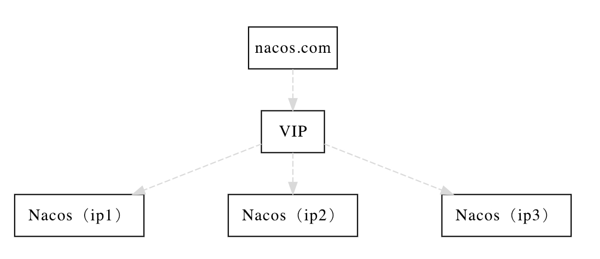

# 安装

## 单机模式

### 1.预备环境准备

Nacos 依赖 [Java](https://docs.oracle.com/cd/E19182-01/820-7851/inst_cli_jdk_javahome_t/) 环境来运行。如果您是从代码开始构建并运行Nacos，还需要为此配置 [Maven](https://maven.apache.org/index.html)环境，请确保是在以下版本环境中安装使用:

1. 64 bit OS，支持 Linux/Unix/Mac/Windows，推荐选用 Linux/Unix/Mac。
2. 64 bit JDK 1.8+；[下载](http://www.oracle.com/technetwork/java/javase/downloads/jdk8-downloads-2133151.html) & [配置](https://docs.oracle.com/cd/E19182-01/820-7851/inst_cli_jdk_javahome_t/)。
3. Maven 3.2.x+；[下载](https://maven.apache.org/download.cgi) & [配置](https://maven.apache.org/settings.html)。

### 2.下载源码或者安装包

```sh
$ unzip nacos-server-$version.zip 或者 tar -xvf nacos-server-$version.tar.gz
$ cd nacos/bin
```

### 3.启动服务器

```sh
# Linux/Unix/Mac 启动命令(standalone代表着单机模式运行，非集群模式):
$ sh startup.sh -m standalone
# 如果您使用的是ubuntu系统，或者运行脚本报错提示[[符号找不到，可尝试如下运行：
$ bash startup.sh -m standalone
# Windows 启动命令，或者双击startup.cmd运行文件
$ cmd startup.cmd
```

### 4. 查看

http://127.0.0.1:8848/nacos

### 5.关闭服务器

```sh
# Linux/Unix/Mac
$ sh shutdown.sh
# Windows ,或者双击shutdown.cmd运行文件
$ cmd shutdown.cmd
```

## 集群模式

### 集群部署架构图

因此开源的时候推荐用户把所有服务列表放到一个vip下面，然后挂到一个域名下面

[http://ip1](http://ip1/):port/openAPI 直连ip模式，机器挂则需要修改ip才可以使用。

[http://VIP](http://vip/):port/openAPI 挂载VIP模式，直连vip即可，下面挂server真实ip，可读性不好。

[http://nacos.com](http://nacos.com/):port/openAPI 域名 + VIP模式，可读性好，而且换ip方便，推荐模式



### 1. 预备环境准备

请确保是在环境中安装使用:

1. 64 bit OS Linux/Unix/Mac，推荐使用Linux系统。
2. 64 bit JDK 1.8+；[下载](http://www.oracle.com/technetwork/java/javase/downloads/jdk8-downloads-2133151.html).[配置](https://docs.oracle.com/cd/E19182-01/820-7851/inst_cli_jdk_javahome_t/)。
3. Maven 3.2.x+；[下载](https://maven.apache.org/download.cgi).[配置](https://maven.apache.org/settings.html)。
4. 3个或3个以上Nacos节点才能构成集群。

### 2. 下载源码或者安装包

```sh
$ unzip nacos-server-$version.zip 或者 tar -xvf nacos-server-$version.tar.gz
$ cd nacos/bin
```

### 3. 配置集群配置文件

在`nacos/conf`目录下，有配置文件cluster.conf，请每行配置成ip:port。（请配置3个或3个以上节点）

```sh
# ip:port
200.8.9.16:8848
200.8.9.17:8848
200.8.9.18:8848
```

### 4. 确定数据源

#### 使用内置数据源

无需进行任何配置

#### 使用外置数据源

生产使用建议至少主备模式，或者采用高可用数据库。

##### 初始化 MySQL 数据库

[sql语句源文件](https://github.com/alibaba/nacos/blob/master/distribution/conf/nacos-mysql.sql)

##### application.properties 配置

[application.properties配置文件](https://github.com/alibaba/nacos/blob/master/distribution/conf/application.properties)

### 5. 启动服务器

```sh
# 使用内置数据源
$ sh startup.sh -p embedded
# 使用外置数据源
$ sh startup.sh
```

### 6. 查看

http://127.0.0.1:8848/nacos

### 7. 关闭服务器

```sh
$ sh shutdown.sh
```

