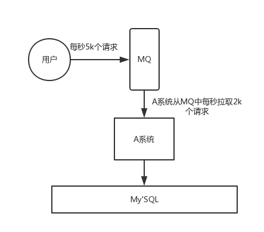

# MQ介绍

## 为什么要用MQ

消息队列是一种“先进先出”的数据结构

其应用场景主要包含以下3个方面

* 应用解耦

系统的耦合性越高，容错性就越低。以电商应用为例，用户创建订单后，如果耦合调用库存系统、物流系统、支付系统，任何一个子系统出了故障或者因为升级等原因暂时不可用，都会造成下单操作异常，影响用户使用体验。

使用消息队列解耦合，系统的耦合性就会提高了。比如物流系统发生故障，需要几分钟才能来修复，在这段时间内，物流系统要处理的数据被缓存到消息队列中，用户的下单操作正常完成。当物流系统回复后，补充处理存在消息队列中的订单消息即可，终端系统感知不到物流系统发生过几分钟故障。

* 流量削峰

应用系统如果遇到系统请求流量的瞬间猛增，有可能会将系统压垮。有了消息队列可以将大量请求缓存起来，分散到很长一段时间处理，这样可以大大提到系统的稳定性和用户体验。

一般情况，为了保证系统的稳定性，如果系统负载超过阈值，就会阻止用户请求，这会影响用户体验，而如果使用消息队列将请求缓存起来，等待系统处理完毕后通知用户下单完毕，这样总不能下单体验要好。

<u>处于经济考量目的：</u>

业务系统正常时段的QPS如果是1000，流量最高峰是10000，为了应对流量高峰配置高性能的服务器显然不划算，这时可以使用消息队列对峰值流量削峰

* 数据分发

通过消息队列可以让数据在多个系统更加之间进行流通。数据的产生方不需要关心谁来使用数据，只需要将数据发送到消息队列，数据使用方直接在消息队列中直接获取数据即可

## MQ的优点和缺点

优点：解耦、削峰、数据分发

缺点包含以下几点：

* 系统可用性降低

  系统引入的外部依赖越多，系统稳定性越差。一旦MQ宕机，就会对业务造成影响。

  如何保证MQ的高可用？

* 系统复杂度提高

  MQ的加入大大增加了系统的复杂度，以前系统间是同步的远程调用，现在是通过MQ进行异步调用。

  如何保证消息没有被重复消费？怎么处理消息丢失情况？那么保证消息传递的顺序性？

* 一致性问题

  A系统处理完业务，通过MQ给B、C、D三个系统发消息数据，如果B系统、C系统处理成功，D系统处理失败。

  如何保证消息数据处理的一致性？

## 各种MQ产品的比较
常见的MQ产品包括Kafka、ActiveMQ、RabbitMQ、RocketMQ。 

