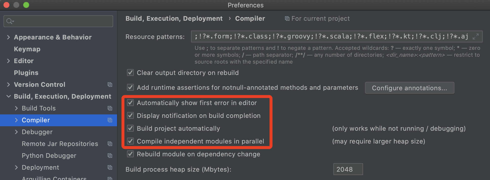

# 热部署

## 依赖

```xml
<dependency>
    <groupId>org.springframework.boot</groupId>
    <artifactId>spring-boot-devtools</artifactId>
    <scope>runtime</scope>
    <optional>true</optional>
</dependency>

<plugin>
  <groupId>org.springframework.boot</groupId>
  <artifactId>spring-boot-maven-plugin</artifactId>
  <!--springboot项目由于继承了spring-boot-starter-parent可以不加下面的配置-->
  <configuration>
    <fork>true</fork>
    <addResources>true</addResources>
  </configuration>
</plugin>
```

## 开启IDEA的自动构建

设置->构建->编译



## 升级配置

window `shift+Ctrl+Alt+/`，Mac`shift+option+comman+/`，选择registry。

开启compiler.automake.allow.when.app.running和actionSystem.assertFocusAccessFromEdt。

## 重启IDEA

高版本IDEA可能无需重启。

# 健康检查

```xml
<dependency>
  <groupId>org.springframework.boot</groupId>
  <artifactId>spring-boot-starter-actuator</artifactId>
</dependency>
```

访问 http://localhost:${server.port}/actuactor/info/