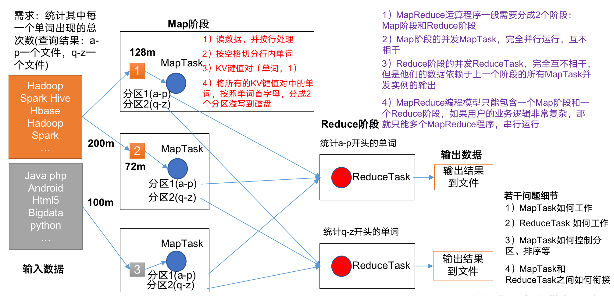
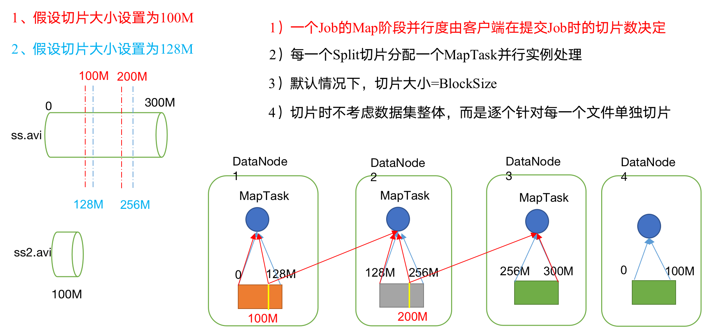
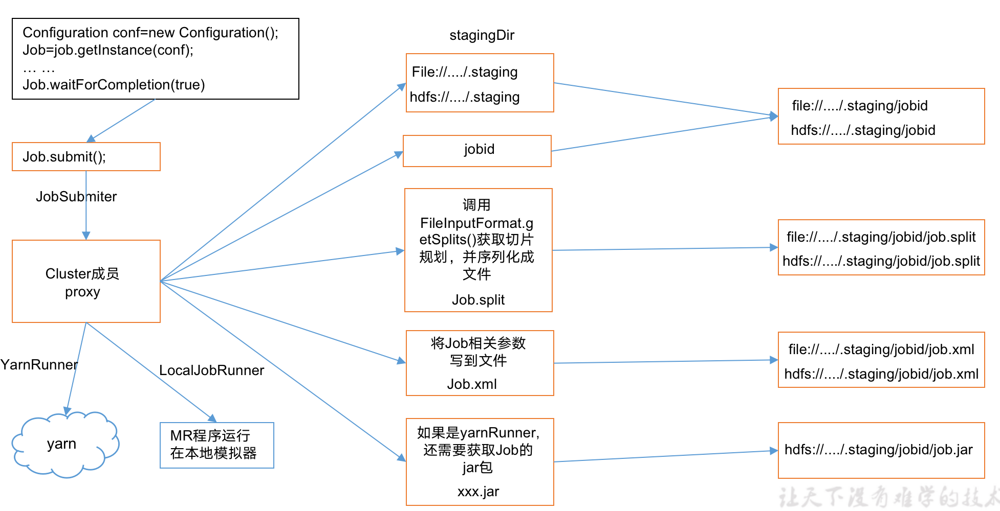
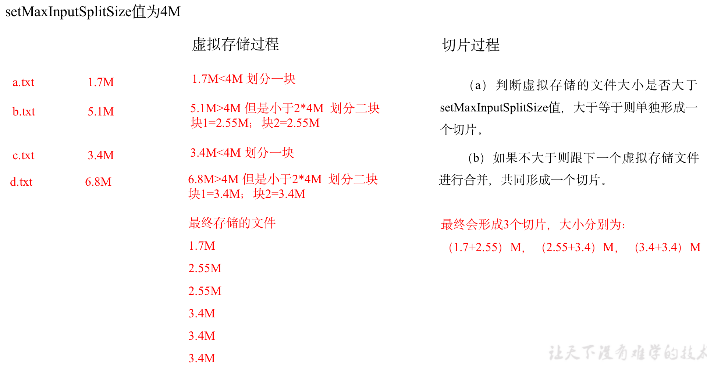

# 第1章 概述

## 1.1 定义

MapReduce是一个==分布式运算程序的编程框架==，是用户开发“基于Hadoop的数据分析应用”的核心框架。

MapReduce核心功能是将==用户编写的业务逻辑代码==和==自带默认组件==整合成一个完整的==分布式运算程序==，并发运行在一个Hadoop集群上。

## 1.2 优缺点

### 1.2.1 优点

#### 1.MapReduce 易于编程

==它简单的实现一些接口，就可以完成一个分布式程序==，这个分布式程序可以分布到大量廉价的PC机器上运行。也就是说你写一个分布式程序，跟写一个简单的串行程序是一模一样的。就是因为这个特点使得MapReduce编程变得非常流行。

#### 2.良好的扩展性

当你的计算资源不能得到满足的时候，你可以通过==简单的增加机器==来扩展它的计算能力。

#### 3.高容错性

MapReduce设计的初衷就是使程序能够部署在廉价的PC机器上，这就要求它具有很高的容错性。比如==其中一台机器挂了，它可以把上面的计算任务转移到另外一个节点上运行，不至于这个任务运行失败==，而且这个过程不需要人工参与，而完全是由Hadoop内部完成的。

#### 4.适合PB级以上海量数据的离线处理

可以实现上千台服务器集群并发工作，提供数据处理能力。

### 1.2.2 缺点

#### 1.不擅长实时计算

MapReduce无法像MySQL一样，在毫秒或者秒级内返回结果。

#### 2.不擅长流式计算

流式计算的输入数据是动态的，而MapReduce的输入数据集是静态的，不能动态变化。这是因为MapReduce自身的设计特点决定了数据源必须是静态的。

#### 3.不擅长DAG（有向图）计算

多个应用程序存在依赖关系，后一个应用程序的输入为前一个的输出。在这种情况下，MapReduce并不是不能做，而是使用后，==每个MapReduce作业的输出结果都会写入到磁盘，会造成大量的磁盘IO，导致性能非常的低下==。

## 1.3 MapReduce核心思想

MapReduce核心编程思想



1. 分布式的运算程序往往需要分成==至少2个阶段==。
2. 第一个阶段的MapTask并发实例，==完全并行==运行，互不相干。
3. 第二个阶段的ReduceTask并发实例互不相干，但是他们的数据==依赖==于==上一个阶段==的所有MapTask并发实例的==输出==。
4. MapReduce编程模型==只能==包含一个Map阶段和一个Reduce阶段，如果用户的业务逻辑非常复杂，那就只能多个MapReduce程序，==串行==运行。

总结：分析WordCount数据流走向深入理解MapReduce核心思想。

## 1.4 进程

一个完整的MapReduce程序在分布式运行时有3类实例进程：

1. **MrAppMaster**：负责整个程序的过程调度及状态协调。
2. **MapTask**：负责Map阶段的整个数据处理流程。
3. **ReduceTask**：负责Reduce阶段的整个数据处理流程。

## 1.5 官方WordCount源码

采用反编译工具反编译源码，发现WordCount案例有Map类、Reduce类和驱动类。且数据的类型是Hadoop自身封装的序列化类型。

## 1.6 常用数据序列化类型

常用的数据类型对应的Hadoop数据序列化类型

| Java类型 | Hadoop Writable类型 |
| -------- | ------------------- |
| boolean  | BooleanWritable     |
| byte     | ByteWritable        |
| int      | IntWritable         |
| float    | FloatWritable       |
| long     | LongWritable        |
| double   | DoubleWritable      |
| String   | Text                |
| map      | MapWritable         |
| array    | ArrayWritable       |

## 1.7 MapReduce编程规范

用户编写的程序分成三个部分：Mapper、Reducer和Driver。

### 1.Mapper阶段

1. 用户自定义的Mapper要继承自己的父类；

 	2. Mapper的输入数据是KV对的形式（KV的类型可自定义）；
 	3. Mapper中的业务逻辑写在map()方法中；
 	4. Mapper的输出数据是KV对的形式（KV的类型可自定义）；
 	5. ==map()方法（MapTask进程）对每一个<K,V>调用一次==；

### 2.Reducer阶段

1. 用户自定义的Reducer要继承自己的父类；
2. Reducer的输入数据类型对应Mapper的输出数据类型，也是KV；
3. Reducer的业务逻辑写在reduce()方法中；
4. ==ReduceTask进程对每一组相同k的<k,v>组调用一次reduce()方法==；

### 3.Driver阶段

相当于YARN集群的客户端，用于提交我们整个程序到YARN集群，提交的是封装了MapReduce程序相关运行参数的job对象。

## 1.8 WordCount案例实操

### 1. 需求

在给定的文本文件(txt)中统计输出每一个单词出现的总次数

##### 输入数据

```wiki
idc idc
ss ss
cls cls
jiao
banzhang
xue
hadoop
```

##### 期望输出数据

```wiki
idc	2
banzhang	1
cls	2
hadoop	1
jiao	1
ss	2
xue	1
```

### 2. 分析

按照MapReduce编程规范，分别编写Mapper，Reducer，Driver。

3. Mapper

   1. 将MapTask传给我们的文本内容先转换成String

      ```wiki
      idc idc
      ```

   2. 根据空格将这一行切分成单词

      ```wiki
      idc
      idc
      ```

   3. 将单词输出为<单词，1>

      ```wiki
      idc, 1
      idc, 1
      ```

4. Reducer

   1. 汇总各个key的个数

      ```wiki
      idc, 1
      idc, 1
      ```

   2. 输出该key的总次数

      ```wiki
      idc, 2
      ```

5. Driver

   1. 获取配置信息，获取job对象实例；
   2. 指定本程序的jar包所在的本地路径；
   3. 关联Mapper/Reducer业务类；
   4. 指定Mapper输出数据的kv类型；
   5. 指定最终输出的数据的kv类型；
   6. 指定job的输入原始文件所在目录；
   7. 指定job的输出结果所在目录；
   8. 提交作业。

### 3. 环境准备

1. 创建maven工程

2. 添加依赖

   ```xml
   <dependency>
     <groupId>junit</groupId>
     <artifactId>junit</artifactId>
     <version>RELEASE</version>
   </dependency>
   <dependency>
     <groupId>org.apache.logging.log4j</groupId>
     <artifactId>log4j-core</artifactId>
     <version>2.8.2</version>
   </dependency>
   <dependency>
     <groupId>org.apache.hadoop</groupId>
     <artifactId>hadoop-common</artifactId>
     <version>2.7.2</version>
   </dependency>
   <dependency>
     <groupId>org.apache.hadoop</groupId>
     <artifactId>hadoop-client</artifactId>
     <version>2.7.2</version>
   </dependency>
   <dependency>
     <groupId>org.apache.hadoop</groupId>
     <artifactId>hadoop-hdfs</artifactId>
     <version>2.7.2</version>
   </dependency>
   ```

3. 配置日志文件log4j.properties

   ```properties
   log4j.rootLogger=INFO, stdout
   log4j.appender.stdout=org.apache.log4j.ConsoleAppender
   log4j.appender.stdout.layout=org.apache.log4j.PatternLayout
   log4j.appender.stdout.layout.ConversionPattern=%d %p [%c] - %m%n
   log4j.appender.logfile=org.apache.log4j.FileAppender
   log4j.appender.logfile.File=target/spring.log
   log4j.appender.logfile.layout=org.apache.log4j.PatternLayout
   log4j.appender.logfile.layout.ConversionPattern=%d %p [%c] - %m%n
   ```

### 4. 编写程序

1. 编写Mapper类

   ```java
   package com.idc.mr.wordcount;
   
   import org.apache.hadoop.io.IntWritable;
   import org.apache.hadoop.io.LongWritable;
   import org.apache.hadoop.io.Text;
   import org.apache.hadoop.mapreduce.Mapper;
   import java.io.IOException;
   
   public class WordcountMapper extends Mapper<LongWritable, Text, Text, IntWritable> {
       Text k = new Text();
       IntWritable v = new IntWritable(1);
   
       @Override
       protected void map(LongWritable key, Text value, Context context) throws IOException, InterruptedException {
           // 1 获取一行
           String line = value.toString();
           // 2 切割单词
           String[] words = line.split(" ");
           // 3 输出
           for (String word : words) {
               k.set(word);
               context.write(k, v);
           }
       }
   }
   ```

2. 编写Reducer类

   ```java
   package com.idc.mr.wordcount;
   
   import org.apache.hadoop.io.IntWritable;
   import org.apache.hadoop.io.Text;
   import org.apache.hadoop.mapreduce.Reducer;
   import java.io.IOException;
   
   public class WordcountReducer extends Reducer<Text, IntWritable, Text, IntWritable> {
       int sum;
       IntWritable v = new IntWritable();
   
       @Override
       protected void reduce(Text key, Iterable<IntWritable> values, Context context)
               throws IOException, InterruptedException {
           // 1 累加求和
           sum = 0;
           for (IntWritable count : values) {
               sum += count.get();
           }
           // 2 输出
           v.set(sum);
           context.write(key, v);
       }
   }
   ```

3. 编写Driver驱动类

   ```java
   package com.idc.mapreduce.wordcount;
   import java.io.IOException;
   import org.apache.hadoop.conf.Configuration;
   import org.apache.hadoop.fs.Path;
   import org.apache.hadoop.io.IntWritable;
   import org.apache.hadoop.io.Text;
   import org.apache.hadoop.mapreduce.Job;
   import org.apache.hadoop.mapreduce.lib.input.FileInputFormat;
   import org.apache.hadoop.mapreduce.lib.output.FileOutputFormat;
   
   public class WordcountDriver {
   	public static void main(String[] args) throws IOException, ClassNotFoundException, InterruptedException {
   		// 1 获取配置信息以及封装任务
   		Configuration configuration = new Configuration();
   		Job job = Job.getInstance(configuration);
   
   		// 2 设置jar加载路径
   		job.setJarByClass(WordcountDriver.class);
   
   		// 3 设置map和reduce类
   		job.setMapperClass(WordcountMapper.class);
   		job.setReducerClass(WordcountReducer.class);
   
   		// 4 设置map输出
   		job.setMapOutputKeyClass(Text.class);
   		job.setMapOutputValueClass(IntWritable.class);
   
   		// 5 设置最终输出kv类型
   		job.setOutputKeyClass(Text.class);
   		job.setOutputValueClass(IntWritable.class);
   		
   		// 6 设置输入和输出路径
   		FileInputFormat.setInputPaths(job, new Path(args[0]));
   		FileOutputFormat.setOutputPath(job, new Path(args[1]));
   
   		// 7 提交
   		boolean result = job.waitForCompletion(true);
   
   		System.exit(result ? 0 : 1);
   	}
   }
   ```

### 5. 本地测试

1_ 如果电脑系统是win7的就将win7的hadoop jar包解压到非中文路径，并在Windows环境上配置HADOOP_HOME环境变量。如果是电脑win10操作系统，就解压win10的hadoop jar包，并配置HADOOP_HOME环境变量。

**注意：**

win8电脑和win10家庭版操作系统可能有问题，需要重新编译源码或者更改操作系统。

2_ 在Eclipse/Idea上运行程序。

### 6. 集群上测试

① 用maven打jar包，需要添加的打包插件依赖

注意：mainClass 需要替换为自己工程主类。

```xml
<build>
    <plugins>
        <plugin>
            <artifactId>maven-compiler-plugin</artifactId>
            <version>3.8.1</version>
            <configuration>
                <source>1.8</source>
                <target>1.8</target>
            </configuration>
        </plugin>
        <plugin>
            <artifactId>maven-assembly-plugin</artifactId>
            <configuration>
                <descriptorRefs>
                    <descriptorRef>jar-with-dependencies</descriptorRef>
                </descriptorRefs>
                <archive>
                    <manifest>
                        <mainClass>com.idc.mr.wordcount.WordcountDriver</mainClass>
                    </manifest>
                </archive>
            </configuration>
            <executions>
                <execution>
                    <id>make-assembly</id>
                    <phase>package</phase>
                    <goals>
                        <goal>single</goal>
                    </goals>
                </execution>
            </executions>
        </plugin>
    </plugins>
</build>
```

② 将程序打成jar包，修改不带依赖的jar包名称为wc.jar，并复制该jar包到Hadoop集群。

③ 启动Hadoop集群；

④ 执行WordCount程序：

```shell
# 注意：这里使用集群的文件路径，不能使用本地路径
$ hadoop jar mr-wc.jar com.idc.mr.wordcount.WordcountDriver /user/idc/input /user/idc/output
```

# 第2章 Hadoop序列化

## 2.1 序列化概述

### 2.1.1 什么是序列化

序列化就是把==内存==中的对象，转换成==字节序列==（或其他数据传输协议）以便于存储到==磁盘==（持久化）和==网络==传输。 

反序列化就是将收到字节序列（或其他数据传输协议）或者是==磁盘的持久化数据==，转换成==内存中的对象==。

### 2.1.2 为什么要序列化

一般来说，“活的”对象只生存在内存里，关机断电就没有了。而且“活的”对象只能由本地的进程使用，不能被发送到网络上的另外一台计算机。 然而==序列化可以存储“活的”对象，可以将“活的”对象发送到远程计算机==。

### 2.1.3 为什么不用Java的序列化

 Java的序列化是一个重量级序列化框架（Serializable），一个对象被序列化后，会附带很多额外的信息（各种校验信息，Header，继承体系等），不便于在网络中高效传输。所以，Hadoop自己开发了一套序列化机制（Writable）。

**Hadoop序列化特点：**

1. 紧凑 ：高效使用存储空间。
2. 快速：读写数据的额外开销小。
3. 可扩展：随着通信协议的升级而可升级
4. 互操作：支持多语言的交互

## 2.2 自定义bean对象实现序列化接口（Writable）

在企业开发中往往常用的基本序列化类型不能满足所有需求，比如在Hadoop框架内部传递一个bean对象，那么该对象就需要实现序列化接口。

具体实现bean对象序列化步骤如下==7步==。

```java
// 1. 必须实现Writable接口；
// 2. 反序列化时，需要反射调用空参构造函数，所以必须有空参构造；
public FlowBean() {
	super();
}
// 3. 重写序列化方法
@Override
public void write(DataOutput out) throws IOException {
	out.writeLong(upFlow);
	out.writeLong(downFlow);
	out.writeLong(sumFlow);
}
// 4. 重写反序列化方法
@Override
public void readFields(DataInput in) throws IOException {
	upFlow = in.readLong();
	downFlow = in.readLong();
	sumFlow = in.readLong();
}
// 5. 注意反序列化的顺序和序列化的顺序完全一致
// 6. 要想把结果显示在文件中，需要重写toString()，可用”\t”分开，方便后续用。
// 7. 如果需要将自定义的bean放在key中传输，则还需要实现Comparable接口，因为MapReduce框中的Shuffle过程要求对key必须能排序。详见后面排序案例。
@Override
public int compareTo(FlowBean o) {
	// 倒序排列，从大到小
	return this.sumFlow > o.getSumFlow() ? -1 : 1;
}
```

## 2.3 序列化案例实操

### 1. 需求

统计每一个手机号耗费的总上行流量、下行流量、总流量

（1）输入数据

```txt
1	  13736230513	192.196.100.1	    www.idc.com	2481	24681	200
2   13846544121	192.196.100.2			264	0	200
3 	13956435636	192.196.100.3			132	1512	200
4 	13966251146	192.168.100.1			240	0	404
5 	18271575951	192.168.100.2	    www.idc.com	1527	2106	200
6 	84188413	192.168.100.3	      www.idc.com	4116	1432	200
7 	13590439668	192.168.100.4			1116	954	200
8 	15910133277	192.168.100.5	    www.hao123.com	3156	2936	200
9 	13729199489	192.168.100.6			240	0	200
10 	13630577991	192.168.100.7	    www.shouhu.com	6960	690	200
11 	15043685818	192.168.100.8	    www.baidu.com	3659	3538	200
12 	15959002129	192.168.100.9	    www.idc.com	1938	180	500
13 	13560439638	192.168.100.10		918	4938	200
14 	13470253144	192.168.100.11		180	180	200
15 	13682846555	192.168.100.12	  www.qq.com	1938	2910	200
16 	13992314666	192.168.100.13	  www.gaga.com	3008	3720	200
17 	13509468723	192.168.100.14	  www.qinghua.com	7335	110349	404
18 	18390173782	192.168.100.15	  www.sogou.com	9531	2412	200
19 	13975057813	192.168.100.16	  www.baidu.com	11058	48243	200
20 	13768778790	192.168.100.17		120	120	200
21 	13568436656	192.168.100.18	  www.alibaba.com	2481	24681	200
22 	13568436656	192.168.100.19		1116	954	200
```

（2）输入数据格式：

```txt
7 	13560436666	120.196.100.99		1116		 954			200
id	手机号码		网络ip			上行流量  下行流量     网络状态码
```

3）期望输出数据格式

```txt
13560436666 		1116		      954 			2070
手机号码		    上行流量        下行流量		总流量
```

### 2. 需求分析

1. 需求：统计每一个手机号耗费的总上行流量、下行流量、总流量

2. 输入数据格式

   ```wiki
   7      13560436666    120.196.100.99   1116	      954	   200
   Id     手机号码          网络ip	            上行流量  下行流量     网络状态码
   ```

3. 期望输出数据格式

   ```wiki
   13560436666 	  1116                954              2070
   手机号码	 上行流量        下行流量     总流量
   ```

4. Map阶段

   1. 读取一行数据，切分字段

      ```wiki
      7      13560436666    120.196.100.99   1116	      954	   200
      ```

   2. 抽取手机号、上行流量、下行流量

      ```wiki
      13560436666 	  1116                954           
      手机号码	 上行流量        下行流量
      ```

   3. 以手机号为key，bean对象为value输出，即context.write(手机号,bean);

   4. ==bean对象要想能够传输，必须实现序列化接口==

5. Reduce阶段

   1. 累加上行流量和下行流量得到总流量。

      ```wiki
      13560436666 	  1116       +         954     =      2070   
      手机号码	 上行流量        下行流量     总流量 
      ```

### 3. 编写MapReduce程序

1. 编写流量统计的Bean对象

   ```java
   package com.idc.mapreduce.flowsum;
   import java.io.DataInput;
   import java.io.DataOutput;
   import java.io.IOException;
   import org.apache.hadoop.io.Writable;
   
   // 1 实现writable接口
   public class FlowBean implements Writable{
   
   	private long upFlow;
   	private long downFlow;
   	private long sumFlow;
   	
   	//2  反序列化时，需要反射调用空参构造函数，所以必须有
   	public FlowBean() {
   		super();
   	}
   
   	public FlowBean(long upFlow, long downFlow) {
   		super();
   		this.upFlow = upFlow;
   		this.downFlow = downFlow;
   		this.sumFlow = upFlow + downFlow;
   	}
   	
   	//3  写序列化方法
   	@Override
   	public void write(DataOutput out) throws IOException {
   		out.writeLong(upFlow);
   		out.writeLong(downFlow);
   		out.writeLong(sumFlow);
   	}
   	
   	//4 反序列化方法
   	//5 反序列化方法读顺序必须和写序列化方法的写顺序必须一致
   	@Override
   	public void readFields(DataInput in) throws IOException {
   		this.upFlow  = in.readLong();
   		this.downFlow = in.readLong();
   		this.sumFlow = in.readLong();
   	}
   
   	// 6 编写toString方法，方便后续打印到文本
   	@Override
   	public String toString() {
   		return upFlow + "\t" + downFlow + "\t" + sumFlow;
   	}
   
   	public long getUpFlow() {
   		return upFlow;
   	}
   
   	public void setUpFlow(long upFlow) {
   		this.upFlow = upFlow;
   	}
   
   	public long getDownFlow() {
   		return downFlow;
   	}
   
   	public void setDownFlow(long downFlow) {
   		this.downFlow = downFlow;
   	}
   
   	public long getSumFlow() {
   		return sumFlow;
   	}
   
   	public void setSumFlow(long sumFlow) {
   		this.sumFlow = sumFlow;
   	}
   }
   ```

2. 编写Mapper类

   ```java
   package com.idc.mapreduce.flowsum;
   import java.io.IOException;
   import org.apache.hadoop.io.LongWritable;
   import org.apache.hadoop.io.Text;
   import org.apache.hadoop.mapreduce.Mapper;
   
   public class FlowCountMapper extends Mapper<LongWritable, Text, Text, FlowBean>{
   	
   	FlowBean v = new FlowBean();
   	Text k = new Text();
   	
   	@Override
   	protected void map(LongWritable key, Text value, Context context)	throws IOException, InterruptedException {
   		
   		// 1 获取一行
   		String line = value.toString();
   		
   		// 2 切割字段
   		String[] fields = line.split("\t");
   		
   		// 3 封装对象
   		// 取出手机号码
   		String phoneNum = fields[1];
   
   		// 取出上行流量和下行流量
   		long upFlow = Long.parseLong(fields[fields.length - 3]);
   		long downFlow = Long.parseLong(fields[fields.length - 2]);
   
   		k.set(phoneNum);
   		v.set(downFlow, upFlow);
   		
   		// 4 写出
   		context.write(k, v);
   	}
   }
   ```

3. 编写Reducer类

   ```java
   package com.idc.mapreduce.flowsum;
   import java.io.IOException;
   import org.apache.hadoop.io.Text;
   import org.apache.hadoop.mapreduce.Reducer;
   
   public class FlowCountReducer extends Reducer<Text, FlowBean, Text, FlowBean> {
   
   	@Override
   	protected void reduce(Text key, Iterable<FlowBean> values, Context context)throws IOException, InterruptedException {
   
   		long sum_upFlow = 0;
   		long sum_downFlow = 0;
   
   		// 1 遍历所用bean，将其中的上行流量，下行流量分别累加
   		for (FlowBean flowBean : values) {
   			sum_upFlow += flowBean.getUpFlow();
   			sum_downFlow += flowBean.getDownFlow();
   		}
   
   		// 2 封装对象
   		FlowBean resultBean = new FlowBean(sum_upFlow, sum_downFlow);
   		
   		// 3 写出
   		context.write(key, resultBean);
   	}
   }
   ```

4. 编写Driver驱动类

   ```java
   package com.idc.mapreduce.flowsum;
   import java.io.IOException;
   import org.apache.hadoop.conf.Configuration;
   import org.apache.hadoop.fs.Path;
   import org.apache.hadoop.io.Text;
   import org.apache.hadoop.mapreduce.Job;
   import org.apache.hadoop.mapreduce.lib.input.FileInputFormat;
   import org.apache.hadoop.mapreduce.lib.output.FileOutputFormat;
   
   public class FlowsumDriver {
   
   	public static void main(String[] args) throws IllegalArgumentException, IOException, ClassNotFoundException, InterruptedException {
   		
   // 输入输出路径需要根据自己电脑上实际的输入输出路径设置
   args = new String[] { "e:/input/inputflow", "e:/output1" };
   
   		// 1 获取配置信息，或者job对象实例
   		Configuration configuration = new Configuration();
   		Job job = Job.getInstance(configuration);
   
   		// 6 指定本程序的jar包所在的本地路径
   		job.setJarByClass(FlowsumDriver.class);
   
   		// 2 指定本业务job要使用的mapper/Reducer业务类
   		job.setMapperClass(FlowCountMapper.class);
   		job.setReducerClass(FlowCountReducer.class);
   
   		// 3 指定mapper输出数据的kv类型
   		job.setMapOutputKeyClass(Text.class);
   		job.setMapOutputValueClass(FlowBean.class);
   
   		// 4 指定最终输出的数据的kv类型
   		job.setOutputKeyClass(Text.class);
   		job.setOutputValueClass(FlowBean.class);
   		
   		// 5 指定job的输入原始文件所在目录
   		FileInputFormat.setInputPaths(job, new Path(args[0]));
   		FileOutputFormat.setOutputPath(job, new Path(args[1]));
   
   		// 7 将job中配置的相关参数，以及job所用的java类所在的jar包， 提交给yarn去运行
   		boolean result = job.waitForCompletion(true);
   		System.exit(result ? 0 : 1);
   	}
   }
   ```

# 第3章 MapReduce框架原理

## 3.1 InputFormat数据输入

### 3.1.1 切片与MapTask并行度决定机制

#### 1. 问题引出

MapTask的并行度决定Map阶段的任务处理并发度，进而影响到整个Job的处理速度。

思考：

1G的数据，启动8个MapTask，可以提高集群的并发处理能力。那么1K的数据，也启动8个MapTask，会提高集群性能吗？MapTask并行任务是否越多越好呢？哪些因素影响了MapTask并行度？

#### 2．MapTask并行度决定机制

**数据块**：Block是HDFS物理上把数据分成一块一块。
**数据切片**：数据切片只是在逻辑上对输入进行分片，并不会在磁盘上将其切分成片进行存储。



### 3.1.2 Job提交流程源码和切片源码详解

#### 1.Job提交流程源码详解

```java
waitForCompletion()

submit();

// 1建立连接
	connect();	
		// 1）创建提交Job的代理
		new Cluster(getConfiguration());
			// （1）判断是本地yarn还是远程
			initialize(jobTrackAddr, conf); 

// 2 提交job
submitter.submitJobInternal(Job.this, cluster)
	// 1）创建给集群提交数据的Stag路径
	Path jobStagingArea = JobSubmissionFiles.getStagingDir(cluster, conf);

	// 2）获取jobid ，并创建Job路径
	JobID jobId = submitClient.getNewJobID();

	// 3）拷贝jar包到集群
copyAndConfigureFiles(job, submitJobDir);	
	rUploader.uploadFiles(job, jobSubmitDir);

// 4）计算切片，生成切片规划文件
writeSplits(job, submitJobDir);
		maps = writeNewSplits(job, jobSubmitDir);
		input.getSplits(job);

// 5）向Stag路径写XML配置文件
writeConf(conf, submitJobFile);
	conf.writeXml(out);

// 6）提交Job,返回提交状态
status = submitClient.submitJob(jobId, submitJobDir.toString(), job.getCredentials());
```

Job提交流程源码解析



#### 2．FileInputFormat 切片源码解析(input.getSplits(job))

1. 程序先找到你数据存储的目录。

2. 开始遍历处理（规划切片）目录下的每一个文件

3. 遍历第一个文件ss.txt
   1. 获取文件大小fs.sizeOf(ss.txt)
   2. 计算切片大小`computeSplitSize(Math.max(minSize,Math.min(maxSize,blocksize)))=blocksize=128M`
   3. ==默认情况下，切片大小=blocksize==
   4. 开始切，形成第1个切片：ss.txt—0:128M 第2个切片ss.txt—128:256M 第3个切片ss.txt—256M:300M（==每次切片时，都要判断切完剩下的部分是否大于块的1.1倍，不大于1.1倍就划分一块切片==）
   5. 将切片信息写到一个切片规划文件中
   6. 整个切片的核心过程在getSplit()方法中完成
   7. ==InputSplit只记录了切片的元数据信息==，比如起始位置、长度以及所在的节点列表等。

4. 提交切片规划文件到YARN上，YARN上的MrAppMaster就可以根据切片规划文件计算开启MapTask个数。

### 3.1.3 FileInputFormat切片机制

#### FileInputFormat切片机制

1. 切片机制
   1. 简单地按照文件的内容长度进行切片
   2. 切片大小，默认等于Block大小
   3. 切片时不考虑数据集整体，而是逐个针对每一个文件单独切片

2. 案例分析

   1. 输入数据有两个文件：

      ```wiki
      file1.txt    320M
      file2.txt    10M
      ```

   2. 经过FileInputFormat的切片机制运算后，形成的切片信息如下：

      ```wiki
      file1.txt.split1--  0~128
      file1.txt.split2--  128~256
      file1.txt.split3--  256~320
      file2.txt.split1--  0~10M
      ```

#### FileInputFormat切片大小的参数配置

1. 源码中计算切片大小的公式

   ```java
   Math.max(minSize, Math.min(maxSize, blockSize)); 
   mapreduce.input.fileinputformat.split.minsize=1 //默认值为1
   mapreduce.input.fileinputformat.split.maxsize= Long.MAXValue // 默认值Long.MAXValue
   // 因此，默认情况下，切片大小=blocksize。
   ```

2. 切片大小设置

   > maxsize（切片最大值）：参数如果调得比blockSize小，则会让切片变小，而且就等于配置的这个参数的值。
   > minsize（切片最小值）：参数调的比blockSize大，则可以让切片变得比blockSize还大。

3. 获取切片信息API

   ```java
   // 获取切片的文件名称
   String name = inputSplit.getPath().getName();
   // 根据文件类型获取切片信息
   FileSplit inputSplit = (FileSplit) context.getInputSplit();
   ```

###  3.1.4 CombineTextInputFormat切片机制

框架默认的TextInputFormat切片机制是对任务按文件规划切片，==不管文件多小，都会是一个单独的切片==，都会交给一个MapTask，这样如果有大量小文件，就会==产生大量的MapTask==，处理效率极其低下。

1. 应用场景：

   CombineTextInputFormat用于小文件过多的场景，它可以将多个小文件从逻辑上规划到一个切片中，这样，多个小文件就可以交给一个MapTask处理。

2. 虚拟存储切片最大值设置

   ```java
   CombineTextInputFormat.setMaxInputSplitSize(job, 4194304);// 4m
   ```

   注意：虚拟存储切片最大值设置最好根据实际的小文件大小情况来设置具体的值。

3. 切片机制

   生成切片过程包括：虚拟存储过程和切片过程二部分。

   
   1. 虚拟存储过程：

      ​		将输入目录下所有文件大小，依次和设置的setMaxInputSplitSize值比较，如果不大于设置的最大值，逻辑上划分一个块。如果输入文件大于设置的最大值且大于两倍，那么以最大值切割一块；当剩余数据大小超过设置的最大值且不大于最大值2倍，此时将文件均分成2个虚拟存储块（防止出现太小切片）。

      ​		例如setMaxInputSplitSize值为4M，输入文件大小为8.02M，则先逻辑上分成一个4M。剩余的大小为4.02M，如果按照4M逻辑划分，就会出现0.02M的小的虚拟存储文件，所以将剩余的4.02M文件切分成（2.01M和2.01M）两个文件。

   2. 切片过程：

      1. 判断虚拟存储的文件大小是否大于setMaxInputSplitSize值，大于等于则单独形成一个切片。

      2. 如果不大于则跟下一个虚拟存储文件进行合并，共同形成一个切片。

      3. 测试举例：有4个小文件大小分别为1.7M、5.1M、3.4M以及6.8M这四个小文件，则虚拟存储之后形成6个文件块，大小分别为：

         1.7M，（2.55M、2.55M），3.4M以及（3.4M、3.4M）

         最终会形成3个切片，大小分别为：

         （1.7+2.55）M，（2.55+3.4）M，（3.4+3.4）M
      
      


