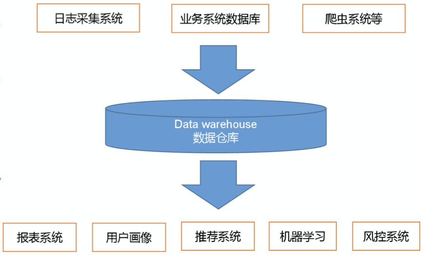
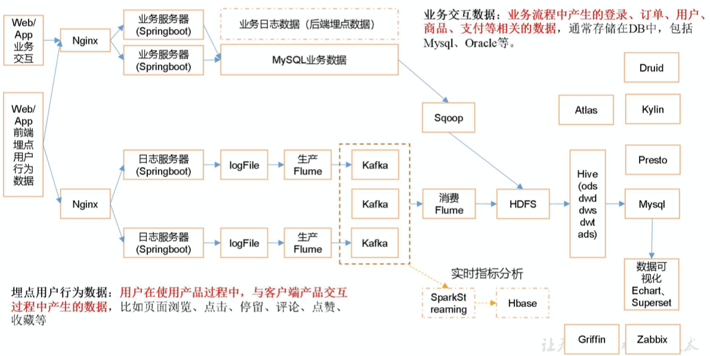
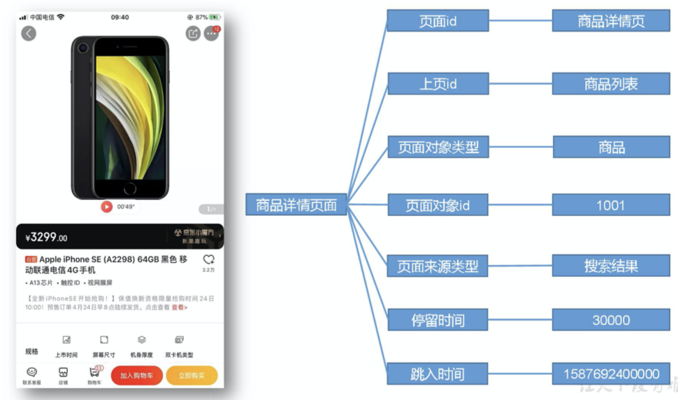
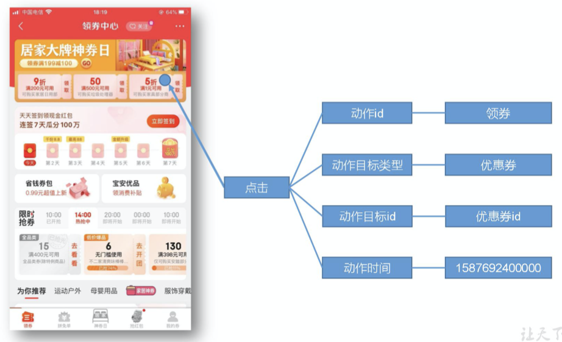
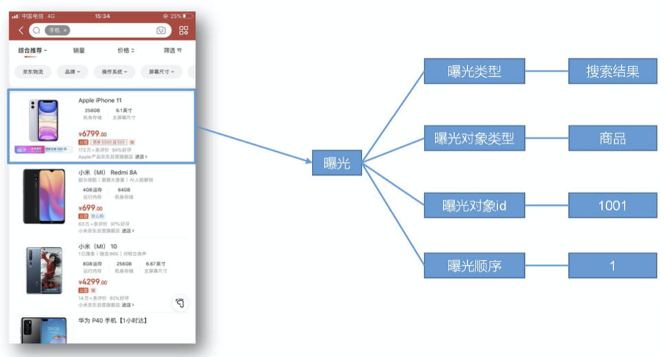
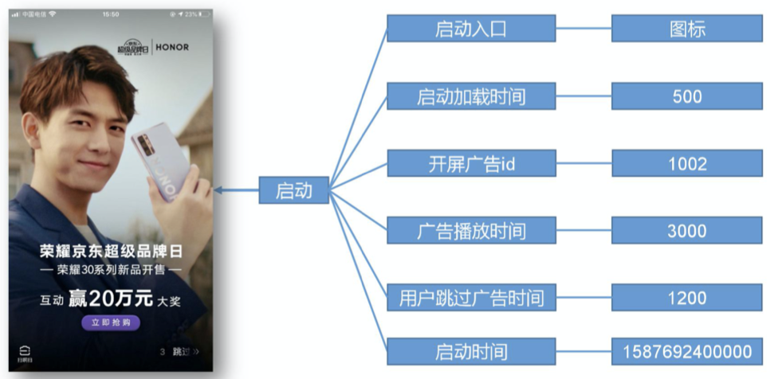

# 数仓概念

数据仓库（Data Warehouse）是为企业所有决策制定过程，提供所有系统数据支持的战略集合。

通过对数据仓库中数据的分析，可以帮助企业，改进业务流程、控制成本、提高产品质量等。

数据仓库，并不是数据的最终目的地，而是为数据最终的目的地做好准备。这些准备包括对数据的：清洗，转义，分类，重组，合并，拆分，统计等。



# 项目需求及架构设计

## 项目需求分析

一、项目需求

1. 用户行为数据采集平台搭建；
2. 业务数据采集平台搭建；
3. 数据仓库维度建模；
4. 分析，设备、会员、商品、地区、活动等电商核心主题，统计的报表指标近100个。完全对标中型公司。
5. 采用即席查询工具，随时进行指标分析；
6. 对集群性能进行监控，发生异常需要报警；
7. 元数据管理；
8. 质量监控。

## 项目框架

### 技术选型

主要考虑因素：数据量大小，业务需求，行业内经验，技术成熟度，开发维护成本，总成本预算。

- 数据采集传输：==Flume，Kafka，Sqoop==，Logstash，DataX；
- 数据存储：==MySQL，HDFS==，HBase，Redis，MongoDB；
- 数据计算：==Hive，Tez，Spark==，Flink，Storm；
- 数据查询：==Presto，Kylin==，Impala，Druid；
- 数据可视化：Echarts，==Superset==，QuickBI，DataY；
- 任务调度：==Azkaban==，Oozie；
- 集群监控：Zabbix；
- 元数据管理：Atlas；

### 系统数据流程设计



### 框架版本选型

1. 如何选择Apache、CDH、HDP版本？

   1. Apache：运维麻烦，组件间兼容性需要自己调研。（一般大厂使用，技术实力雄厚，有专业的运维人员）（==建议使用==）
   2. CDH：国内使用最多的版本，但CM不开源，今年开始要收费，一个节点1万美金。
   3. HDP：开源，可以进行二次开发，但是没有CDH稳定，国内使用较少。

2. 具体版本型号。

   | 框架        | 旧版本   | 新版本     |
   | ----------- | -------- | ---------- |
   | Hadoop      | 2.7.2    | 3.1.3      |
   | ZooKeeper   | 3.4.10   | 3.5.7      |
   | MySQL       | 5.6.24   | 5.7.16     |
   | Hive        | 1.2.1    | 3.1.2      |
   | Flume       | 1.7.0    | 1.9.0      |
   | Kafka       | 0.11-0.2 | 2.11-2.4.1 |
   | Kafka Eagle | 1.3.7    | 1.4.5      |
   | Azkaban     | 2.5.0    | 3.84.4     |
   | Spark       | 2.1.1    | 3.0.0      |
   | HBase       | 1.3.1    | 2.0.5      |
   | Phoenix     | 4.14.1   | 5.0.0      |
   | Sqoop       | 1.4.6    |            |
   | Presto      | 0.189    |            |
   | Kylin       | 2.5.1    | 3.0.1      |
   | Atlas       | 0.8.4    | 2.0.0      |
   | Ranger      | 2.0.0    |            |
   | Solr        | 5.2.1    | 7.7.0      |

注意事项：框架选型尽量不要选最新的，因为其他组件可能还没适配，选最新版本半年前左右的稳定版。

### 服务器选型

1. 物理机：
   - 以128G内存，20核物理CPU，40线程，8THDD和2TSSD硬盘，戴尔品牌单台报价4W出头。一般物理机寿命5年左右。
   - 需要专业运维，平均一个月1万。电费也不少。
2. 云主机：
   - 以阿里云为例，差不多相同配置，每年5W，包含电费；
   - 很多运维工作都由阿里云完成，运维相对较轻松；
3. 企业选择：
   - 金融有钱公司和阿里没有直接冲突的公司选择阿里云；
   - 中小公司、为了融资上市，选择阿里云，拉到投资后买物理机；
   - 有长期打算，资金比较足，选择物理机；

### 集群资源规划

#### 生产集群规模

1. 如何确定集群规模？（假设：每台服务器8T硬盘，128G内存）
   - 每天日活用户100万，每人一天平均100条：100万*100条=1亿条；
   - 每条日志1K左右，每天1亿条：1亿/1024/1024=约100G
   - 半年内不扩容服务器来算：100G*180天=约18T；
   - 保存3副本：18T*3=54T；
   - 预留20% ~ 30%Buf = 54T/0.7=77T；
   - 算到这：约8T*10台服务器；
   - 数仓分多层，在当前基础上再扩展1到2倍：`约8T*10台*2|3服务器=20~30台`；
2. 如果考虑数仓分层？数据采用压缩？重新计算，采用snappy或lzo压缩率在60%左右。

#### 测试集群服务器规划

整体原则

- 资源均衡
- 有依赖的服务需要在同一个节点，例如Azkaban的Executor调度Hive或Sqoop，需要在一个节点。

| 服务名称         | 子服务                | 服务器Hadoop101 | 服务器Hadoop102 | 服务器Hadoop103 |
| ---------------- | --------------------- | --------------- | --------------- | --------------- |
| HDFS             | NameNode              | √               |                 |                 |
|                  | DataNode              | √               | √               | √               |
|                  | SecondaryNameNode     |                 |                 | √               |
| Yarn             | NodeManager           | √               | √               | √               |
|                  | ResourceManager       |                 | √               |                 |
| ZooKeeper        | ZooKeeper Server      | √               | √               | √               |
| Flume(采集日志)  | Flume                 | √               | √               |                 |
| Kafka            | Kafka                 | √               | √               | √               |
| Flume(消费Kafka) | Flume                 |                 |                 | √               |
| Hive             | Hive                  | √               |                 |                 |
| MySQL            | MySQL                 | √               |                 |                 |
| Sqoop            | Sqoop                 | √               |                 |                 |
| Presto           | Coordinator           | √               |                 |                 |
|                  | Worker                |                 | √               | √               |
| Azkaban          | Azkaban WebServer     | √               |                 |                 |
|                  | AzkabanExecutorServer | √               |                 |                 |
| Kylin            |                       | √               |                 |                 |
| HBase            | HMaster               | √               |                 |                 |
|                  | HRegionServer         | √               | √               | √               |
| Superset         |                       | √               |                 |                 |
| Atlas            |                       | √               |                 |                 |
| Solr             | Jar                   | √               |                 |                 |
| 服务器总计       |                       | 18              | 8               | 8               |

# 数据生成模块

## 目标数据

我们要收集和分析的数据主要包括：页面数据，事件数据，曝光数据，启动数据和错误数据。

### 页面

页面数据主要记录一个页面的用户访问情况，包括访问时间、停留时间、页面路径等信息。



| 字段名称       | 字段描述                                                     |
| -------------- | ------------------------------------------------------------ |
| page_id        | 页面 id, home("首页"),category("分类页"), discovery("发现页"), top_n("热门排行"), favor("收藏页"),search("搜索页"), good_list("商品列表页"), good_detail("商品详情"), good_spec("商品规格"), comment("评价"), comment_done("评价完成"), comment_list("评价列表"), cart("购物车"), trade("下单结算"), payment("支付页面"), payment_done("支付完成"), orders_all("全部订单"), orders_unpaid("订单待支付"), orders_undelivered("订单待发货"), orders_unreceipted("订单待收货"), orders_wait_comment("订单待评价"), mine("我的"), activity("活动"), login("登录"), register("注册"); |
| last_page_id   | 上页 id                                                      |
| page_item_type | 页面对象类型, sku_id("商品 skuId"), keyword("搜索关键词"), sku_ids("多个商品 skuId"), activity_id("活动 id"), coupon_id("购物券 id"); |
| page_item      | 页面对象 id                                                  |
| sourceType     | 页面来源类型, promotion("商品推广"), recommend("算法推荐商品"), query("查询结果商品"), activity("促销活动"); |
| during_time    | 停留时间（毫秒）                                             |
| ts             | 跳入时间                                                     |

### 事件

事件数据主要记录应用内一个具体操作行为，包括操作类型、操作对象、操作对象描述等信息。



| 字段名称  | 字段描述                                                     |
| --------- | ------------------------------------------------------------ |
| action_id | 动作 id, favor_add("添加收藏"), favor_canel("取消收藏"), cart_add("添加购物车"), cart_remove("删除购物车"), cart_add_num("增加购物车商品数量"), cart_minus_num("减少购物车商品数量"), trade_add_address("增加收货地址"),get_coupon("领取优惠券");   注：对于下单、支付等业务数据，可从业务数据库获取。 |
| item_type | 动作目标类型, sku_id("商品"), coupon_id("购物券");           |
| item      | 动作目标 id                                                  |
| ts        | 动作时间                                                     |

### 曝光

曝光数据主要记录页面所曝光的内容，包括曝光对象，曝光类型等信息。



| 字段名称    | 字段描述                                                     |
| ----------- | ------------------------------------------------------------ |
| displayType | 曝光类型, promotion("商品推广"), recommend("算法推荐商品"), query("查询结果商品"), activity("促销活动"); |
| item_type   | 曝光对象类型, sku_id("商品 skuId"), activity_id("活动 id");  |
| item        | 曝光对象 id                                                  |
| order       | 曝光顺序                                                     |

### 启动

启动数据记录应用的启动信息。



| 字段名称        | 字段描述                                                     |
| --------------- | ------------------------------------------------------------ |
| entry           | 启动入口 icon("图标"), notification("通知"), install("安装后启动"); |
| loading_time    | 启动加载时间                                                 |
| open_ad_id      | 开屏广告 id                                                  |
| open_ad_ms      | 广告播放时间                                                 |
| open_ad_skip_ms | 用户跳过广告时间                                             |
| ts              | 启动时间                                                     |

### 错误

错误数据记录应用使用过程中的错误信息，包括：错误编号，错误信息。

| 字段名称   | 字段描述 |
| ---------- | -------- |
| error_code | 错误码   |
| msg        | 错误信息 |

## 数据埋点

### 主流埋点方式（了解）

目前主流的埋点方式，有三种：代码埋点（前端/后端），可视化埋点，全埋点。

代码埋点：是通过调用埋点 SDK 函数，在需要埋点的业务逻辑功能位置调用接口，上报 埋点数据。例如，我们对页面中的某个按钮埋点后，当这个按钮被点击时，可以在这个按钮 对应的 OnClick 函数里面调用 SDK 提供的数据发送接口，来发送数据。

可视化埋点：只需要研发人员集成采集 SDK，不需要写埋点代码，业务人员就可以通过 访问分析平台的“圈选”功能，来“圈”出需要对用户行为进行捕捉的控件，并对该事件进 行命名。圈选完毕后，这些配置会同步到各个用户的终端上，由采集 SDK 按照圈选的配置 自动进行用户行为数据的采集和发送。

全埋点：是通过在产品中嵌入 SDK，前端自动采集页面上的全部用户行为事件，上报埋 点数据，相当于做了一个统一的埋点。然后再通过界面配置哪些数据需要在系统里面进行分 析。

### 埋点数据日志结构

我们的日志结构大致可分为两类，一是普通页面埋点日志，二是启动日志。 

普通页面日志结构如下，每条日志包含了，当前页面的页面信息，所有事件（动作）、 所有曝光信息以及错误信息。除此之外，还包含了一系列公共信息，包括设备信息，地理位置，应用信息等，即下边的 common 字段。

1. 普通页面埋点日志格式

   ```json
   {
   	"common": { --公共信息 
   		"ar": "230000", --地区编码 
   		"ba": "iPhone", --手机品牌 
       "ch": "Appstore", --渠道 
       "md": "iPhone 8", --手机型号 
   		"mid": "YXfhjAYH6As2z9Iq", --设备 id 
   		"os": "iOS 13.2.9", --操作系统 
   		"uid": "485", --会员 id 
   		"vc": "v2.1.134" --app 版本号
   	},
   	"actions": [--动作(事件) 
   		{
   			"action_id": "favor_add", --动作 id 
   			"item": "3", --动作目标 id 
   			"item_type": "sku_id",	--动作目标类型 
   			"ts": 1585744376605	--动作时间
   		}]，
   	"displays": [{
   		"displayType": "query", --曝光类型
   		"item": "3", --曝光对象id
   		"item_type": "sku_id", -- 曝光对象类型
   		"order": 1 --曝光顺序
   	}, {
   		"displayType": "promotion",
   		"item": "6",
   		"item_type": "sku_id",
   		"order": 2
   	}, {
   		"displayType": "promotion",
   		"item": "9",
   		"item_type": "sku_id",
   		"order": 3
   	}, {
   		"displayType": "recommend",
   		"item": "6",
   		"item_type": "sku_id",
   		"order": 4
   	}, {
   		"displayType": "query ",
   		"item": "6",
   		"item_type": "sku_id",
   		"order": 5
   	}],
   	"page": {	--页面信息 
   		"during_time": 7648,--停留时间（ 毫秒） 
   		"page_item": "3", --页面对象 id 
   		"page_item_type": "sku_id", --页面对象类型 
   		"last_page_id": "login",--上页 id 
   		"page_id": "good_detail",--页面 ID 
   		"sourceType": "promotion"--页面来源类型
   	},
   	"err": {		--错误 
   		"error_code": "1234",--错误码 
   		"msg": "***********" --错误信息
   	},
   	"ts": 1585744374423		--跳入时间
   }
   ```

2. 启动日志格式

   启动日志结构相对简单，主要包含公共信息，启动信息和错误信息。

   ```json
   {
   	"common": {
   		"ar": "370000",
   		"ba": "Honor",
   		"ch": "wandoujia",
   		"md": "Honor 20s",
   		"mid": "eQF5boERMJFOujcp",
   		"os": "Android 11.0",
   		"uid": "76",
   		"vc": "v2.1.134"
   	},
   	"start": {
   		"entry": "icon",	--启动入口 
       "loading_time": 18803,	--启动加载时间 
       "open_ad_id": 7,	--开屏广告 id 
       "open_ad_ms": 3449,		--广告播放时间 
       "open_ad_skip_ms": 1989 --用户跳过广告时间
   	},
   	"err": {	--错误 
   		"error_code": "1234",		--错误码 
   		"msg": "***********"  --错误信息
   	},
   	"ts": 1585744304000  --启动时间
   }
   ```

### 埋点数据上报时机

埋点数据上报时机包括两种方式。 

- 方式一，在离开该页面时，上传在这个页面发生的所有事情（页面、事件、曝光、错误 等）。优点：批处理，减少了服务器接收数据压力。缺点：不是特别及时。 
- 方式2，每个事件、动作、错误等，产生后立即发送。优点：响应及时。缺点：对服务器接收数据压力比较大

## 服务器和 JDK 准备

### 服务器准备

安装如下文档配置步骤，分别安装 hadoop102、hadoop103、hadoop104 三台主机。

### 阿里云服务器准备（可选）

文档

### JDK 准备

1. 卸载现有 JDK（3 台节点）

   ```sh
   sudo rpm -qa | grep -i java | xargs -n1 sudo rpm -e --nodeps
   ```

2. 用 SecureCRT 工具将 JDK 导入到 hadoop102 的/opt/software 文件夹下面；

3. 解压 JDK 到/opt/module 目录下

4. 配置 JDK 环境变量

   ```sh
   # 新建/etc/profile.d/my_env.sh 文件
   sudo vim /etc/profile.d/my_env.sh
   # 添加如下内容，然后保存（:wq）退出
   #JAVA_HOME 
   export JAVA_HOME=/opt/module/jdk1.8.0_212 
   export PATH=$PATH:$JAVA_HOME/bin
   # 让环境变量生效
   source /etc/profile.d/my_env.sh
   # 测试 JDK 是否安装成功
   java -version
   ```

5. 分发

   ```sh
   # 分发 JDK
   xsync /opt/module/jdk1.8.0_212/
   # 分发环境变量配置文件
   sudo /home/atguigu/bin/xsync/etc/profile.d/my_env.sh
   # 让配置生效，分别在 hadoop103、hadoop104 上执行 source
   source /etc/profile.d/my_env.sh
   ```

## 模拟数据

### 使用说明

1. 将 application.properties、gmall2020-mock-log-2020-04-01.jar、path2.json 上传到hadoop102 的/opt/module/applog 目录下。

2. 配置文件

   1. application.properteis 文件

      ```sh
      # 可以根据需求生成对应日期的用户行为日志。
      # 修改如下内容
      ######################################
      logging.level.root=info 
      #业务日期 注意：并不是生成日志的日期 
      mock.date=2020-06-14 
      #启动次数 
      mock.startup.count=100 
      #设备最大值 
      mock.max.mid=50 
      #会员最大值 
      mock.max.uid=500 
      #商品最大值 
      mock.max.sku-id=10 
      #页面平均访问时间 
      mock.page.during-time-ms=20000 
      #错误概率 
      mock.error.rate=3 
      #日志发送延迟
      mock.log.sleep=100 
      #商品详情来源 用户查询，商品推广，智能推荐, 促销活动 
      mock.detail.source-type-rate=40:25:15:20
      ```

      

   

   

